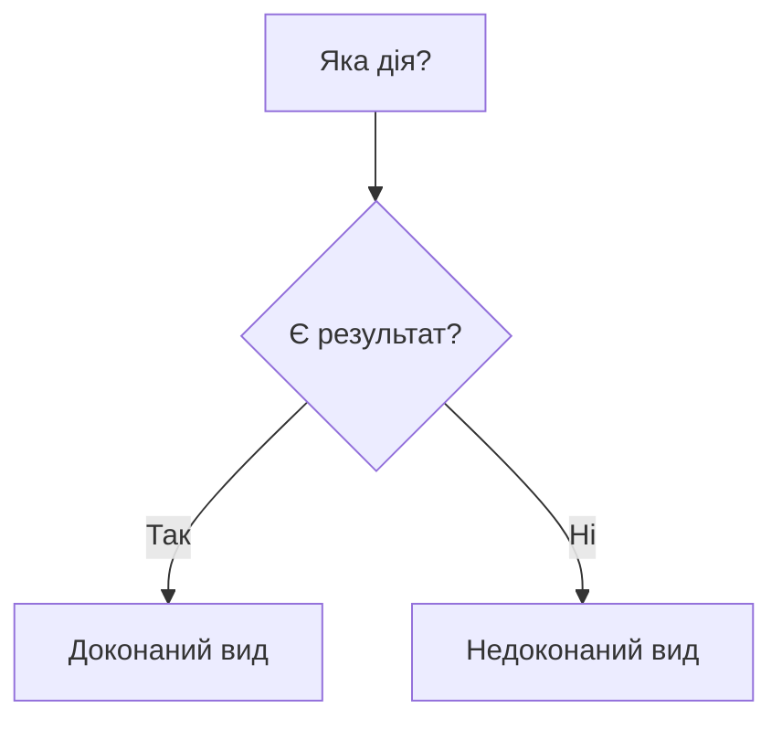

# Phase 2: Content Writing

> **You are Gemini, executing Phase 2 of an orchestrated rebuild.**
> **Your ONLY task: Write the lesson prose. Overshoot to 1.5x the word target.**

## Your Input

Read these files from disk:

**Research notes** (your factual foundation — use exhaustively):
```
{RESEARCH_PATH}
```

**Meta file** (content_outline with word allocations):
```
{META_PATH}
```

**Plan file** (objectives, vocabulary_hints — use ONLY these words):
```
{PLAN_PATH}
```

**Level quick-ref** (constraints, immersion %, engagement minimums):
```
{QUICK_REF_PATH}
```

## Your Task

Write the full lesson prose for **{TOPIC_TITLE}** ({TRACK} track, word target: {WORD_TARGET}).

### Critical Rules

1. **OVERSHOOT**: Write to **1.5x the word_target** ({OVERSHOOT_TARGET} words). Trimming is cheap; expanding is expensive.
2. **Section-by-section**: Follow `content_outline` exactly. Every section must appear as an H2 heading.
3. **Research-driven**: Use research notes exhaustively. Every fact, date, quote, and source should appear in the prose.
4. **Vocabulary discipline**: Use ONLY vocabulary from the plan's `vocabulary_hints`. Do NOT invent new terms.
5. **Engagement boxes**: Include {ENGAGEMENT_MIN}+ engagement callouts (`[!tip]`, `[!myth-buster]`, `[!quote]`, `[!history-bite]`, `[!context]`, `[!decolonization]`, `[!culture]`, `[!warning]`).
6. **Example sentences**: Include {EXAMPLE_MIN}+ example sentences formatted as `_Приклад:_ «...»`
7. **Immersion**: {IMMERSION_RULE}
8. **Ukrainian quotes**: Use angular quotes `«...»`, not straight quotes
9. **No frontmatter**: Content starts with `<!-- SCOPE ... -->` comment, then `# Title`
10. **Visual aids** (grammar modules): Use tables and mermaid flowcharts when they clarify a concept better than prose. Tables for comparing patterns, paradigms, categories. Mermaid for decision logic (aspect choice, case selection). Don't force them — use when pedagogically reasonable.

### Pedagogical Visual Aids (Grammar Modules)

Grammar modules benefit from visual structure. Use these tools when they ADD clarity — don't force them where prose works fine.

**Tables** — Consider using for:
- Part-of-speech summaries (term | function | example)
- Conjugation/declension paradigms
- Aspect pair comparisons (imperfective vs perfective)
- Case function summaries (case | question | usage)

**Mermaid flowcharts** — Consider using for:
- "Which aspect do I use?" decision trees
- "Which case after this preposition?" logic
- Word formation processes (prefix + root → meaning)

Example table:
| Вид | Значення | Сигнальні слова |
|-----|----------|----------------|
| Недоконаний | процес, тривалість | завжди, часто, довго |
| Доконаний | результат, завершення | вже, нарешті, раптом |

Example mermaid:


**Rule of thumb:** If you're comparing 2+ patterns or explaining a sequential decision, a table or flowchart is almost always better than a paragraph. But if the explanation is simple and linear, prose is fine.

### Anti-Patterns (DO NOT)

- **Robotic transitions**: "Тепер розглянемо...", "Далі ми побачимо..." — use natural connectors instead
- **Russianisms**: кушати→їсти, приймати участь→брати участь, слідуючий→наступний
- **Calques**: робити сенс→мати сенс, брати місце→відбуватися
- **Template repetition**: Don't start 3+ sentences the same way
- **Dry exposition**: Use storytelling, not textbook listing
- **Fact duplication**: Each date/quote/statistic appears in ONE section only. Cross-reference with "Як зазначалося вище..." if needed.

### Pedagogical Excellence Standards (MANDATORY)

**This content teaches foreigners Ukrainian. Every section must help the learner UNDERSTAND, not just present information.**

1. **Simple → Complex Progression** — Within each section, start with the simplest form/usage, then build to complex. Never introduce a complex concept before its foundation. WRONG: jump to exceptions before the rule. RIGHT: rule → examples → exceptions → edge cases.

2. **Concept Before Use** — Every grammatical term, word class, or structure must be explicitly explained BEFORE it appears in examples or exercises. Never assume the learner already knows a term from a previous module unless the meta says so. WRONG: using "доконаний вид" in examples before explaining what aspect means. RIGHT: define aspect → explain доконаний → then use in examples.

3. **Contextualized Grammar** — Grammar is a tool, not a list. Every rule must connect to real communication. For each grammar point: WHY does a Ukrainian speaker need this? WHEN do they use it? WRONG: "Давальний відмінок відповідає на питання «кому?»" (definition only). RIGHT: "Коли ви хочете подарувати щось другу — вам потрібен давальний відмінок" (real motivation, then formal definition).

4. **Active Learning Prompts** — Every major section must include at least one moment where the learner pauses to think. Use callouts like `[!tip] Спробуйте самі`, `[!context] Подумайте`, or inline "Зверніть увагу:" prompts. These are NOT exercises (those are Phase 3) — they are cognitive checkpoints that deepen understanding.

5. **Mnemonic Aids** — For complex patterns (case endings, aspect pairs, verb conjugations), provide memory aids: visual patterns, rhymes, analogies to familiar concepts, or comparison tables that reveal the underlying logic. WRONG: listing 7 case endings as raw data. RIGHT: showing the pattern/logic that connects them, with a mnemonic or analogy.

6. **Cultural Anchoring** — Connect at least 2-3 grammar or vocabulary points to Ukrainian cultural context (literature, proverbs, songs, traditions). This makes abstract grammar memorable and grounds it in the living language. Reference real Ukrainian figures (Шевченко, Леся Українка, Франко) when their quotes illustrate the grammar point naturally.

7. **Error Prevention** — Anticipate common learner mistakes (especially for speakers of English, Polish, Russian). For each major grammar point, include at least one "common mistake" callout: `[!warning]` with the wrong form and the correct alternative. This is especially critical for Russianisms that learners may encounter online.

### Presentation Quality Standards (MANDATORY)

8. **Presentation Consistency** — When explaining N items in a category (cases, POS, tenses): SAME format, SAME depth (±20%), SAME example count (±1). WRONG: 6 in table + 3 in list + 1 casual mention. RIGHT: all 10 in one consistent format.

9. **Equal Treatment** — No category item as afterthought. If teaching 7 cases, each gets proportional depth. Even simpler items get a dedicated block with example + usage note.

10. **Parallel Structure** — Matching sections in content_outline use identical internal pattern. If Section A = [intro → table → examples → callout], Section B = same.

11. **English Scaffolding by Immersion Level** — The plan's `immersion` field controls how much English is allowed:
    - **Immersion ≥ 95%**: Zero English. No parenthetical translations, no code-switching. Only exception: vocabulary table "Переклад" column.
    - **Immersion 85-94%**: English only for disambiguation of false friends or confusing term pairs. No English paragraphs.
    - **Immersion 75-84%**: English in tip/note callouts for tricky abstract concepts. No inline English in prose.
    - **Immersion 65-74% (bridge entry)**: English intro paragraph allowed (max 1). Parenthetical English equivalents on FIRST introduction of each new term. After first introduction → Ukrainian only. English explanatory text in callouts only, not mixed into Ukrainian prose.
    - **All levels**: Ukrainian term comes FIRST, English follows in parentheses. Never English-first.
    - Pre-output check: search for Latin characters outside proper nouns and verify they match the immersion rules above.

12. **Section Title Language** — Immersion >= 85%: all H2/H3 titles in Ukrainian. Below 85%: Ukrainian preferred, English acceptable for clarity.

13. **Example Variety** — FORBIDDEN: 5+ consecutive `_Приклад:_` lines. Mix formats: standalone examples (max 3-4 per section), comparison tables, inline examples within prose, mini-dialogues, callout boxes with examples.

14. **Callout Formatting Precision** — Exact syntax: `> [!tip] Title` then `> text`. No dangling `**`. Spread callouts evenly across sections — not all bunched at the end.

### Depth & Structure Standards (MANDATORY)

15. **Each Concept Gets Its Own H3** — When teaching N items in a category (10 parts of speech, 7 cases, 5 tenses), EVERY item MUST get its own `### H3` subsection. NEVER group items in pairs, compress into a single table-only presentation, or mention items casually in prose. WRONG: "Прислівник і числівник" sharing one heading. RIGHT: `### Прислівник` then `### Числівник` as separate blocks.

16. **Depth Over Compression** — Each H3 concept block must contain: (a) definition/explanation (2+ sentences), (b) the question it answers or its grammatical function, (c) 2+ example sentences, (d) a usage note or cultural context. Minimum ~80-100 words per concept block. WRONG: a 20-word table row. RIGHT: a full mini-lesson.

17. **Syntactic Roles in Grammar Modules** — Grammar modules that cover sentence structure must include syntactic roles: підмет (subject), присудок (predicate), додаток (object), означення (attribute), обставина (adverbial). If the content_outline includes a section on sentence structure or word building, dedicate a subsection to syntactic roles.

18. **English Bridging Budget (Bridge Modules)** — For modules with immersion < 90% (B1.0 bridge, M01-M05):
    - **L1 scaffolding with L2 primacy**: Ukrainian term FIRST, English equivalent in parentheses on first introduction only. After that, Ukrainian exclusively.
    - **English paragraphs**: MAX 1 short paragraph in the introduction explaining why this topic matters. All other content in Ukrainian.
    - **English in callouts**: OK for `[!tip]` or `[!note]` that explain abstract concepts the learner hasn't encountered in Ukrainian yet. Keep brief (1-2 sentences).
    - **Graduated fade**: M01 (65%) uses more scaffolding than M05 (90%). Check the plan's `immersion` field.
    - WRONG: English scattered throughout sections, English-first term introductions, full English explanations mid-lesson.
    - RIGHT: English intro paragraph → Ukrainian terms with (English) on first use → pure Ukrainian from section 2 onward.

19. **Callout Type Variety** — Use at least 4 DIFFERENT callout types across the module. Available types: `[!tip]`, `[!warning]`, `[!context]`, `[!quote]`, `[!myth-buster]`, `[!observe]`, `[!analysis]`, `[!fact]`, `[!culture]`, `[!history-bite]`, `[!decolonization]`. WRONG: 8 callouts all `[!tip]`. RIGHT: mix of tip, warning, observe, quote, culture.

20. **Self-Check Questions** — The Підсумок section must include 4-6 self-assessment questions that test whether the learner understood the key concepts. Format: numbered list of questions the learner should be able to answer. These are comprehension checks, not exercises.

### Pre-Output Checklist (verify BEFORE writing ===CONTENT_START===)

Before producing your final output, mentally verify each item:

1. ☐ Every section from `content_outline` appears as H2/H3
2. ☐ Total word count >= {WORD_TARGET} (overshoot to {OVERSHOOT_TARGET})
3. ☐ {ENGAGEMENT_MIN}+ engagement callouts spread across sections
4. ☐ {EXAMPLE_MIN}+ example sentences in varied formats
5. ☐ Immersion matches {IMMERSION_RULE}
6. ☐ **Consistency check**: all items in each category use same format and depth
7. ☐ **Parallel structure**: matching sections follow identical internal pattern
8. ☐ **Example variety**: no 5+ consecutive `_Приклад:_` — formats are mixed
9. ☐ **Callout spread**: engagement boxes distributed evenly, not bunched
10. ☐ **English scaffolding check**: Latin characters in prose match the immersion level rules (bridge modules allow controlled English; B1.6+ = zero English)
11. ☐ **Section titles**: all H2/H3 in Ukrainian (if immersion >= 85%)
12. ☐ **Pedagogical flow**: simple → complex within each section, concept before use
13. ☐ **Each concept = own H3**: every item in a category has its own subsection (not grouped/compressed)
14. ☐ **Depth per concept**: each H3 block has definition + questions + 2+ examples + usage note (~80-100 words)
15. ☐ **Callout variety**: at least 4 different callout types used across the module
16. ☐ **Self-check questions**: Підсумок has 4-6 self-assessment questions

### Section Word Buffer

The audit counts ~100-150 fewer words than raw `wc -w` due to excluding blockquote/callout markup. For a section with 600-word allocation, write 700-750 raw words.

### Output Format

> **DELIMITER ENFORCEMENT**: Content outside delimiters is automatically discarded by the extraction pipeline.

Return the full lesson content as markdown:

```
===CONTENT_START===

<!-- SCOPE
Covers: {what this module teaches}
Not covered:
  - {related topic} → {slug}
Related: {connected slugs}
-->

# {Title}

> **Чому це важливо?**
>
> {2-3 sentences of significance}

## {Section 1 from content_outline}

{Content: aim for 1.5x the section word allocation}

{Engagement boxes woven in naturally}

## {Section 2}

{Content...}

...

---

# Підсумок

{3-4 paragraph summary, ~150-200 words}

---

===CONTENT_END===
```

After the content block, report word counts:

```
===WORD_COUNTS===
Section "{name}": {count} words (target: {allocation})
...
Total: {total} words (target: {WORD_TARGET}, ratio: {total/WORD_TARGET}x)
===WORD_COUNTS===
```

## Friction Report (MANDATORY)

After your content and word counts, output a friction report. This is required even if nothing went wrong:

```
===FRICTION_START===
**Phase**: Phase 2: Content
**Step**: {what you were doing when friction occurred, or "Full content generation"}
**Friction Type**: YAML_SCHEMA_VIOLATION | TOKEN_LIMIT_TRUNCATION | TOOL_REDUNDANCY | NONE
**Raw Error**: {actual error or "None"}
**Self-Correction**: {what you changed to work around it, or "N/A"}
**Proposed Tooling Fix**: {if the friction is a script/design issue, or "N/A"}
===FRICTION_END===
```

## Boundaries

- Do NOT generate activities, exercises, or vocabulary tables — those are Phase 3
- Do NOT add vocabulary outside the plan's vocabulary_hints
- Do NOT skip sections from the content_outline
- Do NOT write fewer than {WORD_TARGET} words total
- Do NOT request skills or delegate to Claude
- If you cannot find enough material for a section, write what you can and add:
  `NEEDS_HELP: Insufficient material for section "{name}". Need additional research on {topic}.`
  `HELP_TYPE: research`
