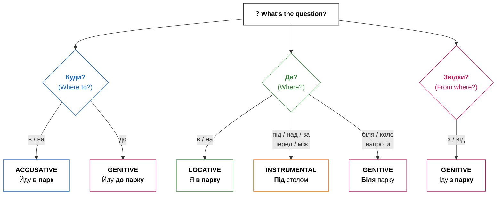

# Орудний відмінок? Ні, усі відмінки! Просторова орієнтація

## Introduction / Вступ

Привіт! Ready to navigate Ukraine like a local? Prepositions are small but mighty words that connect nouns to the rest of the sentence. In English, prepositions like «in,» «on,» «to,» and «from» are straightforward. But in Ukrainian, prepositions work hand-in-hand with grammatical cases — and some prepositions even change meaning depending on which case follows them! This is one of the most exciting parts of learning Ukrainian because it allows you to be extremely precise about where things are and where they are going. Mastering this is like unlocking a 3D map of the language.

This module is your comprehensive guide to Ukrainian spatial prepositions. By the end, you'll understand how to combine prepositions with the correct cases to express location and motion accurately. Understanding these spatial relationships is the key to navigating any Ukrainian city, describing your home, or simply finding your keys! Whether you are asking for directions to the Maidan or explaining that your cat is under the sofa, these tiny words are your best allies.

**Що ви навчитеся:**
- Відповідати на питання **Де?**, **Куди?**, **Звідки?** правильно
- Обирати правильний відмінок для кожного прийменника
- Орієнтуватися в українському місті як місцевий житель

**Чому це важливо:** Неправильне поєднання прийменників і відмінків — одна з найпоширеніших помилок. Опанування цих шаблонів одразу зробить вашу українську мову природнішою і точнішою. Це не просто слова, це логіка простору. Коли ви розумієте просторову логіку, мова стає чіткою структурою, а не набором звуків. Це фундамент для вільного спілкування.

## Presentation / Презентація

### The Primary Logic: Motion vs. Location (Рух чи місце?)

Найважливіша концепція — це різниця між "Де?" (**Where?**) і "Куди?" (**Where to?**). В українській мові прийменники змінюють відмінок залежно від цього розрізнення. Це геніальна особливість мови, яка запобігає двозначності.

The most important concept to master is the difference between "Where?" (**Де?**) and "Where to?" (**Куди?**). In Ukrainian, several prepositions change the case they govern based on this distinction. This is a brilliant feature of the language that prevents ambiguity.

| Питання | Прийменник | Відмінок | Приклад |
|---------|------------|----------|---------|
| **Куди?** | в, на, під, за | Знахідний | Йду **в парк** |
| **Куди?** | до | Родовий | Йду **до парку** |
| **Де?** | в, на | Місцевий | Я **в парку** |
| **Де?** | під, над, за, перед, між | Орудний | Під **столом** |
| **Де?** | біля, коло, напроти | Родовий | Біля **парку** |
| **Звідки?** | з, від | Родовий | Іду **з парку** |

| Прийменник | Рух                  | Місце                  |
| :--------- | :------------------- | :--------------------- |
| **в / у**  | Йти **в школу**.     | Бути **в школі**.      |
| **на**     | Класти **на стіл**.  | Лежати **на столі**.   |
| **під**    | Класти **під стіл**. | Лежати **під столом**. |
| **за**     | Йти **за будинок**.  | Бути **за будинком**.  |

Коли ви говорите про рух (куди?), ви наче "цілитеся" в об'єкт, тому використовуєте знахідний відмінок. Це дуже логічно: ви спрямовуєте свою енергію на предмет. Коли ви описуєте місце (де?), ви фіксуєте стан спокою, тому використовуєте місцевий або орудний відмінки. Вибір залежить від конкретного прийменника. Наприклад, **в** та **на** традиційно потребують місцевого відмінка для позначення знаходження.

### Prepositions with the Instrumental Case (З орудним відмінком)

The Instrumental case is very versatile. Besides "means" and "roles," it is the standard case for prepositions that describe "static" spatial relationships like *under*, *above*, *behind*, or *between*. These prepositions help us pinpoint exactly where an object is located in relation to others.

- **під** (under) -> Кіт спить **під столом**.
- **над** (above) -> Лампа висить **над столом**.
- **перед** (in front of) -> Машина стоїть **перед будинком**.
- **за** (behind) -> Сад знаходиться **за будинком**.
- **між** (between) -> Дзеркало висить **між вікнами**.

Ці прийменники завжди вимагають орудного відмінка, коли ми описуємо, де знаходиться предмет.

| Рід | Закінчення | Приклад |
|-----|------------|---------|
| Чоловічий | **-ом** / **-ем** | під стол**ом**, перед учител**ем** |
| Жіночий | **-ою** / **-ею** | за шаф**ою**, над земл**ею** |
| Середній | **-ом** / **-ем** | над вікн**ом**, під мор**ем** |
| Plural | **-ами** / **-ями** | між вікн**ами**, перед двер**има** |

Note: Some nouns have special plural forms (двері → двер**има**, діти → діть**ми**).

### Genitive Prepositions (З родовим відмінком)

Many spatial prepositions also use the **Genitive case** (**родовий відмінок**), especially those indicating origin, purpose, or proximity. The Genitive case is often used to show starting points or limits.

- **до** (to / towards) -> Я йду **до школи**. (Towards the school)
- **з / із** (from) -> Я йду **з роботи**. (Originating from work)
- **біля / коло** (near) -> Стіл стоїть **біля вікна**. (Proximity)
- **від** (from / away from) -> Це далеко **від центру**. (Distance)

Крім того, є прийменники, які описують складніші просторові відношення: **напроти** (opposite), **вздовж** (along) та **навколо** (around). Наприклад: «Він йде **вздовж** річки» або «Ми сидимо **навколо** вогнища». Всі ці слова вимагають родового відмінка. Це допомагає створити дуже точний опис простору. Коли ви кажете «Ми стоїмо **напроти** банку», ви чітко вказуєте локацію.

### The в/у Alternation (Милозвучність)

The choice between **в** and **у** is purely for sound (euphony). **У** is preferred after consonants or before words starting with several consonants. **В** is used after vowels.

- Він **у** лісі. (He is in the forest.)
- Вона **в** офісі. (She is in the office.)

Цей принцип милозвучності робить українську мову однією з найспівучіших у світі. Намагайтеся звертати увагу на звуки навколо цих маленьких прийменників. Це не суворе правило, але ваша мова звучатиме набагато природніше, якщо ви будете його дотримуватися.

> [!reflection] **The Logic of Space**
> Why do we use Accusative for motion? Think of it as the "target." The Accusative case marks the direct object of the motion. When the motion stops and becomes a state, we shift to cases that describe "presence" (Locative/Instrumental). This mental shift from dynamic to static is the key to mastering Ukrainian syntax.

> [!tip] **The в vs у Rule**
> Ukrainian loves harmony (euphony). Use **у** if the previous word ends in a consonant (Він **у** кімнаті). Use **в** if it ends in a vowel (Вона **в** офісі). This makes your speech flow smoothly! This rule is not a strict law but a strong recommendation for sounding like a native speaker.

## Practice / Практика

This section will test your ability to differentiate between static location and dynamic motion. Look closely at the context of each sentence.

### 1. Where is the cat? (Де кіт?)

Look at the sentences and choose the correct case (Instrumental, Locative, or Genitive).

1. Кіт за (шафа) -> **Кіт за шафою.** (He is behind it.)
2. Книга на (стіл) -> **Книга на столі.** (It is on it.)
3. Лампа над (ліжко) -> **Лампа над ліжком.** (It hangs above.)
4. Собака під (стілець) -> **Собака під стільцем.** (He is underneath.)
5. Ми в (офіс) -> **Ми в офісі.** (We are inside.)
6. Автобус біля (зупинка) -> **Автобус біля зупинки.** (It's by the stop.)

### 2. Motion vs. Location (Куди чи Де?)

Choose the correct ending (Accusative for motion, Locative for location or state).

1. Я йду в (парк) -> **Я йду в парк.** (Motion / Acc)
2. Я гуляю в (парк) -> **Я гуляю в парку.** (Location / Loc)
3. Поклади зошит на (полиця) -> **Поклади зошит на полицю.** (Motion / Acc)
4. Зошит лежить на (полиця) -> **Зошит лежить на полиці.** (Location / Loc)
5. Він їде до (місто) -> **Він їде до міста.** (Direction / Gen)

> [!important] **Always Check the Question!**
> Before you choose an ending, ask yourself: **Де?** (Location), **Куди?** (Direction), or **Звідки?** (Origin). Then check which preposition you need — the preposition determines the case, not just the question!
> - Куди? + **в/на** → Accusative (Йду **в парк**)
> - Куди? + **до** → Genitive (Йду **до парку**)
> - Де? + **в/на** → Locative (Я **в парку**)
> - Де? + **під/над/за** → Instrumental (Під **столом**)
> - Звідки? + **з/від** → Genitive (Іду **з парку**)

## Dialogues / Діалоги

### Пошук дороги (Finding the way)

**А:** Вибачте, чи є тут банк **біля** метро? (Excuse me, is there a bank near the metro?)
**Б:** Так, ідіть прямо **до** перехрестя, потім поверніть праворуч. Банк буде **за** рогом. (Yes, go straight to the intersection, then turn right. The bank will be around the corner.)
**А:** Це далеко **від** парку? (Is it far from the park?)
**Б:** Ні, це **напроти** аптеки, **між** магазином і кафе. (No, it's opposite the pharmacy, between the shop and the cafe.)
**А:** Дякую! Це було дуже зрозуміло.

### У новій квартирі (In a new apartment)

**А:** Тут дуже гарно! Де ми поставимо цей стіл? (It's very nice here! Where will we put this table?)
**Б:** Давай поставимо його **біля** вікна. Нам потрібно багато світла. (Let's put it near the window. We need lots of light.)
**А:** Добре. А куди повісимо картину? (Good. And where will we hang the picture?)
**Б:** Можна повісити її **над** ліжком або **перед** входом. (We can hang it above the bed or in front of the entrance.)
**А:** **Над** ліжком буде краще. Там вона завжди перед очима. (**Above** the bed will be better. It's always in sight there.)

> [!context] **Ukrainian Towns**
> Traditional Ukrainian towns often have a central square (**майдан** or **площа**). People meet **на площі** (Loc), go **до центру** (Gen), or walk **вздовж річки** (Gen/along the river). Spatial prepositions are the GPS of the Ukrainian soul! Navigation is not just about geography, but about the social heart of the city.

# Summary / Підсумок

**Вітаємо!** Тепер ви можете:

- ✅ Відповідати на **Де?** — використовуючи місцевий, орудний або родовий відмінок
- ✅ Відповідати на **Куди?** — використовуючи знахідний (в/на) або родовий (до)
- ✅ Відповідати на **Звідки?** — використовуючи родовий відмінок (з/від)
- ✅ Застосовувати чергування **у/в** для милозвучності
- ✅ Правильно обирати закінчення орудного відмінка для всіх родів

You've mastered one of the trickiest parts of Ukrainian grammar! These 12+ prepositions are your spatial toolkit. Whether you're asking for directions to the Maidan or describing where your cat is hiding, you now have the precision of a native speaker.

## Need More Practice?

Подивіться навколо себе. Де знаходиться ваш телефон? Де стоїть ваш комп’ютер? Напишіть 5 речень про свою кімнату, використовуючи різні прийменники та відмінки. Наприклад: «Мій телефон лежить **на столі**». Ваша щоденна практика — це запорука вашого успіху в мові!
