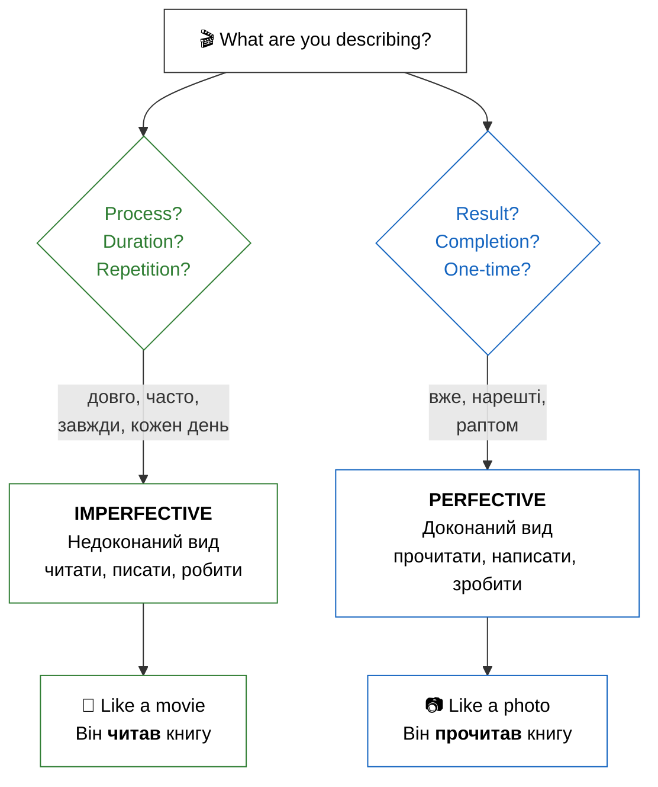

# Подорож в аспекти: Опанування дієслова (Aspect Mastery)

## Introduction / Вступ

**Ласкаво просимо!** Сьогодні ви дізнаєтесь про **аспект** — одну з найважливіших та найцікавіших тем української граматики. Це справжній переломний момент у вашому навчанні. Якщо відмінки — це кістки мови, то аспекти — це її м'язи та рух. Навчитися відчувати різницю між завершеною дією та процесом — це ключ до того, щоб звучати як справжній українець. Це дозволить вам не просто називати дії, а малювати словами яскраві картини дійсності. Кожен ваш крок у вивченні аспектів наближає вас до розуміння душевної витонченості української мови.

In Ukrainian, verbs usually exist in pairs, representing two aspects: **imperfective** (недоконаний), which focuses on the process, and **perfective** (доконаний), which focuses on the result. Understanding this will help you speak naturally and sound like a native. It's not just a technical rule — it's a way of seeing the world through the lens of duration or completion! For example, you can say «Я писав листа» (you were in the process) or «Я написав листа» (you finished the task). Ця точність надає українській мові особливої емоційності та глибини. Використання правильного аспекту — це як налаштування фокуса в камері: ви або показуєте весь процес, або показуєте результат.

**Що ви вивчите в цьому модулі:**

- The difference between **Imperfective** (process) and **Perfective** (result) aspects.
- How to recognize aspect pairs using **prefixes**.
- When to use each aspect in daily conversation.
- Common aspect pairs to describe your day.

## Presentation / Презентація

### Aspect in Practice (Аспект на практиці)

Аспект — це основа української дієслівної системи. Коли ви говорите українською, ви завжди робите вибір: показати процес або показати результат. Це не просто граматика — це філософія мови, яка пронизує кожне речення. Вибір аспекту часто відображає намір мовця та його ставлення до події. Це дозволяє нам бути дуже точними в описах подій минулого, теперішнього та майбутнього часу.

**Уявіть собі дві ситуації:**

**Ситуація 1:** Вчора ввечері я читав книгу дві години. Я читав і відпочивав. Книга була цікава, але я не закінчив.

- **Дієслово:** **читав** (недоконаний вид).
- **Фокус:** Процес, тривалість, проведення часу. Не важливо, чи є фінальний результат. Ви насолоджуєтеся самим актом читання. Книга все ще відкрита у вашій уяві. Це "триваюча" дійсність.

**Ситуація 2:** Вчора ввечері я прочитав усю книгу. Тепер я знаю, чим вона закінчується. Я можу рекомендувати її друзям.

- **Дієслово:** **прочитав** (доконаний вид).
- **Фокус:** Результат, завершена дія, підсумок. Ви закрили книгу і поклали її на полицю. Дія стала історичним фактом, який має конкретний наслідок у теперішньому. Це "зафіксована" точка часу.

### The System of Aspect Pairs (Система видових пар)

Most Ukrainian verbs come in **pairs**. This might seem like double the work, but it actually adds immense clarity to your speech. The relationship between these pairs is usually logical and follows several patterns. Internalizing these patterns will help you predict the perfective form of a new verb you encounter.

**Method 1: Prefixation (Додавання префікса)**
This is the most frequent method. A prefix (like про-, на-, з-, по-, ви-) turns an open process into a closed result. Think of the prefix as a "cap" that closes the action.

- **читати** (process of reading) -> **прочитати** (the result of having read)
- **писати** (process of writing) -> **написати** (the result: a finished text)
- **робити** (process of doing) -> **зробити** (the result: a finished job)
- **бачити** (seeing) -> **побачити** (noticing/catching sight of)
- **вчити** (studying) -> **вивчити** (learning/mastering)

**Method 2: Suffixation (Зміна суфікса)**
Sometimes the middle of the word changes. These are slightly more complex but very rhythmic once you get used to them.

- **купувати** (process of buying) -> **купити** (the result: a purchase is made)
- **відкривати** (opening) -> **відкрити** (opened)

**Method 3: Suppletion (Різні корені)**
Some of the most basic verbs use completely different roots for each aspect. You must memorize these like irregular verbs.

- **казати** (saying/telling) -> **сказати** (said/told - completed)
- **брати** (taking) -> **взяти** (taken)

> **Note:** You may see **говорити/сказати** paired in some textbooks. However, these verbs have slightly different meanings: говорити = to speak/talk (general), сказати = to say (specific statement). A true aspectual pair shares the same core meaning.

### Aspect Selection Strategy (Як обрати аспект?)

To choose the right aspect, always ask yourself: **"Am I describing a duration or a completion?"** This simple question will guide you through 90% of situations. Ukrainian speakers are very sensitive to this distinction. Contextual clues often dictate the aspect for you.

1. **Duration markers:** Always point to Imperfective. Look for words such as **довго** (long), **цілий день** (all day), **три години** (three hours).
   - *Він довго писав есе.* (He was writing the essay for a long time).
2. **Frequency markers:** These also signal the Imperfective. Common indicators include **часто** (often), **завжди** (always), **кожен день** (every day).
   - *Вона завжди купує квіти.* (She always buys flowers).
3. **Completion markers:** These require the Perfective. Watch out for **нарешті** (at last), **вже** (already), **раптом** (suddenly).
   - *Я вже зробив домашнє завдання!* (I have already done the homework!).

> [!reflection] **The Philosophy of Done**
> In Ukrainian culture, there is a strong distinction between the effort (imperfective) and the achievement (perfective). Using the perfective aspect often implies a sense of responsibility and pride in having reached a goal. Коли ви кажете «Я вивчив», ви заявляєте про свою перемогу над темою. Це не просто опис дії, а опис вашого успіху.

> [!tip] **Memory Hook: The Movie vs. The Photo**
> If you can imagine the action happening over a timeline (a movie), use **Imperfective**. If you can only imagine the final "click" of a camera at the end (a photo), use **Perfective**.

## Practice / Практика

### 1. Identify the Aspect (Визначте вид)

Look at the sentences and identify if the verb shows a process (Imp) or a result (Perf).

1. Я **пив** каву цілий ранок. -> **Недоконаний** (Process/Duration)
2. Я **випив** каву і пішов. -> **Доконаний** (Result/Completion)
3. Вчора ми **дивилися** фільм. -> **Недоконаний** (Activity)
4. Ти **подивився** цей фільм? -> **Доконаний** (Asking for result)
5. Він **робив** стіл три дні. -> **Недоконаний** (Duration)
6. Він **зробив** гарний стіл. -> **Доконаний** (Outcome/Snapshot)

### 2. Aspect Transformation

Put the words in parentheses into the correct aspect based on the context clue.

1. Ми (довго) \_\_\_ (читати/прочитати) статтю. -> **читали** (Imp because of 'довго').
2. Я (вже) \_\_\_ (купувати/купити) квитки. -> **купив** (Perf because of 'вже').
3. Кожен день вона \_\_\_ (писати/написати) листи. -> **пише** (Imp because of 'кожен день').
4. Нарешті він \_\_\_ (казати/сказати) правду. -> **сказав** (Perf because of 'нарешті').
5. Вони (цілий вечір) \_\_\_ (готувати/приготувати) обід. -> **готували** (Imp because of 'цілий вечір').

> [!important] **Prefix Power**
> Notice how the prefix "про-", "на-", or "з-" often creates the perfective form. While there are many prefixes, their main job at this level is to act as a "completion tag" for the verb. Don't worry about the specific meaning of each prefix yet — just learn them as mandatory parts of the verb pair. Це зробить ваше навчання системним.

## Dialogues / Діалоги

### Ти закінчив? (Did you finish?)

**Андрій:** Привіт! Що ти **робив** учора ввечері? (Hi! What were you doing yesterday evening?)
**Олена:** Я весь вечір **читала** дуже цікаву книгу. (I was reading a very interesting book all evening.)
**Андрій:** Ого! Ти її вже **прочитала**? (Wow! Have you already finished it?)
**Олена:** Так, я **прочитала** її до кінця, було неймовірно! (Yes, I read it to the end, it was incredible!)
**Андрій:** А я вчора тільки **писав** есе для університету. (And I was only writing an essay for the university yesterday.)
**Олена:** Ти вже **написав** його? (Have you finished writing it?)
**Андрій:** Ні, ще не **написав**. Але я точно **напишу** його сьогодні. (No, haven't finished yet. But I will definitely finish writing it today.)

### У магазині (At the Store)

**А:** Ви часто **купуєте** тут хліб? (Do you often buy bread here?)
**Б:** Так, я завжди **купую** хліб у цьому магазині. (Yes, I always buy bread in this store.)
**А:** А сьогодні ви вже **купили** все необхідне? (And have you already bought everything necessary today?)
**Б:** Ні, я ще нічого не **купив**. Чекаю на дружину. (No, I haven't bought anything yet. I'm waiting for my wife.)

> [!context] **Grammar of Daily Life**
> In daily life, Ukrainians use imperfective for generic invitations: «Заходьте!» (Come in - the process of welcoming) or «Пишіть!» (Write to us - keep in touch). However, for specific tasks, we switch to perfective: «Напишіть свою адресу» (Write your address - a specific result needed). Context is everything! Розуміння цього нюансу зробить ваше спілкування набагато приємнішим.

# Summary / Підсумок

У цьому модулі ми відкрили для себе світ дієслівних аспектів:

- **Imperfective Aspect (Недоконаний вид):** фокусується на процесі, тривалості та повторенні. (Що робити?)
- **Perfective Aspect (Доконаний вид):** фокусується на результаті та завершенні дії. (Що зробити?)
- Ви навчилися розрізняти ці види за допомогою слів-маркерів (довго, вже, часто).
- Ми ознайомилися з основними принципами творення видових пар (префіксація та заміна кореня).

Understanding aspect is a journey, not a single step. Every time you learn a new verb from now on, try to learn its "partner" aspect as well. This will build your linguistic intuition and make you a much more effective communicator.

## Need More Practice?

Подивіться на свій розклад на завтра. Що ви будете **робити** (процес), а що ви **зробите** (результат)? Напишіть два списки. Наприклад: «Я буду **читати** новини» (процес) та «Я **напишу** важливий імейл» (результат). Це допоможе вам інтегрувати аспекти у ваше реальне життя! Повторюйте ці пари щодня, і скоро ви почнете відчувати їхню логіку автоматично. Пам'ятайте, що майстерність приходить із практикою.
