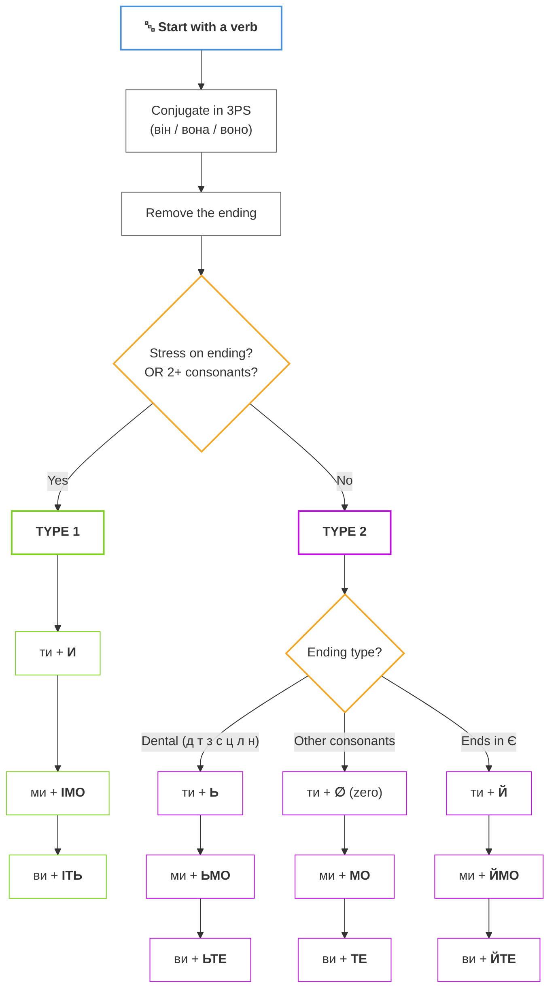
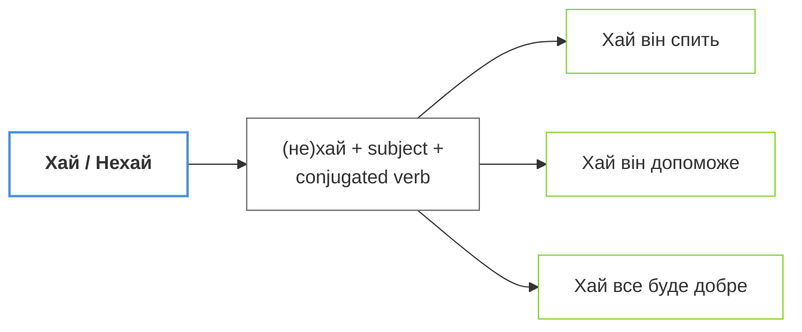
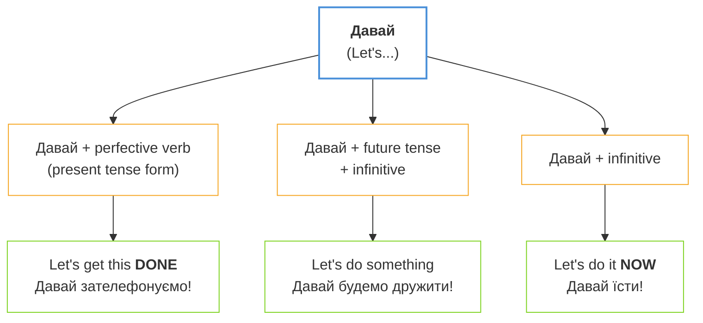

# Роби, робімо, хай щастить: Наказовий спосіб (The Complete Imperative)

## Introduction / Вступ

**Ласкаво просимо до модуля про енергію дії!** У повсякденному житті ми постійно звертаємося до інших: просимо допомоги, даємо поради, запрошуємо до спільної дії або висловлюємо добрі побажання. В українській мові для цього використовується **наказовий спосіб**. Це не лише про "накази" в армійському сенсі; це про волю мовця, виражену через дієслово. Ви вже знаєте прості форми як «Скажіть, будь ласка» або «Читайте!». Сьогодні ми підемо далі та вивчимо повну систему: від делікатних запрошень «ходімо» до урочистих побажань «хай живе!». Вміння правильно використовувати ці форми зробить вашу українську мову точною, ввічливою та надзвичайно живою.

You already know some commands from A1 like «Скажіть, будь ласка» (Say, please) or «Читайте!» (Read!). But how do you form these imperatives yourself for any verb? How do you say «Let's go!» or «Let him decide»? This lesson teaches you the complete Ukrainian imperative system. In Ukrainian, the imperative mood reflects the speaker's willpower, ranging from a direct command to a warm, indirect wish. Mastering these forms allows you to command your surroundings, collaborate with friends, and offer sincere blessings. It's time to learn how to put words into action!

**Що ви вивчите в цьому модулі:**

- Творення наказового способу для 2-ї особи (**ти/ви**) за правилами основ.
- Форму для спільної дії (**ми**) — українське «let's...».
- Використання часток **хай** та **нехай** для 3-ї особи та побажань.
- Нерегулярні, але дуже часті форми: **їж**, **пий**, **будь**, **дай**.
- Як залишатися ввічливим, даючи команди чи поради.

## Presentation / Презентація

### 1. Direct Commands: The Core System (2-га особа: ти/ви)

#### The Algorithm / Алгоритм творення

To form the imperative, follow this systematic approach:

#### Step-by-Step / Крок за кроком

**Крок 1:** Візьміть дієслово та поставте його в 3-ю особу однини (він/вона/воно).

**Крок 2:** Видаліть закінчення, щоб отримати основу.

**Крок 3:** Визначте тип дієслова за наголосом та приголосними.

---

#### TYPE 1: Stress on Ending OR Consonant Cluster / Наголос на закінченні АБО група приголосних

If the verb has **stress on the ending** in present tense, OR has **two or more consonants** before the ending, use these suffixes:

| Особа | Закінчення | Приклад |
|-------|------------|---------|
| ти | **-и** | говор**и**! пиш**и**! |
| ми | **-імо** | говор**імо**! пиш**імо**! |
| ви | **-іть** | говор**іть**! пиш**іть**! |

**Приклади:**
- говор**ять** (stress on -ять) → говор**и**! / говор**імо**! / говор**іть**!
- пиш**уть** (stress on -уть) → пиш**и**! / пиш**імо**! / пиш**іть**!
- крикн**уть** (consonant cluster -кн-) → крикн**и**! / крикн**імо**! / крикн**іть**!

---

#### TYPE 2: No Stress on Ending / Наголос НЕ на закінченні

If the stress falls on the **root** (not the ending), you have three sub-types:

##### 2a. Dental Consonants / Зубні приголосні

> [!tip] **Mnemonic / Мнемоніка**
> **«Де ти з'їси ці лини?»** — This phrase contains all dental consonants: **д, т, з, с, ц, л, н**

For stems ending in dental consonants, add **soft sign** (ь):

| Особа | Закінчення | Приклад |
|-------|------------|---------|
| ти | **-ь** | сяд**ь**! стан**ь**! |
| ми | **-ьмо** | сяд**ьмо**! стан**ьмо**! |
| ви | **-ьте** | сяд**ьте**! стан**ьте**! |

**Приклади:**
- сід**ати** → сяд**ь**! / сяд**ьмо**! / сяд**ьте**!
- ста**ти** → стан**ь**! / стан**ьмо**! / стан**ьте**!
- різ**ати** → ріж**ь**! / ріж**ьмо**! / ріж**ьте**!

##### 2b. Zero Ending / Нульове закінчення

For other consonants (not dental), use **zero ending** for ти:

| Особа | Закінчення | Приклад |
|-------|------------|---------|
| ти | **∅** (zero) | готу́й! працю́й! |
| ми | **-мо** | готу́ймо! працю́ймо! |
| ви | **-те** | готу́йте! працю́йте! |

##### 2c. Stems Ending in -є / Основа на -є

For verbs whose stem ends in **-є**, add **-й**:

| Особа | Закінчення | Приклад |
|-------|------------|---------|
| ти | **-й** | чита**й**! дума**й**! |
| ми | **-ймо** | чита**ймо**! дума**ймо**! |
| ви | **-йте** | чита**йте**! дума**йте**! |

**Приклади:**
- чита**ють** → чита**й**! / чита**ймо**! / чита**йте**!
- дума**ють** → дума**й**! / дума**ймо**! / дума**йте**!
- зна**ють** → зна**й**! / зна**ймо**! / зна**йте**!

### 2. The Invitation Form: "Let's..." (1-ша особа множини: ми)

Ukrainian doesn't need a helping word like "let's." We have a unique suffix **-мо** that we add to the singular imperative form. It sounds much more authentic than the common mistake of saying «Давай...».

В українській мові для форми «давайте зробимо» ми просто додаємо суфікс **-мо** до форми однини. Це звучить природно та по-українськи! Наприклад: «Ходімо!» (Let's go!), «Пишімо!» (Let's write!).

- Йди -> **Йдімо! / Ходімо!**
- Читай -> **Читаймо!**
- Пиши -> **Пишімо!**
- Почни -> **Почнімо!**

### 3. Indirect Wishes: Let It Be! (3-тя особа: хай/нехай)

When you want to express a command or wish for someone not present (he, she, they), we use the particles **хай** or **нехай** followed by the regular present tense verb.

Коли потрібно висловити команду для когось відсутнього, використовуйте частки **хай** або **нехай**. Додайте дієслово у теперішньому часі.

- **хай** — розмовний стиль, неформально.
- **нехай** — урочистий, літературний, поетичний стиль.

**Приклади:**

- **Хай** він сам вирішує. *(Let him decide himself.)*
- **Нехай** здійсняться ваші мрії! *(May your dreams come true!)*
- **Хай** живе Україна! *(Long live Ukraine!)*
- **Хай** вона відпочине. *(Let her rest.)*
- **Нехай** буде світло! *(Let there be light!)*

### 3b. The "Давай" Constructions / Конструкції з «давай»

Another way to express "Let's..." is using **давай/давайте**. This is common in spoken Ukrainian and has three patterns:

| Конструкція | Значення | Приклад |
|-------------|----------|---------|
| Давай + pf. verb (present) | Let's get this done | Давай **зателефонуємо**! |
| Давай + будемо + infinitive | Let's do something | Давай **будемо дружити**! |
| Давай + infinitive | Let's do it now | Давай **їсти**! |

> [!tip] **Давай vs -мо forms**
> **Давай** can often be replaced with the native **-мо** imperative:
> - Давай танцювати → **Танцюймо!**
> - Давай йти → **Ходімо!**
>
> The **-мо** form sounds more natural and literary in Ukrainian!

### 4. Irregular Imperative Stars (Винятки)

Some of the most used verbs in daily life have slightly unique imperative forms. You should memorize these as "survival" vocabulary.

| Інфінітив | Ти (однина) | Ви (множина) | Переклад |
| :-------- | :------------ | :----------- | :------- |
| **їсти**  | **їж**        | **їжте**     | eat      |
| **пити**  | **пий**       | **пийте**    | drink    |
| **дати**  | **дай**       | **дайте**    | give     |
| **бути**  | **будь**      | **будьте**   | be       |
| **взяти** | **візьми**    | **візьміть** | take     |

> [!tip] **Proverb: Be Patient**
> «Сім раз **відмір**, один раз **відріж**.» (Measure seven times, cut once.) This proverb uses two imperatives to teach us the value of deliberation. Notice the suffix **-ь** (softening) in both verbs!

> [!important] **The Politeness Formula**
> Direct commands can sound sharp. To soften them, always add **будь ласка** (please). In Ukrainian, "Дай мені воду, будь ласка" is perfectly polite. You can also use **прошу** followed by an infinitive: «Прошу зайти» (Please, come in).

## Practice / Практика

### 1. Form the Command (Утворіть форму)

Change these infinitives into the imperative form for the specified person.

1. читати (ви) -> **читайте**
2. писати (ти) -> **пиши**
3. говорити (ми) -> **говорімо**
4. бути (ви) -> **будьте**
5. дати (хай + він) -> **хай дасть** (Wait, no: **хай дасть** / **хай дає** depending on aspect). Correct: **Хай дає!**
6. йти (ми) -> **ходімо**

### 2. Negative Commands: Don't! (Заперечення)

To tell someone NOT to do something, just add **не** before the imperative.

1. Читайте! -> **Не читайте!**
2. Кричи! -> **Не кричи!**
3. Забудь! -> **Не забудь!**
4. Хвилюйся! -> **Не хвилюйся!** (Don't worry!)

### 3. Recipe Instructions: Borscht (Рецепт борщу)

Put the verbs in the imperative (ви-form) to give instructions.
*(наріжте, варіть, додайте, почистіть)*

1. Спочатку \_\_\_ овочі. -> **почистіть**
2. Потім дрібно \_\_\_ їх. -> **наріжте**
3. \_\_\_ м'ясо в каструлі. -> **варіть**
4. Нарешті \_\_\_ сметану. -> **додайте**

> [!reflection] **The Power of Authority**
> When you use the imperative, you are taking charge of the situation. Whether you are leading a project or just asking a favor, the clarity of your command shows your confidence in the language. Командний голос — це голос лідера!

> [!tip] **Toasting with Wishes**
> At a Ukrainian party, use «хай» for toasts: «**Хай** ваші діти будуть здоровими!» or simply «**Хай** щастить!» (Good luck!). It makes your wishes sound ancient and sincere.

## Dialogues / Діалоги

### Coordination in the Kitchen (На кухні)

**Мама:** Олег, **допоможи** мені, будь ласка! (Oleh, help me, please!)
**Олег:** Що робити? (What should I do?)
**Мама:** **Наріж** овочі для салату. А ви, діти, **не заважайте**! (Cut the vegetables for the salad. And you, children, don't get in the way!)
**Олег:** Добре. Мамо, **дай** мені гострий ніж. (Fine. Mom, give me the sharp knife.)
**Мама:** Ось, **візьми**. **Будь** обережним! (Here, take it. Be careful!)
**Олег:** **Не хвилюйся**, я вмію різати. **Почнімо** готувати вечерю! (Don't worry, I know how to cut. Let's start cooking dinner!)

> [!context] **Social Hierarchy and Commands**
> In Ukrainian families, elders use the 2nd person singular (ти) to give direct commands to younger ones. Younger people respond with the 2nd person plural (ви) if speaking formally, or "ти" for close relatives. Adding "будь ласка" is the universal bridge for politeness regardless of age.

# Summary / Підсумок

У цьому модулі ми навчилися керувати дією:

- Опанували творення наказової форми для **ти** та **ви**.
- Навчилися запрошувати до дії за допомогою форми **-мо** (ходімо, робімо).
- Дізналися, як висловлювати побажання іншим через **хай/нехай**.
- Запам'ятали ключові винятки: **дай**, **будь**, **їж**, **пий**.
- Навчилися пом'якшувати команди ввічливими словами.

You've learned the complete Ukrainian imperative system! This is a major structural component of the language. Use it to participate in life—give advice, make suggestions, and offer warm wishes. Your Ukrainian is now more functional and authoritative!

## Need More Practice?

Подивіться на свій розклад на завтра. Напишіть п'ять команд самому собі, використовуючи форму «ти». Наприклад: «Прокинься о сьомій», «Пий воду», «Пиши плани». Також придумайте одне велике побажання для своєї родини з часткою «нехай». Постійна практика перетворює правила на звичку! Удачі у ваших нових справах!

---

## Quick Reference / Швидка довідка

*Flowchart credit: Ukrainian language teaching materials*
