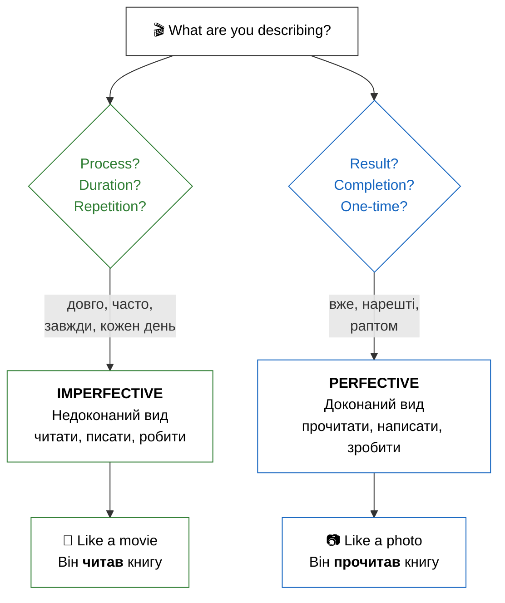

# Phase 5: Critical Deep Review

> **You are executing Phase 5 of an orchestrated rebuild.**
> **Your ONLY task: Perform a rigorous, evidence-based review.**
> **Every score must be backed by specific findings. Every finding must cite a line number.**

## Files to Read (ALL REQUIRED)

Read ALL of these files from disk before writing anything:

1. **Content** (the lesson you're reviewing): `# Подорож в аспекти: Опанування дієслова (Aspect Mastery)

## Introduction / Вступ

**Ласкаво просимо!** Сьогодні ви дізнаєтесь про **аспект** — одну з найважливіших та найцікавіших тем української граматики. Це справжній переломний момент у вашому навчанні. Якщо відмінки — це кістки мови, то аспекти — це її м'язи та рух. Навчитися відчувати різницю між завершеною дією та процесом — це ключ до того, щоб звучати як справжній українець. Це дозволить вам не просто називати дії, а малювати словами яскраві картини дійсності. Кожен ваш крок у вивченні аспектів наближає вас до розуміння душевної витонченості української мови.

In Ukrainian, verbs usually exist in pairs, representing two aspects: **imperfective** (недоконаний), which focuses on the process, and **perfective** (доконаний), which focuses on the result. Understanding this will help you speak naturally and sound like a native. It's not just a technical rule — it's a way of seeing the world through the lens of duration or completion! For example, you can say «Я писав листа» (you were in the process) or «Я написав листа» (you finished the task). Ця точність надає українській мові особливої емоційності та глибини. Використання правильного аспекту — це як налаштування фокуса в камері: ви або показуєте весь процес, або показуєте результат.

**Що ви вивчите в цьому модулі:**

- The difference between **Imperfective** (process) and **Perfective** (result) aspects.
- How to recognize aspect pairs using **prefixes**.
- When to use each aspect in daily conversation.
- Common aspect pairs to describe your day.

## Presentation / Презентація

### Aspect in Practice (Аспект на практиці)

Аспект — це основа української дієслівної системи. Коли ви говорите українською, ви завжди робите вибір: показати процес або показати результат. Це не просто граматика — це філософія мови, яка пронизує кожне речення. Вибір аспекту часто відображає намір мовця та його ставлення до події. Це дозволяє нам бути дуже точними в описах подій минулого, теперішнього та майбутнього часу.

**Уявіть собі дві ситуації:**

**Ситуація 1:** Вчора ввечері я читав книгу дві години. Я читав і відпочивав. Книга була цікава, але я не закінчив.

- **Дієслово:** **читав** (недоконаний вид).
- **Фокус:** Процес, тривалість, проведення часу. Не важливо, чи є фінальний результат. Ви насолоджуєтеся самим актом читання. Книга все ще відкрита у вашій уяві. Це "триваюча" дійсність.

**Ситуація 2:** Вчора ввечері я прочитав усю книгу. Тепер я знаю, чим вона закінчується. Я можу рекомендувати її друзям.

- **Дієслово:** **прочитав** (доконаний вид).
- **Фокус:** Результат, завершена дія, підсумок. Ви закрили книгу і поклали її на полицю. Дія стала історичним фактом, який має конкретний наслідок у теперішньому. Це "зафіксована" точка часу.

### The System of Aspect Pairs (Система видових пар)

Most Ukrainian verbs come in **pairs**. This might seem like double the work, but it actually adds immense clarity to your speech. The relationship between these pairs is usually logical and follows several patterns. Internalizing these patterns will help you predict the perfective form of a new verb you encounter.

**Method 1: Prefixation (Додавання префікса)**
This is the most frequent method. A prefix (like про-, на-, з-, по-, ви-) turns an open process into a closed result. Think of the prefix as a "cap" that closes the action.

- **читати** (process of reading) -> **прочитати** (the result of having read)
- **писати** (process of writing) -> **написати** (the result: a finished text)
- **робити** (process of doing) -> **зробити** (the result: a finished job)
- **бачити** (seeing) -> **побачити** (noticing/catching sight of)
- **вчити** (studying) -> **вивчити** (learning/mastering)

**Method 2: Suffixation (Зміна суфікса)**
Sometimes the middle of the word changes. These are slightly more complex but very rhythmic once you get used to them.

- **купувати** (process of buying) -> **купити** (the result: a purchase is made)
- **відкривати** (opening) -> **відкрити** (opened)

**Method 3: Suppletion (Різні корені)**
Some of the most basic verbs use completely different roots for each aspect. You must memorize these like irregular verbs.

- **казати** (saying/telling) -> **сказати** (said/told - completed)
- **брати** (taking) -> **взяти** (taken)

> **Note:** You may see **говорити/сказати** paired in some textbooks. However, these verbs have slightly different meanings: говорити = to speak/talk (general), сказати = to say (specific statement). A true aspectual pair shares the same core meaning.

### Aspect Selection Strategy (Як обрати аспект?)

To choose the right aspect, always ask yourself: **"Am I describing a duration or a completion?"** This simple question will guide you through 90% of situations. Ukrainian speakers are very sensitive to this distinction. Contextual clues often dictate the aspect for you.

1. **Duration markers:** Always point to Imperfective. Look for words such as **довго** (long), **цілий день** (all day), **три години** (three hours).
   - *Він довго писав есе.* (He was writing the essay for a long time).
2. **Frequency markers:** These also signal the Imperfective. Common indicators include **часто** (often), **завжди** (always), **кожен день** (every day).
   - *Вона завжди купує квіти.* (She always buys flowers).
3. **Completion markers:** These require the Perfective. Watch out for **нарешті** (at last), **вже** (already), **раптом** (suddenly).
   - *Я вже зробив домашнє завдання!* (I have already done the homework!).



> [!reflection] **The Philosophy of Done**
> In Ukrainian culture, there is a strong distinction between the effort (imperfective) and the achievement (perfective). Using the perfective aspect often implies a sense of responsibility and pride in having reached a goal. Коли ви кажете «Я вивчив», ви заявляєте про свою перемогу над темою. Це не просто опис дії, а опис вашого успіху.

> [!tip] **Memory Hook: The Movie vs. The Photo**
> If you can imagine the action happening over a timeline (a movie), use **Imperfective**. If you can only imagine the final "click" of a camera at the end (a photo), use **Perfective**.

## Practice / Практика

### 1. Identify the Aspect (Визначте вид)

Look at the sentences and identify if the verb shows a process (Imp) or a result (Perf).

1. Я **пив** каву цілий ранок. -> **Недоконаний** (Process/Duration)
2. Я **випив** каву і пішов. -> **Доконаний** (Result/Completion)
3. Вчора ми **дивилися** фільм. -> **Недоконаний** (Activity)
4. Ти **подивився** цей фільм? -> **Доконаний** (Asking for result)
5. Він **робив** стіл три дні. -> **Недоконаний** (Duration)
6. Він **зробив** гарний стіл. -> **Доконаний** (Outcome/Snapshot)

### 2. Aspect Transformation

Put the words in parentheses into the correct aspect based on the context clue.

1. Ми (довго) \_\_\_ (читати/прочитати) статтю. -> **читали** (Imp because of 'довго').
2. Я (вже) \_\_\_ (купувати/купити) квитки. -> **купив** (Perf because of 'вже').
3. Кожен день вона \_\_\_ (писати/написати) листи. -> **пише** (Imp because of 'кожен день').
4. Нарешті він \_\_\_ (казати/сказати) правду. -> **сказав** (Perf because of 'нарешті').
5. Вони (цілий вечір) \_\_\_ (готувати/приготувати) обід. -> **готували** (Imp because of 'цілий вечір').

> [!important] **Prefix Power**
> Notice how the prefix "про-", "на-", or "з-" often creates the perfective form. While there are many prefixes, their main job at this level is to act as a "completion tag" for the verb. Don't worry about the specific meaning of each prefix yet — just learn them as mandatory parts of the verb pair. Це зробить ваше навчання системним.

## Dialogues / Діалоги

### Ти закінчив? (Did you finish?)

**Андрій:** Привіт! Що ти **робив** учора ввечері? (Hi! What were you doing yesterday evening?)
**Олена:** Я весь вечір **читала** дуже цікаву книгу. (I was reading a very interesting book all evening.)
**Андрій:** Ого! Ти її вже **прочитала**? (Wow! Have you already finished it?)
**Олена:** Так, я **прочитала** її до кінця, було неймовірно! (Yes, I read it to the end, it was incredible!)
**Андрій:** А я вчора тільки **писав** есе для університету. (And I was only writing an essay for the university yesterday.)
**Олена:** Ти вже **написав** його? (Have you finished writing it?)
**Андрій:** Ні, ще не **написав**. Але я точно **напишу** його сьогодні. (No, haven't finished yet. But I will definitely finish writing it today.)

### У магазині (At the Store)

**А:** Ви часто **купуєте** тут хліб? (Do you often buy bread here?)
**Б:** Так, я завжди **купую** хліб у цьому магазині. (Yes, I always buy bread in this store.)
**А:** А сьогодні ви вже **купили** все необхідне? (And have you already bought everything necessary today?)
**Б:** Ні, я ще нічого не **купив**. Чекаю на дружину. (No, I haven't bought anything yet. I'm waiting for my wife.)

> [!context] **Grammar of Daily Life**
> In daily life, Ukrainians use imperfective for generic invitations: «Заходьте!» (Come in - the process of welcoming) or «Пишіть!» (Write to us - keep in touch). However, for specific tasks, we switch to perfective: «Напишіть свою адресу» (Write your address - a specific result needed). Context is everything! Розуміння цього нюансу зробить ваше спілкування набагато приємнішим.

# Summary / Підсумок

У цьому модулі ми відкрили для себе світ дієслівних аспектів:

- **Imperfective Aspect (Недоконаний вид):** фокусується на процесі, тривалості та повторенні. (Що робити?)
- **Perfective Aspect (Доконаний вид):** фокусується на результаті та завершенні дії. (Що зробити?)
- Ви навчилися розрізняти ці види за допомогою слів-маркерів (довго, вже, часто).
- Ми ознайомилися з основними принципами творення видових пар (префіксація та заміна кореня).

Understanding aspect is a journey, not a single step. Every time you learn a new verb from now on, try to learn its "partner" aspect as well. This will build your linguistic intuition and make you a much more effective communicator.

## Need More Practice?

Подивіться на свій розклад на завтра. Що ви будете **робити** (процес), а що ви **зробите** (результат)? Напишіть два списки. Наприклад: «Я буду **читати** новини» (процес) та «Я **напишу** важливий імейл» (результат). Це допоможе вам інтегрувати аспекти у ваше реальне життя! Повторюйте ці пари щодня, і скоро ви почнете відчувати їхню логіку автоматично. Пам'ятайте, що майстерність приходить із практикою.
`
2. **Activities**: `---
- type: match-up
  title: Aspect Pairs
  pairs:
  - left: читати
    right: прочитати
  - left: писати
    right: написати
  - left: робити
    right: зробити
  - left: бачити
    right: побачити
  - left: чути
    right: почути
  - left: казати
    right: сказати
  - left: брати
    right: взяти
  - left: давати
    right: дати
  - left: їсти
    right: з'їсти
  - left: пити
    right: випити
  - left: вчити
    right: вивчити
  - left: купувати
    right: купити
  instruction: З'єднайте відповідні елементи.

- type: fill-in
  title: Aspect Drill
  instruction: Choose the correct aspect based on the context.
  items:
    - sentence: "Я _____ цю книгу вчора цілий вечір."
      answer: читав
      options: [читав, прочитав, читаю, буду читати]
    - sentence: "Нарешті я _____ цю книгу!"
      answer: прочитав
      options: [прочитав, читав, читаю, буду читати]
    - sentence: "Ми довго _____ листа мамі."
      answer: писали
      options: [писали, написали, пишемо, будемо писати]
    - sentence: "Він швидко _____ повідомлення і відправив його."
      answer: написав
      options: [написав, писав, пише, буде писати]
    - sentence: "Що ти _____ вчора? (What were you doing?)"
      answer: робив
      options: [робив, зробив, роблю, зроблю]
    - sentence: "Ти вже _____ домашнє завдання?"
      answer: зробив
      options: [зробив, робив, робиш, зробиш]
    - sentence: "Я _____ цікавий фільм, коли ти подзвонив."
      answer: дивився
      options: [дивився, подивився, дивлюся, подивлюся]
    - sentence: "Ти _____ цей новий фільм?"
      answer: подивився
      options: [подивився, дивився, дивишся, подивишся]
    - sentence: "Вона завжди _____ правду."
      answer: говорить
      options: [говорить, скаже, говорила, сказала]
    - sentence: "Він раптом _____ дивну річ."
      answer: сказав
      options: [сказав, говорив, каже, буде говорити]
- type: cloze
  title: Choose the Correct Aspect
  passage: 'Учора був цікавий день. Вранці я {читав|прочитав} книгу дві години і нарешті {прочитав|читав} її до кінця. Потім моя сестра {писала|написала} листа годину і теж {написала|писала} його. Увечері наш брат {малював|намалював} картину — тепер вона висить на стіні.

    Зазвичай ми {читаємо|прочитаємо} щодня ввечері. Мама завжди {говорить|скаже} нам: «Читання — це добре!» Я вже {прочитав|читав} три книги цього місяця.

    — Що ти {робив|зробив} увечері? — запитав тато.
    — Я {зробив|робив} домашнє завдання і закінчив усе! — відповіла сестра. Тато {говорив|сказав} по телефону довго.

    Коли він закінчив, то {сказав|говорив}: «Завтра їдемо до бабусі!» Минулого разу ми {їхали|приїхали} туди три години. Але коли ми нарешті {приїхали|їхали}, було дуже весело!'
  instruction: Заповніть пропуски, обравши правильні слова.
- type: quiz
  title: Process or Result?
  items:
  - question: When you say «Я читав книгу цілий вечір,» which aspectual focus are you emphasizing?
    options:
    - text: Process
      correct: true
    - text: Result
      correct: false
    - text: Future intent
      correct: false
    - text: Single event
      correct: false
  - question: When a speaker says «Я прочитав книгу,» what is the primary focus of the action?
    options:
    - text: Result
      correct: true
    - text: Process
      correct: false
    - text: Habitual action
      correct: false
    - text: Ongoing duration
      correct: false
  - question: In the sentence «Вона завжди говорить правду,» what kind of action is being described?
    options:
    - text: Habitual action
      correct: true
    - text: Single event
      correct: false
    - text: Future promise
      correct: false
    - text: Completed result
      correct: false
  - question: When someone says «Він сказав 'так',» what characterizes the nature of this specific action?
    options:
    - text: Single completed event
      correct: true
    - text: Ongoing process
      correct: false
    - text: Repeated habit
      correct: false
    - text: Long duration
      correct: false
  - question: Which of these options correctly identifies the perfective aspect of the verb «читати»?
    options:
    - text: прочитати
      correct: true
    - text: читати
      correct: false
    - text: читавати
      correct: false
    - text: зачитати
      correct: false
  - question: Which of these options correctly identifies the imperfective aspect of the verb «написати»?
    options:
    - text: писати
      correct: true
    - text: написати
      correct: false
    - text: пописати
      correct: false
    - text: дописати
      correct: false
  - question: When you say «Я писав три години,» which aspectual meaning are you emphasizing here?
    options:
    - text: Duration
      correct: true
    - text: Completion
      correct: false
    - text: Future goal
      correct: false
    - text: Single result
      correct: false
  - question: When you say «Я написав листа,» what is the main point you are communicating?
    options:
    - text: Completion
      correct: true
    - text: Duration
      correct: false
    - text: Habitual writing
      correct: false
    - text: Future intent
      correct: false
  - question: What term describes the relationship between the Ukrainian verb pairs «говорити» and «сказати»?
    options:
    - text: Suppletive pairs
      correct: true
    - text: Prefixed pairs
      correct: false
    - text: Identical roots
      correct: false
    - text: Soft endings
      correct: false
  - question: Which specific prefix is commonly used to make the verb «читати» into its perfective form?
    options:
    - text: про-
      correct: true
    - text: на-
      correct: false
    - text: з-
      correct: false
    - text: по-
      correct: false
  - question: Which specific prefix is commonly used to make the verb «писати» into its perfective form?
    options:
    - text: на-
      correct: true
    - text: про-
      correct: false
    - text: по-
      correct: false
    - text: ви-
      correct: false
  - question: In Ukrainian grammar, the concept of verbal aspect is primarily concerned with emphasizing what?
    options:
    - text: Process vs. result
      correct: true
    - text: Past vs. future
      correct: false
    - text: First vs. third person
      correct: false
    - text: Singular vs. plural
      correct: false
  instruction: Оберіть правильну відповідь.
- type: true-false
  title: Aspect Rules
  items:
  - statement: Недоконаний вид фокусується на процесі та тривалості. | Imperfective verbs focus on process and duration.
    correct: true
    explanation: Correct!
  - statement: Доконаний вид вказує на завершені дії. | Perfective verbs indicate completed actions.
    correct: true
    explanation: Yes!
  - statement: Усі видові пари мають один корінь. | All aspect pairs use the same root.
    correct: false
    explanation: Some pairs like говорити/сказати use different roots.
  - statement: Більшість дієслів доконаного виду утворюються за допомогою префіксів. | Most perfective verbs are formed with prefixes.
    correct: true
    explanation: Correct! Prefixes like про-, на-, з-, по-.
  - statement: Можна використовувати доконаний вид для звичних дій. | You can use perfective for habitual actions.
    correct: false
    explanation: Habitual actions require imperfective.
  - statement: «Я читав» може означати "I was reading". | «Я читав» can mean "I was reading."
    correct: true
    explanation: Yes! Imperfective shows ongoing process.
  - statement: «Я прочитав» означає "I finished reading". | «Я прочитав» means "I finished reading."
    correct: true
    explanation: Correct!
  - statement: Вид має значення лише в минулому часі. | Aspect only matters in past tense.
    correct: false
    explanation: Aspect matters in all tenses!
  - statement: Брати/взяти мають різні корені. | Брати/взяти use different roots.
    correct: true
    explanation: Yes! They're suppletive pairs.
  - statement: Слова тривалості часто вживаються з недоконаним видом. | Duration words often appear with imperfective.
    correct: true
    explanation: Correct! Words like «довго,» «три години.»
  - statement: Англійська мова має таку ж систему виду. | English has the same aspect system.
    correct: false
    explanation: English uses verb forms, not separate verbs.
  - statement: Питання «Що ти робив?» використовує недоконаний вид. | The question «Що ти робив?» uses imperfective.
    correct: true
    explanation: Yes! Asking about activities/process.
  instruction: Визначте, чи твердження правильне.
- type: group-sort
  title: Imperfective vs Perfective
  groups:
  - name: Imperfective
    items:
    - читати
    - писати
    - робити
    - говорити
    - бачити
    - брати
  - name: Perfective
    items:
    - прочитати
    - написати
    - зробити
    - сказати
    - побачити
    - взяти
  instruction: Розподіліть елементи за групами.
- type: unjumble
  title: Aspect Sentences
  items:
  - words:
    - я
    - читав
    - цікаву
    - книгу
    - дві
    - години
    - вчора
    - ввечері
    answer: Я читав цікаву книгу дві години вчора ввечері
  - words:
    - вона
    - прочитала
    - всю
    - нову
    - книгу
    - дуже
    - швидко
    - вчора
    answer: Вона прочитала всю нову книгу дуже швидко вчора
  - words:
    - він
    - написав
    - довгий
    - лист
    - до
    - своєї
    - мами
    - вчора
    answer: Він написав довгий лист до своєї мами вчора
  - words:
    - ми
    - читаємо
    - українські
    - книги
    - та
    - газети
    - щодня
    - вдома
    answer: Ми читаємо українські книги та газети щодня вдома
  - words:
    - вона
    - сказала
    - щиру
    - правду
    - про
    - всю
    - цю
    - ситуацію
    answer: Вона сказала щиру правду про всю цю ситуацію
  - words:
    - я
    - бачив
    - синє
    - море
    - вперше
    - у
    - моєму
    - житті
    answer: Я бачив синє море вперше у моєму житті
  - words:
    - він
    - зробив
    - все
    - домашнє
    - завдання
    - дуже
    - добре
    - вчора
    answer: Він зробив все домашнє завдання дуже добре вчора
  - words:
    - вона
    - завжди
    - говорить
    - українською
    - мовою
    - зі
    - своєю
    - сестрою
    answer: Вона завжди говорить українською мовою зі своєю сестрою
  - words:
    - я
    - вже
    - прочитав
    - цю
    - цікаву
    - книгу
    - до
    - кінця
    answer: Я вже прочитав цю цікаву книгу до кінця
  - words:
    - він
    - довго
    - і
    - уважно
    - писав
    - цю
    - нову
    - статтю
    answer: Він довго і уважно писав цю нову статтю
  - words:
    - ми
    - нарешті
    - приїхали
    - до
    - Києва
    - сьогодні
    - дуже
    - рано
    answer: Ми нарешті приїхали до Києва сьогодні дуже рано
  - words:
    - я
    - взяв
    - свою
    - стару
    - книгу
    - зі
    - столу
    - вчора
    answer: Я взяв свою стару книгу зі столу вчора
  instruction: Розташуйте слова у правильному порядку.
- type: error-correction
  title: Fix the Aspect
  items:
  - sentence: Я прочитав книгу три години.
    error: прочитав
    answer: читав
    options:
    - читав
    - прочитав
    - буду читати
    - читаю
    explanation: Duration (три години) requires imperfective «читав» even if context seems «completed.»
  - sentence: Вона писала листа і закінчила.
    error: писала
    answer: написала
    options:
    - писала
    - написала
    - пише
    - буде писати
    explanation: Completed result with emphasis on finish → perfective «написала.»
  - sentence: Ми прочитаємо кожен день.
    error: прочитаємо
    answer: читаємо
    options:
    - читаємо
    - прочитаємо
    - читали
    - будемо читати
    explanation: Habitual action («кожен день») requires imperfective «читаємо.»
  - sentence: Він говорив «привіт» один раз.
    error: говорив
    answer: сказав
    options:
    - говорив
    - сказав
    - говорить
    - каже
    explanation: Single completed speech act → perfective «сказав.»
  - sentence: Я бачив її вчора вперше!
    error: бачив
    answer: побачив
    options:
    - бачив
    - побачив
    - бачу
    - побачу
    explanation: Single event with result → perfective «побачив.»
  - sentence: Вона сказала довго.
    error: сказала
    answer: говорила
    options:
    - говорила
    - сказала
    - говорить
    - каже
    explanation: Duration emphasis («довго») requires imperfective «говорила.»
  - sentence: Ти вже робив домашнє завдання?
    error: робив
    answer: зробив
    options:
    - робив
    - зробив
    - робиш
    - зробиш
    explanation: Question about completed result → perfective «зробив.»
  - sentence: Я попрацював цілий вечір.
    error: попрацював
    answer: працював
    options:
    - працював
    - попрацював
    - працюю
    - буду працювати
    explanation: Duration marker («цілий вечір») requires imperfective «працював.»
  instruction: Знайдіть і виправте помилку в реченні.
- type: cloze
  title: Complete the Story
  passage: 'Учора я {працював|працювати|попрацювати} цілий день. Спочатку я {прочитав|читати|прочитати} статтю для роботи. Потім я {написав|писати|написати} кілька листів. Увечері я нарешті {закінчив|закінчувати|закінчити} книгу, яку {читав|читати|прочитати} цілий місяць.
    ---
    Сьогодні вранці я {встав|вставати|встати} рано. Я {випив|пити|випити} каву і {з''їв|їсти|з''їсти} сніданок. Потім я {пішов|іти|піти} до роботи. На роботі я {працював|працювати|попрацювати} цілий день. Увечері я {прийшов|йти|прийти} додому і {приготував|готувати|приготувати} смачну вечерю.'
  instruction: Заповніть пропуски, обравши правильні слова.
- type: select
  title: Aspect in Conversation
  items:
  - question: '— Що ти робив учора? — Я читав книгу. — Ти прочитав її? — ...'
    options:
    - text: Ні, ще читаю.
      correct: true
    - text: Так, закінчив.
      correct: false
    - text: Ні, я не читати.
      correct: false
    - text: Прочитаю завтра.
      correct: false
    explanation: 'Процес триває → недоконаний вид: «ще читаю».'
  - question: '— Ти написав листа? — Ні, ще пишу. — Довго ти вже пишеш? — ...'
    options:
    - text: Дві години.
      correct: true
    - text: Написав швидко.
      correct: false
    - text: Напишу завтра.
      correct: false
    - text: Писатиму довго.
      correct: false
    explanation: Питання про тривалість процесу → відповідь вказує час.
  - question: '— Довго ти вже пишеш? — Дві години. — Коли закінчиш? — ...'
    options:
    - text: Скоро напишу!
      correct: true
    - text: Вже писав.
      correct: false
    - text: Завтра писатиму.
      correct: false
    - text: Писав годину.
      correct: false
    explanation: 'Питання про момент завершення → доконаний вид: «напишу».'
  - question: '— А коли прочитаєш книгу? — ...'
    options:
    - text: Думаю, завтра закінчу.
      correct: true
    - text: Читав учора.
      correct: false
    - text: Буду читати.
      correct: false
    - text: Читаю зараз.
      correct: false
    explanation: 'Питання про момент завершення → доконаний вид: «закінчу».'
  - question: '— Що ти робив увесь вечір? — ...'
    options:
    - text: Працював над проектом.
      correct: true
    - text: Попрацював трохи.
      correct: false
    - text: Працюватиму.
      correct: false
    - text: Попрацюю завтра.
      correct: false
    explanation: '«Увесь вечір» = тривалість → недоконаний вид: «працював».'
  - question: '— Ти вже пообідав? — ...'
    options:
    - text: Так, щойно поїв.
      correct: true
    - text: Їв обід.
      correct: false
    - text: Буду їсти.
      correct: false
    - text: Їстиму пізніше.
      correct: false
    explanation: 'Питання про завершену дію → доконаний вид: «поїв».'
  instruction: Оберіть правильну відповідь у діалозі.
- type: mark-the-words
  title: Identify Aspect
  text: Учора був цікавий день. Вранці я встав о сьомій і випив каву. Потім я пішов на роботу. На роботі я працював цілий день, але закінчив усі справи. Увечері я приготував вечерю і подзвонив другові. Ми поговорили годину і домовились зустрітися завтра. Потім я почитав книгу і заснув.
  answers:
  - встав
  - випив
  - пішов
  - закінчив
  - приготував
  - подзвонив
  - поговорили
  - домовились
  - заснув
  instruction: Клацніть на дієслова ДОКОНАНОГО виду.
`
3. **Vocabulary**: `---
module: 12-aspect-introduction
level: A2
version: '2.0'
items:
- lemma: вид
  ipa: /ʋɪd/
  translation: aspect, view
  pos: noun
  gender: m
- lemma: всередині
  ipa: /ʋsɛrˈɛdɪni/
  translation: inside (location)
  pos: adv
- lemma: доконаний
  ipa: /dɔkˈɔnanɪj/
  translation: perfective
  pos: adj
- lemma: есе
  ipa: /ɛsˈɛ/
  translation: essay
  pos: noun
  gender: n
- lemma: золоте
  ipa: /zɔlɔtˈɛ/
  translation: golden
  pos: noun
  gender: n
- lemma: найпоширеніший
  ipa: /najpɔʃˈɪrɛniʃɪj/
  translation: the most widespread
  pos: adj
- lemma: недоконаний
  ipa: /nɛdɔkˈɔnanɪj/
  translation: imperfective
  pos: adj
- lemma: неймовірно
  ipa: /nɛjmɔʋˈirnɔ/
  translation: incredibly
  pos: adv
- lemma: німецький
  ipa: /nimˈɛt͡sʲkɪj/
  translation: German
  pos: adj
- lemma: пиво
  ipa: /pˈɪʋɔ/
  translation: beer
  pos: noun
- lemma: практикуватися
  ipa: /praktɪkuʋˈatɪsja/
  translation: to practice (oneself)
  pos: verb
- lemma: проводити
  ipa: /prɔʋɔdɪtɪ/
  translation: to conduct, to lead (imperfective)
  pos: verb
- lemma: розібрати
  ipa: /rɔzibrˈatɪ/
  translation: to disassemble, to sort out, to understand
  pos: verb
- lemma: світогляд
  ipa: /sʋitˈɔɦljad/
  translation: worldview
  pos: noun
- lemma: теза
  ipa: /tˈɛza/
  translation: thesis, point
  pos: noun
  gender: f
- lemma: філософія
  ipa: /filɔsˈɔfija/
  translation: philosophy
  pos: noun
  gender: f
- lemma: інформація
  ipa: /infɔrmˈat͡sija/
  translation: information
  pos: noun
  gender: f
`
4. **Plan** (source of truth for scope): `---
module: a2-12
level: A2
sequence: 12
slug: 12-aspect-introduction
version: '2.0'
title: Aspect Introduction
subtitle: Process vs. Result
content_outline:
- section: Introduction / Вступ
  words: 200
  points:
  - Concept of aspect (Process vs Result)
  - Importance of verb pairs
- section: Presentation / Презентація
  words: 600
  points:
  - Imperfective (недоконаний) vs Perfective (доконаний)
  - Common aspect pairs (Prefixation vs Suppletion)
  - Time markers and context clues
- section: Practice / Практика
  words: 150
  points:
  - Process/Result identification
  - Aspect pair matching
- section: Dialogues / Діалоги
  words: 50
  points:
  - '"Did you finish?" situational exchange'
word_target: 1000
vocabulary_hints:
  required:
  - читати/прочитати (to read)
  - писати/написати (to write)
  - робити/зробити (to do/make)
  - говорити/сказати (to say/speak)
  - бачити/побачити (to see)
  - брати/взяти (to take)
  - давати/дати (to give)
  - їсти/з'їсти (to eat)
  - пити/випити (to drink)
  - вчити/вивчити (to learn)
  - купувати/купити (to buy)
  - продавати/продати (to sell)
  - вид (aspect)
  - недоконаний (imperfective)
  - доконаний (perfective)
  recommended:
  - процес (process)
  - результат (result)
  - тривалість (duration)
  - завершення (completion)
  - повторення (repetition)
activity_hints:
- type: match-up
  focus: Imperfective to perfective pairs
  items: 15+
- type: fill-in
  focus: Choose correct aspect for context
  items: 12+
- type: quiz
  focus: Process or result?
  items: 12+
- type: quiz
  focus: Identify aspect of underlined verb
  items: 10+
- type: fill-in
  focus: Complete sentences with correct aspect
  items: 10+
focus: grammar
pedagogy: PPP
prerequisites:
- a2-11 (Checkpoint - Cases)
- A1 verb conjugation
- A1 past/future tense basics
connects_to:
- a2-13 (The Completed Past)
- a2-14 (Future Plans and Promises)
- a2-15 (Aspect Morphology)
objectives:
- Learner can distinguish between process and result
- Learner can identify perfective and imperfective verbs
- Learner can match common aspect pairs
- Learner can choose the correct aspect in simple sentences
grammar:
- imperfective aspect (process)
- perfective aspect (result)
- aspect pairs
- aspect usage rules
module_type: grammar
sources:
- name: Ukrainian State Standard 2024 - Verbal Aspect
  url: "https://mon.gov.ua/"
  type: reference
  notes: Aspect pair requirements for A2 level
- name: Ukrainian Verb Aspect Reference
  url: "https://uk.wikipedia.org/wiki/Вид_дієслова"
  type: reference
  notes: Complete aspect system overview
immersion: 40-50% Ukrainian
phase: A2.2
`
5. **Meta** (build config): `---
module: a2-12
level: A2
slug: 12-aspect-introduction
version: '2.0'
id: a2-12
naturalness:
  score: 9
  status: PASS
duration: 60
transliteration: none
tags:
- grammar
- verbs
- aspect
- introduction
word_target: 1000
build:
  last_modified: '2026-01-26'
`
6. **Research notes** (if exists): `# Research Notes: Aspect Introduction (Process vs. Result)

**Level**: A2 (Basics)
**Module**: A2.M12
**Focus**: Introduction to Verb Aspect (Вид дієслова)

## 1. Grammar: State Standard 2024 Reference
According to the **Державний стандарт української мови як іноземної (2024)** for Level A2 (**Початковий рівень другого ступеня**), the mastery of verb aspect is a core requirement for transitioning from simple sentence construction to narrative competence.

**Key Reference (§4.3.2 - Word Formation):**
> "4.3.2. Видові пари дієслів: робити – зробити, ділити – поділити, писати – написати, виходити – вийти, забувати – забути."

The standard emphasizes the functional usage of these pairs across different tenses and moods:
- **Tense (§4.2.3.1):** Requires distinguishing between the **imperfective compound future** (*буду боротися*) and the **perfective future** (*скажу*).
- **Mood (§4.2.3.2):** Expects the use of aspect pairs in the imperative (*читай / прочитай*, *пиши / напиши*).

## 2. Vocabulary Frequency
The module focuses on high-frequency "natural pairs" where the perfective is formed by a simple prefix or a suppletive stem. These verbs represent 80%+ of daily aspectual usage at the beginner level.

### High-Frequency Pairs:
- **робити / зробити** (to do, to make) - The primary pair for teaching the "action vs. result" concept.
- **говорити / сказати** (to speak/say) - Crucial suppletive pair; "говорити" is used for the act of speaking, "сказати" for the message delivered.
- **писати / написати** (to write) - Standard example of prefixation (*на-*).
- **читати / прочитати** (to read) - Standard example of prefixation (*про-*).
- **їсти / з'їсти** & **пити / випити** (to eat/drink) - Highly practical for hospitality and daily routines.
- **купувати / купити** (to buy) - Essential for "Shopping" and "Services" scenarios.
- **вчити / вивчити** (to learn/memorize) - Vital for students to distinguish between "studying" (process) and "knowing" (result).

### Common A1-A2 Collocations:
- *довго читати* (read for a long time - process)
- *швидко зробити* (finish quickly - result)
- *кожного дня пити каву* (drinking coffee every day - habit)
- *випити воду* (finish the water - completion)

## 3. Cultural Hook
### Proverb: "Зробив діло — гуляй сміло"
**Translation:** "Done the job — stroll/play boldly."
This is one of the most famous Ukrainian proverbs. It highlights a cultural value where rest and leisure are earned through the completion of a task. Pedagogically, it's a perfect example of the **Perfective aspect** (*зробив*) serving as the trigger for a new state or action.

### The "Guest" Protocol
In Ukrainian hospitality, the distinction between **їсти** (process) and **з'їсти** (result) carries social weight. A guest might say *"Я їм"* to show they are enjoying the meal, but the host feels most successful when the guest says *"Я все з'їв!"* (I ate it all!). Using the perfective aspect here signals appreciation for the host's effort by confirming the result (an empty plate).

## 4. Pedagogical Notes
### Key Differences from English
English often uses complex tenses (Present Perfect, Continuous) to express nuances that Ukrainian handles through **Aspect** within three simple tenses.
- **Ukrainian Aspect = Focus.** Is the focus on the *action itself* (Imperfective) or the *boundary/result* (Perfective)?
- **The Present Tense Rule:** A crucial concept for beginners is that the **Present Tense is always Imperfective**. If an action is happening right now, it hasn't reached its result yet.

### Teaching Sequence Recommendations
1.  **Process vs. Result:** Use visual metaphors (a runner running vs. a runner crossing the finish line).
2.  **Time Markers:** Teach "keywords" that trigger aspect:
    - *Imperfective:* довго (long), часто (often), кожного дня (every day), зазвичай (usually).
    - *Perfective:* нарешті (finally), раптом (suddenly), за годину (within an hour).
3.  **Future Forms:** Clearly distinguish *буду робити* (I will be doing) from *зроблю* (I will get it done).

### Common Learner Errors
- **The "Present Perfective" Trap:** Learners often try to conjugate a perfective verb in the present tense to say "I finish now." In Ukrainian, a conjugated perfective verb *always* refers to the future.
- **Over-reliance on "Буду":** English speakers often use the compound future (*буду...*) for everything because it mirrors "I will...", missing the efficiency of the perfective future.

## 5. Scope Boundaries
Based on the student's prior knowledge (Completion of A1 + Case Checkpoint), the following boundaries are set:

### In Scope:
- **High-frequency pairs:** Only those formed by simple prefixation or common suppletion.
- **Tense usage:** Distinguishing aspect in the Past and Future tenses.
- **Imperatives:** Using basic pairs to give commands (*Читай!* vs *Прочитай!*).
- **Case Integration:** Using verbs with known cases (e.g., *допомагати [Dative]*, *писати [Instrumental] ручкою*).

### Out of Scope:
- **Complex Prefixes:** Avoid prefixes that change the core meaning significantly (e.g., *підписати, переписати*).
- **Secondary Imperfectives:** Do not teach the derivation of imperfectives from perfectives (*забути -> забувати*) yet.
- **Motion Verbs:** Aspect in motion verbs (prefixes like *при-, ви-, за-*) is a separate, more complex topic for later modules.
- **Abstract Nuances:** Avoid "once-off" vs "habitual" nuances in complex abstract verbs.
`

**Do not proceed until you have read every line of the content and every activity item.**

> **ANTI-STALE-REVIEW RULE**: This file may have been fixed since a previous review. You MUST review the CURRENT state of the files, not repeat findings from a prior review. If an issue was cited before but is now fixed, it must NOT appear in your review. Every finding must be verifiable by quoting the actual current content.

## Audit Metrics (Facts from Claude)

```
Word count:       1653 / 1000 (165%)
Activities:       11
Vocabulary items: 0
Engagement boxes: 2
Immersion:        varies% (target: varies)
Audit status:     pending review
```

---

## STEP 1: PLAN VERIFICATION

Cross-check content against the plan file:

1. **Outline compliance**: Is every section from `content_outline` present as an H2/H3?
2. **Vocabulary scope**: List every Ukrainian vocabulary word taught in the content. Compare against `vocabulary_hints.required` in the plan. Flag any word NOT in the plan.
3. **Grammar scope**: What grammar does this module teach? What grammar from LATER modules appears in examples or dialogues? (This is scope creep — flag it.)
4. **Objectives**: Are all learning objectives from the plan addressed in the content?

Report findings as:
```
Plan-Content Alignment: [PASS/FAIL]
- Sections: [all present / missing: X, Y]
- Vocabulary: [X/Y from plan used, Z extra words found]
- Grammar scope: [clean / scope creep: specific items]
- Objectives: [all covered / missing: X]
```

---

## STEP 2: DEEP VERIFICATION (Line by Line)

### Ukrainian Sentences
Go through the file section by section. For EACH Ukrainian sentence:
- Is grammar correct? (cases, verb forms, agreement)
- Does it sound natural? (not robotic, not calqued from English)
- Are there Russianisms? (check against list below)
- Is vocabulary appropriate for the level?

### English Sentences
- Is it clear and accessible?
- Warm tutor voice or cold textbook?
- Over-explaining simple things? Under-explaining complex ones?

### IPA Transcriptions (if present)
- Every transcription must be checked for correct stress placement
- Ukrainian stress is unpredictable — verify each one
- Watch for English approximations instead of Ukrainian phonemes

### Activities (EVERY ITEM)

**CRITICAL: Read the actual YAML file line by line.** Do NOT assume what the file contains — read it. If a previous review said "add English cues" but the file already has them, acknowledge the fix is present. Never cite an issue that doesn't exist in the CURRENT file.

Check each activity item individually:
- **quiz**: Grammatically correct? Exactly one correct answer? Options plausible?
- **fill-in**: Sentence correct with answer filled in? Only ONE valid answer given the context/cues? Distractors plausible?
- **match-up**: All pairs correct? No duplicates?
- **true-false**: True statements actually true? False clearly false?
- **unjumble**: Answer forms a correct, natural sentence?
- **group-sort**: Items correctly categorized?
- **anagram**: Solution correct? Hint clear?

Count as you go. You MUST report how many items you checked.

**Verification rule**: For EVERY issue you cite, quote the EXACT line from the file. If you cannot quote it, the issue does not exist.

---

## STEP 3: AUTO-FAIL CHECKLIST

Check EVERY category. Report "[CLEAN]" or list specific findings.

### Russianisms
| Wrong | Correct |
|-------|---------|
| кушать | їсти |
| приймати участь | брати участь |
| самий кращий | найкращий |
| слідуючий | наступний |
| на протязі | протягом |
| любий (any) | будь-який |
| отвічати | відповідати |
| вообще | взагалі |
| получати | отримувати |
| відноситися | ставитися |

**Finding:** [CLEAN] or [list with line numbers]

### Calques
| Wrong | Correct |
|-------|---------|
| робити сенс | мати сенс |
| брати місце | відбуватися |
| це є | це (usually) |

**Finding:** [CLEAN] or [list with line numbers]

### Grammar Scope Violations
At module 12, students know ONLY modules 1-11. Any grammar from later modules is scope creep.
- Past tense (if not yet taught)
- Cases not yet introduced
- Verb forms not yet taught

**Finding:** [CLEAN] or [list specific violations with line numbers]

### Activity Errors
- Wrong answer marked as correct
- Multiple valid answers but only one accepted
- Grammatically incorrect sentences
- Duplicate items

**Finding:** [CLEAN] or [list with activity number and item number]

### Beginner Safety ("Would I Continue?" Test)
| Question | Result |
|----------|--------|
| Did I feel overwhelmed? | [Pass/Fail] |
| Were instructions clear? | [Pass/Fail] |
| Did I get quick wins? | [Pass/Fail] |
| Was Ukrainian scary? | [Pass/Fail] |
| Would I come back tomorrow? | [Pass/Fail] |
| **Total** | **X/5** |

Emotional beats found:
- Welcome/orientation: [yes/no, where]
- Curiosity trigger: [yes/no, where]
- Quick wins: [count, where]
- Encouragement: [count, where]
- Progress marker: [yes/no, where]

---

## STEP 4: SCORE DIMENSIONS

**Score ONLY after completing Steps 1-3.** Each score must link to specific findings.

### Scoring Rules
- **9-10**: Excellent — no issues found in this dimension
- **7-8**: Good — minor issues found
- **5-6**: Needs work — multiple issues
- **<5**: Serious problems — major rewrite needed
- **If you found 3 grammar errors, Language cannot be 9**
- **If scope creep found, Relevance and Pedagogy cannot be 8+**

### Auto-Fail Thresholds
| Dimension | Auto-fail if below |
|-----------|-------------------|
| Experience Quality | <7 |
| Coherence | <7 |
| Relevance | <7 |
| Educational | <7 |
| Language | <8 |
| Pedagogy | <7 |
| Immersion | <6 |
| Activities | <7 |
| Richness | <6 |
| Beginner Safety | <7 |
| LLM Fingerprint | <7 |
| Linguistic Accuracy | <9 |

### Weighted Overall Score
```
Overall = (Experience × 1.5 + Coherence × 1.0 + Relevance × 1.0 + Educational × 1.2 +
          Language × 1.1 + Pedagogy × 1.2 + Immersion × 1.0 + Activities × 1.3 +
          Richness × 0.9 + Beginner_Safety × 1.3 + LLM × 1.0 + Linguistic_Accuracy × 1.5) / 14.0
```

**Quality target: 9.0+ overall AND no dimension below its auto-fail threshold.**
**If the score is below 9.0, you MUST provide a Fix Plan (see output format) with specific actions to reach 9/10.** The fix plan drives the iteration loop — Claude will send fixes to Gemini until the module reaches 9.0+.

---

## OUTPUT FORMAT

Wrap your ENTIRE review in these delimiters (REQUIRED for parsing):

```
===REVIEW_START===
# Рецензія: Aspect Introduction

**Level:** A2 | **Module:** 12
**Overall Score:** {X.X}/10
**Status:** PASS / FAIL
**Reviewed:** {date}

## Plan Verification

```
Plan-Content Alignment: [PASS/FAIL]
- Sections: [status]
- Vocabulary: [X/Y from plan, Z extra]
- Grammar scope: [status]
- Objectives: [status]
```

## Scores

| # | Dimension | Score | Auto-fail | Evidence |
|---|-----------|-------|-----------|----------|
| 1 | Experience Quality | X/10 | <7 | [specific finding] |
| 2 | Coherence | X/10 | <7 | [specific finding] |
| 3 | Relevance | X/10 | <7 | [specific finding] |
| 4 | Educational | X/10 | <7 | [specific finding] |
| 5 | Language | X/10 | <8 | [specific finding] |
| 6 | Pedagogy | X/10 | <7 | [specific finding] |
| 7 | Immersion | X/10 | <6 | [actual % vs target] |
| 8 | Activities | X/10 | <7 | [specific finding] |
| 9 | Richness | X/10 | <6 | [specific finding] |
| 10 | Beginner Safety | X/10 | <7 | ["Would I Continue?" X/5] |
| 11 | LLM Fingerprint | X/10 | <7 | [specific finding] |
| 12 | Linguistic Accuracy | X/10 | <9 | [specific finding] |

**Weighted Overall:** {show calculation} = **X.X/10**

## Auto-Fail Checklist Results

- Russianisms: [CLEAN] or [list]
- Calques: [CLEAN] or [list]
- Grammar scope: [CLEAN] or [list]
- Activity errors: [CLEAN] or [list]
- Beginner safety: X/5

## Critical Issues Found

### Issue 1: {Category}
- **Location**: Line {N} / Section "{name}"
- **Original**: "{exact text}"
- **Problem**: {why it's wrong}
- **Fix**: {concrete replacement}

[... more issues ...]

## Ukrainian Language Issues

| Line | Current | Corrected | Type |
|------|---------|-----------|------|
| {N} | "{original}" | "{fixed}" | Russianisms / Calque / Scope / Grammar |

## Beginner Safety Audit

"Would I Continue?" Test: X/5
- Overwhelmed? [Pass/Fail]
- Instructions clear? [Pass/Fail]
- Quick wins? [Pass/Fail]
- Ukrainian scary? [Pass/Fail]
- Come back tomorrow? [Pass/Fail]

Emotional beats: X found
- Welcome: [location or "missing"]
- Curiosity: [location or "missing"]
- Quick wins: [count + locations]
- Encouragement: [count + locations]
- Progress: [location or "missing"]

## Strengths
- [Specific strength with evidence from content]

## Fix Plan to Reach 9/10 (REQUIRED if score < 9.0)

For EACH dimension scoring below 9, provide a concrete action plan:

### {Dimension Name}: {current}/10 → 9/10

**What to fix:**
1. Line {N}: Change "{current text}" → "{replacement text}" — {why this raises the score}
2. Section "{name}": {specific action} — {expected impact}
3. ...

**Expected score after fix:** {X}/10

[Repeat for every dimension below 9. Be specific — line numbers, exact replacements, section names.]

### Projected Overall After Fixes

```
{Recalculate weighted overall with projected dimension scores}
```

## Verification Summary

- Content lines read: {X}
- Activity items checked: {X}
- Ukrainian sentences verified: {X}
- IPA transcriptions checked: {X}
- Issues found: {X}
- Naturalness score recommendation: {X}/10

## Verdict

**PASS** or **FAIL**

{1-3 sentences linking verdict to specific findings. If FAIL, list the blocking issues.}

===REVIEW_END===
```

## Boundaries

- Do NOT modify any files OTHER than the output file
- Do NOT score generously — honesty prevents bad curriculum
- Do NOT skip any step or dimension
- Do NOT fabricate issues — every critique must cite a specific line number
- Do NOT give vague feedback like "could be improved" — say exactly what and where
