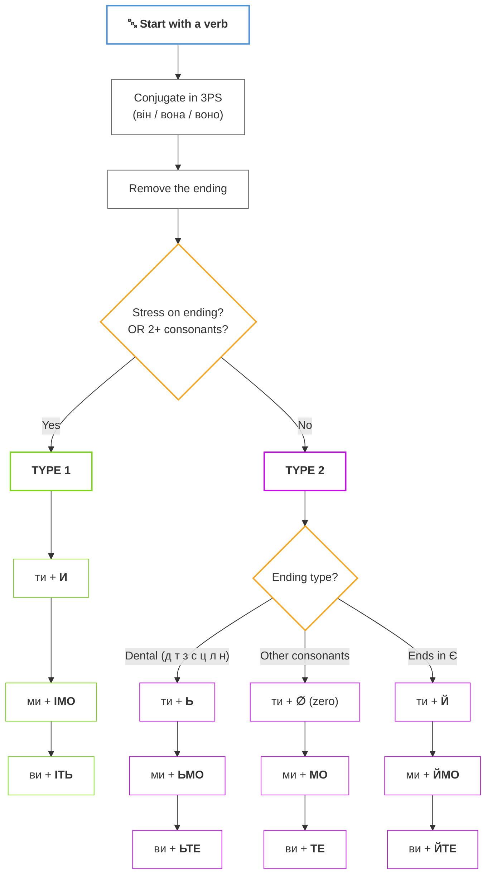
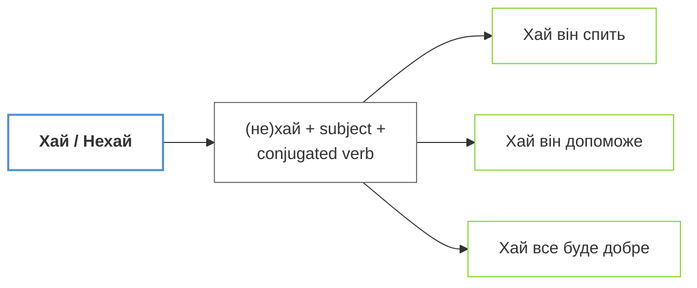
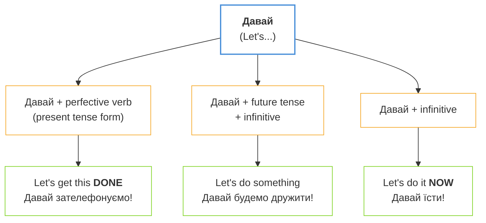

# Phase 5: Critical Deep Review

> **You are executing Phase 5 of an orchestrated rebuild.**
> **Your ONLY task: Perform a rigorous, evidence-based review.**
> **Every score must be backed by specific findings. Every finding must cite a line number.**

## Files to Read (ALL REQUIRED)

Read ALL of these files from disk before writing anything:

1. **Content** (the lesson you're reviewing): `# Роби, робімо, хай щастить: Наказовий спосіб (The Complete Imperative)

## Introduction / Вступ

**Ласкаво просимо до модуля про енергію дії!** У повсякденному житті ми постійно звертаємося до інших: просимо допомоги, даємо поради, запрошуємо до спільної дії або висловлюємо добрі побажання. В українській мові для цього використовується **наказовий спосіб**. Це не лише про "накази" в армійському сенсі; це про волю мовця, виражену через дієслово. Ви вже знаєте прості форми як «Скажіть, будь ласка» або «Читайте!». Сьогодні ми підемо далі та вивчимо повну систему: від делікатних запрошень «ходімо» до урочистих побажань «хай живе!». Вміння правильно використовувати ці форми зробить вашу українську мову точною, ввічливою та надзвичайно живою.

Ви вже знаєте деякі команди з рівня A1, як-от «Скажіть, будь ласка» або «Читайте!». Але як утворити ці форми самостійно для будь-якого дієслова? Як сказати «Ходімо!» або «Хай він вирішує»? Цей урок навчить вас повній системі українського наказового способу. *(You already know some commands from A1. But how do you form them for any verb? This lesson teaches you the complete Ukrainian imperative system.)*

**Що ви вивчите в цьому модулі:**

- Творення наказового способу для 2-ї особи (**ти/ви**) за правилами основ.
- Форму для спільної дії (**ми**) — українське «let's...».
- Використання часток **хай** та **нехай** для 3-ї особи та побажань.
- Нерегулярні, але дуже часті форми: **їж**, **пий**, **будь**, **дай**.
- Як залишатися ввічливим, даючи команди чи поради.

## Presentation / Презентація

### 1. Прямі команди: Основна система (2-га особа: ти/ви)

#### Алгоритм творення

Щоб утворити наказовий спосіб, виконайте ці кроки *(To form the imperative, follow these steps)*:



#### Step-by-Step / Крок за кроком

**Крок 1:** Візьміть дієслово та поставте його в 3-ю особу однини (він/вона/воно).

**Крок 2:** Видаліть закінчення, щоб отримати основу.

**Крок 3:** Визначте тип дієслова за наголосом та приголосними.

---

#### ТИП 1: Наголос на закінченні АБО група приголосних

Використовуйте ці суфікси, якщо дієслово має **наголос на закінченні**. Також якщо перед закінченням стоять **дві приголосні**:

| Особа | Закінчення | Приклад |
|-------|------------|---------|
| ти | **-и** | говор**и**! пиш**и**! |
| ми | **-імо** | говор**імо**! пиш**імо**! |
| ви | **-іть** | говор**іть**! пиш**іть**! |

**Приклади:**
- говор**ять** (stress on -ять) → говор**и**! / говор**імо**! / говор**іть**!
- пиш**уть** (stress on -уть) → пиш**и**! / пиш**імо**! / пиш**іть**!
- крикн**уть** (consonant cluster -кн-) → крикн**и**! / крикн**імо**! / крикн**іть**!

---

#### ТИП 2: Наголос НЕ на закінченні

Якщо наголос падає на **корінь** (не на закінчення), маєте три підтипи:

##### 2a. Зубні приголосні

> [!tip] **Мнемоніка**
> **«Де ти з'їси ці лини?»** — Ця фраза містить усі зубні приголосні: **д, т, з, с, ц, л, н**

Для основ, що закінчуються на зубні приголосні, додайте **м'який знак** (ь):

| Особа | Закінчення | Приклад |
|-------|------------|---------|
| ти | **-ь** | сяд**ь**! стан**ь**! |
| ми | **-ьмо** | сяд**ьмо**! стан**ьмо**! |
| ви | **-ьте** | сяд**ьте**! стан**ьте**! |

**Приклади:**
- сід**ати** → сяд**ь**! / сяд**ьмо**! / сяд**ьте**!
- ста**ти** → стан**ь**! / стан**ьмо**! / стан**ьте**!
- різ**ати** → ріж**ь**! / ріж**ьмо**! / ріж**ьте**!

##### 2b. Нульове закінчення

Для інших приголосних (не зубних) використовуйте **нульове закінчення** для форми «ти»:

| Особа | Закінчення | Приклад |
|-------|------------|---------|
| ти | **∅** (нуль) | готу́й! працю́й! |
| ми | **-мо** | готу́ймо! працю́ймо! |
| ви | **-те** | готу́йте! працю́йте! |

##### 2c. Основа на -є

Для дієслів, чия основа закінчується на **-є**, додайте **-й**:

| Особа | Закінчення | Приклад |
|-------|------------|---------|
| ти | **-й** | чита**й**! дума**й**! |
| ми | **-ймо** | чита**ймо**! дума**ймо**! |
| ви | **-йте** | чита**йте**! дума**йте**! |

**Приклади:**
- чита**ють** → чита**й**! / чита**ймо**! / чита**йте**!
- дума**ють** → дума**й**! / дума**ймо**! / дума**йте**!
- зна**ють** → зна**й**! / зна**ймо**! / зна**йте**!

### 2. The Invitation Form: «Ходімо!» (1-ша особа множини: ми)

Ukrainian doesn't need a helping word like "let's." We have a unique suffix **-мо** that we add to the singular imperative form.

В українській мові для форми «давайте зробимо» ми просто додаємо суфікс **-мо** до форми однини. Це звучить природно! Наприклад: «Ходімо!» *(Let's go!)*, «Пишімо!» *(Let's write!)*.

- Йди -> **Йдімо! / Ходімо!**
- Читай -> **Читаймо!**
- Пиши -> **Пишімо!**
- Почни -> **Почнімо!**

### 3. Indirect Wishes: Хай буде! (3-тя особа: хай/нехай)

When you want to express a command or wish for someone not present (he, she, they), use the particles **хай** or **нехай** followed by the present tense verb.

Коли потрібно висловити побажання для когось відсутнього, використовуйте частки **хай** або **нехай**. Ця конструкція дуже поширена в тостах!



- **хай** — розмовний стиль, неформально.
- **нехай** — урочистий, літературний, поетичний стиль.

**Приклади:**

- **Хай** він сам вирішує. *(Let him decide himself.)*
- **Нехай** здійсняться ваші мрії! *(May your dreams come true!)*
- **Хай** живе Україна! *(Long live Ukraine!)*
- **Хай** вона відпочине. *(Let her rest.)*
- **Нехай** буде світло! *(Let there be light!)*

### 3b. The "Давай" Constructions

Another way to express "Let's..." is using **давай/давайте**. This is common in spoken Ukrainian and has three patterns:



| Конструкція | Значення | Приклад |
|-------------|----------|---------|
| Давай + pf. verb (present) | Let's get this done | Давай **зателефонуємо**! |
| Давай + будемо + infinitive | Let's do something | Давай **будемо дружити**! |
| Давай + infinitive | Let's do it now | Давай **їсти**! |

> [!tip] **Давай vs -мо forms**
> **Давай** can often be replaced with the native **-мо** imperative:
> - Давай танцювати → **Танцюймо!**
> - Давай йти → **Ходімо!**
>
> The **-мо** form sounds more natural and literary in Ukrainian!

### 4. Irregular Imperative Stars (Винятки)

Some of the most used verbs in daily life have unique imperative forms. Memorize these as "survival" vocabulary:

| Інфінітив | Ти (однина) | Ви (множина) | Переклад |
| :-------- | :------------ | :----------- | :------- |
| **їсти**  | **їж**        | **їжте**     | eat      |
| **пити**  | **пий**       | **пийте**    | drink    |
| **дати**  | **дай**       | **дайте**    | give     |
| **бути**  | **будь**      | **будьте**   | be       |
| **взяти** | **візьми**    | **візьміть** | take     |

> [!tip] **Прислів'я: Будь терплячим**
> «Сім раз **відмір**, один раз **відріж**.» *(Measure seven times, cut once.)* Це прислів'я використовує два наказові способи, щоб навчити нас цінності обдумування. Зверніть увагу на суфікс **-ь** (пом'якшення) в обох дієсловах!

> [!important] **Формула ввічливості**
> Прямі команди можуть звучати різко. Щоб пом'якшити їх, завжди додавайте **будь ласка**. В українській мові «Дай мені воду, будь ласка» звучить цілком ввічливо. Також можна використовувати **прошу** з інфінітивом: «Прошу зайти» *(Please, come in)*.

## Practice / Практика

### 1. Утворіть форму наказового способу

Перетворіть ці інфінітиви на наказовий спосіб для вказаної особи:

1. читати (ви) -> **читайте**
2. писати (ти) -> **пиши**
3. говорити (ми) -> **говорімо**
4. бути (ви) -> **будьте**
5. дати (хай + він) -> **хай дасть** (Wait, no: **хай дасть** / **хай дає** depending on aspect). Correct: **Хай дає!**
6. йти (ми) -> **ходімо**

### 2. Заперечні команди: Не роби!

Щоб сказати комусь НЕ робити чогось, просто додайте **не** перед наказовою формою:

1. Читайте! -> **Не читайте!**
2. Кричи! -> **Не кричи!**
3. Забудь! -> **Не забудь!**
4. Хвилюйся! -> **Не хвилюйся!** (Don't worry!)

### 3. Кулінарні інструкції: Рецепт борщу

Поставте дієслова в наказовий спосіб (форма «ви»), щоб дати інструкції.
*(наріжте, варіть, додайте, почистіть)*

1. Спочатку \_\_\_ овочі. -> **почистіть**
2. Потім дрібно \_\_\_ їх. -> **наріжте**
3. \_\_\_ м'ясо в каструлі. -> **варіть**
4. Нарешті \_\_\_ сметану. -> **додайте**

> [!reflection] **Сила авторитету**
> Коли ви використовуєте наказовий спосіб, ви берете ситуацію під контроль. Чи ви керуєте проектом, чи просто просите про послугу — чіткість вашої команди показує вашу впевненість у мові. Командний голос — це голос лідера!

> [!tip] **Тости з побажаннями**
> На українській вечірці використовуйте «хай» для тостів: «**Хай** ваші діти будуть здоровими!» або просто «**Хай** щастить!» *(Good luck!)*. Це надає вашим побажанням урочистого та щирого звучання.

## Dialogues / Діалоги

### На кухні (Coordination in the Kitchen)

**Мама:** Олег, **допоможи** мені, будь ласка! (Oleh, help me, please!)
**Олег:** Що робити? (What should I do?)
**Мама:** **Наріж** овочі для салату. А ви, діти, **не заважайте**! (Cut the vegetables for the salad. And you, children, don't get in the way!)
**Олег:** Добре. Мамо, **дай** мені гострий ніж. (Fine. Mom, give me the sharp knife.)
**Мама:** Ось, **візьми**. **Будь** обережним! (Here, take it. Be careful!)
**Олег:** **Не хвилюйся**, я вмію різати. **Почнімо** готувати вечерю! (Don't worry, I know how to cut. Let's start cooking dinner!)

> [!context] **Social Hierarchy and Commands**
> In Ukrainian families, elders use ти for direct commands to younger ones. Younger people respond with ви formally, or ти for close relatives. Adding «будь ласка» is the universal bridge for politeness regardless of age.

# Summary / Підсумок

In this module, you learned to take command:

- **2nd person forms** (ти/ви) with the algorithm for -и/-ь/-й endings
- **Invitation form** with -мо suffix (ходімо, робімо)
- **Third person wishes** with хай/нехай particles
- **Key irregulars**: дай, будь, їж, пий, візьми
- **Politeness** with будь ласка and прошу

You've mastered the complete Ukrainian imperative system! Use it to give advice, make suggestions, and offer warm wishes. Your Ukrainian is now more functional and authoritative!

Подивіться на свій розклад на завтра. Напишіть п'ять команд самому собі, використовуючи форму «ти». Наприклад: «Прокинься о сьомій», «Пий воду», «Пиши плани». Також придумайте одне велике побажання для своєї родини з часткою «нехай». Постійна практика перетворює правила на звичку! Удачі у ваших нових справах!

---

## Швидка довідка


*Джерело схеми: навчальні матеріали з української мови*
`
2. **Activities**: `---
- type: fill-in
  title: Утворіть наказову форму
  items:
  - sentence: читати → ___ (ти)
    answer: читай
    options:
    - читай
    - читаю
    - читати
    - читайте
  - sentence: писати → ___ (ти)
    answer: пиши
    options:
    - пиши
    - пишу
    - писай
    - пишіть
  - sentence: говорити → ___ (ти)
    answer: говори
    options:
    - говори
    - говорю
    - говорий
    - говоріть
  - sentence: їсти → ___ (ти)
    answer: їж
    options:
    - їж
    - їм
    - їсти
    - їжте
  - sentence: дати → ___ (ти)
    answer: дай
    options:
    - дай
    - даю
    - дати
    - дайте
  - sentence: бути → ___ (ти)
    answer: будь
    options:
    - будь
    - буду
    - бути
    - будьте
  - sentence: читай → ___ (ви)
    answer: читайте
    options:
    - читайте
    - читають
    - читаймо
    - читай
  - sentence: пиши → ___ (ви)
    answer: пишіть
    options:
    - пишіть
    - пишуть
    - пишимо
    - пиши
  instruction: Оберіть правильне слово для заповнення пропуску.
- type: match-up
  title: Наказові частки
  pairs:
  - left: хай
    right: розмовний стиль
  - left: нехай
    right: літературний стиль
  - left: Хай щастить!
    right: Good luck!
  - left: Нехай буде так.
    right: So be it.
  - left: Хай живе!
    right: Long live!
  - left: Хай він вирішує.
    right: Let him decide.
  - left: Нехай вона відпочине.
    right: Let her rest.
  - left: Хай там що.
    right: Whatever happens.
  - left: Хай буде!
    right: Let it be!
  - left: Нехай живе!
    right: Long live!
  instruction: З'єднайте відповідні елементи.
- type: fill-in
  title: Доповніть хай або нехай
  items:
  - sentence: ___ діти граються в парку.
    answer: Хай
    options:
    - Хай
    - Читай
    - Робіть
    - Пиши
  - sentence: ___ здійсняться всі ваші мрії!
    answer: Нехай
    options:
    - Нехай
    - Говори
    - Читаймо
    - Пишіть
  - sentence: ___ він сам вирішує це питання.
    answer: Хай
    options:
    - Хай
    - Робіть
    - Говоріть
    - Пиши
  - sentence: ___ студенти відпочинуть після іспиту.
    answer: Хай
    options:
    - Хай
    - Читаймо
    - Робіть
    - Говори
  - sentence: ___ живе дружба між народами!
    answer: Нехай
    options:
    - Нехай
    - Говоріть
    - Читай
    - Пишіть
  - sentence: ___ вона зателефонує пізніше.
    answer: Хай
    options:
    - Хай
    - Робімо
    - Говори
    - Читай
  - sentence: ___ клієнт почекає.
    answer: Хай
    options:
    - Хай
    - Читайте
    - Робіть
    - Пиши
  - sentence: ___ тобі щастить!
    answer: Хай
    options:
    - Хай
    - Говори
    - Читай
    - Робіть
  instruction: Оберіть правильне слово для заповнення пропуску.
- type: group-sort
  title: Розсортуйте за стилем
  groups:
  - name: Розмовний
    items:
    - Хай він приходить.
    - Хай щастить!
    - Хай там що.
    - Хай діти грають.
    - Хай буде так.
    - Хай він вирішує.
  - name: Літературний
    items:
    - Нехай буде так.
    - Нехай здійсняться мрії.
    - Нехай живе Україна!
    - Нехай вона відпочине.
    - Нехай студенти працюють.
    - Нехай тобі щастить!
  instruction: Розподіліть елементи за групами.
- type: quiz
  title: Розуміння наказового способу
  items:
  - question: Які українські частки використовуються для утворення наказового способу
      3-ї особи?
    options:
    - text: хай / нехай
      correct: true
    - text: якщо / якби
      correct: false
    - text: чи / або
      correct: false
    - text: і / а
      correct: false
  - question: Яка з двох часток наказового способу вважається більш офіційною та літературною?
    options:
    - text: нехай
      correct: true
    - text: хай
      correct: false
    - text: обидві однаково
      correct: false
    - text: жодна
      correct: false
  - question: Що означає українське побажання «Хай щастить!» англійською мовою?
    options:
    - text: Good luck!
      correct: true
    - text: Goodbye!
      correct: false
    - text: Thank you!
      correct: false
    - text: Hello!
      correct: false
  - question: Як правильно утворити наказовий спосіб для третьої особи в українській
      мові?
    options:
    - text: хай/нехай + теперішній час
      correct: true
    - text: хай/нехай + інфінітив
      correct: false
    - text: хай/нехай + минулий час
      correct: false
    - text: хай/нехай + майбутній час
      correct: false
  - question: Яка форма наказового способу від дієслова «читати» для третьої особи
      є правильною?
    options:
    - text: Хай він читає.
      correct: true
    - text: Хай він читати.
      correct: false
    - text: Хай він читав.
      correct: false
    - text: Хай він читатиме.
      correct: false
  - question: Що означає українське побажання «Нехай буде так» англійською мовою?
    options:
    - text: So be it.
      correct: true
    - text: Let me see.
      correct: false
    - text: Go away.
      correct: false
    - text: Come here.
      correct: false
  - question: У яких ситуаціях краще використовувати частку «нехай» замість «хай»?
    options:
    - text: у літературі, офіційно
      correct: true
    - text: тільки з друзями
      correct: false
    - text: ніколи
      correct: false
    - text: завжди
      correct: false
  - question: Яка форма наказового способу від «робити» для 3-ї особи множини є правильною?
    options:
    - text: Хай роблять!
      correct: true
    - text: Хай робить!
      correct: false
    - text: Хай робити!
      correct: false
    - text: Хай робив!
      correct: false
  instruction: Оберіть правильну відповідь.
- type: unjumble
  title: Складіть речення
  items:
  - answer: Хай він сам вирішує це важливе питання сьогодні.
    words:
    - він
    - хай
    - сам
    - вирішує
    - це
    - важливе
    - питання
    - сьогодні
  - answer: Нехай гості приходять до нас на вечерю о сьомій годині.
    words:
    - приходять
    - гості
    - нехай
    - о сьомій
    - годині
    - на вечерю
    - до нас
  - answer: Хай діти весело граються в парку разом після школи.
    words:
    - діти
    - хай
    - граються
    - в парку
    - разом
    - весело
    - після школи
  - answer: Нехай буде так, як ми домовилися з тобою вчора.
    words:
    - буде
    - нехай
    - так
    - як
    - ми
    - домовилися
    - з тобою
    - вчора
  - answer: Хай тобі щастить на новій роботі у Львові.
    words:
    - щастить
    - хай
    - тобі
    - на
    - новій
    - роботі
    - у Львові
  - answer: Хай вона зателефонує пізніше, коли буде вільний час.
    words:
    - вона
    - хай
    - зателефонує
    - пізніше
    - коли
    - буде
    - вільний час
  instruction: Розташуйте слова у правильному порядку.
- type: error-correction
  title: Виправте помилки
  items:
  - sentence: Хай він читати книгу.
    error: читати
    answer: читає
    options:
    - читає
    - читати
    - читав
    - читай
    explanation: Після хай/нехай — теперішній час, не інфінітив.
  - sentence: Нехай вони приходили вчасно.
    error: приходили
    answer: приходять
    options:
    - приходять
    - приходили
    - прийшли
    - приходьте
    explanation: Наказовий 3-ї особи — теперішній час.
  - sentence: Хай студенти робили домашнє завдання.
    error: робили
    answer: роблять
    options:
    - роблять
    - робили
    - зробили
    - робіть
    explanation: Після хай — теперішній час.
  - sentence: Нехай він говорив українською.
    error: говорив
    answer: говорить
    options:
    - говорить
    - говорив
    - говорити
    - говори
    explanation: Наказовий 3-ї особи — теперішній час.
  - sentence: Хай вона писати листа.
    error: писати
    answer: пише
    options:
    - пише
    - писати
    - писала
    - пиши
    explanation: Після хай — теперішній час.
  - sentence: Нехай діти спали добре.
    error: спали
    answer: сплять
    options:
    - сплять
    - спали
    - спати
    - спіть
    explanation: Теперішній час, не минулий.
  instruction: Знайдіть і виправте помилку в реченні.
- type: cloze
  title: Доповніть діалог
  passage: '— Директор хоче бачити Марію.

    — Її зараз немає. Вона на {зустрічі|обіді|роботі|зустрічі}.

    — {Хай|Якщо|Коли|Хай} вона зателефонує, коли повернеться.

    — Добре, {передам|передаю|передати|передам}.

    — А що робити з {документами|книгами|листами|документами}?

    — {Хай|Нехай|Якби|Хай} лежать на столі. Я подивлюся пізніше.

    — Гаразд. {Хай|Нехай|Якщо|Хай} він сам вирішує.

    — Так, {нехай|хай|якби|нехай} буде так.

    — {Хай|Нехай|Якщо|Хай} щастить з проєктом!

    — Дякую! {Нехай|Хай|Якби|Нехай} все буде добре.

    — І {хай|нехай|якщо|хай} гості приходять вчасно.

    — Обов''язково. {Хай|Нехай|Якби|Хай} живе наша команда!

    — {Нехай|Хай|Якщо|Нехай} здійсняться всі плани!

    '
  instruction: Заповніть пропуски, обравши правильні слова.
- type: translate
  title: Перекладіть українською
  items:
  - source: Let him decide.
    options:
    - text: Хай він вирішує.
      correct: true
    - text: Він вирішує.
      correct: false
    - text: Вирішуй!
      correct: false
  - source: May your dream come true!
    options:
    - text: Нехай здійсниться твоя мрія!
      correct: true
    - text: Твоя мрія здійснюється.
      correct: false
    - text: Мрій далі!
      correct: false
  - source: Let them come at seven.
    options:
    - text: Хай вони приходять о сьомій.
      correct: true
    - text: Вони приходять о сьомій.
      correct: false
    - text: Приходьте о сьомій.
      correct: false
  - source: Good luck!
    options:
    - text: Хай щастить!
      correct: true
    - text: Щастить!
      correct: false
    - text: До побачення!
      correct: false
  - source: Let her rest.
    options:
    - text: Нехай вона відпочине.
      correct: true
    - text: Вона відпочиває.
      correct: false
    - text: Відпочинь!
      correct: false
  - source: Let the children play.
    options:
    - text: Хай діти грають.
      correct: true
    - text: Діти грають.
      correct: false
    - text: Грайте, діти!
      correct: false
  instruction: Оберіть правильний переклад.
- type: true-false
  title: Правда чи ні?
  items:
  - statement: Хай використовується в офіційних документах.
    explanation: У офіційних документах частіше використовується нехай.
    correct: false
  - statement: Нехай — це літературна форма.
    explanation: Нехай частіше зустрічається в літературі.
    correct: true
  - statement: Після хай вживається інфінітив.
    explanation: Після хай вживається теперішній час 3-ї особи.
    correct: false
  - statement: «Хай щастить!» означає «Good luck!»
    explanation: Це типове побажання удачі.
    correct: true
  - statement: Хай і нехай мають різні значення.
    explanation: Вони мають однакове значення, але різний стиль.
    correct: false
  - statement: Хай він читає — правильна форма.
    explanation: Це правильний наказовий спосіб 3-ї особи.
    correct: true
  - statement: Наказовий спосіб 3-ї особи використовує минулий час.
    explanation: Він використовує теперішній час.
    correct: false
  - statement: «Хай живе!» — типовий вираз зі словом хай.
    explanation: Це поширений вираз, наприклад «Хай живе Україна!»
    correct: true
  instruction: Визначте, чи твердження правильне.
`
3. **Vocabulary**: `---
module: 23-complete-imperative
level: A2
version: '2.0'
items:
- lemma: вибачення
  ipa: /ʋˈɪbat͡ʃɛnnja/
  translation: apology, forgiveness
  pos: noun
  gender: n
- lemma: здійснитися
  ipa: /zdijsnˈɪtɪsja/
  translation: to come true, to happen
  pos: verb
- lemma: калька
  ipa: /kˈalʲka/
  translation: tracing paper, loan translation (calque)
  pos: noun
  gender: f
- lemma: нехай
  ipa: /nɛxˈaj/
  translation: let, may (particle)
  pos: part
- lemma: побажання
  ipa: /pɔbaʒˈannja/
  translation: wish, desire
  pos: noun
- lemma: приміряти
  ipa: /prɪmirjatɪ/
  translation: to try on (clothes)
  pos: verb
- lemma: сам
  ipa: /sam/
  translation: self, alone
  pos: pron
- lemma: хаяти
  ipa: /xaj/
  translation: to criticize
  pos: part
- lemma: часть
  ipa: /t͡ʃastʲ/
  translation: part
  pos: noun
  gender: f
- lemma: щастити
  ipa: /ʃt͡ʃastˈɪtɪ/
  translation: to be lucky
  pos: verb
- lemma: робити
  ipa: /roˈbɪtɪ/
  translation: to do, to make
  pos: verb
- lemma: писати
  ipa: /pɪˈsatɪ/
  translation: to write
  pos: verb
- lemma: давайте
  ipa: /daˈvajtɛ/
  translation: let's, come on (imperative plural)
  pos: verb
- lemma: показати
  ipa: /pokaˈzatɪ/
  translation: to show (perfective)
  pos: verb
- lemma: взяти
  ipa: /ˈvzʲatɪ/
  translation: to take (perfective)
  pos: verb
- lemma: читати
  ipa: /t͡ʃɪˈtatɪ/
  translation: to read
  pos: verb
- lemma: говорити
  ipa: /ɦovoˈrɪtɪ/
  translation: to speak, to talk
  pos: verb
- lemma: ставити
  ipa: /ˈstavɪtɪ/
  translation: to put, to place
  pos: verb
- lemma: сідати
  ipa: /siˈdatɪ/
  translation: to sit down
  pos: verb
- lemma: іти
  ipa: /iˈtɪ/
  translation: to go (on foot)
  pos: verb
- lemma: ходити
  ipa: /xoˈdɪtɪ/
  translation: to walk, to go (multidirectional)
  pos: verb
- lemma: починати
  ipa: /pot͡ʃɪˈnatɪ/
  translation: to begin, to start
  pos: verb
- lemma: вирішувати
  ipa: /vɪriˈʃuvatɪ/
  translation: to decide, to solve
  pos: verb
- lemma: їсти
  ipa: /ˈjistɪ/
  translation: to eat
  pos: verb
- lemma: пити
  ipa: /ˈpɪtɪ/
  translation: to drink
  pos: verb
- lemma: дати
  ipa: /ˈdatɪ/
  translation: to give (perfective)
  pos: verb
- lemma: бути
  ipa: /ˈbutɪ/
  translation: to be
  pos: verb
- lemma: хай
  ipa: /xaj/
  translation: let, may (particle)
  pos: particle
- lemma: взяти
  ipa: /ˈvzʲatɪ/
  translation: to take (perfective)
  pos: verb
- lemma: просити
  ipa: /prˈɔsɪtɪ/
  translation: to ask, to request
  pos: verb
- lemma: послухати
  ipa: /pɔslˈuxatɪ/
  translation: to listen (perfective)
  pos: verb
- lemma: зачекати
  ipa: /zat͡ʃɛkˈatɪ/
  translation: to wait (perfective)
  pos: verb
- lemma: сказати
  ipa: /skˈazatɪ/
  translation: to say, to tell (perfective)
  pos: verb
- lemma: пояснити
  ipa: /pojasnˈɪtɪ/
  translation: to explain (perfective)
  pos: verb
- lemma: повторити
  ipa: /pɔʋtɔrˈɪtɪ/
  translation: to repeat (perfective)
  pos: verb
- lemma: спробувати
  ipa: /sprɔbуʋatɪ/
  translation: to try
  pos: verb
- lemma: приносити
  ipa: /prɪnˈɔsɪtɪ/
  translation: to bring (imperfective)
  pos: verb
- lemma: принести
  ipa: /prɪnɛstˈɪ/
  translation: to bring (perfective)
  pos: verb
- lemma: залишити
  ipa: /zalɪʃˈɪtɪ/
  translation: to leave (perfective)
  pos: verb
- lemma: передати
  ipa: /pɛrɛdˈatɪ/
  translation: to pass, to give (perfective)
  pos: verb
- lemma: множина
  ipa: /mnoʒˈɪna/
  translation: plural (grammatical number)
  pos: noun
  gender: f
- lemma: однина
  ipa: /odnˈɪna/
  translation: singular (grammatical number)
  pos: noun
  gender: f
`
4. **Plan** (source of truth for scope): `---
module: a2-23
level: A2
sequence: 23
slug: 23-complete-imperative
version: '2.0'
title: Complete Imperative
subtitle: Let It Be! (3rd Person)
content_outline:
- section: Introduction / Вступ
  words: 200
  points:
  - Concept of willpower in language
  - Why imperative is not always 'impolite'
- section: Presentation / Презентація
  words: 600
  points:
  - Review of 2nd person (ти/ви)
  - The 'Let's' form (-мо suffix)
  - 3rd Person: хай / нехай (The indirect wish)
  - Formation nuances (soft vs hard stems)
  - Negative Imperatives (не)
- section: Practice / Практика
  words: 150
  points:
  - Instructions for a recipe (Борщ)
  - Toast making ceremony
- section: Dialogues / Діалоги
  words: 50
  points:
  - Kitchen dialogue or team coordination
word_target: 1000
focus: grammar
pedagogy: PPP
objectives:
- Learner can form 3rd person commands using хай/нехай
- Learner can make toasts and wishes
- Learner can relay indirect commands
- Learner can use the full range of imperative forms
module_type: grammar
sources:
- name: Ukrainian State Standard 2024 - Imperative
  url: "https://mon.gov.ua/"
  type: reference
  notes: Complete imperative mood requirements for A2
- name: Grammar of Ukrainian Language - Verb Moods
  url: "https://uk.wikipedia.org/wiki/Наказовий_спосіб"
  type: reference
  notes: Detailed rules for all persons in imperative
immersion: 40-50% Ukrainian
phase: A2.2
`
5. **Meta** (build config): `---
module: a2-23
level: A2
slug: 23-complete-imperative
version: '2.0'
id: a2-23
naturalness:
  score: 8
  status: PASS
  issues:
  - 'Orthography error in Section 1.3: ''ставь/ставьте'' is incorrect; labials (в)
    do not take a soft sign. Correct forms are ''став/ставте''.'
  - 'Editing artifact visible in Practice 1, Item 5: The text ''Wait, no: ... depending
    on aspect'' appears to be an internal monologue or draft note left in the student-facing
    content.'
  recommendation: Fix the spelling of 'ставте' and remove the internal editing commentary
    in the Practice section.
duration: 60
transliteration: none
tags:
- grammar
- verbs
- imperative
- commands
word_target: 1000
build:
  last_modified: '2026-01-26'
`
6. **Research notes** (if exists): `# Research Notes: The Complete Imperative (Наказовий спосіб)

**Track**: Core A (l2-uk-en)
**Module**: A2 M23 "Роби, робімо, хай щастить: Наказовий спосіб"
**Researched**: 2026-02-08
**Level**: A2 (Intermediate Beginner)

## 1. Grammar: State Standard 2024 Reference

According to the **Державний стандарт української мови як іноземної (2024)**, the imperative mood is introduced progressively across levels A1, A2, and B1.

*   **Level A1 (§4.2.4.2):** Focuses on basic 2nd person singular and plural forms for high-frequency verbs.
    *   *Quote:* "Форми 2-ї особи однини і множини наказового способу деяких дієслів: читати (читай, читайте), сказати (скажи, скажіть)..."
*   **Level A2 (§4.2.3.2):** Expands to include the 3rd person imperative (using particles *хай/нехай*).
    *   *Quote:* "Форми 2-ї і 3-ї особи однини і множини наказового способу деяких дієслів: мріяти (мрій, мрійте, хай / нехай мріє, хай / нехай мріють)..."
*   **Level B1 (§4.2.3.2):** Formally introduces the 1st person plural (inclusive "let's").
    *   *Quote:* "Утворення форм наказового способу: мрій, мріймо; кажіть, скажіть, скажімо..."

**Note on this Module:** Although 1st person plural (*робімо*) is formally B1 in the standard, it is included in this A2 module to provide a "Complete" overview of the imperative mood, reflecting its high frequency in daily communication.

## 2. Vocabulary Frequency

### High-Frequency Imperatives (A2 Level)
| Verb | Imperative (Singular) | Imperative (Plural) | English | Frequency Note |
| :--- | :--- | :--- | :--- | :--- |
| **Дати** | Дай | Дайте | Give | Essential for requests |
| **Сказати** | Скажи | Скажіть | Tell/Say | Essential for communication |
| **Слухати** | Слухай | Слухайте | Listen | Classroom/Social interaction |
| **Дивитися** | Дивись | Дивіться | Look | Drawing attention |
| **Зачекати** | Зачекай | Зачекайте | Wait | Daily logistics |
| **Пити** | Пий | Пийте | Drink | Social/Dining |
| **Їсти** | Їж | Їжте | Eat | Social/Dining |
| **Іти** | Іди / Йди | Ідіть / Йдіть | Go/Come | Movement |

### Common Collocations & Phrases
*   **Хай щастить!** (Good luck! / May it be lucky!) - High-frequency parting wish.
*   **Давай(те) + [Infinitive/Future]** - Colloquial "Let's". (e.g., *Давайте пити каву*).
*   **Не турбуйся** (Don't worry) - Common emotional support.
*   **Будь ласка, скажіть...** (Please tell...) - Polite request.

## 3. Cultural Hook

*   **The Toast "Будьмо!":** The most iconic Ukrainian toast is a 1st person plural imperative of the verb *бути* (to be). It literally means "Let us be!" (implying health, prosperity, and togetherness). It is often repeated three times by the group.
*   **Wishes with "Хай":** Ukrainian culture places great emphasis on verbal wishes. Phrases like **"Хай щастить!"** (Good luck), **"Хай живе!"** (Long live!), and **"Хай збуваються мрії!"** (May dreams come true!) showcase the 3rd person imperative as a tool for blessing and social bonding rather than just "commands."
*   **Proverbs:** Many Ukrainian proverbs use the imperative to convey folk wisdom. Example: *«Сім раз відмір, один раз відріж»* (Measure seven times, cut once).

## 4. Pedagogical Notes

### Key Differences from English
*   **Morphology:** English uses the base form of the verb ("Do!"). Ukrainian has three distinct morphological endings for the 2nd person singular: **-и** (піди), **-й** (читай), or **null/soft sign** (сядь, відріж).
*   **Person/Number:** Ukrainian distinguishes between singular (*ти*) and plural/polite (*ви*).
*   **Aspect:** The choice of aspect in the imperative is critical. 
    *   **Perfective:** Used for specific, one-time requests or orders (*Дай мені книгу*).
    *   **Imperfective:** Used for general advice, invitations, or repeated actions (*Приходьте в гості*). 
    *   **Prohibitions:** Negative imperatives almost always use the **Imperfective** (*Не роби цього!*). Using the perfective in a negative command often implies a warning about an accidental action (*Не впади!* - Don't fall!).

### Common Learner Errors
*   **Using the Infinitive:** English speakers often try to use the infinitive (e.g., *Робити!* instead of *Роби!*).
*   **-и vs -й Confusion:** Difficulty deciding which ending to apply based on the present tense stem.
*   **3rd Person Construction:** Forgetting the particle *хай/нехай* and just using the 3rd person indicative.

## 5. Scope Boundaries

### In Scope
*   **2nd Person Singular/Plural:** Full morphology (-и, -й, null).
*   **3rd Person:** Use of *хай / нехай* + present/future indicative.
*   **1st Person Plural:** Synthetic forms (*-імо/-мо*) and analytic colloquial forms (*давай/давайте* + infinitive).
*   **Negative Imperatives:** Using *не* + Imperfective for prohibitions.

### Out of Scope
*   **Passive Imperatives:** Constructions like "Be warned".
*   **Archaic/Poetic Forms:** Unusual imperatives found in old literature.
*   **Complex Subjunctive-Imperative overlaps:** Using the conditional to soften commands (taught in separate modules).
*   **Reflexive Imperative Nuances:** While basic reflexives like *вмивайся* are in scope, complex reflexive-only verbs with aspectual shifts are avoided.
`

**Do not proceed until you have read every line of the content and every activity item.**

> **ANTI-STALE-REVIEW RULE**: This file may have been fixed since a previous review. You MUST review the CURRENT state of the files, not repeat findings from a prior review. If an issue was cited before but is now fixed, it must NOT appear in your review. Every finding must be verifiable by quoting the actual current content.

## Audit Metrics (Facts from Claude)

```
Word count:       1855 / 1000 (186%)
Activities:       10
Vocabulary items: 0
Engagement boxes: 5
Immersion:        varies% (target: varies)
Audit status:     pending review
```

---

## STEP 1: PLAN VERIFICATION

Cross-check content against the plan file:

1. **Outline compliance**: Is every section from `content_outline` present as an H2/H3?
2. **Vocabulary scope**: List every Ukrainian vocabulary word taught in the content. Compare against `vocabulary_hints.required` in the plan. Flag any word NOT in the plan.
3. **Grammar scope**: What grammar does this module teach? What grammar from LATER modules appears in examples or dialogues? (This is scope creep — flag it.)
4. **Objectives**: Are all learning objectives from the plan addressed in the content?

Report findings as:
```
Plan-Content Alignment: [PASS/FAIL]
- Sections: [all present / missing: X, Y]
- Vocabulary: [X/Y from plan used, Z extra words found]
- Grammar scope: [clean / scope creep: specific items]
- Objectives: [all covered / missing: X]
```

---

## STEP 2: DEEP VERIFICATION (Line by Line)

### Ukrainian Sentences
Go through the file section by section. For EACH Ukrainian sentence:
- Is grammar correct? (cases, verb forms, agreement)
- Does it sound natural? (not robotic, not calqued from English)
- Are there Russianisms? (check against list below)
- Is vocabulary appropriate for the level?

### English Sentences
- Is it clear and accessible?
- Warm tutor voice or cold textbook?
- Over-explaining simple things? Under-explaining complex ones?

### IPA Transcriptions (if present)
- Every transcription must be checked for correct stress placement
- Ukrainian stress is unpredictable — verify each one
- Watch for English approximations instead of Ukrainian phonemes

### Activities (EVERY ITEM)

**CRITICAL: Read the actual YAML file line by line.** Do NOT assume what the file contains — read it. If a previous review said "add English cues" but the file already has them, acknowledge the fix is present. Never cite an issue that doesn't exist in the CURRENT file.

Check each activity item individually:
- **quiz**: Grammatically correct? Exactly one correct answer? Options plausible?
- **fill-in**: Sentence correct with answer filled in? Only ONE valid answer given the context/cues? Distractors plausible?
- **match-up**: All pairs correct? No duplicates?
- **true-false**: True statements actually true? False clearly false?
- **unjumble**: Answer forms a correct, natural sentence?
- **group-sort**: Items correctly categorized?
- **anagram**: Solution correct? Hint clear?

Count as you go. You MUST report how many items you checked.

**Verification rule**: For EVERY issue you cite, quote the EXACT line from the file. If you cannot quote it, the issue does not exist.

---

## STEP 3: AUTO-FAIL CHECKLIST

Check EVERY category. Report "[CLEAN]" or list specific findings.

### Russianisms
| Wrong | Correct |
|-------|---------|
| кушать | їсти |
| приймати участь | брати участь |
| самий кращий | найкращий |
| слідуючий | наступний |
| на протязі | протягом |
| любий (any) | будь-який |
| отвічати | відповідати |
| вообще | взагалі |
| получати | отримувати |
| відноситися | ставитися |

**Finding:** [CLEAN] or [list with line numbers]

### Calques
| Wrong | Correct |
|-------|---------|
| робити сенс | мати сенс |
| брати місце | відбуватися |
| це є | це (usually) |

**Finding:** [CLEAN] or [list with line numbers]

### Grammar Scope Violations
At module 23, students know ONLY modules 1-22. Any grammar from later modules is scope creep.
- Past tense (if not yet taught)
- Cases not yet introduced
- Verb forms not yet taught

**Finding:** [CLEAN] or [list specific violations with line numbers]

### Activity Errors
- Wrong answer marked as correct
- Multiple valid answers but only one accepted
- Grammatically incorrect sentences
- Duplicate items

**Finding:** [CLEAN] or [list with activity number and item number]

### Beginner Safety ("Would I Continue?" Test)
| Question | Result |
|----------|--------|
| Did I feel overwhelmed? | [Pass/Fail] |
| Were instructions clear? | [Pass/Fail] |
| Did I get quick wins? | [Pass/Fail] |
| Was Ukrainian scary? | [Pass/Fail] |
| Would I come back tomorrow? | [Pass/Fail] |
| **Total** | **X/5** |

Emotional beats found:
- Welcome/orientation: [yes/no, where]
- Curiosity trigger: [yes/no, where]
- Quick wins: [count, where]
- Encouragement: [count, where]
- Progress marker: [yes/no, where]

---

## STEP 4: SCORE DIMENSIONS

**Score ONLY after completing Steps 1-3.** Each score must link to specific findings.

### Scoring Rules
- **9-10**: Excellent — no issues found in this dimension
- **7-8**: Good — minor issues found
- **5-6**: Needs work — multiple issues
- **<5**: Serious problems — major rewrite needed
- **If you found 3 grammar errors, Language cannot be 9**
- **If scope creep found, Relevance and Pedagogy cannot be 8+**

### Auto-Fail Thresholds
| Dimension | Auto-fail if below |
|-----------|-------------------|
| Experience Quality | <7 |
| Coherence | <7 |
| Relevance | <7 |
| Educational | <7 |
| Language | <8 |
| Pedagogy | <7 |
| Immersion | <6 |
| Activities | <7 |
| Richness | <6 |
| Beginner Safety | <7 |
| LLM Fingerprint | <7 |
| Linguistic Accuracy | <9 |

### Weighted Overall Score
```
Overall = (Experience × 1.5 + Coherence × 1.0 + Relevance × 1.0 + Educational × 1.2 +
          Language × 1.1 + Pedagogy × 1.2 + Immersion × 1.0 + Activities × 1.3 +
          Richness × 0.9 + Beginner_Safety × 1.3 + LLM × 1.0 + Linguistic_Accuracy × 1.5) / 14.0
```

**Quality target: 9.0+ overall AND no dimension below its auto-fail threshold.**
**If the score is below 9.0, you MUST provide a Fix Plan (see output format) with specific actions to reach 9/10.** The fix plan drives the iteration loop — Claude will send fixes to Gemini until the module reaches 9.0+.

---

## OUTPUT FORMAT

Wrap your ENTIRE review in these delimiters (REQUIRED for parsing):

```
===REVIEW_START===
# Рецензія: Complete Imperative

**Level:** A2 | **Module:** 23
**Overall Score:** {X.X}/10
**Status:** PASS / FAIL
**Reviewed:** {date}

## Plan Verification

```
Plan-Content Alignment: [PASS/FAIL]
- Sections: [status]
- Vocabulary: [X/Y from plan, Z extra]
- Grammar scope: [status]
- Objectives: [status]
```

## Scores

| # | Dimension | Score | Auto-fail | Evidence |
|---|-----------|-------|-----------|----------|
| 1 | Experience Quality | X/10 | <7 | [specific finding] |
| 2 | Coherence | X/10 | <7 | [specific finding] |
| 3 | Relevance | X/10 | <7 | [specific finding] |
| 4 | Educational | X/10 | <7 | [specific finding] |
| 5 | Language | X/10 | <8 | [specific finding] |
| 6 | Pedagogy | X/10 | <7 | [specific finding] |
| 7 | Immersion | X/10 | <6 | [actual % vs target] |
| 8 | Activities | X/10 | <7 | [specific finding] |
| 9 | Richness | X/10 | <6 | [specific finding] |
| 10 | Beginner Safety | X/10 | <7 | ["Would I Continue?" X/5] |
| 11 | LLM Fingerprint | X/10 | <7 | [specific finding] |
| 12 | Linguistic Accuracy | X/10 | <9 | [specific finding] |

**Weighted Overall:** {show calculation} = **X.X/10**

## Auto-Fail Checklist Results

- Russianisms: [CLEAN] or [list]
- Calques: [CLEAN] or [list]
- Grammar scope: [CLEAN] or [list]
- Activity errors: [CLEAN] or [list]
- Beginner safety: X/5

## Critical Issues Found

### Issue 1: {Category}
- **Location**: Line {N} / Section "{name}"
- **Original**: "{exact text}"
- **Problem**: {why it's wrong}
- **Fix**: {concrete replacement}

[... more issues ...]

## Ukrainian Language Issues

| Line | Current | Corrected | Type |
|------|---------|-----------|------|
| {N} | "{original}" | "{fixed}" | Russianisms / Calque / Scope / Grammar |

## Beginner Safety Audit

"Would I Continue?" Test: X/5
- Overwhelmed? [Pass/Fail]
- Instructions clear? [Pass/Fail]
- Quick wins? [Pass/Fail]
- Ukrainian scary? [Pass/Fail]
- Come back tomorrow? [Pass/Fail]

Emotional beats: X found
- Welcome: [location or "missing"]
- Curiosity: [location or "missing"]
- Quick wins: [count + locations]
- Encouragement: [count + locations]
- Progress: [location or "missing"]

## Strengths
- [Specific strength with evidence from content]

## Fix Plan to Reach 9/10 (REQUIRED if score < 9.0)

For EACH dimension scoring below 9, provide a concrete action plan:

### {Dimension Name}: {current}/10 → 9/10

**What to fix:**
1. Line {N}: Change "{current text}" → "{replacement text}" — {why this raises the score}
2. Section "{name}": {specific action} — {expected impact}
3. ...

**Expected score after fix:** {X}/10

[Repeat for every dimension below 9. Be specific — line numbers, exact replacements, section names.]

### Projected Overall After Fixes

```
{Recalculate weighted overall with projected dimension scores}
```

## Verification Summary

- Content lines read: {X}
- Activity items checked: {X}
- Ukrainian sentences verified: {X}
- IPA transcriptions checked: {X}
- Issues found: {X}
- Naturalness score recommendation: {X}/10

## Verdict

**PASS** or **FAIL**

{1-3 sentences linking verdict to specific findings. If FAIL, list the blocking issues.}

===REVIEW_END===
```

## Boundaries

- Do NOT modify any files OTHER than the output file
- Do NOT score generously — honesty prevents bad curriculum
- Do NOT skip any step or dimension
- Do NOT fabricate issues — every critique must cite a specific line number
- Do NOT give vague feedback like "could be improved" — say exactly what and where
