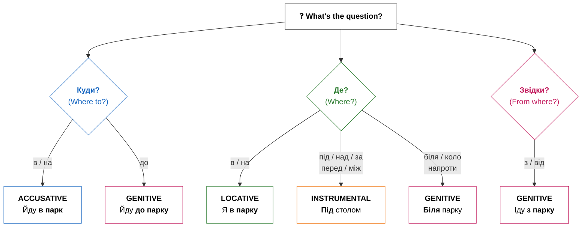

# Phase 5: Critical Deep Review

> **You are executing Phase 5 of an orchestrated rebuild.**
> **Your ONLY task: Perform a rigorous, evidence-based review.**
> **Every score must be backed by specific findings. Every finding must cite a line number.**

## Files to Read (ALL REQUIRED)

Read ALL of these files from disk before writing anything:

1. **Content** (the lesson you're reviewing): `# Орудний відмінок? Ні, усі відмінки! Просторова орієнтація

## Introduction / Вступ

Привіт! Ready to navigate Ukraine like a local? Prepositions are small but mighty words that connect nouns to the rest of the sentence. In English, prepositions like «in,» «on,» «to,» and «from» are straightforward. But in Ukrainian, prepositions work hand-in-hand with grammatical cases — and some prepositions even change meaning depending on which case follows them! This is one of the most exciting parts of learning Ukrainian because it allows you to be extremely precise about where things are and where they are going. Mastering this is like unlocking a 3D map of the language.

This module is your comprehensive guide to Ukrainian spatial prepositions. By the end, you'll understand how to combine prepositions with the correct cases to express location and motion accurately. Understanding these spatial relationships is the key to navigating any Ukrainian city, describing your home, or simply finding your keys! Whether you are asking for directions to the Maidan or explaining that your cat is under the sofa, these tiny words are your best allies.

**Що ви навчитеся:**
- Відповідати на питання **Де?**, **Куди?**, **Звідки?** правильно
- Обирати правильний відмінок для кожного прийменника
- Орієнтуватися в українському місті як місцевий житель

**Чому це важливо:** Неправильне поєднання прийменників і відмінків — одна з найпоширеніших помилок. Опанування цих шаблонів одразу зробить вашу українську мову природнішою і точнішою. Це не просто слова, це логіка простору. Коли ви розумієте просторову логіку, мова стає чіткою структурою, а не набором звуків. Це фундамент для вільного спілкування.

## Presentation / Презентація

### The Primary Logic: Motion vs. Location (Рух чи місце?)

Найважливіша концепція — це різниця між "Де?" (**Where?**) і "Куди?" (**Where to?**). В українській мові прийменники змінюють відмінок залежно від цього розрізнення. Це геніальна особливість мови, яка запобігає двозначності.

The most important concept to master is the difference between "Where?" (**Де?**) and "Where to?" (**Куди?**). In Ukrainian, several prepositions change the case they govern based on this distinction. This is a brilliant feature of the language that prevents ambiguity.

| Питання | Прийменник | Відмінок | Приклад |
|---------|------------|----------|---------|
| **Куди?** | в, на, під, за | Знахідний | Йду **в парк** |
| **Куди?** | до | Родовий | Йду **до парку** |
| **Де?** | в, на | Місцевий | Я **в парку** |
| **Де?** | під, над, за, перед, між | Орудний | Під **столом** |
| **Де?** | біля, коло, напроти | Родовий | Біля **парку** |
| **Звідки?** | з, від | Родовий | Іду **з парку** |



| Прийменник | Рух                  | Місце                  |
| :--------- | :------------------- | :--------------------- |
| **в / у**  | Йти **в школу**.     | Бути **в школі**.      |
| **на**     | Класти **на стіл**.  | Лежати **на столі**.   |
| **під**    | Класти **під стіл**. | Лежати **під столом**. |
| **за**     | Йти **за будинок**.  | Бути **за будинком**.  |

Коли ви говорите про рух (куди?), ви наче "цілитеся" в об'єкт, тому використовуєте знахідний відмінок. Це дуже логічно: ви спрямовуєте свою енергію на предмет. Коли ви описуєте місце (де?), ви фіксуєте стан спокою, тому використовуєте місцевий або орудний відмінки. Вибір залежить від конкретного прийменника. Наприклад, **в** та **на** традиційно потребують місцевого відмінка для позначення знаходження.

### Prepositions with the Instrumental Case (З орудним відмінком)

The Instrumental case is very versatile. Besides "means" and "roles," it is the standard case for prepositions that describe "static" spatial relationships like *under*, *above*, *behind*, or *between*. These prepositions help us pinpoint exactly where an object is located in relation to others.

- **під** (under) -> Кіт спить **під столом**.
- **над** (above) -> Лампа висить **над столом**.
- **перед** (in front of) -> Машина стоїть **перед будинком**.
- **за** (behind) -> Сад знаходиться **за будинком**.
- **між** (between) -> Дзеркало висить **між вікнами**.

Ці прийменники завжди вимагають орудного відмінка, коли ми описуємо, де знаходиться предмет.

| Рід | Закінчення | Приклад |
|-----|------------|---------|
| Чоловічий | **-ом** / **-ем** | під стол**ом**, перед учител**ем** |
| Жіночий | **-ою** / **-ею** | за шаф**ою**, над земл**ею** |
| Середній | **-ом** / **-ем** | над вікн**ом**, під мор**ем** |
| Plural | **-ами** / **-ями** | між вікн**ами**, перед двер**има** |

Note: Some nouns have special plural forms (двері → двер**има**, діти → діть**ми**).

### Genitive Prepositions (З родовим відмінком)

Many spatial prepositions also use the **Genitive case** (**родовий відмінок**), especially those indicating origin, purpose, or proximity. The Genitive case is often used to show starting points or limits.

- **до** (to / towards) -> Я йду **до школи**. (Towards the school)
- **з / із** (from) -> Я йду **з роботи**. (Originating from work)
- **біля / коло** (near) -> Стіл стоїть **біля вікна**. (Proximity)
- **від** (from / away from) -> Це далеко **від центру**. (Distance)

Крім того, є прийменники, які описують складніші просторові відношення: **напроти** (opposite), **вздовж** (along) та **навколо** (around). Наприклад: «Він йде **вздовж** річки» або «Ми сидимо **навколо** вогнища». Всі ці слова вимагають родового відмінка. Це допомагає створити дуже точний опис простору. Коли ви кажете «Ми стоїмо **напроти** банку», ви чітко вказуєте локацію.

### The в/у Alternation (Милозвучність)

The choice between **в** and **у** is purely for sound (euphony). **У** is preferred after consonants or before words starting with several consonants. **В** is used after vowels.

- Він **у** лісі. (He is in the forest.)
- Вона **в** офісі. (She is in the office.)

Цей принцип милозвучності робить українську мову однією з найспівучіших у світі. Намагайтеся звертати увагу на звуки навколо цих маленьких прийменників. Це не суворе правило, але ваша мова звучатиме набагато природніше, якщо ви будете його дотримуватися.

> [!reflection] **The Logic of Space**
> Why do we use Accusative for motion? Think of it as the "target." The Accusative case marks the direct object of the motion. When the motion stops and becomes a state, we shift to cases that describe "presence" (Locative/Instrumental). This mental shift from dynamic to static is the key to mastering Ukrainian syntax.

> [!tip] **The в vs у Rule**
> Ukrainian loves harmony (euphony). Use **у** if the previous word ends in a consonant (Він **у** кімнаті). Use **в** if it ends in a vowel (Вона **в** офісі). This makes your speech flow smoothly! This rule is not a strict law but a strong recommendation for sounding like a native speaker.

## Practice / Практика

This section will test your ability to differentiate between static location and dynamic motion. Look closely at the context of each sentence.

### 1. Where is the cat? (Де кіт?)

Look at the sentences and choose the correct case (Instrumental, Locative, or Genitive).

1. Кіт за (шафа) -> **Кіт за шафою.** (He is behind it.)
2. Книга на (стіл) -> **Книга на столі.** (It is on it.)
3. Лампа над (ліжко) -> **Лампа над ліжком.** (It hangs above.)
4. Собака під (стілець) -> **Собака під стільцем.** (He is underneath.)
5. Ми в (офіс) -> **Ми в офісі.** (We are inside.)
6. Автобус біля (зупинка) -> **Автобус біля зупинки.** (It's by the stop.)

### 2. Motion vs. Location (Куди чи Де?)

Choose the correct ending (Accusative for motion, Locative for location or state).

1. Я йду в (парк) -> **Я йду в парк.** (Motion / Acc)
2. Я гуляю в (парк) -> **Я гуляю в парку.** (Location / Loc)
3. Поклади зошит на (полиця) -> **Поклади зошит на полицю.** (Motion / Acc)
4. Зошит лежить на (полиця) -> **Зошит лежить на полиці.** (Location / Loc)
5. Він їде до (місто) -> **Він їде до міста.** (Direction / Gen)

> [!important] **Always Check the Question!**
> Before you choose an ending, ask yourself: **Де?** (Location), **Куди?** (Direction), or **Звідки?** (Origin). Then check which preposition you need — the preposition determines the case, not just the question!
> - Куди? + **в/на** → Accusative (Йду **в парк**)
> - Куди? + **до** → Genitive (Йду **до парку**)
> - Де? + **в/на** → Locative (Я **в парку**)
> - Де? + **під/над/за** → Instrumental (Під **столом**)
> - Звідки? + **з/від** → Genitive (Іду **з парку**)

## Dialogues / Діалоги

### Пошук дороги (Finding the way)

**А:** Вибачте, чи є тут банк **біля** метро? (Excuse me, is there a bank near the metro?)
**Б:** Так, ідіть прямо **до** перехрестя, потім поверніть праворуч. Банк буде **за** рогом. (Yes, go straight to the intersection, then turn right. The bank will be around the corner.)
**А:** Це далеко **від** парку? (Is it far from the park?)
**Б:** Ні, це **напроти** аптеки, **між** магазином і кафе. (No, it's opposite the pharmacy, between the shop and the cafe.)
**А:** Дякую! Це було дуже зрозуміло.

### У новій квартирі (In a new apartment)

**А:** Тут дуже гарно! Де ми поставимо цей стіл? (It's very nice here! Where will we put this table?)
**Б:** Давай поставимо його **біля** вікна. Нам потрібно багато світла. (Let's put it near the window. We need lots of light.)
**А:** Добре. А куди повісимо картину? (Good. And where will we hang the picture?)
**Б:** Можна повісити її **над** ліжком або **перед** входом. (We can hang it above the bed or in front of the entrance.)
**А:** **Над** ліжком буде краще. Там вона завжди перед очима. (**Above** the bed will be better. It's always in sight there.)

> [!context] **Ukrainian Towns**
> Traditional Ukrainian towns often have a central square (**майдан** or **площа**). People meet **на площі** (Loc), go **до центру** (Gen), or walk **вздовж річки** (Gen/along the river). Spatial prepositions are the GPS of the Ukrainian soul! Navigation is not just about geography, but about the social heart of the city.

# Summary / Підсумок

**Вітаємо!** Тепер ви можете:

- ✅ Відповідати на **Де?** — використовуючи місцевий, орудний або родовий відмінок
- ✅ Відповідати на **Куди?** — використовуючи знахідний (в/на) або родовий (до)
- ✅ Відповідати на **Звідки?** — використовуючи родовий відмінок (з/від)
- ✅ Застосовувати чергування **у/в** для милозвучності
- ✅ Правильно обирати закінчення орудного відмінка для всіх родів

You've mastered one of the trickiest parts of Ukrainian grammar! These 12+ prepositions are your spatial toolkit. Whether you're asking for directions to the Maidan or describing where your cat is hiding, you now have the precision of a native speaker.

## Need More Practice?

Подивіться навколо себе. Де знаходиться ваш телефон? Де стоїть ваш комп’ютер? Напишіть 5 речень про свою кімнату, використовуючи різні прийменники та відмінки. Наприклад: «Мій телефон лежить **на столі**». Ваша щоденна практика — це запорука вашого успіху в мові!
`
2. **Activities**: `---
- type: match-up
  title: Preposition Meanings
  pairs:
  - left: в/у
    right: in, into
  - left: на
    right: on, onto
  - left: з/із
    right: from, with
  - left: до
    right: to, until
  - left: від
    right: from (person)
  - left: для
    right: for
  - left: без
    right: without
  - left: під
    right: under
  - left: над
    right: above
  - left: перед
    right: in front of
  - left: за
    right: behind
  - left: між
    right: between
  instruction: З'єднайте відповідні елементи.
- type: fill-in
  title: Choose the Correct Preposition
  items:
  - sentence: Вона йде ___ школи.
    answer: до
    options:
    - до
    - на
    - в
    - за
  - sentence: Кава ___ цукру.
    answer: без
    options:
    - без
    - з
    - від
    - про
  - sentence: Лист ___ мами.
    answer: від
    options:
    - від
    - для
    - до
    - з
  - sentence: Подарунок ___ тебе.
    answer: для
    options:
    - для
    - від
    - до
    - про
  - sentence: Він іде ___ роботи.
    answer: з
    options:
    - з
    - до
    - на
    - через
  - sentence: Лампа ___ столом.
    answer: над
    options:
    - над
    - під
    - на
    - за
  - sentence: Стояти ___ дверима.
    answer: перед
    options:
    - перед
    - за
    - між
    - над
  - sentence: Йти ___ парк.
    answer: через
    options:
    - через
    - про
    - на
    - з
  - sentence: Говорити ___ тебе.
    answer: про
    options:
    - про
    - для
    - через
    - без
  - sentence: Кіт ___ столом.
    answer: під
    options:
    - під
    - над
    - на
    - перед
  - sentence: Гуляти ___ друзями.
    answer: з
    options:
    - з
    - до
    - від
    - через
  - sentence: ___ нами.
    answer: Між
    options:
    - Між
    - За
    - Над
    - Перед
  instruction: Оберіть правильне слово для заповнення пропуску.
- type: quiz
  title: Motion or Location?
  items:
  - question: In the sentence «Я йду в школу,» which grammatical case is the word
      «школу» in?
    options:
    - text: Accusative (motion)
      correct: true
    - text: Locative (location)
      correct: false
    - text: Genitive
      correct: false
    - text: Instrumental
      correct: false
  - question: In the sentence «Він у школі,» which grammatical case is the word «школі»
      in?
    options:
    - text: Locative (location)
      correct: true
    - text: Accusative (motion)
      correct: false
    - text: Instrumental
      correct: false
    - text: Genitive
      correct: false
  - question: When someone places a book on a table, as in «Вона кладе книгу на стіл,»
      which case is «стіл»?
    options:
    - text: Accusative (motion)
      correct: true
    - text: Locative (location)
      correct: false
    - text: Genitive
      correct: false
    - text: Instrumental
      correct: false
  - question: When a book is already lying on a table, as in «Книга лежить на столі,»
      which case is «столі»?
    options:
    - text: Locative (location)
      correct: true
    - text: Accusative (motion)
      correct: false
    - text: Instrumental
      correct: false
    - text: Genitive
      correct: false
  - question: When a cat runs under a table, as in «Кіт біжить під стіл,» which case
      is «стіл»?
    options:
    - text: Accusative (motion)
      correct: true
    - text: Instrumental (location)
      correct: false
    - text: Genitive
      correct: false
    - text: Locative
      correct: false
  - question: When a cat is sleeping under a table already, as in «Кіт спить під столом,»
      which case is «столом»?
    options:
    - text: Instrumental (location)
      correct: true
    - text: Accusative (motion)
      correct: false
    - text: Locative
      correct: false
    - text: Genitive
      correct: false
  - question: When someone goes behind a building for motion, as in «Вони йдуть за
      будинок,» which case is used?
    options:
    - text: Accusative (motion)
      correct: true
    - text: Instrumental (location)
      correct: false
    - text: Genitive
      correct: false
    - text: Locative
      correct: false
  - question: When someone is standing behind a building expressing location, as in
      «Вони стоять за будинком,» which case?
    options:
    - text: Instrumental (location)
      correct: true
    - text: Accusative (motion)
      correct: false
    - text: Locative
      correct: false
    - text: Genitive
      correct: false
  - question: In Ukrainian grammar, which preposition always requires the Genitive
      case regardless of context?
    options:
    - text: без
      correct: true
    - text: над
      correct: false
    - text: про
      correct: false
    - text: на
      correct: false
  - question: In Ukrainian grammar, which preposition always requires the Instrumental
      case regardless of context?
    options:
    - text: між
      correct: true
    - text: до
      correct: false
    - text: через
      correct: false
    - text: про
      correct: false
  - question: In Ukrainian, the preposition «про» (about) always requires which grammatical
      case to follow it?
    options:
    - text: Accusative
      correct: true
    - text: Genitive
      correct: false
    - text: Instrumental
      correct: false
    - text: Locative
      correct: false
  - question: In Ukrainian, the preposition «для» (for) always requires which grammatical
      case to follow it?
    options:
    - text: Genitive
      correct: true
    - text: Accusative
      correct: false
    - text: Dative
      correct: false
    - text: Instrumental
      correct: false
  instruction: Оберіть правильну відповідь.
- type: true-false
  title: Preposition Rules
  items:
  - statement: Prepositions in Ukrainian require specific grammatical cases.
    correct: true
    explanation: Correct! Every Ukrainian preposition is linked to one or more cases.
  - statement: «В школу» and «в школі» mean exactly the same thing.
    correct: false
    explanation: False! «В школу» means motion TO school; «в школі» (locative) means
      location AT school.
  - statement: «Без» always takes the genitive case.
    correct: true
    explanation: Yes! «Без цукру» uses genitive.
  - statement: «Над» always takes the instrumental case.
    correct: true
    explanation: Correct! «Над столом» uses instrumental.
  - statement: «На» only takes accusative case.
    correct: false
    explanation: False! «На» takes accusative for motion, locative for location.
  - statement: «До» takes genitive case.
    correct: true
    explanation: Yes! «До школи» uses genitive.
  - statement: «З» always means "from."
    correct: false
    explanation: «З» can mean "from" with genitive OR "with" with instrumental.
  - statement: Motion uses accusative with в/у, на, під, за.
    correct: true
    explanation: Correct! These two-way prepositions use accusative for motion.
  - statement: «В» and «у» have the same meaning.
    correct: true
    explanation: Yes! They differ only in when you use them for euphony.
  - statement: «Перед» takes locative case.
    correct: false
    explanation: '«Перед» takes instrumental: «перед дверима.»'
  - statement: «Між» means "between" and takes instrumental.
    correct: true
    explanation: Correct! «Між нами».
  - statement: Location after «під» uses instrumental, not locative.
    correct: true
    explanation: Yes! «Під столом» uses instrumental.
  instruction: Визначте, чи твердження правильне.
- type: group-sort
  title: Prepositions by Case
  groups:
  - name: Genitive
    items:
    - з = from
    - до
    - від
    - для
    - без
    - біля
  - name: Accusative
    items:
    - про
    - через
  - name: Instrumental
    items:
    - з = with
    - над
    - перед
    - між
  instruction: Розподіліть елементи за групами.
- type: unjumble
  title: Preposition Sentences
  items:
  - words:
    - вранці
    - я
    - йду
    - до
    - школи
    - щодня
    answer: Вранці я йду до школи щодня
  - words:
    - наша
    - школа
    - знаходиться
    - біля
    - дуже
    - великого
    - і
    - красивого
    - парку
    answer: Наша школа знаходиться біля дуже великого і красивого парку
  - words:
    - увечері
    - я
    - повертаюся
    - зі
    - школи
    - додому
    answer: Увечері я повертаюся зі школи додому
  - words:
    - моя
    - кімната
    - на
    - другому
    - поверсі
    - у
    - будинку
    answer: Моя кімната на другому поверсі у будинку
  - words:
    - лампа
    - висить
    - над
    - столом
    - і
    - світить
    - яскраво
    answer: Лампа висить над столом і світить яскраво
  - words:
    - мій
    - старий
    - кіт
    - завжди
    - спить
    - під
    - великим
    - кухонним
    - столом
    answer: Мій старий кіт завжди спить під великим кухонним столом
  - words:
    - книги
    - лежать
    - на
    - столі
    - у
    - кімнаті
    answer: Книги лежать на столі у кімнаті
  - words:
    - мій
    - старший
    - брат
    - стоїть
    - перед
    - дверима
    - і
    - довго
    - чекає
    answer: Мій старший брат стоїть перед дверима і довго чекає
  - words:
    - сестра
    - гуляє
    - за
    - будинком
    - у
    - саду
    answer: Сестра гуляє за будинком у саду
  - words:
    - маленьке
    - вікно
    - знаходиться
    - між
    - двома
    - дуже
    - великими
    - дверима
    answer: Маленьке вікно знаходиться між двома дуже великими дверима
  instruction: Розташуйте слова у правильному порядку.
- type: error-correction
  title: Fix the Case
  items:
  - sentence: Він йде до школа.
    error: школа
    answer: школи
    options:
    - школа
    - школи
    - школу
    - школі
    explanation: '«До» requires genitive case: школа → школи.'
  - sentence: Кава без цукор.
    error: цукор
    answer: цукру
    options:
    - цукор
    - цукру
    - цукром
    - цукрі
    explanation: '«Без» requires genitive case: цукор → цукру.'
  - sentence: Лампа над стіл.
    error: стіл
    answer: столом
    options:
    - стіл
    - столом
    - столі
    - столу
    explanation: '«Над» requires instrumental case: стіл → столом.'
  - sentence: Подарунок для мама.
    error: мама
    answer: мами
    options:
    - мама
    - мами
    - маму
    - мамі
    explanation: '«Для» requires genitive case: мама → мами.'
  - sentence: Вони говорять про ти.
    error: ти
    answer: тебе
    options:
    - ти
    - тебе
    - тобі
    - тобою
    explanation: '«Про» requires accusative case: ти → тебе.'
  - sentence: Він гуляє з друг.
    error: друг
    answer: другом
    options:
    - друг
    - другом
    - друга
    - другу
    explanation: '«З» (with) requires instrumental case: друг → другом.'
  - sentence: Стояти перед двері.
    error: двері
    answer: дверима
    options:
    - двері
    - дверима
    - дверей
    - дверях
    explanation: '«Перед» requires instrumental case: двері → дверима.'
  - sentence: Між ми.
    error: ми
    answer: нами
    options:
    - ми
    - нами
    - нас
    - нам
    explanation: '«Між» requires instrumental case: ми → нами.'
  - sentence: Лист від мама.
    error: мама
    answer: мами
    options:
    - мама
    - мами
    - маму
    - мамі
    explanation: '«Від» requires genitive case: мама → мами.'
  - sentence: Йти через парку.
    error: парку
    answer: парк
    options:
    - парку
    - парк
    - парком
    - парці
    explanation: '«Через» requires accusative case: парку → парк.'
  - sentence: Кіт під стіл.
    error: стіл
    answer: столом
    options:
    - стіл
    - столом
    - столі
    - столу
    explanation: 'Location after «під» requires instrumental: стіл → столом.'
  - sentence: Бути за будинок.
    error: будинок
    answer: будинком
    options:
    - будинок
    - будинком
    - будинку
    - будинці
    explanation: 'Location after «за» requires instrumental: будинок → будинком.'
  instruction: Знайдіть і виправте помилку в реченні.
- type: cloze
  title: Complete the Story
  passage: 'Марія живе {в/у + Loc|на + Acc|до + Gen} Києві. Вранці вона йде {на +
    Loc|в + Acc|до + Gen} роботи. Вона працює {над + Instr|під + Instr|перед + Instr}
    великому офісі. {під + Instr|над + Instr|за + Instr} роботи вона йде {перед +
    Instr|за + Instr|між + Instr} магазину. Магазин знаходиться {на + Loc|під + Instr|над
    + Instr} станції метро.

    ---

    Він живе {в/у + Loc|на + Acc|до + Gen} центрі міста. Його квартира {на + Loc|в
    + Acc|до + Gen} третьому поверсі. Лампа висить {над + Instr|під + Instr|перед
    + Instr} столом. Кіт спить {під + Instr|над + Instr|за + Instr} ліжком. Стіл стоїть
    {перед + Instr|за + Instr|між + Instr} вікном. Книги лежать {на + Loc|під + Instr|над
    + Instr} столі.'
  instruction: Заповніть пропуски, обравши правильні слова.
- type: select
  title: Asking for Directions
  items:
  - question: '— Вибачте, як дійти до пошти? — ...'
    options:
    - text: Йдіть через парк.
      correct: true
    - text: Добре, дякую!
      correct: false
    - text: Будь ласка!
      correct: false
    - text: Немає за що!
      correct: false
    explanation: Відповідь дає напрямок — йдіть через парк.
  - question: '— Йдіть через парк. Потім поверніть за будинок. — А далі?  — ...'
    options:
    - text: Пошта буде перед вами.
      correct: true
    - text: Немає за що!
      correct: false
    - text: Де знаходиться банк?
      correct: false
    - text: Добре, дякую!
      correct: false
    explanation: Завершуємо пояснення маршруту — пошта буде перед вами.
  - question: '— Пошта буде перед вами. — Дякую! — ...'
    options:
    - text: Будь ласка!
      correct: true
    - text: Де знаходиться банк?
      correct: false
    - text: Йдіть через парк.
      correct: false
    - text: Ні, біля станції.
      correct: false
    explanation: Ввічлива відповідь на подяку — будь ласка!
  - question: '— Де знаходиться банк? — ...'
    options:
    - text: Він між аптекою і магазином.
      correct: true
    - text: Дякую!
      correct: false
    - text: Потім поверніть за будинок.
      correct: false
    - text: Будь ласка!
      correct: false
    explanation: Відповідь вказує місце — між аптекою і магазином.
  - question: '— Він між аптекою і магазином. — Далеко від станції метро? — ...'
    options:
    - text: Ні, біля станції.
      correct: true
    - text: Пошта буде перед вами.
      correct: false
    - text: Немає за що!
      correct: false
    - text: Добре, дякую!
      correct: false
    explanation: Відповідь на питання про відстань — ні, біля станції.
  - question: '— Ні, біля станції. — Добре, дякую! — ...'
    options:
    - text: Немає за що!
      correct: true
    - text: Далеко від станції метро?
      correct: false
    - text: Він між аптекою і магазином.
      correct: false
    - text: Йдіть через парк.
      correct: false
    explanation: Ввічлива відповідь на подяку — немає за що!
  instruction: Оберіть правильну відповідь у діалозі.
- type: mark-the-words
  title: Find Preposition + Case
  text: Він іде до школи. Потім він буде
    в класі. Книги лежать на столі. Олівець під зошитом. --- Вона живе біля парку.
    Гуляє з собакою. Сидить перед телевізором. Після роботи йде до магазину. --- Лист
    від друга. Подарунок для сестри. Кава без цукру. Розмова про майбутнє.
  answers:
  - до школи
  - в класі
  - на столі
  - під зошитом
  - біля парку
  - з собакою
  - перед телевізором
  - до магазину
  - від друга
  - для сестри
  - без цукру
  - про майбутнє
  instruction: Клацніть на слова, що відповідають критерію.
- type: translate
  title: English to Ukrainian
  items:
  - source: I am going to school.
    options:
    - text: Я йду до школи.
      correct: true
    - text: Я йду в школі.
      correct: false
    - text: Я йду на школі.
      correct: false
    - text: Я йду до школа.
      correct: false
    explanation: '''До'' + Genitive ''школи''.'
  - source: Coffee without sugar.
    options:
    - text: Кава без цукру.
      correct: true
    - text: Кава без цукор.
      correct: false
    - text: Кава без цукром.
      correct: false
    - text: Кава без цукрі.
      correct: false
    explanation: '''Без'' + Genitive ''цукру''.'
  - source: The lamp is above the table.
    options:
    - text: Лампа над столом.
      correct: true
    - text: Лампа на столі.
      correct: false
    - text: Лампа під столом.
      correct: false
    - text: Лампа над столі.
      correct: false
    explanation: '''Над'' + Instrumental ''столом''.'
  - source: A gift for mom.
    options:
    - text: Подарунок для мами.
      correct: true
    - text: Подарунок для мама.
      correct: false
    - text: Подарунок до мами.
      correct: false
    - text: Подарунок від мами.
      correct: false
    explanation: '''Для'' + Genitive ''мами''.'
  - source: They are talking about me.
    options:
    - text: Вони говорять про мене.
      correct: true
    - text: Вони говорять про я.
      correct: false
    - text: Вони говорять про мені.
      correct: false
    - text: Вони говорять про мною.
      correct: false
    explanation: '''Про'' + Accusative ''мене''.'
  - source: The cat is under the table.
    options:
    - text: Кіт під столом.
      correct: true
    - text: Кіт під стіл.
      correct: false
    - text: Кіт на столі.
      correct: false
    - text: Кіт під столі.
      correct: false
    explanation: Location 'Де?' + 'під' + Instrumental 'столом'.
  instruction: Оберіть правильний переклад.
`
3. **Vocabulary**: `---
module: 07-spatial-prepositions
level: A2
version: '2.0'
items:
- lemma: аптека
  ipa: /aptˈɛka/
  translation: pharmacy, drugstore
  pos: noun
  gender: f
- lemma: висити
  ipa: /ʋɪsɪtɪ/
  translation: to hang
  pos: verb
- lemma: виходити
  ipa: /ʋɪxɔdɪtɪ/
  translation: to go out, to exit, to result
  pos: verb
- lemma: вхід
  ipa: /ʋxid/
  translation: entrance
  pos: noun
  gender: m
- lemma: далеко
  ipa: /dalˈɛkɔ/
  translation: far, far away
  pos: adv
- lemma: двосторонній
  ipa: /dʋɔstɔrˈɔnnij/
  translation: bilateral, two-sided
  pos: adj
- lemma: живий
  ipa: /ʒɪʋˈɪj/
  translation: alive, living
  pos: adj
- lemma: запам'ятовувати
  ipa: /zapamjatˈɔʋuʋatɪ/
  translation: to memorize
  pos: verb
- lemma: знаходитися
  ipa: /znaxˈɔdɪtɪsja/
  translation: to be located
  pos: verb
- lemma: зошит
  ipa: /zˈɔʃɪt/
  translation: notebook
  pos: noun
- lemma: камін
  ipa: /kamˈin/
  translation: fireplace, hearth
  pos: noun
  gender: m
- lemma: картинка
  ipa: /kartˈɪnka/
  translation: picture, image
  pos: noun
  gender: f
- lemma: килим
  ipa: /kˈɪlɪm/
  translation: carpet, rug
  pos: noun
  gender: m
- lemma: клад
  ipa: /klad/
  translation: treasure
  pos: noun
  gender: m
- lemma: корисно
  ipa: /kˈɔrɪsnɔ/
  translation: useful, healthily
  pos: adv
- lemma: коробка
  ipa: /kɔrˈɔbka/
  translation: box
  pos: noun
  gender: f
- lemma: куток
  ipa: /kutˈɔk/
  translation: corner
  pos: noun
  gender: m
- lemma: кіт
  ipa: /kit/
  translation: cat (male)
  pos: noun
  gender: m
- lemma: кішка
  ipa: /kˈiʃka/
  translation: cat (female)
  pos: noun
  gender: f
- lemma: лежати
  ipa: /lɛʒˈatɪ/
  translation: to lie, to be situated
  pos: verb
- lemma: маленький
  ipa: /malˈɛnʲkɪj/
  translation: small, little
  pos: adj
- lemma: одразу
  ipa: /ɔdrˈazu/
  translation: immediately
  pos: adv
- lemma: одяг
  ipa: /'ɔdjaɦ/
  translation: clothing
  pos: noun
  gender: m
- lemma: папір
  ipa: /papˈir/
  translation: paper
  pos: noun
- lemma: повернути
  ipa: /pɔʋɛrnˈutɪ/
  translation: to turn, to return (perfective)
  pos: verb
- lemma: поверх
  ipa: /pɔʋˈɛrx/
  translation: floor, story
  pos: noun
  gender: m
- lemma: повинно
  ipa: /pɔʋˈɪnnɔ/
  translation: should, must (neuter/adv)
  pos: adv
- lemma: поклад
  ipa: /pˈɔklad/
  translation: deposit
  pos: noun
- lemma: посередині
  ipa: /pɔsɛrˈɛdɪni/
  translation: in the middle
  pos: adv
- lemma: принцип
  ipa: /prˈɪnt͡sɪp/
  translation: principle
  pos: noun
  gender: m
- lemma: роза
  ipa: /rˈɔza/
  translation: rose
  pos: noun
  gender: f
- lemma: сидіти
  ipa: /sɪdˈitɪ/
  translation: to sit
  pos: verb
- lemma: спити
  ipa: /spˈɪtɪ/
  translation: to drink (all of), to fall asleep (rare variant)
  pos: verb
- lemma: стратегія
  ipa: /stratˈɛɦija/
  translation: strategy
  pos: noun
  gender: f
- lemma: таємниця
  ipa: /tajɛmnˈɪt͡sja/
  translation: secret, mystery
  pos: noun
  gender: f
- lemma: удача
  ipa: /udˈat͡ʃa/
  translation: luck, success
  pos: noun
  gender: f
- lemma: уявити
  ipa: /ujaʋˈɪtɪ/
  translation: to imagine (perfective)
  pos: verb
- lemma: на
  ipa: /na/
  translation: on, onto, at
  pos: prep
- lemma: під
  ipa: /pid/
  translation: under, beneath
  pos: prep
- lemma: над
  ipa: /nad/
  translation: over, above
  pos: prep
- lemma: перед
  ipa: /pˈɛrɛd/
  translation: in front of, before
  pos: prep
- lemma: за
  ipa: /za/
  translation: behind, beyond, for
  pos: prep
- lemma: між
  ipa: /miʒ/
  translation: between, among
  pos: prep
- lemma: до
  ipa: /dɔ/
  translation: to, into, until
  pos: prep
- lemma: із
  ipa: /iz/
  translation: from, with (euphonic variant)
  pos: prep
- lemma: біля
  ipa: /bˈilʲa/
  translation: near, beside
  pos: prep
- lemma: коло
  ipa: /kˈɔlɔ/
  translation: near, around, circle
  pos: prep
- lemma: поруч
  ipa: /pˈɔrut͡ʃ/
  translation: nearby, next to
  pos: adv
- lemma: навколо
  ipa: /naʋkˈɔlɔ/
  translation: around
  pos: adv
- lemma: вздовж
  ipa: /ʋzdɔu̯ʒ/
  translation: along
  pos: adv
- lemma: напроти
  ipa: /naprˈɔtɪ/
  translation: opposite
  pos: adv
- lemma: місцевий
  ipa: /mist͡sɛʋˈɪj/
  translation: locative (case)
  pos: adj
- lemma: знахідний
  ipa: /znaxˈidnɪj/
  translation: accusative (case)
  pos: adj
- lemma: орудний
  ipa: /ɔrˈudnɪj/
  translation: instrumental (case)
  pos: adj
- lemma: родовий
  ipa: /rɔdɔʋˈɪj/
  translation: genitive (case)
  pos: adj
- lemma: єдиний
  ipa: /jɛdˈɪnɪj/
  translation: single, unique, only
  pos: adj
`
4. **Plan** (source of truth for scope): `---
module: a2-07
level: A2
sequence: 7
slug: 07-spatial-prepositions
version: '2.0'
title: Spatial Prepositions
subtitle: Location and Motion
content_outline:
- section: Introduction / Вступ
  words: 200
  points:
  - Key distinction in Ukrainian (куди? vs де?)
  - Pattern recognition strategies
- section: Presentation / Презентація
  words: 600
  points:
  - в/у and на + Acc/Loc patterns
  - Instrumental prepositions (під, за, над, перед, між)
  - Genitive prepositions (до, з, біля)
- section: Practice / Практика
  words: 150
  points:
  - Diagram labeling
  - Motion sequences
- section: Dialogues / Діалоги
  words: 50
  points:
  - Asking for directions
  - Describing a room
word_target: 1000
vocabulary_hints:
  required:
  - в/у (in/into)
  - на (on/onto)
  - під (under)
  - над (above)
  - перед (in front of)
  - за (behind)
  - між (between)
  - до (to)
  - з/із (from)
  - напроти (opposite)
  - біля (near)
  - коло (near)
  - поруч (nearby)
  - навколо (around)
  - вздовж (along)
  recommended:
  - всередині (inside)
  - ззовні (outside)
  - посеред (in the middle)
  - збоку (on the side)
  - поміж (among)
activity_hints:
- type: fill-in
  focus: Motion vs location cases
  items: 15+
- type: quiz
  focus: Diagram labeling - where is the cat?
  items: 10+
- type: fill-in
  focus: Command drill - put it on/under/behind
  items: 12+
- type: match-up
  focus: Preposition + case + meaning
  items: 12+
- type: quiz
  focus: Direction vs position selection
  items: 10+
focus: grammar
pedagogy: PPP
prerequisites:
- A1 basic prepositions (в, на)
- a2-04 (Instrumental endings)
- A1 locative case basics
connects_to:
- a2-08 (Logical Prepositions)
- a2-09 (All Cases Practice)
- a2-65 (Giving Directions)
objectives:
- Learner can use prepositions to describe location
- Learner can use prepositions to describe motion
- Learner can distinguish between location (locative/instrumental) and motion (accusative)
- Learner can ask for and give directions
grammar:
- prepositions of location
- prepositions of motion
- в/на + locative vs accusative
- під/за/над + instrumental
module_type: grammar
sources:
- name: Ukrainian State Standard 2024 - Prepositions
  url: "https://mon.gov.ua/"
  type: reference
  notes: Spatial preposition + case combinations
- name: Ukrainian Preposition Reference
  url: "https://uk.wikipedia.org/wiki/Прийменник"
  type: reference
  notes: Complete preposition system
immersion: 40-50% Ukrainian
phase: A2.1
`
5. **Meta** (build config): `---
module: a2-07
level: A2
slug: 07-spatial-prepositions
version: '2.0'
id: a2-07
naturalness:
  score: 9
  status: PASS
duration: 60
transliteration: none
tags:
- grammar
- cases
- prepositions
- location
- motion
word_target: 1000
build:
  last_modified: '2026-01-26'
`
6. **Research notes** (if exists): `# Research Notes: Spatial Orientation and Prepositions (A2 M07)

**Module**: A2 M07 "Орудний відмінок? Ні, усі відмінки! Просторова орієнтація"
**Level**: A1+ (Bridge to A2 / Elementary)
**Topic**: Spatial Orientation across Cases (Accusative, Genitive, Locative, Instrumental)

## 1. Grammar: State Standard 2024 Reference

The Ukrainian State Standard 2024 (**Державний стандарт української мови як іноземної**) categorizes spatial orientation under the functional usage of case forms. While basic spatial prepositions (*в/у, на*) are introduced at A1, the expanded set including Instrumental prepositions is formally consolidated at the **A2 (Початковий рівень другого ступеня)** level.

Relevant section: **§4.2.2. Уживання відмінкових форм іменників в однині та множині**.

*   **Accusative (§4.2.2.4.2):** *в, у, на* (кінцевий пункт руху суб’єкта) — "Я йду в кімнату."
*   **Genitive (§4.2.2.2.2):** *біля, навпроти, до* (місце, кінцевий пункт руху) — "Автобус зупиняється біля театру."
*   **Instrumental (§4.2.2.5.2):** *над, під, перед, за, між* (простір, шлях руху об’єкта) — "Над столом висить нова лампа. Туристи зупинилися перед пам’ятником."
*   **Locative (§4.2.2.6):** *у, в, на* (місце перебування особи чи предмета) — "Сумка лежить на столі."

> **Standard Quote (§4.2.2.5.2):** "над, під, перед, за, між (простір, шлях руху об’єкта): Туристи зупинилися перед пам’ятником. Над столом висить нова лампа. Між горами тече річка."

## 2. Vocabulary Frequency

### High-Frequency (Essential A1/A2)
*   **в / у** (in) + Loc (Location: *в офісі*) / Acc (Motion: *в офіс*)
*   **на** (on) + Loc (Location: *на столі*) / Acc (Motion: *на стіл*)
*   **біля** (near) + Gen (*біля вікна*)
*   **до** (to) + Gen (*до школи*)
*   **під** (under) + Inst (*під ліжком*)
*   **за** (behind) + Inst (*за дверима*)
*   **перед** (in front of) + Inst (*перед телевізором*)
*   **між** (between) + Inst (*між нами*)

### High-Frequency Collocations
*   **на роботі / у школі** (at work / at school)
*   **йти додому** (go home - *home is an adverb here*)
*   **на столі / під столом** (on the table / under the table)
*   **за містом** (outside the city/in the countryside)

## 3. Cultural Hook

### The "Покуть" (The Sacred Corner)
In traditional Ukrainian culture, the interior of the **хата** (house) was highly symbolic. The **покуть** (the red corner) was the most important spatial point, located diagonally from the oven (**піч**). It was the place for icons and the *дідух* (harvest spirit). Sitting **на покуті** (at the sacred corner) was a privilege reserved for the head of the family or the most honored guests. This provides a rich context for teaching **на** (on/at) and the concept of "location of honor."

### The "Поріг" (Threshold)
Ukrainian folklore places great emphasis on the threshold of the house as a boundary between worlds. It is considered bad luck to greet someone, shake hands, or pass items **через поріг** (across the threshold). This practical cultural rule helps students remember the preposition **через** (across/through) and the importance of spatial boundaries in daily etiquette.

## 4. Pedagogical Notes

### Key Differences from English
*   **Location vs. Motion:** English often uses the same preposition (*in the room* vs. *into the room* can both be "in the room" in casual speech). Ukrainian strictly distinguishes between **Де?** (Where? - Locative/Instrumental) and **Куди?** (Where to? - Accusative/Genitive).
*   **Instrumental Usage:** English speakers are used to the Instrumental case meaning "with" (accompaniment/tool). Using it for static locations like "under" or "behind" without the word "with" is a major conceptual hurdle.

### Common Learner Errors
*   **Using Locative for Motion:** *Я йду в магазині* (I am walking inside the store) vs. *Я йду в магазин* (I am going to the store).
*   **Instrumental Endings:** Confusing Locative endings (*-і*) with Instrumental endings (*-ом/-ою*) when using prepositions like *під* or *за*.
*   **Preposition Overload:** Relying solely on *в* and *на* because they are easier, failing to use the more descriptive Instrumental prepositions (*перед, над*).

## 5. Scope Boundaries

### IN SCOPE
*   **Cases:** Locative (stationary), Accusative (direction), Instrumental (spatial), Genitive (proximity/destination).
*   **Prepositions:** *в/у, на, під, над, перед, за, між, біля, до*.
*   **Grammar:** Noun and Pronoun endings in these cases (Singular).
*   **Verbs:** Basic verbs of position (*стояти, лежати, сидіти*) and motion (*йти, їхати*).

### OUT OF SCOPE
*   **Abstract Time:** Using *за годину* (in an hour) or *перед обідом* (before lunch) is out of scope for this specific spatial module.
*   **Prefixed Motion Verbs:** Verbs like *зайти* (to enter), *вийти* (to exit), *підійти* (to approach) are deferred to later A2 modules.
*   **Dative Spatial Usage:** The preposition *по* (along/around) is excluded to avoid case confusion at this stage.
*   **Plural Case Forms:** Focus remains on singular nouns to ensure mastery of the core concept.`

**Do not proceed until you have read every line of the content and every activity item.**

> **ANTI-STALE-REVIEW RULE**: This file may have been fixed since a previous review. You MUST review the CURRENT state of the files, not repeat findings from a prior review. If an issue was cited before but is now fixed, it must NOT appear in your review. Every finding must be verifiable by quoting the actual current content.

## Audit Metrics (Facts from Claude)

```
Word count:       1825 / 1000 (182%)
Activities:       11
Vocabulary items: 0
Engagement boxes: 2
Immersion:        varies% (target: varies)
Audit status:     pending review
```

---

## STEP 1: PLAN VERIFICATION

Cross-check content against the plan file:

1. **Outline compliance**: Is every section from `content_outline` present as an H2/H3?
2. **Vocabulary scope**: List every Ukrainian vocabulary word taught in the content. Compare against `vocabulary_hints.required` in the plan. Flag any word NOT in the plan.
3. **Grammar scope**: What grammar does this module teach? What grammar from LATER modules appears in examples or dialogues? (This is scope creep — flag it.)
4. **Objectives**: Are all learning objectives from the plan addressed in the content?

Report findings as:
```
Plan-Content Alignment: [PASS/FAIL]
- Sections: [all present / missing: X, Y]
- Vocabulary: [X/Y from plan used, Z extra words found]
- Grammar scope: [clean / scope creep: specific items]
- Objectives: [all covered / missing: X]
```

---

## STEP 2: DEEP VERIFICATION (Line by Line)

### Ukrainian Sentences
Go through the file section by section. For EACH Ukrainian sentence:
- Is grammar correct? (cases, verb forms, agreement)
- Does it sound natural? (not robotic, not calqued from English)
- Are there Russianisms? (check against list below)
- Is vocabulary appropriate for the level?

### English Sentences
- Is it clear and accessible?
- Warm tutor voice or cold textbook?
- Over-explaining simple things? Under-explaining complex ones?

### IPA Transcriptions (if present)
- Every transcription must be checked for correct stress placement
- Ukrainian stress is unpredictable — verify each one
- Watch for English approximations instead of Ukrainian phonemes

### Activities (EVERY ITEM)

**CRITICAL: Read the actual YAML file line by line.** Do NOT assume what the file contains — read it. If a previous review said "add English cues" but the file already has them, acknowledge the fix is present. Never cite an issue that doesn't exist in the CURRENT file.

Check each activity item individually:
- **quiz**: Grammatically correct? Exactly one correct answer? Options plausible?
- **fill-in**: Sentence correct with answer filled in? Only ONE valid answer given the context/cues? Distractors plausible?
- **match-up**: All pairs correct? No duplicates?
- **true-false**: True statements actually true? False clearly false?
- **unjumble**: Answer forms a correct, natural sentence?
- **group-sort**: Items correctly categorized?
- **anagram**: Solution correct? Hint clear?

Count as you go. You MUST report how many items you checked.

**Verification rule**: For EVERY issue you cite, quote the EXACT line from the file. If you cannot quote it, the issue does not exist.

---

## STEP 3: AUTO-FAIL CHECKLIST

Check EVERY category. Report "[CLEAN]" or list specific findings.

### Russianisms
| Wrong | Correct |
|-------|---------|
| кушать | їсти |
| приймати участь | брати участь |
| самий кращий | найкращий |
| слідуючий | наступний |
| на протязі | протягом |
| любий (any) | будь-який |
| отвічати | відповідати |
| вообще | взагалі |
| получати | отримувати |
| відноситися | ставитися |

**Finding:** [CLEAN] or [list with line numbers]

### Calques
| Wrong | Correct |
|-------|---------|
| робити сенс | мати сенс |
| брати місце | відбуватися |
| це є | це (usually) |

**Finding:** [CLEAN] or [list with line numbers]

### Grammar Scope Violations
At module 7, students know ONLY modules 1-6. Any grammar from later modules is scope creep.
- Past tense (if not yet taught)
- Cases not yet introduced
- Verb forms not yet taught

**Finding:** [CLEAN] or [list specific violations with line numbers]

### Activity Errors
- Wrong answer marked as correct
- Multiple valid answers but only one accepted
- Grammatically incorrect sentences
- Duplicate items

**Finding:** [CLEAN] or [list with activity number and item number]

### Beginner Safety ("Would I Continue?" Test)
| Question | Result |
|----------|--------|
| Did I feel overwhelmed? | [Pass/Fail] |
| Were instructions clear? | [Pass/Fail] |
| Did I get quick wins? | [Pass/Fail] |
| Was Ukrainian scary? | [Pass/Fail] |
| Would I come back tomorrow? | [Pass/Fail] |
| **Total** | **X/5** |

Emotional beats found:
- Welcome/orientation: [yes/no, where]
- Curiosity trigger: [yes/no, where]
- Quick wins: [count, where]
- Encouragement: [count, where]
- Progress marker: [yes/no, where]

---

## STEP 4: SCORE DIMENSIONS

**Score ONLY after completing Steps 1-3.** Each score must link to specific findings.

### Scoring Rules
- **9-10**: Excellent — no issues found in this dimension
- **7-8**: Good — minor issues found
- **5-6**: Needs work — multiple issues
- **<5**: Serious problems — major rewrite needed
- **If you found 3 grammar errors, Language cannot be 9**
- **If scope creep found, Relevance and Pedagogy cannot be 8+**

### Auto-Fail Thresholds
| Dimension | Auto-fail if below |
|-----------|-------------------|
| Experience Quality | <7 |
| Coherence | <7 |
| Relevance | <7 |
| Educational | <7 |
| Language | <8 |
| Pedagogy | <7 |
| Immersion | <6 |
| Activities | <7 |
| Richness | <6 |
| Beginner Safety | <7 |
| LLM Fingerprint | <7 |
| Linguistic Accuracy | <9 |

### Weighted Overall Score
```
Overall = (Experience × 1.5 + Coherence × 1.0 + Relevance × 1.0 + Educational × 1.2 +
          Language × 1.1 + Pedagogy × 1.2 + Immersion × 1.0 + Activities × 1.3 +
          Richness × 0.9 + Beginner_Safety × 1.3 + LLM × 1.0 + Linguistic_Accuracy × 1.5) / 14.0
```

**Quality target: 9.0+ overall AND no dimension below its auto-fail threshold.**
**If the score is below 9.0, you MUST provide a Fix Plan (see output format) with specific actions to reach 9/10.** The fix plan drives the iteration loop — Claude will send fixes to Gemini until the module reaches 9.0+.

---

## OUTPUT FORMAT

Wrap your ENTIRE review in these delimiters (REQUIRED for parsing):

```
===REVIEW_START===
# Рецензія: Spatial Prepositions

**Level:** A2 | **Module:** 7
**Overall Score:** {X.X}/10
**Status:** PASS / FAIL
**Reviewed:** {date}

## Plan Verification

```
Plan-Content Alignment: [PASS/FAIL]
- Sections: [status]
- Vocabulary: [X/Y from plan, Z extra]
- Grammar scope: [status]
- Objectives: [status]
```

## Scores

| # | Dimension | Score | Auto-fail | Evidence |
|---|-----------|-------|-----------|----------|
| 1 | Experience Quality | X/10 | <7 | [specific finding] |
| 2 | Coherence | X/10 | <7 | [specific finding] |
| 3 | Relevance | X/10 | <7 | [specific finding] |
| 4 | Educational | X/10 | <7 | [specific finding] |
| 5 | Language | X/10 | <8 | [specific finding] |
| 6 | Pedagogy | X/10 | <7 | [specific finding] |
| 7 | Immersion | X/10 | <6 | [actual % vs target] |
| 8 | Activities | X/10 | <7 | [specific finding] |
| 9 | Richness | X/10 | <6 | [specific finding] |
| 10 | Beginner Safety | X/10 | <7 | ["Would I Continue?" X/5] |
| 11 | LLM Fingerprint | X/10 | <7 | [specific finding] |
| 12 | Linguistic Accuracy | X/10 | <9 | [specific finding] |

**Weighted Overall:** {show calculation} = **X.X/10**

## Auto-Fail Checklist Results

- Russianisms: [CLEAN] or [list]
- Calques: [CLEAN] or [list]
- Grammar scope: [CLEAN] or [list]
- Activity errors: [CLEAN] or [list]
- Beginner safety: X/5

## Critical Issues Found

### Issue 1: {Category}
- **Location**: Line {N} / Section "{name}"
- **Original**: "{exact text}"
- **Problem**: {why it's wrong}
- **Fix**: {concrete replacement}

[... more issues ...]

## Ukrainian Language Issues

| Line | Current | Corrected | Type |
|------|---------|-----------|------|
| {N} | "{original}" | "{fixed}" | Russianisms / Calque / Scope / Grammar |

## Beginner Safety Audit

"Would I Continue?" Test: X/5
- Overwhelmed? [Pass/Fail]
- Instructions clear? [Pass/Fail]
- Quick wins? [Pass/Fail]
- Ukrainian scary? [Pass/Fail]
- Come back tomorrow? [Pass/Fail]

Emotional beats: X found
- Welcome: [location or "missing"]
- Curiosity: [location or "missing"]
- Quick wins: [count + locations]
- Encouragement: [count + locations]
- Progress: [location or "missing"]

## Strengths
- [Specific strength with evidence from content]

## Fix Plan to Reach 9/10 (REQUIRED if score < 9.0)

For EACH dimension scoring below 9, provide a concrete action plan:

### {Dimension Name}: {current}/10 → 9/10

**What to fix:**
1. Line {N}: Change "{current text}" → "{replacement text}" — {why this raises the score}
2. Section "{name}": {specific action} — {expected impact}
3. ...

**Expected score after fix:** {X}/10

[Repeat for every dimension below 9. Be specific — line numbers, exact replacements, section names.]

### Projected Overall After Fixes

```
{Recalculate weighted overall with projected dimension scores}
```

## Verification Summary

- Content lines read: {X}
- Activity items checked: {X}
- Ukrainian sentences verified: {X}
- IPA transcriptions checked: {X}
- Issues found: {X}
- Naturalness score recommendation: {X}/10

## Verdict

**PASS** or **FAIL**

{1-3 sentences linking verdict to specific findings. If FAIL, list the blocking issues.}

===REVIEW_END===
```

## Boundaries

- Do NOT modify any files OTHER than the output file
- Do NOT score generously — honesty prevents bad curriculum
- Do NOT skip any step or dimension
- Do NOT fabricate issues — every critique must cite a specific line number
- Do NOT give vague feedback like "could be improved" — say exactly what and where
