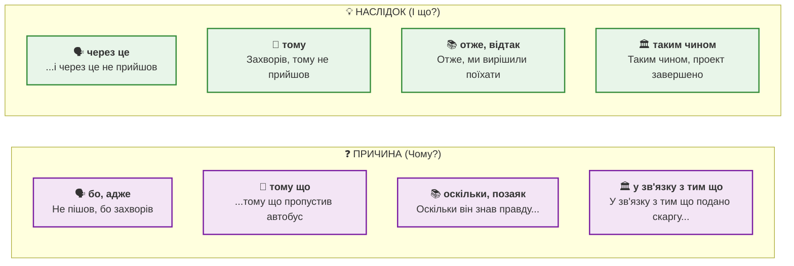

> [!motivation]
> Чому щось сталося? Які наслідки має ця подія? Причинові та наслідкові сполучники — це логічний каркас мови. Вони дозволяють пояснювати події, аргументувати думки й будувати переконливі тексти українською мовою. Без них неможливо вести дискусію, писати есе чи пояснювати складні явища. Опануйте ці конструкції — і ваше мовлення стане логічним і переконливим!

---

## Тест

Прочитайте два речення і визначте різницю:

1. **Він не прийшов, тому що захворів.** (причина)
2. **Він захворів, тому не прийшов.** (наслідок)

Обидва речення описують ту саму ситуацію, але з різних кутів:
- **Перше речення:** акцент на причині — *чому* він не прийшов? Бо захворів.
- **Друге речення:** акцент на наслідку — *що сталося* через хворобу? Він не прийшов.

Це — **причинові та наслідкові речення**. Один зв'язок, два погляди, різні сполучники.

> 💡 **Цікавий факт**
> Причинно-наслідкові зв'язки — це основа наукового мислення. Учені кажуть «причина веде до наслідку» (cause → effect). В українській мові є багато способів виразити цей зв'язок: від розмовного «бо» до офіційного «внаслідок того що». Вибір сполучника залежить від стилю тексту!

---

## Пояснення

### Причинові речення: чому?

**Причинові речення** відповідають на питання «чому?» / «з якої причини?». Вони пояснюють **причину** головної дії.

#### Основні причинові сполучники

| Сполучник | Стиль | Приклад |
|-----------|-------|---------|
| **бо** | розмовний | Він не прийшов, бо захворів. |
| **тому що** | нейтральний | Вона запізнилася, тому що пропустила автобус. |
| **через те що** | формальний | Через те що було пізно, ми поїхали. |
| **оскільки** | книжний | Оскільки він знав правду, він мовчав. |
| **позаяк** | книжний, архаїчний | Позаяк усі погодились, рішення прийняли. |
| **адже** | розмовний | Допоможи мені, адже ти мій друг! |

#### Позиція причинового речення

**Після головного речення (найпоширеніше):**
- Я не пішов на роботу, **бо** захворів.
- Вона сміялася, **тому що** жарт був смішний.
- Ми залишились вдома, **через те що** йшов дощ.

**Перед головним реченням (для наголосу):**
- **Оскільки** він знав правду, він мовчав про це.
- **Через те що** було вже пізно, ми вирішили поїхати.
- **Позаяк** усі погодились одноголосно, рішення прийняли негайно.

> 🌍 **У реальному житті**
> В офіційних документах українці використовують «оскільки» та «у зв'язку з тим що»: *«Оскільки заявник не надав документів, у клопотанні відмовлено.»* У розмові частіше кажуть просто «бо»: *«Не пішов, бо не хотів.»* Обирайте сполучник відповідно до ситуації!

#### Відмінності між причиновими сполучниками

Кожен причиновий сполучник має свої нюанси використання:

**«Бо» vs «Тому що»:**
- «Бо» — короткий, розмовний, емоційний: *«Не йди туди, бо там небезпечно!»*
- «Тому що» — нейтральний, пояснює логічно: *«Я не йду, тому що там небезпечно.»*

**«Оскільки» vs «Через те що»:**
- «Оскільки» — на початку речення, книжний стиль: *«Оскільки погода погіршилась, захід перенесли.»*
- «Через те що» — наголос на зовнішній причині: *«Через те що підвищились ціни, попит знизився.»*

**«Адже» — особливий випадок:**
Сполучник «адже» виражає причину з емоційним забарвленням, часто як аргумент або заклик:
- *«Допоможи мені, адже ми друзі!»*
- *«Він повинен прийти, адже обіцяв!»*

> 🎯 **Практична порада**
> У щоденному мовленні найчастіше використовуйте «бо» та «тому що». Книжні «оскільки» та «позаяк» краще залишити для письмових текстів, доповідей та офіційних документів.

> 🌍 **У реальному житті**
>
> На Бесарабському ринку в Києві продавці часто використовують «бо» та «адже»: *«Купуйте ці яблука, адже вони найсвіжіші!»* або *«Ціна нижча, бо сезон»*. В офіційних оголошеннях на станції метро ви почуєте: *«Оскільки поїзд затримується, просимо вибачення за незручності.»*

### Спеціальні конструкції причини

#### «Завдяки тому що» — позитивна причина

**Значення:** причина, яка призвела до **позитивного** результату.

- **Завдяки тому що** він допоміг нам, ми закінчили вчасно.
- **Завдяки тому що** погода була гарна, пікнік вдався.
- **Завдяки тому що** вона знала мову, отримала роботу.

> ⚠️ **Важливий нюанс**
> «Завдяки» використовується тільки для позитивних результатів! Для негативних — використовуйте «через те що».
> ❌ Неправильно: Завдяки тому що він захворів, не прийшов.
> ✅ Правильно: Через те що він захворів, не прийшов.

#### «Внаслідок того що» — офіційний стиль

**Значення:** формальний спосіб вираження причини.

- **Внаслідок того що** курс долара зріс, ціни підвищились.
- **Внаслідок того що** договір не підписаний, угода не діє.

#### «У зв'язку з тим що» — адміністративний стиль

**Значення:** бюрократичний, офіційний контекст.

- **У зв'язку з тим що** подано скаргу, справу переглянуть.
- **У зв'язку з тим що** є потреба, додаткове фінансування виділено.

> 🎬 **Культурний момент**
> У радянські часи бюрократична мова була перенасичена конструкціями на кшталт «у зв'язку з тим що» та «внаслідок вищевикладеного». Сучасна українська прагне до ясності: краще сказати «через те що» або «бо», ніж громіздкі офіційні формули. Проте в юридичних документах ці конструкції досі необхідні.

---

### Наслідкові речення: і що з того?

**Наслідкові речення** показують **результат** попередньої дії чи ситуації. Вони відповідають на питання «і що?» / «який результат?».

#### Основні наслідкові сполучники

| Сполучник | Стиль | Приклад |
|-----------|-------|---------|
| **тому** | нейтральний | Вона запізнилася, тому пропустила початок. |
| **отже** | книжний | Отже, ми вирішили поїхати. |
| **таким чином** | офіційний | Таким чином, проект завершено. |
| **відтак** | книжний | Відтак справа залишилась невирішеною. |
| **внаслідок цього** | формальний | Внаслідок цього ціни зросли. |
| **як наслідок** | нейтральний | Як наслідок, ми запізнились. |
| **через це** | розмовний | Він не вивчив, і через це провалив іспит. |
| **ось чому** | пояснення | Ось чому я не прийшов. |
| **саме тому** | наголос | Саме тому я вирішив так. |

#### Позиція наслідкових сполучників

**На початку речення:**
- **Тому** ми вирішили поїхати.
- **Отже**, всі погодились.
- **Таким чином**, проект завершено вчасно.

**У середині речення:**
- Він захворів, **тому** не прийшов.
- Було пізно, **отже** ми поспішали.

> 💡 **Цікавий факт**
> Слово «отже» походить від давнього «от же» — «ось так, ось воно». У сучасній мові воно вживається для логічних висновків, подібно до англійського «therefore» або «thus». Це слово надає мовленню академічного відтінку!

#### Відмінності між наслідковими сполучниками

**«Тому» vs «Отже»:**
- «Тому» — пряме посилання на причину в попередньому реченні: *«Дощ пішов, тому ми залишились вдома.»*
- «Отже» — логічний висновок, часто підсумок: *«Усі факти відомі. Отже, можемо приймати рішення.»*

**«Таким чином» vs «Внаслідок цього»:**
- «Таким чином» — офіційний підсумок, кінцевий висновок: *«Таким чином, проект успішно завершено.»*
- «Внаслідок цього» — наголос на безпосередньому наслідку: *«Ціни зросли. Внаслідок цього попит знизився.»*

**«Ось чому» та «Саме тому»:**
Ці вирази використовуються для пояснення або наголосу:
- «Ось чому» — пояснює причину раніше згаданого факту: *«Вона багато працювала. Ось чому досягла успіху.»*
- «Саме тому» — наголошує на конкретній причині: *«Саме тому я прийняв це рішення.»*

**«Відтак» — книжний варіант:**
Цей сполучник зустрічається переважно в художній літературі та офіційних текстах:
- *«Договір підписали. Відтак угода набула чинності.»*
- *«Король помер. Відтак трон перейшов до спадкоємця.»*

> 🎮 **Ігровий момент**
> У стратегічних іграх наслідкові сполучники допомагають аналізувати ситуацію: «Противник втратив ресурси, тому має відступити. Отже, ми можемо наступати. Саме тому варто атакувати зараз!» Логіка причин і наслідків — ключ до перемоги!

> 🌍 **У реальному житті**
>
> На співбесіді у компанії на Подолі в Києві менеджер питає: *«Чому ви змінюєте роботу?»* Кандидат відповідає: *«Оскільки я хочу професійно зростати, шукаю нові можливості. Саме тому мене зацікавила ваша вакансія.»* У ресторані на Хрещатику офіціант пояснює: *«Завдяки тому що шеф-кухар отримав нагороду, наш заклад став популярнішим.»*

---

### Порівняння: причина vs наслідок

| Аспект | Причина | Наслідок |
|--------|---------|----------|
| **Питання** | Чому? | І що? |
| **Порядок** | Причина пояснює головне | Наслідок випливає з попереднього |
| **Приклад** | Не прийшов, **бо** захворів. | Захворів, **тому** не прийшов. |
| **Акцент** | На причині дії | На результаті ситуації |

#### Трансформація: причина ↔ наслідок

**Одна ситуація — два способи вираження:**

| Причина (чому?) | Наслідок (і що?) |
|-----------------|------------------|
| Я запізнився, **бо** пропустив автобус. | Я пропустив автобус, **тому** запізнився. |
| Вона не прийшла, **оскільки** захворіла. | Вона захворіла, **отже** не прийшла. |
| Ми залишились вдома, **через те що** йшов дощ. | Йшов дощ, **внаслідок чого** ми залишились вдома. |

> 🎯 **Практична порада**
> Виберіть акцент: якщо важливо **пояснити причину** — використовуйте «тому що», «бо», «оскільки». Якщо важливо **показати наслідок** — використовуйте «тому», «отже», «внаслідок цього».

> 🌍 **У реальному житті**
>
> На залізничному вокзалі у Львові можна почути оголошення: *«У зв'язку з тим що потяг № 43 затримується, просимо пасажирів очікувати на перон № 3. Таким чином, відправлення переноситься на 14:30.»* У кав'ярні поруч із Ринковою площею бариста каже: *«Цей сорт кави популярний, бо його привозять прямо з Ефіопії.»*

---

## Практика

### Як обрати правильний сполучник?

Задайте собі ці питання:

1. **Що важливіше — причина чи наслідок?**
   - Причина → тому що, бо, оскільки
   - Наслідок → тому, отже, внаслідок

2. **Який стиль тексту?**
   - Розмовний → бо, через це
   - Нейтральний → тому що, тому
   - Книжний → оскільки, отже
   - Офіційний → у зв'язку з тим що, таким чином

3. **Результат позитивний чи негативний?**
   - Позитивний → завдяки тому що
   - Негативний → через те що

### Типові помилки та як їх уникнути

**Помилка 1: «Завдяки» з негативним результатом**

❌ Неправильно: Завдяки тому що він захворів, не прийшов.
**Правильна форма:** Через те що він захворів, не прийшов.

**Чому?** «Завдяки» — тільки для позитивних наслідків.

**Помилка 2: Плутанина «тому що» і «тому»**

❌ Неправильно: Він пішов додому, тому втомився.
**Як треба:** Він пішов додому, тому що втомився.

**Чому?** «Тому що» = причина, «тому» = наслідок.

**Помилка 3: Неправильний порядок слів**

❌ Неправильно: Через те що він прийшов не, ми чекали.
**Як правильно:** Через те що він не прийшов, ми чекали.

**Чому?** «Не» стоїть перед дієсловом, а не після.

> 🇺🇦 **Українська ідентичність**
> Причинові сполучники «бо», «позаяк», «адже» — це давні українські слова, які існували ще в Київській Русі. На відміну від російського «потому что» (калька з німецької), українське «тому що» має власну логіку: «через те» (тому) + «що» (сполучник).

---

## Діалоги

### Діалог 1: Чому запізнився?

**Олена:** Чому ти запізнився на зустріч?

**Михайло:** Я запізнився, тому що пропустив автобус.

**Олена:** А чому ти пропустив автобус?

**Михайло:** Бо будильник не задзвонив. Через те що я лягав пізно, то не встав вчасно.

**Олена:** Ось чому ти такий втомлений сьогодні!

**Михайло:** Саме тому я хочу піти раніше.

---

### Діалог 2: Результати іспиту

**Студент:** Я провалив іспит. Що тепер робити?

**Викладач:** Через те що ви не готувались, результат передбачуваний.

**Студент:** Оскільки я працював увечері, не мав часу на підготовку.

**Викладач:** Зрозуміло. Тому вам потрібно краще планувати час.

**Студент:** Отже, я можу перескласти?

**Викладач:** Так, але тільки тому, що це ваша перша спроба.

---

### Діалог 3: Успішний проект

**Керівник:** Завдяки тому що команда працювала злагоджено, проект завершено вчасно.

**Працівник:** Через те що ми заздалегідь спланували все, не було затримок.

**Керівник:** Саме тому результати такі хороші!

**Працівник:** Таким чином, ми заслужили бонус?

**Керівник:** Отже, так! Кожен отримає премію.

---

### Діалог 4: Зміна планів

**Оля:** Ми не поїдемо на пікнік, бо йде дощ.

**Юрій:** Через це ми залишимось вдома?

**Оля:** Так. Внаслідок поганої погоди всі плани зірвались.

**Юрій:** Ось чому я завжди кажу: треба мати запасний план!

**Оля:** Тому давай подивимось фільм. Оскільки все одно нікуди не йдемо.

---

### Діалог 5: Аргументація

**Адвокат:** Оскільки мій клієнт не був присутній, він не міг скоїти злочин.

**Суддя:** Чи є докази?

**Адвокат:** Так. Завдяки тому що камери зафіксували його в іншому місці, ми маємо алібі.

**Прокурор:** Але через те що свідок бачив когось схожого...

**Адвокат:** Саме тому потрібна ретельна перевірка. Отже, прошу закрити справу.

---

# Підсумок

**Що ви навчилися:**

1. **Причинові речення:** відповідають на «чому?» (бо, тому що, оскільки, через те що).
2. **Наслідкові речення:** відповідають на «і що?» (тому, отже, внаслідок, таким чином).
3. **Трансформація:** одна ситуація може виражатись як причина або як наслідок.
4. **Стилістика:** вибір сполучника залежить від контексту (розмовний, нейтральний, офіційний).

**Основне правило:**

> Причина відповідає на «чому?», наслідок — на «і що?». Обирайте сполучник відповідно до стилю й акценту.

**Далі:**

У наступному модулі (М37) ми розглянемо **часові речення** з сполучниками коли, після того як, поки, перш ніж. Це дозволить вам описувати послідовність подій у часі!

> ✅ **Самоперевірка**
>
> Чи можете ви:
> - [ ] Використати «тому що», «бо», «оскільки» для вираження причини?
> - [ ] Використати «тому», «отже», «внаслідок» для вираження наслідку?
> - [ ] Трансформувати причину в наслідок і навпаки?
> - [ ] Обрати правильний сполучник для розмовного чи офіційного стилю?
>
> Якщо так — переходьте до вправ!

---

---

## Потрібно більше практики?

Ви завершили цей модуль! Ось кілька способів закріпити матеріал:

### 🔄 Інтеграція знань

- Поєднуйте матеріал цього модуля з попередніми темами
- Створіть mind map зв'язків між різними темами
- Практикуйте використання кількох тем одночасно

### 🎯 Реальне застосування

- Знайдіть ситуації в житті, де можна використати вивчене
- Читайте українські тексти і шукайте знайомі структури
- Спілкуйтеся з носіями мови, застосовуючи нові знання

### 🌐 Онлайн-ресурси

Додаткові матеріали для практики B1:

- **Українська мова онлайн:** [https://ukrainian-language.uk](https://ukrainian-language.uk)
- **Словник.ua:** [https://slovnyk.ua](https://slovnyk.ua) — для перевірки слів
- **YouTube канали:** Шукайте "українська мова B1" для додаткових уроків
- **Мовні обміни:** italki, Tandem, HelloTalk для практики з носіями

---

> 💡 **Порада:** Найкращий спосіб закріпити матеріал — використовувати його регулярно. Виділіть 10-15 хвилин щодня для повторення!
