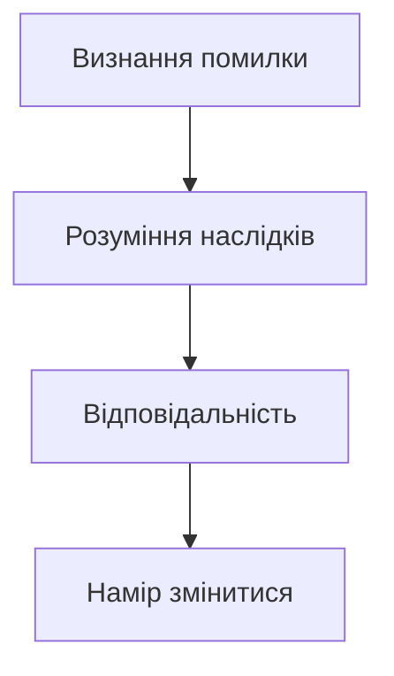

# Емоційний інтелект та міжособистісні навички

> [!important] **Чому це важливо?**
>
> Емоційний інтелект — це здатність розуміти свої та чужі емоції, керувати ними та будувати здорові стосунки. У професійному та особистому житті ця лексика допомагає вирішувати конфлікти, підтримувати інших та досягати порозуміння. Без цих слів важко говорити про почуття, вибачатися, хвалити чи критикувати — а це ключові навички дорослого спілкування.

## Вступ — Що таке емоційний інтелект?

Прочитайте цей уривок з психологічної статті:

> Сучасні дослідження показують, що **емпатія** та **співчуття** є ключовими факторами успішних стосунків. Люди, які виявляють **терпіння** та **толерантність**, краще справляються з конфліктами. **Щирість** і **чесність** формують довіру, а **ввічливість** і **тактовність** допомагають уникати непорозумінь. Коли виникає конфлікт, важливо вміти просити **вибачення** та давати **пробачення**. Найкращі стосунки будуються на **взаєморозумінні** та готовності до **компромісу**.

Помітили виділені слова? Це — лексика **емоційного інтелекту**. Вона дозволяє говорити про почуття, стосунки та міжособистісну взаємодію на глибшому рівні.

У цьому модулі ви навчитеся використовувати 30 таких слів для обговорення емоцій, підтримки інших та вирішення конфліктів.

---

## Емпатія та співчуття — Чути серцем

Уявіть ситуацію: ваш друг втратив роботу. Що ви скажете? Просте «шкода» — це **співчуття**. А ось сісти поруч, вислухати, відчути його тривогу як свою власну — це вже **емпатія**. Різниця суттєва.

### Різниця між емпатією і співчуттям

**Співчуття** — це реакція на чужий біль. Ви бачите проблему зовні, жалієте людину, але залишаєтеся на відстані. Українською кажемо: «Мені шкода», «Співчуваю вашій втраті», «Прийміть мої співчуття».

**Емпатія** — це глибше. Ви ставите себе на місце іншої людини, відчуваєте те, що відчуває вона. Це вимагає **активного слухання** і готовності бути вразливим. Емпатія — це не слова, а присутність.

| Ситуація | Співчуття | Емпатія |
|----------|-----------|---------|
| Друг захворів | «Шкода, одужуй!» | «Я уявляю, як тобі важко. Чим можу допомогти?» |
| Колега помилився | «Ну, буває» | «Я розумію, як це засмучує. Давай подумаємо разом» |
| Родич у горі | «Співчуваю» | Просто сидите поруч, тримаєте за руку |

### Як висловити підтримку українською

Українська мова має багатий арсенал фраз для вираження підтримки. Ось найприродніші:

**Для близьких:**
- Я поруч, що б не сталося.
- Можеш на мене розраховувати.
- Тобі не потрібно справлятися з цим наодинці.
- Я тут, коли захочеш поговорити.

**У формальних ситуаціях:**
- Я розумію, що ви переживаєте складний період.
- Якщо потрібна будь-яка допомога — звертайтеся.
- Наша команда вас підтримує.

> [!tip] **Важливо**
>
> Справжня підтримка — це не поради і не оцінки. Коли людина у скруті, їй часто потрібно просто бути почутою. Замість «Тобі треба...» спробуйте «Як ти себе почуваєш?»

### Активне слухання як навичка

**Активне слухання** — це не просто мовчання, поки інший говорить. Це техніка, яка показує співрозмовнику: «Я тут, я чую, я розумію».

**Елементи активного слухання:**

1. **Зоровий контакт** — дивіться на людину, не на телефон
2. **Підтвердження** — кивайте, кажіть «так», «розумію», «мгм»
3. **Перефразування** — «Якщо я правильно зрозумів, ти кажеш, що...»
4. **Уточнення** — «Що ти маєш на увазі під...?»
5. **Емоційне відображення** — «Здається, ти засмучений через це»

> [!cultural] **У реальному житті**
>
> Психологи з Києва та Львова активно популяризують техніки активного слухання. На тренінгах з комунікації вчать не перебивати, не давати порад одразу, не порівнювати («У мене теж таке було!»). Перший крок — просто слухати.

---

## Конфлікти та примирення

Конфлікти — природна частина будь-яких стосунків. Питання не в тому, як їх уникнути, а в тому, як їх вирішити без руйнування довіри.

### Як вибачатися

Щире вибачення — це мистецтво. Недостатньо сказати «вибач» і продовжити як раніше. Ефективне вибачення має структуру:

1. **Визнання помилки** — «Я був неправий, коли...»
2. **Розуміння наслідків** — «Я розумію, що це тебе образило»
3. **Відповідальність** — «Це була моя помилка, не твоя»
4. **Намір змінитися** — «Я постараюся, щоб це не повторилося»

**Формальні вибачення:**
- Прошу вибачення за затримку.
- Дозвольте вибачитися за непорозуміння.
- Я беру на себе відповідальність за цю помилку.

**Неформальні вибачення:**
- Вибач мене, будь ласка.
- Шкода, що так вийшло.
- Я не мав так казати/робити.

### Як пробачати

**Пробачення** — це не те саме, що забування або виправдання. Це рішення відпустити образу заради власного спокою та відновлення стосунків.

Фрази для пробачення:
- Я тебе пробачаю.
- Давай забудемо і рухаймося далі.
- Це вже в минулому.
- Я не тримаю зла.

> [!history-bite] **Культурний момент**
>
> В українській культурі традиція просити пробачення має глибоке коріння. На Прощену неділю (перед Великим постом) українці кажуть одне одному: «Прости мене, чим згрішив». Відповідь: «Бог простить, і я прощаю». Ця традиція нагадує про важливість примирення перед важливими періодами життя.

### Фрази для вирішення конфліктів

Коли виникає конфлікт, важливо не ескалювати, а деескалювати. Ось корисні фрази:

**Замість звинувачень:**
- ❌ «Ти завжди...» → ✅ «Я відчуваю себе..., коли...»
- ❌ «Це твоя вина» → ✅ «Давай подумаємо, як вирішити ситуацію»
- ❌ «Ти мене не слухаєш!» → ✅ «Мені важливо, щоб мене почули»

**Для пошуку рішення:**
- Давайте знайдемо компроміс.
- Що ти пропонуєш?
- Можливо, ми обидва частково праві.
- Я готовий піти на поступки, якщо ти теж.

### Культура примирення в Україні

Українці традиційно цінують гармонію в родині та громаді. Вираз «худий мир краще доброї сварки» відображає ставлення до конфліктів. Водночас сучасні психологи наголошують: здоровий конфлікт з повагою до обох сторін — це нормально і навіть корисно для розвитку стосунків.

> [!tip] **Важливо**
>
> Примирення — це не капітуляція. Знайти компроміс означає, що обидві сторони поступаються чимось, але зберігають гідність і взаємоповагу.

---

## Вживання

### Колокації: як поєднувати слова?

Лексика емоційного інтелекту вимагає правильних дієслів. Неправильні колокації звучать неприродно.

**Що робимо з почуттями?**

- **виявляти** емпатію / терпіння / розуміння ✅
- **проявляти** терпимість / тактовність ✅
- **показувати** емпатію ❌ (правильно: виявляти)
- **давати** терпіння ❌ (терпіння мають або втрачають)

**Що робимо з моральними якостями?**

- **цінувати** чесність / щирість / відвертість ✅
- **нести** відповідальність ✅
- **брати** відповідальність на себе ✅
- **дотримуватися** обіцянок ✅
- **виконувати** зобов'язання ✅

**Що робимо з підтримкою та критикою?**

- **надавати** підтримку ✅
- **давати** пораду / рекомендацію ✅
- **робити** зауваження ✅
- **сприймати** критику ✅
- **заслуговувати** на похвалу ✅

**Що робимо з конфліктами?**

- **просити** вибачення / пробачення ✅
- **досягати** примирення / порозуміння ✅
- **знайти** компроміс ✅
- **піти** на компроміс ✅

### Реєстр: формальне чи розмовне?

**Формальна мова (робота, офіційні ситуації):**

- Дозвольте **висловити співчуття** у зв'язку з вашою втратою.
- Прошу **вибачення** за затримку.
- Я **беру на себе відповідальність** за цю помилку.
- Маємо **виконати наші зобов'язання**.

**Розмовна мова (друзі, родина):**

- Мені так **шкода**, що це сталося.
- **Вибач**, я запізнився.
- Це **моя провина**.
- Я **обіцяю** виправитися.

> 💡 **Важливо**
>
> У формальних ситуаціях (на роботі, в офіційному листуванні) використовуйте "прошу вибачення", "висловити співчуття", "надати рекомендації". У неформальних стосунках природніше звучить "вибач", "шкода", "дай пораду".

### Діалогові моделі

Ось типові фрази для різних ситуацій:

**Висловлення розуміння:**

- Я **розумію, як ви себе почуваєте**.
- Мені знайоме це почуття.
- Я на вашому боці.

**Прохання вибачення:**

- **Дозвольте вибачитися за**... (формально)
- Прошу вибачення за мою помилку.
- Вибач мене, будь ласка. (неформально)

**Пропозиція компромісу:**

- **Давайте знайдемо компроміс**.
- Можливо, ми обидва можемо поступитися?
- Я готовий піти на компроміс, якщо ви теж.

**Вираження підтримки:**

- **Я ціную вашу підтримку**.
- Ви можете на мене розраховувати.
- Я поруч, якщо потрібна допомога.

---

## Читання

### Текст 1: Стаття з психології

**Тема:** Як розвивати емоційний інтелект?

> Емоційний інтелект — це не природжений талант, а навичка, яку можна розвивати. Перший крок — **емпатія**. Навчіться слухати інших без осуду, намагайтеся зрозуміти їхні почуття. Виявляйте **терпіння** — не всі готові одразу відкритися.
>
> Другий крок — **чесність** з собою та іншими. Визнавайте свої помилки, просіть **вибачення**, коли потрібно. Люди більше довіряють тим, хто бере на себе **відповідальність** за свої дії.
>
> Третій крок — **конструктивна критика**. Замість засуджувати, пропонуйте **рекомендації**. Замість нарікати, шукайте **компроміси**. **Порозуміння** досягається через діалог, а не через конфлікт.
>
> Нарешті, не забувайте про **підтримку** та **заохочення**. Іноді одне слово **похвали** може змінити чийсь день.

**Запитання для обговорення:**

1. Які три кроки до розвитку емоційного інтелекту описані в тексті?
2. Чому важливо просити вибачення?
3. Яка різниця між засудженням і конструктивною критикою?

### Текст 2: Ситуація на роботі

**Тема:** Конфлікт між колегами

> Марія і Петро працюють в одному відділі. Після того, як Марія отримала підвищення, Петро став холодним і відстороненим. Одного дня Марія вирішила поговорити з ним.
>
> — Петре, я помітила, що між нами щось змінилося. Я хочу **порозуміння** з тобою. Чи можемо поговорити?
>
> — Мені важко про це казати, але... я відчував, що **заслуговую** на ту посаду.
>
> — Я **розумію твої почуття**. Насправді я **ціную твою роботу** і хотіла б, щоб ми й надалі співпрацювали.
>
> — Мені потрібен час. Але дякую за **щирість**.
>
> — Якщо потрібна моя **підтримка** або **порада** — я поруч.
>
> Через тиждень Петро сам прийшов до Марії з **пропозицією** спільного проєкту. **Взаєморозуміння** було відновлено.

### Текст 3: Родинна ситуація

**Тема:** Примирення після сварки

> Батько і син посварилися через вибір університету. Минув місяць без розмов. Нарешті батько зателефонував.
>
> — Сину, я довго думав і зрозумів, що був неправий. **Прошу пробачення** за ті слова.
>
> — Тато, мені теж **шкода**. Я не мав кричати.
>
> — Я хочу тебе **підтримати**, навіть якщо не згоден з твоїм вибором. Твоє життя — твій вибір.
>
> — Дякую. Це багато для мене значить. Може, знайдемо **компроміс**? Я спробую цей університет рік, і потім обговоримо?
>
> — Добре. Мені потрібно більше **терпіння**. Я **ціную твою чесність**.
>
> **Примирення** відбулося. Іноді потрібен час, щоб знайти слова.

---

## Діалоги — Підтримка друга

### Діалог 1: Робоча нарада (формальний)

**Керівник:** Колеги, у нас є складна ситуація з клієнтом. Хтось допустив помилку в замовленні.

**Анна:** Я **беру на себе відповідальність**. Це була моя недбалість. **Прошу вибачення** перед командою.

**Керівник:** Дякую за **чесність**, Анно. Які ваші **рекомендації** щодо виправлення ситуації?

**Анна:** Я вже зв'язалася з клієнтом і **висловила співчуття**. Пропоную надати знижку як компенсацію.

**Керівник:** Добре. Це **конструктивний підхід**. Я **ціную** вашу **відповідальність**.

### Діалог 2: Між друзями (неформальний)

**Олег:** Слухай, я хотів **вибачитися** за вчора. Я був занадто різким.

**Микола:** Та ні, я теж перегнув палку. **Вибач** мені.

**Олег:** Давай просто забудемо? Ти для мене важливий друг.

**Микола:** Звісно. Твоя **підтримка** завжди мені допомагає. Дякую за **щирість**.

**Олег:** Друзі для того й є, правда? Якщо потрібна **порада** — завжди звертайся.

### Діалог 3: Психологічна консультація (напівформальний)

**Клієнт:** Мені важко **пробачити** батькам. Вони ніколи не **підтримували** мої мрії.

**Психолог:** Я **розумію ваші почуття**. Це нормально — потребувати часу для **пробачення**.

**Клієнт:** Як розвинути більше **терпіння** до них?

**Психолог:** Спробуйте **емпатію**. Подумайте, чому вони так поводилися. Можливо, вони теж потребували **підтримки**, якої не отримали.

**Клієнт:** Я ніколи так не думав. Можливо, їм потрібне моє **розуміння**, а не **критика**.

**Психолог:** Саме так. **Порозуміння** — це двосторонній процес.

### Діалог 4: Переговори (формальний)

**Представник А:** Ми не можемо прийняти ваші умови. Це занадто багато.

**Представник Б:** Я **розумію вашу позицію**. Можливо, ми можемо **знайти компроміс**?

**Представник А:** Що ви пропонуєте?

**Представник Б:** Давайте **піти на взаємні поступки**. Ми знизимо ціну, а ви збільшите обсяг замовлення.

**Представник А:** Це справедлива **пропозиція**. Мої **рекомендації** — погодитися.

**Представник Б:** Чудово! Я **ціную вашу відкритість** до діалогу. Сподіваюся на тривале **порозуміння**.

> 💡 **Зверніть увагу**
>
> У переговорах важливо виявляти **повагу** до іншої сторони, **слухати** її позицію і шукати **компроміс**. Слова "я розумію вашу позицію" та "давайте знайдемо компроміс" — ключові фрази для успішних переговорів.

---

## Зворотний зв'язок та саморефлексія

Здатність давати і приймати зворотний зв'язок — одна з найважливіших навичок емоційного інтелекту. Так само важлива **саморефлексія** — вміння чесно аналізувати власні дії та почуття.

### Як приймати зворотний зв'язок

Отримати критику — завжди непросто. Перша реакція — захищатися або заперечувати. Але конструктивний фідбек допомагає рости. Ось як сприймати його правильно:

**Правила прийняття зворотного зв'язку:**

1. **Вислухайте до кінця** — не перебивайте і не виправдовуйтеся одразу
2. **Подякуйте** — «Дякую, що сказали. Мені це важливо почути»
3. **Уточніть** — «Чи можете ви навести приклад?»
4. **Візьміть паузу** — «Дайте мені час обдумати ваші слова»
5. **Відокремте корисне від емоцій** — навіть у різкій критиці може бути раціональне зерно

**Фрази для прийняття фідбеку:**
- Дякую за чесність.
- Я ціную вашу відвертість.
- Ви маєте рацію, я над цим попрацюю.
- Це справедливе зауваження.

> 💡 **Важливо**
>
> Якщо критика здається несправедливою, ви маєте право не погодитися — але ввічливо. «Я розумію вашу точку зору, хоча бачу ситуацію інакше. Можемо обговорити детальніше?»

### Як давати зворотний зв'язок

Давати фідбек — теж мистецтво. Ціль — допомогти людині покращитися, а не принизити чи образити.

**Принцип «сендвіча»:** позитив → конструктив → позитив

- «Ти чудово впорався з презентацією. Можливо, варто додати більше цифр у наступну. Але загалом — дуже гарна робота!»

**Фрази для конструктивної критики:**
- У мене є невелике зауваження.
- Дозвольте поділитися спостереженням.
- Можливо, варто звернути увагу на...
- Я б запропонував...
- Це хороший початок, і можна додати ще...

### Слова для самоаналізу

**Саморефлексія** — це внутрішній діалог з собою. Вона допомагає зрозуміти власні почуття, мотиви та поведінку.

**Корисні запитання для саморефлексії:**
- Що я відчуваю зараз і чому?
- Як мої дії вплинули на інших?
- Що я міг зробити інакше?
- Чому я так відреагував?
- Чого я навчився з цієї ситуації?

**Лексика саморефлексії:**

| Слово | Приклад |
|-------|---------|
| **самоаналіз** | Після конфлікту я провів самоаналіз своєї поведінки. |
| **усвідомлення** | Прийшло усвідомлення, що я був несправедливий. |
| **самокритика** | Здорова самокритика допомагає рости. |
| **саморозвиток** | Емоційний інтелект — частина саморозвитку. |
| **самоконтроль** | Мені потрібно працювати над самоконтролем. |

> 🌍 **У реальному житті**
>
> Сучасні українці все частіше звертаються до психотерапевтів і коучів для роботи над собою. Поняття «саморефлексія», «усвідомленість», «емоційна зрілість» стали частиною повсякденного дискурсу. Книги про психологію та саморозвиток — серед бестселерів у книгарнях Києва та Львова.

---

> 🎬 **Культурний момент**
>
> В українській літературі тема емоційного інтелекту має глибоке коріння. Григорій **Сковорода** вчив про самопізнання та внутрішню гармонію — основу **порозуміння** з іншими. Тарас **Шевченко** у "Кобзарі" писав про **співчуття** до страждань народу та **прощення** кривд. **Леся** Українка у драмах досліджувала складні стосунки та потребу в **щирості**. Іван **Франко** закликав до **толерантності** та **взаєморозуміння** між людьми різних поглядів. Сучасні українські психологи з **Києва** та **Львова** — Світлана Ройз та Олег Чабан — популяризують концепцію емоційного інтелекту, допомагаючи українцям краще розуміти свої почуття та будувати здорові стосунки. Їхні книги та лекції доступні онлайн.

---

## Підсумок — EQ у повсякденному житті

**Що ви навчилися:**

1. **35 слів емоційного інтелекту** для обговорення почуттів, стосунків та конфліктів
2. **Колокації**:
   - виявляти емпатію / терпіння / розуміння ✅
   - нести / брати відповідальність ✅
   - просити вибачення / пробачення ✅
   - знайти / досягти компроміс / порозуміння ✅
   - давати / сприймати критику ✅
3. **Реєстр**: формальні та розмовні варіанти для різних ситуацій
4. **Синоніми**: різниця між емпатія/співчуття, вибачення/пробачення, критика/зауваження

**Основне правило:**

> Лексика емоційного інтелекту дозволяє будувати здорові стосунки, вирішувати конфлікти та підтримувати інших. Використовуйте її для виявлення розуміння, прохання вибачення, надання підтримки та пошуку компромісів.

**Ключові фрази:**

| Ситуація  | Фраза                            |
| --------- | -------------------------------- |
| Розуміння | Я розумію, як ви себе почуваєте. |
| Вибачення | Дозвольте вибачитися за...       |
| Компроміс | Давайте знайдемо компроміс.      |
| Підтримка | Я ціную вашу підтримку.          |

> ✅ **Самоперевірка**
>
> Чи можете ви:
>
> - [ ] Відрізнити емпатію від співчуття?
> - [ ] Правильно попросити вибачення у формальній та неформальній ситуації?
> - [ ] Утворити правильні колокації (виявляти терпіння, нести відповідальність)?
> - [ ] Запропонувати компроміс та висловити підтримку?
>
> Якщо так — ви готові до практики!

---

## Словник термінів

### Група 1: Розуміння та співпереживання

Ці слова описують здатність розуміти інших та ділити їхні почуття.

| Слово             | Типові колокації                               | Приклад                                                       |
| ----------------- | ---------------------------------------------- | ------------------------------------------------------------- |
| **емпатія**       | виявляти емпатію, розвивати емпатію            | Вона завжди **виявляє емпатію** до колег.                     |
| **співчуття**     | висловити співчуття, глибоке співчуття         | Прийміть мої **глибокі співчуття** у зв'язку з вашою втратою. |
| **розуміння**     | проявляти розуміння, знайти розуміння          | Дякую за ваше **розуміння** ситуації.                         |
| **терпіння**      | мати терпіння, втратити терпіння               | Для цієї роботи потрібно багато **терпіння**.                 |
| **терпимість**    | виявляти терпимість, релігійна терпимість      | **Терпимість** до різних поглядів — ознака зрілості.          |
| **толерантність** | розвивати толерантність, нульова толерантність | Школа пропагує **толерантність** та повагу.                   |

> 💡 **Емпатія vs Співчуття**
>
> **Емпатія** — це здатність відчувати те, що відчуває інша людина, ставити себе на її місце. **Співчуття** — це реакція на чужий біль або втрату, жаль за когось. Можна сказати "висловити співчуття" (на похороні), але не "висловити емпатію". Емпатію **виявляють** або **розвивають**.

### Група 2: Повага та ввічливість

Ці слова описують культуру спілкування та ставлення до інших.

| Слово            | Типові колокації                                | Приклад                                                            |
| ---------------- | ----------------------------------------------- | ------------------------------------------------------------------ |
| **повага**       | ставитися з повагою, заслуговувати на повагу    | Він **ставиться з повагою** до всіх, незалежно від посади.         |
| **ввічливість**  | виявляти ввічливість, елементарна ввічливість   | **Ввічливість** не коштує нічого, але цінується високо.            |
| **тактовність**  | проявляти тактовність, дипломатична тактовність | Для цієї розмови потрібна особлива **тактовність**.                |
| **делікатність** | з делікатністю, надзвичайна делікатність        | Ця тема потребує **делікатності** — не всі готові про це говорити. |

> 🌍 **У реальному житті**
>
> В українській культурі **ввічливість** має особливе значення. Привітання "Добрий день", звернення на "Ви" до старших або незнайомих, слова "будь ласка" та "дякую" — все це елементи української комунікативної культури. На роботі **тактовність** і **делікатність** допомагають обговорювати складні теми, не ображаючи колег.

### Група 3: Чесність та відповідальність

Ці слова описують моральні якості особистості.

| Слово                | Типові колокації                               | Приклад                                                         |
| -------------------- | ---------------------------------------------- | --------------------------------------------------------------- |
| **щирість**          | цінувати щирість, з повною щирістю             | Я кажу це **з повною щирістю** — ви заслуговуєте на підвищення. |
| **відвертість**      | цінувати відвертість, надмірна відвертість     | Ваша **відвертість** іноді може образити людей.                 |
| **чесність**         | цінувати чесність, повна чесність              | **Чесність** — найкраща політика у стосунках.                   |
| **порядність**       | людина порядності, елементарна порядність      | Він людина **великої порядності** — йому можна довіряти.        |
| **відповідальність** | нести відповідальність, брати відповідальність | Я **беру на себе відповідальність** за цю помилку.              |
| **зобов'язання**     | виконувати зобов'язання, взяти зобов'язання    | Ми **виконуємо всі зобов'язання** перед партнерами.             |
| **обіцянка**         | дати обіцянку, дотримуватися обіцянки          | Він завжди **дотримується обіцянок** — це рідкість.             |

> 💡 **Щирість vs Відвертість vs Чесність**
>
> - **Щирість** — говорити правду від серця, без прихованих мотивів
> - **Відвертість** — говорити все прямо, без обману, іноді занадто прямо
> - **Чесність** — не брехати, бути правдивим
>
> Можна бути **чесним**, але не **відвертим** (говорити правду, але не все). **Надмірна відвертість** може зашкодити.

### Група 4: Прощення та примирення

Ці слова описують процес вирішення конфліктів та відновлення стосунків.

| Слово               | Типові колокації                                   | Приклад                                                              |
| ------------------- | -------------------------------------------------- | -------------------------------------------------------------------- |
| **вибачення**       | просити вибачення, прийняти вибачення              | **Прошу вибачення** за запізнення — це більше не повториться.        |
| **пробачення**      | просити пробачення, дати пробачення                | Чи можете ви **дати мені пробачення** за ці слова?                   |
| **примирення**      | процес примирення, досягти примирення              | Після довгої сварки вони нарешті **досягли примирення**.             |
| **компроміс**       | знайти компроміс, піти на компроміс                | **Давайте знайдемо компроміс** — обидві сторони повинні поступитися. |
| **порозуміння**     | досягти порозуміння, знайти порозуміння            | Після переговорів ми **досягли порозуміння**.                        |
| **взаєморозуміння** | повне взаєморозуміння, відсутність взаєморозуміння | У нашій команді панує **повне взаєморозуміння**.                     |

> 🌍 **У реальному житті**
>
> Різниця між "вибачення" та "пробачення" важлива. "Прошу **вибачення**" — це ввічлива форма, часто формальна. "Прошу **пробачення**" — глибша форма, коли ви справді шкодуєте. На роботі кажуть "перепрошую" або "вибачте", у близьких стосунках — "пробач мене".

### Група 5: Підтримка та зворотний зв'язок

Ці слова описують, як ми допомагаємо іншим та реагуємо на їхні дії.

| Слово            | Типові колокації                           | Приклад                                                           |
| ---------------- | ------------------------------------------ | ----------------------------------------------------------------- |
| **підтримка**    | надавати підтримку, моральна підтримка     | Я **ціную вашу підтримку** в цей важкий час.                      |
| **заохочення**   | слова заохочення, потребувати заохочення   | Діти потребують **заохочення**, а не лише критики.                |
| **похвала**      | заслужити похвалу, щира похвала            | Ваша робота заслуговує на **похвалу** — чудовий результат!        |
| **критика**      | конструктивна критика, сприймати критику   | Я відкритий до **конструктивної критики** — вона допомагає рости. |
| **зауваження**   | зробити зауваження, справедливе зауваження | У мене є невелике **зауваження** щодо вашого звіту.               |
| **порада**       | дати пораду, попросити поради              | Можу я **попросити вашої поради** в особистій справі?             |
| **рекомендація** | дати рекомендацію, слідувати рекомендаціям | Лікар дав **рекомендації** щодо лікування.                        |

> 🎯 **Критика vs Зауваження**
>
> - **Критика** — загальна оцінка, може бути позитивною або негативною, але частіше асоціюється з негативом
> - **Зауваження** — конкретний коментар про помилку або недолік, менш емоційне
>
> "Конструктивна критика" — це критика, яка допомагає виправити помилки. "Зауваження" — це менш серйозне, ніж критика.

---

## Міні-чекпоінт: Лексика B1.5-B1.6

Ви пройшли 20 модулів лексичного розширення (M52-71). Час перевірити, наскільки добре ви засвоїли цей матеріал!

### Самооцінка словникового запасу

Оцініть себе від 1 до 5 (1 = погано, 5 = відмінно):

| Тема | M52-61 (Абстрактна лексика) | Ваша оцінка |
|------|----------------------------|-------------|
| Абстрактні поняття | M52-53 | __ / 5 |
| Висловлювання думок | M54-55 | __ / 5 |
| Дискурсивні маркери | M56-57 | __ / 5 |
| Зміни та новини | M58-59 | __ / 5 |
| Суспільство та робота | M60-61 | __ / 5 |

| Тема | M62-71 (Професійна та емоційна лексика) | Ваша оцінка |
|------|----------------------------------------|-------------|
| Довкілля та здоров'я | M62-63 | __ / 5 |
| Емоції та стосунки | M64-65 | __ / 5 |
| Бізнес та подорожі | M66-67 | __ / 5 |
| Синоніми та колокації | M68-70 | __ / 5 |
| Емоційний інтелект | M71 | __ / 5 |

### Тест: 20 ключових слів

Перекладіть українською:

1. abstract concept → _______________
2. to express an opinion → _______________
3. on the one hand... on the other hand → _______________
4. environment → _______________
5. colleague → _______________
6. empathy → _______________
7. compromise → _______________
8. to apologize → _______________
9. feedback → _______________
10. support → _______________

> 💡 **Що далі?**
>
> Якщо ваша середня оцінка нижче 3, поверніться до відповідних модулів для повторення. Якщо 4+, ви готові до культурних модулів B1.7!

---

## Потрібно більше практики?

Ви завершили цей модуль! Ось кілька способів закріпити матеріал:

### 🔄 Інтеграція знань

- Поєднуйте матеріал цього модуля з попередніми темами
- Створіть mind map зв'язків між різними темами
- Практикуйте використання кількох тем одночасно

### 🎯 Реальне застосування

- Знайдіть ситуації в житті, де можна використати вивчене
- Читайте українські тексти і шукайте знайомі структури
- Спілкуйтеся з носіями мови, застосовуючи нові знання

### 🌐 Онлайн-ресурси

Додаткові матеріали для практики B1:

- **Українська мова онлайн:** [https://ukrainian-language.uk](https://ukrainian-language.uk)
- **Словник.ua:** [https://slovnyk.ua](https://slovnyk.ua) — для перевірки слів
- **YouTube канали:** Шукайте "українська мова B1" для додаткових уроків
- **Мовні обміни:** italki, Tandem, HelloTalk для практики з носіями

---

> 💡 **Порада:** Найкращий спосіб закріпити матеріал — використовувати його регулярно. Виділіть 10-15 хвилин щодня для повторення!
