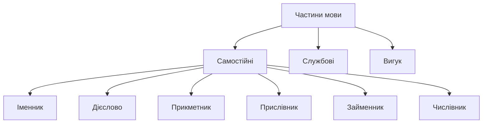
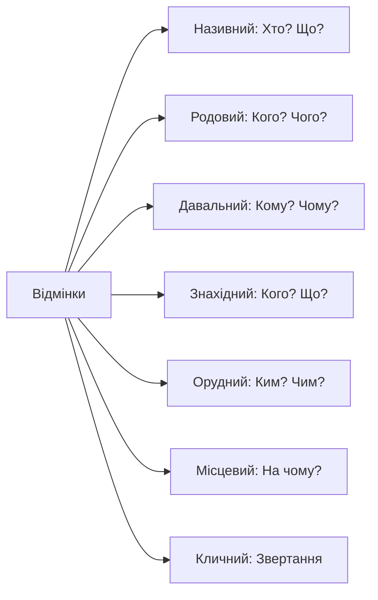

<!-- SCOPE
Covers: Ukrainian grammar terminology — parts of speech, cases, grammatical categories, syntactic roles
Not covered:
  - Verb-specific terminology → 02-language-about-verbs
  - Reading grammar rules → 03-reading-grammar-rules
Related: b1-02, b1-03, b1-05
-->

# Як говорити про граматику

> **Чому це важливо?**
>
> Опанування граматичної термінології — це не просто вивчення назв частин мови, а отримання «ключів від кабінету» українського мовознавства. Це дозволяє вам розуміти пояснення вчителя без перекладу та самостійно читати українські підручники, наукові праці та класичну літературу з глибоким розумінням структури мови.

Welcome to Level B1! This is a **bridge module**, designed to transition you from learning *about* Ukrainian in English to learning *in* Ukrainian. To do this, we need a shared **metalanguage** (метамова) — the specialized vocabulary used to talk about language itself. In this lesson, we will cover the names of **parts of speech** (частини мови), **grammatical cases** (відмінки), and **sentence structure** (структура речення). Knowing these terms is not just academic; it provides a **psychological advantage** by reducing code-switching and allowing your brain to stay fully immersed in the Ukrainian linguistic logic. We are moving from simple communication to academic fluency, where you can analyze, debate, and refine your speech using professional terms. Metalanguage serves as a conceptual framework, allowing you to discuss complex grammatical patterns without relying on translations that often lose nuance. By mastering these terms now, you're building a foundation for independent study and more sophisticated interactions with native speakers. You will find that as you progress through B1, your dependence on English will decrease, but for this first step, we provide a robust bridge to ensure you never feel lost in the technical details. This module is your map to the inner workings of the Ukrainian language.

## Вступ: психологія та логіка української метамови

Вивчення граматики українською мовою — це не лише лінгвістичне завдання, а й стратегічний крок до вашої повної автономності. Коли ви називаєте іменник «іменником», а не "noun", ваш мозок перестає шукати англійські відповідники і починає працювати в системі координат цільової мови. Це створює цілісну мовну картину світу, де кожне граматичне поняття має своє логічне місце та назву, що походить із внутрішніх ресурсів самої мови. Цей процес допомагає вибудувати внутрішню ієрархію знань, де кожен новий термін чіпляється за вже існуючу мережу асоціацій, а не бовтається у вакуумі перекладу.

### Психологічна перевага української термінології

Використання української метамови створює нові нейронні зв'язки, які допомагають уникнути постійного «перемикання кодів» (code-switching). Це зменшує когнітивне навантаження під час уроку. Коли вчитель каже: «Змініть відмінок цього іменника», ви відразу фокусуєтеся на закінченні слова, а не на перекладі самої інструкції. Це дає величезну психологічну перевагу: ви почуваєтеся не стороннім спостерігачем, а активним учасником мовного середовища. Ви починаєте думати не *про* мову, а *мовою*, що є найвищою метою будь-якого лінгвістичного навчання.

Більше того, знання термінології підвищує вашу впевненість у спілкуванні з носіями мови, особливо в освітньому чи професійному контексті. Ви зможете чітко формулювати свої запитання щодо мовних нюансів, використовуючи загальноприйнятий академічний апарат. Це шлях від пасивного вивчення правил до активного володіння мовними механізмами, де граматика стає не набором заборон, а конструктором для вираження найскладніших думок. Така впевненість дозволяє студенту брати участь у дискусіях про літературу чи правопис, не почуваючись «туристом» у чужому мовному просторі.

Using Ukrainian metalanguage creates new neural pathways and reduces the cognitive load of code-switching. When you call a noun an "іменник," your brain stays within the target language's logic, leading to total autonomy. This shift from passive rule-following to active analysis is the key to linguistic confidence. You are no longer just a visitor in the language; you are becoming an architect of your own speech.

> [!tip] **Метакогнітивна порада**
> Вивчаючи граматичну термінологію, ви одночасно опановуєте академічний стиль мовлення. Це «вбивство двох зайців одним пострілом»: ви вчитеся і правил, і того, як професійно обговорювати складні теми. Почніть використовувати ці терміни у своїх нотатках, замінюючи англійські слова "verb", "case" на «дієслово», «відмінок». Це прискорить вашу адаптацію до української наукової думки.

### Традиції та логіка українського мовознавства

Українська граматична традиція має понад 400-літню історію, що глибоко вкорінена в європейський інтелектуальний контекст. Фундамент цієї системи заклав Мелетій Смотрицький — видатний український мовознавець, письменник-полеміст та церковний діяч. У 1619 році він видав свою капітальну працю:

> [!quote]
> «Грамматіки Славєнскиѧ правильноє Сѵнтаґма»

Ця книга, надрукована у Вільно (або в Єв'ї), стала справжньою інтелектуальною революцією свого часу. Вона була основним підручником церковнослов'янської мови протягом понад двох століть на величезних просторах Східної Європи. Саме Смотрицький першим виділив сім відмінків, які ми вивчаємо сьогодні, та запровадив категорії, що стали канонічними для української лінгвістичної традиції. Навіть Михайло Ломоносов, автор російської граматики, визнавав першість української школи, називаючи працю Смотрицького «вратами своєї вченості».

Смотрицький не просто переклав латинські чи грецькі терміни; він адаптував їх до особливостей живої української мови та церковнослов'янської традиції того часу. Логіка українських термінів часто є «прозорою» — назви походять від функцій слів. Це суттєво відрізняє українську систему від англійської, де домінують латинізовані терміни, етимологія яких часто прихована від пересічного мовця. Наприклад, англійське "conjunction" походить від латинського *coniunctio*, тоді як українське «сполучник» напряму пов'язане з дієсловом «сполучати» (connect/join), що відразу розкриває функцію цієї частини мови.

The Ukrainian grammatical tradition is over 400 years old, with roots in European intellectual history. Meletiy Smotrytskyi's 1619 grammar was a revolutionary work that defined the seven cases we use today. Unlike English, which uses Latin-based terms, Ukrainian terminology is often "transparent," with names derived directly from the words' functions. This transparency makes the system easier to navigate once you understand the underlying roots.

> [!decolonization] **Інтелектуальна суб'єктність**
> Протягом століть імперські наративи намагалися представити українську мову як «діалект» або щось вторинне. Проте наявність власної розвиненої граматичної термінології ще з XVII століття доводить високу інтелектуальну культуру України. Розуміння того, що наша граматична школа старша за багато сусідніх, допомагає усвідомити тяглість та самодостатність української наукової думки. Це свідчення того, що українська мова завжди була мовою науки та високої культури.

> [!context] **Етимологічна прозорість**
> Порівняйте: англійське "preposition" походить від латинського *praepositio* (поставлений попереду). Українське «прийменник» буквально означає те, що стоїть «при імені» (іменнику). Те саме стосується терміна "adjective" (від лат. *adiectivum* — доданий) та українського «прикметник» (від слова «прикмета» — trait/sign). Також зверніть увагу на термін «прислівник» (adverb). Латинське *adverbium* буквально означає «при дієслові». Український термін зберігає ту саму логіку: «при слові» (де під «словом» історично часто розуміли саме дієслово як головний носій смислу дії).

## Частини мови: самостійні категорії та їхні ролі

Частини мови (parts of speech) — це великі групи слів, об’єднані спільним значенням, морфологічними ознаками та синтаксичною роллю. В українській мові ми виділяємо десять частин мови. Вони поділяються на самостійні (повнозначні), службові та вигуки. Самостійні частини мови мають лексичне значення, відповідають на питання і виступають членами речення. Кожна така частина мови — це окремий будівельний блок нашої мовної свідомості.

In this section, you'll learn the names of the six content word types in Ukrainian. These are the words that carry primary meaning and answer specific questions. Pay attention to the Ukrainian terms — after this module, we'll use them exclusively to build your professional vocabulary. Understanding these categories is the first step toward analyzing complex sentences and mastering the logic of the language. Content words like nouns, verbs, and adjectives form the backbone of your communication, and knowing their names will help you understand more advanced grammar explanations.

### Іменник

Іменник (noun) — це самостійна частина мови, що означає предмет і відповідає на питання «хто?» або «що?». Іменники поділяються на власні (назви конкретних осіб, міст: Тарас, Київ) та загальні (назви класів предметів: книга, дерево). В українській мові іменник має три роди — чоловічий, жіночий і середній — та змінюється за числами і відмінками. В українській граматиці початкова форма іменника — це називний відмінок однини. Поняття «предмет» трактується дуже широко: це можуть бути назви людей, тварин (істоти), речей, явищ природи, а також абстрактних понять, почуттів чи якостей, сприйнятих як субстанції (наприклад, «доброта», «біг», «тиша»). Важливо пам'ятати, що рід іменника в українській мові — це постійна ознака. Якщо слово «стіл» чоловічого роду, воно залишається таким у будь-якій ситуації, на відміну від прикметників, які «підлаштовуються» під іменник. Це найчисельніша категорія слів, яка дозволяє нам ідентифікувати навколишній світ, називаючи людей, тварин, речі та явища.

- **Визначення**: Слова, що називають істот, предмети та явища.
- **Морфологічне запитання**: Хто? (для істот) Що? (для неістот).
- **Категорії**: Рід (чоловічий, жіночий, середній), число (однина, множина), відмінок (сім форм).
- **Нотатка**: Іменник завжди є головним у парі «іменник + прикметник», він диктує граматичні правила своїм сусідам.
- _Приклад:_ «**Студент** (хто?) читає **книгу** (що?).»
- _Приклад:_ «**Радість** (що?) — це відчуття щастя.»
- _Приклад:_ «**Мрія** (що?) надихає людину на нові звершення.»

> **Примітка щодо вживання**: Вживання іменників у різних відмінкових формах дозволяє будувати складні синтаксичні зв'язки без жорсткого порядку слів. Саме через закінчення іменника ми розуміємо, хто є виконавцем дії, а хто — об'єктом.

> [!note] **Особливість вживання**
> На відміну від англійської мови, де категорія роду часто є формальною або стосується лише людей, в українській мові кожен іменник (навіть неживі предмети) має граматичний рід. Це означає, що рід слова «мова» (жіночий) або «світ» (чоловічий) — це не біологічна ознака, а фундаментальна граматична характеристика, яка диктує форми всіх узгоджених із ними слів у реченні.

### Дієслово

Дієслово (verb) — це самостійна частина мови, що виражає дію або стан предмета і відповідає на питання «що робити?», «що зробити?». Українське дієслово має складну систему дієвідмінювання, що залежить від особи та числа. Крім того, важливою категорією є вид (доконаний та недоконаний), який вказує на завершеність чи тривалість дії. Це динамічний центр речення, його «мотор». Без дієслова речення часто втрачає свою спрямованість та енергію. Дієслова можуть виражати не лише фізичну дію (бігти), а й психічний стан (любити) чи процес (старіти). Воно є енергетичним ядром речення, передаючи динаміку подій або тривалість процесів у часі.

- **Визначення**: Слова, що виражають дію, стан або процес.
- **Морфологічне запитання**: Що робити? (недоконаний вид) Що зробити? (доконаний вид).
- **Категорії**: Вид, час, особа, число, спосіб, а в минулому часі — рід.
- **Нотатка**: В українській мові дієслово має початкову форму — інфінітив, що закінчується на -ти. Саме від цієї форми ми починаємо будь-який розбір.
- _Приклад:_ «Ми **вивчаємо** граматику щодня.»
- _Приклад:_ «Україна **переможе** у цій війні.»
- _Приклад:_ «Він **написав** цікавий коментар до статті.»

> **Примітка щодо вживання**: Дієслово в українській мові часто стоїть на початку або в середині речення, задаючи темп усьому висловлюванню. Особливу увагу слід приділяти зворотним дієсловам із часткою -ся, які можуть змінювати значення дії з активного на пасивне або зворотне.

> [!note] **Особливість вживання**
> Українське дієслово має унікальну систему особових закінчень, що дозволяє мовцеві часто опускати займенники (я, ти, він/вона). Наприклад, ви можете просто сказати «Пишу», і слухач відразу зрозуміє, що суб’єктом дії є перша особа однини. Це робить українське мовлення лаконічним і динамічним, фокусуючи увагу на самій дії.

### Прикметник

Прикметник (adjective) — це самостійна частина мови, що виражає ознаку предмета (його якість, властивість, належність) і відповідає на питання «який?», «яка?», «яке?», «які?», а також «чий?», «чия?», «чиє?», «чиї?». Прикметники надають мовленню конкретики, дозволяючи виокремити предмет серед інших за його унікальними ознаками. В українській мові вони завжди мають ту саму форму роду, числа та відмінка, що й іменник, до якого вони відносяться. Він надає нашому мовленню барв, точності та емоційності. Прикметники бувають якісні, відносні та присвійні. Він допомагає нам диференціювати предмети, додаючи до мовлення конкретики та естетичного забарвлення.

- **Визначення**: Слова, що описують властивості, якості та ознаки.
- **Морфологічне запитання**: Який? Чий?
- **Зв'язок**: Він завжди узгоджується з іменником у роді, числі та відмінку.
- **Нотатка**: Якісні прикметники — єдині, що можуть мати ступені порівняння (більший, найкращий).
- _Приклад:_ «Це дуже **цікаве** правило.»
- _Приклад:_ «Я бачу **синій** небокрай.»
- _Приклад:_ «Це була важлива **батьківська** порада.»

> **Примітка щодо вживання**: Часто прикметники можуть переходити в розряд іменників (субстантивація), наприклад, слово «черговий» може бути як ознакою, так і назвою особи. У науковому стилі прикметники допомагають створювати точні термінологічні визначення.

> [!note] **Особливість вживання**
> В українській граматиці прикметник виступає «дзеркалом» іменника. Він не має власних незалежних категорій роду чи числа, а повністю копіює їх від слова, яке він описує. Якщо ви змінюєте відмінок іменника, прикметник автоматично змінює своє закінчення, забезпечуючи граматичну цілісність словосполучення.

### Прислівник

Прислівник (adverb) — це незмінна самостійна частина мови, що виражає ознаку дії, стан або ознаку іншої ознаки. Це єдина частина мови, яка не має закінчень, а лише суфікси, оскільки вона не змінюється ні за родами, ні за числами, ні за відмінками. Прислівники можуть характеризувати не лише дію («бігти швидко»), а й іншу ознаку («дуже гарний») чи стан. Головна морфологічна ознака прислівника — його незмінність. Він не має закінчення, не відмінюється і не має категорії роду чи числа. Це робить його однією з найлегших частин мови для вивчення, але водночас він вимагає уваги до контексту. Це категорія слів, яка відповідає на обставинні питання і не має флексії (закінчення), що робить її структурно стабільною в будь-якому контексті.

- **Визначення**: Слова, що характеризують обставини дії (як, де, коли, з якою метою).
- **Морфологічне запитання**: Як? Де? Куди? Коли? Чому? Навіщо?
- **Нотатка**: Оскільки прислівник незмінний, у нього немає закінчення, лише суфікс (-о, -е).
- _Приклад:_ «Вона говорить українською дуже **швидко**.»
- _Приклад:_ «Сонце світить **яскравіше**, ніж учора.»
- _Приклад:_ «Учитель **спокійно** пояснив новий матеріал.»

> **Примітка щодо вживання**: В українській мові багато прислівників утворюються від інших частин мови за допомогою префіксів та суфіксів (наприклад, «по-людськи», «вдруге»). Вони є незамінними для опису просторових та часових координат у розповіді.

> [!note] **Особливість вживання**
> Прислівник — це єдина самостійна частина мови, яка ніколи не змінюється. У нього немає закінчення, що часто збиває з пантелику англомовних студентів, які звикли до суфікса "-ly". В українській мові прислівники на "-о" (добре, швидко) можуть бути схожими на прикметники середнього роду, але їхня роль у реченні завжди вказує на характеристику дії, а не предмета.

### Займенник

Займенник (pronoun) — це самостійна частина мови, яка вказує на предмети, ознаки або кількість, але не називає їх. Займенники не мають власного лексичного значення, але вони є критично важливими для забезпечення зв'язності тексту. Вони допомагають нам посилатися на предмети чи явища, про які вже йшла мова, не повторюючи їхні назви постійно. Назва «займенник» підказує нам його функцію — він вживається «замість імені» (іменника, прикметника чи числівника), щоб уникнути повторів у тексті та зробити мовлення лаконічнішим. Він слугує мостиком між реченнями, забезпечуючи текстову зв'язність. Він є ключовим інструментом економії мовних ресурсів, дозволяючи нам посилатися на вже згадані об'єкти без їх прямого повторення.

- **Визначення**: Слова-замінники для інших самостійних частин мови.
- **Морфологічне запитання**: Хто? Що? Який? Чий? Скільки?
- **Нотатка**: Займенники часто «перебирають» на себе граматичні властивості тих слів, які вони замінюють.
- _Приклад:_ «**Він** допоміг **мені** з цим завданням.»
- _Приклад:_ «**Цей** підручник дуже корисний.»
- _Приклад:_ «**Ніхто** не знав правильної відповіді на питання.»

> **Примітка щодо вживання**: Використання вказівних займенників («цей», «той») допомагає акцентувати увагу на конкретному об'єкті в просторі. Питальні займенники («хто?», «що?») є основою для побудови будь-якого граматичного розбору або запитання до слова.

> [!note] **Особливість вживання**
> Деякі українські займенники мають особливу форму «себе», яка вказує на те, що дія повертається до самого виконавця. Цей займенник є унікальним, оскільки він не має форми називного відмінка і ніколи не може бути підметом. Крім того, в українській мові важливо розрізняти форми «ви» (ввічливе звертання) та «ти», що регулюється соціальним контекстом і етикетом.

### Числівник

Числівник (numeral) — це самостійна частина мови, що означає число, кількість предметів або їх порядок при лічбі. Числівники дозволяють нам оперувати точними даними, часом та кількістю. Вони поділяються на кількісні (скільки?) та порядкові (котрий?), кожен з яких має свої особливості відмінювання та узгодження з іменниками. Це одна з найскладніших частин мови для відмінювання, але необхідна для базового функціонування в суспільстві. Відмінювання числівників — це справжня гімнастика для мозку, яка вимагає знання багатьох винятків. Він структурує наше сприйняття реальності через математичні параметри, дозволяючи точно визначати обсяги, дати та послідовність процесів.

- **Визначення**: Слова, що виражають кількість або послідовність.
- **Морфологічне запитання**: Скільки? Котрий?
- **Нотатка**: Порядкові числівники відмінюються як прикметники, а кількісні мають унікальні парадигми.
- _Приклад:_ «У нашому класі **десять** студентів.»
- _Приклад:_ «Сьогодні **перше** вересня.»
- _Приклад:_ «Я прочитав **п'ятдесят** сторінок тексту.»

> **Примітка щодо вживання**: У діловому та науковому мовленні правильне вживання числівників є ознакою високої грамотності. Пам'ятайте, що при відмінюванні складних числівників в українській мові часто змінюються обидві частини слова, що вимагає особливої практики.

> [!note] **Особливість вживання**
> Відмінювання числівників вважається однією з найскладніших тем в українській мові. Крім зміни закінчень, вони впливають на форму іменника, що стоїть після них. Наприклад, числівник «два» вимагає називного відмінка множини («два столи»), а числівник «п'ять» — родового відмінка множини («п'ять столів»). Ця система синтаксичного керування є критично важливою для правильного мовлення.

> [!tip] **Числа в академічній логіці**
> Числівники допомагають структурувати інформацію. Розгляньте приклад: «У **першому** (порядковий) розділі наведено **п’ять** (кількісний) основних тез». Порядкові числівники вказують на місце в ряду і змінюються як прикметники, тоді як кількісні вказують на обсяг і мають власну парадигми відмінювання. Розуміння цієї різниці є ключовим для правильного оформлення наукових робіт та доповідей.

## Частини мови: службові слова та вигуки

На відміну від самостійних частин мови, службові слова не мають лексичного значення, не називають предметів чи дій і не є членами речення. Вони виконують допоміжну роль: виражають зв'язки між словами, надають відтінків значення реченням. Вони — як «клеюча речовина», що перетворює набір слів на структуровану думку. Службові частини мови забезпечують логіку та емоційну точність висловлювання.

Service words (службові слова) work differently from content words. They connect ideas and add nuance to sentences. They are the "glue" that holds your speech together, ensuring logical transitions and emotional precision. In this section, we will look at conjunctions, prepositions, and particles. While they may be small, their impact on the meaning of a sentence is profound, and mastering them is essential for reaching the B1 level of fluency.

### Сполучник

Сполучник (conjunction) — це службова частина мови, яка вживається для сполучення однорідних членів речення або частин складного речення. Без сполучників наша мова складалася б із коротких, розірваних фраз. У граматичних правилах сполучники часто використовуються для побудови складних інструкцій, наприклад: «Знайдіть помилку **і** виправте її».

- **Роль**: Логічне поєднання слів та частин думок.
- **Типи**: Сурядні (і, та, але — з'єднують рівноправні елементи) та підрядні (бо, що, тому що, якщо — вказують на залежність однієї частини від іншої).
- _Приклад:_ «Я вивчаю граматику, **бо** хочу розмовляти вільно.»
- _Приклад:_ «Кава **і** чай стоять на столі.»

На рівні B1 важливо розрізняти відтінки значень сполучників причини (*бо, оскільки, через те що*), умови (*якщо, якби*) та мети (*об, аби*). Сполучники також допомагають розставити акценти: «Хоча я втомлений, **але** я продовжую вчитись».

### Прийменник

Прийменник (preposition) — це службова частина мови, яка виражає відношення між предметами, діями та ознаками, уточнюючи значення відмінкових форм іменників. Назва походить від того, що він стоїть «при імені» (іменнику, займеннику чи числівнику). У підручниках прийменники критично важливі для просторової орієнтації: «підкресліть **під** словом», «напишіть **у** стовпчик».

- **Роль**: Вираження просторових, часових, об'єктних чи причинних зв'язків.
- **Вживання**: Прийменники ніколи не вживаються з називним відмінком. Вони «керують» іншими відмінками.
- _Приклад:_ «Книга лежить **на** столі (Місцевий відмінок).»
- _Приклад:_ «Ми пішли **до** театру (Родовий відмінок).»

> [!warning] **Прийменник чи Займенник?**
> Студенти часто плутають ці терміни через схожість префіксів. Пам'ятайте про логіку коренів: **За-йменник** (використовується *замість* імені), **При-йменник** (стоїть *при* імені, супроводжує його). Це простий ментальний гачок, який допоможе вам на іспитах та під час розбору речень.

### Частка

Частка (particle) — це службова частина мови, яка надає окремим словам чи реченням додаткових смислових, модальних або емоційних відтінків. Вона не з'єднує слова, а «підсвічує» їх значення. У граматиці частка «не» є найважливішою, оскільки вона повністю змінює зміст інструкції: «**не** пишіть», «**не** змінюйте».

- **Роль**: Модифікація змісту (заперечення, запитання, підсилення, сумнів).
- **Приклади**: не, ні, б, би (формотворчі); невже, хіба (питальні); ось, ото (вказівні); же, ж, навіть (підсилювальні).
- _Приклад:_ «Я **не** бачив цього прикладу.»
- _Приклад:_ «**Хіба** ви вже вивчили всі відмінки?»

> [!history-bite] **Частки-архаїзми**
> В українській мові частки **ж, же, б, би** мають праслов’янське походження і колись були самостійними словами. Сьогодні вони додають мові поетичності та емоційної глибини. Наприклад, частка «таки» у фразі «я таки вивчив» підкреслює наполегливість, якої важко досягти в англійській мові без інтонаційного наголосу.

### Вигук

Вигук (interjection) — це особлива частина мови, що виражає почуття, волевиявлення, спонукання, не називаючи їх. Вигуки не належать ні до самостійних (бо не відповідають на питання), ні до службових (бо нічого не з'єднують) частин мови. Вони часто використовуються в розмовній мові або для привернення уваги в інструкціях: «**Ну**, почнемо вправу!».

- **Роль**: Безпосередня емоційна реакція на події.
- **Групи**: Емоційні (ох, ах, жах), спонукальні (цить, алло, гей), етикетні (добридень, дякую, бувай).
- _Приклад:_ «**Ой**, я забув закінчення!»
- _Приклад:_ «**Ого**, як багато нових слів!»

> [!observe] **Функціональність службових слів**
> Спробуйте змінити речення, прибравши або додавши службові слова:
> «Я вчуся (і) читаю». -> «Я вчуся, (але) (не) читаю».
> Бачите, як сполучник та частка кардинально змінюють ситуацію? Це і є магія службових частин мови.

## Відмінки: сім ключів до системи відмінювання

В українській мові існує сім відмінків (cases). Відмінювання — це зміна закінчень іменних частин мови (іменників, прикметників, займенників, числівників) для вираження їхніх граматичних зв'язків з іншими словами. Це серце слов'янської граматики. Кожен відмінок має своє логічне обґрунтування, історію та унікальний набір питань. Розуміння відмінків дозволяє вам «бачити» структуру речення наскрізь.

Ukrainian has seven grammatical cases. Each case changes the ending of a noun to show its role in a sentence — whether it is the subject, the object, or the location. This system allows for a flexible word order while maintaining clarity. The system below will help you learn their names and primary functions. Cases are the defining feature of Slavic grammar, and once you master the logic behind their names, you will be able to navigate even the most complex sentence structures with ease.

### Називний

Називний відмінок (nominative case) — це початкова, «чиста» форма слова. Це єдиний **прямий** відмінок; усі інші називаються **непрямими**.

- **Запитання**: Хто? Що? (Є...)
- **Основна роль**: Називає суб'єкт дії, виконує роль **підмета** у реченні.
- _Приклад:_ «**Вчитель** пояснює правило.»
- _Приклад:_ «**Київ** — столиця України.»
- **Додаткова інформація**: У називному відмінку іменники ніколи не вживаються з прийменниками. Він також може входити до складу присудка (Він був **герой**). Це форма, у якій слова зафіксовані в словниках.

### Родовий

Родовий відмінок (genitive case) — один із найбагатших на значення відмінків. Його назва вказує на походження (з якого «роду»), тобто Родовий ← рід (походження, джерело).

- **Запитання**: Кого? Чого? (Немає...)
- **Основна роль**: Вказує на належність (власність), відсутність чогось, частину цілого, походження або причину.
- _Приклад:_ «Це книга мого **брата** (належність).»
- _Приклад:_ «У мене немає **часу** (відсутність).»
- _Приклад:_ «Випити **чаю** (частина цілого).»
- **Додаткова інформація**: Часто вживається після числівників (п'ять **студентів**) та прийменників *від, до, з, біля, навколо*. Також він використовується для позначення дати: *першого вересня*.

### Давальний

Давальний відмінок (dative case) виражає особу чи предмет, на користь яких або в напрямку яких відбувається дія. Етимологія слова прозора: від дієслова «давати».

- **Запитання**: Кому? Чому? (Даю...)
- **Основна роль**: Адресат дії (непрямий додаток).
- _Приклад:_ «Я написав листа **другові**.»
- _Приклад:_ «Дякую **вам** за допомогу.»
- **Додаткова інформація**: В українській мові Давальний часто вживається у безособових реченнях для позначення стану людини: **Мені** холодно, **йому** сумно. Він також вказує на вік: **мені** двадцяти років.

### Знахідний

Знахідний відмінок (accusative case) називає об'єкт, на який безпосередньо спрямована дія. Назва походить від дієслова «знаходити».

- **Запитання**: Кого? (для істот) Що? (для неістот). (Бачу... Знаходжу...)
- **Основна роль**: Прямий додаток (object).
- _Приклад:_ «Вона читає **статтю**.»
- _Приклад:_ «Я бачу свою **маму**.»
- **Додаткова інформація**: Важливо пам'ятати про категорію істот/неістот: для неістот форма Знахідного збігається з Називним (*Бачу стіл*), а для істот — з Родовим (*Бачу брата*). Це створює певні виклики для новачків.

### Орудний

Орудний відмінок (instrumental case) вказує на знаряддя дії (інструмент), спосіб дії або на сумісність. Назва походить від слова «орудувати» (працювати інструментом), Орудний ← орудувати (діяти знаряддям).

- **Запитання**: Ким? Чим? (Пишу... Пишаюся... Орудую...)
- **Основна роль**: Інструмент дії, спільність або стан/професія.
- _Приклад:_ «Я пишу **ручкою** (інструмент).»
- _Приклад:_ «Ми йдемо в кіно з **Олегом** (спільність).»
- _Приклад:_ «Він працює **вчителем** (стан).»
- **Додаткова інформація**: Також вживається для опису пересування простором (*їхати лісом, летіти небом*). Він часто супроводжує дієслова, що виражають гордість чи захоплення: *пишаюся Україною*.

### Місцевий

Місцевий відмінок (locative case) вказує на місце, час або об'єкт думки/мовлення. Це єдиний відмінок, який **завжди** потребує прийменника. Його назва походить від слова «місце», оскільки локація — його головне значення.

- **Запитання**: На кому? На чому? В кому? В чому? У кому? У чому? При кому? При чому?
- **Основна роль**: Локація (обставина місця).
- _Приклад:_ «Ми живемо у **Львові**.»
- _Приклад:_ «На **столі** стоїть ваза.»
- **Додаткова інформація**: Мелетій Смотрицький називав цей відмінок «сказательним», але сучасна назва «місцевий» краще відображає його основну функцію — вказівку на простір. Він також вказує на час: *у вересні*.

### Кличний

Кличний відмінок (vocative case) використовується для безпосереднього звертання до особи, тварини чи персоніфікованого предмета. Це гордість української мови, що зберегла цю архаїчну індоєвропейську форму, яку втратили більшість сусідніх мов.

- **Запитання**: (Відсутнє, функція — звертання) О!
- **Основна роль**: Виокремлення адресата мовлення.
- _Приклад:_ «**Україно**, моя рідна земле!»
- _Приклад:_ «**Пане** вчителю, допоможіть мені!»
- **Додаткова інформація**: Кличний відмінок не є членом речення, тому він завжди виділяється комами. Він додає мовленню ввічливості та автентичності.

> [!important] **Мнемонічна формула запам'ятовування**
> Для швидкого засвоєння порядку відмінків використовуйте цю класичну фразу:
> **Н**а **Р**іздво **Д**ід **З**агубив **О**рішки **М**іж **К**овбасками.
> - **Н**азивний
> - **Р**одовий
> - **Д**авальний
> - **З**нахідний
> - **О**рудний
> - **М**ісцевий
> - **К**личний
> Кожна перша літера слова у фразі відповідає першій літері назви відмінка.

> [!history-bite] **Боротьба за Кличний відмінок**
> За радянських часів Кличний відмінок намагалися викреслити з граматик або назвати «кличною формою», щоб уніфікувати українську мову з російською. Проте українські мовознавці героїчно відстояли його статус як повноцінного сьомого відмінка. Сьогодні використання Кличного відмінка — це ознака мовної культури та поваги до традиції.

## Будова слова, граматичні категорії та синтаксис

Граматика — це не лише частини мови та відмінки. Це ціла архітектура смислів. Щоб розуміти інструкції в підручниках та логіку мовних помилок, вам потрібно знати «анатомію» слова та «структуру» речення. Розуміння того, як слово будується зсередини, дає вам змогу самостійно виводити значення незнайомих слів.

Understanding word structure (morphemics) will help you decode unfamiliar words without a dictionary. By identifying the root, prefix, and suffix, you can guess the meaning of thousands of words. Here are the building blocks of Ukrainian words that you will encounter in your readings. Morphemic analysis is a powerful tool for vocabulary expansion, allowing you to see the relationships between words and understand how the language grows and adapts.

### Морфеміка: Анатомія українського слова

Слово складається з найменших значущих частин — морфем. Кожна морфема несе певний лексичний або граматичний зміст. Розуміння морфемного складу слова дозволяє вам не просто запам'ятовувати лексику, а «прораховувати» значення незнайомих слів. Кожна частина слова — це логічний код. Наприклад, знаючи значення префікса **під-** (under/sub) та кореня **-вод-** (water), ви легко зрозумієте слово **підводний**.

- **Корінь** (root) — ядро слова, що містить спільне значення всіх споріднених слів. Наприклад, у словах *вода, водний, підводний* корінь — **-вод-**.
- **Префікс** (prefix) — стоїть перед коренем і змінює лексичне значення слова (*читати — прочитати, перечитати*).
- **Суфікс** (suffix) — стоїть після кореня і служить для творення нових слів (*ліс — ліс-ок*) або граматичних форм (*писа-ти — писа-в*).
- **Закінчення** (ending) — змінна частина слова, що вказує на його граматичні ознаки (рід, число, відмінок) та пов'язує його з іншими словами.
- **Основа** (stem) — частина слова без закінчення. В основі закладено лексичне значення слова.

| Слово | Префікс | Корінь | Суфікс | Закінчення | Основа |
| :--- | :--- | :--- | :--- | :--- | :--- |
| **Прикордонник** | при- | -кордон- | -ник- | -∅ (нульове) | прикордонник- |
| **Пролісок** | про- | -ліс- | -ок- | -∅ (нульове) | пролісок- |
| **Запізно** | за- | -пізн- | -о (суфікс) | — (незмінне) | запізно |

> [!analysis] **Алгоритм розбору**
> Розглянемо приклад морфемного розбору слова **підзаголовки**:
> 1. **під-** — префікс (вказує на положення нижче чогось).
> 2. **-заголов-** — корінь (основне значення пов'язане з головою, початком).
> 3. **-к-** — суфікс (словотворчий елемент).
> 4. **-и** — закінчення (вказує на множину).
> Основа слова: **підзаголовк-**.
> Або розглянемо **перечитувати**: пере- (префікс) + чит- (корінь) + ува- (суфікс) + ти (заєнчення/суфікс інфінітива).

### Граматичні категорії: Ваша система координат

Коли ви характеризуєте слово, ви використовуєте набір параметрів, які ми називаємо граматичними категоріями. На рівні B1 ви повинні оперувати ними вільно, розуміючи, як кожна категорія впливає на форму слова та його зв'язки в реченні. Це дозволяє вам чітко описувати граматичний «портрет» будь-якого слова в тексті.

1. **Рід** (gender): чоловічий, жіночий, середній. *Приклад: Слово «книга» — жіночий рід, «стіл» — чоловічий рід, «вікно» — середній рід.*
2. **Число** (number): однина, множина. *Приклад: Форма «студент» вказує на одну особу (однина), а «студенти» — на групу (множина).*
3. **Особа** (person): 1-ша, 2-га, 3-тя. *Приклад: «Я» (1-ша особа) розмовляю, «ти» (2-га особа) слухаєш, «він» (3-тя особа) пише.*
4. **Час** (tense): минулий, теперішній, майбутній. *Приклад: «Я вчив» (минулий), «я вчу» (теперішній), «я вчитиму» (майбутній).*
5. **Вид** (aspect): доконаний, недоконаний. *Приклад: «Читати» — недоконаний вид (процес), «прочитати» — доконаний вид (результат).*
6. **Спосіб** (mood): дійсний, умовний, наказовий. *Приклад: «Співай!» — наказовий спосіб, «співав би» — умовний, «співаю» — дійсний.*

### Синтаксичні ролі: Хто ким працює в реченні?

Синтаксис вивчає, як слова об'єднуються у фрази та речення. Кожне повнозначне слово в реченні має свою «посаду» — синтаксичну роль. Розуміння ролей допомагає правильно будувати речення та уникати логічних помилок. Синтаксична структура є каркасом, на якому тримається весь смисл висловлювання.

- **Підмет** (subject) — про кого або про що йдеться в реченні. Питання: *хто? що?*.
- **Присудок** (predicate) — що робить підмет, яким він є. Питання: *що робить? хто він є?*.
- **Додаток** (object) — об'єкт, на який спрямована дія. Питання непрямих відмінків: *кого? чого? кому? чому? чим?*.
- **Означення** (attribute) — ознака предмета. Питання: *який? чий? котрий?*.
- **Обставина** (adverbial) — умови дії. Питання: *як? де? коли? чому?*.

**Приклад повного розбору речення:**
«Мій (означення) брат (підмет) швидко (обставина) прочитав (присудок) цікаву (означення) книжку (додаток)».

Спробуйте проаналізувати ще один приклад:
«**Талановитий** (означення) **вчитель** (підмет) **чітко** (обставина) **пояснив** (присудок) **складне** (означення) **правило** (додаток).»

Кожна синтаксична роль вимагає певного відмінка. Підмет завжди стоїть у називному відмінку, тоді як додатки та обставини зазвичай використовують форми непрямих відмінків із прийменниками або без них.

> [!warning] **Відмінок vs Відміна**
> Це одна з найпоширеніших пасток!
> **Відмінок** (case) — це граматична категорія (їх сім), стан слова в конкретному реченні.
> **Відміна** (declension group) — це класифікаційна група іменників (їх чотири), до якої слово належить постійно.
> Ми кажемо: «Слово *школа* належить до **першої відміни**, і зараз воно стоїть у **місцевому відмінку**». Пам'ятайте: відміна — це «паспорт» слова, а відмінок — його «робота» в реченні.

## Практика: дешифрування граматичних інструкцій

Тепер, коли ви знаєте терміни, спробуємо зрозуміти, як вони працюють у реальних підручниках. Українські вчителі використовують певні дієслівні ключі для інструкцій. Розуміння цих дієслів — це 50% успіху у самостійному навчанні. Ці інструкції часто поєднують у собі знання морфології та синтаксису.

### Ключові дієслова інструкцій

- **Означає** (means/signifies): Використовується для дефініцій. «Прикметник означає ознаку предмета».
- **Вказує на** (indicates/points to): Використовується для пояснення функції. «Займенник вказує на особу, але не називає її».
- **Вживається з** (is used with): Вказує на синтаксичне оточення. «Прийменник *на* вживається з місцевим відмінком».
- **Змінюється за** (changes by): Вказує на морфологічну гнучкість. «Прикметник змінюється за родами, числами та відмінками».
- **Виконує роль** (plays the role of): Вказує на синтаксичну функцію. «У називному відмінку іменник зазвичай виконує роль підмета».
- **Належить до** (belongs to): Вказує на класифікацію. «Слово *море* належить до середнього роду».
- **Узгоджується з** (agrees with): Описує зв'язок між словами. «Прикметник узгоджується з іменником у роді та числі».

### Аналіз реального тексту інструкції

Уявіть, що ви бачите в підручнику такий запис:
> «Випишіть із тексту три **іменники** у формі **орудного відмінка однини**, що виконують роль **обставини**, та визначте їхній **корінь**».

**Розбір завдання:**
1. Що шукаємо? — **Іменники** (nouns).
2. В якій формі? — **Орудний відмінок** (чим?), **однина** (singular).
3. Яка функція? — **Обставина** (характеризують дію, як? де?).
4. Що зробити додатково? — Виділити **корінь** (root).

Така вправа вимагає від вас одночасного застосування знань із частин мови, системи відмінювання, синтаксису та морфеміки. На рівні B1 ви готові до таких комплексних завдань, що роблять ваше навчання глибшим.

### Культурне заземлення граматики

Граматика — це не лише сухі правила, це музика мови видатних українців. Кожен класик мав свою «граматичну печатку», яка робила його стиль впізнаваним.

- **Тарас Шевченко** часто використовував **кличний відмінок** для створення пророчого, інтимного звертання до нації та Бога: «Думи мої, думи мої, лихо мені з вами!» або «Зоре моя вечірняя...». Це створювало ефект прямої розмови з читачем або вічністю.
- **Леся Українка** майстерно володіла категорією **майбутнього часу** та **наказового способу**, виражаючи незламність волі: «Я буду вічно жити!» або «Слово, моя ти єдиная зброє...». Її граматика — це граматика надії та боротьби.
- **Іван Франко** створював складні синтаксичні конструкції з великою кількістю **відокремлених обставин** та **означень**, що дозволяло йому малювати детальні соціальні та психологічні портрети епохи.

> [!culture] **Мова як дім буття**
> Філософ Мартін Гайдеггер казав, що мова — це дім буття. Для українців граматика — це архітектура цього дому. Кожна відмінкова форма чи префікс — це цеглина, що тримає нашу ідентичність. Коли ви вчите ці терміни, ви не просто вчите мовознавство, ви вчитеся відчувати простір української думки зсередини. Це акт культурного самоствердження.

### Діалоги в класі

**Діалог 1: Про частину мови та її ознаки**
**Вчитель**: Марку, розгляньмо слово «читання». Яка це частина мови?
**Студент**: Це іменник, бо відповідає на питання «що?».
**Вчитель**: Правильно. Чи має він категорію роду?
**Студент**: Так, це середній рід, однина.
**Вчитель**: Чудово. Пам'ятайте, що не всі слова, які походять від дій, є дієсловами. Власне, це віддієслівний іменник.

**Діалог 2: Про відмінки та прийменники**
**Студент**: Пані вчителько, я не розумію, чому в реченні «Я думаю про Україну» слово «Україну» стоїть у знахідному відмінку.
**Вчитель**: Погляньте на прийменник «про». З яким питанням він вживається у цьому контексті? Про кого? Про що?
**Студент**: О, точно! Це знахідний відмінок. А якби було «у формі», то це був би місцевий?
**Вчитель**: Саме так! Бачите, як прийменник змінює відмінкову логіку. Це називається «керування».

**Діалог 3: Про синтаксис та звертання**
**Вчитель**: Як ми звернемося до пана Івана, щоб попросити допомоги?
**Студент**: Ми скажемо: «Пане Іване, допоможіть мені, будь ласка».
**Вчитель**: Яку форму ми використали для «Пан Іван»?
**Студент**: Це кличний відмінок.
**Вчитель**: Чи є він підметом у реченні?
**Студент**: Ні, звертання не є членом речення, воно просто вказує, до кого ми говоримо. Воно стоїть поза синтаксичним зв'язком.

## Підсумок: перевірка метамовної готовності

Ми завершили наш перший крок у світ професійного українського мовознавства. Тепер ви маєте не просто словниковий запас, а цілу систему координат, яка дозволить вам рухатися далі самостійно. Пам'ятайте, що граматика — це не перешкода, а ваш найнадійніший інструмент у вивченні мови. Знання термінів робить навчання прозорим, логічним та швидким. Це фундамент вашої майбутньої академічної свободи.

### Ключові терміни: Перевірка пам'яті

| Український термін | Питання / Функція | Англійський аналог |
| :--- | :--- | :--- |
| **Іменник** | Хто? Що? | Noun |
| **Дієслово** | Що робити? | Verb |
| **Відмінок** | Зміна закінчень | Case |
| **Підмет** | Суб'єкт (Хто? Що?) | Subject |
| **Присудок** | Дія (Що робить?) | Predicate |
| **Прийменник** | На, в, до, біля | Preposition |
| **Кличний** | Звертання! | Vocative |

### 10 запитань для самоперевірки

1. Як називається частина мови, що відповідає на питання «хто?» або «що?» і означає абстрактне поняття чи предмет?
2. Який унікальний відмінок української мови використовується для звертання і не має власних питань?
3. Чим відрізняється прийменник від займенника з точки зору їхньої функції в реченні?
4. Назвіть усі сім відмінків української мови у правильному порядку, використовуючи мнемонічну фразу.
5. Як називається морфема, що стоїть після кореня і може творити нові слова або форми часу?
6. Яка головна синтаксична роль іменника, що стоїть у називному відмінку і виконує дію?
7. Що означає граматичне дієслово «узгоджуватися» (наприклад, прикметник узгоджується з іменником)?
8. Яка частина мови є незмінною, не має закінчень і характеризує обставини дії?
9. Як називається відмінок, що вказує на інструмент, яким ми виконуємо дію (пишу ручкою)?
10. Чим відрізняється поняття «відмінок» від поняття «відміна»? Наведіть приклад.

> [!context] **Що далі?**
> Ви успішно заклали фундамент своєї метамовної грамотності. У наступному модулі (**М02: Мова про дієслова**) ми зануримося у складний, але захопливий світ дієслівної термінології: навчимося говорити про часи, види, стани та способи більш детально. А в **М03: Читаємо граматику** ви спробуєте самостійно прочитати та дешифрувати реальні граматичні правила з академічних українських підручників. Ваша подорож до вільного володіння мовою стає все більш професійною та усвідомленою!

---
