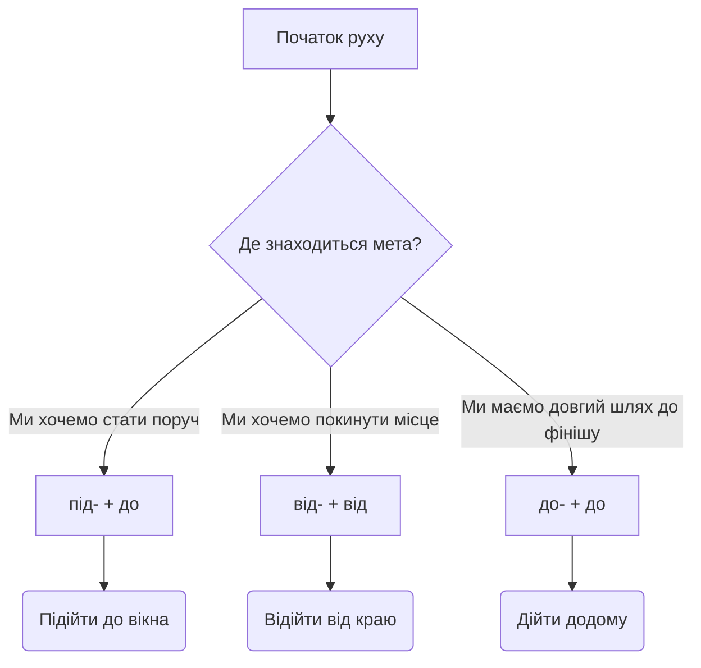

<!-- SCOPE
Covers: Дієслова руху з префіксами під-, від-, до-; просторова логіка наближення, віддалення та досягнення мети; культурні традиції проводів та подорожей; переносне значення просторових дієслів.
Not covered:
  - Базові дієслова руху без префіксів (йти/ходити, їхати/їздити) → b1-18
  - Початок руху та повернення (по-, за-, при-) → b1-19
Related: b1-19, b1-21, b1-22
-->

# Рух: наближення і віддалення

> **Чому це важливо?**
>
> Українська мова надзвичайно точно картографує фізичний простір. Коли ми описуємо рух, ми не просто вказуємо напрямок, ми визначаємо наші відносини з межами об'єктів. Розуміння префіксів **під-**, **від-** та **до-** дозволяє вам будувати в уяві співрозмовника чітку просторову картину: чи ви лише наблизилися до об'єкта, чи ви досягли його межі, чи ви віддалилися від нього. Ця просторова логіка згодом переноситься на абстрактні поняття часу, емоцій та домовленостей.

## Діагностика: Вступний тест

Українські дієслова руху з префіксами часто викликають труднощі, оскільки інші мови можуть використовувати одне універсальне слово для кількох різних ситуацій. Перш ніж ми почнемо глибокий аналіз, давайте перевіримо вашу інтуїцію щодо просторових меж.

### Проблема «підійти» проти «прийти»

Уявіть ситуацію: ви домовилися зустрітися з колегою. Ви пишете повідомлення: «Я підійшов до офісу». Колега чекає на вас біля вашого робочого столу всередині, але вас там немає. Виникає непорозуміння. 

Ця ситуація демонструє класичне семантичне неспівпадіння. Дієслово **підійти** (to approach) означає процес скорочення відстані. Ви знаходитеся поруч із будівлею, можливо, стоїте перед дверима, але ви ще не стали частиною внутрішнього простору. Ваша позиція — це зовнішній периметр. Натомість дієслово **прийти** (to arrive) фіксує успішне завершення маршруту. Коли ви кажете «Я прийшов в офіс», це свідчить про те, що подорож закінчена, і ви перебуваєте на робочому місці.

**Практичний експеримент:**
Прочитайте ці три речення і спробуйте відчути різницю в просторі:
1. Іван підійшов до будинку.
2. Іван дійшов до будинку.
3. Іван прийшов додому.

Чи бачите ви різницю? У першому випадку Іван стоїть поруч із фасадом. У другому — ми підкреслюємо, що його шлях був тривалим, і він нарешті перетнув фінальну межу маршруту. У третьому реченні нас цікавить лише факт його присутності вдома.

> [!observe] **Простір як геометрія**
> Українська граматика вимагає від мовця постійно уявляти геометрію простору. Кожен префікс — це математичний вектор. Якщо ви не бачите цього вектора у своїй уяві, ви оберете неправильне слово. Мислити українською означає постійно малювати невидимі лінії між собою та іншими об'єктами.

### Проблема «дійти» проти «прийти»

Інша часта помилка стосується дієслова **дійти** (to reach on foot). Часто студенти використовують загальне слово **прийти**, коли український мовець обрав би **дійти**. Чому так відбувається?

Дієслово **дійти** має дуже специфічний фокус: воно акцентує увагу на самому процесі подолання шляху аж до певної межі. Це не просто прибуття. Це зусилля, час і перетин фінальної лінії. Коли людина каже «Я ледве дійшов додому», вона має на увазі, що шлях був важким, можливо, через втому або погану погоду. Слово **досягнення** (reaching/achievement) ідеально описує суть префікса **до-**.

Розглянемо контексти використання:
* **Як це працює:** Ми використовуємо **дійти**, коли хочемо підкреслити межу, лінію або кінець маршруту.
* **Приклад з контекстом:** «Ми довго йшли лісом і нарешті дійшли до річки». Тут річка виступає як географічна межа нашої прогулянки.
* **Приклад з контекстом:** «Я дійшов до останньої сторінки книги». Межа тут метафорична, але логіка залишається тією ж.
* **Правило використання:** Якщо ви хочете сказати, що просто з'явилися десь, використовуйте **прийти**. Якщо ви хочете акцентувати на пройденому шляху і досягненні ліміту, використовуйте **дійти**.

### Оцінка ваших відповідей

Якщо ви відчуваєте тонку різницю між тим, щоб стояти біля дверей будівлі, і тим, щоб успішно подолати довгий шлях до неї, ви вже готові до опанування цієї теми. Наступний розділ детально пояснить механізми, які керують цими просторовими векторами.

## Граматика: Простір та межі

Згідно з Державним стандартом української мови (§4.3.8), утворення префіксальних дієслів руху вимагає чіткого розуміння семантики просторових відношень. Кожен префікс працює в парі з певним прийменником. Ця комбінація є обов'язковою і не підлягає змінам.

### Префікс під- та прийменник ДО (Наближення)

Префікс **під-** вказує на вектор, спрямований до об'єкта з метою скорочення відстані. Ключове поняття тут — **наближення** (approach). Це рух, який зупиняється безпосередньо перед об'єктом, не проникаючи в нього.

**Правило формування:**
Дієслово з префіксом **під-** майже завжди вимагає прийменника **до** та іменника у родовому відмінку (Genitive case).

**Аналіз базових форм:**
* **підійти / підходити** (to approach on foot): Рух пішки, який завершується поруч із ціллю.
* **під'їхати / під'їжджати** (to approach by vehicle): Рух на транспорті, паркування або зупинка біля цілі.
* **підбігти / підбігати** (to run up to): Швидке наближення бігом.

**Приклади в контексті:**
1. Журналіст вирішив **підійти до** вікна, щоб краще роздивитися вулицю. (Він зупинився біля скла).
2. Таксі має **під'їхати до** будинку через п'ять хвилин. (Машина зупиниться перед входом).
3. Маленький хлопчик радісно **підбіг до** мами. (Він скоротив відстань і зупинився біля неї).

**Замітка щодо використання:** Ми також маємо зворотне дієслово **наблизитися** (to approach - reflexive). Воно є більш формальним або літературним синонімом до слова **підійти**. Наприклад: «Корабель наблизився до берега» звучить більш урочисто, ніж «Корабель підійшов до берега».

### Префікс від- та прийменник ВІД (Віддалення)

Префікс **від-** позначає протилежний вектор. Це рух від об'єкта, збільшення просторової дистанції. Ключове слово для цього процесу — **віддалення** (moving away). Важливо пам'ятати, що цей рух починається від зовнішньої поверхні об'єкта або від позиції поруч із ним.

**Правило формування:**
Дієслово з префіксом **від-** обов'язково вимагає прийменника **від** та іменника у родовому відмінку (Genitive case). Це створює граматичну талісманічну пару: від- + від.

**Аналіз базових форм:**
* **відійти / відходити** (to move away on foot/depart): Кроки назад або вбік, щоб збільшити дистанцію. Також використовується для позначення відправлення поїздів.
* **від'їхати / від'їжджати** (to drive away): Початок руху транспорту від місця стоянки.
* **відбігти / відбігати** (to run away): Швидке збільшення відстані заради безпеки або в грі.

**Приклади в контексті:**
1. Охоронець попросив натовп **відійти від** краю платформи. (Люди мали збільшити дистанцію для безпеки).
2. Автомобіль повільно **від'їхав від** готелю і зник у тумані. (Машина покинула місце біля входу).
3. Собака злякався гучного звуку і швидко **відбіг від** паркану. (Вектор руху спрямований геть від об'єкта).

**Замітка щодо використання:** Зворотне дієслово **віддалитися** (to move away - reflexive) описує поступовий процес збільшення дистанції, часто у великих масштабах або в переносному значенні. Наприклад: «Човен віддалився від берега на безпечну відстань» (The boat moved away from the shore to a safe distance).

> [!warning] **Типова помилка: від- проти ви-**
> Студенти часто плутають префікси **від-** та **ви-**. Запам'ятайте золоте правило простору:
> ❌ Неправильно: «Він відійшов з кімнати».
> ✅ Правильно: «Він вийшов з кімнати».
> Префікс **ви-** завжди позначає рух зсередини закритого простору (out of). Префікс **від-** позначає рух від відкритої поверхні або точки поруч. Якщо ви стояли поруч зі столом, ви можете **відійти від** нього. Якщо ви були всередині кімнати, ви можете тільки **вийти з** неї.

### Префікс до- (Межа та Досягнення)

Префікс **до-** є найцікавішим, оскільки він поєднує концепцію руху з концепцією результату. Цей префікс означає рух, який триває до певної визначеної межі і там зупиняється. Це ліміт, точка фінішу, остаточне досягнення мети.

**Правило формування:**
Як і префікс під-, префікс **до-** найчастіше працює з прийменником **до** та іменником у родовому відмінку.

**Аналіз базових форм:**
* **дійти / доходити** (to reach on foot): Пройти весь шлях до кінцевої точки.
* **доїхати / доїжджати** (to reach by vehicle): Проїхати весь маршрут до пункту призначення.
* **добігти / добігати** (to reach running): Досягти фінішу під час бігу.

**Приклади в контексті:**
1. Ми йшли цілий день і нарешті змогли **дійти до** сусіднього села. (Підкреслюється успішне досягнення мети).
2. Незважаючи на затори, він встиг **доїхати до** аеропорту вчасно. (Маршрут успішно пройдено до кінця).
3. Спортсмен відчув біль, але вирішив **добігти до** фінішу. (Перетин фінальної лінії).

### Візуалізація просторової логіки

Щоб краще закріпити ці концепції, давайте поглянемо на порівняльну таблицю. Вона показує, як змінюється значення залежно від обраного вектора.

| Вектор руху | Дієслово | Прийменник | Суть дії | Приклад використання |
| :--- | :--- | :--- | :--- | :--- |
| **Наближення** (Скорочення дистанції) | підійти / під'їхати | до | Стати поруч із чимось | Я підійшов до картини, щоб побачити деталі. |
| **Віддалення** (Збільшення дистанції) | відійти / від'їхати | від | Покинути місце біля об'єкта | Вона відійшла від комп'ютера на п'ять хвилин. |
| **Досягнення** (Перетин межі) | дійти / доїхати | до | Успішно завершити маршрут | Вони змогли доїхати до міста до початку дощу. |

Цей алгоритм прийняття рішень дозволяє українцям миттєво обирати правильне слово. Коли ви плануєте речення, спочатку визначте свою просторову мету: ви хочете зменшити відстань, збільшити її, чи зафіксувати досягнення ліміту?

## Культурний контекст: Проводи та традиції

Рух в українській культурі — це не лише фізичний процес, а й глибоко символічний акт. Подорожі, від'їзди та розставання обросли багатьма ритуалами, які відображають шанобливе ставлення до простору і шляху.

### Традиція «Присісти на дорогу»

Однією з найдавніших і найстійкіших українських традицій є звичай **присісти на дорогу** (to sit for the road). Коли валізи вже спаковані, всі речі зібрані, а таксі чекає біля будинку, родина не вибігає одразу за двері. Замість цього хтось із старших каже: «А тепер давайте присядемо на дорогу». 

**Як це працює на практиці:**
Усі присутні в кімнаті сідають — на стільці, дивани, навіть на спаковані сумки — і проводять кілька секунд у цілковитій тиші. Ніхто не розмовляє, не перевіряє телефон і не метушиться. 

**Історичне коріння та сучасне значення:**
У давні часи вважалося, що раптовий від'їзд може розізлити хатнього духа — домовика. Домовик міг подумати, що родина залишає дім назавжди, і почати шкодити або піти за ними. Присівши в тиші, люди ніби «обманювали» духів простору, показуючи, що нічого надзвичайного не відбувається.

Сьогодні цей ритуал втратив своє містичне значення, але набув величезної психологічної цінності. Це пауза для перевірки: чи взяли квитки? чи вимкнули світло? чи не забули паспорти? Більше того, це момент внутрішнього переходу від стану «вдома» до стану «в дорозі». Це усвідомлене прийняття факту наближення великої відстані.

**Приклади в живому спілкуванні:**
* — Ну що, всі готові? Тоді давайте присядемо на дорогу.
* — Я так поспішав на поїзд, що навіть забув присісти на дорогу.

> [!fact] **Мова і ритуал**
> Зверніть увагу, що традиція вимагає саме «присісти» (сісти на короткий час), а не «сісти» (розташуватися надовго). Українська мова через префікс при- підкреслює неповноту або короткочасність дії. Ця граматична точність ідеально відображає суть ритуалу — коротка пауза перед неминучим рухом.

### Проводи на вокзалі

Слово **проводи** (farewells) має особливу вагу. В Україні залізничні вокзали — це сцени для великих емоційних драм. Культура проводів вимагає дотримання певних неписаних правил, які тісно пов'язані з нашими дієсловами руху.

**Ритуал віддалення:**
Коли хтось їде далеко, родина або друзі обов'язково йдуть на перон. Вони допомагають занести речі у вагон, потім виходять і стоять поруч із вікном. Найважливіше правило проводів полягає в тому, що проводжаючі не можуть **відійти від** поїзда доти, поки він не рушить. 

В українській мові ми кажемо: «Поїзд відійшов» (The train departed). Це специфічне використання дієслова «відійти». Воно фіксує момент відриву важкого металевого об'єкта від станції. Люди стоять на пероні, дивляться на вагони, і лише коли останній вагон зникає з поля зору, вони можуть розвернутися і піти додому. Цей процес візуалізує поступове **віддалення** (moving away) близької людини.

**Приклади в контексті:**
1. Наші проводи тривали довго, ми стояли на пероні, аж поки поїзд не відійшов.
2. Велика відстань між містами робить такі зустрічі та проводи особливо емоційними.

> [!culture] **Символізм залізниці**
> В сучасній Україні залізниця (Укрзалізниця) стала символом стабільності та зв'язку між людьми. Тому слова на кшталт «поїзд відходить» або «поїзд доїхав вчасно» набули нового, глибшого змісту — вони означають, що життя триває, і люди продовжують зустрічатися незважаючи ні на що.

## Переносне значення та фразеологія

Просторова логіка української мови настільки потужна, що вона переноситься на абстрактні сфери нашого життя: переговори, поширення інформації, час та історію. Слова, які ми вивчили для опису кроків на вулиці, використовуються для опису складних ментальних процесів.

### Метафора досягнення: «Дійти згоди» та «Дійшли чутки»

Префікс **до-**, як ми з'ясували, позначає перетин межі. В абстрактному світі цією межею може бути вирішення конфлікту або поширення новин.

**Дійти згоди (To reach an agreement):**
Це один з найпоширеніших виразів в українському діловому та повсякденному спілкуванні. Уявіть двох людей з різними думками. Вони ведуть переговори. Їхня розмова — це шлях. Коли вони знаходять спільне рішення, вони перетинають межу нерозуміння. Вони буквально «доходять до» згоди.

* **Як це працює:** Використовується в контексті дискусій, переговорів або суперечок.
* **Приклади в контексті:**
  * Після трьох годин важких переговорів партнери нарешті змогли **дійти згоди**.
  * Ми обговорили всі деталі, але так і не **дійшли згоди** щодо ціни.
* **Замітка щодо використання:** Зверніть увагу, що тут дієслово використовується без прийменника «до». Ми кажемо «дійти згоди» (Genitive without preposition), що робить цей вираз фіксованою фразеологічною одиницею.

**Дійшли чутки (Rumors reached / circulated):**
Інформація також має здатність долати відстань. Коли новина або плітка поширюється від людини до людини і нарешті потрапляє до вас, ми кажемо, що вона «дійшла». 

* **Як це працює:** Підмет у таких реченнях — це сама інформація (чутки, новини, слова).
* **Приклади в контексті:**
  * До мене **дійшли чутки**, що наш відділ планують реорганізувати.
  * Її слова **дійшли** до директора, і він викликав її на розмову.

### Метафора минулого: «Відійти в минуле»

Простір і час в українській мові тісно переплетені. Коли подія завершується, вона не просто зникає; вона рухається геть від нас, подібно до поїзда, що залишає станцію.

**Відійти в минуле (To fade into history / to become obsolete):**
Цей вираз використовується для опису традицій, технологій або звичок, які більше не є актуальними. Ми візуалізуємо минуле як величезний простір, куди речі переміщуються, віддаляючись від нашого сучасного моменту.

* **Як це працює:** Це ідеальна фраза для есе, формальних презентацій або обговорення історичних змін. Вона звучить дуже природно і глибоко.
* **Приклади в контексті:**
  * Використання паперових листів для бізнесу вже давно **відійшло в минуле**.
  * Старі методи управління поступово **відходять в минуле**, поступаючись місцем новим підходам.
* **Замітка щодо використання:** Дієслово узгоджується з підметом (технологія відійшла, методи відходять).

### Офіційний стиль: Наближення та Віддалення

В академічному, науковому та новинному стилях ми часто використовуємо іменники, утворені від наших дієслів руху: **наближення** (approach) та **віддалення** (moving away). Вони дозволяють будувати складніші, абстрактніші речення.

**Таблиця сталих словосполучень офіційного стилю:**

| Словосполучення | Переклад | Контекст використання | Приклад речення |
| :--- | :--- | :--- | :--- |
| **час підійти** | time to approach | Коли настав правильний момент для дії | Настав **час підійти** до вирішення цієї проблеми з іншого боку. |
| **міра наближення** | degree of approach | В аналітиці, математиці або філософії | Ця модель показує високу **міру наближення** до реальних результатів. |
| **поступове віддалення** | gradual moving away | В соціології або психології стосунків | Ми спостерігаємо **поступове віддалення** молоді від традиційних медіа. |
| **ефект віддалення** | distancing effect | У мистецтвознавстві або літературознавстві | Режисер використав **ефект віддалення**, щоб змусити глядача думати. |

> [!quote] **Поезія простору**
> В українській літературі рух часто символізує життєвий шлях. Ліна Костенко писала: «І кожен фініш — це, по суті, старт». Ця цитата чудово ілюструє концепцію дієслова **дійти** (досягнути фінішу), яке одразу перетворюється на новий початок.

**Міні-діалог в офісному середовищі:**
— Олено, до мене **дійшли чутки**, що проект призупинено. Це правда?
— Ні, це не зовсім так. Ми просто не змогли вчасно **дійти згоди** з клієнтом щодо бюджету. Тому зараз спостерігається **поступове віддалення** від початкового графіку. Але настав **час підійти** до цього питання більш стратегічно.

Цей діалог демонструє, як природно просторові метафори вплітаються у формальне бізнес-спілкування.

## Практика: Роль начальника станції

Щоб об'єднати всі вивчені префікси, іменники та концепції, давайте зануримося у професійне середовище, де простір, рух і час контролюються з математичною точністю. Ви — начальник великої залізничної станції. Ваш день складається з координації наближення поїздів, організації їх віддалення та забезпечення того, щоб пасажири могли безпечно дійти до своїх вагонів.

### Звернення начальника станції

Прочитайте цей монолог начальника станції. Зверніть увагу на те, як він використовує цільову лексику для керування простором.

«Увага на пероні! Шановні пасажири, швидкісний поїзд номер сімдесят два повідомляє про своє **наближення**. Він має **під'їхати до** першої колії за три хвилини. Просимо всіх **відійти від** краю платформи за обмежувальну лінію. Безпека — це наше головне завдання.

Тим часом, пасажири, які зараз **підходять** до каси номер три, будь ласка, пришвидшіть свої кроки. Ваш регіональний поїзд **відходить** о п'ятнадцятій нуль нуль. Не забувайте, що велика **відстань** від головного входу до п'ятої колії вимагає часу. Вам потрібно встигнути **дійти до** свого вагона до того, як пролунає фінальний сигнал. 

Ми раді повідомити про нове **досягнення** нашої станції: за минулий місяць усі поїзди змогли **доїхати до** пунктів призначення без жодних затримок. Дякуємо, що подорожуєте з нами. Щасливої дороги, і не забудьте **присісти на дорогу** перед довгою подорожжю!»

### Аналіз монологу та хронологія подорожі

Цей текст містить ідеальну послідовність руху (Approach → Reach → Depart). Давайте розберемо логіку начальника станції:

1. **Організація наближення:** Спочатку він фіксує процес (наближення поїзда) і вказує точний вектор прибуття (під'їхати до колії).
2. **Безпека через віддалення:** Одразу після цього він вимагає від людей збільшити дистанцію для безпеки (відійти від краю платформи).
3. **Контроль межі:** Він нагадує про ліміт часу і простору (дійти до вагона) і підкреслює, що подолати відстань (велику відстань) — це завдання пасажира.
4. **Символічний підсумок:** Він завершує промову згадкою про успішний результат (досягнення) і успішний рух транспорту (доїхати до пунктів призначення).

> [!myth-buster] **Міф про «довгі збори»**
> Існує стереотип, що українці дуже довго збираються в дорогу і постійно запізнюються. Насправді, наша транспортна термінологія і культура (як от строгі проводи) виховують повагу до розкладу. Поїзд, який **відходить**, не чекає на тих, хто не встиг **підійти**. Тому концепт «досягнення пункту призначення» вчасно є ключовим у нашому плануванні.

**Ваше практичне завдання:**
Спробуйте самостійно скласти подібний маршрут для свого типового дня. Опишіть, як ви підходите до зупинки, як автобус під'їжджає, як ви доїжджаєте до офісу і як вам доводиться відійти від комп'ютера під час перерви. Використання цих префіксів у власному контексті закріпить просторову геометрію у вашій пам'яті.

---

# Підсумок

У цьому модулі ми дослідили, як українська мова картографує простір за допомогою префіксів та прийменників. Ми вивчили, що **під-** означає наближення до межі, **до-** фіксує досягнення цієї межі та перетин фінішної лінії, а **від-** символізує віддалення та розрив контакту з поверхнею об'єкта. Ми також побачили, як ці фізичні вектори трансформуються у глибокі метафори згоди, чуток та історичного минулого, і як вони оживають у традиціях проводів та сидіння на дорогу. Просторова логіка — це основа українського мислення.

**Перевірте себе:**
1. Чому речення «Я підійшов додому» може викликати непорозуміння, якщо ви вже хочете відпочити на дивані? Яке дієслово слід використати?
2. Яка різниця між дієсловами «відійти» та «вийти» у контексті кімнати та столу?
3. Що українці роблять перед тим, як остаточно покинути дім для довгої подорожі, і яке психологічне значення має ця дія сьогодні?
4. Коли проводжаючі на вокзалі вважають, що їхня місія завершена, і вони можуть йти додому? Яке дієслово описує стан поїзда в цей момент?
5. Якщо дві компанії вели переговори і нарешті знайшли спільне рішення, яку просторову метафору ми використаємо для опису цього результату?
6. Які прийменники обов'язково використовуються з дієсловами «підбігти» та «відбігти»?

---