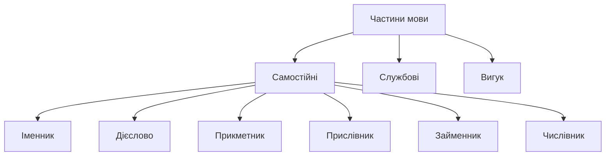
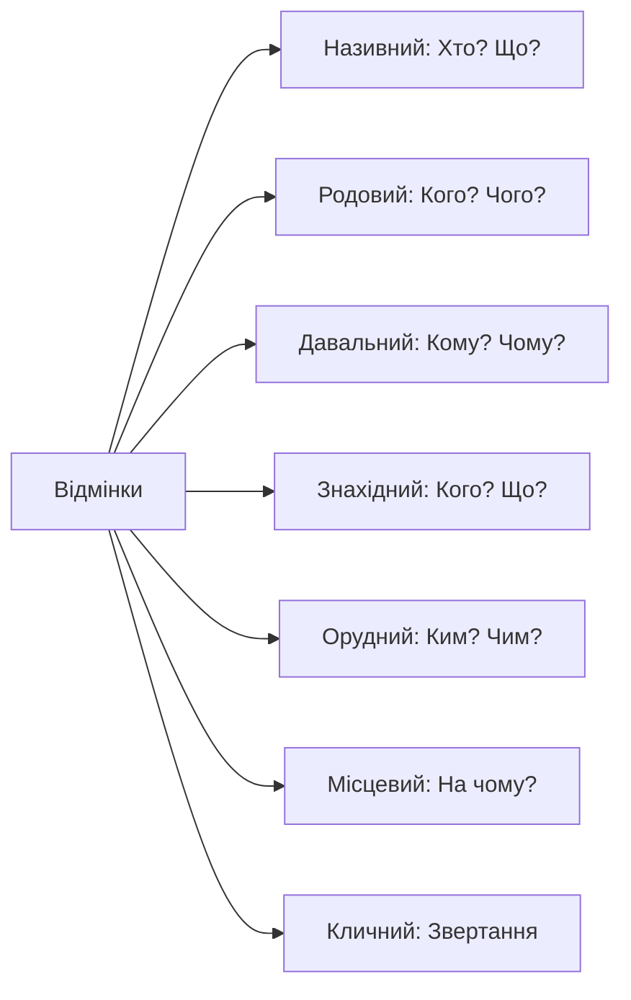

<!-- SCOPE
Covers: Ukrainian grammar terminology — parts of speech, cases, grammatical categories, syntactic roles
Not covered:
  - Verb-specific terminology → 02-language-about-verbs
  - Reading grammar rules → 03-reading-grammar-rules
Related: b1-02, b1-03, b1-05
-->

# Як говорити про граматику

> **Чому це важливо?**
>
> Опанування граматичної термінології — це не просто вивчення назв частин мови, а отримання «ключів від кабінету» українського мовознавства. Це дозволяє вам розуміти пояснення вчителя без перекладу та самостійно читати українські підручники.

Welcome to Level B1! This is a **bridge module**, designed to transition you from learning *about* Ukrainian in English to learning *in* Ukrainian. To do this, we need a shared **metalanguage** (метамова) — the specialized vocabulary used to talk about language itself. In this lesson, we will cover the names of **parts of speech** (частини мови), **grammatical cases** (відмінки), and **sentence structure** (структура речення). Knowing these terms is not just academic; it provides a **psychological advantage** by reducing code-switching and allowing your brain to stay fully immersed in the Ukrainian linguistic logic. 

## Вступ: психологія та логіка української метамови

Вивчення граматики українською мовою — це не лише лінгвістичне завдання, а й стратегічний крок до вашої повної автономності. Коли ви називаєте іменник «іменником», а не "noun", ваш мозок перестає шукати англійські відповідники і починає працювати в системі координат цільової мови.

### Психологічна перевага української термінології

Використання української метамови створює нові нейронні зв'язки, які допомагають уникнути постійного «перемикання кодів» (code-switching). Це зменшує когнітивне навантаження під час уроку. Коли вчитель каже: «Змініть відмінок цього іменника», ви відразу фокусуєтеся на закінченні слова, а не на перекладі самої інструкції. Це дає величезну психологічну перевагу: ви відчуваєте себе не стороннім спостерігачем, а активним учасником мовного середовища.

> [!tip] **Метакогнітивна порада**
> Вивчаючи граматичну термінологію, ви одночасно опановуєте академічний стиль мовлення. Це «вбивство двох зайців одним пострілом»: ви вчитеся і правил, і того, як професійно обговорювати складні теми.

### Традиції та логіка українського мовознавства

Українська граматична традиція має понад 400-літню історію. Фундамент цієї системи заклав Мелетій Смотрицький у 1619 році. Його праця «Грамматіки Славєнскиѧ правильноє Сѵнтаґма» стала основою не лише для української, а й для багатьох інших слов'янських граматик. Логіка українських термінів часто є «прозорою» — назви походять від функцій слів, що робить їх легшими для розуміння, ніж латинізовані англійські аналоги (наприклад, "conjunction" vs «сполучник» — той, що сполучає).

> [!context] **Етимологічна прозорість**
> Порівняйте: англійське "preposition" походить від латинського *praepositio* (поставлений попереду). Українське «прийменник» буквально означає те, що стоїть «при імені» (іменнику). Розуміння кореня слова допомагає зрозуміти його функцію.

## Частини мови: самостійні категорії та їхні ролі

Частини мови (parts of speech) — це великі групи слів, об’єднані спільним значенням та граматичними ознаками. В українській мові ми виділяємо десять частин мови, які поділяються на самостійні, службові та вигуки. Самостійні частини мови можуть виступати членами речення.

### Іменник

Іменник (noun) — це самостійна частина мови, що означає предмет і відповідає на питання «хто?» або «що?». Іменники мають категорію роду, числа та відмінка. Вони можуть позначати назви людей, тварин, речей, явищ природи або абстрактних понять.

- **Визначення**: Слова, що називають істот та предмети.
- **Морфологічне запитання**: Хто? Що?
- _Приклад:_ «**Студент** (хто?) читає **книгу** (що?).»
- _Приклад:_ «**Радість** (що?) — це відчуття щастя.»

> [!observe] **Роль у мовленні**
> Іменник — це фундамент вашого речення. Без нього неможливо назвати суб'єкт дії.

### Дієслово

Дієслово (verb) — це самостійна частина мови, що означає дію або стан предмета і відповідає на питання «що робити?», «що зробити?». Це «мотор» речення, який надає йому динаміки.

- **Визначення**: Слова, що виражають дію або стан.
- **Морфологічне запитання**: Що робити? Що зробити?
- _Приклад:_ «Ми **вивчаємо** граматику щодня.»
- _Приклад:_ «Україна **переможе** у цій війні.»

> [!myth-buster] **Український вид**
> Існує міф, що українські частини мови — це просто копії англійських. Це не так! Наприклад, категорія **виду** (aspect) — доконаний (perfective) та недоконаний (imperfective) — є унікальною рисою слов'янського дієслова, яка не має прямого аналога в системі англійських часів.

### Прикметник

Прикметник (adjective) — це самостійна частина мови, що виражає ознаку предмета і відповідає на питання «який?», «яка?», «яке?», «які?». Він завжди узгоджується з іменником у роді, числі та відмінку.

- **Визначення**: Слова, що описують властивості та якості.
- **Морфологічне запитання**: Який? Чий?
- _Приклад:_ «Це дуже **цікаве** правило.»
- _Приклад:_ «Я бачу **синій** небокрай.»

> [!tip] **Спробуйте самі**
> Опишіть свій настрій сьогодні, використовуючи лише три прикметники. Наприклад: *бадьорий, зосереджений, цікавий*.

### Прислівник

Прислівник (adverb) — це незмінна самостійна частина мови, що виражає ознаку дії, стан або ознаку іншої ознаки. На відміну від інших самостійних частин мови, прислівник не відмінюється і не має закінчення.

- **Визначення**: Слова, що описують обставини дії (як, де, коли).
- **Морфологічне запитання**: Як? Де? Куди? Коли?
- _Приклад:_ «Вона говорить українською дуже **швидко**.»
- _Приклад:_ «Сонце світить **яскравіше**, ніж учора.»

### Займенник

Займенник (pronoun) — це самостійна частина мови, яка вказує на предмети, ознаки або кількість, але не називає їх. Він вживається «замість імені».

- **Визначення**: Слова, що замінюють іменники, прикметники або числівники.
- **Морфологічне запитання**: Хто? Що? Який? Скільки?
- _Приклад:_ «**Він** допоміг **мені** з цим завданням.»
- _Приклад:_ «**Цей** підручник дуже корисний.»

### Числівник

Числівник (numeral) — це самостійна частина мови, що означає число, кількість предметів або їх порядок при лічбі.

- **Визначення**: Слова, що позначають кількість або черговість.
- **Морфологічне запитання**: Скільки? Котрий?
- _Приклад:_ «У нашому класі **десять** студентів.»
- _Приклад:_ «Сьогодні **перше** вересня.»

## Частини мови: службові слова та вигуки

На відміну від самостійних частин мови, службові слова не називають предметів чи дій і не є членами речення. Вони виконують роль «цементу», який скріплює самостійні слова у фрази та речення.

### Сполучник

Сполучник (conjunction) — це службова частина мови, яка вживається для сполучення однорідних членів речення або частин складного речення.

- **Роль**: Сполучати слова та думки.
- _Приклад:_ «Я вивчаю граматику, **бо** хочу розмовляти вільно.»
- _Приклад:_ «Кава **і** чай стоять на столі.»

### Прийменник

Прийменник (preposition) — це службова частина мови, яка разом із відмінковими формами іменників, займенників та числівників виражає відношення між словами у реченні.

- **Роль**: Вказувати на просторові, часові чи причинові зв'язки.
- _Приклад:_ «Книга лежить **на** столі.»
- _Приклад:_ «Ми пішли **до** театру.»

> [!warning] **Прийменник чи Займенник?**
> Студенти часто плутають ці терміни через схожість префіксів. Пам'ятайте про корені: **За-йменник** (замість імені), **При-йменник** (при імені/іменнику). Це проста логіка, яка допоможе вам не помилитися.

### Частка

Частка (particle) — це службова частина мови, яка надає окремим словам чи реченням додаткових смислових або емоційних відтінків.

- **Роль**: Додавати відтінки значення (заперечення, запитання, підсилення).
- _Приклад:_ «Я **не** бачив цього прикладу.»
- _Приклад:_ «**Хіба** ви вже вивчили всі відмінки?»

### Вигук

Вигук (interjection) — це особлива частина мови, що виражає почуття, волевиявлення, не називаючи їх. Вигуки не належать ні до самостійних, ні до службових частин мови.

- **Роль**: Емоційна реакція.
- _Приклад:_ «**Ой**, я забув закінчення!»
- _Приклад:_ «**Ого**, як багато нових слів!»

## Відмінки: сім ключів до системи відмінювання

В українській мові існує сім відмінків (cases). Відмінювання — це зміна закінчень іменників для вираження їхніх граматичних зв'язків з іншими словами. Кожен відмінок відповідає на певне питання і має свою функцію.

### Називний

Називний відмінок (nominative case) — це початкова форма слова. У реченні іменник у називному відмінку зазвичай є підметом (subject).

- **Запитання**: Хто? Що?
- **Основна роль**: Називає суб'єкт дії.
- _Приклад:_ «**Вчитель** пояснює правило.»
- _Приклад:_ «**Київ** — столиця України.»
- **Додаткова інформація**: Це єдиний прямий відмінок, усі інші — непрямі.

### Родовий

Родовий відмінок (genitive case) — один із найчастотніших відмінків, що виражає належність, відсутність або частину цілого.

- **Запитання**: Кого? Чого? (Немає...)
- **Основна роль**: Вказує на походження, власність або заперечення.
- _Приклад:_ «Це книга мого **брата**.»
- _Приклад:_ «У мене немає **часу**.»
- **Додаткова інформація**: Часто вживається після числівників та прийменників *від, до, з, біля*.

### Давальний

Давальний відмінок (dative case) виражає особу чи предмет, на користь яких відбувається дія.

- **Запитання**: Кому? Чому? (Даю...)
- **Основна роль**: Адресат дії.
- _Приклад:_ «Я написав листа **другові**.»
- _Приклад:_ «Дякую **вам** за допомогу.»
- **Додаткова інформація**: Назва походить від дієслова «давати».

### Знахідний

Знахідний відмінок (accusative case) називає об'єкт, на який безпосередньо спрямована дія.

- **Запитання**: Кого? Що? (Бачу... Знаходжу...)
- **Основна роль**: Прямий додаток (object).
- _Приклад:_ «Вона читає **статтю**.»
- _Приклад:_ «Я бачу свою **маму**.»
- **Додаткова інформація**: Назва походить від дієслова «знаходити».

### Орудний

Орудний відмінок (instrumental case) вказує на знаряддя дії (інструмент) або на сумісність (з кимось).

- **Запитання**: Ким? Чим? (Пишу... Пишаюся...)
- **Основна роль**: Інструмент дії або спільність.
- _Приклад:_ «Я пишу **ручкою**.»
- _Приклад:_ «Ми йдемо в кіно з **Олегом**.»
- **Додаткова інформація**: Назва походить від слова «орудувати» (діяти інструментом).

### Місцевий

Місцевий відмінок (locative case) вказує на місце або час дії. Він завжди вживається тільки з прийменниками.

- **Запитання**: На кому? На чому? В кому? В чому?
- **Основна роль**: Локація.
- _Приклад:_ «Ми живемо у **Львові**.»
- _Приклад:_ «На **столі** стоїть ваза.»
- **Додаткова інформація**: Був виокремлений як сьомий відмінок Мелетієм Смотрицьким у 1619 році.

### Кличний

Кличний відмінок (vocative case) використовується для звертання до особи чи предмета. Це унікальна риса української мови, яка відрізняє її від багатьох інших слов'янських мов.

- **Запитання**: (Звертання) О!
- **Основна роль**: Пряме звертання.
- _Приклад:_ «**Україно**, моя рідна земле!»
- _Приклад:_ «**Пане** вчителю, допоможіть мені!»
- **Додаткова інформація**: Не відповідає на питання, бо не має синтаксичного зв'язку з іншими словами.

> [!important] **Мнемонічна формула**
> Для швидкого запам'ятовування порядку відмінків українські школярі використовують таку фразу:
> **Н**а **Р**іздво **Д**ід **З**агубив **Г**орішки **М**іж **К**овбасками.
> - **Н**азивний
> - **Р**одовий
> - **Д**авальний
> - **З**нахідний
> - **О**рудний (або **Г**орішки — застаріле «Городовий» чи просто для ритму)
> - **М**ісцевий
> - **К**личний

## Будова слова, граматичні категорії та синтаксис

Граматика — це не лише частини мови та відмінки. Це ціла система категорій та правил побудови речень. Щоб розуміти інструкції в підручниках, вам потрібно знати «анатомію» мови.

### Морфеміка: Анатомія українського слова

Слово складається з частин, які ми називаємо морфемами. Кожна морфема несе певний зміст.

- **Корінь** (root) — головна частина слова, яка містить загальне значення всіх споріднених слів.
- **Префікс** (prefix) — частина слова, що стоїть перед коренем і змінює його значення.
- **Суфікс** (suffix) — частина слова, що стоїть після кореня і служить для утворення нових слів чи форм.
- **Закінчення** (ending) — змінна частина слова, що служить для зв'язку слів у реченні.
- **Основа** (stem) — частина слова без закінчення.

> [!analysis] **Чому це важливо?**
> Знаючи значення префіксів та суфіксів, ви зможете здогадатися про значення незнайомого слова, не заглядаючи у словник.

### Граматичні категорії: Ваша система координат

Коли ви описуєте слово, ви вказуєте його граматичні ознаки.

- **Рід** (gender): чоловічий, жіночий, середній.
- **Число** (number): однина, множина.
- **Особа** (person): перша (я, ми), друга (ти, ви), третя (він, вона, воно, вони).
- **Час** (tense): минулий, теперішній, майбутній.
- **Вид** (aspect): доконаний, недоконаний.
- **Спосіб** (mood): дійсний, умовний, наказовий.

### Синтаксичні ролі: Хто ким працює в реченні?

Синтаксис вивчає роль слів у реченні. Кожне слово «працює» на певній посаді.

- **Підмет** (subject) — головний член речення, що вказує на суб'єкт. Відповідає на питання *хто? що?*.
- **Присудок** (predicate) — головний член речення, що вказує на дію чи стан підмета. Відповідає на питання *що робить підмет?*.
- **Додаток** (object) — другорядний член речення, на який спрямована дія. Відповідає на питання непрямих відмінків.
- **Означення** (attribute) — другорядний член речення, що вказує на ознаку предмета. Відповідає на питання *який? чий?*.
- **Обставина** (adverbial) — другорядний член речення, що вказує на умови дії (місце, час, спосіб). Відповідає на питання *як? де? коли?*.

> [!warning] **Відмінок vs Відміна**
> Будьте уважні! **Відмінок** (case) — це зміна одного слова. **Відміна** (declension group) — це група іменників, які змінюються за однаковим зразком. Ми кажемо: «Іменник *брат* стоїть у давальному **відмінку**, він належить до другої **відміни**». Це як «стан» та «клас» об’єкта.

## Практика: дешифрування граматичних інструкцій

Тепер, коли ви знаєте терміни, спробуємо зрозуміти, як вони працюють у реальних підручниках. Українські вчителі використовують певні дієслівні ключі для інструкцій.

### Ключові дієслова інструкцій

- **Означає** (means): «Це слово означає ознаку предмета».
- **Вказує на** (indicates): «Прийменник вказує на напрямок руху».
- **Вживається з** (is used with): «Орудний відмінок вживається з прийменником *над*».
- **Змінюється за** (changes by): «Дієслово змінюється за часами та особами».
- **Виконує роль** (plays the role of): «У цьому реченні іменник виконує роль підмета».
- **Належить до** (belongs to): «Слово *школа* належить до першої відміни».

### Культурне заземлення граматики

Граматика — це не лише сухі правила, це музика мови видатних українців.

- **Тарас Шевченко** часто використовував кличний відмінок для натхненних звертань: «Думи мої, думи мої, лихо мені з вами!»
- **Леся Українка** майстерно володіла часом у поезії: «Я буду вічно жити!» (майбутній час як символ безсмертя духу).
- **Іван Франко** створював складні синтаксичні конструкції, де кожен додаток та обставина працювали на створення глибокого соціального контексту: «Книги — морська глибина...»

### Діалоги в класі

**Діалог 1: Про частину мови**
**Вчитель**: Марку, яка це частина мови — «читати»?
**Студент**: Це дієслово.
**Вчитель**: Правильно. На яке питання воно відповідає?
**Студент**: Воно відповідає на питання «що робити?».

**Діалог 2: Про відмінки**
**Студент**: Пані вчителько, я не розумію, який це відмінок у реченні «Я пишу ручкою».
**Вчитель**: Поставте запитання: пишу *чим*?
**Студент**: Пишу *чим*? Ручкою. Це орудний відмінок?
**Вчитель**: Саме так! Це інструмент дії.

**Діалог 3: Про звертання**
**Вчитель**: Як ми звернемося до пана Івана?
**Студент**: Ми кажемо «Пане Іване!».
**Вчитель**: Який відмінок ми використали?
**Студент**: Це кличний відмінок, бо це звертання.

## Підсумок: перевірка метамовної готовності

Ми завершили наш перший крок у світ української граматики. Тепер ви маєте словниковий запас, щоб розуміти, як побудована мова. Пам'ятайте, що граматика — це не перешкода, а ваш найнадійніший інструмент у вивченні мови.

### 10 запитань для самоперевірки

1. Як називається частина мови, що відповідає на питання «хто?» або «що?»?
2. Який відмінок ми використовуємо для звертання?
3. Чим відрізняється прийменник від займенника?
4. Скільки всього відмінків в українській мові?
5. Як називається частина слова, що стоїть перед коренем?
6. Яка головна синтаксична роль іменника в називному відмінку?
7. Що означає дієслово «відмінювати»?
8. Яка частина мови не має закінчення і не змінюється?
9. Як називається відмінок, що вказує на інструмент дії?
10. Чим відрізняється «відмінок» від «відміни»?

> [!context] **Що далі?**
> У наступному модулі (М02) ми зануримося у складний, але захопливий світ дієслівної термінології: навчимося говорити про часи, види та способи більш детально. А в М03 ви спробуєте самостійно прочитати та дешифрувати реальні граматичні правила з українських підручників.

---
