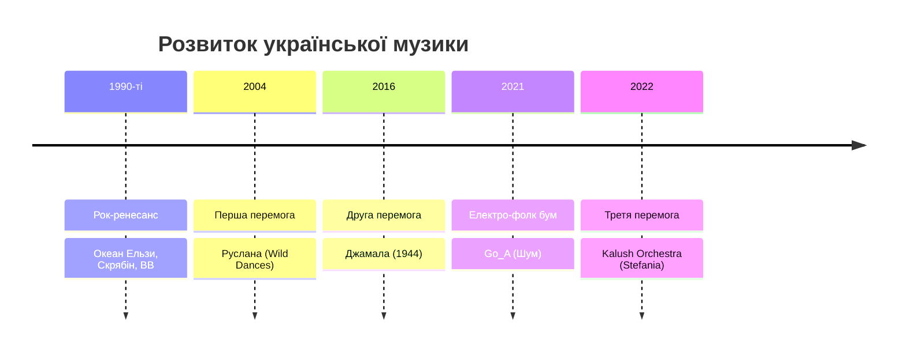

# Українська музика сьогодні

> [!important] **Чому це важливо?**
>
> Музика — це вікно в душу народу. Українська музична сцена пережила справжній ренесанс за останні десятиліття. Від перемог на Євробаченні до електронних експериментів — українські артисти здобули міжнародне визнання. Щоб по-справжньому зрозуміти сучасну Україну, потрібно знати її музику.

## Вступ — Музика як ідентичність

Чи знаєте ви українських музикантів? Якщо ви читаєте новини про Україну, то напевно чули про **Kalush Orchestra**, **Go_A** або **Джамалу**. Але українська музична сцена набагато ширша за Євробачення.

Україна має багату музичну традицію — від народних пісень до сучасного репу. Кожен регіон має свої унікальні музичні традиції: карпатська коломийка, кримськотатарські мелодії, козацькі думи. А сучасні українські артисти поєднують ці традиції з глобальними трендами.

> [!cultural] **У реальному житті**
>
> Українська музика звучить скрізь: у кав'ярнях Києва та Львова, на музичних фестивалях, у маршрутках та торгових центрах. Якщо ви приїдете в Україну, то обов'язково почуєте сучасні українські хіти — і тепер зможете їх зрозуміти та обговорити!

У цьому модулі ви дізнаєтеся про історію української популярної музики, сучасних виконавців та музичні фестивалі. Ви вивчите слова для обговорення музики: **хіт**, **альбом**, **концерт**, **фестиваль**, **виконавець**, **гурт**.

---

## Історія та культура

### Текст 1: Історія української популярної музики

Українська популярна музика почала активно розвиватися в 1990-х роках, після здобуття незалежності. До цього українська музика існувала переважно в народному або радянському форматі.

**1990-ті:** Перші українські рок-гурти здобули популярність. **Океан Ельзи** з Львова став символом нової української музики. Їхній фронтмен **Святослав Вакарчук** написав пісні, які знає кожен українець. Інші важливі гурти того часу — **Скрябін**, **Вопл Відоплясова**, **Тартак**.

**2000-ні:** Україна вперше перемогла на Євробаченні. У 2004 році співачка **Руслана** виграла конкурс з енергійною піснею "Wild Dances", яка поєднувала електронну музику з карпатськими мотивами. Це була перша велика міжнародна перемога української музики.

**2010-ті та 2020-ті:** Нове покоління артистів експериментує з різними жанрами. Електронна музика, реп, інді-рок, неофолк — українська сцена стала надзвичайно різноманітною. Артисти як **Onuka**, **DakhaBrakha**, **Alyona Alyona** отримали міжнародне визнання.

> [!note] **Ви знали?**
>
> Океан Ельзи — найпопулярніший український рок-гурт. Їхній альбом "Модель" (2019) став тричі платиновим. Концерти гурту збирають стадіони по всій Україні. Назва "Океан Ельзи" походить від однойменної картини художника Юрія Сенька.

> [!quote] **Народна мудрість**
>
> В народі кажуть: **«Хто співає, той журбу розганяє»**. Музика в українській культурі завжди була не лише розвагою, а й способом пережити важкі часи та знайти силу.

Багато пісень гурту стали неофіційними гімнами — як колись думи кобзарів підтримували дух козаків.

**Зв'язок з традицією:**

Сучасна українська музика має глибоке коріння. Бандура та кобзарська традиція вплинули на багатьох сучасних виконавців. Тарас Шевченко, який сам був кобзарем у поезії, надихає артистів і сьогодні. Калина, верба, рушник — ці символи з'являються в текстах сучасних пісень, поєднуючи минуле з сучасністю.

**Запитання для розуміння:**

1. Коли почала активно розвиватися українська популярна музика?
2. Хто виграв Євробачення для України вперше?
3. Які музичні жанри популярні серед сучасних українських артистів?

---

### Текст 2: Євробачення та міжнародний успіх

Євробачення стало важливою платформою для української музики. Україна тричі перемагала на цьому конкурсі, і кожна перемога мала особливе значення.

**2004 — Руслана:** Перша перемога. Руслана представила енергійний поп із карпатськими елементами. Її виступ був яскравим шоу з танцями та етнічними костюмами.

**2016 — Джамала:** Друга перемога. Пісня "1944" була присвячена депортації кримських татар. Це був глибокий, емоційний виступ, який торкнувся мільйонів глядачів. Перемога Джамали стала не лише музичною, а й культурною подією.

**2022 — Kalush Orchestra:** Третя перемога. Пісня "Stefania" поєднувала реп із народними мотивами. Гурт виступав під час війни, і їхня перемога стала символом української стійкості. "Stefania" — це пісня про матір, написана лідером гурту Олегом Псюком.

| Рік  | Виконавець       | Пісня       | Особливість                  |
| ---- | ---------------- | ----------- | ---------------------------- |
| 2004 | Руслана          | Wild Dances | Карпатські мотиви + електро  |
| 2016 | Джамала          | 1944        | Присвята депортованим        |
| 2022 | Kalush Orchestra | Stefania    | Реп + фолк, символ стійкості |

Крім перемог, Україна регулярно потрапляє в топ-10 Євробачення. Гурт **Go_A** з їхньою електро-фолк піснею "Шум" (2021) став справжнім хітом у соціальних мережах.

> [!history-bite] **Культурний момент**
>
> Після перемоги Kalush Orchestra на Євробаченні 2022, пісня "Stefania" стала неофіційним гімном української стійкості. Її слухали мільйони людей по всьому світу. Фраза "Я завжди знайду шлях додому" набула нового, глибшого значення для українців.

**Запитання для розуміння:**

1. Скільки разів Україна перемагала на Євробаченні?
2. Про що була пісня "1944" Джамали?
3. Чому перемога Kalush Orchestra мала особливе значення?

---

## Сучасність

### Текст 3: Сучасна українська музична сцена

Сучасна українська музика — це не лише Євробачення. В Україні є активна та різноманітна музична сцена з багатьма жанрами та напрямками.

**Електронна музика та неофолк:** Гурт **Onuka** поєднує електронну музику з народними інструментами. Їхні кліпи — це справжні витвори мистецтва. **DakhaBrakha** експериментує з етнічною музикою, створюючи унікальний "етно-хаос". Вони виступали на найбільших світових фестивалях.

**Реп та хіп-хоп:** Українська реп-сцена активно розвивається. **Alyona Alyona** — одна з найвідоміших реперок. Вона виступала на Coachella та інших міжнародних фестивалях. **Kalush Orchestra**, **Skofka**, **Мехенді** — ці артисти доводять, що український реп має свій унікальний голос.

**Інді та альтернатива:** Гурти як **Один в каное**, **Запорожець**, **Latexfauna** представляють альтернативну сцену. Їхня музика звучить у незалежних клубах Києва та Львова.

**Музичні фестивалі:** До 2022 року в Україні проходили великі музичні фестивалі:

| Фестиваль          | Місто | Жанри      | Особливість                       |
| ------------------ | ----- | ---------- | --------------------------------- |
| Atlas Weekend      | Київ  | Різні      | До 500 тис. відвідувачів          |
| Країна Мрій        | Київ  | Фолк, етно | Заснований Олегом Скрипкою        |
| Leopolis Jazz Fest | Львів | Джаз       | Один з найкращих у Східній Європі |
| Koktebel Jazz      | Одеса | Джаз       | Біля Чорного моря                 |

> [!note] **Цікавий факт**
>
> Українська електронна сцена має світове визнання. DJ та продюсери як **Nastia**, **Koloah**, **Vakula** грають на найбільших клубних подіях Європи. Київ став одним із центрів електронної музики в регіоні.

**Запитання для розуміння:**

1. Які жанри популярні в сучасній українській музиці?
2. Назвіть три українські музичні фестивалі.
3. Хто такі DakhaBrakha і чим вони відомі?

---

## Практика

### Лексика для обговорення музики

Щоб говорити про музику українською, вам потрібні спеціальні слова та вирази. Ось основні категорії:

**Люди в музиці:**

- **виконавець** / **виконавиця** — загальне слово для артиста
- **співак** / **співачка** — той, хто співає
- **музикант** — той, хто грає на інструментах
- **гурт** / **група** — колектив музикантів

**Музичні продукти:**

- **пісня** — окремий музичний твір
- **хіт** — популярна пісня
- **альбом** — збірка пісень
- **кліп** — музичне відео

**Події:**

- **концерт** — виступ музиканта
- **фестиваль** — велика музична подія
- **тур** — серія концертів

**Жанри:**

- **поп** — популярна музика
- **рок** — рок-музика
- **реп** — реп-музика
- **фолк** — народна музика
- **електронна музика** — електроніка
- **джаз** — джазова музика
- **класика** — класична музика

> [!tip] **Колокації**
>
> - слухати **музику** / **пісню** / **альбом**
> - йти на **концерт** / **фестиваль**
> - грати **на гітарі** / **на фортепіано**
> - випускати **альбом** / **пісню** / **кліп**
> - виступати **на сцені** / **на концерті**

### Огляд українських виконавців за жанрами

| Жанр         | Виконавці                     | Характеристика                    |
| ------------ | ----------------------------- | --------------------------------- |
| Рок          | Океан Ельзи, Скрябін, Бумбокс | Енергійний, стадіонний            |
| Електро-фолк | Onuka, Go_A, DakhaBrakha      | Народні інструменти + електроніка |
| Реп          | Alyona Alyona, Kalush, Skofka | Соціальні теми, сучасна мова      |
| Джаз         | Pianoбой, Jazzforacat         | Експериментальний, вишуканий      |
| Інді         | Запорожець, Latexfauna        | Незалежний, атмосферний           |

> [!note] **Куточок геймера**
>
> Музика з відеоігор, розроблених в Україні, теж є частиною української музичної культури. Саундтреки до ігор S.T.A.L.K.E.R. та Metro включають елементи української народної музики та бандури. Гра Kozaks теж використовувала автентичні козацькі мелодії.

### Як говорити про музичні вподобання

**Щоб сказати, що вам подобається:**

- Мені подобається **українська музика**.
- Я люблю слухати **реп** / **рок** / **джаз**.
- Мій улюблений гурт — **Океан Ельзи**.
- Моя улюблена співачка — **Джамала**.

**Щоб запитати інших:**

- Яку музику ти слухаєш?
- Хто твій улюблений виконавець?
- Ти був/була на концерті **Onuka**?
- Чи знаєш ти **DakhaBrakha**?

**Щоб описати музику:**

| Прикметник       | Значення       | Приклад                              |
| ---------------- | -------------- | ------------------------------------ |
| енергійна        | energetic      | Ця пісня дуже енергійна!             |
| мелодійна        | melodic        | Музика Океану Ельзи мелодійна.       |
| глибока          | deep, profound | Пісні Джамали глибокі.               |
| популярний       | popular        | Go_A — популярний гурт.              |
| унікальний       | unique         | DakhaBrakha мають унікальний стиль.  |
| сучасна          | contemporary   | Onuka грає сучасну музику.           |
| традиційна       | traditional    | Кобзарі виконують традиційну музику. |
| експериментальна | experimental   | Їхня музика експериментальна.        |

> [!cultural] **У реальному житті**
>
> Коли ви зустрічаєте українців, тема музики — чудовий спосіб почати розмову. Запитайте: "Що ти зараз слухаєш?" або "Який український гурт ти порадиш?" — і ви отримаєте багато рекомендацій!

---

## Продукція

### Діалог 1: Обговорення улюбленої музики

**Олена:** Привіт! Що ти слухаєш?

**Тарас:** Привіт! Новий альбом Onuka. Ти знаєш цей гурт?

**Олена:** Так, звісно! Мені дуже подобається їхня музика. Вона така унікальна — електроніка з народними інструментами.

**Тарас:** Саме так! А ти на якому концерті була останнім часом?

**Олена:** Я ходила на концерт Океану Ельзи минулого року. Це було неймовірно — стадіон, тисячі людей, всі співають разом.

**Тарас:** О, я теж хочу побачити їх наживо. А який твій улюблений український виконавець?

**Олена:** Мабуть, Джамала. Її голос такий глибокий та емоційний.

**Тарас:** Згоден. А ти слухаєш український реп?

**Олена:** Інколи. Alyona Alyona мені подобається — вона така автентична.

---

### Діалог 2: Планування відвідування концерту

**Марко:** Чув, що Go_A приїжджають з концертом наступного місяця!

**Софія:** Справді? Я обожнюю їхню музику! Особливо пісню "Шум" — вона така енергійна.

**Марко:** Хочеш піти на концерт разом? Можу купити квитки.

**Софія:** Обов'язково! Скільки коштують квитки?

**Марко:** Дивлячись на місце. Біля сцени — дорожче, далі — дешевше.

**Софія:** Я б хотіла ближче до сцени, щоб добре бачити виступ.

**Марко:** Добре, я куплю два квитки. Концерт о дев'ятій, але краще прийти раніше.

**Софія:** Чудово! Це буде мій перший концерт Go_A наживо. Не можу дочекатися!

---

### Діалог 3: Розмова про Євробачення

**Андрій:** Ти дивився Євробачення цього року?

**Оля:** Так! Це було дуже емоційно. Kalush Orchestra виступили чудово.

**Андрій:** Їхня перемога мала особливе значення, правда?

**Оля:** Абсолютно. Пісня "Stefania" стала символом для багатьох українців.

**Андрій:** А яка твоя улюблена українська перемога на Євробаченні?

**Оля:** Важко вибрати. Джамала з "1944" — це було дуже потужно. А ти?

**Андрій:** Мені подобається енергія Руслани. Її виступ у 2004 був справжнім шоу.

**Оля:** Так, кожна перемога була по-своєму особливою.

---

### Діалог 4: Рекомендації музики

**Професор:** Сьогодні ми говоримо про українську культуру. Хто може порадити сучасну українську музику?

**Студент 1:** Я раджу послухати DakhaBrakha. Це етно-хаос — дуже незвичайна музика, яка поєднує різні традиції.

**Студент 2:** А я б порадила Onuka. Їхня електронна музика з народними інструментами — це щось особливе.

**Професор:** Цікаво! А як щодо реп-музики?

**Студент 1:** Alyona Alyona — дуже популярна реперка. Вона співає про реальне життя, соціальні теми.

**Студент 2:** І Kalush Orchestra теж варто послухати. Вони поєднують реп із фольклором.

**Професор:** Дякую за рекомендації! Тепер у мене є плейлист для вихідних.

---

# Підсумок

У цьому модулі ви дізналися про сучасну українську музику:

**Історія:**

- Українська популярна музика активно розвивається з 1990-х років
- Ключові гурти: Океан Ельзи, Скрябін, Вопл Відоплясова
- Україна тричі перемагала на Євробаченні (2004, 2016, 2022)

**Сучасна сцена:**

- Різноманітні жанри: електроніка, неофолк, реп, інді
- Важливі артисти: Onuka, DakhaBrakha, Alyona Alyona, Go_A
- Музичні фестивалі: Atlas Weekend, Країна Мрій, Leopolis Jazz Fest

**Лексика:**

- Слова для обговорення музики (хіт, альбом, концерт, фестиваль)
- Жанри (поп, рок, реп, фолк, електронна музика)
- Вирази для опису вподобань (мені подобається, мій улюблений)

> ✅ **Самоперевірка**
>
> Чи можете ви:
>
> - [ ] Назвати три українських виконавців різних жанрів?
> - [ ] Розповісти про перемоги України на Євробаченні?
> - [ ] Описати свої музичні вподобання українською?
> - [ ] Порадити українську музику іншим?
>
> Якщо так — ви готові до практики!

---

## Потрібно більше практики?

Ви завершили цей модуль! Ось кілька способів закріпити матеріал:

### 🔄 Інтеграція знань

- Поєднуйте матеріал цього модуля з попередніми темами
- Створіть mind map зв'язків між різними темами
- Практикуйте використання кількох тем одночасно

### 🎯 Реальне застосування

- Знайдіть ситуації в житті, де можна використати вивчене
- Читайте українські тексти і шукайте знайомі структури
- Спілкуйтеся з носіями мови, застосовуючи нові знання

### 🌐 Онлайн-ресурси

Додаткові матеріали для практики B1:

- **Українська мова онлайн:** [https://ukrainian-language.uk](https://ukrainian-language.uk)
- **Словник.ua:** [https://slovnyk.ua](https://slovnyk.ua) — для перевірки слів
- **YouTube канали:** Шукайте "українська мова B1" для додаткових уроків
- **Мовні обміни:** italki, Tandem, HelloTalk для практики з носіями

---

> 💡 **Порада:** Найкращий спосіб закріпити матеріал — використовувати його регулярно. Виділіть 10-15 хвилин щодня для повторення!
