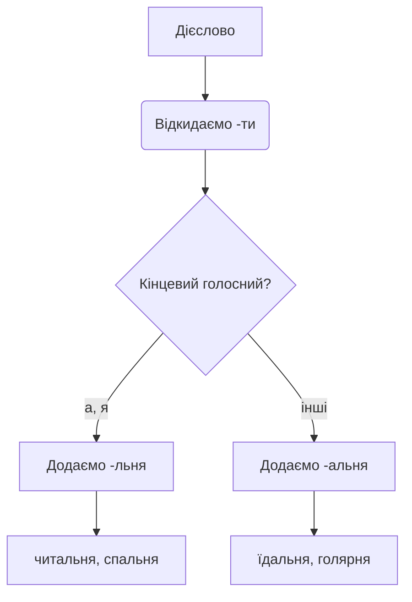
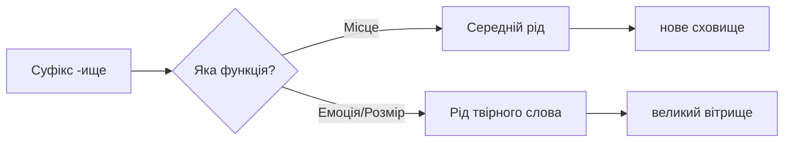
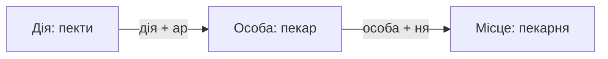

<!-- SCOPE
Covers: Дериваційна морфологія іменників на позначення місця та простору (суфікси -ня, -ище, -арня), семантичний аналіз словотвірних моделей, культурно-історичний контекст українського урбаністичного простору.
Not covered:
  - Суфікси на позначення абстрактних понять → noun-formation-abstract-concepts
Related: noun-formation-abstract-concepts, word-formation-professions
-->

# Словотворення: назви місць та об'єктів

> **Чому це важливо?**
>
> Простір навколо нас не існує окремо від наших дій. Українська мова відображає цей філософський принцип через граматику: ми називаємо місця не випадковими словами, а похідними від процесів, які там відбуваються. Розуміння цієї словотвірної логіки дозволяє самостійно конструювати нові слова, а не лише механічно завчати їх, читати український міський ландшафт як відкриту книгу та відчувати глибокий зв'язок між людиною і територією.

## Вступ: Логіка назв місць в українській мові

### Антропоцентричний підхід до формування простору
Українське словотворення є глибоко антропоцентричним. Це **поняття** (concept) означає, що людина та її діяльність перебувають у самому центрі мовної картини світу. Коли ми розглядаємо, як українці називають фізичні місця, ми одразу помічаємо чітку закономірність: назва простору природно випливає з людської дії, яка там відбувається. Простір не має сенсу без людини; саме людський **процес** (process) наповнює стіни змістом і дає їм ім'я.

Ми не запозичуємо абстрактні корені, щоб назвати кімнату, де ми їмо. Ми беремо дієслово «їсти», додаємо просторовий суфікс і отримуємо «їдальня». Це місце, призначене виключно для того, щоб там їсти. Так само дієслово «лікувати» стає основою для слова «лікарня» — простору, де відбувається процес лікування. Цей **метод** (method) деривації дозволяє мові бути надзвичайно гнучкою. Будь-яка дія може гіпотетично створити свій власний простір у мові, якщо ця дія стає регулярною і потребує спеціальної локації. 

*   **їсти** (дія) → **їдальня** (простір для дії)
*   **читати** (дія) → **читальня** (простір для дії)
*   **ховати** (дія) → **сховище** (простір для дії)
*   **прати** (дія) → **пральня** (простір для дії)

Ця прозора логіка є ключем до швидкого розширення вашого словникового запасу. Якщо ви знаєте дієслово, ви вже наполовину знаєте назву місця. 

[!cultural] Міський простір
Особливо цікаво спостерігати за трансформацією старих заводських приміщень у сучасні мистецькі центри. Ці простори часто зберігають свої історичні назви (наприклад, «прядильня» або «ткальня»), але наповнюються абсолютно новим змістом.

[!tip] Розуміння дієслівної основи
Завжди шукайте дієслово всередині іменника. Якщо ви бачите незнайоме слово на позначення місця, відкиньте суфікс і спробуйте впізнати дію. Наприклад, побачивши слово «купальня», ви легко побачите корінь дієслова «купатися» і зрозумієте, що це місце для купання, навіть не відкриваючи словник.

### Морфологічний зв'язок між агентивами та простором
Інший надзвичайно потужний механізм українського словотворення — це утворення назв простору не безпосередньо від дієслова, а від назви особи (агентива), яка виконує цю дію. Цей семантичний ланцюжок ілюструє, як професія або соціальна роль розширює свій вплив на фізичне середовище. Спочатку дія формує професіонала, а потім професіонал формує свій робочий простір.

Згадаймо суфікси, які утворюють назви професій (наприклад, -ар). Людина, яка пече хліб — це пекар. Простір, де пекар здійснює свою діяльність, природно стає пекарнею. Суфікс професії не зникає; він інтегрується в нову структуру, утворюючи складний суфіксальний комплекс. Це **дослідження** (research) мовних одиниць показує нам нерозривний зв'язок між робітником і його робочим місцем.

Розглянемо цей триступеневий словотвірний синтез:
1.  **Дія:** пекти (хліб)
2.  **Особа:** пекар (той, хто пече)
3.  **Місце:** пекарня (місце, де працює пекар)

Інші приклади цього ланцюжка:
*   **друкувати** → **друкар** → **друкарня** (місце, де друкар створює книги)
*   **лікувати** → **лікар** → **лікарня** (місце, де лікар лікує пацієнтів)
*   **ковувати / кувати** → **коваль** → **ковальня** (місце, де коваль кує метал)

[!observe] Зверніть увагу на наголос
У ланцюжку «лікувати → лікар → лікарня» наголос залишається на тому самому складі або переміщується дуже передбачувано. У слові лі́кар наголос на першому складі, а у слові ліка́рня — на другому. Відчуття ритму цих дериваційних ланцюжків допоможе вам уникати фонетичних помилок.

### Вимоги Державного стандарту та науковий термін
Наш глибокий **аналіз** (analysis) цих словотвірних моделей спирається на чіткі граматичні правила. Відповідно до Державного стандарту з української мови (§4.2.8), утворення іменників на позначення місць за виконуваною дією є обов'язковою компетенцією на рівні B2. Цей рівень вимагає від мовця не лише знання словника, але й здатності до словотвірного синтезу. 

Науковий **термін** (term), який ми визначаємо для цього явища — *дериваційна морфологія просторових іменників*. Цей термін охоплює всі способи, якими мова перетворює семантику дії або особи на семантику локації. Стандарт підкреслює продуктивність цієї моделі: спати – спальня, приймати – приймальня, читати – читальня, лікувати – лікарня.

Ми використовуємо ці слова щодня в різних контекстах:
* «Студенти зібралися у просторій читальні, щоб обговорити новий проєкт».
*   «Головна міська лікарня отримала сучасне медичне обладнання».
*   «Моя улюблена пекарня знаходиться на розі вулиці, там завжди пахне свіжим хлібом».

Застосування цих правил на практиці вимагає чіткого розуміння морфемних швів та уникнення калькування з інших мов. Українська система суфіксів має власну, незалежну логіку, яку ми зараз розглянемо детально.

## Суфікс -ня: Від кімнати до хати-читальні

### Продуктивність суфікса -ня для внутрішніх приміщень
Суфікс **-ня** є найпродуктивнішим формантом в українській мові для творення назв внутрішніх приміщень у житлових будинках та громадських закладах. Його основна семантична функція — маркувати закритий, обмежений стінами простір, який має одне домінуюче, дуже конкретне призначення. На відміну від абстрактних територій, приміщення на -ня — це кімнати, спроєктовані для задоволення базових побутових або соціальних потреб людини.

Якщо ми поглянемо на план типової української квартири або будинку, ми побачимо, що майже кожна кімната називається за цією моделлю. Це значно більше, ніж банальна «кімната для сну» або «кімната для їжі»; це органічні, цілісні слова, які несуть у собі інформацію про свою функцію.

**Таблиця 1. Основні побутові приміщення із суфіксом -ня**

| Іменник (Місце) | Твірне дієслово | Побутова функція та контекст |
| :--- | :--- | :--- |
| **Спальня** | спати | Кімната, призначена виключно для сну та відпочинку. |
| **Їдальня** | їсти | Кімната в домі або заклад громадського харчування, де споживають їжу. |
| **Вітальня** | вітати | Головна кімната для прийому гостей та сімейного спілкування. |
| **Вбиральня** | вбиратися | Туалетна кімната; раніше також місце, де одягалися (вбиралися) у святковий одяг. |
| **Пральня** | прати | Окреме приміщення або комерційний заклад для прання одягу. |
| **Прасувальня** | прасувати | Кімната, спеціально обладнана для прасування білизни. |

[!warning] Уникайте русизмів у побутовій лексиці
Українська мова має ідеальні, точні слова для всіх кімнат. Ніколи не використовуйте кальки на зразок «столова» (правильно: **їдальня**), «уборна» (правильно: **вбиральня**), «гостіная» (правильно: **вітальня**). Використання питомої української лексики робить вашу мову природною та елегантною.

Ці слова активно функціонують у живому мовленні:
*   «Дизайнер запропонував об'єднати кухню та їдальню в один великий простір».
*   «Світла вітальня з великими вікнами стала улюбленим місцем для вечірніх розмов родини».
*   «У цьому старому будинку є окрема пральня в підвальному приміщенні».

> 💡 **Чи знали ви?**
> 
> У традиційній українській хаті простір ділився не стінами, а функціональними зонами. Поява окремих кімнат із назвами на -ня (спальня, вітальня) — це порівняно пізній урбаністичний процес, який відображає європеїзацію українського побуту наприкінці ХІХ століття.

Додатковим важливим аспектом функціонування суфікса -ня є його здатність адаптуватися до сучасних технологічних та соціальних змін. Якщо в минулому ми мали справу переважно з традиційними ремеслами та базовими побутовими процесами (наприклад, кузня, гуральня, чинбарня), то сьогодні ця дериваційна модель активно обслуговує новітні сфери нашого життя. Сучасні українці легко створюють нові слова за цією перевіреною століттями схемою. 

Розглянемо сферу інформаційних технологій та сучасного бізнесу. Коли виникає потреба назвати приміщення, де працюють сервери або де відбувається тестування програмного забезпечення, мова інтуїтивно тяжіє до використання знайомого форманта. Хоча слова на кшталт «серверна» формально є субстантивованими прикметниками, їхня семантична поведінка в мові дуже нагадує класичні іменники на -ня. Вони так само локалізують певну функцію в чітко обмеженому просторі.

> 🌍 **У реальному житті**
> 
> Зайшовши до сучасного українського коворкінгу, ви обов'язково побачите таблички на дверях, які продовжують цю давню словотвірну традицію: «переговорна» (кімната для переговорів) або «відпочивальня» (кімната для відпочинку персоналу). Це доводить, що українська мова живе і розвивається, а не залишається музейним експонатом.

Цікаво також спостерігати, як слова на -ня поводяться в літературному контексті. Українські письменники часто використовують цей суфікс для створення авторських неологізмів (оказіоналізмів), щоб надати тексту особливого колориту. Вони можуть утворити назву простору від будь-якого дієслова, яке характеризує внутрішній стан їхніх персонажів. Наприклад, простір для смутку може перетворитися на метафоричну «журильню», а місце для мрій — на «мрійню». Хоча такі слова рідко потрапляють до академічних словників, вони чудово демонструють гнучкість і потенціал цієї моделі, дозволяючи носіям мови грати зі смислами та формами.

### Граматична пастка: розрізнення -льня та -альня
Хоча ми говоримо про загальний суфікс -ня, на практиці студенти часто стикаються з проблемою вибору правильного голосного перед ним. Чому ми пишемо «читальня», але «вбиральня»? Чому «спальня», але «їдальня»? Ця орфографічна і морфологічна дилема вирішується дуже просто, якщо ми подивимося на інфінітив твірного дієслова. Голосний звук перед суфіксом -ня безпосередньо залежить від характеру дієслівної основи.

**Правило 1: Суфікс -льня (без додаткового -а-)**
Використовується, коли основа інфінітива закінчується на голосний **-а-** або **-я-**. Ми просто додаємо -льня до основи.
*   чита-ти → чита- + -льня = **читальня**
*   спа-ти → спа- + -льня = **спальня**
*   пра-ти → пра- + -льня = **пральня**

**Правило 2: Суфікс -альня (з додатковим -а-)**
Використовується, коли основа дієслова закінчується на приголосний, або на інші голосні (наприклад, -и-). Суфікс бере на себе роль сполучного елемента.
*   їс-ти → їс- + -альня = **їдальня** (відбувається чергування с/д)
*   вбира-ти → вбира- + -льня = **вбиральня** (основа на -а)
*   голи-ти → гол- + -альня = **голярня** (основа на -и відпадає)
*   кузни-ти → кузн- + -я = **кузня** (особливий випадок від іменника коваль)

Розуміння цього фонетичного процесу допомагає писати слова без помилок. Наприклад, ми часто чуємо неправильне творення «читаальня». Але якщо ми знаємо, що основа «чита-» вже має «а», ми ніколи не додамо ще одну.

*   «Сучасна **читальня** в університетській бібліотеці працює цілодобово».
*   «Після довгої подорожі я хотів лише знайти найближчу **їдальню**».

### Культурний концепт: феномен «хати-читальні»
Суфікс -ня не лише описує архітектуру, він фіксує важливі культурні феномени. Одним із найяскравіших прикладів є **читальня** (reading room). Наприкінці ХІХ — на початку ХХ століття це слово набуло величезного суспільного значення завдяки українському культурно-просвітницькому товариству «Просвіта». 

Діячі цього руху почали масово створювати по всій Україні так звані «хати-читальні». Це були набагато масштабнішими явищами, ніж звичайні сільські бібліотеки. Хата-читальня була справжнім осередком громадянського суспільства, місцем ліквідації неписьменності, простором для аматорського театру, хору та лекцій. В умовах бездержавності та постійних імперських заборон на українську мову (як-от Валуєвський циркуляр чи Емський указ), ці читальні стали фортецями національного відродження. Люди збиралися там задля обговорення майбутнього нації, вивчення власної історії та консолідації, а читання книг було лише базовим етапом, вивчати власну історію та консолідуватися.

[!fact] Хата-читальня як інструмент опору
Товариство «Просвіта» змогло створити тисячі хат-читалень у селах і містечках Галичини, Буковини, а згодом і Наддніпрянщини. Вони діяли завдяки самоорганізації: селяни самі збирали кошти, будували приміщення та купували книги. Це унікальний приклад низової культурної ініціативи, яка дієво протистояла спробам імперської асиміляції.

Слово «читальня» досі несе в собі цей шляхетний, просвітницький відтінок. Сьогодні воно вживається рідше в повсякденному мовленні, але активно функціонує в академічному середовищі. Ми говоримо про «зали-читальні» у великих національних бібліотеках або університетах.

*   «Історик розповів, як перша хата-читальня в їхньому селі змінила життя кількох поколінь».
*   «У новій будівлі архіву передбачена простора наукова читальня для дослідників».

[!visual] Хата-читальня
Уявіть собі сільську хату-читальню сто років тому: проста дерев'яна будівля, великий стіл посередині, гасова лампа і полиці, щільно заставлені книгами, які дбайливо збирала громада.

### Семантичний аналіз: просторове обмеження суфікса
Чому ми використовуємо -ня саме для кімнат і не використовуємо його для лісів, полів чи гір? Семантичний аналіз показує, що суфікс -ня концептуально обмежує простір. Він створює семантику замкненості, фокусу, концентрації. Приміщення на -ня ізолюють людину від зовнішнього світу, щоб вона могла зосередитися на одній специфічній дії: сні, їжі, пранні, купанні.

Ця закритість не обов'язково означає малий фізичний розмір. Лікарня може бути величезним багатоповерховим комплексом. Друкарня може займати цілий промисловий квартал. Але концептуально, мовно — це все одно закриті екосистеми, присвячені одному домінуючому процесу. Вони мають межі, двері, стіни. На відміну від відкритих просторів, які розчиняються в ландшафті, об'єкти на -ня є чітко окресленими точками на людській мапі.

*   «Спортивна купальня була заповнена водою з термальних джерел».
*   «Стара ковальня на околиці села зберегла свій автентичний вигляд з позаминулого століття».
*   «Величезна ткальня фабрики зупинила свою роботу через відсутність електроенергії».

Цей концепт закритості допомагає нам відчути різницю між просторами, які формують міське середовище, і просторами, які належать до природного ландшафту. Для відкритих, масштабних територій українська мова має зовсім інший, потужний інструмент, який ми дослідимо в наступному розділі.

## Суфікс -ище: Ландшафт, простір та питання роду

### Семантична специфіка відкритих масштабних територій
Якщо суфікс -ня створює стіни та дахи, то суфікс **-ище** руйнує їх, відкриваючи горизонти. Цей суфікс має потужну семантику відкритості, безмежності, грандіозності та природності. Він використовується для позначення великих площ землі, ландшафтних утворень, місць масового скупчення або зберігання. Це слова, які описують географію, топологію, екологію та масштабну індустріальну інфраструктуру.

На відміну від затишної домашньої спальні, простори на -ище часто викликають почуття поваги, трепету або усвідомлення великих масштабів простору. Вони формуються від дієслів або іменників, розширюючи їхнє значення до розмірів значної території.

Розглянемо найпоширеніші категорії слів із цим суфіксом:

1.  **Місця сільськогосподарської діяльності:**
    *   **Пасовище** (від пасти) — велика ділянка землі, де пасуть худобу.
    *   **Стернище** (від стерня) — поле після збору врожаю зернових.

2.  **Місця геологічної або індустріальної концентрації:**
    *   **Родовище** (від родити / рід) — місце скупчення корисних копалин (наприклад, родовище нафти, газове родовище).
    *   **Звалище** (від звалювати) — територія для накопичення сміття або відходів.

3.  **Місця, пов'язані з пам'яттю та історією:**
    *   **Кладовище** (від класти / ховати) — місце поховання, цвинтар. (Зверніть увагу: кладовище є стилістично нейтральним словом, синонімом до цвинтар).
    *   **Городище** (від город) — залишки стародавнього укріпленого поселення. 

*   «Археологи розпочали масштабні розкопки на території давньослов'янського городища».
*   «Шебелинське газоконденсатне родовище залишається одним із найбільших в Україні».
*   «Міська влада прийняла рішення рекультивувати старе сміттєзвалище на околиці міста».
*   «Старе сільське кладовище поросло густою травою та польовими квітами».

[!visual] Масштаб родовища
Уявіть собі величезне кар'єрне родовище: гігантські екскаватори здаються маленькими комахами на фоні глибоких терас, що спускаються на сотні метрів під землю, відкриваючи шари різних геологічних епох.

[!culture] Топоніміка та історія
Суфікс -ище часто зустрічається на географічних картах України. Багато сіл і містечок отримали свої назви від давніх місць поселення або битв, наприклад, Білогородка (поруч із літописним городищем Білгород), Гуляйполе (хоча тут інший суфікс, але концепт відкритого простору схожий). Слово «городище» саме по собі стало ключовим для розуміння давньої української історії, позначаючи місця, де колись вирувало життя могутніх племен.

> 🇺🇦 **Культурний момент**
> 
> Суфікс -ище часто фіксує в мові місця, які вже втратили свою первісну функцію, але залишили слід в історії. Наприклад, «замчище» — це місце, де колись стояв замок, хоча зараз там можуть бути лише руїни або порожній пагорб. Мова працює як археолог, зберігаючи пам'ять про те, що зникло.

Варто також звернути увагу на екологічний вимір суфікса -ище. У сучасному дискурсі, присвяченому захисту довкілля та змінам клімату, ці слова набувають особливої ваги. Коли українські екологи говорять про наслідки індустріалізації, вони оперують масштабними категоріями: «сховище радіоактивних відходів», «урбанізоване середовище», «торфовище». Ці терміни допомагають осягнути реальні розміри втручання людини у природу. 

Окрім того, суфікс -ище має цікаву властивість нейтралізувати гендерні або професійні ознаки, зосереджуючи всю увагу виключно на фізичному об'єкті. Якщо ми говоримо про «торговище» (місце масової торгівлі, ринок у давнину), нам абсолютно неважливо, хто саме там торгує — чоловіки чи жінки, купці чи селяни. Важливим є лише розмах самого процесу обміну товарами, який охоплює величезну площу і залучає сотні людей одночасно. Ця просторова домінанта робить слова на -ище незамінними інструментами для написання історичних хронік, епічних романів або масштабних урбаністичних досліджень. Вони надають тексту монументальності та панорамного звучання, дозволяючи читачеві ніби піднятися над землею і поглянути на територію з висоти пташиного польоту.

### Критична граматична помилка: рід місць та аугментативів
Тут ми підходимо до однієї з найскладніших проблем для студентів рівня B2. Суфікс -ище має в українській мові функцію-двійника. Крім позначення місця, він також створює збільшувальні, експресивні форми слів — аугментативи. І тут виникає небезпечна граматична пастка, пов'язана з визначенням роду. Студенти часто роблять помилки в узгодженні прикметників і дієслів із цими словами. 

Щоб ніколи не помилятися, запам'ятайте золоте правило поділу:

**Група А: Місця та простори (Завжди середній рід)**
Усі слова на -ище, які позначають територію, місце, локацію або інфраструктурний об'єкт, автоматично стають іменниками середнього роду (воно). Вони відмінюються як звичайні слова середнього роду другої відміни (як море, поле).
*   велике **пасовище** (воно)
*   надійне **сховище** (воно)
*   старе **кладовище** (воно)
*   багате **родовище** (воно)

*   «Надійне **сховище** (воно) врятувало життя багатьом людям під час тривоги».
*   «Нове **родовище** (воно) вугілля знайшли на глибині понад тисячу метрів».

**Група Б: Збільшувальні слова / Аугментативи (Зберігають рід твірного слова)**
Коли суфікс -ище додається до звичайного предмета, щоб показати його гігантський розмір або висловити емоцію (часто негативну), нове слово зберігає рід оригінального слова. Воно НЕ стає середнім родом граматично, хоча й має таке ж закінчення.
*   вітер (він) → **вітрище** (він, сильний вітер). Українці зазвичай формулюють це так: «подув сильний вітрище», а не «сильне вітрище».
*   голос (він) → **голосище** (він, гучний голос). Стилістично правильно буде сказати: «у співака був потужний голосище».
*   баба (вона) → **бабище** (вона, велика, неприємна жінка). Правильна побудова речення виглядає так: «зла бабище кричала», а не «зле бабище кричало».
*   рука (вона) → **ручище** (вона, величезна рука). «Його міцна ручище схопила кермо».

**Порівняльна таблиця граматичного роду**

| Слово на -ище | Функція суфікса | Твірне слово та його рід | Рід нового слова на -ище | Приклад узгодження |
| :--- | :--- | :--- | :--- | :--- |
| **Сховище** | Місце, локація | ховати (дієслово) | Середній (воно) | підземн**е** сховище |
| **Горище** | Місце, локація | гора (іменник) | Середній (воно) | порожнь**є** горище |
| **Вітрище** | Збільшення (емоція) | вітер (він) | Чоловічий (він) | страшн**ий** вітрище |
| **Дощище** | Збільшення (емоція) | дощ (він) | Чоловічий (він) | холодн**ий** дощище |
| **Сніжище** | Збільшення (емоція) | сніг (він) | Чоловічий (він) | рясн**ий** сніжище |

[!warning] Узгодження прикметників
Запам'ятайте, що прикметник завжди виявляє справжній рід слова. Якщо ви скажете «велике вітрище», носій мови одразу відчує дисонанс, бо для нього вітер завжди залишається хлопцем (чоловічим родом), хоч би яким великим він не став. Кажіть: «великий вітрище».

### Офіційно-діловий та науковий регістри
Слова на -ище часто належать до високих стилів мовлення. У науковому та офіційно-діловому регістрах ці терміни незамінні, коли потрібно надати тексту точності, об'єктивності та масштабного бачення. У документації, законах, екологічних звітах та архітектурних планах ці слова функціонують як стандартизовані маркери простору.

Науковий стиль вимагає уникати емоційних описів, віддаючи перевагу чіткій категоризації. Тому ми говоримо не «місце, де живуть люди», а **житлище**; не «місце для захисту», а **сховище** (наприклад, бомбосховище, укриття).

**Діалог в контексті містобудування:**
— Пане архітекторе, де ви плануєте розмістити нове підземне **сховище** для автомобілів?
— Ми розглядаємо територію колишнього промислового **звалища**. Це дозволить нам оптимізувати простір і ревіталізувати занедбану зону.
— А як щодо старого **городища** на пагорбі? Його межі не постраждають?
— Ні, ми зберігаємо охоронну зону навколо історичного **городища** відповідно до норм законодавства.

Ці терміни додають мові солідності та професіоналізму. Коли ви пишете академічний текст або готуєте презентацію про екологію, використання слів на кшталт «урбанізоване середовище», «промислове родовище», «стихійне звалище» продемонструє ваш високий рівень володіння спеціалізованою лексикою.

## Суфікс -арня: Майстерні та культура кавування

### Морфологічний ланцюжок від професій
Суфікс **-арня** (та його фонетичний варіант **-ярня**) є одним із найкрасивіших та найколоритніших словотворчих елементів в українській мові. Він поєднує в собі два концепти: людину-творця (суфікс професії -ар/-яр) та її робочий простір (суфікс -ня). Таким чином, слова на -арня — це завжди місця активного творення, ремісництва, фахової майстерності та мистецтва. Вони пахнуть свіжим хлібом, фарбою, кавою або стружкою дерева.

Цей морфологічний ланцюжок ідеально ілюструє системність української мови. Щоб назвати заклад, ми беремо агентив і розширюємо його до локації.

*   **пекти** → **пекар** (особа) → **пекарня** (місце)
*   **друкувати** → **друкар** (особа) → **друкарня** (місце)
*   **перука** → **перукар** (особа) → **перукарня** (місце)
*   **мило** → **миловар** (особа) → **миловарня** (місце)
*   **сир** → **сировар** (особа) → **сироварня** (місце)
*   **смола** → **смоляр** (особа) → **смолярня** (місце)
*   **лікувати** → **лікар** (особа) → **лікарня** (місце, хоча тут історично злиття -ар і -ня)

Ці заклади — справжні інституції, що виходять за межі суто фізичного виміру. Це інституції, малі підприємства, центри міського та сільського ремісничого життя. Вони відображають структуру традиційної економіки та зберігають свою актуальність у сучасному світі крафтового виробництва.

*   «У маленькій крафтовій **сироварні** в Карпатах ми скуштували найкращий гуцульський сир».
*   «Місцева **друкарня** отримала велике замовлення на видання підручників з історії України».
*   «Щоранку я проходжу повз цю **пекарню**, і аромат свіжих круасанів змушує мене зайти всередину».

**Діалог ремісників:**
— Ви чули, що стара друкарня на площі шукає нових майстрів?
— Так, вони модернізують обладнання. Там працюватиме найкращий друкар у місті!

[!history-bite] Цехова культура
Українські міста з Магдебурзьким правом мали розвинену систему ремісничих цехів. Майстерні (зокрема зброярні, бондарні, золотарні) функціонували й як місця роботи, й як важливі соціальні інституції, що формували міський статут і традиції.

[!myth-buster] Парикмахерская чи перукарня?
Російська мова використовує громіздке запозичення з німецької «парикмахерская» (від Perückenmacher). Українська мова, натомість, пішла власним логічним шляхом словотворення. Від запозиченого слова «перука» (фр. perruque) ми утворили питому назву професії «перукар», а від неї — ідеально структуроване слово «перукарня». Це яскравий приклад того, як мова адаптує іноземні корені під власні граматичні закони, створюючи органічні форми.

> 💡 **Чи знали ви?**
> 
> Багато старовинних українських прізвищ походять саме від назв цих майстерень або професій, пов'язаних із ними. Прізвища Гончар, Скляр, Бондар, Котляр безпосередньо вказують на те, чим займалися предки цих людей у своїх родинних гончарнях, склярнях, бондарнях та котлярнях.

Окрім традиційних ремесел, суфікс -арня активно обслуговував і високотехнологічні процеси свого часу. Згадаймо такі слова, як «людвісарня» (місце, де відливали дзвони та гармати) або «папірня» (підприємство з виготовлення паперу). Ці об'єкти були справжніми центрами інновацій в Україні XVI–XVIII століть. Наявність власної папірні або друкарні свідчила про високий рівень культурного та економічного розвитку регіону, адже це дозволяло тиражувати книги, поширювати знання та вести незалежну інтелектуальну діяльність.

Сьогодні ми спостерігаємо своєрідний ренесанс цієї моделі в контексті малого бізнесу. Українські підприємці, прагнучи підкреслити крафтовість, екологічність та автентичність свого продукту, свідомо відмовляються від англіцизмів і повертаються до питомих форм. Замість безликого «production» з'являються «сироварні», «броварні» (місця, де варять пиво), «миловарні». Таке мовне рішення є потужним маркетинговим інструментом. Воно створює емоційний зв'язок зі споживачем, викликає довіру і транслює ідею про те, що продукт виготовлений руками реальних майстрів з повагою до традицій, а не зійшов з бездушного фабричного конвеєра.

### Історія слова «кав'ярня» як урбаністичного символу
Жодне слово з цього ряду не має такої потужної культурної аури, як **кав'ярня** (coffee house). Це простір, що виконує набагато складнішу функцію, ніж банальне споживання напоїв. Це питома українська назва, яка маркує український простір як глибоко європейський, урбаністичний та інтелектуальний. Це слово має величезне деколонізаційне значення, оскільки воно протистоїть стандартизованому, індустріалізованому радянському слову «кафе».

Історія цього концепту нерозривно пов'язана з українським героєм Юрієм Кульчицьким. Виходець із Самбірщини, він став ключовою фігурою під час облоги Відня у 1683 році. Після перемоги над османською армією, Кульчицький отримав у нагороду мішки з кавовими зернами, які австрійці вважали кормом для верблюдів. Він використав ці зерна, щоб відкрити одну з перших кав'ярень у Відні — «Під синьою пляшкою». Він адаптував гіркий турецький напій до європейських смаків, додавши до нього молоко та мед, і фактично започаткував європейську культуру кавування.

Слово **кав'ярня** походить від слова *кава* та суфікса *-ярня*, утворюючи місце, присвячене культурі цього напою. Історично воно стало невід'ємною частиною ідентичності Львова, а згодом поширилося на всю Україну. У ХІХ та ХХ століттях львівські, київські, станіславівські кав'ярні були центрами богемного життя. Там збиралися письменники, політики, художники. Там читали свіжі газети, сперечалися про мистецтво і планували революції.

*   «Затишна львівська **кав'ярня** стала місцем нашої першої зустрічі».
*   «Франко любив працювати за столиком у кутку цієї старої **кав'ярні**, попиваючи чорну каву».
*   «Сьогодні кожна сучасна **кав'ярня** в Києві пропонує альтернативні методи заварювання».

Називаючи заклад «кав'ярнею», власники підкреслюють автентичність, традицію та високий рівень культури обслуговування. Це слово автоматично підвищує статус простору, на відміну від швидкого та безликого «кафе».

[!visual] Інтер'єр кав'ярні
Уявіть собі класичну львівську кав'ярню: темне дерево, старовинні дзеркала, запах свіжообсмажених зерен і неодмінний звук кавомашини, що працює без зупину.

[!quote] Атмосфера кав'ярні
Як писав відомий український письменник Юрій Андрухович про атмосферу галицьких міст: кав'ярня — це екстериторіальна зона свободи, що вивищується над статусом звичайного закладу харчування, де час вимірюється не годинами, а кількістю випитих філіжанок еспресо та глибиною проведених розмов.

### Книгарня-кав'ярня: сучасні гібридні формати
Мова розвивається разом із міським простором. У ХХІ столітті ми спостерігаємо цікавий процес злиття різних функціональних зон, що призводить до появи гібридних словотвірних форм. Найяскравіший приклад — це **книгарня-кав'ярня** (bookstore-cafe). 

Цей формат ідеально об'єднує дві історичні традиції, про які ми вже говорили: шляхетність просвітницької хати-читальні та європейський шарм інтелектуальної кав'ярні. Сьогодні це найпопулярніший формат міського дозвілля для молоді та креативного класу в Україні. Це місце, де можна купити книгу (книгарня) й одразу ж почати її читати за філіжанкою якісної кави (кав'ярня).

Ми створюємо такі складні іменники, поєднуючи два повноцінні слова через дефіс. Обидві частини є рівноправними і відмінюються разом.

**Відмінювання складного слова (називний, родовий, знахідний, місцевий відмінки):**
*   Н.в.: книгарня-кав'ярня
*   Р.в.: немає книгарні-кав'ярні
*   З.в.: бачу книгарню-кав'ярню
*   М.в.: сиджу у книгарні-кав'ярні

**Діалог сучасного міста:**
— Де ми зустрінемося після пар? Може, підемо до парку?
— На вулиці йде сильний дощище. Давай краще сховаємося у тій новій **книгарні-кав'ярні** на площі Ринок. Я якраз хотів переглянути останні літературні новинки.
— Чудова ідея. Я чув, там роблять фантастичне капучино, а ще є затишна читальня на другому поверсі.

Ці слова-гібриди свідчать про те, що українська дериваційна система є надзвичайно живою. Вона здатна швидко й елегантно обслуговувати найсучасніші урбаністичні тренди, залишаючись при цьому вірною своїм внутрішнім правилам.

## Практичний практикум та корекція

### Аналіз та запобігання гіпергенералізації
Мова — це не математика. Незважаючи на чіткі правила, існують межі їх застосування. Одна з найпоширеніших проблем серед студентів рівня B2 — це явище гіпергенералізації. Це ситуація, коли студент вивчає продуктивне правило (наприклад, «дієслово + ня = місце») і починає застосовувати його до абсолютно всіх слів, створюючи неіснуючі форми.

Чому ми не можемо механічно додавати суфікс до будь-чого? Тому що мовна традиція, історія та милозвучність мають право вето. 

Розглянемо класичний приклад помилки: студент хоче сказати «місце, де люди працюють або роблять речі». Він бере дієслово «робити», додає суфікс і отримує слово «робільня». Але такого слова в українській мові не існує! Українці відчувають це слово як штучне та кострубате. Натомість мова виробила прекрасне, точне слово **майстерня** (workshop). Воно походить від слова «майстер», підкреслюючи, що робота — це фаховий процес, який вимагає майстерності, відкидаючи ідею суто механічної дії (майстерності).

Інший приклад: замість штучного «вчитильня» (місце, де вчаться) ми маємо цілий арсенал точних синонімів: школа, аудиторія, клас, кабінет, лекторій. Замість незграбного «торгувальня» ми використовуємо питоме слово **крамниця** або запозичений магазин.

**Таблиця корекції гіпергенералізованих форм**

| Штучна форма (Помилка) | Логіка студента | Правильне українське слово | Причина використання |
| :--- | :--- | :--- | :--- |
| Робільня | робити + ня | **Майстерня** | Акцент на особі майстра, а не на абстрактній дії. |
| Торгувальня | торгувати + ня | **Крамниця** | Історична традиція (від слова крам — товар). |
| Вчитильня | вчити + ня | **Школа / Аудиторія** | Традиційні назви освітніх інституцій. |
| Стригальня | стригти + ня | **Перукарня** | Використання морфологічного ланцюжка від професії перукар. |
| Готувальня | готувати + ня | **Кухня** | Міцно вкорінене запозичення, що стало питомим на побутовому рівні. |

[!reflection] Подумайте про традицію
Пам'ятайте, що словотвір — це живий процес. Якщо ви сумніваєтесь, чи існує слово, перевірте його у словнику. Інтуїція B2 має підказувати вам, що найкращі українські слова — ті, що пройшли перевірку часом, а не ті, що сконструйовані механічно як конструктор Lego.

> 🌍 **У реальному житті**
> 
> Під час подорожі Україною ви можете помітити, як назви зупинок громадського транспорту часто відображають просторову історію міста. Зупинка може називатися «Льонокомбінат», хоча самого комбінату вже давно не існує. Мова має величезну інерцію, зберігаючи індустріальні та ремісничі топоніми в повсякденному вжитку.

Аналізуючи явища гіпергенералізації, варто також згадати про вплив регіональних діалектів на формування просторової лексики. В українській мові існують слова, які є абсолютно нормативними в певних регіонах, але можуть здаватися незвичними або архаїчними для жителів інших областей. Наприклад, на заході України ви можете почути слово «трупарня» (морг), яке зберегло свою пряму, дещо жорстку семантику ще з позаминулого століття. Водночас у сучасному літературному стандарті та медичній документації перевага віддається нейтральному запозиченню або описовим конструкціям. 

Ця варіативність вимагає від мовця рівня B2 не лише знання словника, а й високої соціолінгвістичної чутливості. Спілкуючись із носіями мови, ви маєте вміти калібрувати свій лексикон, обираючи ті варіанти, які найкраще відповідають конкретній комунікативній ситуації. Якщо ви пишете есе про традиційний український побут, використання локальних та історичних назв майстерень чи приміщень збагатить ваш текст, зробить його рельєфним та автентичним. Проте у діловому листуванні або науковій статті краще спиратися на кодифікований стандарт, уникаючи діалектизмів чи надмірно експресивних аугментативів. Тренування цієї навички — перемикання стилістичних регістрів — є одним із найважливіших етапів на шляху до вільного і впевненого володіння українською мовою.

### Творча вправа: дериваційний ланцюжок «дія → особа → місце»
Щоб зробити ці слова органічною частиною вашого активного словника, відмовившись від механічного запам'ятовування, найкращий метод — практикувати дериваційні ланцюжки. Коли ви вивчаєте нове поняття, не вивчайте його ізольовано. Будуйте всю родину слів. Це активізує нейронні зв'язки і дозволяє вашому мозку побачити систему.

Проаналізуємо кілька ланцюжків і прослідкуємо, як змінюється семантика на кожному кроці:

**Ланцюжок 1: Медицина**
1.  Дія: **лікувати** (рятувати від хвороби)
2.  Особа: **лікар** (фахівець, який здійснює лікування)
3.  Місце: **лікарня** (комплексна установа, де працюють лікарі і де відбувається процес лікування)

**Ланцюжок 2: Інформація**
1.  Дія: **читати** (сприймати текст)
2.  Особа: **читач** (той, хто споживає текст)
3.  Місце: **читальня** (спеціально обладнана кімната або заклад для комфортного процесу читання)

**Ланцюжок 3: Виробництво**
1.  Дія: **друкувати** (відтворювати текст на папері)
2.  Особа: **друкар** (майстер цієї справи)
3.  Місце: **друкарня** (промислове підприємство для створення книг і газет)

Коли ви стикаєтеся з текстом, спробуйте виконати зворотний процес. Побачили слово «сироварня»? Розкладіть його: сироварня → сировар → варити сир. Знайшли слово «прасувальня»? Прасувальня → прасувати. Цей дериваційний аналіз є набагато ефективнішим за механічне зазубрювання карток.

### Стилістичний аналіз: просторова лексика в різних регістрах
Останній важливий аспект володіння просторовими суфіксами на рівні B2 — це вміння відчувати стилістичні регістри. Одне й те саме місце можна назвати по-різному залежно від того, розмовляєте ви з другом у кав'ярні чи пишете офіційний звіт про інфраструктуру міста.

У **науковому та офіційно-діловому регістрах** (наприклад, в урбаністиці, архітектурі, юридичних документах) мова прагне до максимальної точності, стандартизації та уникнення емоцій. Тому ми часто використовуємо складні конструкції, слова на -ище або абстрактні іменники. У **розмовному або художньому стилях** ми віддаємо перевагу теплим, емоційно забарвленим словам на -ня або -арня.

Розглянемо приклади трансформації речень залежно від регістра:

**Ситуація 1: Опис нового закладу харчування**
*   *Офіційно-діловий регістр (Звіт):* «На території комплексу введено в експлуатацію новий заклад громадського харчування (їдальню) на п'ятдесят посадкових місць».
*   *Художній / Публіцистичний стиль (Рецензія):* «На розі вулиці відкрилася нова затишна кав'ярня, де подають найкращі круасани в місті».

**Ситуація 2: Опис території для зберігання машин**
*   *Науковий регістр (Проєкт):* «Згідно з генеральним планом, передбачено будівництво підземного сховища для транспортних засобів мешканців району».
*   *Розмовний стиль (Діалог):* «Я залишив машину на парковці біля дому».

**Ситуація 3: Опис місця для поховання**
*   *Офіційний регістр (Документ):* «Комунальне підприємство здійснює обслуговування міського кладовища площею двадцять гектарів».
*   *Художній стиль (Література):* «Старий цвинтар спав під ковдрою жовтого осіннього листя».

Уміння маневрувати між цими регістрами, використовуючи правильні суфікси (суворе -ище для офіційних документів та затишне -ня для повсякденного життя) — це ознака вільного, зрілого володіння українською мовою.

---

# Підсумок

У цьому модулі ми дослідили глибинну логіку українського просторового словотворення. Ми побачили, що українська мова використовує антропоцентричний підхід: простір завжди формується навколо людської дії (читати → читальня) або професійної ролі (лікар → лікарня). Ми детально розібрали три ключові форманти. Суфікс **-ня** будує стіни навколо нас, створюючи закриті приміщення для побутових потреб (спальня, їдальня) та зберігаючи пам'ять про культурні феномени на кшталт хати-читальні. Суфікс **-ище** розмиває межі, описуючи масштабні, відкриті ландшафти та інфраструктурні об'єкти (родовище, сховище), при цьому завжди залишаючись іменником середнього роду. Нарешті, суфікси **-арня/-ярня** створюють місця фахової майстерності та урбаністичного затишку, як-от друкарня чи знаменита львівська кав'ярня. Опанувавши ці інструменти, ви навчилися самостійно конструювати нові слова та глибоко розуміти архітектуру українського мовного ландшафту.\n

> 🎓 **Аналіз**
> 
> Українська мова є живою екосистемою. Коли ви використовуєте правильні суфікси для позначення простору, ви не лише демонструєте високий рівень володіння граматикою (B2), але й показуєте повагу до внутрішньої логіки та культури українського народу.

**Перевірте себе:**
1. Яка принципова різниця в семантиці між суфіксами -ня (наприклад, читальня) та -ище (наприклад, пасовище)?
2. Чому ми пишемо «спальня», але «їдальня»? Поясніть правило вибору голосної перед суфіксом.
3. Проаналізуйте слово «вітрище». Якого воно граматичного роду і чому відрізняється від слова «сховище»?
4. Спробуйте створити дериваційний ланцюжок від дії до назви місця для слів: «друкувати» і «лікувати».
5. Поясніть культурне та деколонізаційне значення питомого слова «кав'ярня» у порівнянні з інтернаціональним «кафе».
6. Чому словосполучення «нова робільня» є помилковим з точки зору стилістики, незважаючи на правильне використання суфікса, і яким словом його слід замінити?

---