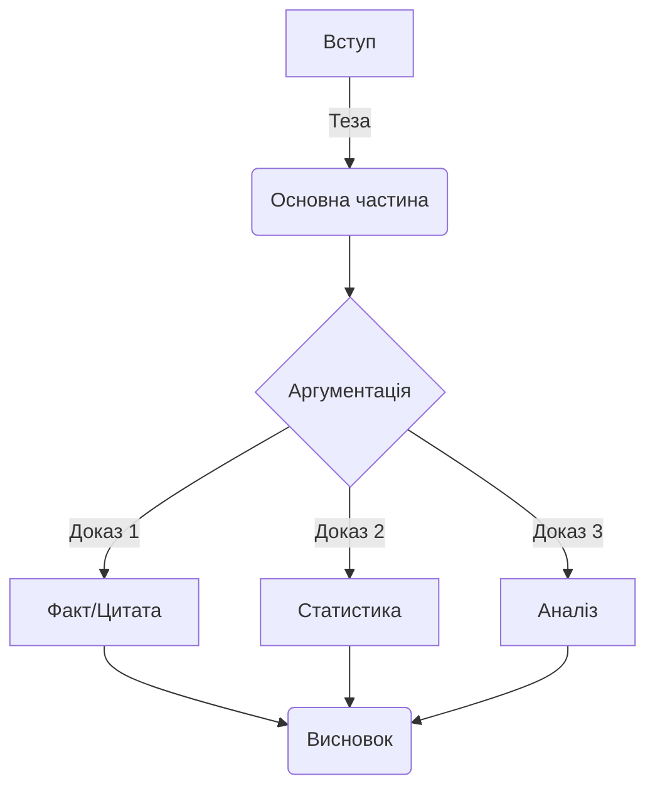

# Огляд B2 та міст до C1

> 🎯 **Чому це важливо?**
>
> Перехід від рівня B2 до C1 — це якісний стрибок від "розуміння мови" до "володіння мовою як інструментом". На рівні B2 ви навчилися вільно спілкуватися, але академічна та професійна сфери вимагають іншої точності, глибини та стилістичної гнучкості. Цей модуль допоможе вам систематизувати набуті знання, закріпити навички використання пасивного стану та складних синтаксичних конструкцій, а також підготує фундамент для написання наукових текстів та фахових дискусій українською мовою. Ви навчитеся не просто говорити, а формулювати думки з академічною досконалістю.

## Текст 1: Від впевненого користувача до майстра слова

**Контекст:**
Це уривок з есе профільного лінгвіста, який розглядає психологічні та мовні бар'єри, що виникають у студентів під час переходу на просунутий рівень вивчення мови. Особлива увага приділяється відмінності між розмовним та академічним стилями.

Освічені українці часто опиняються в пастці плато рівня B2 (Intermediate Plateau). Чому це відбувається? Вони вільно спілкуються, розуміють новини, але коли треба написати наукову статтю чи виступити з офіційною промовою, відчувають брак засобів. **Уявіть це як різницю між вмінням водити автомобіль містом і здатністю пілотувати винищувач: правила руху схожі, але швидкість, складність та відповідальність зовсім інші.** Здається, що вершину вже підкорено, але насправді це лише базовий табір перед штурмом Евересту майстерності. Чи готові ви зробити цей крок?
Проте саме тут починається найскладніший етап — шлях до мовної досконалості. Академічний рівень володіння українською мовою вимагає не лише знання слів, але й розуміння їхньої ваги, контексту та стилістичного забарвлення.

💡 **Чому це важливо?**
Українці миттєво відчувають різницю між професійним викладом та аматорським «переказом». Неправильний вибір регістру в академічному середовищі звучить як фальшива нота в опері — вона не псує всю мелодію, але змушує професіоналів здригнутися.

Насамперед, варто зазначити, що академічний стиль характеризується високим рівнем абстракції та об'єктивності. Якщо у розмовній мові ми кажемо "я думаю", то в науковому тексті доречніше вжити "вважається" або "можна стверджувати". Це не просто зміна слів, це зміна перспективи: від суб'єктивного до об'єктивного. Саме тут набувають ваги пасивні конструкції та безособові форми, які дозволяють зосередити увагу не на діячеві, а на дії чи явищі. **Наприклад, замість того щоб сказати «я дослідив це питання», науковець напише «це питання було ґрунтовно досліджено». Це дозволяє усунути «авторське я» і дати фактам говорити самим за себе.**

**Порівняйте розмову двох колег:**

**А:** Ти вже бачив результати тесту?
**Б:** Так, я глянув. Там все збігається.
**А:** Круто, значить ми праві.

**А тепер подивіться, як це виглядає в академічному діалозі:**

**Професор:** Чи було верифіковано результати останнього тестування?
**Докторант:** Так, пане професоре. Отримані дані повністю корелюють із попередніми показниками.
**Професор:** Отже, ми можемо констатувати правильність нашої початкової гіпотези.

**Бачите різницю? В першому випадку ми маємо справу з обміном враженнями, у другому — з фіксацією наукового факту.**

Крім того, перехід до C1 передбачає опанування складної синтаксичної архітектури. Речення стають розгалуженими, насиченими дієприкметниковими та дієприслівниковими зворотами. Це дозволяє висловити думку максимально точно, з усіма нюансами та застереженнями. Наприклад, замість того щоб сказати "Ми зробили експеримент і побачили результат", науковець напише: "Провівши серію експериментів, було виявлено закономірність, яка підтверджує попередню гіпотезу". **Зокрема, використання таких конструкцій допомагає уникнути однозначності та категоричності там, де потрібна наукова обережність. Ви як дослідник не просто «бачите результат», ви «виявляєте закономірність на підставі аналізу».**

Українці мають чудове прислів'я: **«Не кажи „гоп“, поки не перескочиш»**. В академічному світі це можна перефразувати так: **«Не робіть остаточних висновків до завершення верифікації даних»**. Зверніть увагу, як народна мудрість застерігає від поспішності — саме те, чого вимагає наукова об'єктивність. **Чи не є це найкращим доказом того, що точність закладена в самому генетичному коді нашої мови?**

Така трансформація мовлення потребує систематизації знань про граматику, яку студенти часто вважають нудною. Однак без глибокого розуміння структури мови неможливо побудувати переконливу аргументацію. Консолідація навичок, отриманих на попередніх етапах, є критично важливою для подальшого поступу. **Це як будівництво хмарочоса: якщо ваш фундамент (граматика B2) має тріщини, ви ніколи не зможете добудувати верхні поверхи (стилістика C1).**

Важливим компонентом успіху на цьому етапі є читання складних текстів. Не адаптованих оповідань, а оригінальних наукових статей, монографій, філософських есе. Читаючи академічну літературу, ви "вбираєте" в себе ритм та логіку наукового мислення. Поступово ви почнете помічати, як автори будують аргументацію, як вони пов'язують абзаци між собою та уникають тавтологій за допомогою багатого синонімічного ряду. Таке пасивне навчання згодом переростає в активну майстерність, коли ви самі сідаєте за написання есе чи доповіді.

Цікаво, що багато хто плутає складність з ускладненістю. Майстерність полягає не в тому, щоб говорити заплутано, а в тому, щоб висловлювати складні ідеї прозоро та елегантно. Просунутий рівень — це вміння вибрати з тисячі слів саме те єдине, яке найточніше передає суть. Подібне мистецтво потребує не лише практики, а й глибокого аналізу текстів, що написані визнаними майстрами слова.

Отже, міст до C1 будується на трьох китах: усвідомленні стилістичних відмінностей, вдосконаленні граматичної точності та розширенні лексичного запасу за рахунок абстрактних та фахових понять. Хоча це серйозний виклик, результатом стане здатність не просто спілкуватися, а творити нові смисли українською мовою.

## Текст 2: Українська мова в сучасному науковому дискурсі

**Контекст:**
Уривок з оглядової статті в науковому журналі "Мовознавство", присвяченої відродженню та розвитку української наукової термінології та стилістики в XXI столітті.

Інтеграція України у світовий науковий простір ставить нові вимоги до функціонування державної мови. Довгий час у науковому середовищі панувала думка про недостатню розробленість української термінології в певних галузях, що було наслідком імперської політики лінгвоциду та штучного витіснення української мови на маргінеси "хатнього вжитку". Сьогодні ми спостерігаємо зворотний процес: мова повертає собі статус інструменту високої науки, здатного описувати найтонші нюанси квантової фізики чи генетики. **Чи замислювалися ви, наскільки важливим є цей процес для національної безпеки та ідентичності?**

Розвиток фахової мови нерозривно пов'язаний із процесами термінотворення. Термінологія, що здавалася штучною, сьогодні органічно вплітається в канву наукових праць. За даними Інституту української мови (2023), понад 85% нових дисертацій захищаються саме українською. Щобільше, спостерігається тенденція до очищення мови від кальок та запозичень там, де існують питомі відповідники. Скажімо, замість "співпадати" (калька з російської) науковці дедалі частіше вживають "збігатися", а замість "відміняти" — "скасовувати". **Також, замість калькованого «приймати участь» у науковому дискурсі тепер панує нормативне «брати участь».**
Таке прагнення до точності свідчить про поглиблення мовної свідомості науковців.

Важливу роль у цьому процесі відіграють термінологічні комісії та інститути, які працюють над укладанням нових стандартів. Вони аналізують світовий досвід та шукають відповідники, що базуються на внутрішніх ресурсах української мови. Копітка праця приносить плоди, адже термін має бути не лише українським, а й точно відповідати міжнародному поняттю.

**Ось як може виглядати дискусія про термін:**

**Редактор:** Чому ви вжили термін «відсоток» замість «процент»?
**Автор:** Я вважаю, що «відсоток» — це питоме українське слово, яке краще панує в нашому науковому контексті.
**Редактор:** Погоджуюся. Це сприяє очищенню мови від зайвих запозичень.

**А ось приклад офіційної комунікації:**

**Аспірант:** Чи можу я включити цей аналіз до розділу «Висновки»?
**Науковий керівник:** Варто спочатку провести систематизацію даних у третьому розділі.
**Аспірант:** Зрозумів, дякую. Відтак я зможу краще обґрунтувати свою тезу.

Іноді це призводить до дискусій у науковій спільноті, але саме в таких дискусіях народжується істина і викристалізовується мовна норма.

Науковий стиль сучасної української мови характеризується низкою специфічних рис. По-перше, це логічність та послідовність викладу. Кожна теза має бути обґрунтована, а висновки — випливати з наведених аргументів. Для забезпечення зв'язності тексту широко використовуються вставні конструкції (отже, таким чином, по-перше, з одного боку).

**Приклади вставних конструкцій у реченнях:**
- **Отже, результати дослідження підтверджують нашу гіпотезу.**
- **З одного боку, ми бачимо прогрес, а з іншого — наявність певних ризиків.**
- **Таким чином, необхідно переглянути існуючу методологію.**
- **По-перше, ми проаналізували першоджерела, що дало змогу виявити закономірність.**
- **Навпаки, отримані дані свідчать про зворотну тенденцію розвитку явища.**
- **Зокрема, особливу увагу слід звернути на динаміку показників.**
- **Звісно, цей підхід потребує подальшого вдосконалення та перевірки.**
- **На жаль, брак фінансування загальмував проведення другого етапу експерименту.**
- **Безперечно, внесок українських вчених у світову науку є надзвичайно вагомим.**
- **Мабуть, це питання залишиться дискусійним ще довгий час.**

По-друге, це точність слововживання. Науковий термін прагне до однозначності. Якщо в художньому стилі багатозначність є перевагою, то в науковому — недоліком. Проте, це не означає, що наукова мова суха. Навпаки, українська наукова традиція, що бере початок від праць Грушевського та Кримського, вирізняється багатством синтаксисних конструкцій та милозвучністю. **Пам'ятайте: складність ідеї не обов'язково означає її «нечитабельність». Справжній майстер пише так, щоб його зрозумів колега, а не так, щоб його не зрозумів ніхто.**

> [!context] **Літературний контекст**
>
> Іван Франко був не лише видатним письменником, а й доктором філософії. Його наукові праці — це взірець академічного стилю кінця XIX – початку XX століття (Франко, 1898). Читаючи його статті з економіки чи літературознавства, можна помітити, як віртуозно він поєднував наукову точність із багатством народної мови. Франко довів, що українська мова здатна обслуговувати найскладніші інтелектуальні запити ще тоді, коли багато хто в цьому сумнівався. **Зокрема, він першим почав активно використовувати термін «інтелігенція» у науковому контексті.**

Синтез традиції та новаторства є ключовим для сучасного етапу. Ми не відкидаємо здобутки минулого, але адаптуємо їх до потреб сьогодення. Важливим аспектом є також повернення до активних дієприкметників, які раніше таврувалися як "нехарактерні", обережно повертаються в текст там, де це не порушує милозвучності. Як стверджує професор Пономарів (2011), мова — це живий організм, і навіть у суворій науці є місце для еволюції. Чи не є це свідченням зрілості нашої академічної спільноти?
Пасивні конструкції залишаються домінуючими для опису процесів, де виконавець не є важливим. **Наприклад, ми скажемо «закони приймаються», а не «міністри приймають закони», бо в центрі уваги — сам закон та його дія.**

Оцінювання якості наукового тексту базується не лише на новизні дослідження, а й на культурі мовлення. Недбале ставлення до мови часто сприймається як ознака непрофесійності. Тому для молодого науковця опанування академічного стилю є не менш важливим завданням, ніж проведення власне експериментів чи аналізу джерел. **Уявіть, що ваша наукова ідея — це діамант. Але без належного мовного огранювання вона може виглядати як звичайний камінь для випадкового перехожого.**

> [!tip] **Лінгвістичне спостереження**
>
> В українській науковій термінології варто розрізняти суфікси, що позначають процес і наслідок. Іменники на **-ання/-ення** зазвичай позначають процес (_озброєння_ як дія, _дослідження_ як процес). Натомість іменники з іншими суфіксами або без них можуть позначати предмет чи наслідок (_зброя_, _дослід_). Однак у багатьох випадках слова на **-ання** (наприклад, _дослідження_, _рішення_) позначають і процес, і його результат, залежно від контексту. Точність у виборі суфікса — ознака високої мовної культури.

Зверніть увагу на вживання слова **"відтак"**. У сучасній українській мові, особливо в публіцистичному та науковому стилях, його часто помилково вживають у значенні "тому", "отже" (наслідок). Насправді ж, основне значення "відтак" — це "потім", "після того" (часова послідовність). Хоча мовна норма є динамічною, в академічному письмі краще дотримуватися точних значень: для наслідку використовуйте _отже, тому, таким чином_, а для часу — _потім, згодом, відтак_.

Розширення сфер вжитку української мови сприяє її вдосконаленню. Чим більше ми пишемо та говоримо про науку українською, тим гнучкішою та багатшою вона стає. Це живий процес, до якого долучається кожен, хто обирає українську мову мовою своєї професійної діяльності.

Тепер, коли ми розглянули обидва тексти, порівняймо їхні підходи. Це допоможе вам наочно побачити межу між суб'єктивною есеїстикою та об'єктивним академічним стилем.

## Порівняльний аналіз

### Стилістичні засоби та Регістр

Обидва тексти належать до сфери інтелектуального мовлення, проте мають відмінності у регістрі та тоні. **Це як різниця між лекцією в університеті та приватною бесідою з професором за філіжанкою кави: в обох випадках ви обговорюєте науку, але дистанція та вибір слів будуть різними.**

**Текст 1 (Есе лінгвіста):**

- **Регістр:** Науково-популярний, місцями публіцистичний. Автор звертається безпосередньо до читача, використовує метафори ("підкорено вершину", "на трьох китах").
- **Тон:** Заохочувальний, аналітичний, особистісний. **Автор ніби веде вас за руку через складні моменти, підтримуючи та надихаючи.**
- **Синтаксис:** Поєднання простих речень для емоційного впливу та складних для пояснення нюансів.
- **Лексика:** Використовує слова, що описують процес навчання (_опанування, вдосконалення, майстерність_).

**Текст 2 (Стаття в журналі):**

- **Регістр:** Суто науковий (академічний). Текст більш відсторонений, об'єктивний. **Тут автор — лише голос науки, який констатує факти, не забарвлюючи їх власними емоціями.**
- **Tон:** Формальний, стверджувальний, інформативний.
- **Синтаксис:** Переважають розгорнуті складні речення, пасивні конструкції (_було наслідком, спостерігаємо процес, характеризується_).
- **Лексика:** Насичений термінологією (_інтеграція, дискурс, лінгвоцид, термінотворення_).

💡 **Порада для навчання**
Не намагайтеся одразу писати як автори Тексту 2. Почніть з формату есе (Текст 1), де ви можете бути собою, але вже використовуєте академічні «маркери». Поступово «авторське я» зникатиме, поступаючись місцем об’єктивному аналізу. **Це природна еволюція вашого академічного голосу.**

> [!analysis] **Порівняння регістрів**
>
> Порівняйте фразу з Тексту 1: _"Здається, що вершину вже підкорено."_ та фразу, яку міг би вжити автор Тексту 2 для вираження схожої думки: _"Створюється ілюзія завершеності процесу навчання."_
> Перший варіант — образний, метафоричний, ближчий до художнього або публіцистичного стилю. Другий — абстрактний, номінативний (використовує іменники замість дієслів), що є маркером наукового стилю. **Бачите різницю? Один текст «малює картину», інший — «будує модель».**

### Граматичний фокус: Пасивний стан

В обох текстах використовуються пасивні конструкції, але з різною метою.
У Тексті 1: _"вершину вже підкорено"_ (безособова форма на -но/-то). Акцент на стані завершеності.
У Тексті 2: _"думка... була наслідком"_ (пасивне значення через дієслово-зв'язку). Акцент на причинно-наслідкових зв'язках.

> [!caution] **Складність для іноземців**
>
> Українська мова, на відміну від англійської, має багатшу палітру безособових форм (зроблено, написано, вирішено). Вони дозволяють уникнути прямого називання виконавця дії, що ідеально підходить для наукового стилю, де важливий сам факт, а не особа дослідника. В англійській це часто передається через Passive Voice (_it was done_), але українська форма на -но/-то має відтінок "результативності", якого іноді бракує звичайному пасиву.

### Структура академічного тексту

## Письмо: Академічне есе

**Завдання:**
Напишіть коротке есе (200-250 слів) на тему: **"Чому академічна доброчесність та точність мовлення є важливими для сучасного науковця?"**. Використайте принаймні 5 слів з нового словника (наприклад: _систематизація, аналіз, обґрунтування, плагіат, цитування_).

**Структура:**

1.  **Вступ:** Визначення проблеми та теза. (Наприклад: Точність мовлення — це ввічливість науковця).
2.  **Основна частина:** 1-2 аргументи. Використовуйте пасивні конструкції та вставні слова (_по-перше, з іншого боку_).
3.  **Висновок:** Підсумок.

**Зразок відповіді (Model Answer):**

> [!model-answer]
> **Тема: Важливість академічної доброчесності та точності**
>
> У сучасному глобалізованому світі наука розвивається надзвичайно стрімкими темпами. У цьому контексті **академічна** доброчесність та точність викладу думок набувають критичного значення. Мова йде не лише про дотримання формальних правил, а про фундамент довіри в науковій спільноті.
>
> По-перше, точність термінології забезпечує однозначність сприйняття інформації. Якщо дослідник використовує терміни некоректно, це може призвести до хибних інтерпретацій результатів його роботи. **Аналіз** наукових джерел має бути об'єктивним, а висновки — логічно обґрунтованими. Будь-яке **узагальнення** повинно спиратися на перевірені факти.
>
> По-друге, академічна доброчесність є запорукою розвитку науки. Присвоєння чужих ідей гальмує прогрес і знецінює працю колег. **Опанування** культури цитування демонструє повагу до попередників та дозволяє чітко розмежувати власні здобутки та відомі факти.
>
> Отже, прагнення до **досконалості** у мовному оформленні та етична поведінка є невід'ємними складовими професіоналізму. **Консолідація** зусиль науковців навколо цих принципів сприятиме підвищенню авторитету української науки у світі.

> [!note] **Академічна перспектива**
>
> Українська синтаксична традиція толерує довші речення, ніж англійська. Проте в сучасному науковому письмі спостерігається тенденція до скорочення довжини речень задля кращої читабельності (вплив глобального _Plain Language movement_). Пам'ятайте: складність думки не обов'язково означає складність граматичної конструкції. Ясність — це ввічливість автора.

> [!context] **Культурна значущість**
>
> Термін "фаховий" походить від німецького _Fach_ (професія, спеціальність), що свідчить про глибокі історичні зв'язки української освіти з європейською традицією. За радянських часів це слово часто витіснялося словом "професійний", але сьогодні "фах" і "фаховий" активно повертаються в академічний обіг, підкреслюючи самобутність української термінології.

# Підсумок

У цьому модулі ми розглянули ключові відмінності між рівнем B2 та C1, зосередившись на академічній точності, об'єктивності та стилістичній гнучкості. Ви проаналізували два тексти, порівняли їхні регістри та потренувалися у використанні пасивних конструкцій. Тепер ви готові до глибшого занурення у світ української академічної мови.

---

## Need More Practice?
