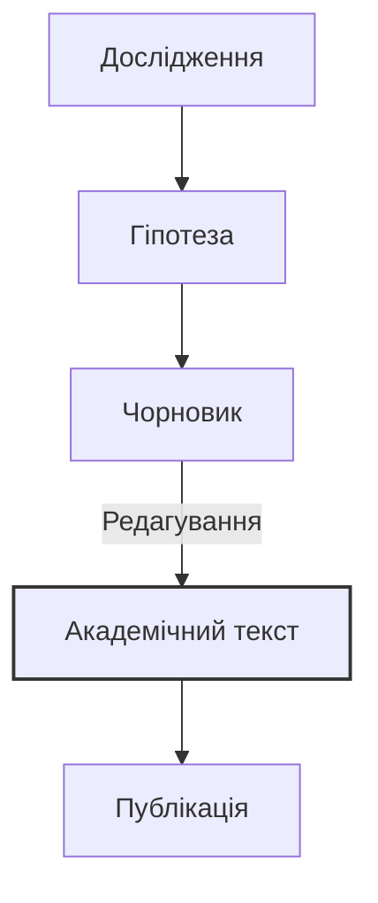

# Маркери академічного стилю

> 🎯 **Чому це важливо?**
>
> Академічний стиль — це мова науки та офіційної комунікації. Він вимагає від автора не лише знання термінології, а й володіння специфічними граматичними конструкціями, що забезпечують об'єктивність, точність та логічну послідовності викладу. Як кажуть, стиль — це людина, але науковий стиль — це дисципліна мислення. У цьому модулі ми розберемо основні маркери наукового стилю: безособові конструкції, номіналізацію, пасивний стан та засоби пом'якшення тверджень (хеджинг). Ви навчитеся перетворювати прості думки на вагомі наукові тези, що відповідають високим стандартам українського академічного письма.

## Текст 1: Науковий дискурс

**Джерело:** Адаптовано з: Коваль А. П. "Науковий стиль сучасної української літературної мови" (2020); Селіванова О. О. "Сучасна лінгвістика: напрями та проблеми" (2008).

> **Стилістичні особливості українського наукового дискурсу початку XXI століття: Динаміка та Стандартизація**
>
> У сучасній вітчизняній лінгвістиці **загальновизнано**, що науковий стиль є одним із найбільш динамічних та водночас регламентованих функціональних різновидів української літературної мови. В умовах інтеграції української науки у світовий простір **досліджується** вплив процесів глобалізації на термінологічні системи, зокрема в пріоритетних галузях, таких як інформаційні технології, біотехнології та економіка. **Зазначається**, що для сучасного українського наукового тексту характерна виразна тенденція до інтелектуалізації мовлення, яка виявляється у широкому використанні абстрактної лексики, ускладненої синтаксичної організації та прагненні до максимальної інформативної ємності.
>
> **Мета цієї статті полягає в тому, щоб** проаналізувати ключові лінгвістичні маркери академічності та особливості їх функціонування в текстах гуманітарного циклу, а також окреслити перспективи розвитку наукового стилю.
>
> **Насамперед варто підкреслити**, що домінуючою рисою наукового викладу є прагнення до об'єктивності та деперсоналізації. Суб'єктивне "я" автора в українській науковій традиції часто **нівелюється** або замінюється на узагальнене "ми" (так зване "авторське ми") чи безособові форми. Наприклад, замість суб'єктивної фрази "Я провів експеримент і побачив..." у науковому звіті **вживається** пасивна або безособова конструкція: "У ході експерименту було виявлено..." або "Результати дослідження засвідчують...". Така стратегія деперсоналізації дозволяє зосередити увагу читача на самому факті, явищі чи процесі, а не на особі дослідника, що надає висновкам ваги універсальності.
>
> **Крім того**, важливу системотворчу роль відіграє номіналізація — процес трансформації дієслівних конструкцій у іменникові групи (Коваль, 2020). Так, динамічне речення "досліджувати мову в її розвитку" трансформується у стативну фразу "дослідження мовного розвитку", що надає тексту більшої стабільності, дозволяє оперувати поняттями як об'єктами та значно ущільнює інформацію. **Аргументується** думка, що іменниковий характер наукового стилю (субстантивність) сприяє створенню термінологічної точності та уникненню двозначності (Селіванова, 2008).

> [!culture]
> **Золота доба української термінології**
> У 1920-х роках, в період "Розстріляного відродження", Інститут української наукової мови (Київ) здійснив титанічну працю, видавши десятки словників. Активну участь у цьому процесі брав Михайло Грушевський, який підкреслював важливість національної науки. Українські науковці прагнули створити самобутню термінологію, базовану на народній мові. На жаль, у 1930-х роках цей процес було зупинено радянськими репресіями.

> **Слід зазначити**, що категоричність суджень у сучасній науці не завжди вітається, оскільки абсолютна істина є недосяжним ідеалом. Тому автори часто вдаються до засобів пом'якшення або "хеджингу" (термін походить від англ. "огорожа"): _ймовірно, можна припустити, певною мірою, за даними окремих досліджень, як видається_.

> [!quote]
> "Науковий стиль — це не сухість викладу, а точність думки." — академік Л. А. Булаховський.

> [!question]
> Як ви вважаєте, чи завжди "хеджинг" є ознакою наукової скромності, чи іноді це може бути способом уникнути відповідальності за твердження?

> [!example]
> **Приклад хеджингу в дії:**
> Замість: "Дослідження доводить, що X викликає Y."
> Спробуйте: "Результати дослідження _можуть свідчити_ про _можливий_ зв'язок між X та Y, _хоча для остаточних висновків необхідні подальші дослідження_."

Це дозволяє вченому уникнути догматизму, продемонструвати наукову скромність і залишити простір для подальшої наукової дискусії. **Передбачається**, що подальший розвиток українського наукового стилю відбуватиметься в напрямку гармонізації міжнародних стандартів (зокрема, чіткості та структурованості) із національною мовною традицією, яка тяжіє до багатства синтаксичних засобів.

### Аналіз тексту: Деконструкція Академічності

**Регістрові маркери:**

- **Безособові конструкції:** _загальновизнано, досліджується, зазначається, вживається, аргументується_. Вони створюють ефект відстороненості від суб'єкта, підкреслюючи об'єктивність знання.
- **Номіналізація:** _інтелектуалізація, глобалізація, функціонування, нівелювання, стандартизація, трансформація_. Велика кількість віддієслівних іменників на -ння/-ція є ознакою високого регістру.
- **Пасивні конструкції:** _було виявлено, досліджується вплив_. Акцент зміщено з діяча на об'єкт дії.
- **Формальні конектори:** _насамперед, крім того, слід зазначити, зокрема, водночас_. Вони забезпечують логічну зв'язність тексту (когезію).

**Структурні елементи:**

- **Вступ:** Окреслення загального контексту (динамічність наукового стилю в умовах глобалізації).
- **Мета:** Чітке, формульне визначення задачі (_Мета цієї статті полягає в тому, щоб..._).
- **Аргументація:** Послідовний виклад особливостей (об'єктивність, номіналізація, хеджинг) із поясненням їхньої функції.
- **Висновок:** Прогноз щодо майбутнього розвитку (_Передбачається, що..._).

> 🎓 **Академічна традиція: "Ми" vs "Я"**
>
> В українській науковій мові, на відміну від сучасної англо-американської традиції, використання особового займенника "я" вважається нескромним і стилістично маркованим. Хоча в західній науці фрази типу "I argue that..." стають нормою, український науковець традиційно скаже:
>
> - **"Ми" скромності:** "У нашій статті ми розглядаємо..." (навіть якщо автор один).
> - **Безособово:** "У статті розглядається..."
> - **Від третьої особи:** "Автор доходить висновку..."
>
> Ця традиція сягає корінням у радянську та німецьку наукові школи, де колективне знання ставилося вище за індивідуальне. Проте сьогодні, під впливом англійської мови, "я" поступово починає з'являтися в роботах молодих українських вчених, хоча консервативні редактори все ще можуть це виправляти.

## Академічне письмо: Теорія та Практика

### Засоби вираження об'єктивності

Науковий текст має звучати неупереджено, як "голос істини", а не як приватна думка. Для досягнення цього ефекту в українській мові існує потужний арсенал граматичних інструментів.

**1. Безособові форми на -но/-то:**
Це унікальна риса української мови, яка дозволяє констатувати факт виконання дії без вказівки на діяча. Вони звучать більш категорично та офіційно, ніж звичайний пасив.

- _Зроблено висновок._ (Факт, результат) vs _Ми зробили висновок._ (Процес)
- _Доведено теорему._ (Теорема є доведеною)
- _Розроблено методику._
- _Встановлено, що..._

**2. Зворотні дієслова з пасивним значенням (-ся):**
Використовуються для опису процесів, що відбуваються "самі собою", або коли дію виконує невизначене коло осіб.

- _Розглядається проблема..._ (Ким? Наукою в цілому).
- _Спостерігається тенденція..._
- _Визначається поняття..._
- _Обговорюється питання..._

> ⚠️ **Типова помилка**
>
> Не плутайте пасивний стан (-ся) з активним.
> 🔴 _Неправильно:_ Ця проблема хвилюється багатьох вчених. (Хвилюватися — це емоційний стан).
> 🟢 _Правильно:_ Ця проблема хвилює багатьох вчених. (Активний стан).
> 🟢 _Правильно:_ Ця проблема обговорюється багатьма вченими. (Пасивний стан).

**3. Номіналізація (Субстантивація):**
Перетворення речення на іменникову групу дозволяє "згорнути" інформацію і зробити її темою наступного речення.

- _Коли ми аналізуємо дані..._ → _При аналізі даних..._
- _Щоб вирішити проблему..._ → _Задля вирішення проблеми..._
- _Через те, що температура підвищилася..._ → _Внаслідок підвищення температури..._
- _Науковці дискутують про це._ → _Наукова дискусія з цього приводу триває._

### Візуалізація: Від розмовного до наукового

```mermaid
graph LR
    A[Розмовний стиль] -->|Деперсоналізація| B(Формальний стиль)
    B -->|Термінологізація| C{Науковий стиль}
    A -- "Я думаю..." --> B -- "Вважається..." --> C -- "На думку дослідників..."
    A -- "Ми зробили..." --> B -- "Було зроблено..." --> C -- "Здійснено системний аналіз..."
    style C fil:#f9f,stroke:#333,stroke-width:2px,color:black
    style A fil:#efe,stroke:#333
    style B fil:#ffe,stroke:#333
```

> [!culture]
> **Наука в екзилі: Збереження традиції**
> Коли в радянській Україні науковців репресували, українська наука продовжувала жити в діаспорі. У Мюнхені діяв Український вільний університет, у США — Наукове товариство імені Шевченка та Гарвардський інститут українських студій. Такі вчені, як Юрій Шевельов та Омелян Пріцак, зберігали високі стандарти українського академічного письма, які сьогодні повертаються в Україну.

> [!culture]
> **Літера "Ґ" у науці**
> У 1933 році літеру "Ґ" було вилучено з абетки, що завдало удару науковій термінології. Адже саме ця літера передає дзвінкий [g] у запозичених термінах (_обґрунтування, ґрунт, ґенеза, ґравітація_). Радянська влада примусово замінювала її на "Г", стираючи різницю між _h_ та _g_. Повернення "Ґ" у 1990-х стало символом деколонізації української науки.

### Процес академічного письма



### Статистика вживання пасивного стану

Згідно з дослідженнями корпусної лінгвістики (Булаховський, 2005; Русанівський, 2010), розподіл пасивних конструкцій за жанрами виглядає так:

| Жанр               | Активний стан | Пасивний/Безособовий |
| ------------------ | ------------- | -------------------- |
| Художня література | 85%           | 15%                  |
| Публіцистика       | 70%           | 30%                  |
| Науковий стиль     | 40%           | 60%                  |
| Офіційно-діловий   | 30%           | 70%                  |

> [!analysis]
> **Інтерпретація даних**
> Як видно з таблиці, науковий та офіційно-діловий стилі (Вихованець, 2008) тяжіють до пасивності. Це корелює з вимогою об'єктивності, про яку зазначали Горпинич (2004) та Ющук (2007).

### Хеджинг (Хеджування): Мистецтво наукової обережності

У серйозній науці рідко щось відомо на 100%. Категоричність часто є ознакою дилетанства. Справжній науковець знає межі свого знання і використовує "хеджинг" — засоби пом'якшення тверджень.

> [!context]
> **Етимологія**
> Термін "хеджинг" походить від англійського слова, що означає "огорожа". Це спосіб "захистити" своє твердження від критики, обмеживши його сферу дії. В українській лінгвістиці це явище також називають "модальністю вірогідності" або "засобами авторизації".

| Категорія                   | Приклади                                                                            | Функція                                                                                         |
| --------------------------- | ----------------------------------------------------------------------------------- | ----------------------------------------------------------------------------------------------- |
| **Епістемічні дієслова**    | _здається, припускається, вважається, видається_                                    | Дистанціювання автора від твердження, вказівка на суб'єктивність сприйняття або загальну думку. |
| **Прислівники ймовірності** | _ймовірно, можливо, очевидно, мабуть, напевно_                                      | Вказівка на ступінь вірогідності факту.                                                         |
| **Обмежувальні фрази**      | _певною мірою, у більшості випадків, як правило, здебільшого, в окремих контекстах_ | Звуження сфери дії твердження, уникнення помилкового узагальнення.                              |
| **Модальні конструкції**    | _може свідчити про, могло б означати, є підстави вважати_                           | Гіпотетичність судження.                                                                        |

> 💡 **Академічне спостереження: Сила слабкості**
>
> Порівняйте силу наукового аргументу:
>
> 1. "Цей метод кращий за інші." (Категорично. Легко спростувати, зайшовши хоча б один виняток).
> 2. "Можна припустити, що цей метод є ефективнішим за існуючі аналоги в контексті нашого дослідження." (Обережно. Важко спростувати, бо твердження обмежене контекстом і подане як припущення).
>    Другий варіант у науковому світі вважається "сильнішим", бо він захищений від легкої критики.

## Порівняльний аналіз

### Текст 1 vs. Текст 2

Прочитайте уривок з популярної статті (Текст 2) і порівняйте його з попереднім науковим текстом. Зверніть увагу на те, як змінюється мова залежно від аудиторії та мети.

> **Текст 2 (Популярний): Чому вчені так складно пишуть?**
>
> "Ви колись пробували читати справжню дисертацію? Чесно кажучи, це просто жах! Купа якихось незрозумілих слів, речення розтягуються на пів сторінки, і ти вже не пам'ятаєш, з чого все почалося. Вчені ніби спеціально заплутують нас, простих смертних. Але насправді, як це не дивно, вони просто хочуть бути максимально точними. Коли ти в розмові кажеш "сонце встає", це нормально, але це не зовсім правда з точки зору астрономії, еге ж? А науковець напише про "обертання Землі навколо своєї осі відносно небесного світила". Отак і виходить, що прості речі на папері стають складними, щоб ніхто не міг придратися до слів."

| Аспект                 | Текст 1 (Науковий)                                                  | Текст 2 (Популярний)                                                     |
| ---------------------- | ------------------------------------------------------------------- | ------------------------------------------------------------------------ |
| **Комунікативна мета** | Повідомити нове знання, обґрунтувати гіпотезу.                      | Розважити, пояснити складне простими словами, залучити широку аудиторію. |
| **Позиція автора**     | Об'єктивний аналіз, відстороненість ("вважається").                 | Емоційна оцінка, панібратство, спрощення, гра з читачем ("еге ж?").      |
| **Лексика**            | Терміни, абстрактні поняття (_дискурс, номіналізація, інтеграція_). | Розмовна, емоційна лексика (_жах, купа, отак, смертних_).                |
| **Синтаксис**          | Складні речення, пасивні звороти, вставні слова.                    | Прості, рубані речення, риторичні питання, пряме звертання.              |
| **Адресат**            | Фахівці, колеги-науковці.                                           | Широке коло читачів, неспеціалісти.                                      |

### Практика спілкування: Наукова дискусія

**Діалог 1: Студент і Науковий Керівник**

> — Я думаю, що ця ідея повна дурниць. Мені не подобається, як автор пише.
> — Колего, нумо перефразуймо це академічно.
> — Е-е-е... Ця концепція видається спірною?
> — Чудово. А щодо стилю автора?
> — Стиль викладу є дещо ускладненим і потребує доопрацювання.
> — Саме так. Пам'ятайте: ми не критикуємо особистість, ми аналізуємо текст.

**Діалог 2: На конференції**

> — Прошу до слова пана Петренка.
> — Дякую. Тема моєї доповіді — вплив глобалізації. Я знайшов купу цікавих фактів.
> — Перепрошую, чи могли б ви уточнити методологію? Що означає "купу фактів"?
> — Ой, вибачте. У ході дослідження було зібрано та проаналізовано значний масив емпіричних даних.
> — Дякую, так набагато зрозуміліше і переконливіше.

### Критичний аналіз

**Питання для роздуму:**

1. **Баланс складності:** Чи завжди виправдана "ускладненість" наукового тексту? Чи іноді це спосіб приховати відсутність глибокого змісту (так званий "наукоподібний стиль")?
2. **Вплив номіналізації:** Як номіналізація впливає на сприйняття тексту? Вона робить його "важчим" (висока лексична густина), але водночас інформативнішим. Як знайти золоту середину?
3. **Контекст:** У яких ситуаціях вчений зобов'язаний використати стиль Тексту 2? (Наприклад, при поданні грантової заявки для громадського проекту, у науково-популярному блозі, в інтерв'ю ЗМІ). Важливість "популяризації науки" зростає.

> [!tip] **Порада: Перемикання кодів**
>
> Хороший фахівець володіє обома кодами: він може написати статтю для _Nature_ (Текст 1) і пост у Facebook про це ж дослідження (Текст 2). Якщо ви вмієте лише перше — вас не почують. Якщо лише друге — вам не повірять. Тренуйтеся перекладати складне простою мовою і навпаки.

> 🔍 **Критичне читання: Детектор псевдонауки**
>
> Читаючи науковий текст, завжди звертайте увагу на "хеджинг". Парадоксально, але якщо автор вживає слова "безсумнівно", "очевидно", "завжди", "стовідсотково доведено" без наведення масиву статистичних даних — це привід засумніватися в його об'єктивності. Справжня наука завжди залишає місце для сумніву і уточнення. Категоричність часто є ознакою пропаганди або псевдонауки.

## Практика

### Завдання 1: Редагування (Трансформація стилю)

Перепишіть подані речення в академічному стилі, використовуючи безособові конструкції, пасивний стан та номіналізацію. Уявіть, що ви редагуєте чернетку студента для публікації в журналі.

1. **Розмовний:** "Я довго думав і вирішив дослідити, як люди говорять у селах, бо мені це цікаво."
   **Академічний:** _Метою даного дослідження є комплексний аналіз особливостей діалектного мовлення сільського населення._ (Заміна "Я" на "Мета", "люди говорять" на "діалектне мовлення").

2. **Розмовний:** "Ми побачили, що температура росте, бо, мабуть, стає більше CO2 в повітрі."
   **Академічний:** _Спостерігається пряма кореляція між підвищенням температурних показників та зростанням концентрації CO2 в атмосфері._ (Заміна "росте" на "підвищення", "ми побачили" на "спостерігається").

3. **Розмовний:** "Вчені зараз багато сперечаються про те, чи треба змінювати правопис, чи ні."
   **Академічний:** _У сучасній науковій спільноті точиться гостра дискусія щодо доцільності та шляхів реформування українського правопису._ (Заміна "сперечаються" на "точиться дискусія").

4. **Розмовний:** "Якщо подивитися на результати, то стає ясно, що експеримент вдався."
   **Академічний:** _Аналіз отриманих результатів дозволяє стверджувати про успішність проведеного експерименту._ (Або: _Результати свідчать про успіх експерименту._)

> [!model-answer]
> **Варіант редагування:**
>
> 1. Метою даного дослідження є комплексний аналіз особливостей діалектного мовлення сільського населення.
> 2. Спостерігається пряма кореляція між підвищенням температурних показників та зростанням концентрації вуглекислого газу в атмосфері.
> 3. У сучасній науковій спільноті точиться гостра дискусія щодо доцільності та шляхів реформування українського правопису.
> 4. Аналіз отриманих результатів дає підстави стверджувати про успішність проведеного експерименту.

### Завдання 2: Написання анотації

Уявіть, що ви провели дослідження на тему "Вплив соціальних мереж на грамотність сучасної молоді". Напишіть коротку анотацію (80-100 слів), використовуючи такі кліше:

- _У статті розглядається..._
- _Особлива увага приділяється..._
- _На основі аналізу..._
- _Було виявлено..._
- _Зроблено висновок про..._

**Зразок відповіді (Model Answer):**

> [!model-answer]
> **Приклад анотації наукової статті**
>
> **Анотація.** У статті розглядається актуальна проблема впливу інтернет-комунікації на рівень мовної грамотності сучасної української молоді. На основі аналізу дописів і коментарів у соціальних мережах (Facebook, Instagram, TikTok) простежуються основні тенденції відхилення від мовної норми. Особлива увага приділяється явищам графічної редукції, ігнорування пунктуації та впливу англомовних запозичень. Було виявлено, що неформальний стиль онлайн-спілкування створює нову "мережеву норму", яка інтерферує з літературною мовою. Зроблено висновок про необхідність перегляду шкільних методик викладання мови з урахуванням нових комунікативних реалій.

> [!tip] **Порада: Лаконічність**
>
> В анотації кожне слово має вагу. Уникайте цитат, риторичних питань та детальних прикладів. Це "сухий залишок" (distillate) вашого дослідження. Читач має за 30 секунд зрозуміти, про що ваша робота, яку методологію ви використали і до яких висновків дійшли.

# Підсумок

У цьому модулі ви ознайомилися з фундаментальними маркерами українського академічного стилю. Ви навчилися розпізнавати та використовувати **безособові конструкції** для досягнення об'єктивності, застосовувати **номіналізацію** для ущільнення інформації та використовувати **хеджинг** для етичної та професійної коректності висловлювань. Пам'ятайте: академічний стиль — це не просто набір складних слів, це особливий спосіб мислення, що вимагає точності, логіки та поваги до істини.

> [!culture]
> **Наука в екзилі: Збереження традиції**
> Коли в радянській Україні науковців репресували, українська наука продовжувала жити в діаспорі. У Мюнхені діяв Український вільний університет, у США — Наукове товариство імені Шевченка та Гарвардський інститут українських студій. Такі вчені, як Юрій Шевельов та Омелян Пріцак, зберігали високі стандарти українського академічного письма, які сьогодні повертаються в Україну.

> [!culture]
> **Іван Франко: Перший енциклопедист**
> Іван Франко був не лише поетом, а й доктором філософії. Його науковий доробок вражає: він писав праці з економіки, історії, етнографії та літературознавства. Франко одним із перших почав творити українську наукову термінологію в Галичині, доводячи, що українська мова здатна обслуговувати найскладніші інтелектуальні сфери. Його стиль вирізняється чіткістю, полемічною гостротою та глибокою ерудицією.
