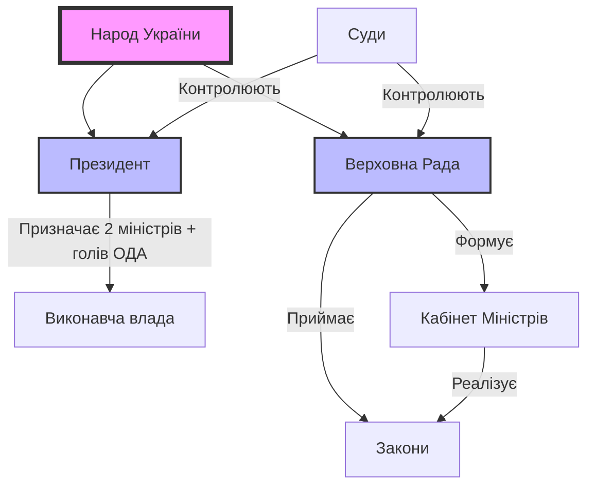

# Політична система України

Україна — це не просто територія на мапі Європи, це живий організм, де демократія постійно виборюється і вдосконалюється. Щоб зрозуміти новини, дебати на кухні чи закони, треба знати правила гри.

## Розминка

1.  Як ви думаєте, хто має більше влади в Україні: Президент чи Парламент?
2.  Чи знаєте ви ім'я вашого депутата-мажоритарника (якщо такий є)?
3.  Що таке "коаліція" і чому вона розпадається?

## Читання

Україна — це **унітарна парламентсько-президентська республіка**. Це означає, що центр прийняття рішень знаходиться у Парламенті (Верховній Раді), але Президент має сильні повноваження у сферах оборони та зовнішньої політики.

> [!history-bite]
> **Пилип Орлик:** Українці мають демократію в ДНК. У 1710 році гетьман Пилип Орлик уклав документ "Пакти і Конституції прав і вольностей Війська Запорозького". Це була одна з перших конституцій у світі, яка розділяла владу на три гілки ще до того, як це зробив Монтеск'є.

## 1. Законодавча влада: Верховна Рада

Верховна Рада України — це єдиний законодавчий орган. Вона складається з 450 народних депутатів (парламентарів).
**Функції:**

- Приймати закони та Конституцію.
- Призначати вибори Президента.
- Затверджувати Державний бюджет.
- Звільняти та призначати Уряд (Кабінет Міністрів).

> [!tip]
> **Як перевірити депутата?**
> Не вірте рекламі. Зайдіть на сайт `itd.rada.gov.ua` або портал руху ЧЕСНО (`chesno.org`). Там можна побачити, як ваш депутат голосував за важливі закони, чи не є він "кнопкодавом" (голосує за сусіда) і чи не прогулює засідання. Відповідальний громадянин — інформований громадянин.

> [!context]
> **Монобільшість:** Це унікальне явище для української політики, коли одна партія отримує понад 226 мандатів і може сама сформувати уряд без коаліції. Це сталося вперше у 2019 році з партією "Слуга Народу".

## 2. Виконавча влада: Дуалізм

Тут часто виникає плутанина. В Україні виконвча влада розділена.

### Президент України

Він є Гарантом Конституції, Головнокомандувачем ЗСУ та обличчям держави на міжнародній арені.

- **Обирається:** Народом на 5 років (максимум 2 терміни).
- **Призначає:** Голів обласних адміністрацій, генпрокурора, вище командування армії.
- **Вплив:** Має право "вето" на закони.

> [!timeline]
> **Президенти України:**
>
> - **1991-1994:** Леонід Кравчук (незалежність).
> - **1994-2005:** Леонід Кучма (Конституція і олігархія).
> - **2005-2010:** Віктор Ющенко (демократія і НАТО).
> - **2010-2014:** Віктор Янукович (узурпація і втеча).
> - **2014-2019:** Петро Порошенко (армія і безвіз).
> - **2019-...:** Володимир Зеленський (цифровізація і війна).

### Кабінет Міністрів (Уряд)

Це вищий орган у системі виконавчої влади, який відповідає за економіку, освіту, медицину та дороги.

- **Голова:** Прем'єр-міністр України. Його обирає Парламент, а не Президент!
- **Відповідальність:** Уряд підзвітний Верховній Раді. Якщо Рада висловить недовіру, уряд йде у відставку.

## 3. Судова влада: В пошуках справедливості

Судова система є незалежною (на папері), але історично є найбільш проблемною ланкою через корупцію.

- **Конституційний Суд:** Вирішує, чи відповідають закони Конституції. Його рішення не можна оскаржити.
- **Верховний Суд:** Найвища інстанція для цивільних та кримінальних справ.

> [!myth-buster]
> **Міф:** "Президент має посадити всіх корупціонерів".
> **Реальність:** Президент не має права нікого саджати. Це функція судів та прокуратури. Якщо Президент дзвонить судді з наказом — це злочин. Українці часто вимагають від лідера "сильної руки", забуваючи про розділення влади.

## 4. Антикорупційна інфраструктура

Це абсолютно новий клас інституцій, створений після 2014 року під тиском суспільства та західних партнерів. Вони незалежні від старих правоохоронних органів.

### НАБУ (Національне антикорупційне бюро України)

Це "спецназ" боротьби з корупцією. Їхня задача — ловити "велику рибу": міністрів, депутатів, суддів.

- **Детективи:** Вони проводять розслідування, ведуть прослушку і затримують підозрюваних.
- **Незалежність:** Директора НАБУ обирає конкурсна комісія з міжнародними експертами, щоб уникнути політичного впливу.

### САП (Спеціалізована антикорупційна прокуратура)

Детективи не можуть йти в суд без прокурора. САП наглядає за НАБУ і представляє обвинувачення в суді. Без підпису голови САП справа розвалюється.

### ВАКС (Вищий антикорупційний суд)

Раніше справи НАБУ потрапляли в звичайні районні суди, де їх роками "ховали". Тому створили окремий суд виключно для топ-корупції.

- **Результати:** ВАКС вже виніс десятки вироків, включаючи реальні терміни для депутатів.
- **Конфіскація:** Саме цей суд конфіскує активи російських олігархів в Україні.

### НАЗК (Національне агентство з питань запобігання корупції)

Вони не саджають, вони перевіряють стиль життя.

- **Є-декларування:** Кожен чиновник в Україні зобов'язаний заповнити електронну декларацію про всі свої доходи, авто, квартири і навіть годинники. Якщо депутат купив віллу, але офіційно заробив 0 гривень — НАЗК це побачить.

## 5. Конституційна ніч і боротьба за правила

Українська Конституція народжувалася в муках.

> [!history-bite]
> **Конституційна ніч:** 28 червня 1996 року Верховна Рада працювала 24 години без перерви. Депутати зачинилися в залі, щоб ухвалити Основний Закон, і вийшли тільки вранці. До цього моменту країна 5 років жила без нової конституції. Ця ніч стала легендою українського парламентаризму.

Але боротьба не закінчилася. Влада в Україні постійно коливалася між Президентом і Парламентом.

- **2004 рік:** Помаранчева революція обмежила владу Президента, передавши частину повноважень Уряду.
- **2010 рік:** Янукович незаконно скасував цю реформу, узурпувавши владу.
- **2014 рік:** Після перемоги Майдану Україна повернулася до парламентсько-президентської моделі. Це запобіжник проти диктатури.

## 6. Вибори і Демократія: Відкриті списки

Вибори в Україні — це завжди драма, інтрига і непередбачуваність. Ми змінюємо владу регулярно.

Раніше виборча система була "змішаною" (половина депутатів за списками партій, половина — мажоритарники в округах). Це породжувало "гречкосійство" — підкуп виборців в округах продуктовими наборами.

**Новий Виборчий Кодекс** запровадив **пропорційну систему з відкритими списками**.

- Як це працює? Ви голосуєте не тільки за партію, а й за конкретного кандидата в цій партії.
- **Регіональні списки:** Партія не може просто поставити свого друга на прохідне місце. Якщо виборець ставить галочку за номер 5 у списку, цей кандидат піднімається вгору і обганяє номер 1.
- **Вплив:** Це дає виборцю реальну владу формувати якісний склад парламенту, а не просто голосувати за бренди.

> [!cultural]
> **Кухня кандидатів:** В Україні існує термін "технічний кандидат". Це людина, яку реєструють на виборах лише для того, щоб відтягнути голоси у конкурента (наприклад, однофамілець) або щоб отримати додаткові місця у виборчих комісіях. Це "чорна технологія", з якою бореться громадянське суспільство. Демократія — це змагання ідей, а не технологій.

- **День тиші:** Субота перед виборами. Будь-яка агітація заборонена.
- **Екзит-пол (Exit Poll):** Опитування на виході. Зазвичай точні.

## 7. Децентралізація: Успішна реформа

До 2014 року всі гроші йшли в Київ, а потім "роздавалися" регіонам у ручному режимі. Це створювало залежність місцевих еліт від центральної влади. "Хочеш гроші на дорогу? Будь лояльним до Президента".

Реформа децентралізації зламала цю феодальну систему.

1.  **ОТГ (Об'єднані територіальні громади):** Села, селища та міста добровільно об'єдналися в спроможні громади.
2.  **Бюджет:** Податок на доходи фізосіб (ПДФО) тепер значною мірою залишається на місцях. Громада сама вирішує: будувати школу, дорогу, ЦНАП (Центр надання адмінпослуг) чи парк.
3.  **Відповідальність:** Мер міста тепер не може сказати "Київ не дав грошей". Гроші є, треба вміти написати проєкт.
4.  **Успішні кейси:** Міста як **Маріуполь** (до знищення росіянами), **Тростянець**, **Львів**, **Дніпро** та **Харків** показали неймовірний стрибок розвитку завдяки децентралізації. Навіть маленькі громади на Полтавщині чи Франківщині ремонтують школи.

## Деколонізаційний погляд

Мовне питання в Україні довго використовувалося політиками для розділення суспільства ("Схід проти Заходу"). Але після 2014, і особливо 2022 року, консенсус змінився.

- **Мовне питання:** Історик **Михайло Грушевський** казав: "Біда України в тому, що нею керують ті, кому вона не потрібна". Це змінюється. Зараз мова — це кордон.
- **Закон про мову:** Офіційно він називається "Закон про забезпечення функціонування української мови як державної". Він не забороняє говорити російською вдома (в приватному житті), але вимагає, щоб **публічний простір** (держава, сфера обслуговування, освіта, медицина) був україномовним.
- **Мовний омбудсмен:** Це посадова особа, яка захищає право громадян на отримання інформації та послуг українською. Ви можете поскаржитися омбудсмену, якщо вам відмовляють в обслуговуванні державною мовою.
- **Ідентичність:** Зараз перехід на українську — це політичний акт солідарності з державою і спосіб ментального відмежування від агресора ("Геть від Москви").

> [!quote]
> _"Нації вмирають не від інфаркту. Спочатку їм відбирає мову."_
> — _Ліна Костенко_

## 9. Громадянське суспільство: Четверта влада

Те, що не прописано в законах, але є фундаментом України. Коли держава слабка або робить помилки, вмикається громадянське суспільство.

- **Майдани:** Революція Гідності (2014) показала, що джерелом влади є народ. Якщо влада переходить "червоні лінії", українці виходять на вулиці.

> [!quote]
> **Конституція України (документ, ст. 5):**
> "Носієм суверенітету і єдиним джерелом влади в Україні є народ. Народ здійснює владу безпосередньо і через органи державної влади та органи місцевого самоврядування."

- **Волонтери:** З 2014 року, і особливо з 2022, волонтери фактично підмінили собою частину державних функцій (забезпечення армії, евакуація, медицина). Фонди "Повернись живим" або Фонд Притули мають довіру вищу, ніж будь-яка партія.

### 9.1. Феномен Майдану

Українське слово "Майдан" увійшло в світові словники як синонім боротьби за свободу. Це не просто площа в центрі Києва, це спосіб дії. Українці терплячі, але коли влада перетинає межу (фальсифікація виборів у 2004, побиття студентів у 2013), спрацьовує запобіжник. Майдан — це інструмент прямої демократії.
Це відрізняє Україну від Росії, де протести жорстоко придушуються, а суспільство атомізоване. В Україні горизонтальні зв'язки сильніші за вертикаль влади. Ми можемо самоорганізуватися за кілька годин через соцмережі, побудувати барикади, організувати кухню, шпиталь і охорону без жодного центрального керівництва. Це наша суперсила і наш хаос одночасно.

## 10. Цифрова держава: Дія

Україна будує "державу в смартфоні". Застосунок **Дія** змінив відносини громадянина і чиновника.

- **Послуги:** Відкрити ФОП (бізнес) за 10 хвилин, змінити прописку, отримати довідку — все онлайн.
- **Електронна демократія:** Опитування в Дії щодо дизайну марок чи назв вулиць залучають мільйони людей.

## 11. Політична культура та дебати

Українці люблять сперечатися про політику. Це національний вид спорту.

- **Ток-шоу:** Політичні передачі мають високі рейтинги.
- **Зрада vs Перемога:** Улюблені поняття українського Facebook. Кожну дію влади розглядають через цю призму.
  - _Зрада:_ Все пропало, нас продали.
  - _Перемога:_ Ми найкращі, ворог втік.
    Істина зазвичай десь посередині.

## 12. Політичні партії: Життя і смерть брендів

Українська партійна система вкрай нестабільна. Більшість партій є "лідерськими проєктами" (іменними блоками), а не ідеологічними структурами.

- **Ребрендинг:** Партії часто змінюють назви та кольори перед кожними виборами, щоб позбутися негативного рейтингу.
- **Фінансування:** Раніше партії повністю залежали від олігархів ("тіньові каси"). Реформа запровадила **державне фінансування** парламентських партій. Це дає шанс на незалежність, але "старі гроші" все ще грають роль.
- **Заборона проросійських партій:** Після 2022 року діяльність партій, що виправдовують агресію (наприклад, ОПЗЖ), була заборонена судом, а їхнє майно конфісковано.

> [!quote]
> _"Демократія — це не стан, а процес. І в Україні цей процес відбувається на підвищених швидкостях."_
> — _Ярослав Грицак, історик_

## 13. Судова влада: В пошуках справедливості

Судова система історично є найбільш проблемною ланкою через корупцію та кругову поруку.

- **ВРП (Вища рада правосуддя):** Головний орган, який має звільняти недоброчесних суддів. Зараз до її складу входять міжнародні експерти (Етична рада), що дає надію на очищення.
- **КСУ (Конституційний Суд):** Має величезну владу скасовувати будь-які реформи. Конституційна криза 2020 року показала, що цей суд може бути загрозою національній безпеці, якщо він корумпований.
- **Довіра:** Згідно з опитуваннями, рівень довіри до судів залишається критично низьким (близько 10-15%), на відміну від армії (понад 90%).

## 14. Prozorro: Революція прозорості

До 2015 року державні закупівлі були "чорною дірою" бюджету. Чиновники купували "золоті яйця" за завищеними цінами у своїх родичів.
Система **Prozorro** ("Прозоро") змінила правила гри:

1.  **Всі бачать все:** Кожен громадянин може зайти на сайт і подивитися, за скільки школа купила парти або лікарня — ліки.
2.  **Аукціон:** Держава оголошує тендер, і бізнес змагається за найнижчу ціну. Це зекономило бюджету мільярди доларів.
3.  **DoZorro:** Портал, де громадськість може скаржитися на підозрілі тендери.

## 15. Геополітика і Конституція

Україна — єдина держава в світі, в Конституції якої закріплено курс на членство в **ЄС** (Європейський Союз) та **НАТО**. Це сталося у 2019 році.

- **НАТО:** Більшість українців (понад 80%) підтримують вступ до Альянсу як, єдину гарантію безпеки від російської агресії.
- **Євросоюз:** У 2022 році Україна отримала статус кандидата, а у 2023 почала переговори про вступ. Це вимагає від нас "домашньої роботи": адаптації тисяч законів до стандартів ЄС.

> [!timeline]
> **Шлях до Європи:**
>
> - **1991:** Незалежність.
> - **2004:** Помаранчева революція (вибір демократії).
> - **2014:** Революція Гідності (підписання Угоди про асоціацію з ЄС).
> - **2019:** Курс на ЄС/НАТО в Конституції.

## Первинні джерела

> [!quote]
> **Конституція України (документ, ст. 1):**
> "Україна є суверенна і незалежна, демократична, соціальна, правова держава."

> [!quote]
> **Конституція України (документ, ст. 5):**
> "Носієм суверенітету і єдиним джерелом влади в Україні є народ. Народ здійснює владу безпосередньо і через органи державної влади та органи місцевого самоврядування."

# Підсумок

Політична система України складна, динамічна і жива. Це баланс між Президентом, Парламентом та активним громадянським суспільством. Ми не ідеальні, але ми вільні. Розуміння того, як працює Рада, навіщо потрібна децентралізація і яка роль волонтерів, допоможе вам не лише читати новини, а й розуміти душу українського народу. Демократія для українців — це не подарунок, а щоденна робота.

## Потрібно більше практики?

- [ ] **Читання новин:** Відкрийте "Українську Правду" або "BBC Україна" і знайдіть статтю про парламент. Випишіть 5 політичних термінів.
- [ ] **Конституція:** Прочитайте перші 5 статей Конституції України. Це база.
- [ ] **Дія:** Якщо у вас є можливість, завантажте застосунок і подивіться, як виглядає цифровий паспорт.
- [ ] **Prozorro:** Знайдіть на сайті prozorro.gov.ua тендер вашого улюбленого міста.

> [!resources]
>
> - [Конституція України](https://zakon.rada.gov.ua)
> - [Сайт Верховної Ради](https://rada.gov.ua)
> - [Громадянська мережа ОПОРА](https://www.oporaua.org)
> - [Prozorro](https://prozorro.gov.ua)
> - [Дія](https://diia.gov.ua)
