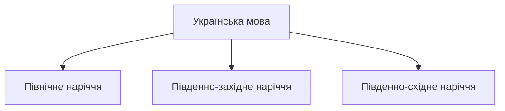
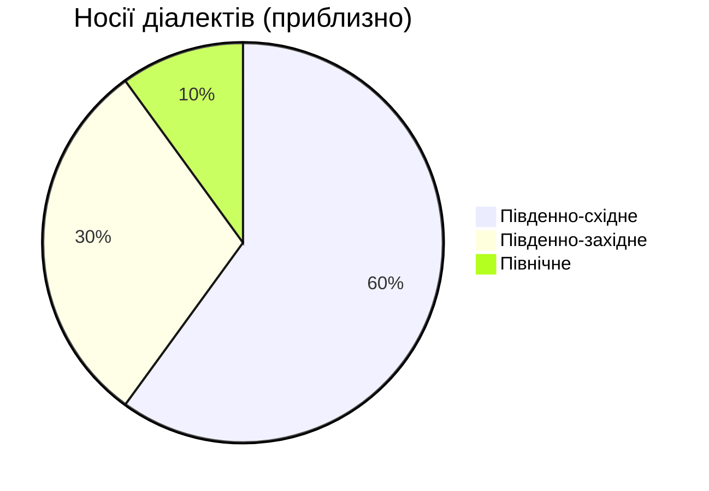
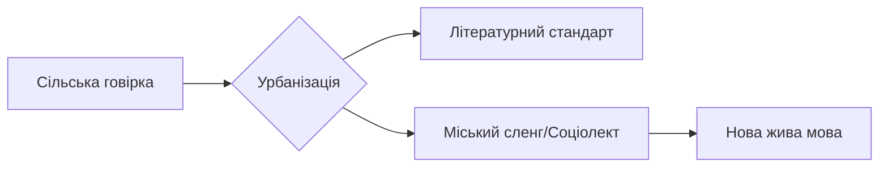

# Діалекти та наріччя

Українська мова — це не моноліт. Як і будь-яка жива мова з великою територією поширення, вона має свої регіональні відтінки. Від густих лісів Полісся до гір Карпат і степів Таврії — українська мова звучить по-різному, але це **одна й та сама мова**.

> [!tip]
> **Не бійтеся діалектів!**
> Якщо у Львові ви почуєте "філіжанка кави", а в Полтаві — "чашка кави", це не помилка. Це багатство мови. Літературна норма (стандарт) об'єднує нас, а діалекти додають кольору.

## Розминка

1.  Чи чули ви, як говорять люди в Карпатах?
2.  Чим відрізняється мова ваших родичів у селі від мови телебачення?
3.  Чому слово "суржик" має негативний відтінок?

## 1. Карта української мови

Лінгвісти ділять українські говори на три великі групи (наріччя):

### Північне наріччя (Полісся)

Це територія давніх лісів (Рівненщина, Житомирщина, Чернігівщина).

- **Особливість:** Збереження давніх форм. Тут можна почути дифтонги (подвійні звуки) на місці "О" та "Е".
- **Приклад:** *Вуіл* (віл), *куінь* (кінь).
- **Твердість:** "Р" часто вимовляється твердо: *буря* звучить як *бура*.

### Південно-західне наріччя (Захід)

Найбільш строкате. Гори (Карпати) сприяли ізоляції сіл, тому тут найбільше відмінностей.

- **Гуцули, Бойки, Лемки:** Кожна етнографічна група має свою говірку.
- **Лексика:** Багато запозичень з польської, німецької, угорської (через історію Австро-Угорщини).
- **Приклади:**
  - *Кобіта* (жінка)
  - *Дефиляда* (прогулянка/парад)
  - *Небіж* (племінник)

> [!culture]
> **"Тіні забутих предків":**
> Фільм Сергія Параджанова — це пам'ятник гуцульському діалекту. Актори вчилися розмовляти "по-гуцульськи", щоб передати магію Карпат. Якщо ви подивитеся його в оригіналі, вам, можливо, знадобляться субтитри навіть зі знанням української!

### Південно-східне наріччя (Центр і Схід)

Це база літературної мови.

- **Наддніпрянщина (Полтава, Київ, Черкаси):** Саме ця говірка лягла в основу творів Шевченка та Котляревського. Вона найближча до того, що ви вчите в підручниках.
- **Слобожанщина (Харків) та Степ (Одеса, Херсон):** Тут говори пізнього заселення, вони більш однорідні, але мають вплив русифікації.

## Соціолінгвістичний аналіз

Суржик — це не діалект. Це **суміш**.

> [!important]
> **Визначення:**
> Спочатку "суржиком" називали суміш жита і пшениці (борошно низької якості). Сьогодні це мовлення, де українська граматика змішана з російськими словами.
>
> - **Діалект:** Має історію століть, має свої правила. Це "чиста вода" з іншим смаком.
> - **Суржик:** Виник через травму русифікації. Це "брудна вода".

> [!example]
> **Анатомія Суржику:**
>
> - *Суржик:* "Я *поняв*, шо нада *робить*". (Русизми: поняв, нада).
> - *Літературна:* "Я *зрозумів*, що треба *робити*".
> - *Суржик:* "Давай *поговорим*". (Російське закінчення).
> - *Літературна:* "Давай *поговоримо*".

Але не все так однозначно. Сучасна література (наприклад, п'єси Леся Подерв'янського) використовує суржик як художній прийом, щоб показати реальне життя "пострадянської" людини.

> [!culture]
> **Вєрка Сердючка: Королева Суржику**
> Андрій Данилко створив образ провідниці Вєрки Сердючки, яка говорить "полтавським суржиком". Вона стала народною героїнею, бо говорила мовою мільйонів. Це був сміх крізь сльози, який допоміг українцям прийняти своє реальне мовне становище і почати шлях до літературної норми.

Сміятися з суржику можна, але говорити ним на іспиті — ні.

## 3. Історія мови: Від Русі до Імперії

Українська мова не виникла "раптом". Це прямий нащадок розмовної мови Київської Русі.

> [!myth-buster]
> **Міф:** "Російська, українська і білоруська вийшли з однієї колиски".
> **Реальність:** Це радянський міф. Українська мова сформувалася окремо на базі південних говорів Русі. Вже в 11 столітті на графіті Софії Київської ми бачимо типові українські риси (закінчення -ові, кличний відмінок "Боже", літеру "і" замість "є"). Вона ближча до білоруської та польської, ніж до російської.

### Лінгвоцид: Хроніки знищення

Протягом століть українську мову намагалися вбити понад 130 разів.

1.  **Валуєвський циркуляр (1863):**
    > "Ніякої окремої малоросійської мови не було, немає і бути не може".
    > *(Ця фраза стала символом імперської політики).*
    > Заборона друкувати релігійні та навчальні книги.
2.  **Емський указ (1876):** Заборона ввезення книг з-за кордону, заборона театру та навіть нот з українськими текстами.
3.  **Русифікація шкіл (ХХ ст.):** У СРСР вчителям російської платили вищу зарплату (+15%), ніж вчителям української. Це був економічний тиск, щоб батьки віддавали дітей у російські класи.

Ця травма пояснює, чому сьогодні мовне питання таке гостре. Це питання виживання.

> [!important]
> **Визначення:**
> Спочатку "суржиком" називали суміш жита і пшениці (борошно низької якості). Сьогодні це мовлення, де українська граматика змішана з російськими словами.
>
> - **Діалект:** Має історію століть, має свої правила. Це "чиста вода" з іншим смаком.
> - **Суржик:** Виник через травму русифікації. Це "брудна вода".

> [!example]
> **Анатомія Суржику:**
>
> - *Суржик:* "Я *поняв*, шо нада *робить*". (Русизми: поняв, нада).
> - *Літературна:* "Я *зрозумів*, що треба *робити*".
> - *Суржик:* "Давай *поговорим*". (Російське закінчення).
> - *Літературна:* "Давай *поговоримо*".

Але не все так однозначно. Сучасна література (наприклад, п'єси Леся Подерв'янського) використовує суржик як художній прийом, щоб показати реальне життя "пострадянської" людини. Вєрка Сердючка зробила суржик своїм брендом. Сміятися з суржику можна, але говорити ним на іспиті — ні.

## 3. Боротьба за Стандарт

Як говірка стає Мовою? Через **стандартизацію**.

### "Скрипниківка" (1928)

У 20-х роках, під час українізації, у Харкові зібралися провідні мовознавці. Вони ухвалили **Харківський правопис** (так звану "скрипниківку"). Цей правопис був максимально українським і враховував особливості як Сходу, так і Заходу.

- Писали *лямпа*, *етер*, *Атени* (Афіни), *проєкт*.
- Вживання літери **Ґ**.

### Радянський терор (1933)

Сталін зрозумів, що окрема мова веде до окремої нації. У 1930-х правопис 1928 року заборонили, назвавши його "націоналістичним". Мовознавців розстріляли (Розстріляне відродження). Новий правопис 1933 року був штучно наближений до російського.

- Літеру **Ґ** викинули з абетки.
- *Етер* став *ефір* (як у російській).
- *Лямпа* стала *лампа*.

> [!dialogue]
> **Урок історії:**
> — Вчителю, а чому літеру "Ґ" заборонили? Вона ж просто літера.
> — Ні, Петре. Вона була символом. Коли влада хоче знищити націю, вона починає зі словників. Якщо ми говоримо як вони, значить ми і є вони. А "Ґ" кричала про те, що ми інші.
> — То це була літера-дисидент?
> — Можна й так сказати. Її репресували разом з людьми.

> [!history-bite]
> **Повернення репресованої літери:**
> Літера **Ґ** повернулася в абетку лише в 1990 році, перед Незалежністю. Сьогодні правопис 2019 року частково повертає норми 1928 року (проєкт, етер, Атени), відновлюючи історичну справедливість.

### Правопис 2019: Повернення до коренів

Нова редакція правопису — це не примха, а деколонізація мови. Ми повертаємо ті риси, які були штучно знищені радянською владою, щоб зробити українську мову схожою на російську.

1.  **Фемінітиви:** Тепер офіційно: *директорка, міністерка, фахівчиня*. Це повернення до норми української мови, де жіночий рід для професій був завжди (згадайте "кравчиню" чи "майстриню").
2.  **Йот кардинал:** *Проєкт, проєкція* (як *об'єкт, траєкторія*).
3.  **Варіативність:** Можна писати *аудиторія* і *авдиторія*, *пауза* і *павза*, *ефір* і *етер*. Мова в процесі зцілення, тому дозволено обидва варіанти.

> [!culture]
> **Новий правопис в дії:**
>
> - *Аудиторія* -> *Авдиторія* (повернення до латини).
> - *Кафедра* -> *Катедра* (грецьке *th* -> *т*).
> - *Міфологія* -> *Мітологія*.
>   Ці форми не є обов'язковими, але вони стають маркером освіченості та свідомого вибору.

> [!tip]
> **Індики та Ирій:**
> Правопис дозволив писати "и" на початку деяких слів: *ирій, икати*. Це не помилка, але поки що звучить незвичнно для багатьох.

## 5. Діаспора: Від Канади до Бразилії

Історія діалектів триває за океаном. Українці, які виїхали за кордон 100 років тому, забрали мову з собою. Вона "законсервувалася".

### Канадська українська

Канадська українська — це унікальний феномен. Це суміш галицьких діалектів початку 20 століття та англійських слів.

- *Трок* (трак) — вантажівка.
- *Гарія* (ерія) — район.
- *Кар* (кар) — машина.
  Але при цьому вони кажуть *нанашко* (хрещений батько) і *ґазда*, слова, які в сучасному Києві вже забули.

### Українці у тропіках (Бразилія та Аргентина)

У штаті Парана (Бразилія) живе понад 500 тисяч нащадків українців. Їхня мова ще цікавіша, бо вона збереглася майже без впливу англійської чи російської. Вони говорять так, як говорили їхні прадіди в Галичині у 1891 році. Часто вони називають себе "наші люди", а мову — "наша мова".

> [!context]
> **Прудентополіс — стовп українства:**
> У бразильському місті Прудентополіс 75% населення має українське коріння. Там українська мова є другою офіційною! На вулицях можна почути галицьку говірку, а в церквах служать греко-католицькі літургії. Це живий музей мови.

## 6. Трагедія говірок: Операція "Вісла"

Діалекти зникають не тільки через інтернет, а й через злочини.
У 1947 році комуністична влада Польщі та СРСР провела операцію "Вісла". Тисячі лемків та бойків були примусово виселені зі своїх гірських домівок і розкидані по степах Сходу України та Польщі.
Люди втратили не тільки дім, а й мовне середовище. Опинившись в оточенні інших говорів, вони були змушені адаптуватися. Тому сьогодні лемківський говір здебільшого зберігся лише в піснях (згадайте "Пливе кача по Тисині").

> [!history-bite]
> **"Пливе кача":**
> Ця лемківська народна пісня стала гімном прощання з героями Небесної Сотні. Вона нагадує нам про трагічну долю українців, які завжди мусили боротися за право бути собою на своїй землі.

## 7. Мова і війна

Війна змінила ставлення до мови. Вона перестала бути просто засобом комунікації і стала засобом оборони.

### Шиболет: Тест на "свого"

Біблійний термін "шиболет" (пароль, який видає іноземця) став реальністю в Україні. Слова *паляниця, полуниця, білизнА* стали непереборним бар'єром для російських диверсантів. Їхній мовний апарат, звиклий до твердих звуків, не може відтворити м'яку українську фонетику. Це не жарт, а реальний спосіб перевірки на блокпостах у перші дні вторгнення.

### Лагідна українізація

Мільйони людей, які все життя говорили російською, добровільно перейшли на українську. Це не примус закону, а поклик сумління. "Я не хочу говорити мовою вбивць" — це найпоширеніший аргумент. Російська мова в Україні стала токсичною.

> [!narrative]
> **Мовний бар'єр для окупантів:**
> Існує безліч історій про те, як російські солдати плутали українські діалекти з іноземними мовами. В одному селі місцева бабуся так швидко говорила гуцульською говіркою, що окупанти вирішили, ніби тут базується "польський спецназ". Вони доповіли командуванню про "найманців НАТО". Діалект став природним шифруванням, яке не здатен зламати жоден алгоритм.

## 8. Лексичне багатство

Чому важливо знати синоніми? Щоб не звучати як робот.

> [!tip]
> **Львівський етикет:**
> У Львові ви часто почуєте звертання "Прошу пані" або "Прошу пана". Це ввічлива форма, яка збереглася з часів Австро-Угорщини. Також тут кажуть "Дякую гарно" замість простого "Дякую". Знання цих дрібниць відкриває двері до серця львів'ян (і до найкращої кави у місті).

<table>
  <thead>
    <tr>
      <th>Літературне (нейтральне)</th>
      <th>Діалектне / Розмовне</th>
      <th>Регіон</th>
    </tr>
  </thead>
  <tbody>
    <tr>
      <td>Картопля</td>
      <td>Бараболя, бульба, крумплі</td>
      <td>Поділля, Волинь, Закарпаття</td>
    </tr>
    <tr>
      <td>Велосипед</td>
      <td>Ровер, біціґлі</td>
      <td>Галичина, Закарпаття</td>
    </tr>
    <tr>
      <td>Пательня (сковорідка)</td>
      <td>Рондель, тиган</td>
      <td>Захід, Південь</td>
    </tr>
    <tr>
      <td>Ковдра</td>
      <td>Ліжник (вовняний)</td>
      <td>Карпати</td>
    </tr>
    <tr>
      <td>Дядько</td>
      <td>Вуйко</td>
      <td>Галичина</td>
    </tr>
  </tbody>
</table>

> [!dialogue]
> **Бульба чи Картопля?**
> — Бабусю, що сьогодні на обід?
> — Та от, наварила бульби, посолила, дала кропу.
> — Бабусю, у школі кажуть "картопля".
> — То у школі! А в нас, у горах, споконвіку була бульба. Їж, поки гаряча!
> *(Діалект — це мова дому і любові).*

> [!context]
> **Галицька "Ґвара":**
> У Львові існує свій міський сленг — "ґвара". Це суміш української, польської та ідиш.
>
> - "Ходи на каву!" — це святий ритуал.
> - "Маєш рацію" — прийшло з польської і стало літературною нормою, витіснивши кальку "ти правий".

## Приклади вживання діалектизмів

1.  *Файно* (добре): "Як твої справи?" — "Файно!"
2.  *Кобіта* (жінка): "Та кобіта знає все на світі."
3.  *Коліжанка* (подруга): "Ми з коліжанкою йдемо на каву."
4.  *Філіжанка* (чашка): "Замов мені філіжанку еспресо."
5.  *Здибанка* (зустріч): "Маємо сьогодні родинну здибанку."
6.  *Обійстя* (двір): "У них гарне, доглянуте обійстя."
7.  *Плай* (стежка в горах): "Ми йшли крутим плаєм."
8.  *Ватра* (вогнище): "Ввечері запалимо ватру і будемо співати."
9.  *Бульба* (картопля): "Бульба вже зварилася?"
10. *Спузар* (вівчар, який підтримує ватру): "Спузар всю ніч не спав."

## 9. Майбутнє діалектів

Чи зникнуть діалекти в епоху інтернету? Лінгвісти кажуть: ні, вони трансформуються. Сільські говірки стають менш виразними, але з'являються нові міські соціолекти. Молодь з Харкова, Одеси та Києва творить нову живу українську мову, яка вбирає в себе риси всіх регіонів. Це природний процес еволюції нації, яка нарешті здобула свій голос.

> [!myth-buster]
> **Міф: "Діалекти помирають"**
> **Реальність:** Вони трансформуються. Сільські говірки стають менш виразними, але з'являються нові міські соціолекти. Молодь з Харкова, Одеси та Києва творить нову живу українську мову, яка вбирає в себе риси всіх регіонів. Це природний процес еволюції нації, яка нарешті здобула свій голос.

## Первинні джерела

> [!quote]
> **Іван Огієнко (Митрополит Іларіон):**
> "Мова — це форма нашого життя, життя культури й національної свідомості, це форма національного організування. Поки живе мова — житиме й народ як національність."
> *(Огієнко був одним з творців правопису та перекладачем Біблії).*

> [!quote]
> **Ліна Костенко:**
> "Нації вмирають не від інфаркту. Спочатку їм відбирає мову."
> *(Ці слова стали гаслом мовного спротиву).*

## 6. Мова і війна

Війна 2022 року стала каталізатором змін. Мільйони українців, які раніше говорили російською, перейшли на українську. Це називають "лагідною українізацією" або "мовним фронтом".

- **Маркер "свій-чужий":** Слово *паляниця* стало шиболетом (мовним паролем), який не можуть вимовити російські окупанти через відмінності у фонетиці (м'яке "ц" і "и").
- **Відмова від контенту:** Українці масово відмовилися від російської музики та блогерів. YouTube українізувався швидше, ніж будь-яка державна програма.
- **Діалекти на фронті:** Військові часто використовують діалектизми для шифрування переговорів. Гуцульська говірка для непідготовленого ворога звучить як іноземна мова.

> [!quote]
> **Павло Вишебаба (військовий, поет):**
> "Мова — це кордон, який проходить через серце кожного з нас. Коли ми переходимо на українську, ми будуємо стіну, яку ворог не перейде."

# Підсумок

Мова — це живий організм.

1.  **Діалекти** живлять мову, це її коріння. Не соромтеся бабусиних слів.
2.  **Суржик** — це хвороба росту, яку треба лікувати освітою, а не агресією.
3.  **Стандарт** потрібен для держави, але вдома говоріть так, як вам тепло.

## Потрібно більше практики?

- [ ] **Відео:** Знайдіть на YouTube відео "Гуцульська говірка". Спробуйте зрозуміти хоча б 50%.
- [ ] **Кіно:** Подивіться "Думки мої тихі". Там чудово показано закарпатський колорит і суржик.
- [ ] **Читання:** Прочитайте будь-яке оповідання Василя Стефаника. Це шедеври, написані покутським діалектом (і це буде виклик для вашого C1!).

> [!resources]
>
> - [Словник української мови (СУМ)](http://sum.in.ua) (Академічний тлумачний словник)
> - [Діалектологічна карта України](https://dialects.r2u.org.ua/) (Інтерактивний атлас)
> - [Mova ДНК нації](https://ukr-mova.in.ua/) (Освітній проєкт)
