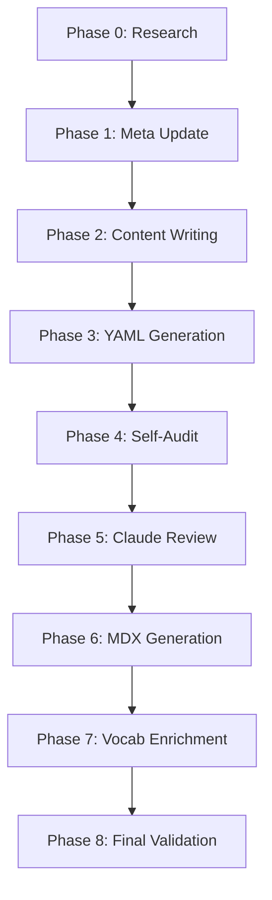

# Orchestration Workflow Guide

This document describes the 9-phase automated orchestration workflow used for rebuilding and generating the Ukrainian curriculum. It covers how agents (Gemini and Claude) cooperate, how state is managed, and how to troubleshoot common issues.

---

## 1. The 9-Phase Workflow

The orchestration process follows a strict sequential pipeline to ensure high quality and pedagogical consistency.



### Phase Details

| Phase | Responsibility | Inputs | Outputs |
|-------|----------------|--------|---------|
| **0. Research** | Gemini | Topic/Slug | `research/{slug}-research.md` |
| **1. Meta Update** | Gemini | Research, Plan | `meta/{slug}.yaml` |
| **2. Content Writing** | Gemini | Research, Meta | `{slug}.md` |
| **3. YAML Gen** | Gemini | Content | `activities/{slug}.yaml`, `vocabulary/{slug}.yaml` |
| **4. Self-Audit** | Gemini | All Files | `audit/{slug}-audit.log` |
| **5. Claude Review** | Claude | All Files | `review/{slug}-review.md` |
| **6. MDX Gen** | Pipeline | Content, YAMLs | `docusaurus/docs/{level}/module-XX.mdx` |
| **7. Vocab Enrich** | Gemini | Vocab YAML | Enriched `vocabulary/{slug}.yaml` |
| **8. Final Validation**| Pipeline | MDX, HTML | Validation Reports |

---

## 2. State Detection & Resumption

The orchestrator (`scripts/batch_fix_review.py` or `/full-rebuild` command) auto-detects the current state of a module to avoid redundant work.

### Skip Logic
- **Phase 0-3**: Skipped if corresponding files (`research/*.md`, `meta/*.yaml`, `*.md`, `activities/*.yaml`) already exist and meet basic quality gates (e.g., word count).
- **Phase 4**: Skipped if a passing audit log exists and is newer than the source files.
- **Phase 5**: Skipped if a `PASS` result is found in the review file.

### Forcing Rebuilds
Use the following flags to override state detection:
- `--refresh`: Regenerate meta and activities even if they exist.
- `--from=PHASE`: Force resumption from a specific phase (e.g., `--from=content`).
- `--force`: Ignore all existing state and start from Phase 0.

---

## 3. Cooperative Protocol (Claude & Gemini)

### Review Protocol
1. **Gemini** completes Phase 4 and sends a `REVIEW_REQUEST` to the message broker.
2. **Claude** receives the request, reads the files on disk, and runs the `v4` review protocol.
3. **Claude** saves the report to `review/{slug}-review.md` and sends a `REVIEW_RESULT` back.
4. If **FAIL**, Gemini reads the report, fixes the issues, and re-requests review (max 2 rounds).

### Help Protocol
If Gemini gets stuck (e.g., audit failing 3 times), it can send a `HELP_REQUEST` to Claude. Claude provides specific actionable suggestions to resolve the blocker.

---

## 4. Troubleshooting

### Common Errors

| Error | Cause | Solution |
|-------|-------|----------|
| **Turn Limit Hit** | Agent looped too many times (default: 8-10 turns). | Check logs, fix the underlying issue manually, or restart with a fresh session. |
| **Context Exhaustion** | Discussion history became too large. | The orchestrator uses fresh sessions per phase to minimize context. Ensure files are saved to disk. |
| **Audit Loop** | Gemini keeps failing the same audit gate (e.g., richness). | Use `/explain-decision` or ask Claude for help. Manually expand content if needed. |
| **Rate Limits** | Too many API requests. | The watcher daemon handles backoff. Wait for the cooldown period. |

### Stuck Reports
When a task fails repeatedly, the watcher daemon saves a "stuck report" to `curriculum/l2-uk-en/{level}/stuck/{slug}.md`.

**Example Stuck Report:**
```markdown
# Stuck: knyahynia-olha
Task ID: 20260201-12345
Turns used: 10/10
Last phase: Phase 4 (self-audit)
Last message: "Audit still failing on richness gate (92% < 95%)"
Remaining work: Need more cultural references in the "Legacy" section.
```

---

## 5. Examples

### Successful Run
```text
[Orchestrator] Starting M05: knyahynia-olha
[Phase 0] Research exists. Skipping.
[Phase 1] Meta updated.
[Phase 2] Content written (3200 words).
[Phase 3] YAMLs generated.
[Phase 4] Audit PASS.
[Phase 5] Claude Review: PASS (9.5/10)
[Phase 6] MDX Generated successfully.
[Orchestrator] M05 COMPLETE.
```

### Failed Run (Audit Loop)
```text
[Orchestrator] Starting M08: yaroslav-mudryi
[Phase 4] Audit FAIL: Word count 2400 < 3000.
[Phase 4] Gemini Attempt 1: Expanding content...
[Phase 4] Audit FAIL: Word count 2800 < 3000.
[Phase 4] Gemini Attempt 2: Adding more examples...
[Phase 4] Audit FAIL: Word count 2950 < 3000.
[Phase 4] Gemini Attempt 3: Adding cultural moment...
[Phase 4] Audit FAIL: Word count 2950 < 3000 (No change detected).
[Orchestrator] STUCK: yaroslav-mudryi (Audit Loop). Stuck report saved.
```
