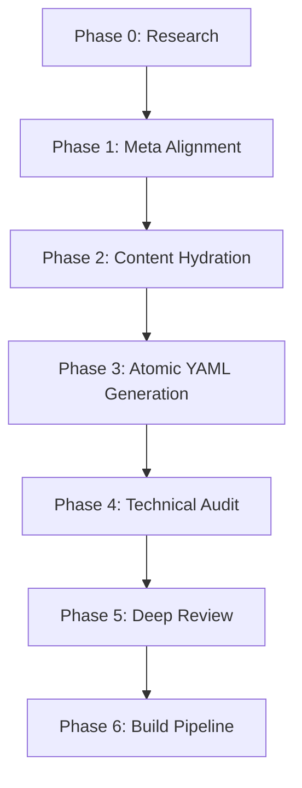
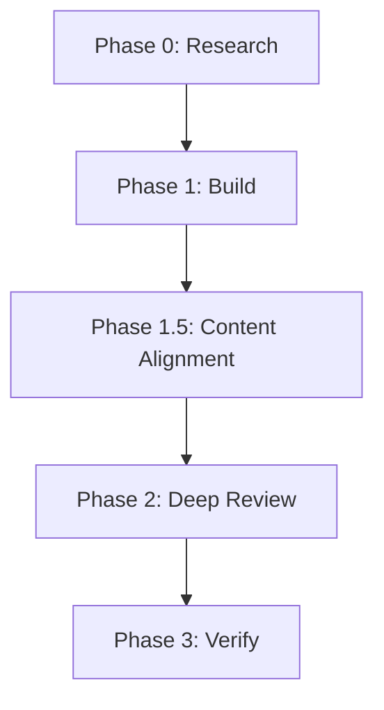

# Orchestration Workflow Guide

This document describes the automated orchestration workflows used for rebuilding and generating the Ukrainian curriculum. It covers the two main pipelines: the 6-phase seminar track and the 4-phase core track.

---

## 1. Seminar Track Full-Rebuild (6 Phases)

Used for `b2-hist`, `c1-bio`, `c1-hist`, `lit`, `oes`, and `ruth`.

### Phase Details (Seminar)

| Phase | Description | Key Output |
|-------|-------------|------------|
| **0. Research** | Academic search (site:esu.com.ua, etc.). Ukrainian sources only. | `research/{slug}-research.md` |
| **1. Meta Alignment** | Match `word_target`, refactor `content_outline`. | `meta/{slug}.yaml` |
| **2. Content Hydration** | Write to 1.5x overshoot. Integrate all researched facts. | `{slug}.md` |
| **3. YAML Gen** | Create enriched vocabulary and pedagogical activities. | `vocabulary/*.yaml`, `activities/*.yaml` |
| **4. Technical Audit** | Run `scripts/audit_module.sh`. All gates must pass. | `audit/{slug}-audit.log` |
| **5. Deep Review** | Rigorous scoring on 14 dimensions (v4 protocol). | `review/{slug}-review.md` |
| **6. Build Pipeline** | Generate MDX and confirm PASS in status JSON. | `module-XX.mdx` |

---

## 2. Core Track Full-Rebuild (4 Phases)

Used for `a1`, `a2`, `b1`, `b2`, `c1`, `c2`, `b2-pro`, and `c1-pro`.

### Phase Details (Core)

| Phase | Description | Key Output |
|-------|-------------|------------|
| **0. Research** | Moderate research with State Standard §reference. | `research/{slug}-research.md` |
| **1. Build** | Delegate to `/module` for 7-phase build + audit loop. | `{num_padded}-{slug}.md`, YAMLs |
| **1.5 Alignment** | Ensure every research finding is reflected in prose. | Updated `.md` |
| **2. Deep Review** | Review-content-v4 (Core B) or Core A protocol. | `review/{slug}-review.md` |
| **3. Verify** | Final audit confirmation and status check. | `status/{slug}.json` |

---

## 3. State Detection & Resumption

The orchestrator (`scripts/batch_fix_review.py` or `/full-rebuild` commands) auto-detects the current state of a module to avoid redundant work.

- **Idempotency**: Commands can be re-run across sessions.
- **Skip Logic**: Phases are skipped if corresponding outputs exist and meet quality gates.
- **Review Exception**: Phase 2 (Review) in core tracks **NEVER** skips to ensure the latest prompt is always used.

### Resumption Flags
- `--from=PHASE`: Force start from a specific phase (e.g., `--from=review`).
- `--refresh`: Regenerate meta and activities while preserving markdown content.

---

## 4. Troubleshooting

### Common Errors

| Error | Cause | Solution |
|-------|-------|----------|
| **Turn Limit Hit** | Agent looped too many times (default: 8-10 turns). | Check logs, fix the underlying issue manually, or restart with a fresh session. |
| **Audit Loop** | Gemini keeps failing the same audit gate (e.g., richness). | Use `/explain-decision` or ask Claude for help. Manually expand content if needed. |
| **Stuck Message** | Message sitting unprocessed in broker. | Restart watcher: `scripts/agent_watcher.py --stop` then `--daemon`. |

### Stuck Reports
If a task hits the turn limit, a report is saved to `curriculum/l2-uk-en/{level}/stuck/{slug}.md`.
