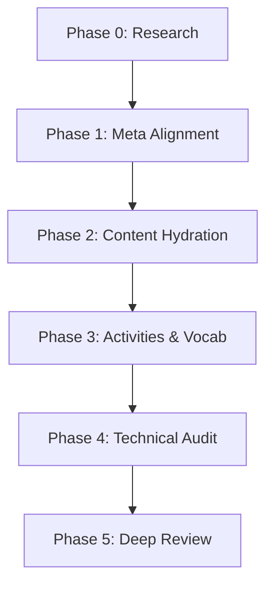
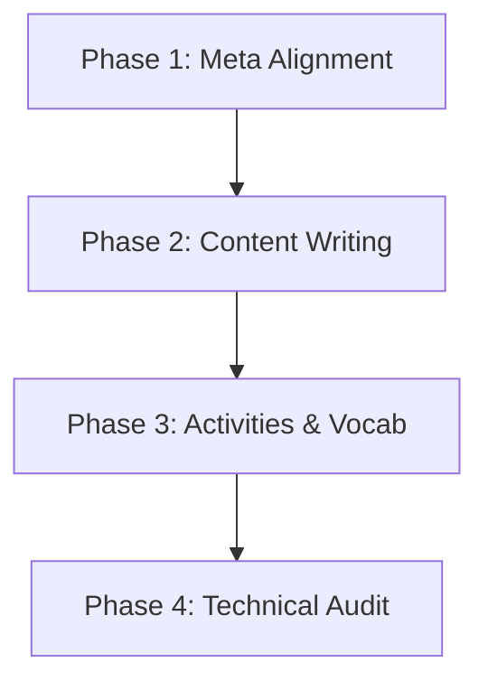

# Orchestration Workflow Guide

This document describes the automated orchestration workflows used for rebuilding and generating the Ukrainian curriculum.

---

## 1. Seminar Track Pipeline (6 Phases)

Used for `b2-hist`, `c1-bio`, `c1-hist`, `lit`, `oes`, and `ruth`.

### Phase Details (Seminar)

| Phase | Description | Output |
|-------|-------------|--------|
| **0. Research** | Academic search using Ukrainian sources only. | `research/{slug}-research.md` |
| **1. Meta** | Alignment with plan `word_target` and outline. | `meta/{slug}.yaml` |
| **2. Content** | Writing with 1.5x overshoot and fact integration. | `{slug}.md` |
| **3. Activities** | Generation of YAML activities and vocabulary. | `activities/*.yaml`, `vocabulary/*.yaml` |
| **4. Audit** | Technical gate validation via `audit_module.py`. | `audit/{slug}-audit.log` |
| **5. Review** | Rigorous quality scoring using the v4 protocol. | `review/{slug}-review.md` |

---

## 2. Core Track Pipeline (4 Phases)

Used for `a1`, `a2`, `b1`, `b2`, `c1`, `c2`, `b2-pro`, and `c1-pro`.

*Note: In Core tracks, Research and Review are often integrated into the build phases or handled as separate checkpoints depending on the specific rebuild command used.*

---

## 3. State Detection & Resumption

The orchestration tools auto-detect the current state of a module to avoid redundant work.

- **Skip Logic**: A phase is skipped if its output file exists and meets quality requirements.
- **Review Protocol**: In Core tracks, the review phase often re-runs to ensure the latest pedagogical standards are applied.

### Commands
- `/full-rebuild {track} {num}`: Seminar track rebuild.
- `/full-rebuild-core {level} {num}`: Core track rebuild.
- `/orchestrate-rebuild {track} {num}`: Claude-orchestrated step-by-step rebuild.

---

## 4. Troubleshooting

| Issue | Cause | Solution |
|-------|-------|----------|
| **Turn Limit** | Agent looped too many times. | Fix the specific audit failure manually. |
| **Stuck Message** | Watcher daemon is idle. | Restart: `scripts/agent_watcher.py --daemon`. |
| **Context Full** | History is too large. | Orchestration uses fresh sessions per phase to avoid this. |

If a task fails, a stuck report is saved to `curriculum/l2-uk-en/{level}/stuck/{slug}.md`.
