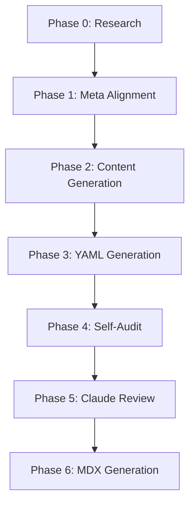

# Orchestration Workflow

This document describes the end-to-end orchestration workflow for building and rebuilding curriculum modules.

## Overview

The orchestration workflow is a multi-phase process that takes a module from initial research to a fully validated, production-ready lesson. It is designed to ensure high quality through automated audits and expert AI reviews.

## The 7-Phase Workflow

The standard pipeline follows these seven phases:



### Phase 0: Research
- **Agent:** Gemini
- **Action:** Web-searches historical figures, grammatical rules, or cultural topics.
- **Output:** `research/{slug}-research.md`
- **Requirement:** Minimum 3 sources, key dates, and structured notes.

### Phase 1: Meta Alignment
- **Agent:** Gemini
- **Action:** Aligns `meta/{slug}.yaml` with the curriculum plan and research.
- **Output:** Updated `meta/{slug}.yaml` with content outlines and word targets.

### Phase 2: Content Generation
- **Agent:** Gemini
- **Action:** Writes the full module content in Markdown (`{slug}.md`) using research and meta specifications.
- **Requirement:** Must meet at least 95% of the `word_target`.

### Phase 3: YAML Generation
- **Agent:** Gemini
- **Action:** Generates `vocabulary/{slug}.yaml` and `activities/{slug}.yaml`.
- **Requirement:** Enriched vocabulary items with IPA and varied activity types.

### Phase 4: Self-Audit
- **Agent:** Gemini / Automated Script
- **Action:** Runs `scripts/audit_module.sh`.
- **Logic:** Gemini fixes any failing gates until the audit passes.

### Phase 5: Claude Review
- **Agent:** Claude
- **Action:** Performs a deep pedagogical and linguistic review (v4 protocol).
- **Output:** `review/{slug}-review.md`
- **Goal:** Score ≥ 9.0/10.

### Phase 6: MDX Generation
- **Action:** Runs the build pipeline to generate production MDX.
- **Command:** `npm run pipeline l2-uk-en {level} {num}`

---

## State Detection & Resuming

The orchestration system (via `/module` or `/full-rebuild`) automatically detects completed phases by checking for the existence and validity of output files.

### Resuming from a specific phase:
You can force the workflow to start from a specific phase using the `--from` flag:

| Flag | Starts at | Use Case |
|------|-----------|----------|
| `--from=meta` | Phase 1 | Plan changed, need new meta. |
| `--from=lesson` | Phase 2 | Content needs full rewrite. |
| `--from=act` | Phase 3 | Activities/Vocab need regeneration. |
| `--from=audit` | Phase 4 | Manual fix applied, needs re-audit. |
| `--from=review` | Phase 5 | Audit passes, needs fresh review. |

---

## Troubleshooting

### Common Failures

| Issue | Phase | Fix |
|-------|-------|-----|
| Word count too low | Phase 4 | Expand explanations or add more examples in Phase 2. |
| Naturalness score < 8 | Phase 4 | Rewrite problematic sections to sound more native. |
| Missing activity types | Phase 4 | Add missing types specified in `meta.yaml` to `activities.yaml`. |
| Claude score < 9.0 | Phase 5 | Read the review file and apply specific fixes recommended by Claude. |

### Examples

#### Successful Run
```bash
/module b2-hist 5
# Phase 0: OK
# Phase 1: OK
# Phase 2: OK
# Phase 3: OK
# Phase 4: PASS
# Phase 5: PASS (9.2/10)
# Phase 6: DEPLOYED
```

#### Failed Audit (Phase 4)
```bash
/module b2-hist 5
# Phase 4: FAIL (Word count: 2800/3000)
# Gemini: "Expanding content to meet target..."
# Phase 2 (Retry): OK
# Phase 4 (Retry): PASS
```
