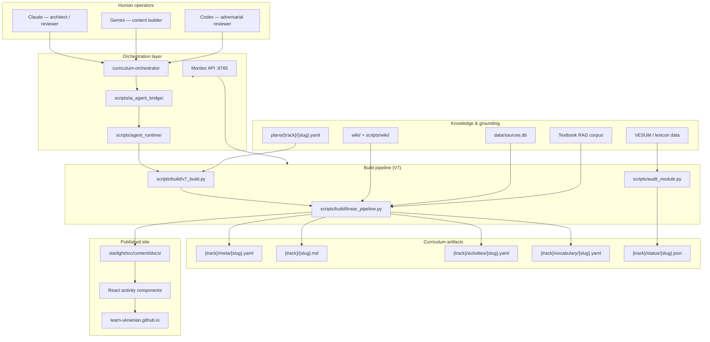
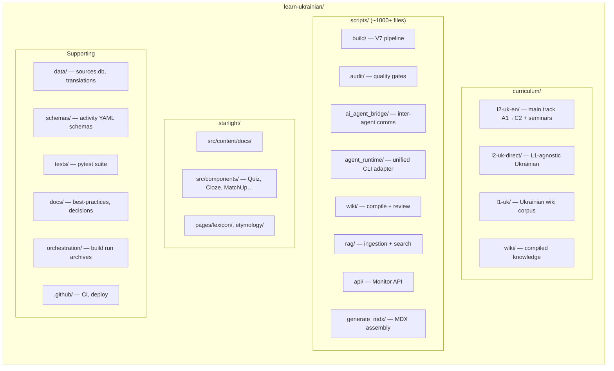
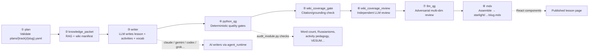
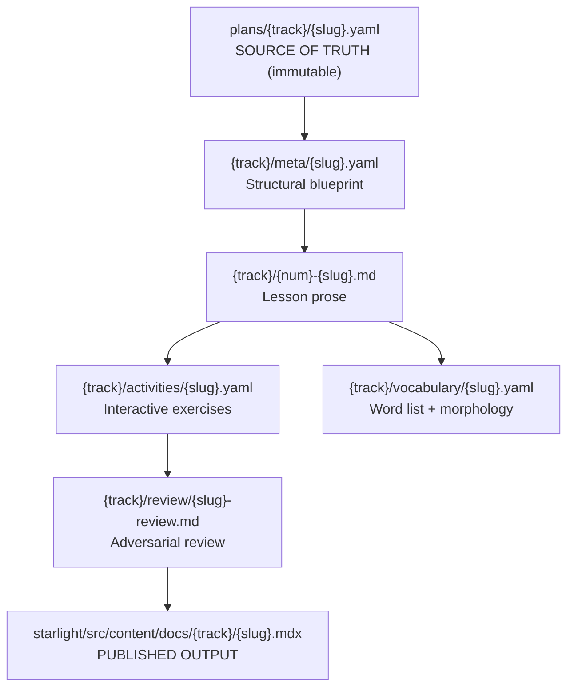
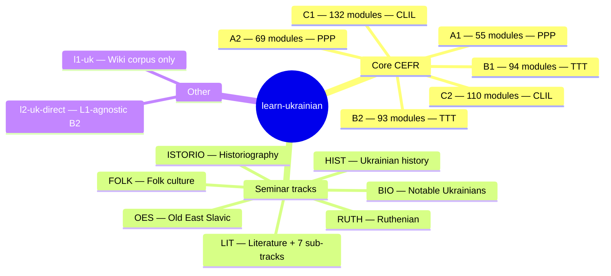
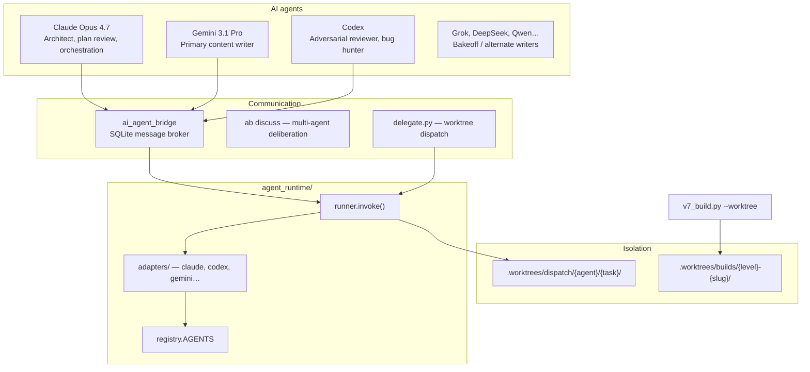
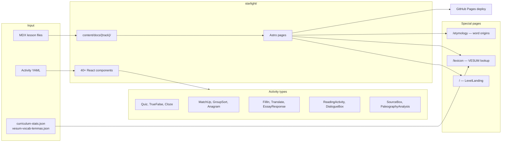
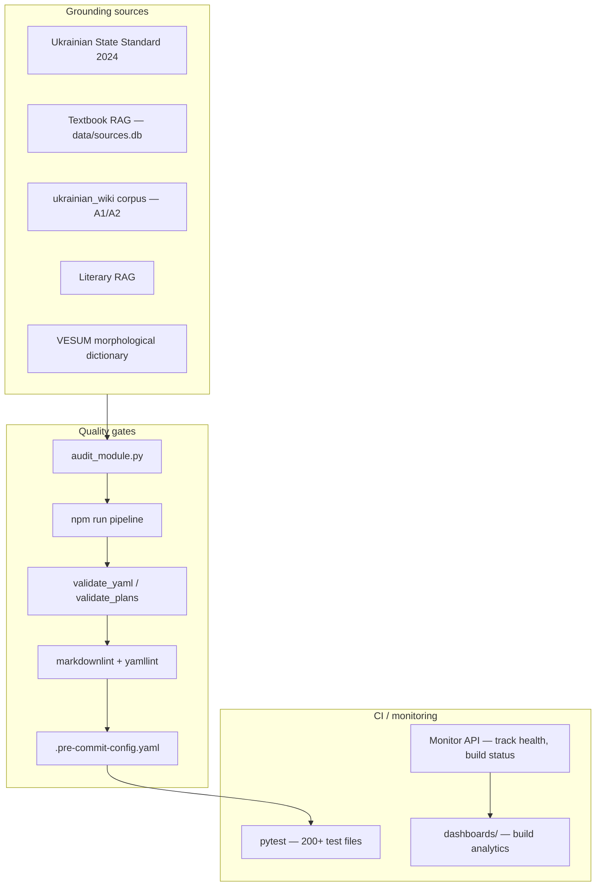

# Codebase Architecture Diagram

> Visual map of the learn-ukrainian repository — curriculum platform, AI content factory, and Starlight publishing site.
>
> Created: 2026-05-23
>
> **HTML version (rendered diagrams):** [`codebase-diagram.html`](codebase-diagram.html)

---

## 1. System Overview

---

## 2. Repository Layout

---

## 3. V7 Module Build Pipeline

Each of the **1,778 modules** flows through this linear pipeline:

### Per-module artifact chain

Inside `curriculum/l2-uk-en/`:

---

## 4. Curriculum Tracks

22 tracks, 1,778 modules:

---

## 5. Multi-Agent Architecture

---

## 6. Frontend (Starlight / Astro)

---

## 7. Data & Validation Layer

---

## Key Takeaways

| Layer | Role |
| --- | --- |
| `curriculum/` | Authoring source — plans, lessons, activities, vocab |
| `scripts/build/` | V7 linear pipeline — plan → writer → QG → MDX |
| `scripts/audit/` | Deterministic quality gates (word counts, pedagogy, Russianisms) |
| `scripts/agent_runtime/` | Single entrypoint for all AI CLI invocations |
| `scripts/ai_agent_bridge/` | Inter-agent messaging and dispatch |
| `starlight/` | Astro site with 40+ interactive React activity components |
| `data/` | RAG corpora, translations, lexicon databases |
| `docs/` | Best practices, architectural decisions, agent protocols |

---

## Related docs

- [`system-topology.md`](system-topology.md) — agent/runtime/bridge wiring (V6-era reference)
- [`v7-pipeline.md`](v7-pipeline.md) — V7 build pipeline details
- [`track-architecture.md`](../best-practices/track-architecture.md) — track/level structure and pedagogy models
- [`agent-runtime-guide.md`](../agent-runtime-guide.md) — `runner.invoke()` mental model
