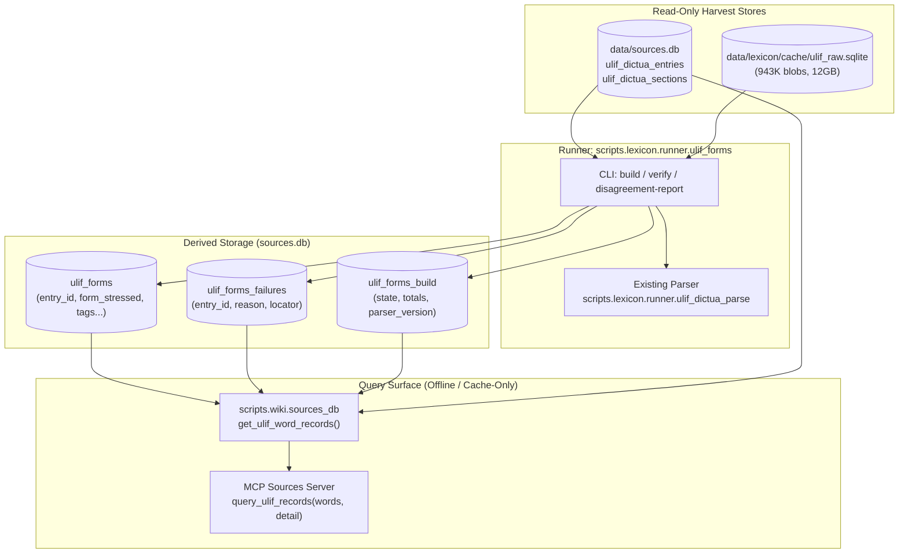

# ULIF Source Records: Architecture and Operator Runbook (#9250)

- **Issue:** #9250 (Full-ULIF source record foundation)
- **Status:** Approved reuse design (frozen packet `ulif-full-record-packet-r2.md`, SHA-256 `4604c06c2fac37f055b20b50d1aef55863dbc090e9a37f598f7e803933c20c86`; advisor Fable GO `atlas-ulif-all-advisor-r2.result`)
- **Companion docs:** [`identity.md`](identity.md), [`schema.md`](schema.md), [`worked-examples.md`](worked-examples.md)
- **Locator grammar:** `ulif:entry:<id>[/section:<id>]` (from [`schema.md`](schema.md) §1)

---

## 1. Executive Summary and Purpose

The ULIF harvesting program captured 262,812 verified dictionary entries and 336,392 section payloads from *«Словники України on-line»* (DictUA). This subsystem exposes **everything** ULIF provides into a unified, source-faithful source record representation without:
1. Collapsing or selecting only the first homonym.
2. Dropping or clipping phraseology, synonyms, antonyms, or unknown section payloads.
3. Guessing, synthesizing, or model-generating Ukrainian dictionary claims, definitions, morphology, or stress.
4. Silently overwriting or backfilling canonical stored entry identity.
5. Masking unbuilt or failed states as "no forms".

This forms the foundational source layer for Atlas word cards (C0/C1), strictly preserving source boundaries and raw provenance.

---

## 2. Architecture and Data Flow



### 2.1 Canonical Read-Only Inputs
- **`data/sources.db`**:
  - `ulif_dictua_entries`: 262,812 verified entries (`homonym_checked=1`) + 6,450 legacy unverified rows (`homonym_checked=0`).
  - `ulif_dictua_sections`: 336,392 verified sections across 4 canonical kinds:
    - `paradigm`: 250,202
    - `synonyms`: 75,954
    - `antonyms`: 2,103
    - `phraseology`: 8,133
- **`data/lexicon/cache/ulif_raw.sqlite`**:
  - Content-addressed SQLite blob store keyed by `sha256:<hex>`. Stores HTTP response manifests (JSON) and compressed HTML pages.
  - Manifest keys map directly to section kinds (`paradigm`, `synonyms`, `antonyms`, `phraseology`). In ULIF DictUA, the `paradigm` tab page is the primary entry page containing headword, grammar label, and inflection tables.

---

## 3. Schema Definitions

The derived tables live in `sources.db` and are initialized idempotently via `scripts.wiki.sources_db.ensure_ulif_dictua_schema(conn)`.

### 3.1 `ulif_forms` Table
Stores parsed paradigm and inflectional rows derived from verified entries:

| Column | Type | Description |
| --- | --- | --- |
| `id` | `INTEGER PRIMARY KEY AUTOINCREMENT` | Internal row id |
| `entry_id` | `INTEGER NOT NULL REFERENCES ulif_dictua_entries(id)` | Foreign key to stored entry |
| `entry_key` | `TEXT NOT NULL` | Parser entry key (e.g. `замок#1`) |
| `form_unstressed` | `TEXT NOT NULL` | Unstressed surface form (indexed) |
| `form_stressed` | `TEXT NOT NULL` | Stressed surface form (combining acute U+0301) |
| `stress_vowel_indices` | `TEXT NOT NULL` | JSON array of 0-based vowel indices under stress |
| `grammatical_tags` | `TEXT NOT NULL` | JSON array of grammatical tags (e.g. `["noun", "inanim", "m", "v_naz"]`) |
| `unmapped_labels` | `TEXT NOT NULL` | JSON array of raw source labels not mapped to canonical tags |
| `variant_order` | `INTEGER NOT NULL DEFAULT 1` | 1-based order for variant forms in the same cell |
| `preposition` | `TEXT NOT NULL DEFAULT ''` | Attested preposition prefix separated from form (e.g. `на`, `в`, `на/в`, `при`, `по`) |
| `marked_asterisk` | `INTEGER NOT NULL DEFAULT 0` | 1 if form was marked with an asterisk in ULIF (rare/archaic) |
| `is_lemma` | `INTEGER NOT NULL DEFAULT 0` | 1 if row represents the dictionary lemma |
| `is_invariable` | `INTEGER NOT NULL DEFAULT 0` | 1 if lexeme is invariable (adverb, interjection, invariant noun) |
| `dual_stress_flag` | `INTEGER NOT NULL DEFAULT 0` | 1 if form exhibits dual stress (stress doublet) |
| `pedagogical_stressed_form` | `TEXT NOT NULL DEFAULT ''` | Standardized pedagogical stressed form for doublets |
| `source_page_sha256` | `TEXT NOT NULL DEFAULT ''` | SHA-256 of the raw paradigm HTML blob parsed |
| `parser_version` | `TEXT NOT NULL` | Parser version string (e.g. `ulif-forms-v2`) |
| `source_entry_fingerprint` | `TEXT NOT NULL DEFAULT ''` | Deterministic SHA-256 fingerprint of source entry columns and sections |

### 3.2 `ulif_forms_failures` Table
Explicit, auditable record of verified entries that could not yield paradigm forms:

| Column | Type | Description |
| --- | --- | --- |
| `entry_id` | `INTEGER PRIMARY KEY` | Stored entry id |
| `reason` | `TEXT NOT NULL` | Failure taxonomy reason code |
| `locator` | `TEXT NOT NULL` | Structured locator (e.g. `ulif:entry:12345`) |

### 3.3 `ulif_forms_build` Table
One-row metadata ledger tracking build lifecycle and integrity:

| Column | Type | Description |
| --- | --- | --- |
| `id` | `INTEGER PRIMARY KEY CHECK (id = 1)` | Singleton row constraint |
| `state` | `TEXT NOT NULL` | Lifecycle state: `'building'`, `'complete'`, or `'failed'` |
| `parser_version` | `TEXT NOT NULL` | Parser version used during the build (`ulif-forms-v2`) |
| `total_entries` | `INTEGER NOT NULL` | Total verified entries eligible (`homonym_checked=1`) |
| `entries_done` | `INTEGER NOT NULL` | Count of entries yielding complete form rows (excluding failures) |
| `entries_failed` | `INTEGER NOT NULL` | Count of entries recorded in `ulif_forms_failures` |
| `total_forms` | `INTEGER NOT NULL` | Total form rows inserted into `ulif_forms` |
| `started_at` | `TEXT NOT NULL` | ISO 8601 build start timestamp |
| `finished_at` | `TEXT NOT NULL` | ISO 8601 build finish timestamp |
| `source_fingerprint` | `TEXT NOT NULL DEFAULT ''` | Deterministic SHA-256 snapshot hash of all verified entries and sections |

---

## 4. Stored Identity vs. Derived Raw Identity

In the harvested dataset, 12,899 checked entries had header capture omissions (`canonical_headword = ''`, e.g. *робота*, *дуже*, *разом*), even though the full raw HTML contains the complete lemma in the title and paradigm table.

To prevent silent database modification while maintaining high data quality:
1. **Stored Identity is Preserved Byte-for-Byte**: Columns `canonical_headword`, `grammatical_label`, `sense_gloss`, and `register_position` in `ulif_dictua_entries` are **never** mutated or backfilled.
2. **Derived Identity (`identity_from_raw`)**:
   - Extracted directly from raw HTML (or parsed paradigm rows) during retrieval and building.
   - Contains: `canonical_headword`, `grammatical_label`, `sense_gloss`, `homonym_index`, `homonym_count`, `provenance`, and `mismatches`.
   - `provenance` carries `{ "source": "raw_html" | "paradigm_rows" | "stored_columns", "parser_version": "ulif-dictua-v2" }`.
   - Any divergence between stored columns and raw data is itemized in `mismatches` (e.g. `[{"field": "canonical_headword", "stored": "", "raw": "робо́та"}]`).
3. Mismatches **never** detach forms from the underlying source entry.

---

## 5. Complete Section and Phraseology Payloads

Existing legacy accessors collapsed sections or only took `payloads[0]` of paradigm tables. The full-ULIF source record access path guarantees:
- **No Payload Clipping**: Complete JSON structures for `synonyms`, `antonyms`, `phraseology`, and any future or unmapped section kinds.
- **Ordered Phraseology Groups**: All 8,133 verified phraseology payloads preserve:
  - Source order (`source_order`).
  - Sense/group bindings (`sense_or_group_id`, e.g. `phraseology:1`).
  - Idiom title / head phrase.
  - Full definition / meaning gloss.
  - Usage examples and literary citations.
  - Register and stylistic labels (e.g. *розм.*, *ірон.*, *фольк.*).
- **Synonyms & Antonyms**: All synonym rows preserve sense-bound term lists, nuances, citations, and stylistic labels. Antonym rows preserve paired opposition senses.

---

## 6. Failure Taxonomy and Provenance

When an entry cannot yield standard paradigm forms, it is categorized deterministically:

| Reason Code | Condition | Action / Accounting |
| --- | --- | --- |
| `missing_raw_manifest` | Raw response ref missing in `ulif_raw.sqlite` | Logged to `ulif_forms_failures` |
| `corrupt_raw_manifest` | Malformed hash or corrupt manifest blob | Logged to `ulif_forms_failures` |
| `missing_raw_paradigm_blob` | Manifest exists, but paradigm blob hash is missing in cache | Logged to `ulif_forms_failures` |
| `corrupt_raw_paradigm_blob` | Paradigm blob hash mismatch / corrupt cache row | Logged to `ulif_forms_failures` |
| `extraction_failed: empty_article` | Raw page captured empty container (e.g. *хто*, *абихто* class: 0 word/grammar styles) | Logged to `ulif_forms_failures`; never emitted as empty lemma or invariable |
| `extraction_failed` | HTML malformed or parsing threw an exception | Logged to `ulif_forms_failures` with exception detail |
| `raw_entry_page_absent` | Manifest has no `paradigm` tab key | Retains a single base lemma row if stored headword is present (`is_invariable=False`), but reported as `raw_entry_page_absent` failure and counted in `entries_failed` (never forms-complete); fails if stored headword is also empty |

**Invariant:** `total_entries == entries_done + entries_failed`. Entries with both a weaker base assertion and a source gap are counted in `entries_failed` and excluded from `entries_done` so no entry is double counted.

---

## 7. CLI Operations Runbook

The CLI runner lives at `scripts/lexicon/runner/ulif_forms.py` and adheres strictly to `docs/architecture/cli-help-standard.md`.

### 7.1 Building Forms (`build`)
Builds `ulif_forms` and `ulif_forms_failures` into the target SQLite database:

```bash
/home/ops/learn-ukrainian/.venv/bin/python -m scripts.lexicon.runner.ulif_forms build \
    --db /path/to/sources-isolated.db \
    --raw-cache /home/ops/learn-ukrainian/data/lexicon/cache/ulif_raw.sqlite \
    --report /path/to/build-report.json \
    --batch-size 500
```
- `--db`: Path to target SQLite database containing `ulif_dictua_entries` (required).
- `--raw-cache`: Path to external raw cache SQLite database (optional; defaults to cache next to `--db` or primary repository cache).
- `--batch-size`: Batch size for SQLite inserts (default: 500).
- `--report`: Optional path to output JSON summary report. If mismatches are detected, writes a companion `.mismatches.jsonl` sidecar.

### 7.2 Verifying Integrity (`verify`)
Verifies table counts, schema constraints, parser version, and source snapshot fingerprint:

```bash
/home/ops/learn-ukrainian/.venv/bin/python -m scripts.lexicon.runner.ulif_forms verify \
    --db /path/to/sources-isolated.db
```
Returns 0 if:
- `ulif_forms_build` is `complete` and parser version matches `ulif-forms-v2`.
- `source_fingerprint` matches recomputed snapshot hash over all verified entries and sections.
- `total_entries == entries_done + entries_failed`.
- Every row in `ulif_forms` references a valid verified `ulif_dictua_entries` row.

### 7.3 Generating Stress Disagreement Report (`disagreement-report`)
Compares ULIF derived form stresses against the independent stress trie:

```bash
/home/ops/learn-ukrainian/.venv/bin/python -m scripts.lexicon.runner.ulif_forms disagreement-report \
    --db /path/to/sources-isolated.db \
    --out /path/to/stress-disagreements.tsv \
    --all
```
- `--db`: Path to target SQLite database (required).
- `--out`: Output file path (`.tsv` or `.json`, required).
- `--all`: Include all checked form rows in the report instead of only disagreements (default: False).

This comparison is read-only, informational, and never used to overwrite source stresses. Inputs classified by the oracle as `invalid_input` are reported as `oracle_not_applicable` and separated from true stress disagreements.

---

## 8. Sources MCP Tool: `query_ulif_records`

Available via the existing `sources` MCP server (`.mcp/servers/sources/server.py`).

### 8.1 Tool Interface
- **Tool Name**: `query_ulif_records`
- **Arguments**:
  - `words` (`list[str]`, required): List of Ukrainian words/queries to look up (max 200 words).
  - `detail` (`str`, optional): `'full'` (default) or `'compact'`. Compact mode drops only `raw_html` keys from nested section payloads to reduce payload size.

### 8.2 Constraints & Guardrails
- **Query Cap**: Maximum 200 words per request. Exceeding words are truncated with a prominent `warning` note in the metadata.
- **Top-Level Provenance**:
  ```json
  {
    "source": {
      "source_id": "ulif_dictua",
      "official_url": "https://lcorp.ulif.org.ua/dictua/",
      "attribution_label": "«Словники України on-line» (DictUA), Український мовно-інформаційний фонд НАН України"
    },
    "detail": "full",
    "record_count": 1,
    "records": [...]
  }
  ```
- **Single Canonical Array**: Every record provides a single `entries` array containing all homonyms and sections. No redundant `homonyms` alias and no top-level single-entry clones (F7).
- **Unverified Rows**: Unverified entries (`homonym_checked=0`) return `verified: false`, `status: "unverified"`, and empty `sections` / `forms`.

---

## 9. Test and Verification Matrix

The suite enforces zero-network, isolated test runs:

```bash
/home/ops/learn-ukrainian/.venv/bin/python -m pytest \
    tests/test_ulif_forms.py \
    tests/test_ulif_word_records.py \
    tests/test_mcp_sources_server.py \
    tests/test_ulif_dictua.py -q
```

All writes use `tmp_path`. Canonical databases (`data/sources.db`, `data/atlas.db`) are never written to by test suites.
