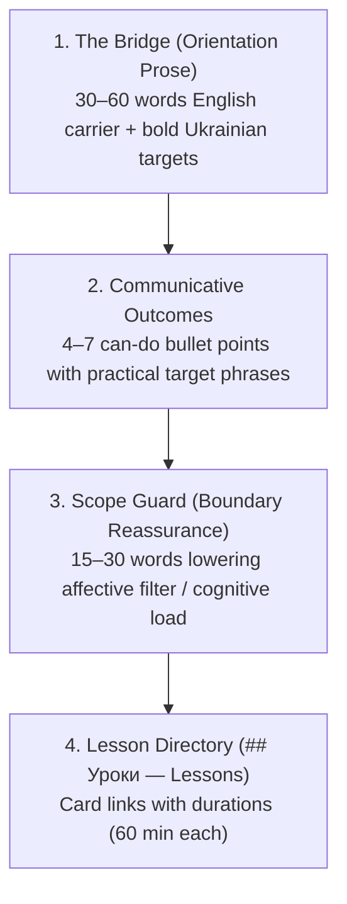
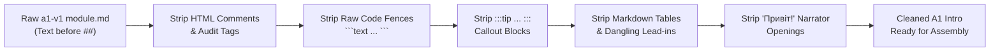
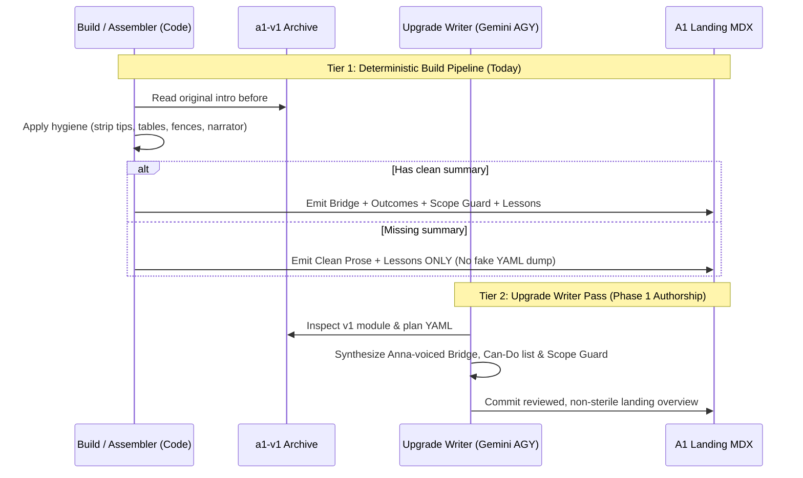

# A1 Upgrade Landing Contract & Normalization Architecture

**Status:** Proposed Architecture & Advisory Memo
**Author:** Gemini (AGY) — Advisor Only
**Issue / PR Reference:** refs #7999, #7994, #7995
**Binding scars:** [`a1-upgrade-operating-rules.md`](a1-upgrade-operating-rules.md) — load first. Canonical `/a1/`; archive `/a1-v1/`.
**Trailer:** `X-Agent: agy/cu-p1-a1-normalize-advisor`
**Scope:** A1 Canonical Landing (`/a1/{slug}/` Lesson Tab) Normalization across 55 modules. Strictly A1 only (A2/B1/B2 immersion out of scope).

---

## 1. Executive Summary & Core Verdicts

In PR #7999 (`bbbc626a10`), the assembler began reusing the original `a1-v1/{slug}/module.md` text before `## ` to provide an authentic bilingual English-carrier intro for upgraded A1 landings instead of dumping untranslated Ukrainian plan YAML under an English-only heading.

While this works well for Module 09 (`what-is-it-like`), applying naive extraction across all 55 archived `a1-v1` modules exposes deep structural unevenness:
1. **10 modules contain instructional markdown tables** before the first heading (e.g., question frames, greeting tables, emergency phone directories), creating cramped, redundant previews of Lesson 1.
2. **15 modules contain `:::tip` callouts**, which are micro-pedagogical coaching blocks intended for active exercises, not the high-level module directory.
3. **14 modules have no outcome list** ("By the end, you can:"), and several open with chatty narrator leaks (`Привіт!`).
4. Naive regex stripping of tables leaves **dangling lead-in clauses** (e.g., *"The safest A1 pattern is:"* followed immediately by lesson cards).
5. Naive fallback to `plan["objectives"]` produces **untranslated Ukrainian teacher-curriculum jargon** (`## Цілі — Objectives\n- Вміти розпізнавати...`), violating the A1 bilingual contract (HIGH learner severity).

### Core Recommendations

1. **Adopt a Two-Tier Architecture**:
   - **Tier 1 (Deterministic Assembler / Code)**: Pure regex hygiene in `lesson_assembler.py` that strips tip boxes, tables, table lead-ins, raw code fences, and narrator greetings. If a module lacks an outcome list, Tier 1 falls back to **clean orientation prose + lesson cards only**. **Never dump raw Ukrainian plan YAML into the landing.**
   - **Tier 2 (Writer Authoring / Gemini AGY)**: When `v7_build.py --writer` executes an upgrade for a module lacking a canonical summary, Gemini synthesizes a bespoke Module-9-style overview (Bridge + Communicative Outcomes + Scope Guard) directly into the module artifact at authoring time.
2. **Standardize the Module-9 Shape**: Exactly four sections: (1) The Bridge (English carrier + bold Ukrainian targets), (2) Communicative Outcomes (4–7 can-do bullets), (3) Scope Guard (1–2 sentences lowering anxiety), and (4) `## Уроки — Lessons` navigation directory.
3. **Preserve Anna Ohoiko's Voice, Avoid 55 Cookie-Cutter Clones**: Prevent AI template sterility by enforcing communicative real-world actions over linguistic metatalk, varying the opening hooks, diversifying outcome lead-ins, and tailoring scope guards to specific beginner fears.
4. **Relocate, Never Discard**: Tables stripped from module landings belong inside Lesson 1 or Lesson 2 bodies; they must not be lost from the curriculum.

---

## 2. Empirical Inventory of 55 A1-v1 Openings

Text extracted before the first `## ` heading across all 55 `curriculum/l2-uk-en/a1-v1/{slug}/module.md` files falls into five distinct structural categories:

| Category | Count | Structural Pattern | Key Examples |
|---|:---:|---|---|
| `bilingual_by_the_end` | 23 | English carrier + clean "By the end, you can" outcome list. No tips, no tables. | `what-is-it-like`, `sounds-letters-and-hello`, `around-the-city`, `at-the-cafe`, `weather` |
| `by_the_end_plus_tip` | 15 | Same clean structure as above, but with an embedded `:::tip` block. | `things-have-gender`, `food-and-drink`, `verbs-group-one`, `what-i-like`, `linking-ideas` |
| `opening_has_table` | 10 | Contains one or more markdown tables (`\| ... \|`) in the opening text. | `questions`, `who-am-i`, `i-want-i-can`, `emergencies`, `health`, `my-plans`, `my-story`, `what-happened`, `what-will-happen`, `a1-finale` |
| `prose_plus_tip_no_by_the_end` | 4 | Explanatory prose + `:::tip`, but completely lacks an outcome list. | `holidays`, `when-and-where`, `yesterday` (plus `checkpoint-communication`) |
| `prose_no_by_the_end` | 3 | Short prose paragraph only; no summary list, no tip, no table. | `my-morning`, `where-from`, `checkpoint-places` |
| **Total** | **55** | | |

### Failure Modes of Naive Extraction

If `_original_intro()` simply slices text before `## ` without normalization:

1. **Accidental Grammar Dumps on Landings**:
   In `questions/module.md`, lines 7–16 contain a 7-row question word table (`Хто`, `Що`, `Де`, `Куди`, `Коли`, `Чому`, `Як`). Putting this table on the landing turns the landing tab into a cluttered duplicate of Lesson 1.
2. **Dangling Lead-in Sentences**:
   In `i-want-i-can`, lines 5–9 read:
   ```markdown
   The useful A1 pattern is:

   | Person | helper verb | action word |
   ...
   ```
   If a tool simply strips `^\|.*\|$`, the landing is left with:
   ```markdown
   The useful A1 pattern is:

   After the helper verb, keep the second action in the dictionary -ти form...
   ```
3. **Narrator Persona Bleed**:
   Six modules (`emergencies`, `health`, `my-plans`, `my-story`, `what-happened`, `what-will-happen`, `a1-finale`) open with `"Привіт! This module gives you..."`. This contradicts the curriculum architecture rule: *"no named narrator, marked attributed quotation"*.
4. **The Ukrainian Teacher-Jargon Fallback**:
   When `_original_intro()` returns `None`, `lesson_assembler.py` currently falls back to:
   ```python
   objectives = plan.get("objectives", [])
   intro = "## Цілі — Objectives\n\n" + "\n".join(f"- {item}" for item in objectives)
   ```
   For `my-morning`, this emits:
   ```markdown
   ## Цілі — Objectives

   - Вміти розпізнавати та використовувати зворотні дієслова із постфіксом -ся/-сь
   - Навчитися описувати свою ранкову рутину за допомогою слів послідовності
   ```
   This is unassisted, high-register Ukrainian written for curriculum planners. To an A1 beginner, it is intimidating and incomprehensible, violating the 40–55% bilingual scaffolding mandate.

---

## 3. Canonical A1 Landing Lesson-Tab Shape

The Lesson tab on an upgraded A1 landing (`/a1/{slug}/`) serves as an **executive orientation portal and directory**, not an instructional workspace. Learners arrive here to understand *why* this module matters, *what* concrete abilities they will unlock, and *how* the lessons are structured.

The gold standard is **Module 09 (`what-is-it-like`)**.



### Exact Section Specifications

#### 1. The Bridge (Orientation Prose)
- **Length**: 1–2 short paragraphs (30–60 words total).
- **Function**: Bridges from prior knowledge or English concepts into the Ukrainian topic.
- **Language**: English carrier (60–70%), embedding core Ukrainian target terms in **bold** with stress marks where helpful.
- **Tone**: Warm, direct, adult, intellectually respectful.
- **Example (from Module 09)**:
  > In the last module, you learned that every Ukrainian noun has a gender signal: **стіл** is **він**, **книга** is **вона**, and **вікно** is **воно**. Now you can use that signal to describe things. The small rule is this: the noun chooses the adjective ending.

#### 2. Communicative Outcomes ("By the end, you can:")
- **Length**: 4–7 bullet items.
- **Lead-in**: `By the end, you can:` (or natural contextual variants).
- **Structure**: Each bullet starts with an English action verb (*ask*, *use*, *describe*, *join*, *repair*, *order*), followed by specific, bolded Ukrainian words, phrases, or models.
- **Pedagogical Rule**: Must describe **communicative acts** or **recognition skills**, never abstract linguistic categories.
- **Example (from Module 09)**:
  > By the end, you can:
  > - ask **який? / яка? / яке? / які?** with the right kind of noun;
  > - use hard-ending adjective phrases in the nominative case: **великий стіл**, **нова книга**, **чисте вікно**, **гарні речі**;
  > - describe a room or a book-fair table with short A1 sentences;
  > - join two qualities with **і**, or contrast them with **а** and **але**;
  > - repair common adjective traps such as **смачний**, **жовтий**, **правильний**, and **розумний**.

#### 3. Scope Guard (Boundary Reassurance)
- **Length**: 1–2 sentences (15–30 words).
- **Function**: Explicitly tells the beginner what they are *not* expected to do today, curbing panic over grammar complexity.
- **Formula**: `Keep the scope small. Today is not a [complex grammatical topic]. You are training [one specific, manageable habit].`
- **Example (from Module 09)**:
  > Keep the scope small. Today is not a full adjective-declension lesson. You are training the first visible pattern: noun gender plus adjective ending.

#### 4. Lesson Directory (`## Уроки — Lessons`)
- **Heading**: Bilingual `## Уроки — Lessons`.
- **Content**: Markdown link list generated by the assembler from `plan["lessons"]` with lesson number, title, and duration:
  ```markdown
  ## Уроки — Lessons

  - [1. Який? Яка? Яке?](/a1/what-is-it-like/1/) — 60 min
  - [2. Прикметники](/a1/what-is-it-like/2/) — 60 min
  - [3. Підсумок](/a1/what-is-it-like/3/) — 60 min
  ```

### When to Omit a Summary List Entirely

A summary bullet list should be omitted **only** when:
1. **The module is in Tier 1 code-extraction fallback** and the original v1 source has no valid summary list (e.g. `my-morning`). In this case, the landing tab renders **Orientation Prose + `## Уроки — Lessons`**.
2. **Review Checkpoints**: If a checkpoint module's three lessons represent distinct testing domains and the orientation prose already defines the holistic challenge, an artificial bullet list that merely restates the three lesson titles should not be manufactured.

**Crucial Negative Rule:** Never emit raw Ukrainian plan YAML under `## Цілі — Objectives`. If no outcome list is present, render the prose and jump straight to `## Уроки — Lessons`.

---

## 4. Normalization Specification: What to Strip

The converter/assembler (`scripts/build/lesson_assembler.py`) must apply deterministic hygiene to original v1 module openings.



### 1. Tip Callouts (`:::tip`)
- **Why**: Tip boxes (`:::tip` and `:::tip[...]`) contain micro-hints meant to support active exercise completion inside lessons. On the landing, they disrupt the executive hierarchy and duplicate advice found in Lesson 1.
- **Action**: Regex-strip all `:::tip[\s\S]*?:::` occurrences.

### 2. Markdown Tables and Dangling Lead-ins
- **Why**: Tables present paradigm declensions, vocabulary pairings, or dialogue scripts. These belong in lesson content sections or component data (VocabCard), not on the landing page.
- **Action**:
  1. Strip all contiguous markdown table blocks (`^(?:\|[^\n]+\|\r?\n)+`).
  2. Clean dangling lead-in clauses immediately preceding a stripped table. Common lead-in patterns in v1 include:
     - `The safest A1 pattern is:`
     - `The useful A1 pattern is:`
     - `Treat the first phrases as whole expressions:`
     - `The core call frame is:`
     - `The task is simple: speak clearly in short A1 lines.`
     - `Official Ukrainian emergency numbers rechecked on ...:`

### 3. Raw Code Fences (`` ```text ``)
- **Why**: In v1, dialogues were frequently wrapped in raw text fences before the first `## Діалоги` heading (e.g., in `verbs-group-one`). In V7, dialogues belong inside `DialogueBox` components in lesson tabs.
- **Action**: Regex-strip all ```` ```[\s\S]*?``` ```` blocks.

### 4. Conversational Narrator Persona Leaks (`Привіт!`)
- **Why**: The course contract specifies *"no named narrator, marked attributed quotation"*. Casual blogging greetings like `"Привіт! This module gives you..."` degrade professional reference quality.
- **Action**: Strip leading `^Привіт!\s*` or `^Привіт,\s*` from the beginning of paragraphs. Replace with a direct declarative opening (e.g., *"This module provides emergency language..."*).

### 5. HTML Comments and Audits
- **Why**: Legacy audit tags (`<!-- <implementation_map_audit> ... -->`, `<!-- bad_form_audit ... -->`) must never leak into product MDX.
- **Action**: Strip all `<!--[\s\S]*?-->`.

---

## 5. Writer (AGY) Role vs. Assembler Fallback

The operator posed the central architectural question:
> *"If a module has no usable summary, should the writer (AGY) generate a 9-style bilingual overview from the plan, or should the landing be lesson-list-only?"*

### Recommendation: Separation of Timing and Ownership

We recommend a **Two-Tier Architecture**:



### Why Not Generate On-the-Fly during Code Assembly?
Generating synthetic summaries on-the-fly during `lesson_assembler.py` runtime using LLM calls introduces network flakiness, non-determinism, build slowdowns, and unreviewed prose into what should be a deterministic static-site compilation step.

### Why Not Settle for Permanent Lesson-List-Only Landings?
If 14 modules permanently remain lesson-list-only while 41 modules have rich, empowering "By the end, you can" milestones, the curriculum feels fractured and half-finished. Furthermore, modules like `emergencies` and `health` lose almost their entire opening when tables are stripped, leaving only an abrupt one-sentence stump.

### The Solution
1. **In Code (`lesson_assembler.py`)**: When building without an upgraded landing artifact, fall back to **clean prose + lesson directory**. Strip all raw YAML dumps (`## Цілі — Objectives`).
2. **In the Upgrade Writer (`v7_build.py --writer`)**: When Gemini/AGY runs on a module, the writer's prompt instructs it to generate the Module-9-style landing overview along with the 3 lesson files. The output is saved to the upgraded module source, reviewed, and deterministically assembled thereafter.

---

## 6. Mitigating the "Sterile Clone" Risk: Preserving Anna Ohoiko's Voice

The danger of having an AI write 55 module overviews is corporate, robotic homogeneity: 55 pages opening with *"In this module you will learn..."*, followed by five bullet points starting with the same verb, ending with an identical *"Keep the scope small"*.

To maintain Anna Ohoiko's authentic, pedagogical voice (as perfected in the Ukrainian Lessons Podcast and ULP materials), AGY must adhere to five stylistic invariants:

### 1. Communicative Action over Linguistic Metatalk
Anna never teaches grammar for the sake of grammar; every structure serves immediate human connection.
- **Sterile / Robotic**:
  - `- understand the conjugation of second-conjugation verbs in the present tense;`
  - `- identify masculine and feminine accusative noun endings;`
- **Anna's Voice**:
  - `- order coffee and tea with **я хочу...** and **будь ласка**;`
  - `- ask **Хто це?** and **Що це?** when pointing to things in your room;`
  - `- say where you are going with **я йду в...** without mixing up the city endings;`

### 2. Diversify the Opening "Hook"
Vary how the learner is welcomed into the topic:
- **Prior Learning Bridge (Module 09 style)**: *"In the last module, you learned that every noun has a gender signal. Now you can use that signal to describe things..."*
- **English-Ukrainian Contrast Hook**: *"English uses 'you' for everyone: your boss, your dog, and a crowd of strangers. Ukrainian makes a warm, important distinction..."*
- **Situational Immersion Hook**: *"You are standing at a busy tram stop in Lviv, checking the schedule on your phone..."*
- **Empathetic Demystification**: *"Ukrainian handwriting and soft signs look intimidating on day one, but Ukrainian has one great gift for beginners: letters reliably sound the way they look."*

### 3. Vary the Outcome Milestone Lead-in
Do not use `By the end, you can:` identically across all 55 modules. Rotate naturally:
- `By the end, you can:` (Standard)
- `Here is what you will be able to do:`
- `Your five small wins in this module:`
- `By the end of these three lessons, you will:`
- `Ви вже можете / You can already:` (For review checkpoints)

### 4. Bespoke, Reassuring Scope Guards
The scope guard must address the **specific psychological friction point** of that exact lesson, not repeat a generic platitude.
- *For Cases*: *"Keep the scope small. You are not memorizing all seven cases today. You are practicing one high-frequency pattern for city names."*
- *For Verbs*: *"Don't worry about irregular verbs or past tenses today. Train your ear on the five verbs you use every single morning."*
- *For Gender*: *"Treat gender as part of the noun card, not a grammatical puzzle. Store the word with its partner: **мій стіл**, **моя кава**."*

### 5. Target-Language Density (The 40–55% Band)
Maintain the m8–m9 golden ratio:
- Carrier sentences are English.
- Every bullet point must feature the target Ukrainian terms in **bold** with stress marks.
- The visual rhythm on the screen should feel balanced: half English scaffolding, half vibrant Ukrainian target language.

---

## 7. Out-of-Scope Boundaries

To maintain rigorous development discipline, the following topics are explicitly excluded from this contract:

1. **A2 / B1 / B2 Immersion Contracts**:
   A2 makes the deliberate pedagogical leap to full Ukrainian immersion (Anna's jump). English scaffolding drops away. Designing landing pages or tabs for A2 immersion is strictly out of scope.
2. **Curricular Table Deletion**:
   Instructional tables stripped from module landings (such as the gender paradigm in Module 08 or the question word table in Module 04) are **not deleted from the course**. They belong inside the relevant Lesson 1/2 instruction tabs where learners engage with them interactively.
3. **Starlight UI & CSS Components**:
   Tabs, `VocabCard`, `FlashcardDeck`, and CSS layout rules were stabilized in commits `27c214df06` and `bbbc626a10`. No modifications to Starlight components or CSS styling are required.

---

## 8. Implementation Blueprint for `lesson_assembler.py`

When the driver implements this advice in code, `_original_intro` in `scripts/build/lesson_assembler.py` should be updated with robust sanitization:

```python
import re
from pathlib import Path

# Common dangling lead-in sentences before tables
_DANGLING_LEAD_INS = re.compile(
    r"(?m)^\s*(?:"
    r"The (?:safest|useful|core) A1 pattern is:|"
    r"The core call frame is:|"
    r"Treat the first phrases as whole expressions:|"
    r"The task is simple: speak clearly in short A1 lines\.|"
    r"Official Ukrainian emergency numbers rechecked on [^:]+:|"
    r"Start with the (?:noun )?question\."
    r")\s*\n+",
)

def _clean_landing_intro(raw_body: str) -> str:
    """Normalize raw A1 opening text into a clean Module-9 style landing intro."""
    # 1. Strip HTML comments & audits
    body = re.sub(r"<!--[\s\S]*?-->", "", raw_body)
    # 2. Strip code fences
    body = re.sub(r"```[\s\S]*?```", "", body)
    # 3. Strip :::tip callouts
    body = re.sub(r":::tip(?:\[.*?\])?[\s\S]*?:::", "", body)
    # 4. Strip markdown tables
    body = re.sub(r"(?m)^(?:\|[^\n]+\|\r?\n)+", "", body)
    # 5. Strip dangling lead-in clauses that pointed to stripped tables
    body = _DANGLING_LEAD_INS.sub("", body)
    # 6. Strip 'Привіт!' narrator greetings
    body = re.sub(r"(?m)^\s*Приві́?т[!,\.]?\s*", "", body)
    # 7. Normalize multiple newlines and trim
    body = re.sub(r"\n{3,}", "\n\n", body).strip()
    return body
```

In `assemble_lessons()`:
```python
    intro = _original_intro(module_dir, slug)
    if intro:
        intro = _clean_landing_intro(intro)

    # Graceful fallback: If no usable intro, omit objectives and go straight to lessons.
    # NEVER dump raw Ukrainian plan YAML into A1 landing.
    if not intro:
        intro = ""
    else:
        intro += "\n\n"
    intro += "## Уроки — Lessons\n\n" + "\n".join(cards)
```

---

## 9. Summary Table: Expected Action Across 55 Modules

| Cluster | Count | Assembler Action (Tier 1) | Writer Action (Tier 2 Upgrade) |
|---|:---:|---|---|
| **Clean `bilingual_by_the_end`** (e.g. `what-is-it-like`, `sounds-letters-and-hello`) | 23 | Extract directly; zero stripping needed. Ready today. | Retain authentic v1 intro verbatim. |
| **`by_the_end_plus_tip`** (e.g. `things-have-gender`) | 15 | Strip `:::tip` block; preserves clean Bridge + Outcomes + Scope Guard. | Retain cleaned v1 intro verbatim. |
| **`opening_has_table` with outcomes** (e.g. `who-am-i`) | 3 | Strip tables & lead-ins; retains Bridge + Outcomes list. | Retain cleaned v1 intro; ensure stripped tables live in L1/L2. |
| **`opening_has_table` without outcomes** (e.g. `questions`, `emergencies`, `health`, `what-happened`) | 7 | Strip tables, tips, "Привіт!"; falls back to clean prose + lesson directory. | AGY synthesizes fresh Module-9-style overview from plan during upgrade. |
| **`prose_plus_tip_no_by_the_end`** (e.g. `holidays`, `when-and-where`, `yesterday`) | 4 | Strip tips; falls back to clean prose + lesson directory. | AGY synthesizes can-do outcomes from plan during upgrade. |
| **`prose_no_by_the_end`** (e.g. `my-morning`, `where-from`) | 3 | Retains clean prose; falls back to clean prose + lesson directory. | AGY synthesizes can-do outcomes from plan during upgrade. |

This architecture delivers immediate deterministic stability to PR #7999 while establishing a clear, non-sterile authoring trajectory for subsequent module upgrades.
