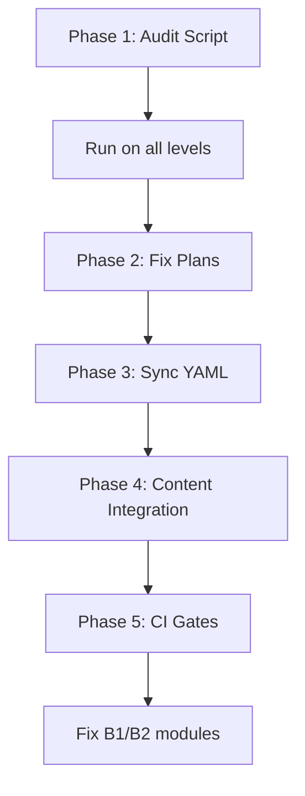

# Issue 395: Vocabulary Uniqueness and Integration Audit (A1-C2) - CONSOLIDATED

**Status**: CRITICAL - Must be resolved before B1/B2 fixes
**Complexity**: Multi-phase, multi-agent task
**Estimated Scope**: ~1,600 duplicate assignments across A1-C2

---

## Executive Summary

The curriculum has **two critical vocabulary problems**:

1. **Blueprint Debt**: ~1,600 words are assigned as "Core Vocabulary" in multiple modules across the curriculum plans
2. **Implementation Gap**: Many modules don't actually use the vocabulary assigned to them in activities and lesson text

This violates the **Vocabulary Handling System** principle: each word should have exactly ONE introduction point where it's systematically drilled.

---

## The Problem in Detail

### 1. Blueprint Redundancy

**Source of Truth**: `docs/l2-uk-en/*-CURRICULUM-PLAN.md` files

**Issue**: The same word appears as "Core Vocabulary" in multiple modules.

**Example** (hypothetical):
```
A1-CURRICULUM-PLAN.md:
  Module 15: Core Vocabulary: [їсти, пити, спати]

A2-CURRICULUM-PLAN.md:
  Module 35: Core Vocabulary: [їсти, готувати, снідати]
```

**Problem**: `їсти` is marked as "Core" in both M15 (A1) and M35 (A2). This creates:
- **Drill redundancy**: Learners encounter the same word as "new" twice
- **Unclear ownership**: Which module "owns" this word's introduction?
- **Assessment ambiguity**: Is it A1 or A2 vocabulary on tests?

**Who caused this?**: The Architect (Agent) that generated the curriculum plans, working from Ukrainian State Standard 2024 themes without a global uniqueness check.

### 2. Implementation Failure

**Source of Truth**:
- Activities: `curriculum/l2-uk-en/{level}/activities/*.yaml`
- Lesson Text: `curriculum/l2-uk-en/{level}/*.md`
- Vocabulary: `curriculum/l2-uk-en/{level}/vocabulary/*.yaml`

**Issue**: Modules don't actually teach the words assigned to them.

**Example** (actual case):
```
Curriculum Plan says: Module 45 teaches [готувати, смажити, варити, пекти]
Reality:
  - Module 45 vocabulary YAML: [готувати, смажити] ❌ (2/4 = 50%)
  - Module 45 activities: Only drills [готувати] ❌ (1/4 = 25%)
  - Module 45 lesson text: Uses none of them ❌ (0/4 = 0%)
```

**Result**:
- Words in the Plan are never introduced
- Learners miss ~20-50% of planned vocabulary
- Later modules assume knowledge that was never taught

---

## Why This Must Be Fixed Before B1/B2 Module Repairs

**Current B1/B2 fixing strategy**:
1. Run audit on module → see violations
2. Fix violations (adjust activities, add content)
3. Re-audit → pass

**The problem**:
- We're fixing modules based on YAML vocabulary that's **already wrong**
- We're not fixing whether the module teaches what the **Plan** says it should
- Fixing B1/B2 now means we'll have to fix them AGAIN after vocabulary reconciliation

**Better approach**:
1. Fix the vocabulary Blueprint first (this issue)
2. Update all YAML sidecars to match the Blueprint
3. THEN fix B1/B2 module implementations to properly drill the corrected vocabulary

---

## Proposed 4-Phase Solution

### Phase 1: Blueprint Uniqueness Audit

**Goal**: Identify all ~1,600 duplicate "Core Vocabulary" assignments across curriculum plans.

**Tool**: New script `scripts/audit_curriculum_uniqueness.py`

**Algorithm**:
1. Parse all `*-CURRICULUM-PLAN.md` files
2. Extract "Core Vocabulary" for each module
3. Build global registry: `{word: [list of modules where it appears]}`
4. Report duplicates with conflict resolution recommendations

**Output**: `curriculum_duplicates_report.json`
```json
{
  "їсти": {
    "appearances": [
      {"level": "A1", "module": 15, "theme": "Food basics"},
      {"level": "A2", "module": 35, "theme": "Cooking"}
    ],
    "recommendation": "Keep A1-M15 (first appearance), remove from A2-M35 or reclassify as passive"
  }
}
```

**Success Metric**: 100% identification of duplicates

---

### Phase 2: Blueprint Refactoring

**Goal**: Fix the curriculum plans to have zero duplicates.

**Agent**: Claude Code (Claude 3.5 Sonnet)

**Task**: For each duplicate identified in Phase 1:

**Decision rules**:
1. **Keep earliest appearance** as "Core Vocabulary" (introduction point)
2. **For later appearances**, choose one:
   - **Option A**: Remove the word entirely and replace with a new unique lemma that fits the theme
   - **Option B**: Reclassify as "Passive/Contextual" (word is used but not drilled)

**Example resolution**:
```diff
# A2-CURRICULUM-PLAN.md
Module 35: Cooking and Food Preparation

Core Vocabulary:
- їсти ❌ REMOVED (already taught in A1-M15)
+ тушкувати ✅ ADDED (new word, fits theme)
- готувати ✅ KEPT (unique to this module)
```

**Success Metric**: 0 duplicates when running `audit_curriculum_uniqueness.py` after refactoring

---

### Phase 3: Sidecar Alignment

**Goal**: Update all `vocabulary/*.yaml` files to perfectly mirror the fixed curriculum plans.

**Agent**: Gemini CLI (Gemini 2.0 Flash) - deterministic batch updates

**Task**:
1. Read fixed curriculum plan for each module
2. Generate or update corresponding `vocabulary/{slug}.yaml`
3. Ensure 100% parity: every word in Plan appears in YAML

**Input**: Fixed `*-CURRICULUM-PLAN.md` files
**Output**: Updated `curriculum/l2-uk-en/{level}/vocabulary/*.yaml` files

**Validation**: Run diff between Plan word list and YAML word list for every module.

**Success Metric**: 0 mismatches between Plans and YAML sidecars

---

### Phase 4: Instructional Integration Enforcement

**Goal**: Ensure modules actually TEACH the words assigned to them.

**Agent**: Gemini 2.0 Pro (content generation with linguistic precision)

**Task**: For each module, insert missing vocabulary into:

1. **Lesson Text** (`.md` file):
   - Minimum 50% of unique vocabulary must appear in narrative/explanations
   - Natural integration (not forced lists)
   - Examples: dialogues, example sentences, grammar explanations

2. **Activities** (`activities/*.yaml`):
   - Minimum 80% of unique vocabulary must be drilled
   - Distribution across activity types (match-up, fill-in, etc.)
   - Multiple exposures per word (recognition → production)

**Audit metrics** (added to `scripts/audit_module.py`):
```python
def check_vocabulary_integration(module_path, plan_words):
    lesson_coverage = count_plan_words_in_md(module_path, plan_words)
    activity_coverage = count_plan_words_in_activities(module_path, plan_words)

    return {
        'lesson_integration': lesson_coverage / len(plan_words),  # ≥ 50%
        'activity_integration': activity_coverage / len(plan_words)  # ≥ 80%
    }
```

**Success Metric**:
- Lesson integration ≥ 50% for all modules
- Activity integration ≥ 80% for all modules

---

## Phase 5: Continuous Enforcement

**Goal**: Prevent regression.

**Tool**: `scripts/audit_module.py` (updated with new gates)

**New gates**:
```python
# Gate: Blueprint Uniqueness
if word in global_vocabulary_registry[previous_level]:
    FAIL: "Word '{word}' already introduced in {prev_module}"

# Gate: Lesson Integration
if lesson_integration < 0.50:
    FAIL: "Only {lesson_integration:.0%} of planned vocabulary used in lesson (target: ≥50%)"

# Gate: Activity Integration
if activity_integration < 0.80:
    FAIL: "Only {activity_integration:.0%} of planned vocabulary drilled in activities (target: ≥80%)"
```

**CI Integration**: These gates run on every PR touching curriculum files.

---

## Multi-Agent Execution Strategy

| Phase | Agent | Model | Strengths | Task |
|-------|-------|-------|-----------|------|
| 1 | Script | Python | Deterministic | Parse plans, identify duplicates |
| 2 | Claude Code | Sonnet 3.5 | Planning, refactoring | Fix curriculum plans, resolve conflicts |
| 3 | Gemini CLI | Flash 2.0 | Fast batch updates | Sync YAML sidecars with plans |
| 4 | Gemini 2.0 Pro | Pro 2.0 | Ukrainian linguistic precision | Insert vocabulary into lessons/activities |
| 5 | Pipeline | Python | Automation | Continuous enforcement |

**Why this distribution?**
- **Phase 1**: Deterministic problem, use scripts
- **Phase 2**: Requires judgment calls (replace vs reclassify), use Claude's planning
- **Phase 3**: Mechanical batch update, use fast Flash model
- **Phase 4**: Requires linguistic quality in Ukrainian, use Pro model
- **Phase 5**: Automated gates, no human intervention needed

---

## Success Criteria (Measurable)

- [ ] **Zero duplicate core vocabulary** across A1-C2 curriculum plans
- [ ] **100% parity** between curriculum plans and vocabulary YAML sidecars
- [ ] **Lesson integration ≥ 50%** for every module (automated audit)
- [ ] **Activity integration ≥ 80%** for every module (automated audit)
- [ ] **Blocking gates** in `audit_module.py` prevent future regressions
- [ ] **Documentation updated**: `VOCABULARY-HANDLING-SYSTEM.md` reflects new enforcement

---

## Implementation Order



**Critical path**: Cannot proceed to "Fix B1/B2 modules" until Phases 1-5 are complete.

**Why?** Fixing modules now means fixing them twice (once with wrong vocab, once with correct vocab).

---

## Estimated Impact

**Current state**:
- ~1,600 duplicate assignments (Blueprint debt)
- ~30-50% of modules have <50% lesson integration
- ~40-60% of modules have <80% activity integration

**After completion**:
- 0 duplicates (clean Blueprint)
- 100% modules meet integration targets
- Learners receive systematic, non-redundant vocabulary instruction
- Assessment becomes reliable (each word has clear ownership)

---

## Related Files

- `docs/l2-uk-en/VOCABULARY-HANDLING-SYSTEM.md` - Original vocabulary rules
- `docs/l2-uk-en/UKRAINIAN-STANDARD-INDEX.md` - Standard alignment
- `docs/l2-uk-en/*-CURRICULUM-PLAN.md` - Blueprint files to be fixed
- `curriculum/l2-uk-en/{level}/vocabulary/*.yaml` - Sidecars to be updated
- `scripts/audit_module.py` - Audit script to be enhanced

---

## Next Steps

1. **Review and approve** this consolidated plan
2. **Phase 1**: Implement `audit_curriculum_uniqueness.py` script
3. **Run Phase 1** on all levels, generate conflict report
4. **Present findings** to user for resolution strategy confirmation
5. **Execute Phases 2-5** with multi-agent approach
6. **Only then**: Resume B1/B2 module fixes with correct vocabulary foundation

---

**Question for User**: Do you approve this consolidated approach? Should we proceed with Phase 1 (audit script) immediately?
