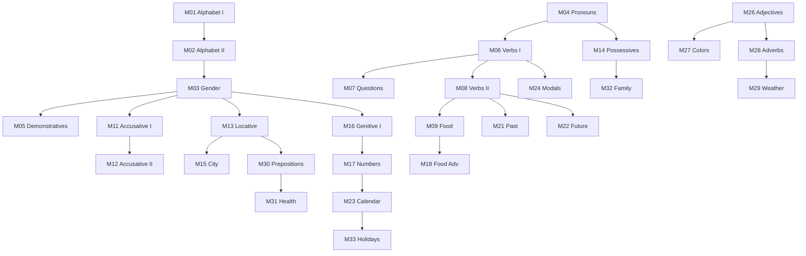

# A1 Curriculum Plan: Ukrainian for English Speakers

**Status:** ✅ COMPLETE
**Modules:** 01-34 (34 modules)
**Vocabulary Target:** ~500 unique words

---

## Quality Standards Reference

For detailed quality metrics on instructional core word counts, immersion percentages, example sentences, engagement boxes, mini-dialogues, and activity requirements by level, please refer to:
`docs/l2-uk-en/MODULE-RICHNESS-GUIDELINES-v2.md`

> **Note on Activities:** The "Signature Activity Concepts" listed in the module specifications below are **mandatory pedagogical anchors** that must be included. However, they are NOT exhaustive. The Module Architect is required to generate additional activities (standard drills, quizzes, etc.) to meet the **minimum target of 8+ activities per module** as defined in the guidelines.

---

## Ukrainian State Standard 2024 Alignment

> **Source:** Українська мова як іноземна: рівні загального володіння та діагностика (2024)
> **Document:** `docs/l2-uk-en/UKRAINIAN-STATE-STANDARD-2024.txt`

The A1 level (Початковий рівень) per the official Ukrainian State Standard 2024 requires:

### Grammar Requirements (Каталог В)

#### Cases (Відмінки)

| Case | Ukrainian | Allowed at A1 | Key Patterns |
|------|-----------|---------------|--------------|
| Nominative | Називний | ✅ From M01 | Subject, "Це X", identity |
| Accusative | Знахідний | ✅ From M11 | Objects, direction (в/у/на + Acc), time (days) |
| Locative | Місцевий | ✅ From M13 | Location (в/у/на + Loc), months |
| Vocative | Кличний | ✅ From M02 | Addressing: Остапе, Олено, Галю |
| Genitive | Родовий | ✅ From M16 | Absence (немає), possession (у мене) |
| Dative | Давальний | ❌ A2 topic | — |
| Instrumental | Орудний | ❌ A2 topic | — |

**Reference:** State Standard §4.2.3 (lines 672-700)

#### Noun Patterns (Іменник)

**Accusative endings (§4.2.3.2):**
- M inanimate: no change (бачу стіл)
- M animate: -а (бачу студента) ← = genitive
- F -а → -у (бачу книгу)
- F -я → -ю (бачу землю)
- N: no change (бачу місто)

**Locative endings (§4.2.3.3):**
- M: -і/-ові/-у (на столі, на батькові, у парку)
- F: -і (у книзі, на вулиці)
- N: -і (у місті, на морі)

**Genitive endings (inferred from examples):**
- M: -а/-у (немає столу, немає друга)
- F: -и/-і (немає книги, немає води)
- N: -а (немає вікна)

#### Adjectives (Прикметник)

**✅ ALLOWED at A1** (§4.2.1.2, lines 633-650):

| Form | Hard -ий | Soft -ій |
|------|----------|----------|
| M nom | -ий (великий) | -ій (літній) |
| F nom | -а (велика) | -я (літня) |
| N nom | -е (велике) | -є (літнє) |
| Pl nom | -і (великі) | -і (літні) |

**Accusative/Locative forms also taught at A1.**

**❌ NOT at A1:**
- Comparative forms (більший, менший)
- Superlative forms (найбільший)
- Short-form adjectives

#### Pronouns (Займенник)

**Personal pronouns (§4.2.1.4):**
- я (мене, мені), ти (тебе, тобі), ми (нас, нам), ви (вас, вам)
- він, вона, воно, вони (nominative only at A1)

**Possessive pronouns (§4.2.2, lines 661-667):**

| | M | F | N | Pl |
|---|-----|-----|-----|------|
| my | мій | моя | моє | мої |
| your (sg) | твій | твоя | твоє | твої |
| his | його | його | його | його |
| her | її | її | її | її |
| our | наш | наша | наше | наші |
| your (pl) | ваш | ваша | ваше | ваші |
| their | їхній | їхня | їхнє | їхні |

**❌ NOT at A1:**
- **свій** (reflexive possessive) - A2/B1 topic
- Declined forms of possessives (мого, твоєї, etc.)

**Demonstrative pronouns:**
- цей, ця, це, ці (this)
- той, та, те, ті (that)

#### Verbs (Дієслово)

**Present tense (§4.2.4.1, lines 704-709):**
- Class I (-ати): читаю, читаєш, читає, читаємо, читаєте, читають
- Class II (-ити): говорю, говориш, говорить, говоримо, говорите, говорять
- Irregulars: їсти, пити, могти, іти, їхати

**Past tense (§4.2.4.1, lines 713-714):**
- L-participle: читав (m), читала (f), читало (n), читали (pl)

**Future tense (§4.2.4.1, lines 710-719):**
- Compound (imperfective): буду + infinitive (буду читати)
- Simple (perfective): **LIMITED** - only зможу, скажете, прочитають explicitly listed

**Imperative (§4.2.4.2, lines 721-725):**
- ✅ **ALLOWED at A1** - 2nd person only
- Specific verbs: читай/читайте, скажи/скажіть, дай/дайте, пиши/пишіть, сідай/сідайте
- Present as **memorized phrases**, not conjugatable verbs

#### Verbal Aspect Policy

| Aspect | Usage at A1 | Notes |
|--------|-------------|-------|
| Imperfective | ✅ Default | All present tense, compound future |
| Perfective | ⚠️ Limited | Only in imperative phrases, simple future of common verbs |

**Rule:** At A1, do NOT teach aspect as a grammatical concept. Use perfective verbs only as:
1. Fixed imperative phrases (Скажіть, будь ласка)
2. Simple future of very common verbs (зможу, скажу, прочитаю)

**Avoid:**
- Aspect pairs (робити/зробити)
- Aspect choice explanations
- Perfective verbs in vocabulary tables marked as "pf"

#### Syntax (Синтаксис)

**Simple sentences (§4.3.1, lines 729-739):**
- Declarative: Ми були у Львові.
- Yes/no questions: Чи студент відповідає?
- Wh-questions: Де ви були вчора? Хто вам це сказав?
- Imperative requests: Дайте, будь ласка, два квитки.
- Negation: Він не чекає.

**Compound sentences (§4.3.2, lines 741-747):**
- Coordinating: і/й, але
- Subordinating: тому що, бо (cause)

**❌ NOT at A1:**
- Complex subordinate clauses
- Relative clauses (який, що as relative pronoun)
- Conditional constructions

### Thematic Requirements (Каталог Б)

- Personal info (особиста інформація): name, age, nationality
- Family (сім'я): members, relationships
- Home (дім): rooms, basic furniture
- Daily life (побут): routines, time
- Food (їжа): basic food, drinks, meals
- Shopping (купівля): numbers, prices, basic transactions
- Directions (напрямки): basic location, simple directions

### Communicative Competence

- Understand and use familiar everyday expressions
- Introduce oneself and others
- Ask and answer questions about personal details
- Interact in a simple way if the other person speaks slowly

### Module Scope Checklist

Before writing/reviewing any A1 module, verify:

| Check | Constraint |
|-------|------------|
| Cases | Only Nom, Acc, Loc, Gen, Voc |
| Adjectives | Only nominative/accusative/locative forms, no comparatives |
| Possessives | No свій, no declined forms |
| Verbs | Imperative = phrases only, aspect not explained |
| Perfective | Only in imperatives or limited simple future |
| Syntax | Simple/compound only, no complex subordination |

---

## CEFR A1 Can-Do Alignment

### CEFR A1 Descriptor (Council of Europe)
> Can understand and use familiar everyday expressions and very basic phrases aimed at the satisfaction of needs of a concrete type. Can introduce themselves and others and can ask and answer questions about personal details. Can interact in a simple way provided the other person talks slowly and clearly.

### Our A1 Can-Do Checklist
By module 34, learners can:

**Understanding (Listening/Reading)**
- [ ] Recognize all 33 Cyrillic letters in print and italic
- [ ] Read words phonetically without transliteration
- [ ] Understand familiar words about self, family, immediate surroundings
- [ ] Follow very simple written instructions

**Speaking (Production/Interaction)**
- [ ] Introduce myself (name, nationality, profession)
- [ ] Describe where I live
- [ ] Ask and answer simple questions about personal details
- [ ] Order food and drinks
- [ ] Ask for directions
- [ ] Make simple purchases
- [ ] Tell the time and make appointments
- [ ] Describe daily routine

**Writing**
- [ ] Fill in forms with personal details
- [ ] Write simple isolated phrases and sentences

---

## Phase A1.1: First Contact (Modules 1-10)

### Learning Goals
- Master Cyrillic alphabet (print + italic awareness)
- Understand noun gender system
- Use present tense of common verbs
- Form basic sentences without 'to be'
- Talk about basic food and drinks

### Grammar Progression

| Module | Grammar Point | Builds On | Enables |
|--------|--------------|-----------|---------|
| 01 | Cyrillic: True/False Friends | - | Reading anything |
| 02 | Cyrillic: Unique letters, soft sign, italic | M01 | Complete reading |
| 03 | Noun gender & declension families | M02 | Case endings later |
| 04 | Zero copula, Це, personal pronouns | M03 | Basic sentences |
| 05 | Demonstratives (цей/ця/це/ці) | M03, M04 | Pointing, describing |
| 06 | Present tense Class I (-ати) | M04 | Action statements |
| 07 | Questions (чи, що, хто, де) + Negation | M06 | Conversations |
| 08 | Present tense Class II (-ити) | M06 | More verbs |
| 09 | Reflexive Verbs (-ся) | M08 | Daily routine |
| 10 | REVIEW | M01-09 | Consolidation |

### Vocabulary Plan A1.1 (240 words)

| Module | Words | Domain | Key Items |
|--------|-------|--------|-----------|
| 01 | 20 | Cognates | банк, парк, кафе, метро, таксі, студент... |
| 02 | 20 | Basic nouns | буква, слово, мова, людина, день, ніч... |
| 03 | 25 | Household | стіл, книга, вікно, двері, кімната, дім... |
| 04 | 20 | Identity | я, ти, він, вона, ми, ви, вони, ім'я, країна... |
| 05 | 40 | Objects | чашка, ложка, тарілка, сумка, телефон, ключ, гроші... |
| 06 | 25 | Action verbs | читати, писати, говорити, працювати, знати, розуміти... |
| 07 | 20 | Question words | що, хто, де, куди, коли, чому, як, скільки, так, ні... |
| 08 | 25 | More verbs | робити, бачити, хотіти, любити, жити, ходити... |
| 09 | 30 | Food | їжа, сніданок, обід, вечеря, борщ, вареники, хліб... |
| 10 | 10 | Review | (consolidation of above) |

### Module Content Specifications

**Note on Activities:** Anagram activities are permitted in Modules 01-10 for Cyrillic scaffolding, as per MODULE-RICHNESS-GUIDELINES-v2.md.

#### Module 01: The Cyrillic Code I
**Letters covered:** А, Е, І, О, К, М, Т (True Friends) + В, Н, Р, С, У, Х (False Friends) + Б, Д, З, Л, П, Ф (New)

**Vocabulary (35 words):**
мама, тато, банк, парк, кафе, метро, таксі, радіо, піца, суп, салат, лимон, банан, хокей, футбол, студент, турист, музика, фото, відео, бар, ресторан, доктор, актор, опера, балет, паспорт, віза, карта, комета, ракета, телефон, інтернет, какао, кава

**Signature Activity Concepts:**
1. Match-up: False Friends letter → sound
2. Quiz: Read international words
3. Group-sort: True Friends vs False Friends vs New

---

#### Module 02: The Cyrillic Code II
**Letters covered:** Г, Ґ, Ж, Ш, Щ, Ч, Ц (unique) + Є, Ї, Ю, Я (iotated) + Ь (soft sign) + И (hard i)

**Italic Warning:** т→m, п→n, д→g, и→u, л→hook, г→∂

**Vocabulary (35 words):**
буква, слово, алфавіт, мова, українська, англійська, так, ні, добре, дякую, будь ласка, привіт, до побачення, вибачте, прошу, ласкаво просимо, що, як, де, хто, це, борщ, йогурт, желе, майонез, шоколад, чемпіон, центр, цукор, джинси, джаз, Європа, Україна, Лондон, Київ

**Signature Activity Concepts:**
1. Match-up: Remaining letters → sounds
2. Quiz: Read mixed words with all letters
3. Match-up: Print form → Italic form
4. Match-up: Full alphabet review

---

#### Module 03: The Gender Code
**Grammar:** Noun gender (m/f/n) + 4 declension families

**Patterns:**
- Masculine: consonant ending (стіл, банк)
- Feminine: -а/-я ending (книга, земля)
- Neuter: -о/-е ending (вікно, море)

**Declension Families:**
1. -а/-я feminines (жінка, земля)
2. Consonant masculines + -о/-е neuters (стіл, вікно)
3. Soft -ь feminines (ніч, радість)
4. -а masculines (тато, суддя)

**Vocabulary (36 words):**
стіл, книга, вікно, двері, кімната, дім, місто, село, річка, море, хліб, вода, молоко, чай, сік, м'ясо, риба, овочі, фрукти, яблуко, апельсин, картопля, помідор, огірок, цибуля, стілець, крісло, шафа, диван, ліжко, підлога, стеля, стіна, магазин, школа, університет

**Signature Activity Concepts:**
1. Group-sort: Words by gender (m/f/n)
2. Quiz: Predict gender from ending
3. Match-up: Word → declension family

---

#### Module 04: This Is / I Am
**Grammar:** Zero copula (no 'to be' in present) + Це + Personal pronouns

**Key patterns:**
- Це книга. (This is a book.)
- Я студент. (I am a student.)
- Вона українка. (She is Ukrainian.)

**Vocabulary (32 words):**
я, ти, він, вона, воно, ми, ви, вони, це, то, ось, людина, чоловік, жінка, хлопець, дівчина, українець, українка, англієць, англійка, американець, американка, канадець, канадка, студент, студентка, професор, професорка, лікар, лікарка, друг, подруга

**Signature Activity Concepts:**
1. Gap-fill: Complete sentences with pronouns
2. Quiz: Translate "I am X" sentences
3. Match-up: Masculine nationality → feminine

---

#### Module 05: My World: Objects
**Grammar:** Demonstratives цей (m), ця (f), це (n), ці (pl)

**Vocabulary (40 words):**
цей, ця, це, ці, той, та, те, ті, чашка, ложка, виделка, ніж, тарілка, склянка, пляшка, сумка, рюкзак, гаманець, телефон, комп'ютер, ключ, двері, вікно, стіна, підлога, стеля, лампа, годинник, дзеркало, картина, стілець, крісло, диван, ліжко, шафа, холодильник, плита, мікрохвильовка, праска, пилосос

**Signature Activity Concepts:**
1. Match-up: Object → цей/ця/це
2. Gap-fill: Ця ___ (select correct object)
3. Match-up: Object vocabulary

---

#### Module 06: The Living Verb I
**Grammar:** Present tense Class I verbs (-ати/-яти)

**Conjugation pattern:**
читати → читаю, читаєш, читає, читаємо, читаєте, читають

**Vocabulary (25 words):**
читати, писати, знати, розуміти, слухати, чекати, питати, відповідати, працювати, відпочивати, снідати, обідати, вечеряти, гуляти, грати, співати, танцювати, малювати, думати, мріяти, починати, закінчувати, шукати, знаходити, називати

**Signature Activity Concepts:**
1. Gap-fill: Conjugate verb for pronoun
2. Quiz: Match conjugated form → infinitive
3. Unjumble: Build sentences with verbs

---

#### Module 07: Questions & Negation
**Grammar:** Чи-questions, question words, negation with не

**Patterns:**
- Чи ти читаєш? (Do you read?)
- Що ти читаєш? (What do you read?)
- Я не читаю. (I don't read.)

**Vocabulary (20 words):**
що, хто, де, куди, звідки, коли, чому, як, скільки, який/яка/яке, чи, так, ні, не, ніколи, завжди, часто, іноді, рідко, звичайно

**Signature Activity Concepts:**
1. Transform: Statement → Чи-question
2. Match-up: Question word → context
3. Gap-fill: Add negation

---

#### Module 08: The Living Verb II
**Grammar:** Present tense Class II verbs (-ити/-іти)

**Conjugation pattern:**
говорити → говорю, говориш, говорить, говоримо, говорите, говорять

**Common irregulars:** їсти, пити, бути

**Vocabulary (25 words):**
говорити, робити, бачити, дивитися, ходити, їздити, летіти, бігти, сидіти, стояти, лежати, спати, любити, хотіти, вчити, вчитися, пам'ятати, забувати, їсти, пити, просити, дякувати, вітати, телефонувати, купувати

**Signature Activity Concepts:**
1. Gap-fill: Conjugate Class II verbs
2. Quiz: Class I vs Class II identification
3. Match-up: Verb → typical object

---

#### Module 09: Reflexive Verbs (-ся)
**Grammar:** Reflexive verbs (-ся/-сь)

**Key patterns:**
- Я називаюсь Андрій. (I am called Andriy.)
- Вона сміється. (She laughs.)
- Ми зустрічаємось. (We meet.)

**Vocabulary (25 words):**
називатися, сміятися, усміхатися, дивитися, зустрічатися, прокидатися, вмиватися, одягатися, запізнюватися, вітатися, починатися, закінчуватися, дзеркало, обличчя, смішний, разом, як

**Signature Activity Concepts:**
1. Match-up: Reflexive verb → Meaning
2. Gap-fill: Conjugate reflexive verbs
3. Quiz: Find the mistake (conjugation)

---

#### Module 10: Checkpoint - First Contact
**Covers:** M01-09

**Required Skill Groups:**
1. Cyrillic Alphabet (M01-02) - reading, false friends, letter recognition
2. Gender Identification (M03) - masculine/feminine/neuter by ending
3. Verb Conjugation (M06, M08) - Class I (-ати) and Class II (-ити)
4. Question Formation (M07) - чи, що, хто, де, коли
5. Food Vocabulary (M09) - basic meals, ordering
6. Basic Dialogue (M04-05) - introductions, greetings

**Vocabulary (10 words):** Review selection

---

## Phase A1.2: Navigation (Modules 11-20)

### Learning Goals
- Use accusative case for direct objects
- Use locative case for location
- Use genitive for absence and quantity
- Navigate city and order food
- Handle basic service interactions

### Grammar Progression

| Module | Grammar Point | Builds On | Enables |
|--------|--------------|-----------|---------|
| 11 | Accusative (inanimate) | M03 gender | "I see/want X" |
| 12 | Accusative (animate = Gen) | M11 | "I see him/her" |
| 13 | Locative with в/у, на | M03 gender | "Where is X?" |
| 14 | Possessive pronouns | M04 pronouns | "My/your X" |
| 18 | Food vocabulary | M11, M16, M17 | Restaurant |
| 19 | Functional: Café | M11-18 | Real interaction |
| 20 | REVIEW | M11-19 | Consolidation |

### Case Introduction Strategy

**Why this order?**
1. Nominative = default (covered implicitly M01-10)
2. Accusative = most common case (direct objects)
3. Locative = high frequency for location ("де?")
4. Genitive = needed for quantities and absence

**Dative** and **Instrumental** saved for A2 (less frequent, more complex)

### Vocabulary Plan A1.2 (250 words)

| Module | Words | Domain | Key Items |
|--------|-------|--------|-----------|
| 11 | 25 | Direct objects | бачу, хочу, люблю + object nouns |
| 12 | 20 | People | друг, колега, сусід, лікар, вчитель... |
| 13 | 30 | Places | у/в, на, кімната, магазин, аптека, школа... |
| 14 | 20 | Possessives | мій, твій, його, її, наш, ваш, їхній + forms |
| 15 | 40 | City | вулиця, площа, міст, зупинка, станція, напрямки... |
| 16 | 25 | Absence | немає, нема, без + common nouns in genitive |
| 17 | 35 | Numbers | нуль-сто, гривня, копійка, ціна, дорого, дешево... |
| 18 | 45 | Food/Restaurant | меню, страва, напій, офіціант, рахунок... |
| 19 | 10 | Café phrases | Що порекомендуєте? Можна рахунок?... |
| 20 | 10 | Review | (consolidation of above) |

### Module Content Specifications A1.2

#### Module 11: The Accusative I - Things
**Grammar:** Accusative case for inanimate direct objects

**Case changes:**
- Masculine inanimate: no change (бачу стіл)
- Feminine -а → -у (бачу книгу)
- Feminine -я → -ю (бачу землю)
- Neuter: no change (бачу вікно)

**Key patterns:**
- Я бачу стіл. (I see the table.)
- Вона читає книгу. (She reads a book.)
- Ми хочемо воду. (We want water.)

**Vocabulary (25 words):**
бачити, чути, брати, давати, мати, нести, класти, відкривати, закривати, вмикати, вимикати, показувати, ховати, газета, журнал, лист, конверт, посилка, подарунок, квиток, паспорт, документ, сумка, валіза, коробка

**Signature Activity Concepts:**
1. Gap-fill: Change nominative to accusative
2. Quiz: Choose correct accusative form
3. Match-up: Verb → typical object in accusative

---

#### Module 12: The Accusative II - People
**Grammar:** Accusative = Genitive for animate nouns

**Case changes (animate):**
- Masculine: consonant + -а (бачу студента)
- Masculine -а: -у (бачу тата)
- Feminine: same as inanimate (бачу студентку)

**Key patterns:**
- Я бачу друга. (I see a friend.)
- Вона знає цього чоловіка. (She knows this man.)
- Ми чекаємо на лікаря. (We're waiting for the doctor.)

**Vocabulary (20 words):**
друг, подруга, колега, сусід, сусідка, лікар, лікарка, вчитель, вчителька, студент, студентка, офіціант, офіціантка, продавець, продавчиня, водій, пасажир, гість, директор, менеджер

**Signature Activity Concepts:**
1. Transform: "This is X" → "I see X"
2. Quiz: Animate vs inanimate accusative
3. Gap-fill: Complete sentences with people

---

#### Module 13: The Locative - Where Things Are
**Grammar:** Locative case with в/у and на

**Preposition choice:**
- в/у = inside (в кімнаті, у магазині)
- на = on surface, events, some places (на столі, на концерті)

**Case endings:**
- Masculine -і/-ові (у банку, на столі)
- Feminine -і (у книзі, на вулиці)
- Neuter -і (у місті, на морі)

**Key patterns:**
- Де ти? Я в кімнаті. (Where are you? I'm in the room.)
- Книга на столі. (The book is on the table.)
- Ми в Україні. (We're in Ukraine.)

**Vocabulary (30 words):**
у/в, на, кімната, кухня, ванна, спальня, вітальня, коридор, балкон, поверх, будинок, квартира, офіс, робота, школа, університет, лікарня, магазин, аптека, ринок, центр, ресторан, готель, парк, пляж, музей, театр, кінотеатр, стадіон, церква

**Signature Activity Concepts:**
1. Match-up: Place → в or на
2. Gap-fill: Add locative endings
3. Quiz: "Where is X?" questions

---

#### Module 14: Mine and Yours
**Grammar:** Possessive pronouns (all genders)

**Forms:**
| Pronoun | M | F | N | Pl |
|---------|---|---|---|-----|
| my | мій | моя | моє | мої |
| your (sg) | твій | твоя | твоє | твої |
| his | його | його | його | його |
| her | її | її | її | її |
| our | наш | наша | наше | наші |
| your (pl/formal) | ваш | ваша | ваше | ваші |
| their | їхній | їхня | їхнє | їхні |

**Key patterns:**
- Це мій телефон. (This is my phone.)
- Де твоя книга? (Where is your book?)
- Його машина нова. (His car is new.)

**Vocabulary (20 words):**
мій, твій, його, її, наш, ваш, їхній (+ all forms), річ, власний, чужий, разом, окремо, спільний

**Signature Activity Concepts:**
1. Gap-fill: Choose correct possessive form
2. Match-up: Noun → matching possessive
3. Transform: "The X of Y" → "Y's X"

---

#### Module 15: Around the City
**Grammar:** Locative in context + directional expressions

**Directions:**
- прямо (straight)
- наліво (to the left)
- направо (to the right)
- назад (back)

**Key patterns:**
- Де метро? — Прямо, потім наліво.
- Як дістатися до...? (How to get to...?)
- Це далеко? (Is it far?)

**Vocabulary (40 words):**
вулиця, провулок, площа, проспект, бульвар, набережна, міст, перехрестя, світлофор, зупинка, станція, вхід, вихід, прямо, наліво, направо, назад, далеко, близько, поруч, навпроти, за, перед, між, біля, через, до, від, вздовж, туди, сюди, звідти, куди, пішки, автобусом, трамваєм, метро, таксі, машиною, велосипедом

**Signature Activity Concepts:**
1. Quiz: Follow directions on a map
2. Gap-fill: Complete dialogue asking directions
3. Match-up: Place → how to get there

---

#### Module 16: The Genitive I - Absence
**Grammar:** Genitive case for negation/absence

**Case endings:**
- Masculine: -а/-у (немає столу, немає друга)
- Feminine: -и/-і (немає книги, немає води)
- Neuter: -а (немає вікна)

**Key patterns:**
- У мене немає часу. (I don't have time.)
- Тут немає кави. (There's no coffee here.)
- Без цукру, будь ласка. (Without sugar, please.)

**Vocabulary (25 words):**
немає, нема, без, крім, для, у/в (possession), час, гроші, ідея, проблема, можливість, причина, сенс, користь, значення, різниця, вибір, досвід, знання, інформація, допомога, підтримка, увага, терпіння, сила

**Signature Activity Concepts:**
1. Transform: "There is X" → "There is no X"
2. Gap-fill: Genitive endings for absence
3. Quiz: "Do you have...?" — "No, I don't have..."

---

#### Module 17: Numbers & Money
**Grammar:** Cardinals 0-100, numbers 5+ use genitive plural (from M16)

**Number patterns:**
- 1: один/одна/одне (+ nominative singular)
- 2-4: + nominative plural (дві книги)
- 5-20: + genitive plural (п'ять книг)
- 21, 31...: pattern repeats

**Currency:**
- гривня (1), гривні (2-4), гривень (5+)
- Скільки коштує? (How much does it cost?)

**Vocabulary (35 words):**
нуль, один-двадцять (20), тридцять, сорок, п'ятдесят, шістдесят, сімдесят, вісімдесят, дев'яносто, сто, гривня, копійка, долар, євро, ціна, скільки коштує, дорого, дешево, знижка, решта, платити, рахунок, готівка, картка

**Signature Activity Concepts:**
1. Fill-in: Number dictation (conceptual)
2. Quiz: Math problems in Ukrainian
3. Dialogue: Buying scenarios

---

#### Module 18: Food, Drinks & Shopping
**Grammar:** Accusative + Genitive in food/shopping context

**Key patterns:**
- Я хочу каву. (I want coffee. - Acc)
- Склянку води, будь ласка. (A glass of water, please. - Gen)
- Скільки коштує мило? (How much is the soap?)

**Vocabulary (60 words):**
їжа, сніданок, обід, вечеря, страва, закуска, салат, суп, борщ, вареники, десерт, напій, кава, чай, сік, вода, вино, пиво, молоко, м'ясо, курка, риба, овочі, фрукти, яблуко, банан, картопля, помідор, огірок, цибуля, хліб, сир, яйце, смачний, меню, офіціант, рахунок, мило, шампунь, купувати, супермаркет, магазин, пакет, каса, продавець, ціна, знижка, дорого, дешево, їсти, пити, замовляти, куштувати

**Signature Activity Concepts:**
1. Dialogue: Order from a menu
2. Quiz: Match items to departments (Food vs Hygiene)
3. Gap-fill: Shopping list completion

---

#### Module 19: At the Café
**Grammar:** Functional integration (Acc, Gen, Loc)

**Key phrases:**
- Столик на двох, будь ласка. (Table for two, please.)
- Що порекомендуєте? (What do you recommend?)
- Можна меню? (Can I have a menu?)
- Я візьму... (I'll take...)
- Рахунок, будь ласка. (Check, please.)
- Дякую, було дуже смачно! (Thank you, it was delicious!)

**Vocabulary (10 words):**
столик, порекомендувати, спробувати, візьму, принесіть, ще, достатньо, все, разом, окремо

**Signature Activity Concepts:**
1. Dialogue completion: Full café scenario
2. Quiz: Listening Comprehension (waiter's questions)
3. Dialogue: Order and pay

---

#### Module 20: Checkpoint - Navigation
**Covers:** M11-19

**Required Skill Groups:**
1. Accusative Case (M11-12) - inanimate "-у/-ю", animate = genitive
2. Locative Case (M13) - у/в, на + location
3. Genitive Case (M16-17) - absence "немає", numbers 5+
4. Possessive Pronouns (M14) - мій/твій/його/її/наш/ваш
5. City Navigation (M15) - directions, transport
6. Restaurant Interaction (M18-19) - ordering, paying

**Vocabulary (10 words):** Review selection from A1.2

---

## Phase A1.3: Time & Self (Modules 21-30)

### Learning Goals
- Use past and future tense
- Talk about time, calendar, routine
- Express ability, obligation, desire (modals)
- Describe people and things with adjectives
- Discuss weather and feelings

### Grammar Progression

| Module | Grammar Point | Builds On | Enables |
|--------|--------------|-----------|---------|
| 21 | Past tense (L-participle) | M06/08 verbs | "I did X" |
| 22 | Future (буду + inf) | M06/08 verbs | "I will do X" |
| 23 | Time expressions | M09 numbers | Scheduling |
| 24 | Modal verbs | M06/08 verbs | Can/must/want |
| 25 | Daily routine + reflexives | M21-24 | Describe day |
| 26 | Adjective agreement | M03 gender | Descriptions |
| 27 | Colors & clothing | M26 adj | Appearance |
| 28 | Description (Adverbs) | M26 adj | Manner, Frequency, Adverb vs Adjective |
| 29 | Weather & Nature | M28 adv | Standard 3.11: Nature, Animals, Impersonal |
| 30 | Prepositions III | M13/15 loc | Direction vs Location (V/Na/Do), Origin (Z/Vid) |
| 31 | Body & Health | M30 preps | Standard 3.10: Body parts, Pharmacy, "Bolyt" |
| 32 | My Family | M14 poss, M16 gen | Standard 3.1: Family Members, Genitive Relations |
| 33 | Holidays & Traditions | M23 time | Standard 3.12: Dates, Greetings, Gifts |
| 34 | Checkpoint: Final Review | All A1 | Final Exam simulation |

### Vocabulary Plan A1.3 (260 words)

| Module | Words | Domain | Key Items |
|--------|-------|--------|-----------|
| 21 | 25 | Past actions | вчора, минулого тижня, був/була/було... |
| 22 | 25 | Future | завтра, буду, збираюся, планую... |
| 23 | 40 | Time/Calendar | година, хвилина, день, тиждень, місяць... |
| 24 | 25 | Modal verbs | можу, повинен, треба, хочу, вмію... |
| 25 | 30 | Daily routine | прокидатися, вмиватися, одягатися... |
| 26 | 35 | Adjectives | великий, малий, новий, старий, гарний... |
| 27 | 30 | Colors/Clothing | червоний, синій, сорочка, штани... |
| 28 | 30 | Adverbs | добре, погано, швидко, повільно... |
| 29 | 35 | Weather & Nature | погода, дощ, сонце, кіт, собака... |
| 30 | 20 | Prepositions/Motion | куди, звідки, в, на, до, з... |
| 31 | 30 | Body & Health | голова, болить, лікар, аптека... |
| 32 | 35 | Family | мама, тато, брат, сестра, сім'я... |
| 33 | 30 | Holidays | свято, вітати, подарунок, день народження... |
| 34 | 10 | Review | (consolidation of above) |

### Module Content Specifications A1.3

#### Module 21: Yesterday - Past Tense
**Grammar:** Past tense with L-participle

**Formation:**
- Infinitive stem + -в (m), -ла (f), -ло (n), -ли (pl)
- читати → читав, читала, читало, читали

**Key patterns:**
- Я читав книгу. (I was reading a book. - male)
- Вона працювала. (She was working.)
- Ми говорили українською. (We were speaking Ukrainian.)

**Vocabulary (25 words):**
вчора, позавчора, минулого тижня, минулого місяця, минулого року, давно, недавно, раніше, колись, був, була, було, були, читав, писав, робив, говорив, працював, дивився, слухав, гуляв, їв, пив, жив, чекав

**Signature Activity Concepts:**
1. Transform: Present → Past tense
2. Gap-fill: Choose correct gender ending
3. Quiz: When did it happen?

---

#### Module 22: Tomorrow - Future Tense
**Grammar:** Compound future (буду + infinitive)

**Formation:**
- буду, будеш, буде, будемо, будете, будуть + infinitive

**Key patterns:**
- Я буду читати. (I will read.)
- Вона буде працювати. (She will work.)
- Ми будемо вивчати українську. (We will study Ukrainian.)

**Vocabulary (25 words):**
завтра, післязавтра, наступного тижня, наступного місяця, наступного року, скоро, пізніше, потім, згодом, буду, збираюся, планую, хочу, маю намір, сподіваюся, обіцяю, спробую, постараюся, мрію, думаю, вирішив, вже, ще, ніколи, обов'язково

**Signature Activity Concepts:**
1. Transform: Present → Future tense
2. Gap-fill: Complete future sentences
3. Match-up: Time expression → future form

---

#### Module 23: What Time Is It?
**Grammar:** Time expressions, clock time, calendar

**Clock time:**
- Котра година? (What time is it?)
- Перша година. (One o'clock.)
- Пів на другу. (Half past one.)
- За п'ятнадцять друга. (Quarter to two.)

**Days/Months:**
- понеділок, вівторок, середа, четвер, п'ятниця, субота, неділя
- січень, лютий, березень, квітень, травень, червень, липень, серпень, вересень, жовтень, листопад, грудень

**Vocabulary (40 words):**
година, хвилина, секунда, пів, чверть, рано, пізно, вчасно, понеділок, вівторок, середа, четвер, п'ятниця, субота, неділя, тиждень, вихідні, робочий день, січень-грудень (12), сьогодні, зараз, коли, о котрій, о/об, до, після, перед, з...до, протягом

**Signature Activity Concepts:**
1. Quiz: Tell the time from clock images
2. Gap-fill: Schedule expressions
3. Match-up: Days and months

---

#### Module 24: Can, Must, Want - Modals
**Grammar:** Modal constructions

**Modal verbs:**
- можу (can/able to)
- вмію (know how to)
- повинен/повинна (must/should)
- треба/потрібно (need to - impersonal)
- хочу (want to)

**Key patterns:**
- Я можу говорити українською. (I can speak Ukrainian.)
- Вона вміє плавати. (She knows how to swim.)
- Мені треба працювати. (I need to work.)
- Ти повинен відпочити. (You should rest.)

**Vocabulary (25 words):**
могти, вміти, повинен, мусити, треба, потрібно, необхідно, можна, не можна, дозволено, заборонено, слід, варто, здатний, готовий, згодний, впевнений, певний, намагатися, старатися, пробувати, вдаватися, встигати, мати змогу, бути в змозі

**Signature Activity Concepts:**
1. Gap-fill: Choose correct modal
2. Transform: "I X" → "I can/must/want X"
3. Quiz: Permission vs ability vs obligation

---

#### Module 25: My Daily Routine
**Grammar:** Reflexive verbs (-ся/-сь)

**Common reflexive verbs:**
- прокидатися (to wake up)
- вмиватися (to wash oneself)
- одягатися (to get dressed)
- збиратися (to get ready)

**Key patterns:**
- Я прокидаюся о сьомій. (I wake up at 7.)
- Вона вмивається. (She washes her face.)
- Ми збираємося на роботу. (We're getting ready for work.)

**Vocabulary (30 words):**
прокидатися, вставати, вмиватися, чистити зуби, голитися, одягатися, снідати, виходити, їхати, приходити, працювати, обідати, повертатися, вечеряти, відпочивати, дивитися телевізор, читати, гуляти, лягати спати, засинати, розпорядок, звичка, щодня, зазвичай, спочатку, потім, після того, нарешті, завжди, ніколи

**Signature Activity Concepts:**
1. Unjumble: Routine actions in order
2. Gap-fill: Complete "My day" paragraph
3. Quiz: Match time to activity

---

#### Module 26: Describing Things - Adjectives
**Grammar:** Adjective agreement (gender, number)

**Agreement patterns:**
| | M | F | N | Pl |
|---|-----|-----|-----|------|
| Hard | -ий | -а | -е | -і |
| Soft | -ій | -я | -є | -і |

**Key patterns:**
- великий будинок (big house - m)
- нова книга (new book - f)
- гарне місто (beautiful city - n)
- старі друзі (old friends - pl)

**Vocabulary (35 words):**
великий, малий, високий, низький, довгий, короткий, широкий, вузький, новий, старий, молодий, гарний, красивий, поганий, добрий, злий, розумний, дурний, сильний, слабкий, швидкий, повільний, легкий, важкий, дорогий, дешевий, цікавий, нудний, простий, складний, важливий, головний, різний, однаковий, особливий

**Signature Activity Concepts:**
1. Match-up: Adjective → correct noun form
2. Gap-fill: Add adjective with correct ending
3. Quiz: Describe pictures

---

#### Module 27: Colors & Clothing
**Grammar:** Adjectives in context (colors agree)

**Colors:**
- білий, чорний, сірий (white, black, gray)
- червоний, помаранчевий, жовтий (red, orange, yellow)
- зелений, синій, блакитний (green, blue, light blue)
- фіолетовий, рожевий, коричневий (purple, pink, brown)

**Clothing:**
- сорочка, футболка, светр, куртка
- штани, джинси, спідниця, сукня
- взуття, черевики, кросівки

**Vocabulary (30 words):**
білий, чорний, сірий, червоний, помаранчевий, жовтий, зелений, синій, блакитний, фіолетовий, рожевий, коричневий, світлий, темний, яскравий, сорочка, футболка, светр, куртка, пальто, штани, джинси, шорти, спідниця, сукня, взуття, черевики, кросівки, капелюх, шарф

**Signature Activity Concepts:**
1. Match-up: Color → object (correct agreement)
2. Quiz: "What is s/he wearing?"
3. Gap-fill: Describe outfits

---

#### Module 28: Description (Adverbs)
**Grammar:** Adverbs of Manner & Frequency + Comparison with Adjectives

**Formation:**
- Adjective stem + -о (гарний → гарно, швидкий → швидко)
- Common irregulars: хороший → добре, поганий → погано

**Key patterns:**
- Він гарно малює. (He draws beautifully.)
- Я швидко читаю. (I read fast.)
- Я ніколи не курю. (I never smoke.)
- Як справи? - Добре. (How are things? - Good/Well.)

**Vocabulary (30 words):**
гарно, погано, добре, швидко, повільно, цікаво, нудно, важко, легко, смачно, дорого, дешево, голосно, тихо, весело, сумно, серйозно, жартома, ввічливо, чесно, завжди, часто, зазвичай, іноді, рідко, ніколи, трохи, дуже, занадто, зовсім

**Signature Activity Concepts:**
1. Transform: Adjective → Adverb
2. Group-sort: Frequency scale (Always to Never)
3. Gap-fill: "How do you do it?" scenarios

---

#### Module 29: Weather & Nature
**Grammar:** Impersonal constructions (weather)

**Weather expressions:**
- Яка сьогодні погода? (What's the weather like today?)
- Сьогодні тепло/холодно. (It's warm/cold today.)
- Йде дощ/сніг. (It's raining/snowing.)

**Nature & Pets (Standard 3.11):**
- Це гарна квітка. (This is a beautiful flower.)
- У мене є кіт. (I have a cat.)

**Vocabulary (35 words):**
погода, температура, тепло, холодно, сонячно, хмарно, сонце, хмара, вітер, дощ, сніг, йде дощ, йде сніг, природа, дерево, квітка, ліс, парк, річка, море, гора, тварина, пес, собака, кіт, кішка, птах, любити природу, гуляти в парку, прогноз

**Signature Activity Concepts:**
1. Match-up: Weather icon → description
2. Gap-fill: Weather forecast
3. Quiz: Nature vocabulary (Plant vs Animal)

---

#### Module 30: Prepositions III
**Grammar:** Direction (Kudy?) vs Location (De?) vs Origin (Zvidky?)

**Prepositions:**
- Location (De?): в/у, на (Locative)
- Motion (Kudy?): в/у, на (Accusative); до (Genitive)
- Origin (Zvidky?): з, від (Genitive)

**Key patterns:**
- Я в парку. (I am in the park.) --> Я йду в парк. (I go to the park.)
- Я у лікаря. (I am at the doctor's.) --> Я йду до лікаря. (I go to the doctor.)
- Я з України. (I am from Ukraine.)

**Vocabulary (20 words):**
де, куди, звідки, тут, там, вдома, додому, з (from place), від (from person), до (to person), через (through), прямо, назад, близько, далеко

**Signature Activity Concepts:**
1. Group-sort: Motion words vs Location words
2. Gap-fill: Choose correct preposition (v/na/do)
3. Quiz: "Where are you going?" vs "Where are you?"

---

#### Module 31: Body & Health
**Grammar:** "I have pain" (Болить...) + Body parts

**Key patterns:**
- Що болить? (What hurts?)
- У мене болить голова. (My head hurts.)
- У мене температура. (I have a fever.)
- Мені погано. (I feel bad.)

**Vocabulary (30 words):**
голова, рука, нога, живіт, спина, горло, око, вухо, ніс, рот, зуб, тіло, здоров'я, лікар, лікарня, аптека, ліки, таблетка, температура, болить, хворий, здоровий, почуватися, погано, добре, допомагати, викликати, швидка допомога

**Signature Activity Concepts:**
1. Match-up: Body parts labeling
2. Dialogue: At the doctor's ("What hurts?")
3. Quiz: Symptoms vs Solutions (Pharmacy)

---

#### Module 32: My Family
**Grammar:** Genitive for relationships + possessives

**Family terms:**
- батько/тато, мати/мама (father, mother)
- брат, сестра (brother, sister)
- дідусь, бабуся (grandfather, grandmother)
- син, дочка (son, daughter)

**Key patterns:**
- У мене є брат. (I have a brother.)
- Мого батька звати... (My father's name is...)
- Це моя молодша сестра. (This is my younger sister.)

**Vocabulary (35 words):**
сім'я, родина, батьки, батько, тато, мати, мама, брат, сестра, дідусь, бабуся, онук, онучка, дядько, тітка, двоюрідний брат, двоюрідна сестра, син, дочка, чоловік, дружина, хлопець, дівчина, наречений, наречена, старший, молодший, середній, єдиний, одружений, неодружений, розлучений, вдівець, вдова, дитина

**Signature Activity Concepts:**
1. Group-sort: Family Relationships
2. Gap-fill: Describe family members
3. Quiz: "Who is X to Y?"

---

#### Module 33: Holidays & Traditions
**Grammar:** Dates (Genitive of time) + Greetings

**Key patterns:**
- Коли твій день народження? (When is your birthday?)
- З Новим роком! (Happy New Year!)
- Вітаю! (Congratulations!)
- Я люблю свята. (I love holidays.)

**Vocabulary (30 words):**
свято, традиція, Новий рік, Різдво, Великдень, день народження, весілля, подарунок, вітати, бажати, щастя, здоров'я, успіху, любові, святкувати, дарувати, отримувати, гості, торт, свічка, квіти, листівка, запрошення, вечірка, музика, танці, радість, веселий, святковий

**Signature Activity Concepts:**
1. Match-up: Holiday → Greeting
2. Dialogue: Birthday party invitation
3. Gap-fill: Write a greeting card

---

#### Module 34: Checkpoint: Final Review (A1 Mastery)
**Covers:** M01-33

**Required Skill Groups:**
1. Cyrillic Fluency (M01-02) - read without transliteration
2. Verb Tenses (M21-22) - past (-в/-ла) and future (буду+)
3. Four Cases (M11-17) - Nom/Acc/Gen/Loc endings
4. Adjective Agreement (M26-27) - gender/number matching
5. Adverbs (M28) - manner, frequency, formation
6. Time & Routine (M23-25) - scheduling, daily activities
7. Practical Contexts (M18-19, M31-32) - café, health, family
8. Weather & Holidays (M29, M33) - seasons, celebrations

**Final tasks:**
1. Self-introduction monologue
2. "My typical day" paragraph
3. Restaurant/Shop role-play
4. Doctor visit simulation
5. Family & Holidays description

**Vocabulary (10 words):** Final review selection

---

## Vocabulary Master List (~500 words)

### Distribution by Domain

| Domain | Words | Modules |
|--------|-------|---------|
| Alphabet/Phonetics | 20 | 01-02 |
| Personal/Identity | 40 | 04, 29 |
| Household | 65 | 03, 05 |
| Food & Drink | 70 | 03, 18 |
| City & Transport | 50 | 15 |
| Numbers & Money | 40 | 17 |
| Time & Calendar | 45 | 23 |
| Verbs (action) | 80 | 06, 08, 25 |
| Question words | 25 | 07 |
| Adjectives | 60 | 26, 27 |
| Adverbs | 30 | 28 |
| Weather | 25 | 29 |
| Prepositions (Motion) | 20 | 30 |
| Health | 30 | 31 |
| Family | 35 | 32 |
| Holidays | 30 | 33 |
| Review/Reinforcement | 100 | 10, 20, 34 |

---

## Activity Types by Module Type

### G-Modules (Grammar Focus)
1. Quiz: Pattern recognition (MCQ)
2. Fill-in: Gap-fill exercises
3. Transform: Transformation drills
4. Match-up: Grammar concepts
5. Error-correction: (A2+ only, simple recognition here)

### V-Modules (Vocabulary Focus)
1. Match-up: Flash cards (conceptual)
2. Match-up: Image matching
3. Group-sort: Category sorting
4. Fill-in: Context sentences
5. Quiz: Spaced repetition checks

### F-Modules (Functional)
1. Dialogue: Completion tasks
2. Dialogue: Role-play scenarios
3. Quiz: Listening comprehension
4. Fill-in: Real-world forms/tasks

### R-Modules (Review)
1. Quiz: Mixed grammar check
2. Fill-in: Vocabulary recall
3. Match-up: Integrated skills
4. Production: Self-assessment tasks

---

## Cross-Module Dependencies

## Cross-Module Dependencies

---

## Quality Checklist

Before generating any module:

- [ ] Grammar builds on previous modules
- [ ] Vocabulary is within domain targets
- [ ] Can-do statements align with CEFR
- [ ] Activities match module type (G/V/F/R)
- [ ] Transliteration mode is correct for phase
- [ ] No forward references to unlearned grammar
- [ ] Review modules cover all preceding content

---

## Completion Notes

**A1 Level Complete:** All 34 modules built (1-34)
**Actual vocabulary:** ~500 words (stored in `vocabulary.db` SQLite)
**Next level:** A2 (Modules 01-50) - COMPLETE

---

## Changelog

- **2025-12-05:** Moved State Standard alignment to beginning, upgraded with detailed module specifications
- **Previous:** Basic structure only
