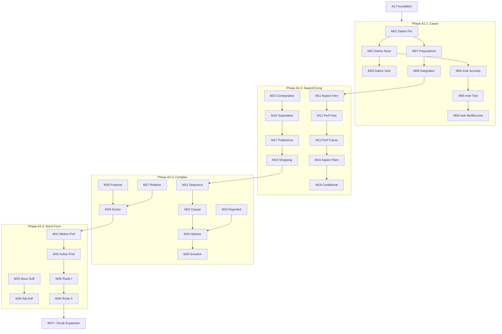

# A2 Curriculum Plan: Ukrainian for English Speakers

**Status:** ✅ COMPLETE (Aligned with Ukrainian State Standard 2024)
**Modules:** 01-50 (50 modules)
**Vocabulary Target:** ~1,250 words (level), ~2,150 cumulative

---

## Quality Standards Reference

For detailed quality metrics on instructional core word counts, immersion percentages, example sentences, engagement boxes, mini-dialogues, and activity requirements by level, please refer to:
`docs/l2-uk-en/MODULE-RICHNESS-GUIDELINES-v2.md`

> **Note on Activities:** The "Signature Activity Concepts" listed in the module specifications below are **mandatory pedagogical anchors** that must be included. However, they are NOT exhaustive. The Module Architect is required to generate additional activities (standard drills, quizzes, etc.) to meet the **minimum target of 8+ activities per module** as defined in the guidelines.

---

## Ukrainian State Standard 2024 Alignment

> **Source:** Українська мова як іноземна: рівні загального володіння та діагностика (2024)
> **Document:** `docs/l2-uk-en/UKRAINIAN-STATE-STANDARD-2024.txt`

The A2 level (Базовий рівень) per the official Ukrainian State Standard 2024 requires:

### Grammar Requirements (Каталог В)

#### Cases (Відмінки) - All 7 Required

| Case | Ukrainian | New at A2 | Key Uses |
|------|-----------|-----------|----------|
| Nominative | Називний | From A1 | Subject |
| Accusative | Знахідний | From A1 | Direct object, direction |
| Genitive | Родовий | From A1 | Possession, absence, quantity |
| Locative | Місцевий | From A1 | Location |
| Vocative | Кличний | From A1 | Address |
| **Dative** | **Давальний** | ✅ M01 | Indirect object, recipient |
| **Instrumental** | **Орудний** | ✅ M04 | Means, accompaniment, profession |

**Dative endings (§4.2.3.4):**
- M: -ові/-у (студентові, брату)
- F: -і (сестрі, мамі)
- N: -у/-ові (місту, дитині)

**Instrumental endings (§4.2.3.5):**
- M: -ом/-ем (студентом, учителем)
- F: -ою/-ею (сестрою, землею)
- N: -ом/-ем (містом, полем)

#### Nouns (Іменник)

**Plural declension - all cases:**

| Case | M hard | M soft | F -а | F -я | N |
|------|--------|--------|------|------|---|
| Nom | -и | -і | -и | -і | -а/-я |
| Acc | = Nom/Gen | = Nom/Gen | -и | -і | -а/-я |
| Gen | -ів | -їв | ∅ | -ь | ∅ |
| Dat | -ам | -ям | -ам | -ям | -ам/-ям |
| Ins | -ами | -ями | -ами | -ями | -ами/-ями |
| Loc | -ах | -ях | -ах | -ях | -ах/-ях |

**Irregular plurals:**
- діти (children), люди (people), очі (eyes), вуха (ears)

#### Adjectives (Прикметник)

**Full declension - all cases, all genders:**

| Case | M | F | N | Pl |
|------|---|---|---|---|
| Nom | -ий/-ій | -а/-я | -е/-є | -і |
| Acc | = Nom/Gen | -у/-ю | -е/-є | = Nom/Gen |
| Gen | -ого | -ої | -ого | -их |
| Dat | -ому | -ій | -ому | -им |
| Ins | -им | -ою | -им | -ими |
| Loc | -ому/-ім | -ій | -ому/-ім | -их |

**✅ NEW at A2 - Comparison:**
- Comparative: -ший (більший), більш + adj (більш цікавий)
- Superlative: най- + comparative (найбільший)
- Irregular: добрий → кращий → найкращий

**❌ NOT at A2:**
- Short-form adjectives (радий is lexical, not grammatical)

#### Pronouns (Займенник)

**Full declension of personal pronouns:**

| Case | я | ти | він | вона | воно | ми | ви | вони |
|------|---|-----|-----|------|------|-----|-----|------|
| Nom | я | ти | він | вона | воно | ми | ви | вони |
| Acc | мене | тебе | його | її | його | нас | вас | їх |
| Gen | мене | тебе | його | її | його | нас | вас | їх |
| Dat | мені | тобі | йому | їй | йому | нам | вам | їм |
| Ins | мною | тобою | ним | нею | ним | нами | вами | ними |
| Loc | мені | тобі | ньому | ній | ньому | нас | вас | них |

**✅ NEW at A2 - свій (reflexive possessive):**
- Я беру свою книгу. (I take my [own] book.)
- Він любить свою роботу. (He loves his [own] work.)

**Declined possessives:**
- мого, твого, нашого, вашого (Gen/Acc animate)
- моєму, твоєму (Dat)
- моїм, твоїм (Ins)

#### Verbs (Дієслово)

**✅ NEW at A2 - Aspect (Вид):**

| Aspect | Form | Example | Use |
|--------|------|---------|-----|
| Imperfective | читати | Я читав книгу | Process, repeated |
| Perfective | прочитати | Я прочитав книгу | Completed, single |

**Common aspect pairs:**
- робити/зробити, писати/написати, читати/прочитати
- говорити/сказати, брати/взяти, давати/дати

**Aspect in past tense:**
- Impf: Я читав цілий день. (I was reading all day.)
- Pf: Я прочитав книгу. (I finished reading the book.)

**Aspect in future:**
- Impf: Я буду читати. (I will be reading.)
- Pf: Я прочитаю. (I will read [and finish].)

**✅ NEW at A2 - Motion verbs:**
- іти/ходити (go on foot, uni/multidirectional)
- їхати/їздити (go by vehicle, uni/multidirectional)
- нести/носити (carry, uni/multidirectional)
- везти/возити (transport, uni/multidirectional)

**✅ NEW at A2 - Conditional mood:**
- якби + past tense + б/би
- Якби я знав, я б сказав. (If I knew, I would say.)

**Imperative - full range:**
- 2nd person: читай/читайте
- 1st person plural: читаймо (let's read)

#### Syntax (Синтаксис)

**✅ NEW at A2 - Complex sentences:**

| Type | Conjunction | Example |
|------|-------------|---------|
| Causal | тому що, бо, оскільки | Я вдома, бо хворію. |
| Concessive | хоча, проте | Хоча холодно, ми підемо. |
| Purpose | щоб + infinitive/past | Я прийшов, щоб допомогти. |
| Relative | який, яка, яке, які | Книга, яку я читаю... |
| Temporal | коли, поки, після того як | Коли я прийшов... |
| Conditional | якщо, якби | Якщо хочеш, допоможу. |

**Reported speech:**
- Він сказав, що прийде. (He said he would come.)
- Вона запитала, чи я вдома. (She asked if I was home.)

### Thematic Requirements (Каталог Б)

- Human (людина): personal info, family, relationships
- Home (дім): accommodation, furniture, rental
- Daily life (побут): routines, time, lifestyle
- Leisure (дозвілля): hobbies, sports, media
- Travel (подорожі): transport, tourism
- Health (здоров'я): body, illness, doctor visits
- Education (освіта): school, university
- Work (робота): employment, workplace
- Shopping (купівля): stores, products, payments
- Services (послуги): bank, post office, etc.
- Nature (природа): weather, environment
- Traditions (традиції): holidays, customs

### Communicative Competence

- Understand sentences and frequently used expressions
- Communicate in simple and routine tasks
- Describe background, immediate environment, matters of immediate need
- Handle routine situations in shops, banks, post offices

### Module Scope Checklist

Before writing/reviewing any A2 module, verify:

| Check | Constraint |
|-------|------------|
| Cases | All 7 cases, full paradigms |
| Aspect | Introduction only, common pairs |
| Motion | Only basic pairs (іти/ходити, їхати/їздити) |
| Complex sentences | All listed conjunctions |
| свій | Introduced, basic usage |
| Adjectives | Comparison forms allowed |
| Conditional | Real conditions only (якщо), unreal introduced (якби) |

---

## Prerequisites from A1

Before starting A2, learners have completed:
- Cyrillic alphabet mastery
- Noun gender system
- Four cases: Nominative, Accusative, Genitive, Locative
- Present, Past, and Future tense (basic)
- Modal verbs (могти, треба, хотіти)
- Adjective agreement basics
- Possessive pronouns
- ~750 vocabulary words

---

## CEFR A2 Can-Do Alignment

### CEFR A2 Descriptor
> Can understand sentences and frequently used expressions related to areas of most immediate relevance. Can communicate in simple and routine tasks requiring a simple and direct exchange of information on familiar and routine matters.

### Learning Outcomes
By module 50, learners can:

**Understanding**
- [ ] Understand short, simple texts on familiar matters
- [ ] Find specific information in everyday material (ads, menus, schedules)
- [ ] Follow short news items and announcements
- [ ] Understand personal letters and messages

**Speaking**
- [ ] Describe education, work, and personal interests
- [ ] Narrate events and experiences
- [ ] Give reasons and explanations for opinions
- [ ] Handle routine situations (shops, banks, post offices)
- [ ] Make and respond to invitations and suggestions

**Writing**
- [ ] Write short notes and messages
- [ ] Describe experiences and events
- [ ] Write personal letters about experiences

---

## Phase A2.1: Completing the Cases (Modules 01-10)

### Learning Goals
- Master Dative case (кому? чому?)
- Master Instrumental case (ким? чим?)
- Complete the 7-case system
- Handle preposition + case combinations

### Grammar Progression

| Module | Grammar Point | Builds On | Enables |
|--------|--------------|-----------|---------|
| 01 | Dative pronouns | A1 pronouns | Indirect objects |
| 02 | Dative nouns | M01, A1 gender | Full dative system |
| 03 | Dative verbs | M01-02 | Natural expression |
| 04 | Instrumental: accompaniment | A1 gender | "with friend" |
| 05 | Instrumental: means/tools | M04 | "by bus", "with pen" |
| 06 | Instrumental with бути/стати | M04-05 | Professions |
| 07 | Preposition master class | All cases | Full prep system |
| 08 | All cases integration | M01-07 | Case mastery |
| 09 | Functional: Post/Bank | M01-08 | Real interaction |
| 10 | Checkpoint: Cases | M01-09 | Assessment |

### Module Content Specifications

#### Module 01: The Dative I - Pronouns
**Grammar:** Dative case pronouns (кому?)

**Pronouns:**
| Nominative | Dative |
|------------|--------|
| я | мені |
| ти | тобі |
| він | йому |
| вона | їй |
| воно | йому |
| ми | нам |
| ви | вам |
| вони | їм |

**Key patterns:**
- Мені подобається музика. (I like music.)
- Тобі потрібно відпочити. (You need to rest.)
- Йому холодно. (He's cold.)

**Vocabulary (20 words):**
мені, тобі, йому, їй, нам, вам, їм, подобатися, здаватися, потрібно, необхідно, цікаво, важко, легко, приємно, боляче, сумно, весело, гарно, погано

**Signature Activity Concepts:**
1. Gap-fill: Choose correct dative pronoun
2. Transform: "I" → "to me" sentences
3. Match-up: Pronoun → dative form

---

#### Module 02: The Dative II - Nouns
**Grammar:** Dative case noun endings

**Endings:**
| Gender | Nom ending | Dat ending | Example |
|--------|------------|------------|---------|
| M hard | consonant | -ові/-у | друг → другові |
| M soft | -ь | -еві | вчитель → вчителеві |
| M -а | -а | -і | тато → татові |
| F hard | -а | -і | сестра → сестрі |
| F soft | -я | -і | Марія → Марії |
| N | -о/-е | -у/-ю | місто → місту |
| Pl | various | -ам | друзі → друзям |

**Key patterns:**
- Я даю книгу другові. (I give the book to a friend.)
- Вона телефонує сестрі. (She calls her sister.)
- Ми пишемо батькам. (We write to our parents.)

**Vocabulary (25 words):**
давати, дарувати, посилати, надсилати, показувати, пояснювати, розповідати, допомагати, заважати, подобатися, личити, личить, підходити, пасувати, вистачати, бракувати, шкодити, вірити, довіряти, радити, дозволяти, забороняти, відповідати, телефонувати, писати

**Signature Activity Concepts:**
1. Gap-fill: Add dative endings to nouns
2. Quiz: Form dative from nominative
3. Match-up: Verb → typical dative object

---

#### Module 03: Dative Verbs
**Grammar:** Verbs that require dative objects

**Dative-only verbs:**
- допомагати + Dat (to help someone)
- заважати + Dat (to bother someone)
- подобатися + Dat (to please someone)
- вірити + Dat (to believe someone)
- дякувати + Dat (to thank someone)

**Dative + Accusative verbs:**
- давати + Dat + Acc (to give smth to smn)
- показувати + Dat + Acc (to show smth to smn)
- пояснювати + Dat + Acc (to explain smth to smn)

**Key patterns:**
- Я допомагаю мамі. (I help mom.)
- Він дає братові книгу. (He gives his brother a book.)
- Це не заважає нікому. (This doesn't bother anyone.)

**Vocabulary (20 words):**
допомагати, заважати, подобатися, вірити, довіряти, дякувати, вибачати, пробачати, заздрити, симпатизувати, співчувати, личити, підходити, вистачати, бракувати, шкодити, служити, належати, сподобатися, захотітися

**Signature Activity Concepts:**
1. Gap-fill: Complete with dative verb
2. Transform: Add dative object to sentence
3. Quiz: Which verbs require dative?

---

#### Module 04: The Instrumental I - Accompaniment
**Grammar:** Instrumental case with preposition з/із/зі

**Endings with з:**
| Gender | Nom ending | Instr ending | Example |
|--------|------------|--------------|---------|
| M hard | consonant | -ом | друг → з другом |
| M soft | -ь | -ем | вчитель → з вчителем |
| F hard | -а | -ою | сестра → з сестрою |
| F soft | -я | -ею | земля → з землею |
| N | -о/-е | -ом/-ем | вікно → з вікном |
| Pl | various | -ами | друзі → з друзями |

**Key patterns:**
- Я йду з другом. (I'm going with a friend.)
- Вона п'є каву з молоком. (She drinks coffee with milk.)
- Ми живемо з батьками. (We live with our parents.)

**Vocabulary (25 words):**
з/із/зі, разом, разом з, поруч з, поряд з, разом із, зустрічатися, гуляти, розмовляти, спілкуватися, зустрітися, познайомитися, посваритися, помиритися, одружитися, розлучитися, подружитися, товаришувати, приятелювати, сусідити, жити, працювати, їсти, пити, грати

**Signature Activity Concepts:**
1. Gap-fill: Add instrumental endings
2. Match-up: Person → з + instrumental
3. Transform: Combine two people doing something together

---

#### Module 05: The Instrumental II - Means & Tools
**Grammar:** Instrumental without preposition (means, tool, manner)

**Uses without preposition:**
- Transport: їхати автобусом (to go by bus)
- Tool: писати ручкою (to write with a pen)
- Manner: говорити голосом (to speak in a voice)
- Body part: махати рукою (to wave with hand)

**Key patterns:**
- Я їду метро. (I'm going by metro.)
- Вона пише олівцем. (She writes with a pencil.)
- Ми їмо виделкою. (We eat with a fork.)

**Vocabulary (25 words):**
автобусом, трамваєм, тролейбусом, метро, машиною, таксі, поїздом, літаком, ручкою, олівцем, ножем, виделкою, ложкою, ножицями, голкою, молотком, пензлем, комп'ютером, телефоном, очима, руками, ногами, головою, голосом, пошепки

**Signature Activity Concepts:**
1. Gap-fill: Choose correct transport instrumental
2. Match-up: Action → tool in instrumental
3. Quiz: "How do you...?" questions

---

#### Module 06: Being and Becoming
**Grammar:** Instrumental with бути, стати, працювати, бути

**Patterns:**
- Він є лікарем. / Він лікар. (He is a doctor.)
- Вона стала вчителькою. (She became a teacher.)
- Я працюю програмістом. (I work as a programmer.)
- Я був студентом. (I was a student.)

**Past/Future бути + Instrumental:**
- був/була/було/були + Instr (was)
- буде/будуть + Instr (will be)

**Vocabulary (25 words):**
бути, стати, ставати, працювати, служити, залишатися, виявитися, здаватися, вважатися, називатися, лікар, вчитель, інженер, програміст, журналіст, юрист, економіст, художник, музикант, письменник, актор, директор, менеджер, секретар, водій

**Signature Activity Concepts:**
1. Transform: Present → past with instrumental
2. Gap-fill: Profession sentences
3. Quiz: "What does he/she work as?"

---

#### Module 07: Preposition Master Class
**Grammar:** Full preposition + case review

**Preposition Table:**
| Prep | Case | Meaning | Example |
|------|------|---------|---------|
| в/у | Acc | into | йти в школу |
| в/у | Loc | in | бути в школі |
| на | Acc | onto | класти на стіл |
| на | Loc | on | лежати на столі |
| з/із | Gen | from | йти з роботи |
| з/із | Instr | with | йти з другом |
| до | Gen | to/until | йти до школи |
| від | Gen | from | лист від мами |
| для | Gen | for | подарунок для тебе |
| без | Gen | without | кава без цукру |
| під | Acc | under (motion) | класти під стіл |
| під | Instr | under (location) | лежати під столом |
| над | Instr | above | лампа над столом |
| перед | Instr | in front of | стояти перед дверима |
| за | Acc | behind (motion) | йти за будинок |
| за | Instr | behind (location) | бути за будинком |
| між | Instr | between | між нами |
| через | Acc | through/because | йти через парк |
| про | Acc | about | говорити про тебе |
| о/об | Loc | at (time) | о третій годині |

**Vocabulary (30 words):**
в/у, на, з/із, до, від, для, без, під, над, перед, за, між, через, про, о/об, біля, коло, поруч, навколо, вздовж, серед, замість, крім, окрім, після, перед, протягом, завдяки, всупереч, незважаючи на

**Signature Activity Concepts:**
1. Gap-fill: Choose correct preposition + case
2. Match-up: Preposition → meaning
3. Quiz: Translate sentences with prepositions

---

#### Module 08: All Cases Practice
**Grammar:** 7-case integration exercises

**Case Summary:**
| Case | Question | Primary Use | Example |
|------|----------|-------------|---------|
| Nom | хто? що? | Subject | Книга лежить. |
| Gen | кого? чого? | Possession, absence | немає книги |
| Dat | кому? чому? | Indirect object | давати другові |
| Acc | кого? що? | Direct object | читати книгу |
| Instr | ким? чим? | Means, with | писати ручкою |
| Loc | на кому? на чому? | Location | на столі |
| Voc | - | Address | Друже! Мамо! |

**Vocabulary (15 words):**
хто, що, кого, чого, кому, чому, кого, що, ким, чим, на кому, на чому, відмінок, називний, родовий, давальний, знахідний, орудний, місцевий, кличний

**Signature Activity Concepts:**
1. Gap-fill: Choose correct case for context
2. Transform: Decline nouns through all 7 cases
3. Quiz: Identify case by ending

---

#### Module 09: At the Post Office & Bank
**Grammar:** Functional application of cases in services

**Post office vocabulary:**
- лист (letter), посилка (package), марка (stamp)
- відправляти (to send), отримувати (to receive)
- адреса (address), індекс (postal code)

**Bank vocabulary:**
- гроші (money), рахунок (account), картка (card)
- переказувати (to transfer), знімати (to withdraw)
- вкладати (to deposit), обмінювати (to exchange)

**Key phrases:**
- Я хочу відправити листа друговІ. (Dat)
- Де можна обміняти долари на гривнІ? (Acc)
- Мені потрібно зняти грошІ з рахункУ. (Gen)

**Vocabulary (30 words):**
пошта, банк, лист, посилка, бандероль, марка, конверт, адреса, індекс, відправляти, отримувати, надсилати, гроші, рахунок, картка, готівка, валюта, переказ, переказувати, знімати, вкладати, обмінювати, курс, відсоток, кредит, позика, квитанція, чек, касир, черга

**Signature Activity Concepts:**
1. Dialogue: Post office interaction
2. Gap-fill: Banking sentences with correct cases
3. Quiz: "I want to..." service phrases

---

#### Module 10: Checkpoint - Cases
**Review of:** Modules 01-09

**Assessment areas:**
1. Dative pronouns and nouns
2. Instrumental endings (with/without preposition)
3. Preposition + case combinations
4. All 7 cases in context
5. Service interactions (post/bank)

**Vocabulary (10 words):** Review selection

**Signature Activity Concepts:**
1. Comprehensive case quiz
2. Sentence transformation (change case)
3. Dialogue completion with correct cases

---

## Phase A2.2: Aspect & Comparison (Modules 11-20)

### Learning Goals
- Understand perfective/imperfective aspect
- Form comparative and superlative adjectives
- Express preferences and make comparisons
- Use conditional constructions

### Grammar Progression

| Module | Grammar Point | Builds On | Enables |
|--------|--------------|-----------|---------|
| 11 | Aspect introduction | A1 verbs | Concept understanding |
| 12 | Perfective in past | M11 | "I did it" |
| 13 | Perfective in future | M11 | "I will do it" |
| 14 | Aspect pairs | M11-13 | Vocabulary expansion |
| 15 | Comparative adjectives | A1 adjectives | "bigger, better" |
| 16 | Superlative adjectives | M15 | "the biggest" |
| 17 | Comparison structures | M15-16 | Preferences |
| 18 | Conditional mood | A1 past tense | "If I were..." |
| 19 | Functional: Shopping | M15-18 | Real comparison |
| 20 | Checkpoint | M11-19 | Assessment |

### Module Content Specifications

#### Module 11: Aspect Introduction
**Grammar:** Perfective vs imperfective concept

**Imperfective (недоконаний вид):**
- Ongoing actions: Я читаю книгу. (I am reading.)
- Repeated actions: Я читаю щодня. (I read every day.)
- Process focus: Він писав три години. (He was writing for 3 hours.)

**Perfective (доконаний вид):**
- Completed actions: Я прочитав книгу. (I read/finished the book.)
- Single events: Вона написала листа. (She wrote the letter.)
- Result focus: Ми вже зробили це. (We already did this.)

**Common pairs:**
| Imperfective | Perfective | Meaning |
|--------------|------------|---------|
| читати | прочитати | to read |
| писати | написати | to write |
| робити | зробити | to do/make |
| говорити | сказати | to say/speak |
| бачити | побачити | to see |
| брати | взяти | to take |
| давати | дати | to give |
| ходити | піти | to go |

**Vocabulary (25 words):**
читати/прочитати, писати/написати, робити/зробити, говорити/сказати, бачити/побачити, брати/взяти, давати/дати, їсти/з'їсти, пити/випити, вчити/вивчити, вчитися/навчитися, купувати/купити, продавати/продати

**Signature Activity Concepts:**
1. Match-up: Imperfective → perfective pairs
2. Gap-fill: Choose correct aspect
3. Quiz: Process or result?

---

#### Module 12: The Completed Past
**Grammar:** Perfective verbs in past tense

**Key patterns:**
- Imperfective past (process): Він читав книгу. (He was reading.)
- Perfective past (result): Він прочитав книгу. (He read/finished it.)

**Aspect choice in past:**
- Duration → imperfective: Я писав дві години.
- Completion → perfective: Я написав листа.
- Repeated → imperfective: Я читав цю книгу багато разів.
- Single event → perfective: Я прочитав цю книгу вчора.

**Vocabulary (20 words):**
зробив, написав, прочитав, сказав, побачив, почув, взяв, дав, пішов, прийшов, приїхав, вийшов, увійшов, почав, закінчив, зрозумів, забув, запам'ятав, знайшов, загубив

**Signature Activity Concepts:**
1. Transform: Imperfective → perfective past
2. Gap-fill: Choose aspect based on context
3. Quiz: Did they finish or were they doing?

---

#### Module 13: Future Plans & Promises
**Grammar:** Perfective future tense

**Formation:**
- Imperfective future: буду + infinitive (буду читати)
- Perfective future: conjugated perfective (прочитаю)

**Conjugation pattern (perfective):**
- прочитаю, прочитаєш, прочитає, прочитаємо, прочитаєте, прочитають

**Usage:**
- Process/ongoing: Я буду читати увечері. (I will be reading.)
- Completion/result: Я прочитаю цю книгу. (I will read/finish this book.)

**Vocabulary (20 words):**
зроблю, напишу, прочитаю, скажу, побачу, почую, візьму, дам, піду, прийду, приїду, вийду, увійду, почну, закінчу, зрозумію, забуду, запам'ятаю, знайду, загублю

**Signature Activity Concepts:**
1. Transform: Imperfective → perfective future
2. Gap-fill: Plans vs promises
3. Quiz: "I will do it" vs "I will be doing it"

---

#### Module 14: Aspect Pairs Deep Dive
**Grammar:** Common aspect pairs and patterns

**Prefixation patterns:**
| Prefix | Impf → Perf | Meaning |
|--------|-------------|---------|
| на- | писати → написати | completion |
| про- | читати → прочитати | through |
| з- | робити → зробити | completion |
| по- | бачити → побачити | completion |
| ви- | вчити → вивчити | master |

**Suffixation patterns:**
| Imperfective | Perfective | Pattern |
|--------------|------------|---------|
| давати | дати | -ва- removal |
| вставати | встати | -ва- removal |
| відпочивати | відпочити | -ва- removal |

**Suppletive pairs (different roots):**
- говорити / сказати
- брати / взяти
- класти / покласти

**Vocabulary (30 words):**
відпочивати/відпочити, вставати/встати, одягатися/одягнутися, сідати/сісти, лягати/лягти, відкривати/відкрити, закривати/закрити, вмикати/увімкнути, вимикати/вимкнути, починати/почати, закінчувати/закінчити, отримувати/отримати, посилати/послати, вибирати/вибрати, вирішувати/вирішити

**Signature Activity Concepts:**
1. Match-up: Extended aspect pairs
2. Pattern recognition: Identify prefix/suffix
3. Gap-fill: Use correct pair member

---

#### Module 15: Bigger, Better, Stronger
**Grammar:** Comparative adjectives

**Regular formation:**
- Stem + -ший/-іший: великий → більший (bigger)
- Synthetic: добрий → добріший (kinder)

**Compound formation:**
- більш + adjective: більш важливий (more important)
- менш + adjective: менш цікавий (less interesting)

**Irregular comparatives:**
| Positive | Comparative | Meaning |
|----------|-------------|---------|
| добрий | кращий | good → better |
| поганий | гірший | bad → worse |
| великий | більший | big → bigger |
| малий | менший | small → smaller |
| високий | вищий | tall → taller |
| низький | нижчий | short → shorter |

**Comparison structure:**
- X + comparative + ніж + Y: Він старший ніж я.
- X + comparative + за + Acc: Він старший за мене.

**Vocabulary (25 words):**
більший, менший, кращий, гірший, вищий, нижчий, довший, коротший, ширший, вужчий, дорожчий, дешевший, старший, молодший, швидший, повільніший, сильніший, слабший, легший, важчий, ніж, за, набагато, трохи, значно

**Signature Activity Concepts:**
1. Transform: Positive → comparative
2. Gap-fill: Comparison sentences
3. Quiz: Which is bigger/better/etc.?

---

#### Module 16: The Best, The Worst
**Grammar:** Superlative adjectives

**Formation:**
- най- + comparative: найбільший (biggest)
- Regular: найкращий, найгірший, найвищий

**Absolute superlative (intensification):**
- дуже + adjective: дуже великий (very big)
- надзвичайно + adj: надзвичайно цікавий (extremely interesting)

**Irregular superlatives:**
| Comparative | Superlative |
|-------------|-------------|
| кращий | найкращий (best) |
| гірший | найгірший (worst) |
| більший | найбільший (biggest) |
| менший | найменший (smallest) |

**Vocabulary (20 words):**
найбільший, найменший, найкращий, найгірший, найвищий, найнижчий, найдовший, найкоротший, найдорожчий, найдешевший, найстарший, наймолодший, найшвидший, найповільніший, найсильніший, найслабший, найлегший, найважчий, найцікавіший, найважливіший

**Signature Activity Concepts:**
1. Transform: Comparative → superlative
2. Gap-fill: "the most..." sentences
3. Quiz: World records and "the best"

---

#### Module 17: Preferences & Choices
**Grammar:** Comparison structures for expressing preferences

**Expressing preference:**
- Мені більше подобається X ніж Y.
- Я віддаю перевагу X (Dat).
- Краще X ніж Y.
- Я волів би X (Acc).

**Comparison of actions:**
- Краще читати ніж дивитися телевізор.
- Легше говорити ніж робити.

**Choice expressions:**
- Я б вибрав/вибрала...
- Мені більше підходить...
- Я віддаю перевагу...

**Vocabulary (20 words):**
віддавати перевагу, вибирати, волити, подобатися більше, краще, гірше, легше, важче, цікавіше, нудніше, корисніше, шкідливіше, дорожче, дешевше, швидше, повільніше, ефективніше, зручніше, комфортніше, практичніше

**Signature Activity Concepts:**
1. Express preference: "I prefer X to Y"
2. Compare options: Which is better?
3. Dialogue: Making choices

---

#### Module 18: If I Were...
**Grammar:** Conditional mood (якби + past)

**Formation:**
- якби + past tense + б/би (result clause)
- Якби я мав час, я б прочитав цю книгу.

**Real vs unreal conditions:**
- Real (якщо): Якщо матиму час, прочитаю. (If I have time...)
- Unreal (якби): Якби я мав час, прочитав би. (If I had time...)

**Common patterns:**
- Якби я був/була... (If I were...)
- Якби я знав/знала... (If I knew...)
- Я б хотів/хотіла... (I would like...)

**Vocabulary (20 words):**
якби, якщо, б/би, мав би, був би, мала б, була б, знав би, міг би, хотів би, робив би, пішов би, поїхав би, купив би, сказав би, можливо, напевно, мабуть, певно, обов'язково

**Signature Activity Concepts:**
1. Transform: Real → unreal conditions
2. Gap-fill: Complete conditional sentences
3. Quiz: "What would you do if...?"

---

#### Module 19: Smart Shopping
**Grammar:** Functional application of comparison

**Shopping comparisons:**
- Цей дорожчий, але кращий.
- Той дешевший за цей.
- Який найдешевший?
- Мені більше подобається червоний.

**Negotiation phrases:**
- Чи можна дешевше? (Can it be cheaper?)
- Є щось краще? (Is there something better?)
- Що ви порекомендуєте? (What do you recommend?)

**Vocabulary (20 words):**
порівнювати, вибирати, шукати, знаходити, рекомендувати, радити, пропонувати, знижка, акція, розпродаж, якість, ціна, вартість, вигідний, невигідний, дорогий, дешевий, доступний, преміум, економ

**Signature Activity Concepts:**
1. Dialogue: Comparing products
2. Gap-fill: Shopping dialogue
3. Quiz: Best deal calculations

---

#### Module 20: Checkpoint - Aspect & Comparison
**Review of:** Modules 11-19

**Assessment areas:**
1. Aspect pairs and usage
2. Perfective past and future
3. Comparative and superlative adjectives
4. Conditional constructions
5. Shopping/comparison interactions

**Vocabulary (10 words):** Review selection

---

## Phase A2.3: Complex Sentences (Modules 21-30)

### Learning Goals
- Narrate events in sequence
- Express opinions and emotions
- Use subordinate clauses (тому що, щоб, який)
- Handle reported speech basics

### Grammar Progression

| Module | Grammar Point | Builds On | Enables |
|--------|--------------|-----------|---------|
| 21 | Sequence connectors | A1 basic | Storytelling |
| 22 | Causal clauses | M21 | Explaining why |
| 23 | Reported speech | A1 speech verbs | Quoting others |
| 24 | Opinion expressions | M22-23 | Giving views |
| 25 | Emotion expressions | M24 | Feelings |
| 26 | Purpose clauses | A1 infinitive | Goals |
| 27 | Relative clauses | A1 questions | Descriptions |
| 28 | Time clauses | M21 | When things happen |
| 29 | Functional: Doctor | All A2.3 | Medical interaction |
| 30 | Checkpoint | M21-29 | Assessment |

### Module Content Specifications

#### Module 21: Telling Stories
**Grammar:** Sequence connectors

**Sequence markers:**
- спочатку (at first), потім (then), після цього (after this)
- нарешті (finally), врешті-решт (in the end)
- тоді (then), одного разу (once)
- раптом (suddenly), несподівано (unexpectedly)

**Key patterns:**
- Спочатку я прокинувся, потім поснідав.
- Нарешті ми прийшли додому.
- Раптом пішов дощ.

**Vocabulary (25 words):**
спочатку, потім, після цього, перед цим, нарешті, врешті-решт, тоді, одного разу, якось, колись, раптом, несподівано, відразу, негайно, згодом, пізніше, раніше, давно, недавно, щойно, ледве, ще, вже, тільки-но, саме тоді

**Signature Activity Concepts:**
1. Unjumble: Put story in order
2. Gap-fill: Add sequence connectors
3. Production: Use connectors in storytelling

---

#### Module 22: Because and Although
**Grammar:** Causal/concessive clauses

**Causal connectors (cause):**
- тому що (because): Я не прийшов, тому що був хворий.
- бо (because - colloquial): Вона плаче, бо сумно.
- оскільки (since): Оскільки пізно, я йду.

**Concessive connectors (contrast):**
- хоча (although): Хоча холодно, я вийду.
- проте (however): Він старий, проте сильний.
- але (but): Дорого, але якісно.

**Key patterns:**
- Clause + тому що + clause
- Хоча + clause, clause

**Vocabulary (20 words):**
тому що, бо, оскільки, через те що, завдяки тому що, хоча, незважаючи на те що, проте, однак, але, зате, все-таки, все ж таки, попри те що, хоч і, хай, нехай, хоч би, дарма що, якби не

**Signature Activity Concepts:**
1. Connect: Cause and effect sentences
2. Transform: "because" → "although"
3. Gap-fill: Choose correct connector

---

#### Module 23: She Said That...
**Grammar:** Basic reported speech

**Direct → Indirect speech:**
- Direct: Він сказав: "Я йду."
- Indirect: Він сказав, що він іде.

**Tense changes:**
- Present → present or past: "йду" → що йде/що йшов
- Future → future or would: "піду" → що піде

**Speech verbs:**
- сказати/казати (to say)
- говорити (to speak)
- розповідати (to tell)
- питати/запитати (to ask)
- відповідати (to answer)

**Vocabulary (20 words):**
сказати, казати, говорити, розповідати, питати, запитати, відповідати, повідомити, пояснити, стверджувати, заперечувати, обіцяти, попередити, нагадати, переконувати, скаржитися, хвалити, критикувати, коментувати, що

**Signature Activity Concepts:**
1. Transform: Direct → indirect speech
2. Gap-fill: Reported speech sentences
3. Quiz: "What did they say?"

---

#### Module 24: I Think That...
**Grammar:** Opinion expressions

**Opinion structures:**
- Я думаю, що... (I think that...)
- Я вважаю, що... (I believe that...)
- На мою думку, ... (In my opinion,...)
- Мені здається, що... (It seems to me that...)

**Agreeing/Disagreeing:**
- Я згоден/згодна (I agree)
- Я не згоден/не згодна (I disagree)
- Це правда (That's true)
- Це не так (That's not so)

**Vocabulary (20 words):**
думати, вважати, гадати, здаватися, здається, на мою думку, на мій погляд, з моєї точки зору, згоден/згодна, не згоден, погоджуватися, не погоджуватися, правда, неправда, так, не так, можливо, напевно, безумовно, очевидно

**Signature Activity Concepts:**
1. Production: Express opinion
2. Production: Agree/Disagree
3. Dialogue: Exchange views

---

#### Module 25: I'm Happy That...
**Grammar:** Emotion expressions

**Emotion + що structures:**
- Я радий/рада, що... (I'm happy that...)
- Мені сумно, що... (I'm sad that...)
- Шкода, що... (It's a pity that...)
- Добре, що... (It's good that...)

**Emotion vocabulary:**
- радість (joy), сум (sadness), страх (fear)
- здивування (surprise), гнів (anger)
- полегшення (relief), розчарування (disappointment)

**Vocabulary (25 words):**
радий/рада, щасливий, задоволений, сумний, засмучений, здивований, переляканий, розчарований, хвилюватися, турбуватися, радіти, сумувати, боятися, дивуватися, шкода, добре, погано, прикро, приємно, цікаво, нудно, страшно, радісно, сумно, щасливо

**Signature Activity Concepts:**
1. Production: Express emotion
2. Match-up: Situation → emotion
3. Gap-fill: Emotion sentences

---

#### Module 26: In Order To...
**Grammar:** Purpose clauses (щоб)

**Purpose structures:**
- щоб + infinitive (same subject): Я прийшов, щоб допомогти.
- щоб + past form (different subjects): Я хочу, щоб ти прийшов.

**Note:** Ukrainian uses past form, NOT subjunctive!

**Key patterns:**
- Я вчуся, щоб знати українську.
- Вона працює, щоб заробляти гроші.
- Я хочу, щоб він прийшов. (past form: прийшов)

**Vocabulary (20 words):**
щоб, для того щоб, аби, задля того щоб, з метою, прийшов, пішов, зробив, сказав, написав, прочитав, вивчив, зрозумів, допоміг, дав, показав, пояснив, розповів, купив, принести

**Signature Activity Concepts:**
1. Complete: "I came to..."
2. Transform: Two sentences → purpose clause
3. Gap-fill: щоб + correct form

---

#### Module 27: Which One?
**Grammar:** Relative clauses (який, яка, яке, які)

**Agreement:**
- який agrees with antecedent in gender/number
- який declines for case within relative clause

**Examples:**
- Людина, яка говорить... (The person who speaks...)
- Книга, яку я читаю... (The book that I'm reading...)
- Хлопець, якому я допомагаю... (The boy whom I'm helping...)

**Case in relative clause:**
| Role in clause | Case of який |
|----------------|--------------|
| Subject | Nominative |
| Direct object | Accusative |
| Indirect object | Dative |
| With preposition | varies |

**Vocabulary (20 words):**
який, яка, яке, які, якого, якої, якому, якій, яким, якою, якими, котрий, що, де, куди, звідки, коли, чий, чия, чиє

**Signature Activity Concepts:**
1. Combine: Two sentences → relative clause
2. Gap-fill: Correct form of який
3. Quiz: "The person who..."

---

#### Module 28: When, While, After
**Grammar:** Time clauses

**Time connectors:**
- коли (when): Коли я прийшов, він спав.
- поки (while): Поки я читав, вона готувала.
- після того як (after): Після того як я поїв, я пішов.
- перш ніж (before): Перш ніж вийти, зателефонуй.
- як тільки (as soon as): Як тільки прийду, подзвоню.

**Key patterns:**
- Main clause + коли + subordinate clause
- Subordinate clause + , + main clause

**Vocabulary (20 words):**
коли, поки, доки, поки не, після того як, перед тим як, перш ніж, як тільки, щойно, ледве, з того часу як, до того як, під час того як, тим часом як, тоді коли, в той час як, того дня коли, кожного разу коли, завжди коли, раз у раз коли

**Signature Activity Concepts:**
1. Combine: Time clauses
2. Gap-fill: Choose correct connector
3. Unjumble: Before/after relationships

---

#### Module 29: At the Doctor's
**Grammar:** Functional integration for medical context

**At the doctor:**
- Що вас турбує? (What's bothering you?)
- У мене болить голова. (I have a headache.)
- Мені потрібен лікар. (I need a doctor.)
- Де болить? (Where does it hurt?)

**Symptoms vocabulary:**
- болить (hurts): Болить голова/живіт/горло
- температура (fever): У мене температура.
- кашель (cough): У мене кашель.
- нежить (runny nose): У мене нежить.

**Vocabulary (30 words):**
лікар, пацієнт, хворий, хвороба, симптом, біль, температура, кашель, нежить, горло, голова, живіт, спина, рука, нога, око, вухо, серце, ліки, таблетка, рецепт, аптека, лікарня, поліклініка, хворіти, одужувати, оглядати, лікувати, приймати, відчувати

**Signature Activity Concepts:**
1. Dialogue: Doctor-patient dialogue
2. Gap-fill: Symptom descriptions
3. Match-up: Symptom → remedy

---

#### Module 30: Checkpoint - Complex Ideas
**Review of:** Modules 21-29

**Assessment areas:**
1. Sequence and storytelling
2. Causal and concessive clauses
3. Reported speech
4. Opinion and emotion expressions
5. Purpose and relative clauses
6. Time clauses
7. Medical vocabulary

**Vocabulary (10 words):** Review selection

---

## Phase A2.4: Word Formation (Modules 31-36)

### Learning Goals
- Understand how prefixes change verb meaning
- Use suffixes to form nouns and adjectives
- Recognize word families through roots
- Multiply vocabulary through derivation

### Grammar Progression

| Module | Grammar Point | Builds On | Enables |
|--------|--------------|-----------|---------|
| 31 | Motion verb prefixes | A1 motion verbs | Movement vocabulary |
| 32 | Action verb prefixes | All verbs | Verbal precision |
| 33 | Noun suffixes | A1 nouns | Noun formation |
| 34 | Adjective suffixes | A1 adjectives | Adjective formation |
| 35 | Root families I | All vocab | Recognition |
| 36 | Root families II | M35 | Expansion |

### Module Content Specifications

#### Module 31: Prefixes I - Motion Verbs
**Grammar:** Motion verb prefix system

**Key prefixes:**
| Prefix | Meaning | Example |
|--------|---------|---------|
| при- | arrival | прийти (come, arrive) |
| ви- | exit | вийти (go out) |
| в-/у- | entry | увійти (enter) |
| за- | drop by | зайти (stop by) |
| пере- | across | перейти (cross) |
| від- | away | відійти (walk away) |
| під- | approach | підійти (approach) |
| об- | around | обійти (go around) |

**Key patterns:**
- йти → прийти, вийти, увійти, зайти, перейти
- їхати → приїхати, виїхати, в'їхати, заїхати, переїхати

**Vocabulary (35 words):**
прийти, вийти, увійти, зайти, перейти, відійти, підійти, обійти, пройти, розійтися, сійти, дійти, приїхати, виїхати, в'їхати, заїхати, переїхати, відїхати, під'їхати, об'їхати, проїхати, роз'їхатися, доїхати, принести, винести, внести, занести, перенести, відвести, привести, вивести, відвезти, привезти

**Signature Activity Concepts:**
1. Match-up: Prefix → meaning
2. Transform: Base verb → prefixed verb
3. Gap-fill: Choose correct prefix

---

#### Module 32: Prefixes II - Action Verbs
**Grammar:** Prefixes with non-motion verbs

**Productive prefixes:**
| Prefix | Meaning | Example |
|--------|---------|---------|
| на- | accumulation | написати (write out) |
| по- | beginning/brief | почитати (read a bit) |
| роз- | dispersion | роздати (distribute) |
| від- | separation | відкрити (open) |
| за- | closure | закрити (close) |
| пере- | redo/across | переписати (rewrite) |
| до- | completion | дочитати (finish reading) |

**Key patterns:**
- писати → написати, переписати, дописати, підписати
- робити → зробити, переробити, доробити

**Vocabulary (30 words):**
написати, переписати, дописати, підписати, записати, описати, виписати, зробити, переробити, доробити, відкрити, закрити, відчинити, зачинити, роздати, роздавати, подати, віддати, передати, здати, видати, надати, придати, роз'єднати, з'єднати, від'єднати, приєднати, під'єднати, перенести, донести

**Signature Activity Concepts:**
1. Pattern recognition: Identify prefix function
2. Transform: Add prefixes to build words
3. Gap-fill: Prefixed verbs in context

---

#### Module 33: Suffixes I - Nouns
**Grammar:** Noun-forming suffixes

**Verbal nouns (-ння/-ття):**
- читати → читання (reading)
- жити → життя (life)
- вчити → вчення (teaching)

**Abstract nouns (-ість):**
- важливий → важливість (importance)
- можливий → можливість (possibility)

**Agent nouns (-ач/-ець):**
- читати → читач (reader)
- співати → співець (singer)

**Diminutives (-ок/-ик/-очок):**
- дім → домик (little house)
- кіт → котик (kitty)

**Vocabulary (35 words):**
читання, писання, навчання, життя, питання, завдання, важливість, можливість, відповідальність, радість, молодість, старість, читач, письменник, вчитель, водій, продавець, співець, борець, глядач, домик, котик, синок, братик, сестричка, книжечка, ручечка, квіточка, сонечко, дівчинка

**Signature Activity Concepts:**
1. Transform: Verb → verbal noun
2. Transform: Adjective → abstract noun
3. Transform: Create diminutives from nouns

---

#### Module 34: Suffixes II - Adjectives
**Grammar:** Adjective-forming suffixes

**From nouns (-ний/-овий/-ський):**
- музика → музичний (musical)
- наука → науковий (scientific)
- Україна → український (Ukrainian)

**From verbs (-лий/-чий):**
- зів'янути → зів'ялий (withered)
- лежати → лежачий (lying)

**Key patterns:**
- -ний: загальний, особливий, важливий
- -овий: кольоровий, смаковий
- -ський: міський, людський

**Vocabulary (30 words):**
музичний, науковий, український, російський, англійський, міський, сільський, людський, дитячий, жіночий, чоловічий, кольоровий, смаковий, матеріальний, духовний, фізичний, хімічний, історичний, географічний, математичний, робочий, лежачий, стоячий, біжучий, гарячий, холодний, теплий, свіжий, старий, молодий

**Signature Activity Concepts:**
1. Transform: Noun → adjective
2. Match-up: Suffix → meaning
3. Gap-fill: Adjective forms

---

#### Module 35: Root Families I
**Grammar:** Common roots and derivatives

**ход- family (go/walk):**
- ходити, хід, вхід, вихід, похід, прихід, відхід
- пішохід, перехід, східний, західний

**пис- family (write):**
- писати, письмо, письменник, підпис, запис, опис
- списати, переписати, дописати, надпис

**Key patterns:**
- Root + prefix/suffix = new word
- Recognize roots to guess meaning

**Vocabulary (30 words):**
ходити, хід, вхід, вихід, похід, прихід, відхід, перехід, пішохід, писати, письмо, письменник, підпис, запис, опис, напис, надпис, читати, читач, читання, прочитати, дочитати, перечитати, бачити, бачення, побачення, передбачення, огляд, погляд, вигляд

**Signature Activity Concepts:**
1. Group-sort: Words by root family
2. Production: Guess meaning from root
3. Production: Build words from roots

---

#### Module 36: Root Families II
**Grammar:** Motion and perception roots

**бач- family (see):**
- бачити, бачення, побачення, передбачення
- видний, очевидний, явний

**слух- family (hear):**
- слухати, слух, послух, слухач
- чути, почуття, відчуття

**говор-/мов- family (speak):**
- говорити, розмова, мова, мовлення
- мовчати, мовчання, мовчазний

**Vocabulary (25 words):**
бачити, бачення, побачення, передбачення, огляд, погляд, вигляд, слухати, слух, послух, слухач, чути, почуття, відчуття, говорити, розмова, мова, мовлення, мовець, мовчати, мовчання, думати, думка, обдумати, роздуми

**Signature Activity Concepts:**
1. Quiz: Root identification
2. Match-up: Word family
3. Production: Build derivatives from roots

---

## Phase A2.5: Vocabulary Expansion (Modules 37-48)

### Learning Goals
- Deepen vocabulary in 12 practical domains
- Build natural word combinations
- Cover all thematic requirements from State Standard

### Module Structure

| # | Title | Domain | New Words |
|---|-------|--------|-----------|
| 37 | Food & Cooking | Daily Life | 35 |
| 38 | Health & Body | Health | 35 |
| 39 | Home & Furniture | Daily Life | 30 |
| 40 | Nature & Weather | Environment | 30 |
| 41 | Emotions & Personality | Social | 30 |
| 42 | Work & Professions | Professional | 30 |
| 43 | Technology & Media | Modern Life | 30 |
| 44 | Hobbies & Leisure | Lifestyle | 30 |
| 45 | Education & Learning | Education | 30 |
| 46 | Shopping & Services | Daily Life | 30 |
| 47 | Sports & Fitness | Lifestyle | 25 |
| 48 | Arts & Culture | Culture | 25 |

### Vocabulary Domains (per State Standard Каталог Б)

**Module 37: Food & Cooking**
- Kitchen: каструля, сковорода, духовка, мікрохвильовка
- Cooking: нарізати, смажити, варити, пекти, тушкувати
- Meals: сніданок, обід, вечеря, перекус
- Tastes: солодкий, солоний, кислий, гіркий, гострий

**Module 38: Health & Body**
- Body: серце, легені, печінка, нирки, шлунок
- Systems: травлення, дихання, кровообіг
- Symptoms: біль, температура, запалення, нежить
- Treatment: ліки, таблетки, мазь, ін'єкція

**Module 39: Home & Furniture**
- Rooms: вітальня, спальня, кабінет, комора
- Furniture: комод, полиця, шафа, крісло, диван
- Appliances: пральна машина, посудомийка
- Actions: прибирати, ремонтувати, облаштовувати

**Module 40: Nature & Weather**
- Landscape: гора, долина, озеро, ріка, море
- Weather: хмарно, сонячно, гроза, туман
- Seasons: весна, літо, осінь, зима
- Flora/Fauna: дерево, квітка, птах, тварина

**Module 41: Emotions & Personality**
- Emotions: радість, сум, гнів, страх, здивування
- Personality: добрий, чесний, сміливий, терплячий
- States: задоволений, розчарований, стурбований
- Actions: радіти, сумувати, хвилюватися

**Module 42: Work & Professions**
- Jobs: інженер, лікар, вчитель, програміст, юрист
- Workplace: офіс, фабрика, майстерня
- Actions: працювати, керувати, співпрацювати
- Career: кар'єра, зарплата, відпустка

**Module 43: Technology & Media**
- Devices: комп'ютер, смартфон, планшет
- Internet: інтернет, вебсайт, соціальні мережі
- Media: новини, стаття, блог, подкаст
- Actions: завантажувати, публікувати, шукати

**Module 44: Hobbies & Leisure**
- Activities: малювати, грати, співати, танцювати
- Collecting: колекціонувати, збирати
- Travel: подорожувати, відвідувати, оглядати
- Entertainment: кіно, театр, концерт

**Module 45: Education & Learning**
- School: урок, клас, предмет, вчитель
- University: лекція, семінар, іспит, залік
- Process: вчитися, навчатися, складати іспит
- Materials: підручник, зошит, конспект

**Module 46: Shopping & Services**
- Stores: магазин, супермаркет, ринок, бутік
- Services: банк, пошта, перукарня, хімчистка
- Actions: купувати, платити, замовляти
- Money: готівка, картка, рахунок, чек

**Module 47: Sports & Fitness**
- Sports: футбол, баскетбол, плавання, біг
- Activities: тренуватися, займатися, бігати
- Places: стадіон, басейн, спортзал
- Events: змагання, матч, чемпіонат

**Module 48: Arts & Culture**
- Visual: картина, скульптура, виставка
- Music: пісня, мелодія, концерт
- Theater: вистава, п'єса, акторка
- Traditions: свято, звичай, обряд

---

## Phase A2.6: Review & Consolidation (Modules 49-50)

### Learning Goals
- Consolidate all A2 grammar
- Review word formation patterns
- Integrate vocabulary across domains
- Prepare for B1 level

### Module Structure

| # | Title | Focus | Type |
|---|-------|-------|------|
| 49 | A2 Grammar Review | All grammar consolidation | Review |
| 50 | A2 Capstone | Comprehensive assessment | Checkpoint |

### Module 49: A2 Grammar Review

**Case system review:**
- All 7 cases with correct endings
- Preposition + case combinations
- Common case errors and corrections

**Aspect review:**
- Perfective/imperfective selection
- Aspect pairs vocabulary
- Aspect in all tense contexts

**Complex sentences review:**
- Causal, concessive, purpose clauses
- Relative clauses with який
- Time clauses and sequence

**Word formation review:**
- Prefix patterns
- Suffix patterns
- Root family recognition

### Module 50: A2 Capstone

**Assessment areas:**
1. Cases: Full paradigm and usage
2. Aspect: Selection in context
3. Comparison: Comparative/superlative
4. Complex sentences: All clause types
5. Word formation: Recognition and production
6. Vocabulary: All 12 thematic domains

**Can-do verification:**
- [ ] Handle routine situations at shops, banks, post offices
- [ ] Describe experiences and events with reasons
- [ ] Understand and produce texts on familiar topics
- [ ] Use all 7 cases correctly
- [ ] Select appropriate aspect

---

## Vocabulary Summary

### Distribution by Phase

| Phase | Modules | New Words | Focus |
|-------|---------|-----------|-------|
| A2.1 Cases | 01-10 | ~200 | Case-related vocabulary |
| A2.2 Aspect & Comparison | 11-20 | ~200 | Verbs, adjectives |
| A2.3 Complex Sentences | 21-30 | ~200 | Connectors, expressions |
| A2.4 Word Formation | 31-36 | ~185 | Prefixes, suffixes, roots |
| A2.5 Vocabulary Expansion | 37-48 | ~360 | 12 thematic domains |
| A2.6 Review | 49-50 | ~20 | Consolidation |
| **Total** | **50** | **~1,050** | |

**Cumulative after A2:** ~1,800 words

---

## Cross-Module Dependencies

## Cross-Module Dependencies

---

## Activity Types by Module Type

### G-Modules (Grammar Focus)
1. Quiz: Pattern recognition (MCQ)
2. Fill-in: Gap-fill exercises
3. Transform: Transformation drills
4. Match-up: Grammar concepts
5. Error-correction: Find and fix errors

### V-Modules (Vocabulary Focus)
1. Match-up: Flash cards (conceptual)
2. Match-up: Image matching
3. Group-sort: Category sorting
4. Fill-in: Context sentences
5. Production: Collocations practice

### F-Modules (Functional)
1. Dialogue: Completion tasks
2. Dialogue: Role-play scenarios
3. Fill-in: Real-world task simulation
4. Quiz: Listening comprehension

### R-Modules (Review)
1. Quiz: Mixed grammar check
2. Fill-in: Vocabulary recall
3. Match-up: Integrated skills
4. Production: Self-assessment tasks

---

## Transition to B1

With ~1,800 words after A2, learners are prepared for B1 which focuses on:
- Advanced aspect usage in complex contexts
- Motion verbs with full prefix system
- Abstract vocabulary (ideas, problems, solutions)
- Opinion and discussion expressions
- Complex narrative and argumentation
- Passive and impersonal constructions

---

## Implementation Notes

### Module Types Distribution
- **Grammar (G)**: 25 modules - 25-30 new words each
- **Word Formation (WF)**: 6 modules - 30-35 new words each
- **Vocabulary (V)**: 12 modules - 30-40 new words each
- **Function (F)**: 3 modules - 25-30 new words each
- **Review (R)**: 4 modules - 10-20 new words each

### Immersion Level
- A2: 40% Ukrainian, 60% English (immersionLevel: 0.40)
- Progressive increase through the level:
  - A2.1-A2.3: 35% Ukrainian
  - A2.4-A2.5: 45% Ukrainian
  - A2.6: 50% Ukrainian

### Transliteration
- Modules 01+ (A2): No transliteration (Cyrillic only)
- Learners are expected to read Cyrillic fluently from A1

---

## Quality Checklist

Before generating any A2 module:

- [ ] Grammar builds on previous modules and A1
- [ ] Vocabulary is within domain targets
- [ ] Can-do statements align with CEFR A2
- [ ] Activities match module type (G/WF/V/F/R)
- [ ] No transliteration (Cyrillic only)
- [ ] No forward references to unlearned grammar
- [ ] Dative and Instrumental covered before complex uses
- [ ] Aspect introduced before conditional mood
- [ ] Review modules cover all preceding content

---

## Related Documentation

- `docs/l2-uk-en/A1-CURRICULUM-PLAN.md` - Prerequisites
- `docs/l2-uk-en/B1-CURRICULUM-PLAN.md` - Next level (Modules 01-80)
- `docs/l2-uk-en/UKRAINIAN-STATE-STANDARD-2024.txt` - Official requirements
- `docs/MARKDOWN-FORMAT.md` - Module syntax

---

## Changelog

- **2025-12-05:** Expanded State Standard alignment with full grammar tables, moved to beginning
- **2025-12-05:** Upgraded with detailed module specifications
- **Previous:** Basic structure only
