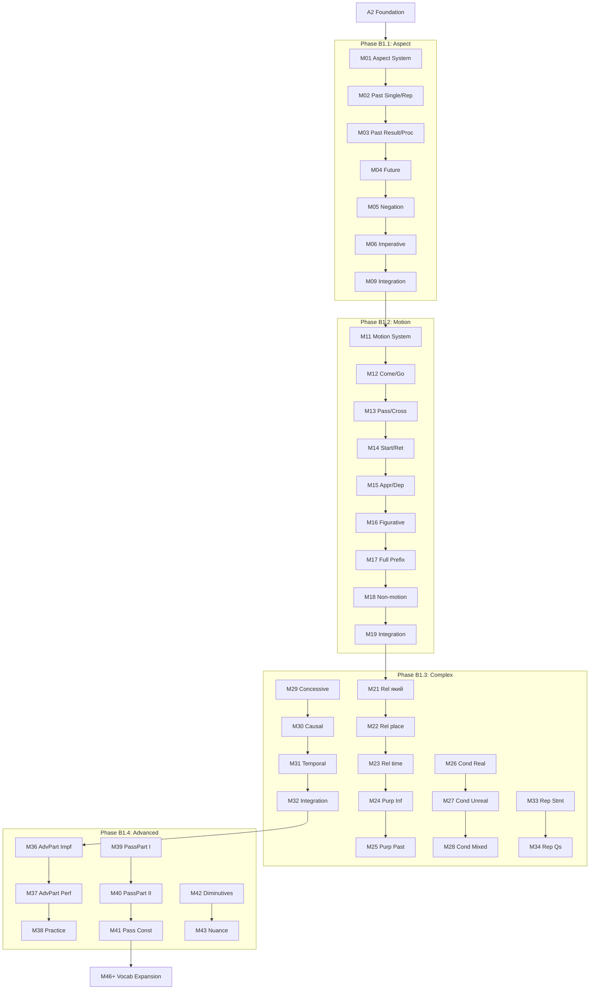

# B1 Curriculum Plan: Ukrainian for English Speakers

**Status:** ✅ COMPLETE (Aligned with Ukrainian State Standard 2024)
**Modules:** 01-91 (91 modules, including 5 metalanguage bridge modules)
**Vocabulary Target:** ~1,500 words (level), ~3,300 cumulative

---

## 📋 Templates & Resources

**Before creating B1 modules, consult these templates:**

- [Grammar modules (M06-51: Aspect, Motion, Complex Sentences, Advanced Grammar)](templates/b1-grammar-module-template.md)
- [Vocabulary modules (M52-71: Abstract concepts, Opinions, Discourse markers)](templates/b1-vocab-module-template.md)
- [Checkpoint modules (M15, M25, M34, M41, M51) — grammar phases only](templates/b1-checkpoint-module-template.md)
- [Cultural modules (M72-81: Regions, Music, Cinema, Tech, Sports, Cuisine)](templates/b1-cultural-module-template.md)
- [Integration modules (M82-86: News reading, Podcasts, Grammar/Vocab integration, Capstone)](templates/b1-integration-module-template.md)

**Quick Reference:**

- Level requirements: `claude_extensions/quick-ref/b1.md`
- Module richness guidelines: `MODULE-RICHNESS-GUIDELINES-v2.md`

---

## Vocabulary Approach (B1+)

**From B1 onwards, vocabulary is not prescribed in this plan.** Instead, vocabulary emerges naturally from the module's thematic content and is validated against:

- **Richness targets:** 25+ unique words per module (enforced by audit)
- **Integration requirements:** 80% used in activities, 50% in lesson text (enforced by audit)
- **Register appropriateness:** Vocabulary complexity matches B1 proficiency level

The "Content Guidance" sections below provide **thematic direction** and **pop culture anchors** to guide vocabulary selection, but builders have flexibility to choose words that best serve the pedagogical goals.

**Why this approach?**
- Content-driven vocabulary is more authentic and contextual
- Historical/cultural modules require domain-specific terminology
- Pop culture references evolve and need flexibility
- Quality is enforced through metrics, not prescriptive lists

---

## Quality Standards & Pedagogical Strategy

**Reference:** `docs/l2-uk-en/MODULE-RICHNESS-GUIDELINES-v2.md`
**Philosophy:** `claude_extensions/quick-ref/philosophy.md` (Strict Linguistic Standards & Source Authority)

### Ukrainian-First Immersion Strategy (B1 Specific)

**Philosophy:** At B1, students learn grammar **IN Ukrainian** — the way native speakers learn in school. This requires a 5-module bridge to teach grammar terminology first.

| Phase     | Modules | Immersion    | Content Focus                                                    |
| --------- | ------- | ------------ | ---------------------------------------------------------------- |
| **B1.0**  | M01-05  | **No limit** | Metalanguage bridge — teaches grammar terms in Ukrainian         |
| **B1.1**  | M06-15  | **100%**     | Aspect mastery — grammar IN Ukrainian                            |
| **B1.2**  | M16-25  | **100%**     | Motion verbs with prefixes — grammar IN Ukrainian                |
| **B1.3a** | M26-34  | **100%**     | Complex sentences Part 1 — relatives, purpose, conditionals      |
| **B1.3b** | M35-41  | **100%**     | Complex sentences Part 2 — concessive, temporal, reported speech |
| **B1.4**  | M42-51  | **100%**     | Advanced grammar — participles, passive, diminutives             |
| **B1.5**  | M52-61  | **100%**     | Vocabulary expansion I — abstract concepts, discourse            |
| **B1.6**  | M62-71  | **100%**     | Vocabulary expansion II — professional, emotional                |
| **B1.7**  | M72-86  | **100%**     | Contemporary Ukraine — regions, culture, active lifestyle        |
| **B1.8**  | M87-91  | **100%**     | Skills & integration — news, podcasts, capstone                  |

**Transition continuity:**

- A2.3 ends at 50-55% → B1.0 bridge prepares students for the jump
- B1.0 ends with integration checkpoint → B1.1+ at full 100% immersion
- B1.8 ends at 100% → B2 continues at 100%

B1 modules use a **Ukrainian-first approach** for all grammar concepts:

- **Ukrainian:** Grammar explanations, terminology, examples, dialogues, narratives, cultural boxes
- **English:** Vocabulary table translations only

**Pattern:** Teach metalanguage first (B1.0), then explain grammar using that vocabulary

This approach is pedagogically sound because:

1. **Native-like learning:** Ukrainians learn grammar in Ukrainian. Students build the same mental models.
2. **Real-world readiness:** Students can use Ukrainian grammar resources, textbooks, and discuss language with natives.
3. **Engagement:** Full immersion is more engaging than constant code-switching.
4. **Research evidence:** Metalanguage acquisition + immersion outperforms L1 explanations for long-term retention.

### Overcoming the Intermediate Plateau

To help learners bridge the gap from "basic competence" to "independent fluency", this level shifts pedagogical focus:

1.  **Transition to TTT (Test-Teach-Test):** Move away from simple instruction (PPP).
    - **Test:** Present learners with a rich narrative or complex text containing the target grammar/vocabulary _first_.
    - **Teach:** Guide them to deduce the rules or meanings from context, then provide explicit theory.
    - **Test:** Practice in a new, freer context.
2.  **Narrative-Driven Vocabulary:** Lists are forbidden. Vocabulary MUST be introduced within compelling story arcs (e.g., "A Startup's Journey" for business terms) to build retention and context.
3.  **Collocation Focus:** Prioritize teaching chunks ("take a risk", "make a decision") over isolated words.

> **Note on Activities:** The "Signature Activity Concepts" listed below are **mandatory pedagogical anchors**. The Module Architect must generate additional activities (standard drills, quizzes, etc.) to meet the **minimum target of 12+ activities per module** (B1 standard).

---

## Ukrainian State Standard 2024 Alignment

> **Source:** Українська мова як іноземна: рівні загального володіння та діагностика (2024)
> **Document:** `docs/l2-uk-en/UKRAINIAN-STATE-STANDARD-2024.txt`

The B1 level (Середній рівень першого ступеня) per the official Ukrainian State Standard 2024 requires:

### Grammar Requirements (Каталог В)

#### Verbal Aspect (Вид дієслова) - Full Mastery

| Context                 | Imperfective | Perfective | Example                     |
| ----------------------- | ------------ | ---------- | --------------------------- |
| Past - process          | ✅           |            | Я читав книгу (цілий день)  |
| Past - result           |              | ✅         | Я прочитав книгу (закінчив) |
| Past - repeated         | ✅           |            | Я часто читав цю книгу      |
| Past - single           |              | ✅         | Я один раз прочитав         |
| Future - process        | ✅           |            | Я буду читати завтра        |
| Future - result         |              | ✅         | Я прочитаю до вечора        |
| Negation - general      | ✅           |            | Я не читав цю книгу         |
| Negation - specific     |              | ✅         | Я ще не прочитав            |
| Imperative - invitation | ✅           |            | Читай! Сідай!               |
| Imperative - specific   |              | ✅         | Прочитай статтю!            |

**Aspect selection rules:**

- Imperfective: process, duration, repetition, general statements
- Perfective: completed result, single action, bounded future
- Negation: imperfective for general denial, perfective for "not yet"
- Imperative: imperfective for invitations/polite, perfective for specific tasks

**Common irregular pairs:**

- брати/взяти, давати/дати, говорити/сказати
- класти/покласти, сідати/сісти, лягати/лягти
- знаходити/знайти, приходити/прийти

#### Motion Verbs (Дієслова руху) - Full System

**14 motion verb pairs:**

| Unidirectional | Multidirectional | Meaning                |
| -------------- | ---------------- | ---------------------- |
| іти            | ходити           | go (on foot)           |
| їхати          | їздити           | go (by vehicle)        |
| бігти          | бігати           | run                    |
| летіти         | літати           | fly                    |
| плисти         | плавати          | swim/sail              |
| нести          | носити           | carry (on foot)        |
| везти          | возити           | transport (by vehicle) |
| вести          | водити           | lead                   |
| гнати          | ганяти           | chase/drive            |
| котити         | качати           | roll                   |
| лізти          | лазити           | climb                  |
| повзти         | повзати          | crawl                  |
| тягти          | тягати           | pull/drag              |
| сунути         | совати           | slide/shove            |

**Prefix system:**

| Prefix | Meaning        | Example                |
| ------ | -------------- | ---------------------- |
| при-   | arrival        | прийти, приїхати       |
| ви-    | exit, out      | вийти, виїхати         |
| в-/у-  | enter, in      | увійти, в'їхати        |
| за-    | drop by, begin | зайти, заїхати         |
| від-   | departure      | відійти, від'їхати     |
| до-    | reach          | дійти, доїхати         |
| пере-  | across         | перейти, переїхати     |
| об-    | around         | обійти, об'їхати       |
| про-   | through, past  | пройти, проїхати       |
| роз-   | dispersal      | розійтися, роз'їхатися |
| з-/с-  | down, together | зійти, з'їхатися       |
| під-   | approach       | підійти, під'їхати     |
| по-    | begin, a while | піти, поїхати          |

**Figurative uses:**

- Час іде/летить. (Time goes/flies.)
- Справи йдуть добре. (Things are going well.)
- Думки носяться в голові. (Thoughts are racing.)

#### Participles (Дієприкметники та дієприслівники)

**Adverbial participles (Дієприслівники):**

| Type         | Formation            | Example              | Translation                   |
| ------------ | -------------------- | -------------------- | ----------------------------- |
| Imperfective | stem + -ючи/-ачи     | читаючи, говорячи    | while reading, while speaking |
| Perfective   | past stem + -вши/-ши | прочитавши, сказавши | having read, having said      |

**Usage:**

- Читаючи книгу, він заснув. (While reading the book, he fell asleep.)
- Прочитавши статтю, вона подзвонила. (Having read the article, she called.)

**Active participles (Активні дієприкметники):**

| Type    | Formation          | Example             | Stylistic Note                                            |
| ------- | ------------------ | ------------------- | --------------------------------------------------------- |
| Present | stem + -учий/-ючий | читаючий, працюючий | **Avoid in spoken.** Use relative clause: той, хто читає. |
| Past    | past stem + -лий   | посивілий, зів'ялий | Accepted in all styles.                                   |

**Passive participles (Пасивні дієприкметники):**

| Form             | Formation        | Example                          |
| ---------------- | ---------------- | -------------------------------- |
| Full (-ний/-тий) | stem + -ний/-тий | написаний, прочитаний, відкритий |
| Short (-но/-то)  | stem + -но/-то   | написано, прочитано, відкрито    |

**Passive constructions:**

- Книга написана автором. (The book was written by the author.)
- Книгу написано в 2020 році. (The book was written in 2020.)
- Лист буде надісланий завтра. (The letter will be sent tomorrow.)

**Relative Clause Preference:**
Ukrainian stylistics prefer relative clauses over active present participles:

- ✅ Студент, **який читає** книгу (The student who is reading) - Natural
- ⚠️ **Читаючий** книгу студент (The reading student) - Artificial/Bookish

**(Note for B1: Teach active participles for recognition in formal texts, but demand relative clauses for production.)**

#### Complex Sentences (Складні речення)

**Full range of subordinate clauses:**

| Type (Ukrainian)       | Conjunctions                                   | Example                      |
| ---------------------- | ---------------------------------------------- | ---------------------------- |
| З'ясувальні (content)  | що, щоб, чи, як                                | Я знаю, що він прийде.       |
| Означальні (relative)  | який, що, де, куди                             | Книга, яку я читаю...        |
| Часові (temporal)      | коли, поки, після того як, перш ніж, як тільки | Коли він прийшов, ми почали. |
| Умовні (conditional)   | якщо, якби, коли б                             | Якщо хочеш, допоможу.        |
| Допустові (concessive) | хоча, незважаючи на те що, дарма що            | Хоча холодно, ми підемо.     |
| Причинові (causal)     | тому що, бо, оскільки, через те що             | Я вдома, бо хворію.          |
| Мети (purpose)         | щоб, для того щоб                              | Я прийшов, щоб допомогти.    |
| Наслідкові (result)    | так що, тому                                   | Було пізно, тому ми пішли.   |

**Reported speech:**

- Statements: Він сказав, що прийде.
- Questions: Вона запитала, чи я вдома. / Він запитав, де я живу.
- Commands: Вона попросила, щоб я допоміг.

#### Conditional Mood (Умовний спосіб)

**Real conditions (Реальна умова):**

- Якщо матиму час, допоможу. (If I have time, I'll help.)
- Якщо хочеш, підемо разом. (If you want, we'll go together.)

**Unreal conditions (Нереальна умова):**

- Якби я знав, я б сказав. (If I knew, I would say.)
- Якби він прийшов, ми б поговорили. (If he came, we would talk.)
- Якби я був там, я б допоміг. (If I had been there, I would have helped.)

#### Future Tense (Майбутній час) - All Forms

| Form      | Formation         | Example             | Use                          |
| --------- | ----------------- | ------------------- | ---------------------------- |
| Compound  | буду + infinitive | буду читати         | Imperfective, process        |
| Synthetic | -тиму/-меш        | читатиму, читатимеш | Imperfective, formal/written |
| Simple    | perfective stem   | прочитаю            | Perfective, result           |

**Synthetic future conjugation:**

- читатиму, читатимеш, читатиме, читатимемо, читатимете, читатимуть

### Thematic Requirements (Каталог Б) - Extended

All A2 topics plus:

- Society & politics (соціальні інституції, державний устрій)
- Abstract concepts (ideas, opinions, problems, solutions)
- Media & communication (преса, радіо, телебачення, інтернет)
- Professional contexts (robota, career, business)
- Regional diversity of Ukraine
- Contemporary Ukrainian culture

### Communicative Competence

- Understand main points of clear standard input on familiar matters
- Deal with most situations likely to arise while traveling
- Produce simple connected text on familiar topics
- Describe experiences, events, dreams, hopes, and ambitions
- Give reasons and explanations for opinions and plans

### Module Scope Checklist

Before writing/reviewing any B1 module, verify:

| Check             | Constraint                                                 |
| ----------------- | ---------------------------------------------------------- |
| Aspect            | Full context awareness, avoid binary rules                 |
| Motion            | All 14 pairs and prefixes, including figurative            |
| Participles       | Adverbial and passive mastery; Active for recognition only |
| Complex sentences | All clause types per curriculum                            |
| Conditional       | Both real (якщо) and unreal (якби)                         |
| Future            | All three forms (compound, synthetic, simple)              |
| Vocabulary        | 15-35 new words per module type                            |
| Headers           | Ukrainian from B1.5 onwards                                |

---

## Prerequisites from A2

Before starting B1, learners have completed:

- All 7 grammatical cases
- Verbal aspect basics (perfective/imperfective)
- Comparison (comparative and superlative)
- Conditional constructions (basic)
- Complex sentences (тому що, хоча, щоб, який)
- Word formation (prefixes, suffixes, root families)
- ~1,800 vocabulary words

---

## CEFR B1 Can-Do Alignment

### CEFR B1 Descriptor

> Can understand the main points of clear standard input on familiar matters regularly encountered in work, school, leisure, etc. Can deal with most situations likely to arise whilst travelling in an area where the language is spoken. Can produce simple connected text on topics of personal interest. Can describe experiences, events, dreams, hopes, and ambitions and briefly give reasons and explanations for opinions and plans.

### Learning Outcomes

By module 90, learners can:

**Understanding**

- [ ] Understand main points of radio/TV programs on current affairs
- [ ] Understand texts consisting mainly of high-frequency everyday language
- [ ] Follow clearly articulated speech on familiar topics
- [ ] Understand the main points of lectures on familiar subjects

**Speaking**

- [ ] Deal with situations while traveling in Ukraine
- [ ] Enter unprepared into conversations on familiar topics
- [ ] Describe experiences, events, and aspirations
- [ ] Give reasons for opinions and plans
- [ ] Narrate stories and relate plots of books/films

**Writing**

- [ ] Write simple connected text on familiar topics
- [ ] Write personal letters describing experiences and impressions
- [ ] Summarize information from different sources

---

## Phase B1.0: Metalanguage Bridge (Modules 01-05)

### Learning Goals

- Acquire grammar terminology in Ukrainian (metalanguage)
- Understand how to read and discuss grammar rules in Ukrainian
- Build vocabulary for sentence structure analysis
- Prepare for full Ukrainian immersion in grammar instruction

### Immersion Note

**No immersion limit for B1.0.** These modules can use as much English as needed to teach the Ukrainian grammar terminology. The goal is to build the vocabulary students need to understand grammar explanations in Ukrainian.

### Grammar Progression

| Module | Grammar Point              | Builds On     | Enables                   |
| ------ | -------------------------- | ------------- | ------------------------- |
| 01     | Як говорити про граматику  | A2 completion | Grammar discussion in UK  |
| 02     | Мова про дієслова          | M01           | Verb terminology          |
| 03     | Читаємо граматичні правила | M01-02        | Reading grammar texts     |
| 04     | Структура речення          | M01-03        | Sentence analysis         |
| 05     | Готові до занурення        | M01-04        | Full immersion checkpoint |

### Module Content Specifications B1.0

---

#### Module 01: Як говорити про граматику (How to Talk About Grammar)

**Grammar:** Core grammatical terminology in Ukrainian

**Key Concepts:**

- Parts of speech names: дієслово, іменник, прикметник, прислівник, займенник
- Case names: називний, родовий, давальний, знахідний, орудний, місцевий, кличний
- Basic sentence terms: слово, речення, частина мови

**Content Guidance:**
Vocabulary will emerge naturally from thematic content and should meet:
- Richness targets: 25+ words per module
- Integration: 80% in activities, 50% in lesson text
- Register and complexity appropriate to B1 level


**Signature Activity Concepts:**

1. Match-up: Ukrainian term → English equivalent
2. Quiz: Identify part of speech by Ukrainian name
3. Fill-in: Complete sentences about grammar using Ukrainian terms

---

#### Module 02: Мова про дієслова (Language About Verbs)

**Grammar:** Verb-specific terminology for aspect and tense discussion

**Key Concepts:**

- Aspect terms: вид, доконаний вид, недоконаний вид
- Tense terms: час, теперішній, минулий, майбутній
- Action concepts: дія, процес, результат, тривалість, повторення
- **NEW:** Negation terminology: заперечення, загальне заперечення, очікувана дія, попередження, заборона
- **NEW:** Verb form terminology: складна форма, синтетична форма, наказова форма, дієвідмінювання, парадигма

**Content Guidance:**
Vocabulary will emerge naturally from thematic content and should meet:
- Richness targets: 25+ words per module
- Integration: 80% in activities, 50% in lesson text
- Register and complexity appropriate to B1 level


**Signature Activity Concepts:**

1. Group-sort: Sort terms by category (aspect vs tense vs action vs negation vs forms)
2. Match-up: Ukrainian term → definition in Ukrainian
3. Fill-in: Describe verb properties using Ukrainian terms
4. **NEW:** Quiz: Negation types and contexts (загальне заперечення vs очікувана дія)
5. **NEW:** Match-up: Verb forms (складна форма: буду читати vs синтетична форма: читатиму)

---

#### Module 03: Читаємо граматичні правила (Reading Grammar Rules)

**Grammar:** Patterns for understanding grammar explanations in Ukrainian

**Key Patterns:**

- "X використовується, коли..." (X is used when...)
- "X показує..." (X shows...)
- "X означає..." (X means...)
- "Порівняйте:" (Compare:)
- "Зверніть увагу:" (Note:)
- **NEW:** Activity instruction verbs: виберіть, знайдіть, з'єднайте, розташуйте, доповніть, натисніть, перекладіть, складіть
- **NEW:** Analytical terms: контекст, маркер, частота, аспектуальна пара
- **NEW:** Style and register: стиль/регістр, розмовна мова, літературна мова, формальна мова

**Content Guidance:**
Vocabulary will emerge naturally from thematic content and should meet:
- Richness targets: 25+ words per module
- Integration: 80% in activities, 50% in lesson text
- Register and complexity appropriate to B1 level


**Signature Activity Concepts:**

1. Mark-the-words: Find instruction patterns in grammar text
2. True-false: Statements about grammar patterns
3. Cloze: Complete grammar explanation passages
4. **NEW:** Match-up: Activity instruction verb → example activity (виберіть → quiz question)
5. **NEW:** Quiz: Identify analytical terms in grammar explanations (контекст, маркер, частота)
6. **NEW:** Group-sort: Style types (розмовна vs літературна vs формальна)

---

#### Module 04: Структура речення (Sentence Structure)

**Grammar:** Sentence analysis terminology

**Key Concepts:**

- Sentence parts: підмет, присудок, додаток, означення, обставина
- Clause types: головне речення, підрядне речення
- Sentence types: просте, складне, складносурядне, складнопідрядне

**Content Guidance:**
Vocabulary will emerge naturally from thematic content and should meet:
- Richness targets: 25+ words per module
- Integration: 80% in activities, 50% in lesson text
- Register and complexity appropriate to B1 level


**Signature Activity Concepts:**

1. Mark-the-words: Identify sentence parts in Ukrainian sentences
2. Match-up: Term → example sentence part
3. Quiz: Sentence type identification

---

#### Module 05: Готові до занурення (Ready for Immersion)

**Grammar:** Integration checkpoint — metalanguage mastery test

**Key Concepts:**

- Read and understand a grammar explanation written entirely in Ukrainian
- Answer comprehension questions about grammar rules
- Demonstrate ability to discuss grammar using Ukrainian terminology

**Vocabulary (15 words — review):**
граматичне поняття, мовознавство, морфологія, синтаксис, правопис, наголос, вимова, правило, закономірність, система, категорія, ознака, властивість, значення, функція

**Signature Activity Concepts:**

1. Cloze: Complete a full grammar explanation passage
2. True-false: Statements about grammar rules (all in Ukrainian)
3. Quiz: Comprehensive metalanguage review
4. Reading comprehension: Real grammar text from Ukrainian textbook

**Checkpoint Criteria:**
Students must demonstrate they can:

- Read Ukrainian grammar explanations without needing English translations
- Use correct Ukrainian terms for parts of speech, cases, tenses, aspects
- Understand instruction patterns like "використовується коли..."

---

## Phase B1.1: Aspect Mastery (Modules 06-15)

### Learning Goals

- Master aspect selection in past tense contexts
- Understand aspect in future tense
- Apply aspect in negation and imperatives
- Expand aspect pair vocabulary

### Grammar Progression

| Module | Grammar Point                   | Builds On         | Enables             |
| ------ | ------------------------------- | ----------------- | ------------------- |
| 06     | Aspect: Complete System Review  | B1.0 metalanguage | Full aspect control |
| 07     | Aspect: Past Single vs Repeated | M06               | Narrative past      |
| 08     | Aspect: Past Result vs Process  | M07               | Completed actions   |
| 09     | Aspect: Future Forms            | M06-08            | Plans, predictions  |
| 10     | Aspect: Negation Patterns       | M06-09            | Correct negation    |
| 11     | Aspect: Imperative Forms        | M10               | Commands, requests  |
| 12     | Aspect Pairs Expansion I        | M06-11            | Verb vocabulary     |
| 13     | Aspect Pairs Expansion II       | M12               | More verbs          |
| 14     | Aspect: Integration Practice    | M06-13            | Consolidation       |
| 15     | Checkpoint: Aspect Mastery      | M06-14            | Review              |

### Module Content Specifications B1.1

---

#### Module 06: Aspect - The Complete System

**Grammar:** Perfective vs Imperfective - Full Overview

**Key Concepts:**

- Imperfective = ongoing, repeated, habitual, process
- Perfective = single completed, result-focused, bounded
- Aspect choice depends on context and speaker intent

**Content Guidance:**
Vocabulary will emerge naturally from thematic content and should meet:
- Richness targets: 25+ words per module
- Integration: 80% in activities, 50% in lesson text
- Register and complexity appropriate to B1 level


**Signature Activity Concepts:**

1. Quiz: Identify aspect pairs
2. Match-up: Context → aspect choice
3. Gap-fill: Choose correct aspect

---

#### Module 07: Aspect in Past - Single vs Repeated

**Grammar:** Одного разу vs щодня - Past tense aspect selection

**Key Patterns:**

- Одного разу він написав листа. (Once he wrote a letter. - pf)
- Він щодня писав листи. (He wrote letters every day. - impf)
- Іноді вона готувала борщ. (Sometimes she made borscht. - impf)
- Того разу вона приготувала борщ. (That time she made borscht. - pf)

**Content Guidance:**
Vocabulary will emerge naturally from thematic content and should meet:
- Richness targets: 25+ words per module
- Integration: 80% in activities, 50% in lesson text
- Register and complexity appropriate to B1 level


**Signature Activity Concepts:**

1. Gap-fill: Time marker → aspect
2. Transform: Single event → habitual (and vice versa)
3. Quiz: Which aspect for which context?

---

#### Module 08: Aspect in Past - Result vs Process

**Grammar:** Completed action vs ongoing process

**Key Patterns:**

- Я прочитав книгу. (I read/finished the book. - pf, result)
- Я читав книгу весь вечір. (I was reading the book all evening. - impf, process)
- Вона написала статтю. (She wrote/finished the article. - pf)
- Вона писала статтю годину. (She was writing the article for an hour. - impf)

**Content Guidance:**
Vocabulary will emerge naturally from thematic content and should meet:
- Richness targets: 25+ words per module
- Integration: 80% in activities, 50% in lesson text
- Register and complexity appropriate to B1 level


**Signature Activity Concepts:**

1. Choose: Result or process aspect?
2. Gap-fill: Duration markers with imperfective
3. Transform: Add result marker → change to perfective

---

#### Module 09: Aspect in Future

**Grammar:** Буду + infinitive vs synthetic forms

**Future Forms:**

- Compound imperfective: буду читати (will be reading)
- Synthetic imperfective: читатиму/читатимеш/читатиме (will read - ongoing)
- Simple perfective: прочитаю (will read/finish)

**Key Patterns:**

- Я буду працювати завтра. (I will be working tomorrow. - impf)
- Я працюватиму завтра. (I will work tomorrow. - impf, synthetic)
- Я зроблю це завтра. (I will do it tomorrow. - pf)

**Content Guidance:**
Vocabulary will emerge naturally from thematic content and should meet:
- Richness targets: 25+ words per module
- Integration: 80% in activities, 50% in lesson text
- Register and complexity appropriate to B1 level


**Signature Activity Concepts:**

1. Transform: Compound → synthetic future
2. Quiz: Which future form for planned vs completed action?
3. Gap-fill: Future aspect selection

---

#### Module 10: Aspect in Negation

**Grammar:** Imperfective preference with не

**Key Patterns:**

- Не читай цю книгу! (Don't read this book! - general)
- Не прочитай випадково! (Don't accidentally read! - specific warning)
- Я ще не прочитав. (I haven't read yet. - pf: expected completion)
- Я не читав цієї книги. (I didn't read this book. - impf: never/general)

**Content Guidance:**
Vocabulary will emerge naturally from thematic content and should meet:
- Richness targets: 25+ words per module
- Integration: 80% in activities, 50% in lesson text
- Register and complexity appropriate to B1 level


**Signature Activity Concepts:**

1. Choose: Which aspect in negation?
2. Gap-fill: ще не + perfective
3. Transform: Affirmative → negative with correct aspect

---

#### Module 11: Aspect in Imperatives

**Grammar:** Читай! vs Прочитай! - Command aspect selection

**Key Patterns:**

- Читай книгу! (Read the book! - ongoing/polite)
- Прочитай статтю! (Read the article! - complete it)
- Заходьте! Сідайте! (Come in! Sit down! - invitations, impf)
- Прийди о п'ятій! (Come at five! - specific action, pf)

**Content Guidance:**
Vocabulary will emerge naturally from thematic content and should meet:
- Richness targets: 25+ words per module
- Integration: 80% in activities, 50% in lesson text
- Register and complexity appropriate to B1 level


**Signature Activity Concepts:**

1. Choose: Which aspect for which command type?
2. Match-up: Request type → aspect
3. Role-play: Give polite vs direct commands

---

#### Module 12: Aspect Pairs — Essential 40

**Grammar:** 40 essential aspect pairs (merged from original M07-08)
**Type:** B1-grammar

**Rationale:** Merged to reduce vocabulary drilling fatigue. 40 most useful pairs selected; remaining pairs encountered organically in later modules.

**Aspect Pairs (40):**
| Imperfective | Perfective | Meaning |
|--------------|------------|---------|
| робити | зробити | do, make |
| писати | написати | write |
| читати | прочитати | read |
| говорити | сказати | say, tell |
| брати | взяти | take |
| давати | дати | give |
| ставити | поставити | put, place |
| відкривати | відкрити | open |
| закривати | закрити | close |
| починати | почати | begin |
| закінчувати | закінчити | finish |
| пояснювати | пояснити | explain |
| показувати | показати | show |
| питати | запитати | ask |
| відповідати | відповісти | answer |
| вибирати | вибрати | choose |
| збирати | зібрати | collect, gather |
| вирішувати | вирішити | decide |
| вивчати | вивчити | study, learn |
| готувати | приготувати | prepare, cook |
| купувати | купити | buy |
| продавати | продати | sell |
| змінювати | змінити | change |
| забувати | забути | forget |
| згадувати | згадати | remember, recall |
| перевіряти | перевірити | check, verify |
| виправляти | виправити | correct, fix |
| зустрічати | зустріти | meet |
| повертати | повернути | return, turn |
| отримувати | отримати | receive |
| надсилати | надіслати | send |
| допомагати | допомогти | help |
| шукати | знайти | look for / find |
| втрачати | втратити | lose |
| просити | попросити | ask, request |
| дозволяти | дозволити | allow |
| забороняти | заборонити | forbid |
| пропонувати | запропонувати | offer, suggest |
| вмикати | увімкнути | turn on |
| вимикати | вимкнути | turn off |

**Vocabulary (40 words):** Aspect pairs above (counted as pair entries)

**Signature Activity Concepts:**

1. Flash card drilling: Aspect pair recognition
2. Gap-fill: Context determines aspect
3. Match-up: Imperfective ↔ Perfective
4. Unjumble: Sentences using both aspects

---

#### Module 13: Робочий тиждень — Aspect in Action

**Grammar:** All aspect contexts applied to work/daily routine theme
**Type:** B1-grammar (thematic application)

**Rationale:** Replaces pure vocabulary drilling with thematic application. Learners apply all aspect patterns in realistic work scenarios, reducing grammar fatigue.

**Scenario:** Follow a Ukrainian professional through their work week, using all aspect patterns naturally.

**Key Applications:**

- Describing daily routine (imperfective)
- Reporting completed tasks (perfective)
- Making plans (future aspect)
- Giving instructions to colleagues (imperative aspect)
- Explaining what you haven't done yet (negation)

**Content Guidance:**
Vocabulary will emerge naturally from thematic content and should meet:
- Richness targets: 25+ words per module
- Integration: 80% in activities, 50% in lesson text
- Register and complexity appropriate to B1 level


**Narrative Structure:**

- **Понеділок:** Planning the week (future aspect: "цього тижня я зроблю...")
- **Вівторок-четвер:** Doing and completing tasks (past aspect: "вчора я працював/зробив...")
- **П'ятниця:** Reporting what's done/not done (negation: "ще не завершив, але вже перевірив...")
- **Weekend:** Reflecting on habits (repeated actions: "зазвичай я відпочиваю...")

**Signature Activity Concepts:**

1. Reading: "Тиждень Олени" — extended narrative (300+ words)
2. Role-play: Report to boss (що зробив/що ще не зробив)
3. Micro-writing: Describe your typical work week
4. Dialogue completion: Planning meeting with colleague
5. Error correction: Fix aspect mistakes in work emails

---

#### Module 14: Aspect Integration Practice

**Grammar:** All aspect contexts combined

**Practice Scenarios:**

- Narrating past events (single and repeated)
- Describing future plans
- Giving instructions and commands
- Using negation correctly
- Mixing aspects in complex narratives

**Content Guidance:**
Vocabulary will emerge naturally from thematic content and should meet:
- Richness targets: 25+ words per module
- Integration: 80% in activities, 50% in lesson text
- Register and complexity appropriate to B1 level


**Signature Activity Concepts:**

1. Extended writing: "My last vacation" (past aspect)
2. Dialogue completion: Commands and requests
3. Quiz: Mixed aspect selection

---

#### Module 15: Checkpoint - Aspect Mastery

**Covers:** M06-M14
**Type:** B1-checkpoint

**Required Skill Groups:**

1. Aspect Complete System (M06) - perfective vs imperfective core meaning
2. Aspect in Past: Single vs Repeated (M07) - одного разу vs щодня
3. Aspect in Past: Result vs Process (M08) - зробив vs робив
4. Aspect in Future (M09) - зроблю vs буду робити
5. Aspect in Negation (M10) - ще не vs ніколи не
6. Aspect in Imperatives (M11) - invitations vs commands
7. Aspect Pairs Essential 40 (M12) - 40+ pairs recognition
8. Aspect in Action (M13) - real-world application
9. Aspect Integration (M14) - extended text with aspect decisions

**CEFR Can-Do Targets (from this phase):**

- [ ] Can distinguish perfective/imperfective in past tense contexts
- [ ] Can select correct aspect for future actions (planned vs completed)
- [ ] Can use aspect correctly in negation (general vs "not yet")
- [ ] Can form appropriate imperatives (invitations vs specific commands)

**Assessment Areas:**

1. Aspect selection in past (single/repeated, result/process) - 5 items
2. Future tense aspect choice - 5 items
3. Negation with correct aspect - 5 items
4. Imperative aspect - 5 items
5. Aspect pair recognition - 5 items

**Self-Assessment Rubric:**

| Skill             | Not Yet (1)                  | Developing (2)                    | Achieved (3)                     |
| ----------------- | ---------------------------- | --------------------------------- | -------------------------------- |
| Past aspect       | Often confuse result/process | Usually correct with time markers | Choose correctly without markers |
| Future aspect     | Unsure which form to use     | Correct with context clues        | Confident in all contexts        |
| Negation aspect   | Default to perfective        | Know rule but make errors         | Apply rules consistently         |
| Imperative aspect | Don't know difference        | Understand but hesitate           | Use naturally                    |

**Vocabulary (15 words):** High-frequency aspect markers requiring review

**Required Activities (minimum 10):**

1. **Diagnostic quiz** - 25 items covering all aspect contexts
2. **Error correction** - 10 common aspect mistakes from M01-09
3. **Cloze passage** - Extended text requiring aspect decisions
4. **Writing task** - 100+ words using both aspects meaningfully
5. **Self-reflection** - What I can do / What I need to review
6. **Aspect pair drill** - 20 pairs rapid recognition
7. **Context matching** - Match aspect to situation type
8. **Transform exercise** - Change aspect and explain meaning change
9. **Dialogue completion** - Natural aspect usage in conversation
10. **Mixed review** - Random aspect challenges from all modules

**Remediation Guidance:**

- Score <60%: Review M01-06 (core aspect rules), redo all signature activities
- Score 60-79%: Focus on M03 (result/process) and M05 (negation)
- Score 80%+: Ready for Phase B1.2 (Motion Verbs)

---

## Phase B1.2: Motion Verbs with Prefixes (Modules 16-25)

### Learning Goals

- Master all 14 motion verb pairs
- Apply the full prefix system
- Use figurative expressions with motion verbs
- Handle motion in complex sentences

### Grammar Progression

| Module | Grammar Point                   | Builds On        | Enables               |
| ------ | ------------------------------- | ---------------- | --------------------- |
| 11     | Motion Verbs: Full System       | A2 motion basics | All pairs             |
| 12     | Motion: Coming & Going          | M11              | при-, ви-, в-/у-      |
| 13     | Motion: Passing & Crossing      | M12              | пере-, про-, об-      |
| 14     | Motion: Starting & Returning    | M13              | по-, за-, роз-        |
| 15     | Motion: Approaching & Departing | M14              | під-, від-, до-       |
| 16     | Motion: Figurative Uses         | M11-15           | Idiomatic expressions |
| 17     | Motion: Full Prefix Integration | M11-16           | All prefixes          |
| 18     | Motion Patterns in Other Verbs  | M17              | Prefix transfer       |
| 19     | Motion: Practice & Integration  | M11-18           | Consolidation         |
| 20     | Checkpoint: Motion Verbs        | M11-19           | Review                |

### Module Content Specifications B1.2

---

#### Module 16: Motion Verbs - The Full System

**Grammar:** All 14 motion verb pairs

**Motion Verb Pairs:**
| Unidirectional | Multidirectional | Meaning |
|----------------|------------------|---------|
| іти | ходити | go (on foot) |
| їхати | їздити | go (by vehicle) |
| бігти | бігати | run |
| летіти | літати | fly |
| плисти | плавати | swim, sail |
| нести | носити | carry (on foot) |
| везти | возити | carry (by vehicle) |
| вести | водити | lead |
| лізти | лазити | climb, crawl |
| повзти | повзати | crawl |
| котити | качати | roll (trans.) |
| котитися | качатися | roll (intrans.) |
| тягти | тягати | pull, drag |
| гнати | ганяти | chase, drive |

**Content Guidance:**
Vocabulary will emerge naturally from thematic content and should meet:
- Richness targets: 25+ words per module
- Integration: 80% in activities, 50% in lesson text
- Register and complexity appropriate to B1 level


**Signature Activity Concepts:**

1. Match-up: Unidirectional ↔ multidirectional
2. Quiz: Which motion verb for which situation?
3. Gap-fill: Choose correct motion type

---

#### Module 17: Motion - Coming & Going

**Grammar:** Prefixes при-, ви-, в-/у-

**Prefix Meanings:**

- при- = arrival: прийти (arrive on foot), приїхати (arrive by vehicle)
- ви- = exit: вийти (exit), виїхати (leave by vehicle)
- в-/у- = entry: увійти (enter), в'їхати (drive in)

**Key Patterns:**

- Він прийшов о п'ятій. (He arrived at five.)
- Вона вийшла з кімнати. (She left the room.)
- Ми увійшли до будинку. (We entered the building.)

**Content Guidance:**
Vocabulary will emerge naturally from thematic content and should meet:
- Richness targets: 25+ words per module
- Integration: 80% in activities, 50% in lesson text
- Register and complexity appropriate to B1 level


**Signature Activity Concepts:**

1. Gap-fill: при-/ви-/в- with motion verbs
2. Transform: "go" → "arrive" / "exit" / "enter"
3. Dialogue: Arrivals and departures

---

#### Module 18: Motion - Passing & Crossing

**Grammar:** Prefixes пере-, про-, об-

**Prefix Meanings:**

- пере- = across: перейти (cross on foot), переїхати (move, drive across)
- про- = through/past: пройти (pass by), проїхати (drive past)
- об- = around: обійти (go around), об'їхати (drive around)

**Key Patterns:**

- Вони перейшли через дорогу. (They crossed the road.)
- Я пройшов повз парк. (I passed by the park.)
- Ми об'їхали місто. (We drove around the city.)

**Content Guidance:**
Vocabulary will emerge naturally from thematic content and should meet:
- Richness targets: 25+ words per module
- Integration: 80% in activities, 50% in lesson text
- Register and complexity appropriate to B1 level


**Signature Activity Concepts:**

1. Gap-fill: пере-/про-/об- selection
2. Map reading: Describe routes using motion prefixes
3. Quiz: Which prefix for which movement?

---

#### Module 19: Motion - Starting & Returning

**Grammar:** Prefixes по-, за-, роз-

**Prefix Meanings:**

- по- = start of movement: піти (leave, set off), поїхати (drive off)
- за- = drop by: зайти (drop by), заїхати (stop by in vehicle)
- роз- = disperse: розійтися (disperse), роз'їхатися (scatter in vehicles)

**Key Patterns:**

- Він пішов на роботу. (He left for work.)
- Зайди до мене завтра! (Drop by tomorrow!)
- Люди розійшлися після концерту. (People dispersed after the concert.)

**Content Guidance:**
Vocabulary will emerge naturally from thematic content and should meet:
- Richness targets: 25+ words per module
- Integration: 80% in activities, 50% in lesson text
- Register and complexity appropriate to B1 level


**Signature Activity Concepts:**

1. Gap-fill: по-/за-/роз- with motion verbs
2. Scenario: Planning visits (зайти/заїхати)
3. Quiz: Departure vs arrival vs dispersal

---

#### Module 20: Motion - Approaching & Departing

**Grammar:** Prefixes під-, від-, до-

**Prefix Meanings:**

- під- = approach: підійти (approach on foot), під'їхати (drive up)
- від- = away from: відійти (walk away), від'їхати (drive away)
- до- = reach: дійти (reach on foot), доїхати (reach by vehicle)

**Key Patterns:**

- Підійди ближче! (Come closer!)
- Він відійшов від вікна. (He stepped away from the window.)
- Ми дійшли до центру за годину. (We reached the center in an hour.)

**Content Guidance:**
Vocabulary will emerge naturally from thematic content and should meet:
- Richness targets: 25+ words per module
- Integration: 80% in activities, 50% in lesson text
- Register and complexity appropriate to B1 level


**Signature Activity Concepts:**

1. Gap-fill: під-/від-/до- selection
2. Dialogue: Giving directions with approach/departure
3. Quiz: Motion relative to reference point

---

#### Module 21: Motion - Figurative Uses

**Grammar:** Idiomatic expressions with motion verbs

**Figurative Expressions:**

- виходить, що... (it turns out that...)
- дійти до висновку (reach a conclusion)
- зайти занадто далеко (go too far)
- пройти через щось (go through something - experience)
- відійти від теми (digress from the topic)
- підійти до питання (approach a question)
- обійтися без (do without)
- перейти до справи (get down to business)

**Content Guidance:**
Vocabulary will emerge naturally from thematic content and should meet:
- Richness targets: 25+ words per module
- Integration: 80% in activities, 50% in lesson text
- Register and complexity appropriate to B1 level


**Signature Activity Concepts:**

1. Match-up: Expression → meaning
2. Gap-fill: Use figurative expressions in context
3. Quiz: Literal vs figurative motion

---

#### Module 22: Motion - Full Prefix Integration

**Grammar:** All prefixes with all motion verbs

**Prefix System Summary:**
| Prefix | Meaning | Example |
|--------|---------|---------|
| при- | arrival | прийти |
| ви- | exit | вийти |
| в-/у- | entry | увійти |
| за- | drop by, start | зайти |
| пере- | across | перейти |
| від- | away from | відійти |
| до- | up to | дійти |
| об- | around | обійти |
| про- | through, past | пройти |
| роз- | disperse | розійтися |
| з-/с- | down, together | зійти |
| під- | approach | підійти |
| над- | over (rare) | надійти |
| по- | start movement | піти |

**Content Guidance:**
Vocabulary will emerge naturally from thematic content and should meet:
- Richness targets: 25+ words per module
- Integration: 80% in activities, 50% in lesson text
- Register and complexity appropriate to B1 level


**Signature Activity Concepts:**

1. Matrix practice: Combine prefixes with motion verbs
2. Story writing: Use 10+ prefixed motion verbs
3. Quiz: Prefix meaning identification

---

#### Module 23: Motion Patterns in Other Verbs

**Grammar:** Prefix meanings transferred to non-motion verbs

**Pattern Transfer:**

- при- (arrival): прийти → приготувати (prepare - "bring to ready")
- ви- (out): вийти → виробляти (produce - "work out")
- пере- (across/re-): перейти → переробляти (redo, process)
- за- (start): зайти → заговорити (start speaking)
- від- (away): відійти → відмовитися (refuse - "move away from")

**Content Guidance:**
Vocabulary will emerge naturally from thematic content and should meet:
- Richness targets: 25+ words per module
- Integration: 80% in activities, 50% in lesson text
- Register and complexity appropriate to B1 level


**Signature Activity Concepts:**

1. Match-up: Prefix meaning in motion vs non-motion verbs
2. Gap-fill: Use prefixed non-motion verbs
3. Word formation: Add prefix to change meaning

---

#### Module 24: Motion - Practice & Integration

**Grammar:** All motion verbs and prefixes in context

**Practice Scenarios:**

- Describing a journey
- Giving directions in a city
- Narrating movement in a story
- Using figurative expressions

**Content Guidance:**
Vocabulary will emerge naturally from thematic content and should meet:
- Richness targets: 25+ words per module
- Integration: 80% in activities, 50% in lesson text
- Register and complexity appropriate to B1 level


**Signature Activity Concepts:**

1. Extended writing: "A journey I took"
2. Map-based: Give complex directions
3. Dialogue: Travel planning with motion verbs

---

#### Module 25: Checkpoint - Motion Verbs

**Covers:** M16-M24
**Type:** B1-checkpoint

**Required Skill Groups:**

1. Motion Verb Full System (M16) - uni- vs multidirectional (іти/ходити, їхати/їздити)
2. Coming & Going (M17) - при-, ви-, в-/у- prefixes
3. Passing & Crossing (M18) - пере-, об-, про- prefixes
4. Starting & Returning (M19) - по-, за-, повер- prefixes
5. Approaching & Departing (M20) - під-, від- prefixes
6. Figurative Uses (M21) - йти в ногу, прийшла ідея
7. Full Prefix Integration (M22) - combining prefixes with all verbs
8. Motion Patterns in Other Verbs (M23) - носити/нести, возити/везти
9. Motion Practice & Integration (M24) - motion in complex narratives

**CEFR Can-Do Targets (from this phase):**

**Self-Assessment Rubric:**

| Skill          | Not Yet (1)                     | Developing (2)            | Achieved (3)        |
| -------------- | ------------------------------- | ------------------------- | ------------------- |
| Verb pairs     | Confuse uni/multi               | Know common pairs         | All 14 pairs fluent |
| Prefixes       | Know 2-3 prefixes               | Know most, some errors    | Use all confidently |
| Figurative     | Don't recognize                 | Understand but don't use  | Use in own speech   |
| Complex motion | Struggle with long descriptions | Can describe with support | Describe fluently   |

**Vocabulary (15 words):** High-frequency motion verbs and prefixes requiring review

**Required Activities (minimum 10):**

1. **Diagnostic quiz** - 25 items covering all motion concepts
2. **Prefix sorting** - Group verbs by prefix meaning
3. **Direction description** - Describe routes using motion verbs
4. **Error correction** - 10 common motion verb mistakes
5. **Cloze passage** - Travel narrative with motion verb gaps
6. **Figurative matching** - Match idioms to meanings
7. **Writing task** - 100+ words describing a journey
8. **Self-reflection** - What I can do / What I need to review
9. **Verb transformation** - Add/change prefixes to change meaning
10. **Mixed review** - Random motion challenges from all modules

**Remediation Guidance:**

- Score <60%: Review M11-12 (basic motion system), focus on verb pairs
- Score 60-79%: Focus on M14-15 (prefix meanings) and M16 (figurative)
- Score 80%+: Ready for Phase B1.3 (Complex Sentences)

---

## Phase B1.3a: Complex Sentences Part 1 (Modules 26-34)

### Learning Goals

- Master relative clauses (який, де, коли, куди)
- Use purpose clauses correctly (щоб + infinitive, щоб + past)
- Handle all conditional types (real and unreal)

### Grammar Progression

| Module | Grammar Point                            | Builds On       | Enables                   |
| ------ | ---------------------------------------- | --------------- | ------------------------- |
| 26     | Relative Clauses: який Review            | A2 який basics  | All case forms            |
| 27     | Relative Clauses: де, куди, звідки       | M26             | Place relatives           |
| 28     | Relative Clauses: коли, що               | M27             | Time/fact relatives       |
| 29     | Purpose: щоб + Infinitive                | M26-28          | Same-subject purpose      |
| 30     | Purpose: щоб + Past Form                 | M29             | Different-subject purpose |
| 31     | Conditionals: Real (якщо) Review         | A2 conditionals | Real conditions           |
| 32     | Conditionals: Unreal (якби) Review       | M31             | Unreal conditions         |
| 33     | Conditionals: Mixed & Complex            | M31-32          | Complex conditions        |
| 34     | **Checkpoint: Complex Sentences Part 1** | M26-33          | Review                    |

### Module Content Specifications B1.3

---

#### Module 26: Relative Clauses - який Review

**Grammar:** який/яка/яке/які in all cases

**Agreement Pattern:**

- який agrees with antecedent in gender/number
- який declines for its role in the relative clause

**Key Patterns:**

- Людина, яка тут працює... (The person who works here...)
- Книга, яку я читаю... (The book that I'm reading...)
- Студент, якому я допомагав... (The student whom I helped...)

**Content Guidance:**
Vocabulary will emerge naturally from thematic content and should meet:
- Richness targets: 25+ words per module
- Integration: 80% in activities, 50% in lesson text
- Register and complexity appropriate to B1 level


**Signature Activity Concepts:**

1. Gap-fill: Choose correct який form
2. Combine: Two sentences → relative clause
3. Quiz: який case selection

---

#### Module 27: Relative Clauses - де, куди, звідки

**Grammar:** Place relatives with де, куди, звідки

**Key Patterns:**

- Місто, де я народився... (The city where I was born...)
- Місце, куди ми їдемо... (The place where we're going...)
- Країна, звідки він приїхав... (The country he came from...)

**Content Guidance:**
Vocabulary will emerge naturally from thematic content and should meet:
- Richness targets: 25+ words per module
- Integration: 80% in activities, 50% in lesson text
- Register and complexity appropriate to B1 level


**Signature Activity Concepts:**

1. Choose: де vs куди vs звідки
2. Gap-fill: Complete place relative clauses
3. Transform: Where → relative clause

---

#### Module 28: Relative Clauses - коли, що

**Grammar:** Time relatives (коли) and fact relatives (що as relative pronoun)

**Key Patterns:**

- Час, коли ми зустрілися... (The time when we met...)
- День, коли все змінилося... (The day when everything changed...)
- Те, що він сказав... (What he said... / That which he said...)
- Все, що я знаю... (Everything that I know...)

**Content Guidance:**
Vocabulary will emerge naturally from thematic content and should meet:
- Richness targets: 25+ words per module
- Integration: 80% in activities, 50% in lesson text
- Register and complexity appropriate to B1 level


**Signature Activity Concepts:**

1. Gap-fill: коли vs що (relative)
2. Combine: Time/fact sentences
3. Quiz: Relative pronoun selection

---

#### Module 29: Purpose - щоб + Infinitive

**Grammar:** Same-subject purpose clauses

**Key Pattern:**
When the subject of both clauses is the same, use щоб + infinitive:

- Я прийшов, щоб допомогти. (I came to help.)
- Вона вчиться, щоб стати лікарем. (She studies to become a doctor.)

**Content Guidance:**
Vocabulary will emerge naturally from thematic content and should meet:
- Richness targets: 25+ words per module
- Integration: 80% in activities, 50% in lesson text
- Register and complexity appropriate to B1 level


**Signature Activity Concepts:**

1. Combine: Main clause + purpose (same subject)
2. Gap-fill: щоб + infinitive
3. Transform: "I want to X" → "I came to X"

---

#### Module 30: Purpose - щоб + Past Form

**Grammar:** Different-subject purpose clauses

**Key Pattern:**
When subjects differ, use щоб + past tense form (NOT infinitive):

- Я хочу, щоб ти прийшов. (I want you to come.)
- Вона просила, щоб я допоміг. (She asked me to help.)
- Він зачекав, щоб усі сіли. (He waited for everyone to sit down.)

**Content Guidance:**
Vocabulary will emerge naturally from thematic content and should meet:
- Richness targets: 25+ words per module
- Integration: 80% in activities, 50% in lesson text
- Register and complexity appropriate to B1 level


**Signature Activity Concepts:**

1. Gap-fill: щоб + past form with different subjects
2. Transform: "I want. He comes." → complex sentence
3. Quiz: Same subject vs different subject

---

#### Module 31: Conditionals - Real (якщо) Review

**Grammar:** Real conditional constructions

**Key Patterns:**

- Якщо матиму час, поїду. (If I have time, I'll go.)
- Якщо він прийде, скажи мені. (If he comes, tell me.)
- Якщо дощ, візьми парасольку. (If it rains, take an umbrella.)

**Content Guidance:**
Vocabulary will emerge naturally from thematic content and should meet:
- Richness targets: 25+ words per module
- Integration: 80% in activities, 50% in lesson text
- Register and complexity appropriate to B1 level


**Signature Activity Concepts:**

1. Gap-fill: Complete real conditionals
2. Match-up: Condition → result
3. Transform: Separate sentences → conditional

---

#### Module 32: Conditionals - Unreal (якби) Review

**Grammar:** Unreal conditional constructions

**Key Patterns:**

- Якби я мав час, поїхав би. (If I had time, I would go.)
- Якби вона прийшла, ми б поговорили. (If she came, we would talk.)
- Якби я був багатий... (If I were rich...)

**Content Guidance:**
Vocabulary will emerge naturally from thematic content and should meet:
- Richness targets: 25+ words per module
- Integration: 80% in activities, 50% in lesson text
- Register and complexity appropriate to B1 level


**Signature Activity Concepts:**

1. Gap-fill: Complete unreal conditionals
2. Transform: Real → unreal conditional
3. Writing: "If I could..."

---

#### Module 33: Conditionals - Mixed & Complex

**Grammar:** Complex conditional constructions

**Mixed Types:**

- Past unreal with present result
- Present unreal with past cause
- Chained conditionals

**Key Patterns:**

- Якби я вивчив тоді, зараз би знав. (If I had studied then, I would know now.)
- Якщо він не прийде, і якщо погода буде погана... (If he doesn't come, and if the weather is bad...)

**Content Guidance:**
Vocabulary will emerge naturally from thematic content and should meet:
- Richness targets: 25+ words per module
- Integration: 80% in activities, 50% in lesson text
- Register and complexity appropriate to B1 level


**Signature Activity Concepts:**

1. Gap-fill: Mixed conditional types
2. Combine: Multiple conditions
3. Quiz: Conditional type identification

---

#### Module 34: Checkpoint - Complex Sentences Part 1

**Covers:** M26-M33
**Type:** B1-checkpoint

**Required Skill Groups:**

1. Relative Clauses - який Review (M26) - який in all cases
2. Relative Clauses - де, куди, звідки (M27) - place relatives
3. Relative Clauses - коли, що (M28) - time/general relatives
4. Purpose Clauses Infinitive (M29) - щоб + infinitive
5. Purpose Clauses Past Form (M30) - щоб + past
6. Conditionals Real (M31) - якщо review
7. Conditionals Unreal (M32) - якби review
8. Conditionals Mixed & Complex (M33) - combined conditions

**CEFR Can-Do Targets (from this phase):**

- [ ] Can form relative clauses with який in all cases
- [ ] Can use place relatives (де, куди, звідки)
- [ ] Can construct purpose clauses with correct subject agreement
- [ ] Can distinguish real and unreal conditionals

**Self-Assessment Rubric:**

| Skill            | Not Yet (1)           | Developing (2)               | Achieved (3)             |
| ---------------- | --------------------- | ---------------------------- | ------------------------ |
| Relative clauses | Only use який         | Use 2-3 connectors           | All connectors fluent    |
| Purpose clauses  | Confused by щоб forms | Usually correct              | Apply rules consistently |
| Conditionals     | Mix real/unreal       | Know difference, some errors | Use both naturally       |

**Vocabulary (15 words):** Key conjunctions and connectors requiring review

**Required Activities (minimum 10):**

1. **Diagnostic quiz** - 20 items covering all clause types
2. **Clause identification** - Label clause types in authentic text
3. **Sentence combining** - Join simple sentences with appropriate connectors
4. **Error correction** - 8 common complex sentence mistakes
5. **Conditional matching** - Match situations to conditional types
6. **Writing task** - 100+ words using at least 3 clause types
7. **Self-reflection** - What I can do / What I need to review
8. **Gap-fill passage** - Connectors and conjunctions
9. **Purpose clause formation** - Same vs different subject
10. **Mixed review** - Random complex sentence challenges

**Remediation Guidance:**

- Score <60%: Review M26-28 (relative clauses) and M31-32 (conditionals)
- Score 60-79%: Focus on M29-30 (purpose clauses)
- Score 80%+: Ready for Phase B1.3b (Complex Sentences Part 2)

---

## Phase B1.3b: Complex Sentences Part 2 (Modules 35-41)

### Learning Goals

- Navigate concessive and causal constructions
- Master temporal clause relationships
- Handle reported speech in all forms
- Integrate all complex sentence types

### Grammar Progression

| Module | Grammar Point                            | Builds On | Enables                  |
| ------ | ---------------------------------------- | --------- | ------------------------ |
| 35     | Concessive Clauses                       | M26-34    | Contrast expressions     |
| 36     | Causal & Result Clauses                  | M35       | Cause/effect             |
| 37     | Temporal Clauses Deep Dive               | M36       | Time relationships       |
| 38     | Complex Sentence Integration             | M35-37    | Multiple clause types    |
| 39     | Reported Statements                      | M38       | Indirect speech          |
| 40     | Reported Questions & Commands            | M39       | Complete reported speech |
| 41     | **Checkpoint: Complex Sentences Part 2** | M35-40    | Review                   |

### Module Content Specifications B1.3b

---

#### Module 35: Concessive Clauses

**Grammar:** Хоча, незважаючи на те що

**Key Patterns:**

- Хоча він стомився, він продовжував. (Although he was tired, he continued.)
- Незважаючи на те що було пізно, вони працювали. (Despite it being late, they worked.)
- Попри те що холодно, я вийшов. (Despite the cold, I went out.)

**Content Guidance:**
Vocabulary will emerge naturally from thematic content and should meet:
- Richness targets: 25+ words per module
- Integration: 80% in activities, 50% in lesson text
- Register and complexity appropriate to B1 level


**Signature Activity Concepts:**

1. Combine: Contrasting sentences
2. Gap-fill: Choose concessive connector
3. Transform: Two sentences → concessive clause

---

#### Module 36: Causal & Result Clauses

**Grammar:** тому що, через те що, завдяки, отже

**Key Patterns:**

- Він не прийшов, тому що захворів. (He didn't come because he got sick.)
- Через те що було пізно, ми поїхали. (Because it was late, we left.)
- Завдяки тому що він допоміг... (Thanks to his help...)
- Він захворів, тому не прийшов. (He got sick, so he didn't come.)

**Content Guidance:**
Vocabulary will emerge naturally from thematic content and should meet:
- Richness targets: 25+ words per module
- Integration: 80% in activities, 50% in lesson text
- Register and complexity appropriate to B1 level


**Signature Activity Concepts:**

1. Match-up: Cause → result
2. Gap-fill: Causal connectors
3. Transform: Because → therefore

---

#### Module 37: Temporal Clauses Deep Dive

**Grammar:** коли, після того як, поки, перш ніж, як тільки

**Key Patterns:**

- Коли він прийшов, ми говорили. (When he came, we were talking.)
- Після того як він пішов... (After he left...)
- Поки вона готувала, він читав. (While she cooked, he read.)
- Перш ніж піти, він попрощався. (Before leaving, he said goodbye.)
- Як тільки почувся дзвінок... (As soon as the bell rang...)

**Content Guidance:**
Vocabulary will emerge naturally from thematic content and should meet:
- Richness targets: 25+ words per module
- Integration: 80% in activities, 50% in lesson text
- Register and complexity appropriate to B1 level


**Signature Activity Concepts:**

1. Gap-fill: Temporal connectors
2. Sequence: Order events with connectors
3. Combine: Create complex temporal sentences

---

#### Module 38: Complex Sentence Integration & One-Member Sentences

**Grammar:** Multiple clause types together + односкладні речення

**Practice combining:**

- Relative + purpose
- Conditional + causal
- Temporal + concessive
- Multiple relative clauses

**One-Member Sentences (Односкладні речення):**

| Type               | Ukrainian           | Example                      | Usage                            |
| ------------------ | ------------------- | ---------------------------- | -------------------------------- |
| Означено-особові   | definite-personal   | Читаю книгу. Йдемо!          | Subject clear from verb ending   |
| Неозначено-особові | indefinite-personal | Кажуть, що... Тут не палять. | Impersonal "they", general rules |
| Безособові         | impersonal          | Холодно. Можна. Треба.       | States, permissions, necessities |

**Impersonal constructions:**

- Мені холодно/тепло/гаряче. (I'm cold/warm/hot.)
- Йому сумно/весело/нудно. (He's sad/happy/bored.)
- Тут можна/не можна курити. (Smoking is/isn't allowed here.)
- Треба/потрібно/необхідно зробити. (It's necessary to do.)

**Content Guidance:**
Vocabulary will emerge naturally from thematic content and should meet:
- Richness targets: 25+ words per module
- Integration: 80% in activities, 50% in lesson text
- Register and complexity appropriate to B1 level


**Signature Activity Concepts:**

1. Combine: Multi-clause sentences
2. Analyze: Break down complex sentences
3. Identify: One-member sentence types
4. Transform: Two-member → one-member (where appropriate)
5. Writing: Extended complex sentences with impersonal constructions

---

#### Module 39: Reported Statements

**Grammar:** Він сказав, що...

**Key Patterns:**

- Він сказав, що прийде. (He said he would come.)
- Вона стверджувала, що знає. (She claimed that she knew.)
- Повідомили, що лекція скасована. (They announced that the lecture was cancelled.)

**Content Guidance:**
Vocabulary will emerge naturally from thematic content and should meet:
- Richness targets: 25+ words per module
- Integration: 80% in activities, 50% in lesson text
- Register and complexity appropriate to B1 level


**Signature Activity Concepts:**

1. Transform: Direct → indirect speech
2. Gap-fill: Reporting verbs
3. Practice: Convert statements

---

#### Module 40: Reported Questions & Commands

**Grammar:** Він запитав, чи/що... Він попросив, щоб...

**Key Patterns:**

- Він запитав, чи я прийду. (He asked if I would come.)
- Вона запитала, коли ми поїдемо. (She asked when we would leave.)
- Він попросив, щоб я зачекав. (He asked me to wait.)
- Вона наказала, щоб ми замовкли. (She ordered us to be quiet.)

**Content Guidance:**
Vocabulary will emerge naturally from thematic content and should meet:
- Richness targets: 25+ words per module
- Integration: 80% in activities, 50% in lesson text
- Register and complexity appropriate to B1 level


**Signature Activity Concepts:**

1. Transform: Direct questions → reported
2. Transform: Commands → reported
3. Mixed practice: All reported speech types

---

#### Module 41: Checkpoint - Complex Sentences Part 2

**Covers:** M35-M40
**Type:** B1-checkpoint

**Required Skill Groups:**

1. Concessive Clauses (M35) - хоча, проте, незважаючи на
2. Causal & Result Clauses (M36) - тому що, бо, оскільки
3. Temporal Clauses Deep Dive (M37) - коли, поки, після того як
4. Complex Sentence Integration (M38) - combined clause types + one-member sentences
5. Reported Statements (M39) - сказав, що...
6. Reported Questions & Commands (M40) - запитав, чи...; попросив, щоб...

**CEFR Can-Do Targets (from this phase):**

- [ ] Can use concessive clauses naturally (хоча, попри)
- [ ] Can express cause/effect relationships
- [ ] Can use temporal clauses for complex narration
- [ ] Can convert direct speech to reported speech

**Self-Assessment Rubric:**

| Skill              | Not Yet (1)          | Developing (2)         | Achieved (3)          |
| ------------------ | -------------------- | ---------------------- | --------------------- |
| Concessive clauses | Only use "але"       | Use хоча/проте         | All connectors fluent |
| Causal/result      | Mix cause and effect | Usually correct        | Express precisely     |
| Temporal clauses   | Simple "коли" only   | Use several connectors | Complex narration     |
| Reported speech    | Can't convert        | Convert with mistakes  | Convert accurately    |

**Vocabulary (15 words):** Key conjunctions and connectors requiring review

**Required Activities (minimum 10):**

1. **Diagnostic quiz** - 20 items covering all clause types in phase
2. **Clause identification** - Label clause types in authentic text
3. **Sentence combining** - Join simple sentences with appropriate connectors
4. **Error correction** - 8 common complex sentence mistakes
5. **Reported speech conversion** - Direct → indirect (statements, questions, commands)
6. **Causal chain** - Express multi-step cause and effect
7. **Writing task** - 120+ words using at least 4 clause types
8. **Self-reflection** - What I can do / What I need to review
9. **Gap-fill passage** - Connectors and conjunctions
10. **Mixed review** - Random complex sentence challenges

**Remediation Guidance:**

- Score <60%: Review M35-36 (concessive/causal) and M39-40 (reported speech)
- Score 60-79%: Focus on M37-38 (temporal/integration)
- Score 80%+: Ready for Phase B1.4 (Advanced Grammar)

---

## Phase B1.4: Advanced Grammar (Modules 42-51)

### Learning Goals

- Form and use passive participles
- Apply adverbial participles in speech
- Master diminutives and their nuances
- Handle numerals in complex contexts

### Grammar Progression

| Module | Grammar Point                       | Builds On         | Enables                     |
| ------ | ----------------------------------- | ----------------- | --------------------------- |
| 42     | Adverbial Participles: Imperfective | M06-15 aspect     | Simultaneous action         |
| 43     | Adverbial Participles: Perfective   | M42               | Prior completed action      |
| 44     | Active Participles & Phrases        | M42-43            | Formal/Academic recognition |
| 45     | Past Passive Participles I          | M42-44            | -ний/-тий forms             |
| 46     | Past Passive Participles II         | M45               | -но/-то forms               |
| 47     | Passive Constructions               | M45-46            | Complete passive system     |
| 48     | Diminutives: Master Class           | A2 word formation | Emotional expression        |
| 49     | Numerals: Collectives & Fractions   | A2 numbers        | Advanced numerals           |
| 50     | Integrated Grammar Lab              | M42-49            | Synthesis & Practice        |
| 51     | **Checkpoint: Advanced Grammar**    | M42-50            | Review                      |

### Module Content Specifications B1.4

---

#### Module 42: Adverbial Participles - Imperfective

**Grammar:** -ючи/-ачи forms (simultaneous action)

**Formation:**

- Present stem + -ючи (after vowel) or -ачи (after consonant)
- читати → читаючи (while reading)
- бігти → біжачи (while running)

**Key Patterns:**

- Читаючи книгу, він пив каву. (While reading a book, he drank coffee.)
- Йдучи вулицею, я зустрів друга. (Walking down the street, I met a friend.)

**Content Guidance:**
Vocabulary will emerge naturally from thematic content and should meet:
- Richness targets: 25+ words per module
- Integration: 80% in activities, 50% in lesson text
- Register and complexity appropriate to B1 level


**Signature Activity Concepts:**

1. Form: Infinitive → imperfective participle
2. Combine: Two actions into one sentence
3. Gap-fill: Choose correct participle

---

#### Module 43: Adverbial Participles - Perfective

**Grammar:** -вши/-ши forms (prior completed action)

**Formation:**

- Past stem + -вши (after vowel) or -ши (after consonant)
- прочитати → прочитавши (having read)
- принести → принісши (having brought)

**Key Patterns:**

- Прочитавши книгу, він заснув. (Having read the book, he fell asleep.)
- Прийшовши додому, вона зателефонувала. (Having come home, she called.)

**Content Guidance:**
Vocabulary will emerge naturally from thematic content and should meet:
- Richness targets: 25+ words per module
- Integration: 80% in activities, 50% in lesson text
- Register and complexity appropriate to B1 level


**Signature Activity Concepts:**

1. Form: Infinitive → perfective participle
2. Transform: "After X, Y" → participle construction
3. Gap-fill: Imperfective vs perfective participle

---

#### Module 44: Active Participles & Phrases

**Grammar:** Active Participles (читаючий, посивілий)
**Focus:** Recognition & Stylistics (Passive Competence)

**Key Concepts:**

- **Active Present:** читаючий, існуючий, працюючий (stem + -учий/-ачий) -> **Formal/Technical ONLY**.
- **Active Past:** посивілий, зів'ялий, загорілий (stem + -лий) -> **General use**.
- **Stylistic Rule:** Avoid active present participles in speech. Use "той, хто..." instead.

**Key Patterns:**

- Студент, який читає... (Preferred natural)
- Читаючий студент... (Artificial/Bureaucratic)
- Посивілий чоловік... (Greying man - Natural)

**Content Guidance:**
Vocabulary will emerge naturally from thematic content and should meet:
- Richness targets: 25+ words per module
- Integration: 80% in activities, 50% in lesson text
- Register and complexity appropriate to B1 level


**Signature Activity Concepts:**

1. Stylistic Transform: "Bureaucratic" text → Natural Ukrainian (Participle → Clause)
2. Recognition: Identify participles in text
3. Choose: Correct word (оточуючий vs навколишній)

---

#### Module 45: Past Passive Participles I

**Grammar:** Full form (-ний/-тий)

**Formation:**

- Perfective stem + -ний (most verbs) or -тий (some verbs)
- написати → написаний (written)
- зробити → зроблений (done, made)
- прочитати → прочитаний (read)
- взяти → взятий (taken)

**Agreement:**

- Agrees in gender/number with noun
- написана книга, зроблене завдання, прочитані листи

**Content Guidance:**
Vocabulary will emerge naturally from thematic content and should meet:
- Richness targets: 25+ words per module
- Integration: 80% in activities, 50% in lesson text
- Register and complexity appropriate to B1 level


**Signature Activity Concepts:**

1. Form: Verb → passive participle
2. Gap-fill: Correct participle agreement
3. Transform: Active → passive with participle

---

#### Module 46: Past Passive Participles II

**Grammar:** Short form (-но/-то)

**Formation:**

- Participle stem + -но or -то
- написаний → написано (it was written)
- зроблено (it was done)

**Impersonal Usage:**

- Книгу написано. (The book was written.)
- Мені було сказано, що... (I was told that...)
- Тут заборонено курити. (Smoking is forbidden here.)

**Content Guidance:**
Vocabulary will emerge naturally from thematic content and should meet:
- Richness targets: 25+ words per module
- Integration: 80% in activities, 50% in lesson text
- Register and complexity appropriate to B1 level


**Signature Activity Concepts:**

1. Form: Full form → short form
2. Transform: "Someone did X" → "X was done"
3. Practice: Impersonal passive sentences

---

#### Module 47: Passive Constructions

**Grammar:** Complete passive system

**Passive Types:**

1. Full participle: Книга написана письменником.
2. Short form: Книгу написано.
3. Reflexive passive: Книга пишеться швидко.

**Key Patterns:**

- Ця робота була виконана вчора. (This work was completed yesterday.)
- Рішення прийнято. (A decision has been made.)
- Будинок будується. (The building is being built.)

**Content Guidance:**
Vocabulary will emerge naturally from thematic content and should meet:
- Richness targets: 25+ words per module
- Integration: 80% in activities, 50% in lesson text
- Register and complexity appropriate to B1 level


**Signature Activity Concepts:**

1. Transform: Active → passive (all types)
2. Choose: Which passive construction?
3. Gap-fill: Mixed passive forms

---

#### Module 48: Diminutives: Master Class

**Grammar:** Forms, Usage, and Nuance (Merged)

**Forms:** -ик, -ок, -очок, -еньк-, -оньк-, -ечк-
**Usage Contexts:** Affection, Size, Politeness, Sarcasm, Child-direct speech.

**Key Patterns:**

- Хлопчик, котик, столик (Simple diminutives)
- Матінка, серденько, сонечко (Deep affection)
- Хлібчика, будь ласка (Politeness/Softening)
- Проблемка! (Dismissive/Ironic)

**Content Guidance:**
Vocabulary will emerge naturally from thematic content and should meet:
- Richness targets: 25+ words per module
- Integration: 80% in activities, 50% in lesson text
- Register and complexity appropriate to B1 level


**Signature Activity Concepts:**

1. Form: Create diminutives from base nouns/adjectives
2. Context Analysis: Why diminutive here? (Rude? Polite? Cute?)
3. Register Shift: Rewrite formal request to "grandmother style"
4. Match-up: Diminutive → Base word

---

#### Module 49: Numerals: Collectives & Fractions

**Grammar:** Collective numerals and fractions

**Collective Numerals:**

- двоє, троє, четверо... (two, three, four...)
- Use with: people (groups), pluralia tantum (ножиці), young animals, paired objects.

**Fractions:**

- половина (1/2), третина (1/3), чверть (1/4), півтора (1.5)

**Vocabulary (25 words):** (Same as original M44)
двоє, троє, четверо, п'ятеро, шестеро, семеро, восьмеро, дев'ятеро, десятеро, обидва, обидві, обоє, половина, третина, чверть, одна п'ята, дві третіх, три четвертих, відсоток, процент, частка, частина, долька, дріб, пропорція

**Signature Activity Concepts:**

1. Choose: Cardinal vs collective numeral
2. Math problems: Fractions and percentages
3. Recipe: Half a cup, quarter kilo...

---

#### Module 50: Integrated Grammar Lab

**Grammar:** Synthesis of B1.4 concepts
**Focus:** Participles + Passive + Numbers + Diminutives together.

**Rationale:** Before the checkpoint, force learners to mix these advanced concepts in complex, realistic scenarios.

**Scenarios:**

- A formal report (Passive, Participles, Numbers)
- A family conversation (Diminutives, Active Participles treated as errors/corrected)

**Vocabulary (15 mixed words):**
звіт, статистика, дані, огляд, аналіз, зауваження, доповнення, уточнення, коригування, підсумок, загалом, в цілому, зокрема, власне кажучи, чесно кажучи

**Signature Activity Concepts:**

1. **Style Editor:** Correct a text mixing "bureaucratese" participles with "baby talk" diminutives into neutral standard Ukrainian.
2. **Report Writing:** Describe a graph using passive voice and fractions ("Третина роботи зроблена").
3. **Complex Narrative:** Story using adverbial participles types.

---

#### Module 51: Checkpoint - Advanced Grammar

**Covers:** M42-M50
**Type:** B1-checkpoint

**Required Skill Groups:**

1. Adverbial Participles Impf (M42) - читаючи, говорячи ('while doing')
2. Adverbial Participles Pf (M43) - прочитавши, зробивши ('having done')
3. Active Participles & Phrases (M44) - читаючий, посивілий (recognition)
4. Past Passive Participles I (M45) - -ний/-тий full forms
5. Past Passive Participles II (M46) - -но/-то short forms
6. Passive Constructions (M47) - complete passive system
7. Diminutives: Master Class (M48) - forms, usage, and nuance
8. Numerals: Collectives & Fractions (M49) - двоє, троє; третина, чверть
9. Integrated Grammar Lab (M50) - synthesis of B1.4 concepts

**CEFR Can-Do Targets (from this phase):**

**Self-Assessment Rubric:**

| Skill                 | Not Yet (1)     | Developing (2)        | Achieved (3)          |
| --------------------- | --------------- | --------------------- | --------------------- |
| Adverbial participles | Can't form      | Form but with errors  | Use naturally         |
| Passive participles   | Confuse forms   | Know -ний vs -но      | Both forms fluent     |
| Active participles    | Treat as errors | Recognize in text     | Know stylistic limit  |
| Diminutives           | Don't use       | Recognize common ones | Form and use actively |
| Numerals              | Only basic      | Know collectives      | Use all forms         |

**Vocabulary (15 words):** Key advanced grammar vocabulary requiring review

**Required Activities (minimum 10):**

1. **Diagnostic quiz** - 25 items covering all advanced grammar
2. **Participle formation** - Transform verbs to participles
3. **Active to passive** - Convert sentences with correct participle forms
4. **Diminutive matching** - Base word → diminutive + nuance
5. **Error correction** - 10 advanced grammar mistakes
6. **Numeral usage** - Fill gaps with correct numeral forms
7. **Writing task** - 100+ words using participles and diminutives
8. **Self-reflection** - What I can do / What I need to review
9. **Gap-fill passage** - Mixed advanced grammar
10. **Mixed review** - Random advanced grammar challenges

**Remediation Guidance:**

- Score <60%: Review M42-43 (adverbial participles) and M45-46 (passive participles)
- Score 60-79%: Focus on M47 (passive constructions) and M48-49 (diminutives, numerals)
- Score 80%+: Ready for Phase B1.5 (Vocabulary Expansion)

---

## Phase B1.5: Vocabulary Expansion I (Modules 52-61)

### Learning Goals

- Build abstract concept vocabulary
- Master opinion and discussion expressions
- Learn discourse markers and connectors
- Develop professional vocabulary

**PEDAGOGICAL REQUIREMENT:** All Vocabulary (V) modules in this phase must use **Narrative-Driven Vocabulary**. Do not present isolated lists. Embed words in a cohesive story arc or thematic dialogue.

### Grammar Progression

| Module | Grammar Point                   | Builds On      | Enables                 |
| ------ | ------------------------------- | -------------- | ----------------------- |
| 52     | Abstract Concepts I: Ideas      | All B1 grammar | Intellectual discussion |
| 53     | Abstract Concepts II: Processes | M52            | Process description     |
| 54     | Expressing Opinions             | M52-53         | Opinion statements      |
| 55     | Agreement & Disagreement        | M54            | Discussion skills       |
| 56     | Discourse Markers I             | M54-55         | Text cohesion           |
| 57     | Discourse Markers II            | M56            | Advanced connectors     |
| 58     | Describing Changes              | M56-57         | Process narration       |
| 59     | Media & News                    | M52-58         | Current affairs         |
| 60     | Society & Politics              | M59            | Civic vocabulary        |
| 61     | Professional Communication      | M52-60         | Workplace language      |

### Module Content Specifications B1.5

---

#### Module 52: Abstract Concepts I - Ideas

**Focus:** Ideas, thoughts, problems, solutions

**Content Guidance:**
Vocabulary will emerge naturally from thematic content and should meet:
- Richness targets: 25+ words per module
- Integration: 80% in activities, 50% in lesson text
- Register and complexity appropriate to B1 level


**Key Patterns:**

- У мене є ідея. (I have an idea.)
- На мою думку... (In my opinion...)
- Це серйозна проблема. (This is a serious problem.)
- Яке рішення? (What's the solution?)

**Signature Activity Concepts:**

1. Match-up: Problem → solution vocabulary
2. Gap-fill: Abstract nouns in context
3. Discussion: Express ideas using vocabulary

---

#### Module 53: Abstract Concepts II - Processes

**Focus:** Processes, changes, development

**Content Guidance:**
Vocabulary will emerge naturally from thematic content and should meet:
- Richness targets: 25+ words per module
- Integration: 80% in activities, 50% in lesson text
- Register and complexity appropriate to B1 level


**Key Patterns:**

- Це тривалий процес. (This is a long process.)
- Ситуація покращилася. (The situation improved.)
- Економіка зростає. (The economy is growing.)

**Signature Activity Concepts:**

1. Match-up: Verb ↔ noun (процес pairs)
2. Gap-fill: Describe trends
3. Writing: Describe a change process

---

#### Module 54: Expressing Opinions

**Focus:** Opinion expression vocabulary

**Content Guidance:**
Vocabulary will emerge naturally from thematic content and should meet:
- Richness targets: 25+ words per module
- Integration: 80% in activities, 50% in lesson text
- Register and complexity appropriate to B1 level


**Key Patterns:**

- Я вважаю, що це правильно. (I believe this is correct.)
- На мою думку, він помиляється. (In my opinion, he's wrong.)
- Мені здається, що... (It seems to me that...)
- Я переконаний, що... (I'm convinced that...)

**Signature Activity Concepts:**

1. Express: Form opinion statements
2. Ranking: Strong to weak opinions
3. Dialogue: Opinion exchange

---

#### Module 55: Agreement & Disagreement

**Focus:** Discussion and debate vocabulary

**Content Guidance:**
Vocabulary will emerge naturally from thematic content and should meet:
- Richness targets: 25+ words per module
- Integration: 80% in activities, 50% in lesson text
- Register and complexity appropriate to B1 level


**Key Patterns:**

- Я повністю згоден. (I completely agree.)
- Не думаю, що це так. (I don't think that's the case.)
- Дозвольте не погодитися. (Allow me to disagree.)
- Тут я не згоден. (I disagree here.)
- Це правда, але... (That's true, but...)

**Signature Activity Concepts:**

1. Match: Agreement/disagreement levels
2. Role-play: Polite disagreement
3. Debate: Express opposing views

---

#### Module 56: Discourse Markers I - Basic Connectors

**Focus:** Text cohesion connectors

**Content Guidance:**
Vocabulary will emerge naturally from thematic content and should meet:
- Richness targets: 25+ words per module
- Integration: 80% in activities, 50% in lesson text
- Register and complexity appropriate to B1 level


**Key Patterns:**

- Проте я все ж поїхав. (However, I still went.)
- Отже, що маємо? (So, what do we have?)
- Тобто ви кажете, що... (So you're saying that...)
- Наприклад, можна зробити так. (For example, we could do this.)

**Signature Activity Concepts:**

1. Gap-fill: Choose appropriate connector
2. Combine: Join sentences with connectors
3. Writing: Paragraph with varied connectors

---

#### Module 57: Discourse Markers II - Advanced

**Focus:** Complex text organization

**Content Guidance:**
Vocabulary will emerge naturally from thematic content and should meet:
- Richness targets: 25+ words per module
- Integration: 80% in activities, 50% in lesson text
- Register and complexity appropriate to B1 level


**Key Patterns:**

- По-перше, це дорого. По-друге, немає часу. (Firstly, it's expensive. Secondly, there's no time.)
- Крім того, є ще одна проблема. (Additionally, there's another problem.)
- Підсумовуючи, можна сказати... (To summarize, we can say...)

**Signature Activity Concepts:**

1. Organize: Order paragraphs with markers
2. Transform: Add discourse structure
3. Essay: Write with full marker set

---

#### Module 58: Describing Changes

**Focus:** Verbs and expressions of change

**Content Guidance:**
Vocabulary will emerge naturally from thematic content and should meet:
- Richness targets: 25+ words per module
- Integration: 80% in activities, 50% in lesson text
- Register and complexity appropriate to B1 level


**Key Patterns:**

- Ціни різко зросли. (Prices rose sharply.)
- Ситуація поступово покращується. (The situation is gradually improving.)
- Рівень безробіття знизився. (The unemployment level decreased.)

**Signature Activity Concepts:**

1. Graph description: Describe trends
2. Gap-fill: Change verbs + adverbs
3. Report: Describe statistical changes

---

#### Module 59: Media & News

**Focus:** Media and journalism vocabulary

**Content Guidance:**
Vocabulary will emerge naturally from thematic content and should meet:
- Richness targets: 25+ words per module
- Integration: 80% in activities, 50% in lesson text
- Register and complexity appropriate to B1 level


**Key Patterns:**

- Я читав про це в газеті. (I read about it in the newspaper.)
- За словами журналіста... (According to the journalist...)
- Джерело повідомляє, що... (The source reports that...)

**Signature Activity Concepts:**

1. News article: Identify components
2. Vocabulary: Media types and roles
3. Summary: Summarize news in Ukrainian

---

#### Module 60: Society & Politics

**Focus:** Civic and political vocabulary

**Content Guidance:**
Vocabulary will emerge naturally from thematic content and should meet:
- Richness targets: 25+ words per module
- Integration: 80% in activities, 50% in lesson text
- Register and complexity appropriate to B1 level


**Key Patterns:**

- Уряд ухвалив закон. (The government passed a law.)
- Вибори відбудуться... (Elections will take place...)
- Громадяни мають право... (Citizens have the right to...)

**Signature Activity Concepts:**

1. Match: Political terms and definitions
2. Reading: Political news article
3. Discussion: Current affairs vocabulary

---

#### Module 61: Professional Communication

**Focus:** Workplace and professional vocabulary

**Content Guidance:**
Vocabulary will emerge naturally from thematic content and should meet:
- Richness targets: 25+ words per module
- Integration: 80% in activities, 50% in lesson text
- Register and complexity appropriate to B1 level


**Key Patterns:**

- Маю досвід роботи в... (I have work experience in...)
- Відповідаю за... (I am responsible for...)
- Готовий до співбесіди. (Ready for the interview.)
- Працюю в команді. (I work in a team.)

**Signature Activity Concepts:**

1. Match: Professional terms and definitions
2. Role-play: Job interview simulation
3. Writing: Professional email/resume
4. Gap-fill: Workplace situations

---

## Phase B1.6: Vocabulary Expansion II (Modules 62-71)

### Learning Goals

- Develop environment and health vocabulary
- Learn business and professional terms
- Master travel and geography expressions
- Build emotional and relational vocabulary

**PEDAGOGICAL REQUIREMENT:**

- **Deep Immersion (80-100%):** From Phase B1.5 onwards, shift to "Reading to Learn". Remove full English translations from narratives and dialogues. Use English ONLY for vocabulary definitions, complex linguistic nuance (e.g., synonyms), and brief instructions.
- **Narrative-Driven Vocabulary:** All Vocabulary (V) modules in this phase must use cohesive stories or realistic scenarios.

### Module Content Specifications B1.6

---

#### Module 62: Environment & Ecology

**Focus:** Environmental vocabulary

**Content Guidance:**
Vocabulary will emerge naturally from thematic content and should meet:
- Richness targets: 25+ words per module
- Integration: 80% in activities, 50% in lesson text
- Register and complexity appropriate to B1 level


**Signature Activity Concepts:**

1. Match: Environmental terms
2. Reading: Environmental article
3. Discussion: Environmental issues

---

#### Module 63: Health & Wellness

**Focus:** Health and well-being vocabulary

**Content Guidance:**
Vocabulary will emerge naturally from thematic content and should meet:
- Richness targets: 25+ words per module
- Integration: 80% in activities, 50% in lesson text
- Register and complexity appropriate to B1 level


**Signature Activity Concepts:**

1. Vocabulary: Health problems and solutions
2. Dialogue: Doctor-patient conversation
3. Advice: Health recommendations

---

#### Module 64: Emotions - Deep Dive

**Focus:** Advanced emotional vocabulary

**Content Guidance:**
Vocabulary will emerge naturally from thematic content and should meet:
- Richness targets: 25+ words per module
- Integration: 80% in activities, 50% in lesson text
- Register and complexity appropriate to B1 level


**Signature Activity Concepts:**

1. Match: Emotion → situation
2. Expression: Describe emotional states
3. Writing: Emotional narrative

---

#### Module 65: Relationships

**Focus:** Social relationship vocabulary

**Content Guidance:**
Vocabulary will emerge naturally from thematic content and should meet:
- Richness targets: 25+ words per module
- Integration: 80% in activities, 50% in lesson text
- Register and complexity appropriate to B1 level


**Signature Activity Concepts:**

1. Vocabulary: Relationship stages
2. Dialogue: Relationship discussions
3. Writing: Describe relationships

---

#### Module 66: Business Basics

**Focus:** Professional and business vocabulary

**Content Guidance:**
Vocabulary will emerge naturally from thematic content and should meet:
- Richness targets: 25+ words per module
- Integration: 80% in activities, 50% in lesson text
- Register and complexity appropriate to B1 level


**Signature Activity Concepts:**

1. Match: Business terms
2. Role-play: Business meeting
3. Writing: Business email

---

#### Module 67: Travel & Geography

**Focus:** Travel and geographical vocabulary

**Content Guidance:**
Vocabulary will emerge naturally from thematic content and should meet:
- Richness targets: 25+ words per module
- Integration: 80% in activities, 50% in lesson text
- Register and complexity appropriate to B1 level

**Key themes/places:** паспорт


**Signature Activity Concepts:**

1. Vocabulary: Travel planning
2. Dialogue: At the airport/hotel
3. Writing: Travel experience

---

#### Module 68: Synonymy I - Thinking Verbs

**Focus:** Thinking verb distinctions

**Content Guidance:**
Vocabulary will emerge naturally from thematic content and should meet:
- Richness targets: 25+ words per module
- Integration: 80% in activities, 50% in lesson text
- Register and complexity appropriate to B1 level


**Key Distinctions:**

- думати (general thinking)
- гадати (suppose, believe)
- вважати (consider, hold opinion)
- міркувати (ponder, reason)

**Signature Activity Concepts:**

1. Choose: Which thinking verb?
2. Context analysis: Verb meanings
3. Gap-fill: Correct synonym

---

#### Module 69: Synonymy II - Speaking Verbs

**Focus:** Speaking verb distinctions

**Content Guidance:**
Vocabulary will emerge naturally from thematic content and should meet:
- Richness targets: 25+ words per module
- Integration: 80% in activities, 50% in lesson text
- Register and complexity appropriate to B1 level


**Key Distinctions:**

- казати (say something specific)
- говорити (speak, talk - general)
- розповідати (tell, narrate)
- повідомляти (report, inform)

**Signature Activity Concepts:**

1. Choose: Which speaking verb?
2. Reported speech: Vary reporting verbs
3. Writing: Use diverse speaking verbs

---

#### Module 70: Collocations & Expressions

**Focus:** Common verb-noun and adj-noun patterns

**Content Guidance:**
Vocabulary will emerge naturally from thematic content and should meet:
- Richness targets: 25+ words per module
- Integration: 80% in activities, 50% in lesson text
- Register and complexity appropriate to B1 level


**Signature Activity Concepts:**

1. Match: Verb + noun collocations
2. Gap-fill: Complete collocations
3. Writing: Use collocations naturally

---

#### Module 71: Emotional Intelligence & Interpersonal Skills

**Focus:** Emotional and interpersonal vocabulary for mature communication

**Content Guidance:**
Vocabulary will emerge naturally from thematic content and should meet:
- Richness targets: 25+ words per module
- Integration: 80% in activities, 50% in lesson text
- Register and complexity appropriate to B1 level


**Key Patterns:**

- Я розумію, як ви себе почуваєте. (I understand how you feel.)
- Дозвольте вибачитися за... (Allow me to apologize for...)
- Давайте знайдемо компроміс. (Let's find a compromise.)
- Я ціную вашу підтримку. (I appreciate your support.)

**Signature Activity Concepts:**

1. Match: Emotional intelligence terms and definitions
2. Dialogue: Conflict resolution conversation
3. Writing: Apology or appreciation letter
4. Gap-fill: Interpersonal communication scenarios

---

## Phase B1.7: Contemporary Ukraine (Modules 72-81)

### Learning Goals

- Explore Ukrainian regional diversity
- Learn about contemporary Ukrainian culture
- Develop skills for authentic text comprehension
- Build cultural competence

**PEDAGOGICAL REQUIREMENT:**

- **Deep Immersion (80-100%):** Continue "Reading to Learn" strategy. Content should be fully Ukrainian with minimal English scaffolding (vocab/instructions only).

### Module Content Specifications B1.7

---

#### Module 72: Українські регіони - Захід

**Focus:** Western Ukraine

**Content Guidance:**
Vocabulary will emerge naturally from thematic content and should meet:
- Richness targets: 25+ words per module
- Integration: 80% in activities, 50% in lesson text
- Register and complexity appropriate to B1 level

**Key themes/places:** Львів, Львівщина, Галичина, Закарпаття, Волинь, Буковина, Івано-Франківщина


**Cultural Content:**

- Львів: cultural capital, Habsburg heritage, coffee culture
- Закарпаття: multicultural, Hungarian/Slovak influence
- Галичина: Ukrainian identity, Greek Catholic tradition

**Signature Activity Concepts:**

1. Reading: About Western Ukraine
2. Map: Regional geography
3. Culture: Regional traditions

---

#### Module 73: Українські регіони - Схід

**Focus:** Eastern Ukraine

**Content Guidance:**
Vocabulary will emerge naturally from thematic content and should meet:
- Richness targets: 25+ words per module
- Integration: 80% in activities, 50% in lesson text
- Register and complexity appropriate to B1 level

**Key themes/places:** Харків, Харківщина, Слобожанщина, Донбас


**Cultural Content:**

- Харків: academic center, industrial hub, former capital
- Слобожанщина: Cossack heritage, border region
- Cultural diversity and identity

**Signature Activity Concepts:**

1. Reading: About Eastern Ukraine
2. History: Eastern Ukraine's development
3. Discussion: Regional identity

---

#### Module 74: Українські регіони - Південь

**Focus:** Southern Ukraine

**Content Guidance:**
Vocabulary will emerge naturally from thematic content and should meet:
- Richness targets: 25+ words per module
- Integration: 80% in activities, 50% in lesson text
- Register and complexity appropriate to B1 level

**Key themes/places:** Одеса, Одещина, Херсон, Миколаїв, Крим, Чорне море, Азовське море


**Cultural Content:**

- Одеса: port city, unique humor and dialect
- Миколаїв, Херсон: Black Sea coast
- Agricultural heartland

**Signature Activity Concepts:**

1. Reading: Southern Ukraine
2. Culture: Odesa traditions
3. Geography: Black Sea region

---

#### Module 75: Українські регіони - Центр

**Focus:** Central Ukraine

**Content Guidance:**
Vocabulary will emerge naturally from thematic content and should meet:
- Richness targets: 25+ words per module
- Integration: 80% in activities, 50% in lesson text
- Register and complexity appropriate to B1 level

**Key themes/places:** Київ, Київщина, Полтава, Полтавщина, Черкаси, Черкащина, Русь, Шевченко


**Cultural Content:**

- Київ: capital, historical heart
- Полтава: Cossack history, Kotlyarevsky
- Черкаси: Shevchenko country, Chyhyryn

**Signature Activity Concepts:**

1. Reading: Central Ukraine history
2. Culture: Cossack heritage
3. Literature: Shevchenko connection

---

#### Module 76: Українська музика сьогодні

**Focus:** Contemporary Ukrainian music

**Content Guidance:**
Vocabulary will emerge naturally from thematic content and should meet:
- Richness targets: 25+ words per module
- Integration: 80% in activities, 50% in lesson text
- Register and complexity appropriate to B1 level

**Key themes/places:** музика, фестиваль, електронна музика


**Cultural Content:**

- Eurovision history
- Current artists and bands
- Folk revival movement
- Music festivals (Країна Мрій, Atlas)

**Signature Activity Concepts:**

1. Listening: Ukrainian songs
2. Discussion: Music preferences
3. Culture: Music scene

---

#### Module 77: Українське кіно та серіали

**Focus:** Ukrainian film and television

**Content Guidance:**
Vocabulary will emerge naturally from thematic content and should meet:
- Richness targets: 25+ words per module
- Integration: 80% in activities, 50% in lesson text
- Register and complexity appropriate to B1 level

**Key themes/places:** кіно, кінострічка


**Cultural Content:**

- Dovzhenko legacy
- Contemporary Ukrainian cinema
- Popular series and shows
- Film festivals (Одеса, Молодість)

**Signature Activity Concepts:**

1. Reading: About Ukrainian films
2. Vocabulary: Film industry terms
3. Review: Write a film review

---

#### Module 78: Технології та стартапи

**Focus:** Tech industry in Ukraine

**Content Guidance:**
Vocabulary will emerge naturally from thematic content and should meet:
- Richness targets: 25+ words per module
- Integration: 80% in activities, 50% in lesson text
- Register and complexity appropriate to B1 level

**Key themes/places:** ІТ


**Cultural Content:**

- Ukraine's IT sector
- Famous tech companies (Grammarly, GitLab origins)
- Startup ecosystem
- Digital transformation

**Signature Activity Concepts:**

1. Reading: Tech news
2. Vocabulary: Tech terms
3. Discussion: Digital Ukraine

---

---

#### Module 79: Спорт в Україні (Spectator & Context)

**Focus:** Spectator sports culture and history

**Content Guidance:**
Vocabulary will emerge naturally from thematic content and should meet:
- Richness targets: 25+ words per module
- Integration: 80% in activities, 50% in lesson text
- Register and complexity appropriate to B1 level

**Key themes/places:** спорт


**Cultural Content:**

- Football (Dynamo, Shakhtar)
- Boxing champions (Klitschko brothers)
- Olympic achievements
- Sports infrastructure

**Signature Activity Concepts:**

1. Reading: Sports news
2. Vocabulary: Sports terms
3. Discussion: Favorite sports teams

---

#### Module 80: Активний відпочинок

**Focus:** Active lifestyle basics and urban recreation

**Content Guidance:**
Vocabulary will emerge naturally from thematic content and should meet:
- Richness targets: 25+ words per module
- Integration: 80% in activities, 50% in lesson text
- Register and complexity appropriate to B1 level

**Key themes/places:** займатися спортом, спортзал


**Cultural Content:**

- Urban parks and recreation zones
- Rise of fitness culture in Ukrainian cities
- Public workout spaces (gyms under open air)

**Signature Activity Concepts:**

1. Reading: Benefits of active lifestyle
2. Dialogue: Planning a weekend activity
3. Vocabulary: Gym and workout terms

---

#### Module 81: Біг в Україні

**Focus:** Running culture and events

**Content Guidance:**
Vocabulary will emerge naturally from thematic content and should meet:
- Richness targets: 25+ words per module
- Integration: 80% in activities, 50% in lesson text
- Register and complexity appropriate to B1 level


**Cultural Content:**

- Kyiv Marathon and Nova Poshta Half Marathon
- Charity runs (Пробіг під каштанами)
- Parkrun community in Ukraine

**Signature Activity Concepts:**

1. Reading: Race registration guide
2. Dialogue: Discussing training plan
3. Simulation: Signing up for a race

---

#### Module 82: Гори та трейлраннінг

**Focus:** Hiking and trail running in Carpathians

**Content Guidance:**
Vocabulary will emerge naturally from thematic content and should meet:
- Richness targets: 25+ words per module
- Integration: 80% in activities, 50% in lesson text
- Register and complexity appropriate to B1 level


**Cultural Content:**

- Hiking routes to Hoverla and Pip Ivan
- Chornohora Sky Race and mountain marathons
- Mountain safety and rescue services

**Signature Activity Concepts:**

1. Reading: Trail descriptions
2. Vocabulary: Hiking equipment
3. Dialogue: Planning a Carpathian trek

---

#### Module 83: Велосипед та водні види

**Focus:** Cycling, swimming, kayaking

**Content Guidance:**
Vocabulary will emerge naturally from thematic content and should meet:
- Richness targets: 25+ words per module
- Integration: 80% in activities, 50% in lesson text
- Register and complexity appropriate to B1 level


**Cultural Content:**

- Urban cycling infrastructure growth
- Kayaking on Dnister and Southern Bug
- Triathlon events (Ironman 70.3 Kyiv proposed)

**Signature Activity Concepts:**

1. Reading: Bike rental rules
2. Vocabulary: Water sports gear
3. Dialogue: Instructions for kayaking trip

---

#### Module 84: Зимові види спорту

**Focus:** Skiing and snowboarding

**Content Guidance:**
Vocabulary will emerge naturally from thematic content and should meet:
- Richness targets: 25+ words per module
- Integration: 80% in activities, 50% in lesson text
- Register and complexity appropriate to B1 level


**Cultural Content:**

- Bukovel resort facilities
- Drahobrat for freeride enthusiasts
- Winter traditions in Carpathians

**Signature Activity Concepts:**

1. Reading: Ski resort overview
2. Vocabulary: Skiing equipment
3. Dialogue: Renting ski gear

---

#### Module 85: Українська кухня (was M80)

**Focus:** Regional cuisines

**Content Guidance:**
Vocabulary will emerge naturally from thematic content and should meet:
- Richness targets: 25+ words per module
- Integration: 80% in activities, 50% in lesson text
- Register and complexity appropriate to B1 level


**Cultural Content:**

- Regional specialties
- Holiday foods
- Modern Ukrainian cuisine
- Restaurant scene

**Signature Activity Concepts:**

1. Reading: Recipe in Ukrainian
2. Vocabulary: Cooking terms
3. Culture: Food traditions

---

#### Module 86: Українські свята та фестивалі (was M81)

**Focus:** Festivals and celebrations throughout the year

**Content Guidance:**
Vocabulary will emerge naturally from thematic content and should meet:
- Richness targets: 25+ words per module
- Integration: 80% in activities, 50% in lesson text
- Register and complexity appropriate to B1 level

**Key themes/places:** фестиваль, традиція, Різдво, Великдень, Івана Купала, День Незалежності, Масляна


**Key Patterns:**

- Вітаю вас із святом! (Happy holiday to you!)
- Бажаю вам... (I wish you...)
- На святах ми зазвичай... (During holidays we usually...)
- Ця традиція походить з... (This tradition comes from...)

**Cultural Content:**

- Religious holidays (Різдво, Великдень)
- National celebrations (День Незалежності, День Соборності)
- Folk festivals (Івана Купала, Масляна)
- Modern festivals (Atlas Weekend, Koktebel Jazz)

**Signature Activity Concepts:**

1. Match: Holidays and traditions
2. Reading: Festival descriptions
3. Writing: Holiday celebration essay
4. Gap-fill: Holiday vocabulary in context

---

## Phase B1.8: Skills & Integration (Modules 87-91)

### Learning Goals

- Develop authentic text comprehension skills
- Practice news and media literacy
- Integrate all B1 grammar and vocabulary
- Prepare for B2 level

### Module Content Specifications B1.8

---

#### Module 87: Новини - як читати

**Focus:** News literacy and reading skills

**Content Guidance:**
Vocabulary will emerge naturally from thematic content and should meet:
- Richness targets: 25+ words per module
- Integration: 80% in activities, 50% in lesson text
- Register and complexity appropriate to B1 level


**Skills:**

- Understanding headlines and leads
- Identifying main points
- Recognizing opinion vs fact
- Evaluating sources

**Signature Activity Concepts:**

1. Reading: Analyze news articles
2. Skills: Fact vs opinion identification
3. Summary: News summarization

---

#### Module 88: Інтерв'ю та подкасти

**Focus:** Audio comprehension skills

**Content Guidance:**
Vocabulary will emerge naturally from thematic content and should meet:
- Richness targets: 25+ words per module
- Integration: 80% in activities, 50% in lesson text
- Register and complexity appropriate to B1 level


**Skills:**

- Interview format comprehension
- Podcast listening strategies
- Note-taking techniques
- Authentic spoken Ukrainian

**Signature Activity Concepts:**

1. Listening: Interview comprehension
2. Note-taking: Main points
3. Summary: Oral summary

---

#### Module 89: B1 Grammar Integration

**Focus:** Comprehensive grammar review

**Review Areas:**

1. Aspect (all contexts)
2. Motion verbs with prefixes
3. Complex sentences (all types)
4. Participles (adverbial and passive)
5. Advanced structures

**Vocabulary (15 words):** Grammar metalanguage

**Signature Activity Concepts:**

1. Comprehensive quiz: All grammar
2. Error correction: Mixed errors
3. Writing: Complex text production

---

#### Module 90: B1 Vocabulary Integration

**Focus:** Comprehensive vocabulary review

**Review Domains:**

1. Abstract concepts
2. Opinions and discussion
3. Environment and society
4. Professional and personal
5. Culture and regions

**Vocabulary (15 words):** Cross-domain review

**Signature Activity Concepts:**

1. Vocabulary quiz: All domains
2. Collocation practice
3. Writing: Extended vocabulary use

---

#### Module 91: B1 Capstone

**Focus:** Comprehensive assessment

**Can-Do Assessment:**

1. Understand main points of standard input
2. Deal with travel situations
3. Produce connected text on familiar topics
4. Describe experiences and opinions
5. Give reasons and explanations

**Final Tasks:**

1. Reading: Authentic text comprehension
2. Writing: Extended essay
3. Speaking: Recorded presentation
4. Grammar: Comprehensive test
5. Vocabulary: Domain coverage test

**Vocabulary (10 words):** Final review

---

## Vocabulary Summary

### Distribution by Phase

| Phase                     | Modules | New Words  | Focus                              |
| ------------------------- | ------- | ---------- | ---------------------------------- |
| B1.0 Metalanguage         | 01-05   | ~100       | Grammar terms in Ukrainian         |
| B1.1 Aspect               | 06-15   | ~180       | Aspect contexts, verb pairs        |
| B1.2 Motion               | 16-25   | ~200       | Motion verbs, prefixes             |
| B1.3a Complex I           | 26-34   | ~160       | Relatives, purpose, conditionals   |
| B1.3b Complex II          | 35-41   | ~120       | Concessive, temporal, reported     |
| B1.4 Advanced Grammar     | 42-51   | ~180       | Participles, diminutives           |
| B1.5 Vocabulary I         | 52-61   | ~270       | Abstract, discourse, professional  |
| B1.6 Vocabulary II        | 62-71   | ~270       | Health, emotions, synonymy         |
| B1.7 Contemporary Ukraine | 72-86   | ~425       | Culture, regions, active lifestyle |
| B1.8 Skills               | 87-91   | ~80        | Integration                        |
| **Total**                 | **91**  | **~1,985** |                                    |

**Cumulative after B1:** ~3,785 words

---

## B1 Exit Assessment Framework

### CEFR B1 Proficiency Descriptors

| Skill     | B1 Descriptor                                                           | Assessment Evidence                            |
| --------- | ----------------------------------------------------------------------- | ---------------------------------------------- |
| Reading   | Understands main points of clear standard texts on familiar matters     | 70%+ on comprehension tasks                    |
| Writing   | Can write simple connected text on familiar topics                      | 150+ words, logical structure, <5 major errors |
| Speaking  | Can deal with most travel situations; can describe experiences          | 2-min presentation, comprehensible delivery    |
| Listening | Can understand main points of clear standard speech on familiar matters | 70%+ on listening comprehension                |

### Ukrainian State Standard 2024 Exit Checklist

**Grammar (Каталог В) - Learner can:**

- [ ] Select correct aspect in all contexts (past, future, negation, imperative)
- [ ] Use motion verbs with appropriate prefixes
- [ ] Form and use adverbial participles (-ючи, -вши)
- [ ] Form and use passive constructions (-ний, -но)
- [ ] Construct all complex sentence types
- [ ] Use real (якщо) and unreal (якби) conditionals
- [ ] Use all three future forms appropriately

**Themes (Каталог Б) - Learner can discuss:**

- [ ] Society, politics, and institutions
- [ ] Media and communication
- [ ] Professional and work contexts
- [ ] Ukrainian regions and their characteristics
- [ ] Contemporary Ukrainian culture

### M86 Scoring Rubrics

#### Reading Comprehension (25 points)

| Score | Descriptor                                                               |
| ----- | ------------------------------------------------------------------------ |
| 22-25 | Excellent: Understands main ideas and most supporting details accurately |
| 18-21 | Good: Understands main ideas, captures most details with minor gaps      |
| 14-17 | Adequate: Understands main ideas, misses significant details             |
| 10-13 | Developing: Partial understanding, frequent miscomprehension             |
| 0-9   | Below B1: Does not demonstrate B1-level reading comprehension            |

#### Writing Production (25 points)

| Criterion        | 5 pts                                          | 3 pts                               | 1 pt                            | 0 pts                    |
| ---------------- | ---------------------------------------------- | ----------------------------------- | ------------------------------- | ------------------------ |
| Task completion  | Fully addresses all parts of prompt            | Addresses most of prompt            | Partially addresses prompt      | Off-topic                |
| Coherence        | Clear logical flow with appropriate connectors | Generally organized with some gaps  | Weak organization               | No discernible structure |
| Grammar accuracy | 0-2 major errors                               | 3-5 major errors                    | 6-8 major errors                | >8 major errors          |
| Vocabulary range | Uses B1 vocabulary appropriately and varied    | Adequate range with some repetition | Limited to high-frequency words | Basic A2 vocabulary only |
| Complexity       | Regular use of complex sentences               | Some complex sentences              | Mostly simple sentences         | Simple sentences only    |

#### Grammar Test (25 points)

| Component         | Points | Description                                      |
| ----------------- | ------ | ------------------------------------------------ |
| Aspect selection  | 8      | All contexts: past, future, negation, imperative |
| Motion verbs      | 5      | Prefix meanings, uni/multi distinction           |
| Participles       | 4      | Adverbial and passive formation/usage            |
| Complex sentences | 5      | Clause types, conjunctions, word order           |
| Conditional       | 3      | Real vs unreal, correct forms                    |

#### Vocabulary Test (25 points)

| Component   | Points | Description                           |
| ----------- | ------ | ------------------------------------- |
| Recognition | 10     | Match Ukrainian to English/definition |
| Production  | 10     | Fill gaps with appropriate vocabulary |
| Collocation | 5      | Choose correct word combinations      |

### Passing Threshold

**B1 Certificate:** 70+ points total (70%)
**B1 with Distinction:** 85+ points total (85%)

Learners scoring 60-69 receive "B1 Developing" designation with specific remediation recommendations.

---

## Cross-Module Dependencies

````
## Cross-Module Dependencies



---

## Activity Types by Module Type

### G-Modules (Grammar Focus: M01-06, M11-18, M21-34, M36-44)
1. Quiz: Contextual pattern recognition
2. Fill-in: Complex gap-fills
3. Transform: Rewrite sentences (register/grammar)
4. Match-up: Grammar concept to usage
5. Error-correction: Find and fix subtle errors

### V-Modules (Vocabulary Focus: M07-08, M46-56, M59-64)
1. Match-up: Collocations and definitions
2. Fill-in: Narrative-based context gaps
3. Group-sort: Semantic nuances
4. Production: Rewrite story with new words
5. Quiz: Synonym selection

### F-Modules (Functional: M29, M76-77)
1. Dialogue: Complex role-play scenarios
2. Quiz: Authentic listening comprehension
3. Fill-in: Real-world task simulation
4. Production: Functional writing

### R-Modules (Review: M10, M20, M35, M45, M55, M65, M75, M78-80)
1. Quiz: Mixed grammar/vocab check
2. Fill-in: Integrated skills test
3. Production: Extended writing task
4. Match-up: Cross-module concepts

---

## Quality Checklist

Before generating any B1 module:

- [ ] Grammar builds on A2 and previous B1 modules
- [ ] Vocabulary is within domain targets
- [ ] Can-do statements align with CEFR B1
- [ ] Activities match module type
- [ ] Section headers in Ukrainian (from B1.5)
- [ ] No forward references to unlearned grammar
- [ ] Review modules cover all preceding content
- [ ] Aspect teaching avoids binary "correct/incorrect"
- [ ] Active participles avoided (use relative clauses)
- [ ] Motion verbs include figurative expressions

---

## Transition to B2

With ~3,300 words after B1, learners are prepared for B2 which focuses on:
- Advanced literary and academic texts
- Historical and political discourse
- Professional communication
- Stylistic variation and register
- Complex argumentation
- Ukrainian literature introduction
- Near-native comprehension skills

---

## Implementation Notes

### Module Types Distribution
- **Grammar (G)**: ~25 modules - 15-25 new words
- **Vocabulary (V)**: ~20 modules - 25-35 new words
- **Culture (C)**: ~15 modules - 20-30 new words
- **Skills (S)**: ~10 modules - 15-25 new words
- **Practice (P)**: ~5 modules - 10-20 new words
- **Review (R)**: ~5 modules - 0-15 new words

### Important Teaching Notes

1. **Active participles (працюючий)** are NOT productive in modern Ukrainian. Use relative clauses instead: людина, яка працює.

2. **Aspect** requires extensive practice with context-based examples. Avoid binary "correct/incorrect" for ambiguous cases.

3. **Motion verbs** with prefixes are essential and often undertaught - dedicate sufficient time.

4. **Cultural content** should use authentic materials wherever possible.

### Ukrainian Language in Modules

From Phase B1.5 onwards:
- Section headers in Ukrainian: # Вступ, # Словник, # Вправи
- Instructions progressively in Ukrainian
- Grammar explanations can remain bilingual

---

## Changelog

- **2025-12-05:** Expanded State Standard alignment with full grammar tables, moved to beginning
- **2025-12-05:** Upgraded with detailed module specifications
- **Previous:** Basic structure only
```
