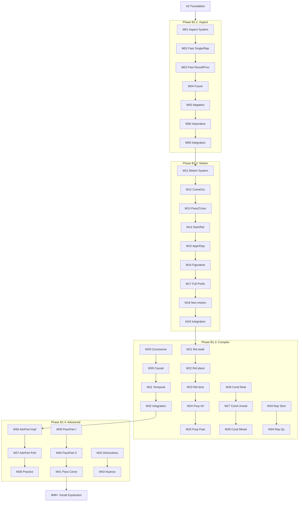

# B1 Curriculum Plan: Ukrainian for English Speakers

**Status:** ✅ COMPLETE (Aligned with Ukrainian State Standard 2024)
**Modules:** 01-80 (80 modules)
**Vocabulary Target:** ~1,500 words (level), ~3,300 cumulative

---

## Quality Standards & Pedagogical Strategy

**Reference:** `docs/l2-uk-en/MODULE-RICHNESS-GUIDELINES-v2.md`

### Bilingual Content Strategy (B1 Specific)

**Graduated Immersion:** B1 uses phase-based immersion that increases as learners progress:

| Phase | Modules | Immersion | Content Focus |
|-------|---------|-----------|---------------|
| **B1.1** | M01-10 | **45-50%** | Aspect mastery — heavy grammar theory in English |
| **B1.2** | M11-20 | **50-55%** | Motion verbs with prefixes — grammar theory in English |
| **B1.3-4** | M21-45 | **55-60%** | Complex sentences, participles — more Ukrainian in explanations |
| **B1.5-6** | M46-65 | **60-65%** | Vocabulary expansion — thematic content mostly in Ukrainian |
| **B1.7-8** | M66-80 | **65-70%** | Cultural content, skills — pre-B2 runway |

**Transition continuity:**
- A2.3 ends at 50-55% → B1.1 starts at 45-50% (overlap allows adjustment)
- B1.7-8 ends at 65-70% → B2-grammar starts at 65-70% (smooth handoff)

B1 modules use a **bilingual approach** for complex grammar concepts:
- **Ukrainian:** All examples, dialogues, narratives, cultural boxes, activity content
- **English:** Conceptual explanations ("why does aspect exist?"), decision frameworks, Language Link boxes

**Pattern:** Ukrainian concept → English explanation (using `> 🔗 **Language Link**` boxes)

This approach is pedagogically sound because:
1. **Cognitive load:** Aspect, motion verbs, participles don't exist in English. L1 explanations free cognitive resources for Ukrainian practice.
2. **CEFR B1 definition:** Learners "understand main points of clear standard input" — complex metalinguistic explanations in L2 exceed this threshold.
3. **Research evidence:** Explicit L1 grammar explanations + L2 examples outperforms immersion-only for complex rules.

### Overcoming the Intermediate Plateau
To help learners bridge the gap from "basic competence" to "independent fluency", this level shifts pedagogical focus:

1.  **Transition to TTT (Test-Teach-Test):** Move away from simple instruction (PPP).
    *   **Test:** Present learners with a rich narrative or complex text containing the target grammar/vocabulary *first*.
    *   **Teach:** Guide them to deduce the rules or meanings from context, then provide explicit theory.
    *   **Test:** Practice in a new, freer context.
2.  **Narrative-Driven Vocabulary:** Lists are forbidden. Vocabulary MUST be introduced within compelling story arcs (e.g., "A Startup's Journey" for business terms) to build retention and context.
3.  **Collocation Focus:** Prioritize teaching chunks ("take a risk", "make a decision") over isolated words.

> **Note on Activities:** The "Signature Activity Concepts" listed below are **mandatory pedagogical anchors**. The Module Architect must generate additional activities (standard drills, quizzes, etc.) to meet the **minimum target of 12+ activities per module** (B1 standard).

---

## Ukrainian State Standard 2024 Alignment

> **Source:** Українська мова як іноземна: рівні загального володіння та діагностика (2024)
> **Document:** `docs/l2-uk-en/UKRAINIAN-STATE-STANDARD-2024.txt`

The B1 level (Середній рівень першого ступеня) per the official Ukrainian State Standard 2024 requires:

### Grammar Requirements (Каталог В)

#### Verbal Aspect (Вид дієслова) - Full Mastery

| Context | Imperfective | Perfective | Example |
|---------|--------------|------------|---------|
| Past - process | ✅ | | Я читав книгу (цілий день) |
| Past - result | | ✅ | Я прочитав книгу (закінчив) |
| Past - repeated | ✅ | | Я часто читав цю книгу |
| Past - single | | ✅ | Я один раз прочитав |
| Future - process | ✅ | | Я буду читати завтра |
| Future - result | | ✅ | Я прочитаю до вечора |
| Negation - general | ✅ | | Я не читав цю книгу |
| Negation - specific | | ✅ | Я ще не прочитав |
| Imperative - invitation | ✅ | | Читай! Сідай! |
| Imperative - specific | | ✅ | Прочитай статтю! |

**Aspect selection rules:**
- Imperfective: process, duration, repetition, general statements
- Perfective: completed result, single action, bounded future
- Negation: imperfective for general denial, perfective for "not yet"
- Imperative: imperfective for invitations/polite, perfective for specific tasks

**Common irregular pairs:**
- брати/взяти, давати/дати, говорити/сказати
- класти/покласти, сідати/сісти, лягати/лягти
- знаходити/знайти, приходити/прийти

#### Motion Verbs (Дієслова руху) - Full System

**14 motion verb pairs:**

| Unidirectional | Multidirectional | Meaning |
|----------------|------------------|---------|
| іти | ходити | go (on foot) |
| їхати | їздити | go (by vehicle) |
| бігти | бігати | run |
| летіти | літати | fly |
| плисти | плавати | swim/sail |
| нести | носити | carry (on foot) |
| везти | возити | transport (by vehicle) |
| вести | водити | lead |
| гнати | ганяти | chase/drive |
| котити | качати | roll |
| лізти | лазити | climb |
| повзти | повзати | crawl |
| тягти | тягати | pull/drag |
| сунути | совати | slide/shove |

**Prefix system:**

| Prefix | Meaning | Example |
|--------|---------|---------|
| при- | arrival | прийти, приїхати |
| ви- | exit, out | вийти, виїхати |
| в-/у- | enter, in | увійти, в'їхати |
| за- | drop by, begin | зайти, заїхати |
| від- | departure | відійти, від'їхати |
| до- | reach | дійти, доїхати |
| пере- | across | перейти, переїхати |
| об- | around | обійти, об'їхати |
| про- | through, past | пройти, проїхати |
| роз- | dispersal | розійтися, роз'їхатися |
| з-/с- | down, together | зійти, з'їхатися |
| під- | approach | підійти, під'їхати |
| по- | begin, a while | піти, поїхати |

**Figurative uses:**
- Час іде/летить. (Time goes/flies.)
- Справи йдуть добре. (Things are going well.)
- Думки носяться в голові. (Thoughts are racing.)

#### Participles (Дієприкметники та дієприслівники)

**Adverbial participles (Дієприслівники):**

| Type | Formation | Example | Translation |
|------|-----------|---------|-------------|
| Imperfective | stem + -ючи/-ачи | читаючи, говорячи | while reading, while speaking |
| Perfective | past stem + -вши/-ши | прочитавши, сказавши | having read, having said |

**Usage:**
- Читаючи книгу, він заснув. (While reading the book, he fell asleep.)
- Прочитавши статтю, вона подзвонила. (Having read the article, she called.)

**Active participles (Активні дієприкметники):**

| Type | Formation | Example | Stylistic Note |
|------|-----------|---------|----------------|
| Present | stem + -учий/-ючий | читаючий, працюючий | **Avoid in spoken.** Use relative clause: той, хто читає. |
| Past | past stem + -лий | посивілий, зів'ялий | Accepted in all styles. |

**Passive participles (Пасивні дієприкметники):**

| Form | Formation | Example |
|------|-----------|---------|
| Full (-ний/-тий) | stem + -ний/-тий | написаний, прочитаний, відкритий |
| Short (-но/-то) | stem + -но/-то | написано, прочитано, відкрито |

**Passive constructions:**
- Книга написана автором. (The book was written by the author.)
- Книгу написано в 2020 році. (The book was written in 2020.)
- Лист буде надісланий завтра. (The letter will be sent tomorrow.)

**Relative Clause Preference:**
Ukrainian stylistics prefer relative clauses over active present participles:
- ✅ Студент, **який читає** книгу (The student who is reading) - Natural
- ⚠️ __Читаючий__ книгу студент (The reading student) - Artificial/Bookish

**(Note for B1: Teach active participles for recognition in formal texts, but demand relative clauses for production.)**

#### Complex Sentences (Складні речення)

**Full range of subordinate clauses:**

| Type (Ukrainian) | Conjunctions | Example |
|------------------|--------------|---------|
| З'ясувальні (content) | що, щоб, чи, як | Я знаю, що він прийде. |
| Означальні (relative) | який, що, де, куди | Книга, яку я читаю... |
| Часові (temporal) | коли, поки, після того як, перш ніж, як тільки | Коли він прийшов, ми почали. |
| Умовні (conditional) | якщо, якби, коли б | Якщо хочеш, допоможу. |
| Допустові (concessive) | хоча, незважаючи на те що, дарма що | Хоча холодно, ми підемо. |
| Причинові (causal) | тому що, бо, оскільки, через те що | Я вдома, бо хворію. |
| Мети (purpose) | щоб, для того щоб | Я прийшов, щоб допомогти. |
| Наслідкові (result) | так що, тому | Було пізно, тому ми пішли. |

**Reported speech:**
- Statements: Він сказав, що прийде.
- Questions: Вона запитала, чи я вдома. / Він запитав, де я живу.
- Commands: Вона попросила, щоб я допоміг.

#### Conditional Mood (Умовний спосіб)

**Real conditions (Реальна умова):**
- Якщо матиму час, допоможу. (If I have time, I'll help.)
- Якщо хочеш, підемо разом. (If you want, we'll go together.)

**Unreal conditions (Нереальна умова):**
- Якби я знав, я б сказав. (If I knew, I would say.)
- Якби він прийшов, ми б поговорили. (If he came, we would talk.)
- Якби я був там, я б допоміг. (If I had been there, I would have helped.)

#### Future Tense (Майбутній час) - All Forms

| Form | Formation | Example | Use |
|------|-----------|---------|-----|
| Compound | буду + infinitive | буду читати | Imperfective, process |
| Synthetic | -тиму/-меш | читатиму, читатимеш | Imperfective, formal/written |
| Simple | perfective stem | прочитаю | Perfective, result |

**Synthetic future conjugation:**
- читатиму, читатимеш, читатиме, читатимемо, читатимете, читатимуть

### Thematic Requirements (Каталог Б) - Extended

All A2 topics plus:
- Society & politics (соціальні інституції, державний устрій)
- Abstract concepts (ideas, opinions, problems, solutions)
- Media & communication (преса, радіо, телебачення, інтернет)
- Professional contexts (robota, career, business)
- Regional diversity of Ukraine
- Contemporary Ukrainian culture

### Communicative Competence

- Understand main points of clear standard input on familiar matters
- Deal with most situations likely to arise while traveling
- Produce simple connected text on familiar topics
- Describe experiences, events, dreams, hopes, and ambitions
- Give reasons and explanations for opinions and plans

### Module Scope Checklist

Before writing/reviewing any B1 module, verify:

| Check | Constraint |
|-------|------------|
| Aspect | Full context awareness, avoid binary rules |
| Motion | All 14 pairs and prefixes, including figurative |
| Participles | Adverbial and passive mastery; Active for recognition only |
| Complex sentences | All clause types per curriculum |
| Conditional | Both real (якщо) and unreal (якби) |
| Future | All three forms (compound, synthetic, simple) |
| Vocabulary | 15-35 new words per module type |
| Headers | Ukrainian from B1.5 onwards |

---

## Prerequisites from A2

Before starting B1, learners have completed:
- All 7 grammatical cases
- Verbal aspect basics (perfective/imperfective)
- Comparison (comparative and superlative)
- Conditional constructions (basic)
- Complex sentences (тому що, хоча, щоб, який)
- Word formation (prefixes, suffixes, root families)
- ~1,800 vocabulary words

---

## CEFR B1 Can-Do Alignment

### CEFR B1 Descriptor
> Can understand the main points of clear standard input on familiar matters regularly encountered in work, school, leisure, etc. Can deal with most situations likely to arise whilst travelling in an area where the language is spoken. Can produce simple connected text on topics of personal interest. Can describe experiences, events, dreams, hopes, and ambitions and briefly give reasons and explanations for opinions and plans.

### Learning Outcomes
By module 80, learners can:

**Understanding**
- [ ] Understand main points of radio/TV programs on current affairs
- [ ] Understand texts consisting mainly of high-frequency everyday language
- [ ] Follow clearly articulated speech on familiar topics
- [ ] Understand the main points of lectures on familiar subjects

**Speaking**
- [ ] Deal with situations while traveling in Ukraine
- [ ] Enter unprepared into conversations on familiar topics
- [ ] Describe experiences, events, and aspirations
- [ ] Give reasons for opinions and plans
- [ ] Narrate stories and relate plots of books/films

**Writing**
- [ ] Write simple connected text on familiar topics
- [ ] Write personal letters describing experiences and impressions
- [ ] Summarize information from different sources

---

## Phase B1.1: Aspect Mastery (Modules 01-10)

### Learning Goals
- Master aspect selection in past tense contexts
- Understand aspect in future tense
- Apply aspect in negation and imperatives
- Expand aspect pair vocabulary

### Grammar Progression

| Module | Grammar Point | Builds On | Enables |
|--------|--------------|-----------|---------|
| 01 | Aspect: Complete System Review | A2 aspect intro | Full aspect control |
| 02 | Aspect: Past Single vs Repeated | M01 | Narrative past |
| 03 | Aspect: Past Result vs Process | M02 | Completed actions |
| 04 | Aspect: Future Forms | M01-03 | Plans, predictions |
| 05 | Aspect: Negation Patterns | M01-04 | Correct negation |
| 06 | Aspect: Imperative Forms | M05 | Commands, requests |
| 07 | Aspect Pairs Expansion I | M01-06 | Verb vocabulary |
| 08 | Aspect Pairs Expansion II | M07 | More verbs |
| 09 | Aspect: Integration Practice | M01-08 | Consolidation |
| 10 | Checkpoint: Aspect Mastery | M01-09 | Review |

### Module Content Specifications B1.1

---

#### Module 01: Aspect - The Complete System
**Grammar:** Perfective vs Imperfective - Full Overview

**Key Concepts:**
- Imperfective = ongoing, repeated, habitual, process
- Perfective = single completed, result-focused, bounded
- Aspect choice depends on context and speaker intent

**Vocabulary (20 words):**
вид, доконаний, недоконаний, процес, результат, тривалість, повторюваність, завершеність, одноразовий, багаторазовий, звичка, дія, завдання, мета, початок, кінець, спроба, виконання, намір, рішення

**Signature Activity Concepts:**
1. Quiz: Identify aspect pairs
2. Match-up: Context → aspect choice
3. Gap-fill: Choose correct aspect

---

#### Module 02: Aspect in Past - Single vs Repeated
**Grammar:** Одного разу vs щодня - Past tense aspect selection

**Key Patterns:**
- Одного разу він написав листа. (Once he wrote a letter. - pf)
- Він щодня писав листи. (He wrote letters every day. - impf)
- Іноді вона готувала борщ. (Sometimes she made borscht. - impf)
- Того разу вона приготувала борщ. (That time she made borscht. - pf)

**Vocabulary (20 words):**
одного разу, того разу, якось, нарешті, раптом, вперше, востаннє, нещодавно, давно, колись, завжди, часто, рідко, іноді, постійно, регулярно, періодично, щодня, щотижня, щомісяця

**Signature Activity Concepts:**
1. Gap-fill: Time marker → aspect
2. Transform: Single event → habitual (and vice versa)
3. Quiz: Which aspect for which context?

---

#### Module 03: Aspect in Past - Result vs Process
**Grammar:** Completed action vs ongoing process

**Key Patterns:**
- Я прочитав книгу. (I read/finished the book. - pf, result)
- Я читав книгу весь вечір. (I was reading the book all evening. - impf, process)
- Вона написала статтю. (She wrote/finished the article. - pf)
- Вона писала статтю годину. (She was writing the article for an hour. - impf)

**Vocabulary (20 words):**
весь день, цілий тиждень, протягом, годину, хвилину, довго, недовго, весь час, поступово, швидко, повільно, нарешті, вже, ще, тільки що, щойно, досі, поки, під час, у цей час

**Signature Activity Concepts:**
1. Choose: Result or process aspect?
2. Gap-fill: Duration markers with imperfective
3. Transform: Add result marker → change to perfective

---

#### Module 04: Aspect in Future
**Grammar:** Буду + infinitive vs synthetic forms

**Future Forms:**
- Compound imperfective: буду читати (will be reading)
- Synthetic imperfective: читатиму/читатимеш/читатиме (will read - ongoing)
- Simple perfective: прочитаю (will read/finish)

**Key Patterns:**
- Я буду працювати завтра. (I will be working tomorrow. - impf)
- Я працюватиму завтра. (I will work tomorrow. - impf, synthetic)
- Я зроблю це завтра. (I will do it tomorrow. - pf)

**Vocabulary (20 words):**
завтра, післязавтра, найближчим часом, скоро, згодом, потім, пізніше, у майбутньому, наступного разу, колись, обов'язково, напевно, мабуть, можливо, ймовірно, сподіваюся, планую, збираюся, маю намір, вирішив

**Signature Activity Concepts:**
1. Transform: Compound → synthetic future
2. Quiz: Which future form for planned vs completed action?
3. Gap-fill: Future aspect selection

---

#### Module 05: Aspect in Negation
**Grammar:** Imperfective preference with не

**Key Patterns:**
- Не читай цю книгу! (Don't read this book! - general)
- Не прочитай випадково! (Don't accidentally read! - specific warning)
- Я ще не прочитав. (I haven't read yet. - pf: expected completion)
- Я не читав цієї книги. (I didn't read this book. - impf: never/general)

**Vocabulary (20 words):**
не, ніколи, ніде, ніяк, ніхто, ніщо, жодний, зовсім, взагалі, абсолютно, ще не, вже не, більше не, поки не, майже не, навряд чи, заборонено, неможливо, недоцільно, марно

**Signature Activity Concepts:**
1. Choose: Which aspect in negation?
2. Gap-fill: ще не + perfective
3. Transform: Affirmative → negative with correct aspect

---

#### Module 06: Aspect in Imperatives
**Grammar:** Читай! vs Прочитай! - Command aspect selection

**Key Patterns:**
- Читай книгу! (Read the book! - ongoing/polite)
- Прочитай статтю! (Read the article! - complete it)
- Заходьте! Сідайте! (Come in! Sit down! - invitations, impf)
- Прийди о п'ятій! (Come at five! - specific action, pf)

**Vocabulary (20 words):**
прошу, будь ласка, будьте ласкаві, будьте люб'язні, обов'язково, негайно, швидше, швидко, повільно, уважно, обережно, старанно, ретельно, точно, правильно, чітко, голосно, тихо, спокійно, терпляче

**Signature Activity Concepts:**
1. Choose: Which aspect for which command type?
2. Match-up: Request type → aspect
3. Role-play: Give polite vs direct commands

---

#### Module 07: Aspect Pairs — Essential 40
**Grammar:** 40 essential aspect pairs (merged from original M07-08)
**Type:** B1-grammar

**Rationale:** Merged to reduce vocabulary drilling fatigue. 40 most useful pairs selected; remaining pairs encountered organically in later modules.

**Aspect Pairs (40):**
| Imperfective | Perfective | Meaning |
|--------------|------------|---------|
| робити | зробити | do, make |
| писати | написати | write |
| читати | прочитати | read |
| говорити | сказати | say, tell |
| брати | взяти | take |
| давати | дати | give |
| ставити | поставити | put, place |
| відкривати | відкрити | open |
| закривати | закрити | close |
| починати | почати | begin |
| закінчувати | закінчити | finish |
| пояснювати | пояснити | explain |
| показувати | показати | show |
| питати | запитати | ask |
| відповідати | відповісти | answer |
| вибирати | вибрати | choose |
| збирати | зібрати | collect, gather |
| вирішувати | вирішити | decide |
| вивчати | вивчити | study, learn |
| готувати | приготувати | prepare, cook |
| купувати | купити | buy |
| продавати | продати | sell |
| змінювати | змінити | change |
| забувати | забути | forget |
| згадувати | згадати | remember, recall |
| перевіряти | перевірити | check, verify |
| виправляти | виправити | correct, fix |
| зустрічати | зустріти | meet |
| повертати | повернути | return, turn |
| отримувати | отримати | receive |
| надсилати | надіслати | send |
| допомагати | допомогти | help |
| шукати | знайти | look for / find |
| втрачати | втратити | lose |
| просити | попросити | ask, request |
| дозволяти | дозволити | allow |
| забороняти | заборонити | forbid |
| пропонувати | запропонувати | offer, suggest |
| вмикати | увімкнути | turn on |
| вимикати | вимкнути | turn off |

**Vocabulary (40 words):** Aspect pairs above (counted as pair entries)

**Signature Activity Concepts:**
1. Flash card drilling: Aspect pair recognition
2. Gap-fill: Context determines aspect
3. Match-up: Imperfective ↔ Perfective
4. Unjumble: Sentences using both aspects

---

#### Module 08: Робочий тиждень — Aspect in Action
**Grammar:** All aspect contexts applied to work/daily routine theme
**Type:** B1-grammar (thematic application)

**Rationale:** Replaces pure vocabulary drilling with thematic application. Learners apply all aspect patterns in realistic work scenarios, reducing grammar fatigue.

**Scenario:** Follow a Ukrainian professional through their work week, using all aspect patterns naturally.

**Key Applications:**
- Describing daily routine (imperfective)
- Reporting completed tasks (perfective)
- Making plans (future aspect)
- Giving instructions to colleagues (imperative aspect)
- Explaining what you haven't done yet (negation)

**Vocabulary (20 words):**
робочий день, завдання, зустріч, дедлайн, проєкт, команда, колега, начальник, звіт, презентація, перерва, обід, нарада, домовленість, відрядження, відпустка, понеділок, п'ятниця, вихідні, тиждень

**Narrative Structure:**
- **Понеділок:** Planning the week (future aspect: "цього тижня я зроблю...")
- **Вівторок-четвер:** Doing and completing tasks (past aspect: "вчора я працював/зробив...")
- **П'ятниця:** Reporting what's done/not done (negation: "ще не завершив, але вже перевірив...")
- **Weekend:** Reflecting on habits (repeated actions: "зазвичай я відпочиваю...")

**Signature Activity Concepts:**
1. Reading: "Тиждень Олени" — extended narrative (300+ words)
2. Role-play: Report to boss (що зробив/що ще не зробив)
3. Micro-writing: Describe your typical work week
4. Dialogue completion: Planning meeting with colleague
5. Error correction: Fix aspect mistakes in work emails

---

#### Module 09: Aspect Integration Practice
**Grammar:** All aspect contexts combined

**Practice Scenarios:**
- Narrating past events (single and repeated)
- Describing future plans
- Giving instructions and commands
- Using negation correctly
- Mixing aspects in complex narratives

**Vocabulary (15 words):**
спочатку, тоді, після того, наступного дня, перед тим, під час того, у той час, нарешті, врешті-решт, як тільки, поки, доки, тим часом, водночас, зрештою

**Signature Activity Concepts:**
1. Extended writing: "My last vacation" (past aspect)
2. Dialogue completion: Commands and requests
3. Quiz: Mixed aspect selection

---

#### Module 10: Checkpoint - Aspect Mastery
**Review of:** Modules 01-09
**Type:** B1-checkpoint

**CEFR Can-Do Targets (from this phase):**
- [ ] Can distinguish perfective/imperfective in past tense contexts
- [ ] Can select correct aspect for future actions (planned vs completed)
- [ ] Can use aspect correctly in negation (general vs "not yet")
- [ ] Can form appropriate imperatives (invitations vs specific commands)

**Assessment Areas:**
1. Aspect selection in past (single/repeated, result/process) - 5 items
2. Future tense aspect choice - 5 items
3. Negation with correct aspect - 5 items
4. Imperative aspect - 5 items
5. Aspect pair recognition - 5 items

**Self-Assessment Rubric:**

| Skill | Not Yet (1) | Developing (2) | Achieved (3) |
|-------|-------------|----------------|--------------|
| Past aspect | Often confuse result/process | Usually correct with time markers | Choose correctly without markers |
| Future aspect | Unsure which form to use | Correct with context clues | Confident in all contexts |
| Negation aspect | Default to perfective | Know rule but make errors | Apply rules consistently |
| Imperative aspect | Don't know difference | Understand but hesitate | Use naturally |

**Vocabulary (15 words):** High-frequency aspect markers requiring review

**Required Activities (minimum 10):**
1. **Diagnostic quiz** - 25 items covering all aspect contexts
2. **Error correction** - 10 common aspect mistakes from M01-09
3. **Cloze passage** - Extended text requiring aspect decisions
4. **Writing task** - 100+ words using both aspects meaningfully
5. **Self-reflection** - What I can do / What I need to review
6. **Aspect pair drill** - 20 pairs rapid recognition
7. **Context matching** - Match aspect to situation type
8. **Transform exercise** - Change aspect and explain meaning change
9. **Dialogue completion** - Natural aspect usage in conversation
10. **Mixed review** - Random aspect challenges from all modules

**Remediation Guidance:**
- Score <60%: Review M01-06 (core aspect rules), redo all signature activities
- Score 60-79%: Focus on M03 (result/process) and M05 (negation)
- Score 80%+: Ready for Phase B1.2 (Motion Verbs)

---

## Phase B1.2: Motion Verbs with Prefixes (Modules 11-20)

### Learning Goals
- Master all 14 motion verb pairs
- Apply the full prefix system
- Use figurative expressions with motion verbs
- Handle motion in complex sentences

### Grammar Progression

| Module | Grammar Point | Builds On | Enables |
|--------|--------------|-----------|---------|
| 11 | Motion Verbs: Full System | A2 motion basics | All pairs |
| 12 | Motion: Coming & Going | M11 | при-, ви-, в-/у- |
| 13 | Motion: Passing & Crossing | M12 | пере-, про-, об- |
| 14 | Motion: Starting & Returning | M13 | по-, за-, роз- |
| 15 | Motion: Approaching & Departing | M14 | під-, від-, до- |
| 16 | Motion: Figurative Uses | M11-15 | Idiomatic expressions |
| 17 | Motion: Full Prefix Integration | M11-16 | All prefixes |
| 18 | Motion Patterns in Other Verbs | M17 | Prefix transfer |
| 19 | Motion: Practice & Integration | M11-18 | Consolidation |
| 20 | Checkpoint: Motion Verbs | M11-19 | Review |

### Module Content Specifications B1.2

---

#### Module 11: Motion Verbs - The Full System
**Grammar:** All 14 motion verb pairs

**Motion Verb Pairs:**
| Unidirectional | Multidirectional | Meaning |
|----------------|------------------|---------|
| іти | ходити | go (on foot) |
| їхати | їздити | go (by vehicle) |
| бігти | бігати | run |
| летіти | літати | fly |
| плисти | плавати | swim, sail |
| нести | носити | carry (on foot) |
| везти | возити | carry (by vehicle) |
| вести | водити | lead |
| лізти | лазити | climb, crawl |
| повзти | повзати | crawl |
| котити | качати | roll (trans.) |
| котитися | качатися | roll (intrans.) |
| тягти | тягати | pull, drag |
| гнати | ганяти | chase, drive |

**Vocabulary (25 words):**
іти, ходити, їхати, їздити, бігти, бігати, летіти, літати, плисти, плавати, нести, носити, везти, возити, вести, водити, лізти, лазити, повзти, повзати, котити, качати, тягти, тягати, гнати

**Signature Activity Concepts:**
1. Match-up: Unidirectional ↔ multidirectional
2. Quiz: Which motion verb for which situation?
3. Gap-fill: Choose correct motion type

---

#### Module 12: Motion - Coming & Going
**Grammar:** Prefixes при-, ви-, в-/у-

**Prefix Meanings:**
- при- = arrival: прийти (arrive on foot), приїхати (arrive by vehicle)
- ви- = exit: вийти (exit), виїхати (leave by vehicle)
- в-/у- = entry: увійти (enter), в'їхати (drive in)

**Key Patterns:**
- Він прийшов о п'ятій. (He arrived at five.)
- Вона вийшла з кімнати. (She left the room.)
- Ми увійшли до будинку. (We entered the building.)

**Vocabulary (25 words):**
прийти, приїхати, прибути, прилетіти, приплисти, принести, привезти, привести, вийти, виїхати, вилетіти, винести, вивезти, вивести, увійти, в'їхати, влетіти, внести, ввезти, ввести, прибуття, вихід, вхід, двері, ворота

**Signature Activity Concepts:**
1. Gap-fill: при-/ви-/в- with motion verbs
2. Transform: "go" → "arrive" / "exit" / "enter"
3. Dialogue: Arrivals and departures

---

#### Module 13: Motion - Passing & Crossing
**Grammar:** Prefixes пере-, про-, об-

**Prefix Meanings:**
- пере- = across: перейти (cross on foot), переїхати (move, drive across)
- про- = through/past: пройти (pass by), проїхати (drive past)
- об- = around: обійти (go around), об'їхати (drive around)

**Key Patterns:**
- Вони перейшли через дорогу. (They crossed the road.)
- Я пройшов повз парк. (I passed by the park.)
- Ми об'їхали місто. (We drove around the city.)

**Vocabulary (25 words):**
перейти, переїхати, перелетіти, перенести, перевезти, перевести, пройти, проїхати, пролетіти, пронести, провести, обійти, об'їхати, облетіти, обнести, обвести, через, повз, навколо, довкола, міст, перехід, обхід, переїзд, шлях

**Signature Activity Concepts:**
1. Gap-fill: пере-/про-/об- selection
2. Map reading: Describe routes using motion prefixes
3. Quiz: Which prefix for which movement?

---

#### Module 14: Motion - Starting & Returning
**Grammar:** Prefixes по-, за-, роз-

**Prefix Meanings:**
- по- = start of movement: піти (leave, set off), поїхати (drive off)
- за- = drop by: зайти (drop by), заїхати (stop by in vehicle)
- роз- = disperse: розійтися (disperse), роз'їхатися (scatter in vehicles)

**Key Patterns:**
- Він пішов на роботу. (He left for work.)
- Зайди до мене завтра! (Drop by tomorrow!)
- Люди розійшлися після концерту. (People dispersed after the concert.)

**Vocabulary (25 words):**
піти, поїхати, полетіти, понести, повезти, повести, зайти, заїхати, залетіти, занести, завезти, завести, розійтися, роз'їхатися, розлетітися, рознести, розвезти, розвести, початок, від'їзд, заїзд, візит, зупинка, розпуск, розсіювання

**Signature Activity Concepts:**
1. Gap-fill: по-/за-/роз- with motion verbs
2. Scenario: Planning visits (зайти/заїхати)
3. Quiz: Departure vs arrival vs dispersal

---

#### Module 15: Motion - Approaching & Departing
**Grammar:** Prefixes під-, від-, до-

**Prefix Meanings:**
- під- = approach: підійти (approach on foot), під'їхати (drive up)
- від- = away from: відійти (walk away), від'їхати (drive away)
- до- = reach: дійти (reach on foot), доїхати (reach by vehicle)

**Key Patterns:**
- Підійди ближче! (Come closer!)
- Він відійшов від вікна. (He stepped away from the window.)
- Ми дійшли до центру за годину. (We reached the center in an hour.)

**Vocabulary (25 words):**
підійти, під'їхати, підлетіти, піднести, підвезти, підвести, відійти, від'їхати, відлетіти, віднести, відвезти, відвести, дійти, доїхати, долетіти, донести, довезти, довести, підхід, відхід, наближення, віддалення, досягнення, відстань, мета

**Signature Activity Concepts:**
1. Gap-fill: під-/від-/до- selection
2. Dialogue: Giving directions with approach/departure
3. Quiz: Motion relative to reference point

---

#### Module 16: Motion - Figurative Uses
**Grammar:** Idiomatic expressions with motion verbs

**Figurative Expressions:**
- виходить, що... (it turns out that...)
- дійти до висновку (reach a conclusion)
- зайти занадто далеко (go too far)
- пройти через щось (go through something - experience)
- відійти від теми (digress from the topic)
- підійти до питання (approach a question)
- обійтися без (do without)
- перейти до справи (get down to business)

**Vocabulary (25 words):**
виходить, входити в звичку, дійти висновку, зайти далеко, пройти випробування, відійти в минуле, підійти до справи, обійтися без, перейти межу, вийти з себе, прийти до ладу, зайти в глухий кут, пройти перевірку, вийти з моди, увійти в історію, підійти з розумом, дійти до суті, обійти увагою, перейти в наступ, вийти на контакт, прийти в себе, зайти за край, дійти рук, вийти з ситуації, підійти відповідально

**Signature Activity Concepts:**
1. Match-up: Expression → meaning
2. Gap-fill: Use figurative expressions in context
3. Quiz: Literal vs figurative motion

---

#### Module 17: Motion - Full Prefix Integration
**Grammar:** All prefixes with all motion verbs

**Prefix System Summary:**
| Prefix | Meaning | Example |
|--------|---------|---------|
| при- | arrival | прийти |
| ви- | exit | вийти |
| в-/у- | entry | увійти |
| за- | drop by, start | зайти |
| пере- | across | перейти |
| від- | away from | відійти |
| до- | up to | дійти |
| об- | around | обійти |
| про- | through, past | пройти |
| роз- | disperse | розійтися |
| з-/с- | down, together | зійти |
| під- | approach | підійти |
| над- | over (rare) | надійти |
| по- | start movement | піти |

**Vocabulary (20 words):**
зійти, з'їхати, злетіти, зійтися, з'їхатися, злетітися, надійти, надіслати, надходження, вступити, виступити, наступити, відступити, заступити, поступитися, переступити, обступити, підступити, доступитися, приступити

**Signature Activity Concepts:**
1. Matrix practice: Combine prefixes with motion verbs
2. Story writing: Use 10+ prefixed motion verbs
3. Quiz: Prefix meaning identification

---

#### Module 18: Motion Patterns in Other Verbs
**Grammar:** Prefix meanings transferred to non-motion verbs

**Pattern Transfer:**
- при- (arrival): прийти → приготувати (prepare - "bring to ready")
- ви- (out): вийти → виробляти (produce - "work out")
- пере- (across/re-): перейти → переробляти (redo, process)
- за- (start): зайти → заговорити (start speaking)
- від- (away): відійти → відмовитися (refuse - "move away from")

**Vocabulary (20 words):**
приготувати, прибрати, приєднатися, пристосуватися, привітати, виробляти, викладати, випускати, вимагати, виконувати, переробляти, перекладати, перетворювати, пересувати, переконувати, заговорити, засміятися, заплакати, замовкнути, затихнути

**Signature Activity Concepts:**
1. Match-up: Prefix meaning in motion vs non-motion verbs
2. Gap-fill: Use prefixed non-motion verbs
3. Word formation: Add prefix to change meaning

---

#### Module 19: Motion - Practice & Integration
**Grammar:** All motion verbs and prefixes in context

**Practice Scenarios:**
- Describing a journey
- Giving directions in a city
- Narrating movement in a story
- Using figurative expressions

**Vocabulary (15 words):**
маршрут, напрямок, траєкторія, шлях, стежка, дорога, траса, автострада, провулок, поворот, розвилка, перехрестя, пункт призначення, вихідний пункт, проміжна зупинка

**Signature Activity Concepts:**
1. Extended writing: "A journey I took"
2. Map-based: Give complex directions
3. Dialogue: Travel planning with motion verbs

---

#### Module 20: Checkpoint - Motion Verbs
**Review of:** Modules 11-19
**Type:** B1-checkpoint

**CEFR Can-Do Targets (from this phase):**
- [ ] Can use all 14 motion verb pairs correctly (uni/multi)
- [ ] Can apply prefixes to motion verbs to express direction/manner
- [ ] Can use figurative expressions with motion verbs naturally
- [ ] Can describe complex journeys and movements

**Assessment Areas:**
1. Motion verb pair identification - 5 items
2. Prefix meaning recognition - 5 items
3. Figurative expression usage - 5 items
4. Motion in complex sentences - 5 items
5. Prefix combination with different verbs - 5 items

**Self-Assessment Rubric:**

| Skill | Not Yet (1) | Developing (2) | Achieved (3) |
|-------|-------------|----------------|--------------|
| Verb pairs | Confuse uni/multi | Know common pairs | All 14 pairs fluent |
| Prefixes | Know 2-3 prefixes | Know most, some errors | Use all confidently |
| Figurative | Don't recognize | Understand but don't use | Use in own speech |
| Complex motion | Struggle with long descriptions | Can describe with support | Describe fluently |

**Vocabulary (15 words):** High-frequency motion verbs and prefixes requiring review

**Required Activities (minimum 10):**
1. **Diagnostic quiz** - 25 items covering all motion concepts
2. **Prefix sorting** - Group verbs by prefix meaning
3. **Direction description** - Describe routes using motion verbs
4. **Error correction** - 10 common motion verb mistakes
5. **Cloze passage** - Travel narrative with motion verb gaps
6. **Figurative matching** - Match idioms to meanings
7. **Writing task** - 100+ words describing a journey
8. **Self-reflection** - What I can do / What I need to review
9. **Verb transformation** - Add/change prefixes to change meaning
10. **Mixed review** - Random motion challenges from all modules

**Remediation Guidance:**
- Score <60%: Review M11-12 (basic motion system), focus on verb pairs
- Score 60-79%: Focus on M14-15 (prefix meanings) and M16 (figurative)
- Score 80%+: Ready for Phase B1.3 (Complex Sentences)

---

## Phase B1.3: Complex Sentences Deep Dive (Modules 21-35)

### Learning Goals
- Master relative clauses (який, де, коли, куди)
- Use purpose clauses correctly (щоб + infinitive, щоб + past)
- Handle all conditional types
- Navigate concessive and causal constructions

### Grammar Progression

| Module | Grammar Point | Builds On | Enables |
|--------|--------------|-----------|---------|
| 21 | Relative Clauses: який Review | A2 який basics | All case forms |
| 22 | Relative Clauses: де, куди, звідки | M21 | Place relatives |
| 23 | Relative Clauses: коли, що | M22 | Time/fact relatives |
| 24 | Purpose: щоб + Infinitive | M21-23 | Same-subject purpose |
| 25 | Purpose: щоб + Past Form | M24 | Different-subject purpose |
| 26 | Conditionals: Real (якщо) Review | A2 conditionals | Real conditions |
| 27 | Conditionals: Unreal (якби) Review | M26 | Unreal conditions |
| 28 | Conditionals: Mixed & Complex | M26-27 | Complex conditions |
| 29 | Concessive Clauses | M21-28 | Contrast expressions |
| 30 | Causal & Result Clauses | M29 | Cause/effect |
| 31 | Temporal Clauses Deep Dive | M30 | Time relationships |
| 32 | Complex Sentence Integration | M21-31 | Multiple clause types |
| 33 | Reported Statements | M32 | Indirect speech |
| 34 | Reported Questions & Commands | M33 | Complete reported speech |
| 35 | Checkpoint: Complex Sentences | M21-34 | Review |

### Module Content Specifications B1.3

---

#### Module 21: Relative Clauses - який Review
**Grammar:** який/яка/яке/які in all cases

**Agreement Pattern:**
- який agrees with antecedent in gender/number
- який declines for its role in the relative clause

**Key Patterns:**
- Людина, яка тут працює... (The person who works here...)
- Книга, яку я читаю... (The book that I'm reading...)
- Студент, якому я допомагав... (The student whom I helped...)

**Vocabulary (20 words):**
який, яка, яке, які, якого, якої, яких, якому, якій, яким, якими, якою, про якого, з яким, до якої, через яких, для якого, від якої, біля якого, перед яким

**Signature Activity Concepts:**
1. Gap-fill: Choose correct який form
2. Combine: Two sentences → relative clause
3. Quiz: який case selection

---

#### Module 22: Relative Clauses - де, куди, звідки
**Grammar:** Place relatives with де, куди, звідки

**Key Patterns:**
- Місто, де я народився... (The city where I was born...)
- Місце, куди ми їдемо... (The place where we're going...)
- Країна, звідки він приїхав... (The country he came from...)

**Vocabulary (20 words):**
де, куди, звідки, звідси, туди, сюди, там, тут, всюди, ніде, скрізь, деінде, кудись, нікуди, звідкись, десь, будь-де, де-небудь, куди-небудь, звідки-небудь

**Signature Activity Concepts:**
1. Choose: де vs куди vs звідки
2. Gap-fill: Complete place relative clauses
3. Transform: Where → relative clause

---

#### Module 23: Relative Clauses - коли, що
**Grammar:** Time relatives (коли) and fact relatives (що as relative pronoun)

**Key Patterns:**
- Час, коли ми зустрілися... (The time when we met...)
- День, коли все змінилося... (The day when everything changed...)
- Те, що він сказав... (What he said... / That which he said...)
- Все, що я знаю... (Everything that I know...)

**Vocabulary (20 words):**
коли, тоді коли, у той час коли, щоразу коли, кожного разу коли, те що, все що, щось що, нічого що, багато чого що, мало що, те що треба, все що потрібно, щось нове що, факт що, правда що, думка що, ідея що, питання що, проблема що

**Signature Activity Concepts:**
1. Gap-fill: коли vs що (relative)
2. Combine: Time/fact sentences
3. Quiz: Relative pronoun selection

---

#### Module 24: Purpose - щоб + Infinitive
**Grammar:** Same-subject purpose clauses

**Key Pattern:**
When the subject of both clauses is the same, use щоб + infinitive:
- Я прийшов, щоб допомогти. (I came to help.)
- Вона вчиться, щоб стати лікарем. (She studies to become a doctor.)

**Vocabulary (20 words):**
щоб, для того щоб, задля того щоб, з метою, з ціллю, заради, на те щоб, мета, ціль, намір, призначення, задум, план, бажання, прагнення, устремління, завдання, причина, підстава, мотивація

**Signature Activity Concepts:**
1. Combine: Main clause + purpose (same subject)
2. Gap-fill: щоб + infinitive
3. Transform: "I want to X" → "I came to X"

---

#### Module 25: Purpose - щоб + Past Form
**Grammar:** Different-subject purpose clauses

**Key Pattern:**
When subjects differ, use щоб + past tense form (NOT infinitive):
- Я хочу, щоб ти прийшов. (I want you to come.)
- Вона просила, щоб я допоміг. (She asked me to help.)
- Він зачекав, щоб усі сіли. (He waited for everyone to sit down.)

**Vocabulary (20 words):**
хотіти щоб, просити щоб, наказати щоб, вимагати щоб, дозволити щоб, заборонити щоб, порадити щоб, запропонувати щоб, домогтися щоб, добитися щоб, переконати щоб, наполягати щоб, рекомендувати щоб, попросити щоб, побажати щоб, очікувати щоб, сподіватися щоб, мріяти щоб, планувати щоб, намагатися щоб

**Signature Activity Concepts:**
1. Gap-fill: щоб + past form with different subjects
2. Transform: "I want. He comes." → complex sentence
3. Quiz: Same subject vs different subject

---

#### Module 26: Conditionals - Real (якщо) Review
**Grammar:** Real conditional constructions

**Key Patterns:**
- Якщо матиму час, поїду. (If I have time, I'll go.)
- Якщо він прийде, скажи мені. (If he comes, tell me.)
- Якщо дощ, візьми парасольку. (If it rains, take an umbrella.)

**Vocabulary (20 words):**
якщо, коли, у випадку якщо, за умови що, при умові що, у разі якщо, за умов, тоді, в такому разі, отже, тому, через це, значить, виходить, можливо, ймовірно, певно, напевно, можливість, умова

**Signature Activity Concepts:**
1. Gap-fill: Complete real conditionals
2. Match-up: Condition → result
3. Transform: Separate sentences → conditional

---

#### Module 27: Conditionals - Unreal (якби) Review
**Grammar:** Unreal conditional constructions

**Key Patterns:**
- Якби я мав час, поїхав би. (If I had time, I would go.)
- Якби вона прийшла, ми б поговорили. (If she came, we would talk.)
- Якби я був багатий... (If I were rich...)

**Vocabulary (20 words):**
якби, якби не, було б, був би, була б, було б, були б, на жаль, шкода що, на щастя, мрія, бажання, уява, фантазія, припущення, гіпотеза, теоретично, ідеально, в ідеалі, в принципі

**Signature Activity Concepts:**
1. Gap-fill: Complete unreal conditionals
2. Transform: Real → unreal conditional
3. Writing: "If I could..."

---

#### Module 28: Conditionals - Mixed & Complex
**Grammar:** Complex conditional constructions

**Mixed Types:**
- Past unreal with present result
- Present unreal with past cause
- Chained conditionals

**Key Patterns:**
- Якби я вивчив тоді, зараз би знав. (If I had studied then, I would know now.)
- Якщо він не прийде, і якщо погода буде погана... (If he doesn't come, and if the weather is bad...)

**Vocabulary (20 words):**
у такому разі, інакше, в іншому випадку, проте, однак, але, хоча, незважаючи на, попри, при цьому, до того ж, крім того, більше того, навіть якщо, тим більше, тим менше, все одно, в будь-якому разі, так чи інакше, як би там не було

**Signature Activity Concepts:**
1. Gap-fill: Mixed conditional types
2. Combine: Multiple conditions
3. Quiz: Conditional type identification

---

#### Module 29: Concessive Clauses
**Grammar:** Хоча, незважаючи на те що

**Key Patterns:**
- Хоча він стомився, він продовжував. (Although he was tired, he continued.)
- Незважаючи на те що було пізно, вони працювали. (Despite it being late, they worked.)
- Попри те що холодно, я вийшов. (Despite the cold, I went out.)

**Vocabulary (20 words):**
хоча, хоч, хоча б, дарма що, попри, попри те що, незважаючи на, незважаючи на те що, всупереч, всупереч тому що, проте, однак, але все ж, тим не менш, все ж таки, все одно, навіть попри, навіть хоча, при всьому тому, при цьому

**Signature Activity Concepts:**
1. Combine: Contrasting sentences
2. Gap-fill: Choose concessive connector
3. Transform: Two sentences → concessive clause

---

#### Module 30: Causal & Result Clauses
**Grammar:** тому що, через те що, завдяки, отже

**Key Patterns:**
- Він не прийшов, тому що захворів. (He didn't come because he got sick.)
- Через те що було пізно, ми поїхали. (Because it was late, we left.)
- Завдяки тому що він допоміг... (Thanks to his help...)
- Він захворів, тому не прийшов. (He got sick, so he didn't come.)

**Vocabulary (20 words):**
тому що, через те що, бо, оскільки, позаяк, адже, завдяки тому що, внаслідок того що, з огляду на те що, у зв'язку з тим що, тому, через це, отже, таким чином, відтак, внаслідок, як наслідок, у результаті, ось чому, саме тому

**Signature Activity Concepts:**
1. Match-up: Cause → result
2. Gap-fill: Causal connectors
3. Transform: Because → therefore

---

#### Module 31: Temporal Clauses Deep Dive
**Grammar:** коли, після того як, поки, перш ніж, як тільки

**Key Patterns:**
- Коли він прийшов, ми говорили. (When he came, we were talking.)
- Після того як він пішов... (After he left...)
- Поки вона готувала, він читав. (While she cooked, he read.)
- Перш ніж піти, він попрощався. (Before leaving, he said goodbye.)
- Як тільки почувся дзвінок... (As soon as the bell rang...)

**Vocabulary (20 words):**
коли, після того як, перед тим як, до того як, поки, поки не, доки, доки не, як тільки, щойно, ледве, мало не, у той час як, в міру того як, у той момент коли, відтоді як, з тих пір як, до тих пір поки, весь час поки, кожного разу коли

**Signature Activity Concepts:**
1. Gap-fill: Temporal connectors
2. Sequence: Order events with connectors
3. Combine: Create complex temporal sentences

---

#### Module 32: Complex Sentence Integration & One-Member Sentences
**Grammar:** Multiple clause types together + односкладні речення

**Practice combining:**
- Relative + purpose
- Conditional + causal
- Temporal + concessive
- Multiple relative clauses

**One-Member Sentences (Односкладні речення):**

| Type | Ukrainian | Example | Usage |
|------|-----------|---------|-------|
| Означено-особові | definite-personal | Читаю книгу. Йдемо! | Subject clear from verb ending |
| Неозначено-особові | indefinite-personal | Кажуть, що... Тут не палять. | Impersonal "they", general rules |
| Безособові | impersonal | Холодно. Можна. Треба. | States, permissions, necessities |

**Impersonal constructions:**
- Мені холодно/тепло/гаряче. (I'm cold/warm/hot.)
- Йому сумно/весело/нудно. (He's sad/happy/bored.)
- Тут можна/не можна курити. (Smoking is/isn't allowed here.)
- Треба/потрібно/необхідно зробити. (It's necessary to do.)

**Vocabulary (20 words):**
при цьому, водночас, одночасно, паралельно, разом з тим, до всього, на додаток, тим паче, особливо, зокрема, можна, не можна, треба, потрібно, необхідно, варто, слід, годиться, доречно, доцільно

**Signature Activity Concepts:**
1. Combine: Multi-clause sentences
2. Analyze: Break down complex sentences
3. Identify: One-member sentence types
4. Transform: Two-member → one-member (where appropriate)
5. Writing: Extended complex sentences with impersonal constructions

---

#### Module 33: Reported Statements
**Grammar:** Він сказав, що...

**Key Patterns:**
- Він сказав, що прийде. (He said he would come.)
- Вона стверджувала, що знає. (She claimed that she knew.)
- Повідомили, що лекція скасована. (They announced that the lecture was cancelled.)

**Vocabulary (20 words):**
сказати, говорити, стверджувати, заявляти, повідомляти, пояснювати, доповідати, розповідати, зазначати, підкреслювати, наголошувати, відзначати, вважати, думати, гадати, припускати, вірити, сподіватися, обіцяти, погрожувати

**Signature Activity Concepts:**
1. Transform: Direct → indirect speech
2. Gap-fill: Reporting verbs
3. Practice: Convert statements

---

#### Module 34: Reported Questions & Commands
**Grammar:** Він запитав, чи/що... Він попросив, щоб...

**Key Patterns:**
- Він запитав, чи я прийду. (He asked if I would come.)
- Вона запитала, коли ми поїдемо. (She asked when we would leave.)
- Він попросив, щоб я зачекав. (He asked me to wait.)
- Вона наказала, щоб ми замовкли. (She ordered us to be quiet.)

**Vocabulary (20 words):**
запитати, питати, цікавитися, дізнаватися, уточнювати, перепитувати, попросити, просити, вимагати, наказувати, забороняти, дозволяти, радити, рекомендувати, пропонувати, переконувати, умовляти, благати, наполягати, закликати

**Signature Activity Concepts:**
1. Transform: Direct questions → reported
2. Transform: Commands → reported
3. Mixed practice: All reported speech types

---

#### Module 35: Checkpoint - Complex Sentences
**Review of:** Modules 21-34
**Type:** B1-checkpoint

**CEFR Can-Do Targets (from this phase):**
- [ ] Can construct relative clauses with який, де, коли, що appropriately
- [ ] Can express purpose using щоб + infinitive and щоб + past forms
- [ ] Can form real and unreal conditionals correctly
- [ ] Can use concessive, causal, and temporal clauses naturally
- [ ] Can convert direct to indirect speech

**Assessment Areas:**
1. Relative clauses (який, де, коли, що) - 5 items
2. Purpose clauses (щоб constructions) - 4 items
3. Conditional types (real/unreal) - 4 items
4. Concessive and causal clauses - 4 items
5. Temporal clauses - 4 items
6. Reported speech - 4 items

**Self-Assessment Rubric:**

| Skill | Not Yet (1) | Developing (2) | Achieved (3) |
|-------|-------------|----------------|--------------|
| Relative clauses | Only use який | Use 2-3 connectors | All connectors fluent |
| Purpose clauses | Confused by щоб forms | Usually correct | Apply rules consistently |
| Conditionals | Mix real/unreal | Know difference, some errors | Use both naturally |
| Other clauses | Simple sentences only | Attempt with errors | Complex sentences fluent |
| Reported speech | Can't convert | Convert with mistakes | Convert accurately |

**Vocabulary (15 words):** Key conjunctions and connectors requiring review

**Required Activities (minimum 10):**
1. **Diagnostic quiz** - 25 items covering all clause types
2. **Clause identification** - Label clause types in authentic text
3. **Sentence combining** - Join simple sentences with appropriate connectors
4. **Error correction** - 10 common complex sentence mistakes
5. **Reported speech conversion** - Direct → indirect
6. **Conditional matching** - Match situations to conditional types
7. **Writing task** - 150+ words using at least 4 clause types
8. **Self-reflection** - What I can do / What I need to review
9. **Gap-fill passage** - Connectors and conjunctions
10. **Mixed review** - Random complex sentence challenges

**Remediation Guidance:**
- Score <60%: Review M21-23 (relative clauses) and M25-27 (conditionals)
- Score 60-79%: Focus on M30-31 (causal/temporal) and M33-34 (reported speech)
- Score 80%+: Ready for Phase B1.4 (Advanced Grammar)

---

## Phase B1.4: Advanced Grammar (Modules 36-45)

### Learning Goals
- Form and use passive participles
- Apply adverbial participles in speech
- Master diminutives and their nuances
- Handle numerals in complex contexts

### Grammar Progression

| Module | Grammar Point | Builds On | Enables |
|--------|--------------|-----------|---------|
| 36 | Adverbial Participles: Imperfective | M01-10 aspect | Simultaneous action |
| 37 | Adverbial Participles: Perfective | M36 | Prior completed action |
| 38 | Active Participles & Phrases | M36-37 | Formal/Academic recognition |
| 39 | Past Passive Participles I | M36-38 | -ний/-тий forms |
| 40 | Past Passive Participles II | M39 | -но/-то forms |
| 41 | Passive Constructions | M39-40 | Complete passive system |
| 42 | Diminutives: Master Class | A2 word formation | Emotional expression |
| 43 | Numerals: Collectives & Fractions | A2 numbers | Advanced numerals |
| 44 | Integrated Grammar Lab | M36-43 | Synthesis & Practice |
| 45 | Checkpoint: Advanced Grammar | M36-44 | Review |

### Module Content Specifications B1.4

---

#### Module 36: Adverbial Participles - Imperfective
**Grammar:** -ючи/-ачи forms (simultaneous action)

**Formation:**
- Present stem + -ючи (after vowel) or -ачи (after consonant)
- читати → читаючи (while reading)
- бігти → біжачи (while running)

**Key Patterns:**
- Читаючи книгу, він пив каву. (While reading a book, he drank coffee.)
- Йдучи вулицею, я зустрів друга. (Walking down the street, I met a friend.)

**Vocabulary (20 words):**
читаючи, пишучи, говорячи, слухаючи, дивлячись, думаючи, працюючи, йдучи, біжачи, стоячи, сидячи, лежачи, їдучи, летячи, несучи, ведучи, повертаючись, одягаючись, вмиваючись, готуючись

**Signature Activity Concepts:**
1. Form: Infinitive → imperfective participle
2. Combine: Two actions into one sentence
3. Gap-fill: Choose correct participle

---

#### Module 37: Adverbial Participles - Perfective
**Grammar:** -вши/-ши forms (prior completed action)

**Formation:**
- Past stem + -вши (after vowel) or -ши (after consonant)
- прочитати → прочитавши (having read)
- принести → принісши (having brought)

**Key Patterns:**
- Прочитавши книгу, він заснув. (Having read the book, he fell asleep.)
- Прийшовши додому, вона зателефонувала. (Having come home, she called.)

**Vocabulary (20 words):**
прочитавши, написавши, сказавши, зробивши, взявши, давши, відкривши, закривши, почавши, закінчивши, прийшовши, пішовши, приїхавши, поїхавши, побачивши, почувши, дізнавшись, повернувшись, одягнувшись, приготувавши

**Signature Activity Concepts:**
1. Form: Infinitive → perfective participle
2. Transform: "After X, Y" → participle construction
3. Gap-fill: Imperfective vs perfective participle

---

#### Module 38: Active Participles & Phrases
**Grammar:** Active Participles (читаючий, посивілий)
**Focus:** Recognition & Stylistics (Passive Competence)

**Key Concepts:**
- **Active Present:** читаючий, існуючий, працюючий (stem + -учий/-ачий) -> **Formal/Technical ONLY**.
- **Active Past:** посивілий, зів'ялий, загорілий (stem + -лий) -> **General use**.
- **Stylistic Rule:** Avoid active present participles in speech. Use "той, хто..." instead.

**Key Patterns:**
- Студент, який читає... (Preferred natural)
- Читаючий студент... (Artificial/Bureaucratic)
- Посивілий чоловік... (Greying man - Natural)

**Vocabulary (20 words):**
існуючий, діючий, працюючий, слідуючий (avoid!), наступний (correct!), посивілий, зів'ялий, загорілий, змоклий, замерзлий, пожовклий, опалий, прибулий, відсталий, дорослий, бувший (avoid!), колишній (correct!), оточуючий (avoid!), навколишній (correct!), бажаючий

**Signature Activity Concepts:**
1. Stylistic Transform: "Bureaucratic" text → Natural Ukrainian (Participle → Clause)
2. Recognition: Identify participles in text
3. Choose: Correct word (оточуючий vs навколишній)

---

#### Module 39: Past Passive Participles I
**Grammar:** Full form (-ний/-тий)

**Formation:**
- Perfective stem + -ний (most verbs) or -тий (some verbs)
- написати → написаний (written)
- зробити → зроблений (done, made)
- прочитати → прочитаний (read)
- взяти → взятий (taken)

**Agreement:**
- Agrees in gender/number with noun
- написана книга, зроблене завдання, прочитані листи

**Vocabulary (20 words):**
написаний, зроблений, прочитаний, сказаний, відкритий, закритий, взятий, даний, куплений, проданий, отриманий, посланий, виконаний, закінчений, побудований, знищений, створений, відомий, улюблений, забутий

**Signature Activity Concepts:**
1. Form: Verb → passive participle
2. Gap-fill: Correct participle agreement
3. Transform: Active → passive with participle

---

#### Module 40: Past Passive Participles II
**Grammar:** Short form (-но/-то)

**Formation:**
- Participle stem + -но or -то
- написаний → написано (it was written)
- зроблено (it was done)

**Impersonal Usage:**
- Книгу написано. (The book was written.)
- Мені було сказано, що... (I was told that...)
- Тут заборонено курити. (Smoking is forbidden here.)

**Vocabulary (20 words):**
написано, зроблено, сказано, вирішено, доведено, погоджено, встановлено, визначено, забезпечено, організовано, виконано, завершено, заплановано, передбачено, дозволено, заборонено, рекомендовано, необхідно, потрібно, важливо

**Signature Activity Concepts:**
1. Form: Full form → short form
2. Transform: "Someone did X" → "X was done"
3. Practice: Impersonal passive sentences

---

#### Module 41: Passive Constructions
**Grammar:** Complete passive system

**Passive Types:**
1. Full participle: Книга написана письменником.
2. Short form: Книгу написано.
3. Reflexive passive: Книга пишеться швидко.

**Key Patterns:**
- Ця робота була виконана вчора. (This work was completed yesterday.)
- Рішення прийнято. (A decision has been made.)
- Будинок будується. (The building is being built.)

**Vocabulary (20 words):**
автор, виконавець, творець, засновник, ініціатор, організатор, відповідальний, причетний, залучений, задіяний, уражений, вражений, зворушений, здивований, розчарований, задоволений, стурбований, переконаний, змушений, зобов'язаний

**Signature Activity Concepts:**
1. Transform: Active → passive (all types)
2. Choose: Which passive construction?
3. Gap-fill: Mixed passive forms

---

#### Module 42: Diminutives: Master Class
**Grammar:** Forms, Usage, and Nuance (Merged)

**Forms:** -ик, -ок, -очок, -еньк-, -оньк-, -ечк-
**Usage Contexts:** Affection, Size, Politeness, Sarcasm, Child-direct speech.

**Key Patterns:**
- Хлопчик, котик, столик (Simple diminutives)
- Матінка, серденько, сонечко (Deep affection)
- Хлібчика, будь ласка (Politeness/Softening)
- Проблемка! (Dismissive/Ironic)

**Vocabulary (30 words):**
хлопчик, дівчинка, котик, песик, столик, стілець, будиночок, матінка, татусь, бабуся, дідусь, донечка, синочок, братик, сестричка, серденько, сонечко, зірочка, квіточка, водичка, хлібчик, кавка, чайок, трошки, трішки, тихесенько, гарнесенький, малесенький, рідненький, близенько

**Signature Activity Concepts:**
1. Form: Create diminutives from base nouns/adjectives
2. Context Analysis: Why diminutive here? (Rude? Polite? Cute?)
3. Register Shift: Rewrite formal request to "grandmother style"
4. Match-up: Diminutive → Base word

---

#### Module 43: Numerals: Collectives & Fractions
**Grammar:** Collective numerals and fractions (Shifted from M44)

**Collective Numerals:**
- двоє, троє, четверо... (two, three, four...)
- Use with: people (groups), pluralia tantum (ножиці), young animals, paired objects.

**Fractions:**
- половина (1/2), третина (1/3), чверть (1/4), півтора (1.5)

**Vocabulary (25 words):** (Same as original M44)
двоє, троє, четверо, п'ятеро, шестеро, семеро, восьмеро, дев'ятеро, десятеро, обидва, обидві, обоє, половина, третина, чверть, одна п'ята, дві третіх, три четвертих, відсоток, процент, частка, частина, долька, дріб, пропорція

**Signature Activity Concepts:**
1. Choose: Cardinal vs collective numeral
2. Math problems: Fractions and percentages
3. Recipe: Half a cup, quarter kilo...

---

#### Module 44: Integrated Grammar Lab
**Grammar:** Synthesis of B1.4 concepts
**Focus:** Participles + Passive + Numbers + Diminutives together.

**Rationale:** Before the checkpoint, force learners to mix these advanced concepts in complex, realistic scenarios.

**Scenarios:**
- A formal report (Passive, Participles, Numbers)
- A family conversation (Diminutives, Active Participles treated as errors/corrected)

**Vocabulary (15 mixed words):**
звіт, статистика, дані, огляд, аналіз, зауваження, доповнення, уточнення, коригування, підсумок, загалом, в цілому, зокрема, власне кажучи, чесно кажучи

**Signature Activity Concepts:**
1. **Style Editor:** Correct a text mixing "bureaucratese" participles with "baby talk" diminutives into neutral standard Ukrainian.
2. **Report Writing:** Describe a graph using passive voice and fractions ("Третина роботи зроблена").
3. **Complex Narrative:** Story using adverbial participles types.

---

#### Module 45: Checkpoint - Advanced Grammar
**Review of:** Modules 36-44
**Type:** B1-checkpoint

**CEFR Can-Do Targets (from this phase):**
- [ ] Can form and use adverbial participles (reading → while reading)
- [ ] Can construct passive sentences with participles and -но/-то forms
- [ ] Can use diminutives appropriately for affection/size/dismissiveness
- [ ] Can handle collective numerals and fractions in context

**Assessment Areas:**
1. Adverbial participles (imperfective and perfective) - 5 items
2. **Active participles (Stylistic recognition)** - 3 items
3. Passive participles (full and short forms) - 5 items
4. Passive constructions - 4 items
5. Diminutives (Match nuance) - 4 items
6. Collective numerals and fractions - 4 items

**Self-Assessment Rubric:**

| Skill | Not Yet (1) | Developing (2) | Achieved (3) |
|-------|-------------|----------------|--------------|
| Adverbial participles | Can't form | Form but with errors | Use naturally |
| Passive participles | Confuse forms | Know -ний vs -но | Both forms fluent |
| Active participles | Treat as errors | Recognize in text | Know stylistic limit |
| Diminutives | Don't use | Recognize common ones | Form and use actively |
| Numerals | Only basic | Know collectives | Use all forms |

**Vocabulary (15 words):** Key advanced grammar vocabulary requiring review

**Required Activities (minimum 10):**
1. **Diagnostic quiz** - 25 items covering all advanced grammar
2. **Participle formation** - Transform verbs to participles
3. **Active to passive** - Convert sentences with correct participle forms
4. **Diminutive matching** - Base word → diminutive + nuance
5. **Error correction** - 10 advanced grammar mistakes
6. **Numeral usage** - Fill gaps with correct numeral forms
7. **Writing task** - 100+ words using participles and diminutives
8. **Self-reflection** - What I can do / What I need to review
9. **Gap-fill passage** - Mixed advanced grammar
10. **Mixed review** - Random advanced grammar challenges

**Remediation Guidance:**
- Score <60%: Review M36-38 (adverbial participles) and M39-40 (passive participles)
- Score 60-79%: Focus on M41 (passive constructions) and M42-43 (diminutives)
- Score 80%+: Ready for Phase B1.5 (Vocabulary Expansion)

---

## Phase B1.5: Vocabulary Expansion I (Modules 46-55)

### Learning Goals
- Build abstract concept vocabulary
- Master opinion and discussion expressions
- Learn discourse markers and connectors
- Develop professional vocabulary

**PEDAGOGICAL REQUIREMENT:** All Vocabulary (V) modules in this phase must use **Narrative-Driven Vocabulary**. Do not present isolated lists. Embed words in a cohesive story arc or thematic dialogue.

### Grammar Progression

| Module | Grammar Point | Builds On | Enables |
|--------|--------------|-----------|---------|
| 46 | Abstract Concepts I: Ideas | All B1 grammar | Intellectual discussion |
| 47 | Abstract Concepts II: Processes | M46 | Process description |
| 48 | Expressing Opinions | M46-47 | Opinion statements |
| 49 | Agreement & Disagreement | M48 | Discussion skills |
| 50 | Discourse Markers I | M48-49 | Text cohesion |
| 51 | Discourse Markers II | M50 | Advanced connectors |
| 52 | Describing Changes | M50-51 | Process narration |
| 53 | Media & News | M46-52 | Current affairs |
| 54 | Society & Politics | M53 | Civic vocabulary |
| 55 | Checkpoint: Vocabulary I | M46-54 | Review |

### Module Content Specifications B1.5

---

#### Module 46: Abstract Concepts I - Ideas
**Focus:** Ideas, thoughts, problems, solutions

**Vocabulary (30 words):**
ідея, думка, концепція, теорія, гіпотеза, припущення, твердження, аргумент, доказ, висновок, проблема, питання, завдання, виклик, труднощі, рішення, вихід, розв'язання, підхід, метод, спосіб, стратегія, план, проєкт, пропозиція, рекомендація, порада, відповідь, результат, наслідок

**Key Patterns:**
- У мене є ідея. (I have an idea.)
- На мою думку... (In my opinion...)
- Це серйозна проблема. (This is a serious problem.)
- Яке рішення? (What's the solution?)

**Signature Activity Concepts:**
1. Match-up: Problem → solution vocabulary
2. Gap-fill: Abstract nouns in context
3. Discussion: Express ideas using vocabulary

---

#### Module 47: Abstract Concepts II - Processes
**Focus:** Processes, changes, development

**Vocabulary (30 words):**
процес, розвиток, прогрес, зміна, перетворення, еволюція, революція, реформа, модернізація, оновлення, покращення, погіршення, зростання, спадання, підвищення, зниження, розширення, скорочення, збільшення, зменшення, прискорення, сповільнення, стабілізація, криза, підйом, занепад, відновлення, регрес, трансформація, адаптація

**Key Patterns:**
- Це тривалий процес. (This is a long process.)
- Ситуація покращилася. (The situation improved.)
- Економіка зростає. (The economy is growing.)

**Signature Activity Concepts:**
1. Match-up: Verb ↔ noun (процес pairs)
2. Gap-fill: Describe trends
3. Writing: Describe a change process

---

#### Module 48: Expressing Opinions
**Focus:** Opinion expression vocabulary

**Vocabulary (25 words):**
вважати, думати, гадати, припускати, переконаний, впевнений, сумніватися, погоджуватися, не погоджуватися, заперечувати, підтримувати, критикувати, оцінювати, схвалювати, засуджувати, на мою думку, з мого погляду, як на мене, я вважаю що, мені здається що, можна сказати що, безперечно, безсумнівно, очевидно, зрозуміло

**Key Patterns:**
- Я вважаю, що це правильно. (I believe this is correct.)
- На мою думку, він помиляється. (In my opinion, he's wrong.)
- Мені здається, що... (It seems to me that...)
- Я переконаний, що... (I'm convinced that...)

**Signature Activity Concepts:**
1. Express: Form opinion statements
2. Ranking: Strong to weak opinions
3. Dialogue: Opinion exchange

---

#### Module 49: Agreement & Disagreement
**Focus:** Discussion and debate vocabulary

**Vocabulary (25 words):**
погоджуватися, згодний, так, звичайно, абсолютно, цілком, повністю, точно, справді, дійсно, не погоджуватися, не згодний, не думаю, навпаки, зовсім ні, аж ніяк, це не так, помилка, хибний, неправильний, сперечатися, дискутувати, обговорювати, компроміс, консенсус

**Key Patterns:**
- Я повністю згоден. (I completely agree.)
- Не думаю, що це так. (I don't think that's the case.)
- Дозвольте не погодитися. (Allow me to disagree.)
- Тут я не згоден. (I disagree here.)
- Це правда, але... (That's true, but...)

**Signature Activity Concepts:**
1. Match: Agreement/disagreement levels
2. Role-play: Polite disagreement
3. Debate: Express opposing views

---

#### Module 50: Discourse Markers I - Basic Connectors
**Focus:** Text cohesion connectors

**Vocabulary (25 words):**
і, а, але, проте, однак, хоча, хоч, тому, через це, отже, таким чином, значить, тобто, а саме, наприклад, зокрема, власне, взагалі, загалом, справді, дійсно, насправді, до речі, між іншим, до того ж

**Key Patterns:**
- Проте я все ж поїхав. (However, I still went.)
- Отже, що маємо? (So, what do we have?)
- Тобто ви кажете, що... (So you're saying that...)
- Наприклад, можна зробити так. (For example, we could do this.)

**Signature Activity Concepts:**
1. Gap-fill: Choose appropriate connector
2. Combine: Join sentences with connectors
3. Writing: Paragraph with varied connectors

---

#### Module 51: Discourse Markers II - Advanced
**Focus:** Complex text organization

**Vocabulary (25 words):**
по-перше, по-друге, по-третє, насамперед, передусім, крім того, додатково, більше того, не кажучи вже про, тим паче, тим більше, з іншого боку, натомість, водночас, попри це, незважаючи на, внаслідок, у результаті, підсумовуючи, загалом кажучи, у підсумку, нарешті, насамкінець, на завершення, врешті-решт

**Key Patterns:**
- По-перше, це дорого. По-друге, немає часу. (Firstly, it's expensive. Secondly, there's no time.)
- Крім того, є ще одна проблема. (Additionally, there's another problem.)
- Підсумовуючи, можна сказати... (To summarize, we can say...)

**Signature Activity Concepts:**
1. Organize: Order paragraphs with markers
2. Transform: Add discourse structure
3. Essay: Write with full marker set

---

#### Module 52: Describing Changes
**Focus:** Verbs and expressions of change

**Vocabulary (25 words):**
змінювати, змінитися, покращувати, покращитися, погіршувати, погіршитися, зростати, збільшуватися, зменшуватися, падати, підніматися, розширюватися, звужуватися, прискорюватися, сповільнюватися, стабілізуватися, коливатися, поступово, різко, значно, незначно, швидко, повільно, стрімко, раптово

**Key Patterns:**
- Ціни різко зросли. (Prices rose sharply.)
- Ситуація поступово покращується. (The situation is gradually improving.)
- Рівень безробіття знизився. (The unemployment level decreased.)

**Signature Activity Concepts:**
1. Graph description: Describe trends
2. Gap-fill: Change verbs + adverbs
3. Report: Describe statistical changes

---

#### Module 53: Media & News
**Focus:** Media and journalism vocabulary

**Vocabulary (30 words):**
новини, стаття, репортаж, інтерв'ю, коментар, огляд, аналіз, журналіст, кореспондент, редактор, видавець, преса, газета, журнал, телебачення, радіо, інтернет, соціальні мережі, заголовок, рубрика, випуск, тираж, аудиторія, читач, глядач, слухач, джерело, інформація, факт, чутка

**Key Patterns:**
- Я читав про це в газеті. (I read about it in the newspaper.)
- За словами журналіста... (According to the journalist...)
- Джерело повідомляє, що... (The source reports that...)

**Signature Activity Concepts:**
1. News article: Identify components
2. Vocabulary: Media types and roles
3. Summary: Summarize news in Ukrainian

---

#### Module 54: Society & Politics
**Focus:** Civic and political vocabulary

**Vocabulary (30 words):**
суспільство, держава, країна, нація, народ, громадянин, уряд, парламент, президент, міністр, депутат, закон, право, обов'язок, свобода, демократія, вибори, голосування, партія, кандидат, політика, реформа, криза, протест, демонстрація, громадянське суспільство, права людини, верховенство права, корупція, прозорість

**Key Patterns:**
- Уряд ухвалив закон. (The government passed a law.)
- Вибори відбудуться... (Elections will take place...)
- Громадяни мають право... (Citizens have the right to...)

**Signature Activity Concepts:**
1. Match: Political terms and definitions
2. Reading: Political news article
3. Discussion: Current affairs vocabulary

---

#### Module 55: Checkpoint - Vocabulary Expansion I
**Review of:** Modules 46-54
**Type:** B1-checkpoint

**CEFR Can-Do Targets (from this phase):**
- [ ] Can discuss abstract concepts (justice, freedom, progress)
- [ ] Can express and support opinions with discourse markers
- [ ] Can agree/disagree politely with varying degrees
- [ ] Can discuss media, society, and current events

**Assessment Areas:**
1. Abstract concepts vocabulary - 5 items
2. Opinion expression - 5 items
3. Agreement/disagreement markers - 5 items
4. Discourse markers and connectors - 5 items
5. Media and society vocabulary - 5 items

**Self-Assessment Rubric:**

| Skill | Not Yet (1) | Developing (2) | Achieved (3) |
|-------|-------------|----------------|--------------|
| Abstract concepts | Only concrete vocabulary | Know some abstracts | Use abstracts naturally |
| Opinion expression | "I think" only | Several phrases | Full range of markers |
| Agreement/disagreement | Yes/no only | Polite forms | Degrees of agreement |
| Discourse markers | Don't use | Basic connectors | Sophisticated linking |

**Vocabulary (15 words):** High-frequency vocabulary requiring review

**Required Activities (minimum 10):**
1. **Vocabulary quiz** - 25 items covering all domains
2. **Opinion matching** - Match expressions to formality level
3. **Discourse marker gap-fill** - Complete paragraphs
4. **Reading comprehension** - Media text with vocabulary focus
5. **Writing task** - Opinion essay (150+ words) with discourse markers
6. **Self-reflection** - What I can do / What I need to review
7. **Collocation matching** - Abstract noun + verb combinations
8. **Discussion simulation** - Agree/disagree with statements
9. **Error correction** - 10 vocabulary/expression mistakes
10. **Mixed review** - Random vocabulary challenges

**Remediation Guidance:**
- Score <60%: Review M46-48 (abstract concepts, opinions)
- Score 60-79%: Focus on M51-53 (discourse markers, media)
- Score 80%+: Ready for Phase B1.6 (Vocabulary Expansion II)

---

## Phase B1.6: Vocabulary Expansion II (Modules 56-65)

### Learning Goals
- Develop environment and health vocabulary
- Learn business and professional terms
- Master travel and geography expressions
- Build emotional and relational vocabulary

**PEDAGOGICAL REQUIREMENT:** All Vocabulary (V) modules in this phase must use **Narrative-Driven Vocabulary**. Embed words in cohesive stories or realistic scenarios.

### Module Content Specifications B1.6

---

#### Module 56: Environment & Ecology
**Focus:** Environmental vocabulary

**Vocabulary (30 words):**
довкілля, навколишнє середовище, природа, екологія, забруднення, викиди, відходи, сміття, переробка, утилізація, клімат, потепління, зміни клімату, захист, охорона, збереження, ресурси, енергія, відновлювальні джерела, екосистема, біорізноманіття, вимирання, деградація, стійкий розвиток, парникові гази, озоновий шар, ліс, вода, повітря, ґрунт

**Signature Activity Concepts:**
1. Match: Environmental terms
2. Reading: Environmental article
3. Discussion: Environmental issues

---

#### Module 57: Health & Wellness
**Focus:** Health and well-being vocabulary

**Vocabulary (30 words):**
здоров'я, самопочуття, стан, хвороба, симптом, лікування, одужання, профілактика, імунітет, організм, стрес, тривога, депресія, психолог, терапія, дієта, харчування, вправи, режим, сон, відпочинок, фізична активність, ментальне здоров'я, звичка, залежність, шкідливий, корисний, здоровий, нездоровий, відновлення

**Signature Activity Concepts:**
1. Vocabulary: Health problems and solutions
2. Dialogue: Doctor-patient conversation
3. Advice: Health recommendations

---

#### Module 58: Emotions - Deep Dive
**Focus:** Advanced emotional vocabulary

**Vocabulary (30 words):**
емоція, почуття, настрій, радість, щастя, задоволення, сум, горе, смуток, гнів, роздратування, страх, тривога, хвилювання, здивування, подив, відраза, огида, сором, провина, заздрість, ревнощі, гордість, надія, розчарування, полегшення, захоплення, ентузіазм, байдужість, розгубленість

**Signature Activity Concepts:**
1. Match: Emotion → situation
2. Expression: Describe emotional states
3. Writing: Emotional narrative

---

#### Module 59: Relationships
**Focus:** Social relationship vocabulary

**Vocabulary (25 words):**
стосунки, відносини, зв'язок, дружба, кохання, романтика, сім'я, партнер, пара, шлюб, розлучення, конфлікт, суперечка, примирення, довіра, відданість, вірність, зрада, підтримка, турбота, повага, розуміння, спілкування, близькість, відстань

**Signature Activity Concepts:**
1. Vocabulary: Relationship stages
2. Dialogue: Relationship discussions
3. Writing: Describe relationships

---

#### Module 60: Business Basics
**Focus:** Professional and business vocabulary

**Vocabulary (30 words):**
бізнес, компанія, фірма, підприємство, корпорація, організація, установа, клієнт, партнер, постачальник, конкурент, ринок, продукт, послуга, продаж, купівля, контракт, угода, переговори, презентація, проєкт, бюджет, прибуток, збиток, інвестиції, капітал, стратегія, маркетинг, менеджмент, підприємництво

**Signature Activity Concepts:**
1. Match: Business terms
2. Role-play: Business meeting
3. Writing: Business email

---

#### Module 61: Travel & Geography
**Focus:** Travel and geographical vocabulary

**Vocabulary (30 words):**
подорож, мандрівка, поїздка, турист, турагентство, бронювання, резервація, готель, хостел, віза, паспорт, митниця, кордон, авіаквиток, посадковий талон, багаж, валіза, рюкзак, пам'ятка, екскурсія, гід, маршрут, карта, напрямок, північ, південь, схід, захід, континент, острів

**Signature Activity Concepts:**
1. Vocabulary: Travel planning
2. Dialogue: At the airport/hotel
3. Writing: Travel experience

---

#### Module 62: Synonymy I - Thinking Verbs
**Focus:** Thinking verb distinctions

**Vocabulary (20 words):**
думати, гадати, вважати, припускати, міркувати, роздумувати, розмірковувати, обмірковувати, аналізувати, оцінювати, судити, рахувати, сприймати, розуміти, усвідомлювати, осмислювати, уявляти, припускати, передбачати, планувати

**Key Distinctions:**
- думати (general thinking)
- гадати (suppose, believe)
- вважати (consider, hold opinion)
- міркувати (ponder, reason)

**Signature Activity Concepts:**
1. Choose: Which thinking verb?
2. Context analysis: Verb meanings
3. Gap-fill: Correct synonym

---

#### Module 63: Synonymy II - Speaking Verbs
**Focus:** Speaking verb distinctions

**Vocabulary (20 words):**
казати, говорити, розповідати, повідомляти, пояснювати, описувати, стверджувати, заявляти, оголошувати, констатувати, зауважувати, згадувати, нагадувати, додавати, уточнювати, наголошувати, підкреслювати, наполягати, переконувати, погоджуватися

**Key Distinctions:**
- казати (say something specific)
- говорити (speak, talk - general)
- розповідати (tell, narrate)
- повідомляти (report, inform)

**Signature Activity Concepts:**
1. Choose: Which speaking verb?
2. Reported speech: Vary reporting verbs
3. Writing: Use diverse speaking verbs

---

#### Module 64: Collocations & Expressions
**Focus:** Common verb-noun and adj-noun patterns

**Vocabulary (25 words):**
приймати рішення, брати участь, мати значення, надавати перевагу, звертати увагу, робити висновки, ставити питання, грати роль, вести переговори, нести відповідальність, здобувати освіту, набувати досвіду, висувати вимоги, порушувати проблему, досягати успіху, зазнавати невдачі, вдаватися до заходів, відігравати роль, справляти враження, мати вплив, чинити опір, виконувати обов'язки, порушувати закон, дотримуватися правил, нехтувати обов'язками

**Signature Activity Concepts:**
1. Match: Verb + noun collocations
2. Gap-fill: Complete collocations
3. Writing: Use collocations naturally

---

#### Module 65: Checkpoint - Vocabulary Expansion II
**Review of:** Modules 56-64
**Type:** B1-checkpoint

**CEFR Can-Do Targets (from this phase):**
- [ ] Can discuss environmental issues and health topics
- [ ] Can handle business and professional vocabulary
- [ ] Can express emotions and describe relationships
- [ ] Can use synonyms and collocations appropriately

**Assessment Areas:**
1. Environment and health vocabulary - 5 items
2. Business and travel terms - 5 items
3. Emotional and relationship vocabulary - 5 items
4. Synonyms and nuanced vocabulary - 5 items
5. Collocations and expressions - 5 items

**Self-Assessment Rubric:**

| Skill | Not Yet (1) | Developing (2) | Achieved (3) |
|-------|-------------|----------------|--------------|
| Environment/health | Basic words only | Know topic vocabulary | Discuss fluently |
| Business/travel | Limited terms | Handle common situations | Professional level |
| Emotions/relationships | Simple feelings | Express nuances | Full emotional range |
| Collocations | Don't use | Know common ones | Use naturally |

**Vocabulary (15 words):** High-frequency vocabulary requiring review

**Required Activities (minimum 10):**
1. **Vocabulary quiz** - 25 items covering all B1.6 domains
2. **Topic matching** - Sort vocabulary by domain
3. **Synonym selection** - Choose appropriate synonym for context
4. **Collocation completion** - Fill in missing parts
5. **Reading comprehension** - Business or health text
6. **Writing task** - Email or report (150+ words)
7. **Self-reflection** - What I can do / What I need to review
8. **Error correction** - 10 vocabulary mistakes
9. **Speaking simulation** - Role-play business or health scenario
10. **Mixed review** - Random vocabulary challenges

**Remediation Guidance:**
- Score <60%: Review M56-58 (environment/health) and M59-60 (business/travel)
- Score 60-79%: Focus on M61-62 (emotions) and M63-64 (synonyms/collocations)
- Score 80%+: Ready for Phase B1.7 (Contemporary Ukraine)

---

## Phase B1.7: Contemporary Ukraine (Modules 66-75)

### Learning Goals
- Explore Ukrainian regional diversity
- Learn about contemporary Ukrainian culture
- Develop skills for authentic text comprehension
- Build cultural competence

### Module Content Specifications B1.7

---

#### Module 66: Українські регіони - Захід
**Focus:** Western Ukraine

**Vocabulary (25 words):**
захід, західний, Львів, Львівщина, Галичина, Закарпаття, Волинь, Буковина, Івано-Франківщина, карпатський, гуцул, бойко, лемко, австро-угорський, польський, габсбурзький, традиція, спадщина, архітектура, собор, ратуша, площа, фестиваль, кава, п'ерник

**Cultural Content:**
- Львів: cultural capital, Habsburg heritage, coffee culture
- Закарпаття: multicultural, Hungarian/Slovak influence
- Галичина: Ukrainian identity, Greek Catholic tradition

**Signature Activity Concepts:**
1. Reading: About Western Ukraine
2. Map: Regional geography
3. Culture: Regional traditions

---

#### Module 67: Українські регіони - Схід
**Focus:** Eastern Ukraine

**Vocabulary (25 words):**
схід, східний, Харків, Харківщина, Слобожанщина, Донбас, промисловість, індустрія, наука, університет, технології, заводи, шахта, вугілля, металургія, машинобудування, російськомовний, суржик, кордон, ідентичність, культура, мистецтво, спорт, футбол, хокей

**Cultural Content:**
- Харків: academic center, industrial hub, former capital
- Слобожанщина: Cossack heritage, border region
- Cultural diversity and identity

**Signature Activity Concepts:**
1. Reading: About Eastern Ukraine
2. History: Eastern Ukraine's development
3. Discussion: Regional identity

---

#### Module 68: Українські регіони - Південь
**Focus:** Southern Ukraine

**Vocabulary (25 words):**
південь, південний, Одеса, Одещина, Херсон, Миколаїв, Крим, Чорне море, Азовське море, порт, судноплавство, торгівля, курорт, туризм, пляж, степ, сільське господарство, зерно, пшениця, виноград, виноробство, багатонаціональний, грек, болгарин, татарин

**Cultural Content:**
- Одеса: port city, unique humor and dialect
- Миколаїв, Херсон: Black Sea coast
- Agricultural heartland

**Signature Activity Concepts:**
1. Reading: Southern Ukraine
2. Culture: Odesa traditions
3. Geography: Black Sea region

---

#### Module 69: Українські регіони - Центр
**Focus:** Central Ukraine

**Vocabulary (25 words):**
центр, центральний, Київ, Київщина, Полтава, Полтавщина, Черкаси, Черкащина, столиця, історичний, давній, Русь, козацький, гетьман, Шевченко, Гоголь, Дніпро, лісостеп, село, хутір, традиційний, народний, вишиванка, писанка, калина

**Cultural Content:**
- Київ: capital, historical heart
- Полтава: Cossack history, Kotlyarevsky
- Черкаси: Shevchenko country, Chyhyryn

**Signature Activity Concepts:**
1. Reading: Central Ukraine history
2. Culture: Cossack heritage
3. Literature: Shevchenko connection

---

#### Module 70: Українська музика сьогодні
**Focus:** Contemporary Ukrainian music

**Vocabulary (25 words):**
музика, пісня, хіт, альбом, концерт, фестиваль, виконавець, співак, співачка, гурт, група, поп, рок, реп, електронна музика, фолк, джаз, класика, Євробачення, конкурс, хіт-парад, кліп, відео, слухач, шанувальник

**Cultural Content:**
- Eurovision history
- Current artists and bands
- Folk revival movement
- Music festivals (Країна Мрій, Atlas)

**Signature Activity Concepts:**
1. Listening: Ukrainian songs
2. Discussion: Music preferences
3. Culture: Music scene

---

#### Module 71: Українське кіно та серіали
**Focus:** Ukrainian film and television

**Vocabulary (25 words):**
кіно, фільм, кінострічка, серіал, документальний, художній, комедія, драма, трилер, режисер, актор, акторка, продюсер, сценарій, зйомки, прем'єра, оскар, нагорода, критика, рецензія, кінофестиваль, екранізація, анімація, дубляж, субтитри

**Cultural Content:**
- Dovzhenko legacy
- Contemporary Ukrainian cinema
- Popular series and shows
- Film festivals (Одеса, Молодість)

**Signature Activity Concepts:**
1. Reading: About Ukrainian films
2. Vocabulary: Film industry terms
3. Review: Write a film review

---

#### Module 72: Технології та стартапи
**Focus:** Tech industry in Ukraine

**Vocabulary (25 words):**
технології, ІТ, програмування, розробник, інженер, стартап, компанія, інновація, додаток, платформа, веб-сайт, інтернет, штучний інтелект, кібербезпека, аутсорсинг, фріланс, венчурний капітал, інвестор, засновник, офіс, коворкінг, Кремнієва долина, цифровий, онлайн, хмарний

**Cultural Content:**
- Ukraine's IT sector
- Famous tech companies (Grammarly, GitLab origins)
- Startup ecosystem
- Digital transformation

**Signature Activity Concepts:**
1. Reading: Tech news
2. Vocabulary: Tech terms
3. Discussion: Digital Ukraine

---

#### Module 73: Спорт в Україні
**Focus:** Sports culture

**Vocabulary (25 words):**
спорт, футбол, бокс, теніс, біатлон, гімнастика, плавання, легка атлетика, команда, збірна, ліга, чемпіонат, матч, гра, тренер, гравець, спортсмен, олімпіада, медаль, рекорд, вболівальник, стадіон, арена, перемога, поразка

**Cultural Content:**
- Football (Dynamo, Shakhtar)
- Boxing champions (Klitschko brothers)
- Olympic achievements
- Sports infrastructure

**Signature Activity Concepts:**
1. Reading: Sports news
2. Vocabulary: Sports terms
3. Discussion: Favorite sports

---

#### Module 74: Українська кухня
**Focus:** Regional cuisines

**Vocabulary (25 words):**
кухня, страва, рецепт, інгредієнт, готувати, варити, смажити, пекти, традиційний, регіональний, борщ, вареники, голубці, деруни, сало, галушки, холодець, узвар, пампушки, кутя, паска, крашанки, гостинність, застілля, тост

**Cultural Content:**
- Regional specialties
- Holiday foods
- Modern Ukrainian cuisine
- Restaurant scene

**Signature Activity Concepts:**
1. Reading: Recipe in Ukrainian
2. Vocabulary: Cooking terms
3. Culture: Food traditions

---

#### Module 75: Checkpoint - Contemporary Ukraine
**Review of:** Modules 66-74
**Type:** B1-checkpoint

**CEFR Can-Do Targets (from this phase):**
- [ ] Can discuss Ukrainian regions and their characteristics
- [ ] Can engage with topics in contemporary Ukrainian culture
- [ ] Can comprehend authentic Ukrainian texts on familiar topics
- [ ] Can describe Ukrainian traditions, cuisine, and customs

**Assessment Areas:**
1. Regional vocabulary and geography - 5 items
2. Cultural knowledge (traditions, customs) - 5 items
3. Contemporary topics (media, arts) - 5 items
4. Reading comprehension - 5 items
5. Cuisine and lifestyle vocabulary - 5 items

**Self-Assessment Rubric:**

| Skill | Not Yet (1) | Developing (2) | Achieved (3) |
|-------|-------------|----------------|--------------|
| Regions | Know 1-2 regions | Know major regions | All regions familiar |
| Culture | Basic facts only | Understand traditions | Discuss in depth |
| Contemporary | Struggle with topics | Follow main points | Engage confidently |
| Authentic texts | Need much support | Understand main ideas | Comprehend well |

**Vocabulary (15 words):** High-frequency cultural vocabulary requiring review

**Required Activities (minimum 10):**
1. **Cultural quiz** - 25 items covering all B1.7 topics
2. **Map activity** - Match regions to characteristics
3. **Reading comprehension** - Authentic Ukrainian text
4. **Tradition matching** - Holidays to customs
5. **Writing task** - Describe Ukrainian region or tradition (150+ words)
6. **Self-reflection** - What I can do / What I need to review
7. **Cuisine vocabulary** - Match dishes to regions
8. **Contemporary culture** - Identify modern Ukrainian artists/writers
9. **Error correction** - 10 cultural/vocabulary mistakes
10. **Mixed review** - Random contemporary Ukraine challenges

**Remediation Guidance:**
- Score <60%: Review M66-69 (regions, history) and M72-74 (traditions, cuisine)
- Score 60-79%: Focus on M70-71 (contemporary culture)
- Score 80%+: Ready for Phase B1.8 (Skills & Integration)

---

## Phase B1.8: Skills & Integration (Modules 76-80)

### Learning Goals
- Develop authentic text comprehension skills
- Practice news and media literacy
- Integrate all B1 grammar and vocabulary
- Prepare for B2 level

### Module Content Specifications B1.8

---

#### Module 76: Новини - як читати
**Focus:** News literacy and reading skills

**Vocabulary (20 words):**
заголовок, лід, підзаголовок, абзац, цитата, джерело, факт, думка, аналіз, коментар, редакція, колонка, репортаж, хроніка, зведення, огляд, дайджест, головна новина, термінове повідомлення, ексклюзив

**Skills:**
- Understanding headlines and leads
- Identifying main points
- Recognizing opinion vs fact
- Evaluating sources

**Signature Activity Concepts:**
1. Reading: Analyze news articles
2. Skills: Fact vs opinion identification
3. Summary: News summarization

---

#### Module 77: Інтерв'ю та подкасти
**Focus:** Audio comprehension skills

**Vocabulary (20 words):**
інтерв'ю, подкаст, ведучий, гість, питання, відповідь, обговорення, дискусія, розмова, бесіда, слухати, чути, розуміти, перепитувати, уточнювати, нотатки, конспект, тези, резюме, висновок

**Skills:**
- Interview format comprehension
- Podcast listening strategies
- Note-taking techniques
- Authentic spoken Ukrainian

**Signature Activity Concepts:**
1. Listening: Interview comprehension
2. Note-taking: Main points
3. Summary: Oral summary

---

#### Module 78: B1 Grammar Integration
**Focus:** Comprehensive grammar review

**Review Areas:**
1. Aspect (all contexts)
2. Motion verbs with prefixes
3. Complex sentences (all types)
4. Participles (adverbial and passive)
5. Advanced structures

**Vocabulary (15 words):** Grammar metalanguage

**Signature Activity Concepts:**
1. Comprehensive quiz: All grammar
2. Error correction: Mixed errors
3. Writing: Complex text production

---

#### Module 79: B1 Vocabulary Integration
**Focus:** Comprehensive vocabulary review

**Review Domains:**
1. Abstract concepts
2. Opinions and discussion
3. Environment and society
4. Professional and personal
5. Culture and regions

**Vocabulary (15 words):** Cross-domain review

**Signature Activity Concepts:**
1. Vocabulary quiz: All domains
2. Collocation practice
3. Writing: Extended vocabulary use

---

#### Module 80: B1 Capstone
**Focus:** Comprehensive assessment

**Can-Do Assessment:**
1. Understand main points of standard input
2. Deal with travel situations
3. Produce connected text on familiar topics
4. Describe experiences and opinions
5. Give reasons and explanations

**Final Tasks:**
1. Reading: Authentic text comprehension
2. Writing: Extended essay
3. Speaking: Recorded presentation
4. Grammar: Comprehensive test
5. Vocabulary: Domain coverage test

**Vocabulary (10 words):** Final review

---

## Vocabulary Summary

### Distribution by Phase

| Phase | Modules | New Words | Focus |
|-------|---------|-----------|-------|
| B1.1 Aspect | 01-10 | ~180 | Aspect contexts, verb pairs |
| B1.2 Motion | 11-20 | ~200 | Motion verbs, prefixes |
| B1.3 Complex Sentences | 21-35 | ~280 | Clauses, reported speech |
| B1.4 Advanced Grammar | 36-45 | ~180 | Participles, diminutives |
| B1.5 Vocabulary I | 46-55 | ~235 | Abstract, discourse |
| B1.6 Vocabulary II | 56-65 | ~245 | Professional, emotional |
| B1.7 Contemporary Ukraine | 66-75 | ~230 | Culture, regions |
| B1.8 Skills | 76-80 | ~80 | Integration |
| **Total** | **80** | **~1,630** | |

**Cumulative after B1:** ~3,430 words

---

## B1 Exit Assessment Framework

### CEFR B1 Proficiency Descriptors

| Skill | B1 Descriptor | Assessment Evidence |
|-------|---------------|---------------------|
| Reading | Understands main points of clear standard texts on familiar matters | 70%+ on comprehension tasks |
| Writing | Can write simple connected text on familiar topics | 150+ words, logical structure, <5 major errors |
| Speaking | Can deal with most travel situations; can describe experiences | 2-min presentation, comprehensible delivery |
| Listening | Can understand main points of clear standard speech on familiar matters | 70%+ on listening comprehension |

### Ukrainian State Standard 2024 Exit Checklist

**Grammar (Каталог В) - Learner can:**
- [ ] Select correct aspect in all contexts (past, future, negation, imperative)
- [ ] Use motion verbs with appropriate prefixes
- [ ] Form and use adverbial participles (-ючи, -вши)
- [ ] Form and use passive constructions (-ний, -но)
- [ ] Construct all complex sentence types
- [ ] Use real (якщо) and unreal (якби) conditionals
- [ ] Use all three future forms appropriately

**Themes (Каталог Б) - Learner can discuss:**
- [ ] Society, politics, and institutions
- [ ] Media and communication
- [ ] Professional and work contexts
- [ ] Ukrainian regions and their characteristics
- [ ] Contemporary Ukrainian culture

### M80 Scoring Rubrics

#### Reading Comprehension (25 points)

| Score | Descriptor |
|-------|------------|
| 22-25 | Excellent: Understands main ideas and most supporting details accurately |
| 18-21 | Good: Understands main ideas, captures most details with minor gaps |
| 14-17 | Adequate: Understands main ideas, misses significant details |
| 10-13 | Developing: Partial understanding, frequent miscomprehension |
| 0-9 | Below B1: Does not demonstrate B1-level reading comprehension |

#### Writing Production (25 points)

| Criterion | 5 pts | 3 pts | 1 pt | 0 pts |
|-----------|-------|-------|------|-------|
| Task completion | Fully addresses all parts of prompt | Addresses most of prompt | Partially addresses prompt | Off-topic |
| Coherence | Clear logical flow with appropriate connectors | Generally organized with some gaps | Weak organization | No discernible structure |
| Grammar accuracy | 0-2 major errors | 3-5 major errors | 6-8 major errors | >8 major errors |
| Vocabulary range | Uses B1 vocabulary appropriately and varied | Adequate range with some repetition | Limited to high-frequency words | Basic A2 vocabulary only |
| Complexity | Regular use of complex sentences | Some complex sentences | Mostly simple sentences | Simple sentences only |

#### Grammar Test (25 points)

| Component | Points | Description |
|-----------|--------|-------------|
| Aspect selection | 8 | All contexts: past, future, negation, imperative |
| Motion verbs | 5 | Prefix meanings, uni/multi distinction |
| Participles | 4 | Adverbial and passive formation/usage |
| Complex sentences | 5 | Clause types, conjunctions, word order |
| Conditional | 3 | Real vs unreal, correct forms |

#### Vocabulary Test (25 points)

| Component | Points | Description |
|-----------|--------|-------------|
| Recognition | 10 | Match Ukrainian to English/definition |
| Production | 10 | Fill gaps with appropriate vocabulary |
| Collocation | 5 | Choose correct word combinations |

### Passing Threshold

**B1 Certificate:** 70+ points total (70%)
**B1 with Distinction:** 85+ points total (85%)

Learners scoring 60-69 receive "B1 Developing" designation with specific remediation recommendations.

---

## Cross-Module Dependencies

```
## Cross-Module Dependencies


```

---

## Activity Types by Module Type

### G-Modules (Grammar Focus: M01-06, M11-18, M21-34, M36-44)
1. Quiz: Contextual pattern recognition
2. Fill-in: Complex gap-fills
3. Transform: Rewrite sentences (register/grammar)
4. Match-up: Grammar concept to usage
5. Error-correction: Find and fix subtle errors

### V-Modules (Vocabulary Focus: M07-08, M46-56, M59-64)
1. Match-up: Collocations and definitions
2. Fill-in: Narrative-based context gaps
3. Group-sort: Semantic nuances
4. Production: Rewrite story with new words
5. Quiz: Synonym selection

### F-Modules (Functional: M29, M76-77)
1. Dialogue: Complex role-play scenarios
2. Quiz: Authentic listening comprehension
3. Fill-in: Real-world task simulation
4. Production: Functional writing

### R-Modules (Review: M10, M20, M35, M45, M55, M65, M75, M78-80)
1. Quiz: Mixed grammar/vocab check
2. Fill-in: Integrated skills test
3. Production: Extended writing task
4. Match-up: Cross-module concepts

---

## Quality Checklist

Before generating any B1 module:

- [ ] Grammar builds on A2 and previous B1 modules
- [ ] Vocabulary is within domain targets
- [ ] Can-do statements align with CEFR B1
- [ ] Activities match module type
- [ ] Section headers in Ukrainian (from B1.5)
- [ ] No forward references to unlearned grammar
- [ ] Review modules cover all preceding content
- [ ] Aspect teaching avoids binary "correct/incorrect"
- [ ] Active participles avoided (use relative clauses)
- [ ] Motion verbs include figurative expressions

---

## Transition to B2

With ~3,430 words after B1, learners are prepared for B2 which focuses on:
- Advanced literary and academic texts
- Historical and political discourse
- Professional communication
- Stylistic variation and register
- Complex argumentation
- Ukrainian literature introduction
- Near-native comprehension skills

---

## Implementation Notes

### Module Types Distribution
- **Grammar (G)**: ~25 modules - 15-25 new words
- **Vocabulary (V)**: ~20 modules - 25-35 new words
- **Culture (C)**: ~15 modules - 20-30 new words
- **Skills (S)**: ~10 modules - 15-25 new words
- **Practice (P)**: ~5 modules - 10-20 new words
- **Review (R)**: ~5 modules - 0-15 new words

### Important Teaching Notes

1. **Active participles (працюючий)** are NOT productive in modern Ukrainian. Use relative clauses instead: людина, яка працює.

2. **Aspect** requires extensive practice with context-based examples. Avoid binary "correct/incorrect" for ambiguous cases.

3. **Motion verbs** with prefixes are essential and often undertaught - dedicate sufficient time.

4. **Cultural content** should use authentic materials wherever possible.

### Ukrainian Language in Modules

From Phase B1.5 onwards:
- Section headers in Ukrainian: # Вступ, # Словник, # Вправи
- Instructions progressively in Ukrainian
- Grammar explanations can remain bilingual

---

## Changelog

- **2025-12-05:** Expanded State Standard alignment with full grammar tables, moved to beginning
- **2025-12-05:** Upgraded with detailed module specifications
- **Previous:** Basic structure only
