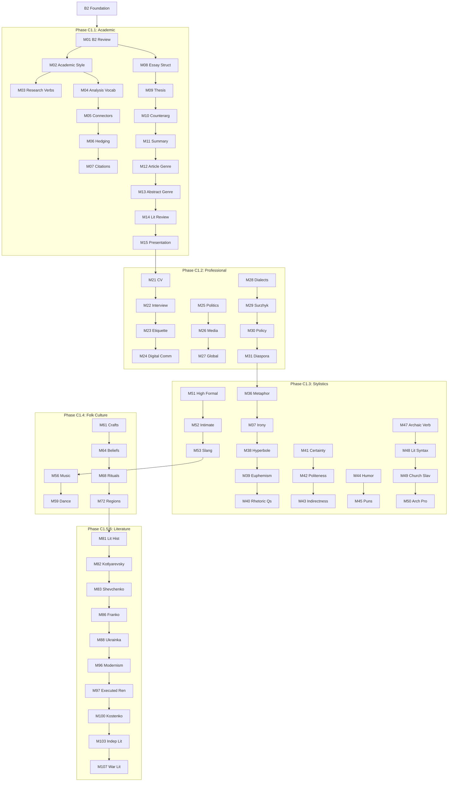

# C1 Curriculum Plan: Ukrainian for English Speakers

**Status:** 📝 PLANNED (Upgraded to A1 Quality)
**Modules:** 01-115 (115 modules)
**Vocabulary Target:** ~2,900 new words (~25/module)
**Cumulative Target:** ~10,550+ words after C1
**Immersion:** 5% English / 95% Ukrainian

> **Note:** Folk Culture & Arts (25 modules) moved from B2 for better vocabulary balance.

---

## Quality Standards & Pedagogical Strategy

**Reference:** `docs/l2-uk-en/MODULE-RICHNESS-GUIDELINES-v2.md`

### Philosophy: Immersion & Analysis
At C1, the learner is no longer "studying" Ukrainian but "studying IN" Ukrainian.

1.  **Academic Rigor:** Modules must feature university-level texts.
2.  **Comparative Analysis:** A core pedagogical tool. Learners must compare multiple texts (e.g., a poem vs. a critique, or two opposing political articles) to develop critical thinking.
3.  **Writing Support:** All writing tasks (Essays, Critiques, Reports) **MUST include a Model Answer** to demonstrate the expected C1 register and structure.

> **Note on Activities:** The "Signature Activity Concepts" listed below are **mandatory pedagogical anchors**. The Module Architect must generate additional activities to meet the **minimum target of 16+ activities per module** (C1 standard).

---

## Ukrainian State Standard 2024 Alignment

> **Source:** Українська мова як іноземна: рівні загального володіння та діагностика (2024)
> **Document:** `docs/l2-uk-en/UKRAINIAN-STATE-STANDARD-2024.txt`

The C1 level (Просунутий рівень першого ступеня) per the official Ukrainian State Standard 2024 requires:

### Grammar Requirements (Каталог В)

#### Archaic & Literary Forms

**Old verb forms (recognition):**

| Form | Modern equivalent | Example | Found in |
|------|-------------------|---------|----------|
| -ти (infinitive) | -ть (rare) | нести/несть | Poetry |
| Aorist traces | Perfective past | рече (said) | Church texts |
| Dual number traces | Plural | двоє очей, двоє вух | Set phrases |

**Church Slavonic influences:**

| Element | Ukrainian equivalent | Example |
|---------|---------------------|---------|
| Prefix пре- | дуже, над- | прекрасний |
| Prefix воз-/вос- | в- | воскресіння |
| Suffix -ущий | -учий (rare) | сущий |
| Vocabulary | Native words | благо (добро), глас (голос) |

**Literary syntax:**
- Inversion for emphasis: Прийшла весна. → Весна прийшла.
- Verb-final: standard → literary placement
- Archaic genitives: до дому, до лісу

#### Full Register Mastery

| Register | C1 Requirement | Example tasks |
|----------|----------------|---------------|
| Офіційно-діловий | Produce documents | Write contracts, official letters |
| Науковий | Research writing | Academic papers, abstracts |
| Публіцистичний | Analytical writing | Opinion pieces, critiques |
| Художній | Literary analysis | Close reading, style analysis |
| Розмовний | Natural use | Jokes, wordplay, register shifts |

**Register shifting:**
- Same content in different registers
- Detecting inappropriate register mixing
- Deliberate stylistic effect

#### Dialectal Forms (Recognition)

**Major dialect groups:**

| Group | Region | Features |
|-------|--------|----------|
| Північне | Полісся | укання, hard р |
| Південно-західне | Галичина, Закарпаття | ікання, soft ц |
| Південно-східне | Слобожанщина | близькість до літературної |

**Common dialectal markers:**
- Phonetic: файний (західне) vs. гарний
- Lexical: бараболя (західне) vs. картопля
- Morphological: -ме (ходиме) vs. -мо (ходимо)

#### Surzhyk (Recognition & Analysis)

**Types of mixing:**

| Type | Example | Standard |
|------|---------|----------|
| Lexical | *кажеться | здається |
| Phonetic | *понімаю | розумію |
| Morphological | *русскій язик | російська мова |

**Sociolinguistic context:**
- Historical causes of Surzhyk
- Regional distribution
- Social attitudes
- De-Surzhykization strategies

#### Advanced Punctuation

**Complex sentence punctuation:**
- Semicolons in lists and periods
- Dashes for emphasis and apposition
- Parentheses vs. commas for insertions
- Quotation conventions (« » vs. " ")

**Punctuation in direct speech:**
- Dialogue formatting
- Attribution placement
- Nested quotations

#### Rhetorical Devices (Стилістичні засоби)

| Device | Ukrainian | Example |
|--------|-----------|---------|
| Metaphor | Метафора | Життя — це дорога. |
| Simile | Порівняння | Швидкий як вітер. |
| Irony | Іронія | "Чудова" погода! |
| Hyperbole | Гіпербола | Я сто разів казав. |
| Litotes | Літота | Непогано. (= дуже добре) |
| Euphemism | Евфемізм | Піти з життя. (= померти) |

#### All Irregular Verbs

**Major irregular patterns:**

| Infinitive | Present 1sg | Past m | Imperative |
|------------|-------------|--------|------------|
| їсти | їм | їв | їж |
| дати | дам | дав | дай |
| бути | є/буду | був | будь |
| хотіти | хочу | хотів | — |
| могти | можу | міг | — |
| іти | іду | ішов | іди |
| їхати | їду | їхав | їдь |
| брати | беру | брав | бери |
| класти | кладу | клав | клади |
| лягти | ляжу | ліг | ляж |

### Thematic Requirements (Каталог Б) - Expert

All B2 topics at expert level plus:
- Academic research and writing
- Literary analysis (classics through contemporary)
- Sociolinguistics (dialects, Surzhyk, language policy)
- Professional communication at highest level
- Cultural and political analysis
- Media literacy and criticism

### Communicative Competence

- Understand extended speech with implicit meanings
- Read complex literary and academic texts
- Express ideas fluently and spontaneously
- Use language flexibly for social, academic, and professional purposes
- Produce clear, well-structured, detailed text on complex subjects
- Control organizational patterns, connectors, and cohesive devices

### Module Scope Checklist

Before writing/reviewing any C1 module, verify:

| Check | Constraint |
|-------|------------|
| Register | Full control, appropriate shifting |
| Literary forms | Archaic recognition, modern production |
| Dialects | Recognition, sociolinguistic awareness |
| Surzhyk | Recognition, analysis capability |
| Punctuation | Complex sentence mastery |
| Rhetoric | Device recognition and production |
| Vocabulary | ~24 new words per module |
| Immersion | 95% Ukrainian |

---

## Prerequisites from B2

Before starting C1, learners have completed:
- All 4 passive voice forms with register awareness
- Active and passive participles
- 5 functional styles (registers)
- Phraseology (proverbs, idioms, set expressions)
- Ukrainian history from origins to present
- Biographies of famous Ukrainians
- ~6,200 cumulative vocabulary words

---

## CEFR C1 Can-Do Alignment

### CEFR C1 Descriptor (Council of Europe)
> Can understand a wide range of demanding, longer texts, and recognise implicit meaning. Can express ideas fluently and spontaneously without much obvious searching for expressions. Can use language flexibly and effectively for social, academic and professional purposes. Can produce clear, well-structured, detailed text on complex subjects, showing controlled use of organisational patterns, connectors and cohesive devices.

### Learning Outcomes
By module 115, learners can:

**Understanding (Listening/Reading)**
- [ ] Understand extended speech even when not clearly structured
- [ ] Understand television programmes and films without effort
- [ ] Understand complex technical or academic texts
- [ ] Recognise implicit meanings, irony, and humor
- [ ] Understand texts from different historical periods
- [ ] Identify dialectal features and Surzhyk

**Speaking (Production/Interaction)**
- [ ] Express ideas fluently without searching for words
- [ ] Use language flexibly for different purposes
- [ ] Formulate ideas precisely for different audiences
- [ ] Use idiomatic expressions naturally
- [ ] Present complex subjects clearly and systematically
- [ ] Defend academic arguments in discussion

**Writing**
- [ ] Write clear, well-structured expositions of complex subjects
- [ ] Write in appropriate style for academic purposes
- [ ] Write critical reviews of literary works
- [ ] Summarize long, demanding texts
- [ ] Write in different registers as appropriate

---

## Overview

The C1 curriculum represents the path to **mastery**. Focus shifts from "learning language" to "using language" at the highest academic, professional, and analytical levels.

**Core Philosophy:**
1. **Academic Rigor:** University-level research and writing skills
2. **Literary Depth:** Deep engagement with Ukrainian literature
3. **Sociolinguistic Awareness:** Understanding dialects, Surzhyk, language policy
4. **Stylistic Mastery:** Complete control of register, tone, nuance
5. **Cultural Fluency:** Operating at native-speaker level in all contexts

---

## Phase C1.1: Academic Foundation (Modules 01-20)

### Learning Goals
- Master academic writing in Ukrainian
- Build research vocabulary
- Develop argumentation skills
- Learn academic genres
- Present at university level

### Grammar Progression

| Module | Grammar Point | Builds On | Enables |
|--------|--------------|-----------|---------|
| 01 | B2 Review & Bridge | B2 complete | C1 foundation |
| 02 | Academic Style Markers | M01 | Formal writing |
| 03 | Research Verbs | M02 | Academic discourse |
| 04 | Analysis Vocabulary | M02-03 | Critical thinking |
| 05 | Logical Connectors | M04 | Argumentation |
| 06 | Hedging & Modality | M05 | Academic nuance |
| 07 | Citation & Reference | M06 | Academic integrity |
| 08 | Essay Structure | M01-07 | Full essays |
| 09 | Thesis Development | M08 | Research papers |
| 10 | Counterarguments | M09 | Sophisticated debate |
| 11 | Summary & Paraphrase | M10 | Source use |
| 12 | Genre: Research Article | M08-11 | Наукова стаття |
| 13 | Genre: Abstract | M12 | Реферат |
| 14 | Genre: Literature Review | M12-13 | Огляд літератури |
| 15 | Oral Presentations | M08-14 | Доповідь |
| 16 | Advanced Punctuation | B2 punctuation | Complex sentences |
| 17 | Irregular Verbs Complete | B2 verbs | All exceptions |
| 18 | C1.1 Practice I | M01-17 | Essay writing |
| 19 | C1.1 Practice II | M01-17 | Article critique |
| 20 | C1.1 Checkpoint | M01-19 | Assessment |

### Module Content Specifications C1.1

---

#### Module 01: B2 Review & Bridge to C1
**Grammar:** Comprehensive B2 consolidation

**Review Focus:**
- All 4 passive forms (correct register selection)
- Participles (active and passive)
- Complex multi-clause sentences
- 5 functional styles
- Phraseology application

**Vocabulary (20 words):**
повторення, узагальнення, систематизація, консолідація, перехід, просунутий, академічний, фаховий, досконалість, майстерність, опанування, вдосконалення, поглиблення, розширення, закріплення, застосування, інтеграція, синтез, аналіз, оцінювання

**Signature Activity Concepts:**
1. Quiz: Register selection for 4 passive types
2. Transform: Convert between passive forms
3. Error correction: Fix register mismatches

---

#### Module 02: Academic Style Markers
**Grammar:** Features distinguishing academic from other registers

**Academic Style Features:**
- Impersonal constructions: Вважається, що... (It is considered that...)
- Nominalization: дослідження (research) vs досліджувати (to research)
- Passive preference: було встановлено (it was established)
- Formal connectors: отже, таким чином, внаслідок
- Hedging: можливо, ймовірно, певною мірою

**Vocabulary (30 words):**
вважається, зазначається, стверджується, наголошується, підкреслюється, констатується, аргументується, обґрунтовується, припускається, передбачається, досліджується, аналізується, розглядається, висвітлюється, характеризується, визначається, описується, пояснюється, інтерпретується, узагальнюється, систематизується, класифікується, порівнюється, зіставляється, оцінюється, критикується, спростовується, підтверджується, доводиться, виводиться

**Signature Activity Concepts:**
1. Transform: Colloquial → Academic register
2. Match-up: Personal → Impersonal construction
3. Gap-fill: Academic style markers in context

---

#### Module 03: Research Verbs
**Grammar:** Verbs specific to academic research discourse

**Verb Categories:**

**Investigation:**
досліджувати, вивчати, аналізувати, з'ясовувати, перевіряти

**Argumentation:**
стверджувати, доводити, обґрунтовувати, аргументувати, спростовувати

**Presentation:**
представляти, викладати, описувати, характеризувати, ілюструвати

**Conclusion:**
підсумовувати, узагальнювати, робити висновок, констатувати

**Vocabulary (30 words):**
досліджувати, вивчати, аналізувати, з'ясовувати, перевіряти, випробовувати, тестувати, експериментувати, спостерігати, фіксувати, реєструвати, документувати, стверджувати, доводити, обґрунтовувати, аргументувати, спростовувати, заперечувати, підтверджувати, підкріплювати, представляти, викладати, описувати, характеризувати, ілюструвати, демонструвати, підсумовувати, узагальнювати, констатувати, резюмувати

**Signature Activity Concepts:**
1. Group-sort: Verbs by function (investigate/argue/present/conclude)
2. Gap-fill: Select appropriate research verb
3. Transform: Use different verbs for same meaning

---

#### Module 04: Analysis Vocabulary
**Grammar:** Nouns and adjectives for critical analysis

**Analysis Nouns:**
аналіз, синтез, оцінка, інтерпретація, критика, порівняння, зіставлення, класифікація, систематизація, узагальнення

**Analysis Adjectives:**
детальний, ґрунтовний, всебічний, критичний, порівняльний, системний, комплексний, об'єктивний, суб'єктивний, обґрунтований

**Vocabulary (30 words):**
аналіз, синтез, оцінка, інтерпретація, критика, порівняння, зіставлення, класифікація, систематизація, узагальнення, детальний, ґрунтовний, всебічний, критичний, порівняльний, системний, комплексний, об'єктивний, суб'єктивний, обґрунтований, чинник, фактор, аспект, компонент, елемент, складова, показник, параметр, критерій, ознака

**Signature Activity Concepts:**
1. Match-up: Analysis noun → definition
2. Quiz: Choose appropriate adjective
3. Gap-fill: Complete analysis sentences

---

#### Module 05: Logical Connectors
**Grammar:** Advanced connectors for argumentation

**Causal:**
оскільки, позаяк, через те що, у зв'язку з тим що, завдяки тому що

**Consequential:**
отже, таким чином, тому, внаслідок цього, у результаті

**Concessive:**
хоча, незважаючи на те що, попри те що, проте, однак, втім

**Contrastive:**
натомість, навпаки, на противагу, з іншого боку, водночас

**Vocabulary (30 words):**
оскільки, позаяк, адже, бо, тому що, через те що, у зв'язку з тим що, завдяки тому що, отже, таким чином, тому, внаслідок цього, у результаті, відтак, хоча, незважаючи на те що, попри те що, проте, однак, втім, тим не менш, натомість, навпаки, на противагу, з іншого боку, водночас, крім того, більше того, до того ж, зрештою

**Signature Activity Concepts:**
1. Group-sort: Connectors by function
2. Gap-fill: Choose appropriate connector
3. Transform: Rewrite using different connectors

---

#### Module 06: Hedging & Modality
**Grammar:** Expressing degrees of certainty in academic writing

**Hedging Devices:**

**Modal Verbs:**
може, міг би, повинен, мусить, здається

**Adverbs:**
можливо, ймовірно, очевидно, напевно, безперечно, певною мірою

**Phrases:**
є підстави вважати, можна припустити, не виключено що

**Vocabulary (30 words):**
можливо, ймовірно, очевидно, напевно, безперечно, безсумнівно, вочевидь, мабуть, либонь, певне, певною мірою, деякою мірою, значною мірою, великою мірою, здається, видається, вважається, припускається, передбачається, є підстави вважати, можна припустити, не виключено що, слід зазначити, варто підкреслити, доречно згадати, необхідно наголосити, важливо зауважити, цікаво відзначити, показово що, характерно що

**Signature Activity Concepts:**
1. Quiz: Certainty scale (0-100%)
2. Transform: Add hedging to statements
3. Gap-fill: Choose appropriate hedging device

---

#### Module 07: Citation & Reference
**Grammar:** Academic citation practices in Ukrainian

**Citation Verbs:**
цитувати, посилатися на, згадувати, наводити, покликатися на

**Reference Structures:**
- За словами Х, ... (According to X, ...)
- Як зазначає Х, ... (As X notes, ...)
- Х стверджує, що ... (X claims that ...)
- На думку Х, ... (In X's opinion, ...)

**Vocabulary (25 words):**
цитувати, цитата, посилання, джерело, бібліографія, література, автор, дослідник, науковець, праця, робота, стаття, монографія, дисертація, посилатися, згадувати, наводити, покликатися, за словами, як зазначає, на думку, згідно з, відповідно до, у праці, у дослідженні

**Signature Activity Concepts:**
1. Transform: Direct → indirect citation
2. Gap-fill: Citation structures
3. Match-up: Citation verb → context

---

#### Module 08: Essay Structure
**Grammar:** Academic essay organization

**Essay Parts:**
- Вступ (Introduction): Hook, background, thesis
- Основна частина (Body): Arguments, evidence, analysis
- Висновки (Conclusion): Summary, implications, future

**Structural Language:**
- Мета цієї роботи — ... (The aim of this work is...)
- У цій статті розглядається ... (This article examines...)
- На завершення варто зазначити ... (In conclusion, it should be noted...)

**Vocabulary (25 words):**
вступ, основна частина, висновки, теза, аргумент, доказ, приклад, ілюстрація, обґрунтування, пояснення, мета, завдання, актуальність, новизна, значення, структура, розділ, підрозділ, абзац, перехід, зв'язок, логіка, послідовність, цілісність, завершеність

**Signature Activity Concepts:**
1. Match-up: Essay part → function
2. Order: Arrange essay sections
3. Gap-fill: Structural phrases

---

#### Module 09: Thesis Development
**Grammar:** Formulating and supporting research claims

**Thesis Types:**
- Констатувальна (Stating): X є Y
- Аргументативна (Argumentative): X є Y, оскільки Z
- Аналітична (Analytical): X складається з A, B, C

**Supporting Strategies:**
доводити, підкріплювати, ілюструвати, демонструвати, підтверджувати

**Vocabulary (25 words):**
теза, гіпотеза, припущення, твердження, положення, концепція, теорія, підхід, метод, методологія, доводити, підкріплювати, ілюструвати, демонструвати, підтверджувати, верифікувати, валідувати, обґрунтовувати, аргументувати, мотивувати, пояснювати, інтерпретувати, тлумачити, розкривати, з'ясовувати

**Signature Activity Concepts:**
1. Quiz: Identify thesis type
2. Transform: Weak thesis → strong thesis
3. Gap-fill: Support a thesis with evidence

---

#### Module 10: Counterarguments
**Grammar:** Acknowledging and refuting opposing views

**Acknowledging:**
- Справді, ... (Indeed, ...)
- Безперечно, ... (Undoubtedly, ...)
- Не можна заперечувати, що ... (It cannot be denied that ...)

**Refuting:**
- Проте ... (However, ...)
- Водночас ... (At the same time, ...)
- Попри це, ... (Despite this, ...)

**Vocabulary (25 words):**
контраргумент, заперечення, спростування, критика, альтернатива, опозиція, протилежний, супротивний, суперечливий, дискусійний, справді, безперечно, звісно, дійсно, очевидно, проте, однак, втім, натомість, водночас, попри це, незважаючи на це, тим не менш, з іншого боку, у той же час

**Signature Activity Concepts:**
1. Match-up: Acknowledge phrase → refute phrase
2. Transform: Add counterargument to thesis
3. Gap-fill: Complete argument-counterargument pairs

---

#### Module 11: Summary & Paraphrase
**Grammar:** Restating ideas without plagiarism

**Summary Techniques:**
- Identify main ideas
- Omit examples and details
- Use synonyms and restructuring
- Maintain original meaning

**Paraphrase Markers:**
Іншими словами, ... (In other words, ...)
Тобто, ... (That is, ...)
Інакше кажучи, ... (Put differently, ...)

**Vocabulary (25 words):**
резюме, анотація, конспект, виклад, переказ, скорочення, стислість, лаконічність, синонім, перифраз, парафраз, переформулювання, перефразування, узагальнення, іншими словами, тобто, інакше кажучи, простіше кажучи, коротко кажучи, підсумовуючи, загалом, у цілому, по суті, головне, основне

**Signature Activity Concepts:**
1. Transform: Summarize a paragraph
2. Paraphrase: Rewrite without changing meaning
3. Quiz: Identify plagiarism vs. proper paraphrase

---

#### Module 12: Genre - Research Article (Наукова стаття)
**Grammar:** Structure and conventions of Ukrainian academic articles

**Article Structure:**
1. Назва (Title)
2. Анотація (Abstract)
3. Ключові слова (Keywords)
4. Вступ (Introduction)
5. Методи (Methods)
6. Результати (Results)
7. Обговорення (Discussion)
8. Висновки (Conclusions)
9. Література (References)

**Vocabulary (25 words):**
назва, заголовок, анотація, ключові слова, вступ, актуальність, мета, завдання, методи, методологія, результати, дані, обговорення, дискусія, висновки, рекомендації, література, бібліографія, посилання, джерело, рецензія, редакція, публікація, видання, журнал

**Signature Activity Concepts:**
1. Order: Arrange article sections
2. Match-up: Section → content type
3. Gap-fill: Article section phrases

---

#### Module 13: Genre - Abstract (Реферат)
**Grammar:** Writing effective academic abstracts

**Abstract Components:**
- Мета (Purpose): Мета дослідження — ...
- Методи (Methods): Використано методи ...
- Результати (Results): Встановлено, що ...
- Висновки (Conclusions): Зроблено висновок про ...

**Vocabulary (25 words):**
реферат, анотація, резюме, стислий, лаконічний, компактний, інформативний, структурований, повний, вичерпний, мета, завдання, об'єкт, предмет, методи, підходи, результати, висновки, значення, актуальність, новизна, практичне значення, теоретичне значення, наукова цінність, практична цінність

**Signature Activity Concepts:**
1. Transform: Full article → abstract
2. Gap-fill: Abstract template phrases
3. Quiz: Identify abstract components

---

#### Module 14: Genre - Literature Review (Огляд літератури)
**Grammar:** Synthesizing sources in academic writing

**Review Functions:**
- Summarize existing research
- Identify gaps in knowledge
- Position your research
- Show scholarly conversation

**Synthesis Language:**
- Численні дослідження показують ... (Numerous studies show ...)
- Думки дослідників розходяться щодо ... (Researchers disagree about ...)
- Недостатньо вивченим залишається ... (Understudied remains ...)

**Vocabulary (25 words):**
огляд, аналіз, синтез, систематизація, узагальнення, джерело, праця, дослідження, публікація, стаття, монографія, численні, різноманітні, суперечливі, протилежні, схожі, подібні, аналогічні, розходяться, збігаються, погоджуються, заперечують, підтверджують, доповнюють, розвивають

**Signature Activity Concepts:**
1. Group-sort: Sources by position (agree/disagree/neutral)
2. Transform: Separate summaries → synthesis
3. Gap-fill: Literature review phrases

---

#### Module 15: Oral Presentations (Доповідь)
**Grammar:** Academic presentation language and structure

**Presentation Phases:**
- Вступ: Дозвольте представити... (Allow me to present...)
- Структура: Доповідь складається з... (The presentation consists of...)
- Перехід: Переходимо до... (Moving on to...)
- Висновки: На завершення... (In conclusion...)
- Запитання: Дякую за увагу. Готовий відповісти на запитання.

**Vocabulary (25 words):**
доповідь, презентація, виступ, промова, слайд, слухачі, аудиторія, структура, план, огляд, вступ, основна частина, висновки, перехід, підсумок, запитання, відповідь, дискусія, обговорення, захист, дозвольте, представити, перейти, підсумувати, завершити

**Signature Activity Concepts:**
1. Order: Presentation phases
2. Match-up: Phrase → presentation phase
3. Gap-fill: Transition phrases

---

#### Module 16: Advanced Punctuation
**Grammar:** Complex punctuation rules in Ukrainian

**Key Rules:**
- Comma before що, який, де, коли in subordinate clauses
- Dash for emphasis: Мова — це душа народу
- Colon before enumeration
- Semicolon between complex clauses
- Quotation marks: «лапки»

**Vocabulary (20 words):**
кома, крапка, двокрапка, крапка з комою, тире, дефіс, лапки, дужки, знак оклику, знак питання, три крапки, апостроф, наголос, пунктуація, розділовий знак, правопис, орфографія, граматика, синтаксис, правило

**Signature Activity Concepts:**
1. Gap-fill: Insert correct punctuation
2. Error correction: Fix punctuation mistakes
3. Quiz: Punctuation rules

---

#### Module 17: Irregular Verbs Complete
**Grammar:** All remaining irregular verb conjugations

**Irregular Categories:**
- Consonant alternation: писати → пишу, возити → вожу
- Vowel changes: брати → беру, слати → шлю
- Suppletive stems: іти → йду, їхати → їду
- Unique patterns: дати → дам, їсти → їм

**Vocabulary (30 words):**
дати, їсти, бути, хотіти, могти, йти, їхати, брати, слати, писати, возити, носити, водити, ходити, бігти, бігати, нести, вести, везти, класти, красти, рости, пасти, гнати, стояти, спати, боятися, сміятися, стати, взяти

**Signature Activity Concepts:**
1. Quiz: Conjugate irregular verbs
2. Gap-fill: Choose correct form
3. Transform: Infinitive → conjugated forms

---

#### Module 18: C1.1 Practice I - Essay Writing
**Grammar:** Integrated essay writing practice

**Task:** Write a 500-word argumentative essay on an academic topic

**Assessment Criteria:**
- Thesis clarity
- Argument structure
- Evidence use
- Academic style
- Proper citations

**Vocabulary (15 words - review):**
есе, есей, твір, стаття, робота, аргумент, теза, доказ, висновок, структура, вступ, основна частина, логіка, зв'язність, переконливість

**Signature Activity Concepts:**
1. Essay writing practice
2. Peer review exercise
3. Self-assessment checklist

---

#### Module 19: C1.1 Practice II - Article Critique
**Grammar:** Critical analysis of academic texts

**Critique Elements:**
- Summary of main argument
- Evaluation of evidence
- Assessment of methodology
- Identification of strengths/weaknesses
- Your position

**Vocabulary (15 words - review):**
критика, рецензія, оцінка, аналіз, сильні сторони, слабкі сторони, переваги, недоліки, методологія, доказова база, переконливість, обґрунтованість, актуальність, новизна, внесок

**Signature Activity Concepts:**
1. Read and critique an article
2. Structured critique writing
3. Discussion of critique points

---

#### Module 20: C1.1 Checkpoint
**Grammar:** Assessment of C1.1 competencies

**Assessment Areas:**
- Academic vocabulary (500+ words)
- Research writing skills
- Citation practices
- Essay structure
- Oral presentation basics

**Vocabulary (10 words - assessment terms):**
оцінювання, тестування, перевірка, контроль, екзамен, залік, бал, оцінка, критерій, результат

**Signature Activity Concepts:**
1. Written exam: Essay on academic topic
2. Vocabulary test
3. Oral presentation (5 minutes)

---

## Phase C1.2: Professional & Social Context (Modules 21-35)

### Learning Goals
- Master professional communication
- Understand Ukrainian political system
- Navigate media landscape
- Recognize sociolinguistic variation
- Build professional vocabulary

### Grammar Progression

| Module | Grammar Point | Builds On | Enables |
|--------|--------------|-----------|---------|
| 21 | CV & Resume Writing | C1.1 style | Job applications |
| 22 | Interview Language | M21 | Job interviews |
| 23 | Business Etiquette | M21-22 | Professional culture |
| 24 | Digital Communication | M23 | Email, messaging |
| 25 | Political System | B2 politics | Advanced civic |
| 26 | Media Landscape | M25 | Media literacy |
| 27 | Global Context | M25-26 | EU/NATO discourse |
| 28 | Dialects Overview | B2 register | Regional recognition |
| 29 | Surzhyk | M28 | Code understanding |
| 30 | Language Policy | M28-29 | Sociolinguistic awareness |
| 31 | Diaspora Ukrainian | M28-30 | Global Ukrainian |
| 32 | C1.2 Practice I | M21-31 | Professional scenarios |
| 33 | C1.2 Practice II | M21-31 | Case studies |
| 34 | C1.2 Review | M21-33 | Consolidation |
| 35 | C1.2 Checkpoint | M21-34 | Assessment |

### Module Content Specifications C1.2

---

#### Module 21: CV & Resume Writing
**Grammar:** Formal self-presentation in job applications

**CV Sections:**
- Особисті дані (Personal data)
- Освіта (Education)
- Досвід роботи (Work experience)
- Навички (Skills)
- Мови (Languages)
- Рекомендації (References)

**Vocabulary (30 words):**
резюме, автобіографія, анкета, заява, мотиваційний лист, супровідний лист, освіта, кваліфікація, ступінь, диплом, сертифікат, досвід, стаж, посада, обов'язки, досягнення, навички, компетенції, володіння, вільне володіння, рекомендація, характеристика, контакти, громадянство, сімейний стан, дата народження, місце народження, адреса, телефон, електронна пошта

**Signature Activity Concepts:**
1. Template: Fill CV template
2. Transform: Informal → formal descriptions
3. Gap-fill: CV section phrases

---

#### Module 22: Interview Language
**Grammar:** Formal dialogue in professional settings

**Interview Phrases:**
- Розкажіть про себе. (Tell me about yourself.)
- Чому ви хочете працювати в нашій компанії? (Why do you want to work for our company?)
- Які ваші сильні сторони? (What are your strengths?)
- Де ви бачите себе через 5 років? (Where do you see yourself in 5 years?)

**Vocabulary (30 words):**
співбесіда, інтерв'ю, кандидат, претендент, роботодавець, рекрутер, вакансія, посада, умови, зарплата, оклад, бонуси, пільги, графік, повний робочий день, часткова зайнятість, віддалена робота, офіс, команда, колектив, корпоративна культура, випробувальний термін, контракт, договір, оформлення, сильні сторони, слабкі сторони, досвід, мотивація, очікування

**Signature Activity Concepts:**
1. Role-play: Job interview simulation
2. Match-up: Question → appropriate answer
3. Gap-fill: Interview phrases

---

#### Module 23: Business Etiquette
**Grammar:** Cultural norms in Ukrainian professional settings

**Etiquette Areas:**
- Звертання (Forms of address): Пане/Пані + ім'я
- Вітання (Greetings): Formal handshakes
- Подарунки (Gift-giving): Business gifts
- Час (Punctuality): Being on time
- Dress code: Business formal/casual

**Vocabulary (25 words):**
етикет, протокол, норми, правила, звертання, пан, пані, панове, шановний, вельмишановний, вітання, рукостискання, візитівка, подарунок, запрошення, пунктуальність, dress code, діловий стиль, формальний, неформальний, зустріч, переговори, ділова вечеря, прийом, конференція

**Signature Activity Concepts:**
1. Quiz: Etiquette dos and don'ts
2. Match-up: Situation → appropriate behavior
3. Role-play: Business meeting scenario

---

#### Module 24: Digital Communication
**Grammar:** Email, messaging, and online professional communication

**Email Structure:**
- Тема (Subject line)
- Звертання (Salutation): Шановний/Шановна...
- Основний текст (Body)
- Прощання (Closing): З повагою, ...
- Підпис (Signature)

**Digital Etiquette:**
- Response timing
- Appropriate emoji use (rarely in formal)
- CC/BCC practices
- Attachment references

**Vocabulary (25 words):**
електронна пошта, лист, повідомлення, вкладення, файл, посилання, тема, звертання, підпис, шаблон, чернетка, відправити, переслати, відповісти, копія, прихована копія, терміново, важливо, підтвердження, отримання, прохання, запит, подяка, вибачення, нагадування

**Signature Activity Concepts:**
1. Write: Formal email on given topic
2. Transform: Informal message → formal email
3. Error correction: Fix email mistakes

---

#### Module 25: Political System of Ukraine
**Grammar:** Vocabulary and structures for political discourse

**Political Structure:**
- Президент (President)
- Верховна Рада (Parliament)
- Кабінет Міністрів (Cabinet of Ministers)
- Конституційний Суд (Constitutional Court)

**Vocabulary (35 words):**
президент, парламент, Верховна Рада, депутат, народний депутат, прем'єр-міністр, міністр, уряд, Кабінет Міністрів, Конституційний Суд, суддя, закон, законопроект, ухвалити, прийняти, ветувати, вибори, голосування, референдум, партія, фракція, коаліція, опозиція, більшість, меншість, демократія, свобода, права, громадянин, громадянство, Конституція, децентралізація, реформа, євроінтеграція, НАТО

**Signature Activity Concepts:**
1. Match-up: Institution → function
2. Quiz: Political system structure
3. Gap-fill: Political news sentences

---

#### Module 26: Media Landscape
**Grammar:** Media literacy and critical analysis

**Media Types:**
- Телебачення (Television): державні, приватні канали
- Радіо (Radio)
- Преса (Press): газети, журнали
- Інтернет-видання (Online media)
- Соцмережі (Social media)

**Critical Analysis:**
- Джерело (Source evaluation)
- Упередженість (Bias detection)
- Фейки (Fake news recognition)
- Пропаганда (Propaganda identification)

**Vocabulary (30 words):**
медіа, засоби масової інформації, ЗМІ, телебачення, канал, радіо, преса, газета, журнал, інтернет-видання, соцмережі, журналіст, кореспондент, редактор, новини, репортаж, інтерв'ю, стаття, огляд, аналітика, джерело, достовірність, упередженість, об'єктивність, фейк, дезінформація, маніпуляція, пропаганда, цензура, свобода слова

**Signature Activity Concepts:**
1. Group-sort: Media types by reliability
2. Quiz: Identify bias indicators
3. Analysis: Evaluate news article

---

#### Module 27: Global Context - EU & NATO
**Grammar:** Discourse about international integration

**Key Organizations:**
- Європейський Союз (EU)
- НАТО (NATO)
- ООН (UN)
- МВФ (IMF)
- Світовий банк (World Bank)

**Integration Vocabulary:**
- Кандидат на вступ (Candidate for membership)
- Переговори про членство (Membership negotiations)
- Виконання умов (Fulfillment of conditions)

**Vocabulary (30 words):**
Європейський Союз, ЄС, НАТО, Північноатлантичний альянс, ООН, МВФ, Світовий банк, Рада Європи, інтеграція, євроінтеграція, кандидат, членство, вступ, переговори, умови, критерії, реформи, демократія, верховенство права, боротьба з корупцією, зона вільної торгівлі, безпека, оборона, партнерство, співпраця, допомога, санкції, підтримка, солідарність, цінності

**Signature Activity Concepts:**
1. Match-up: Organization → function
2. Quiz: EU/NATO integration process
3. Discussion: Ukraine's European path

---

#### Module 28: Dialects of Ukrainian
**Grammar:** Recognizing regional language variation

**Dialect Groups:**
- Північне наріччя (Northern): Полісся
- Південно-західне наріччя (Southwestern): Галичина, Закарпаття, Буковина
- Південно-східне наріччя (Southeastern): Слобожанщина, Донеччина

**Features:**
- Phonetic: ікання vs. укання
- Lexical: бараболя vs. картопля
- Morphological: verb endings

**Vocabulary (25 words):**
наріччя, діалект, говірка, говір, літературна мова, стандартна мова, розмовна мова, регіон, область, фонетика, лексика, морфологія, синтаксис, варіант, особливість, відмінність, ознака, ікання, укання, тверде р, м'яке ц, лексема, архаїзм, діалектизм, регіоналізм

**Signature Activity Concepts:**
1. Quiz: Identify dialect by features
2. Match-up: Dialectal word → standard equivalent
3. Listening: Recognize dialect samples

---

#### Module 29: Surzhyk
**Grammar:** Understanding mixed Ukrainian-Russian speech

**Surzhyk Characteristics:**
- Russian phonetics with Ukrainian words
- Russian vocabulary in Ukrainian grammar
- Code-switching patterns
- Social perceptions

**Examples:**
- *кажеться (surzhyk) vs. здається (standard)
- *понімаю (surzhyk) vs. розумію (standard)
- *єслі (surzhyk) vs. якщо (standard)

**Vocabulary (25 words):**
суржик, змішування, переключення коду, двомовність, білінгвізм, домінантна мова, мовна норма, мовний стандарт, русифікація, українізація, мовна політика, мовна свідомість, мовна лояльність, мовна ідентичність, мовна поведінка, мовний вибір, стигматизація, престиж, статус, ставлення, сприйняття, оцінка, корекція, нормативність, правильність

**Signature Activity Concepts:**
1. Quiz: Identify surzhyk vs. standard
2. Transform: Surzhyk → standard Ukrainian
3. Discussion: Sociolinguistic attitudes

---

#### Module 30: Language Policy
**Grammar:** Understanding language legislation and debates

**Key Laws:**
- Закон «Про забезпечення функціонування української мови як державної» (2019)
- Language requirements in education, media, services
- Historical context of language policy

**Policy Vocabulary:**
державна мова, офіційна мова, мова меншин, мовні права, мовний закон, мовна політика, мовне планування, статус мови

**Vocabulary (30 words):**
державна мова, офіційна мова, рідна мова, мова спілкування, мова меншин, мовні права, мовний закон, мовна політика, мовне планування, статус, функція, сфера вживання, освіта, ЗМІ, державні послуги, реклама, культура, наука, діловодство, судочинство, законодавство, норма, вимога, порушення, штраф, омбудсмен, уповноважений, захист, розвиток, підтримка

**Signature Activity Concepts:**
1. Quiz: Language law requirements
2. Discussion: Language policy debates
3. Analysis: Policy document excerpts

---

#### Module 31: Diaspora Ukrainian
**Grammar:** Understanding Ukrainian language variation abroad

**Major Diaspora Communities:**
- Канада (Canada): Найбільша діаспора
- США (USA): Великі громади
- Бразилія (Brazil): Історичні спільноти
- Австралія (Australia): Повоєнна еміграція
- Європа (Europe): Нова хвиля

**Diaspora Language Features:**
- Archaic vocabulary preservation
- English/local language influence
- Heritage speaker characteristics

**Vocabulary (25 words):**
діаспора, еміграція, імміграція, переселення, біженці, громада, спільнота, хвиля, покоління, перше покоління, друге покоління, heritage speaker, носій, збереження, втрата, асиміляція, інтеграція, ідентичність, культура, традиція, церква, організація, школа, газета, медіа

**Signature Activity Concepts:**
1. Quiz: Diaspora communities
2. Match-up: Region → language features
3. Discussion: Heritage language maintenance

---

#### Module 32: C1.2 Practice I - Professional Scenarios
**Grammar:** Integrated professional communication practice

**Scenarios:**
1. Job application (CV + cover letter)
2. Job interview simulation
3. Business meeting
4. Formal email chain

**Vocabulary (15 words - review):**
професійний, діловий, офіційний, формальний, етикет, комунікація, співбесіда, переговори, зустріч, презентація, звіт, лист, повідомлення, запит, відповідь

**Signature Activity Concepts:**
1. Role-play: Full job application process
2. Write: Business correspondence
3. Presentation: Professional topic

---

#### Module 33: C1.2 Practice II - Case Studies
**Grammar:** Applying sociolinguistic knowledge

**Case Studies:**
1. Language policy debate
2. Media analysis task
3. Dialect/Surzhyk recognition
4. Political discourse analysis

**Vocabulary (15 words - review):**
аналіз, дослідження, випадок, ситуація, контекст, чинник, причина, наслідок, рішення, висновок, рекомендація, оцінка, критика, порівняння, узагальнення

**Signature Activity Concepts:**
1. Case study analysis
2. Group discussion
3. Written report

---

#### Module 34: C1.2 Review
**Grammar:** Consolidation of C1.2 content

**Review Areas:**
- Professional communication
- Political vocabulary
- Media literacy
- Sociolinguistic awareness
- Diaspora knowledge

**Vocabulary (10 words - review):**
повторення, узагальнення, консолідація, закріплення, систематизація, огляд, підсумок, результат, прогрес, досягнення

**Signature Activity Concepts:**
1. Comprehensive review quiz
2. Vocabulary test
3. Oral discussion

---

#### Module 35: C1.2 Checkpoint
**Grammar:** Assessment of C1.2 competencies

**Assessment Areas:**
- Professional writing (CV, emails)
- Political/media vocabulary
- Sociolinguistic knowledge
- Oral communication

**Vocabulary (10 words - assessment):**
оцінювання, тестування, перевірка, контроль, екзамен, залік, бал, оцінка, критерій, результат

**Signature Activity Concepts:**
1. Written exam: Professional document
2. Oral exam: Sociolinguistic discussion
3. Listening: Dialect recognition

---

## Phase C1.3: Advanced Stylistics & Rhetoric (Modules 36-55)

### Learning Goals
- Master rhetorical devices
- Control tone and nuance
- Understand Ukrainian humor
- Navigate all registers
- Recognize archaic forms

### Grammar Progression

| Module | Grammar Point | Builds On | Enables |
|--------|--------------|-----------|---------|
| 36 | Metaphor & Simile | B2 phraseology | Literary reading |
| 37 | Irony & Sarcasm | M36 | Tone detection |
| 38 | Hyperbole & Litotes | M36-37 | Emphasis control |
| 39 | Euphemism & Taboo | M38 | Social navigation |
| 40 | Rhetorical Questions | M36-39 | Persuasion |
| 41 | Degrees of Certainty | C1.1 hedging | Precise modality |
| 42 | Politeness Strategies | M41 | Face-saving |
| 43 | Indirectness | M41-42 | Implicit meaning |
| 44 | Ukrainian Humor | M36-43 | Cultural fluency |
| 45 | Wordplay & Puns | M44 | Linguistic creativity |
| 46 | Anecdotes & Jokes | M44-45 | Social integration |
| 47 | Archaic Verb Forms | B2 verbs | Historical texts |
| 48 | Literary Syntax | M47 | Poetic reading |
| 49 | Church Slavonicisms | M47-48 | Religious/formal texts |
| 50 | Archaic Pronouns | M47-49 | Old texts |
| 51 | High Formal Register | M47-50 | Official documents |
| 52 | Intimate Register | All above | Close relationships |
| 53 | Slang & Youth Language | M52 | Informal contexts |
| 54 | C1.3 Review | M36-53 | Consolidation |
| 55 | C1.3 Checkpoint | M36-54 | Assessment |

### Module Content Specifications C1.3

---

#### Module 36: Metaphor & Simile
**Grammar:** Understanding and using figurative language

**Metaphor Types:**
- Пряма метафора: Життя — це дорога
- Розгорнута метафора: Extended metaphorical narrative
- Персоніфікація: Сонце сміється

**Simile Markers:**
як, немов, наче, ніби, мов, подібно до

**Vocabulary (30 words):**
метафора, порівняння, образ, символ, алегорія, персоніфікація, уособлення, одухотворення, перенесення, асоціація, подібність, аналогія, як, немов, наче, ніби, мов, подібно до, схожий на, нагадує, образний, переносний, буквальний, прямий, художній, поетичний, виразний, яскравий, влучний, оригінальний

**Signature Activity Concepts:**
1. Match-up: Metaphor → meaning
2. Transform: Literal → metaphorical
3. Create: Original metaphors

---

#### Module 37: Irony & Sarcasm
**Grammar:** Detecting and producing ironic utterances

**Irony Markers:**
- Intonation (in speech)
- Context contradiction
- Exaggeration signals
- Quotation marks for "scare quotes"

**Types:**
- Вербальна іронія: Saying opposite of meaning
- Ситуативна іронія: Unexpected outcomes
- Сарказм: Bitter, cutting irony

**Vocabulary (25 words):**
іронія, сарказм, насмішка, глузування, знущання, жарт, гумор, тон, інтонація, контекст, підтекст, натяк, алюзія, протилежність, суперечність, невідповідність, перебільшення, применшення, вдавання, удаваний, іронічний, саркастичний, їдкий, гострий, влучний

**Signature Activity Concepts:**
1. Quiz: Identify ironic statements
2. Transform: Sincere → ironic
3. Discussion: Irony in context

---

#### Module 38: Hyperbole & Litotes
**Grammar:** Exaggeration and understatement

**Hyperbole (Гіпербола):**
- Перебільшення: Я чекав цілу вічність
- Function: Emphasis, humor, emotion

**Litotes (Літота):**
- Применшення: Непоганий (= дуже добрий)
- Function: Modesty, understatement, irony

**Vocabulary (25 words):**
гіпербола, перебільшення, літота, применшення, мейозис, евфемізм, посилення, послаблення, акцент, наголос, ефект, враження, емоція, інтенсивність, ступінь, надмірний, крайній, абсолютний, повний, цілковитий, небагатий, недурний, неабиякий, непоганий, нелегкий

**Signature Activity Concepts:**
1. Match-up: Hyperbole → literal meaning
2. Transform: Neutral → hyperbolic
3. Quiz: Identify litotes

---

#### Module 39: Euphemism & Taboo
**Grammar:** Navigating sensitive topics

**Euphemism Areas:**
- Смерть (Death): відійти, спочити, піти з життя
- Тіло (Body): природні потреби, інтимне
- Хвороба (Illness): недуга, нездужання
- Соціальні теми (Social): звільнення → оптимізація

**Taboo Language:**
- Recognition for comprehension
- Avoidance in production
- Register appropriateness

**Vocabulary (25 words):**
евфемізм, табу, заборона, пом'якшення, заміна, обхідний вираз, делікатний, тактовний, ввічливий, коректний, нейтральний, прямий, грубий, вульгарний, нецензурний, лайка, мат, образа, приниження, дискримінація, стигма, чутливість, толерантність, політкоректність, інклюзивність

**Signature Activity Concepts:**
1. Match-up: Taboo → euphemism
2. Quiz: Register appropriateness
3. Discussion: Cultural differences

---

#### Module 40: Rhetorical Questions
**Grammar:** Questions not expecting answers

**Functions:**
- Наголошення: Хто цього не знає? (Everyone knows)
- Переконання: Чи можемо ми це допустити? (We cannot)
- Емоція: Коли це закінчиться?! (Frustration)

**Structures:**
- Хіба...? Невже...? Чи ж...?
- Як можна...? Чому б не...?

**Vocabulary (20 words):**
риторичний, запитання, питання, відповідь, наголос, акцент, переконання, аргумент, емоція, почуття, ефект, вплив, аудиторія, слухач, читач, хіба, невже, чи ж, як можна, чому б не

**Signature Activity Concepts:**
1. Quiz: Identify rhetorical questions
2. Transform: Statement → rhetorical question
3. Analysis: Rhetorical questions in speeches

---

#### Module 41: Degrees of Certainty
**Grammar:** Precise expression of probability

**Certainty Scale:**
- 100%: безперечно, безсумнівно, напевно
- 75%: ймовірно, скоріш за все, очевидно
- 50%: можливо, може бути, мабуть
- 25%: навряд чи, сумнівно, малоймовірно
- 0%: неможливо, виключено, ні в якому разі

**Vocabulary (25 words):**
безперечно, безсумнівно, напевно, безумовно, однозначно, ймовірно, скоріш за все, очевидно, вочевидь, можливо, може бути, мабуть, либонь, певне, здається, навряд чи, сумнівно, малоймовірно, навряд, ледве чи, неможливо, виключено, ні в якому разі, жодним чином, аж ніяк

**Signature Activity Concepts:**
1. Order: Certainty expressions by probability
2. Gap-fill: Choose appropriate certainty marker
3. Transform: Change certainty level

---

#### Module 42: Politeness Strategies
**Grammar:** Face-saving in Ukrainian communication

**Positive Politeness:**
- Компліменти: Як гарно ви це зробили!
- Інклюзивність: Ми з вами розуміємо...
- Спільна позиція: Погодьтеся, що...

**Negative Politeness:**
- Вибачення: Перепрошую, чи не могли б ви...
- Непрямість: Можливо, варто було б...
- Мінімізація: Це лише невелике прохання...

**Vocabulary (25 words):**
ввічливість, тактовність, делікатність, коректність, пошана, повага, звертання, прохання, вибачення, подяка, комплімент, похвала, згода, відмова, критика, зауваження, пом'якшення, обхідність, непрямість, формальність, неформальність, дистанція, близькість, симпатія, антипатія

**Signature Activity Concepts:**
1. Transform: Direct → polite request
2. Match-up: Situation → politeness strategy
3. Role-play: Polite refusal

---

#### Module 43: Indirectness
**Grammar:** Reading between the lines

**Indirect Speech Acts:**
- Запрошення: Якщо будете вільні... (= Come!)
- Відмова: Я подумаю... (= No)
- Критика: Можна було б і краще... (= Bad)
- Прохання: Тут якось холодно... (= Close the window)

**Vocabulary (25 words):**
натяк, алюзія, імплікатура, підтекст, прихований зміст, непрямий, опосередкований, імпліцитний, експліцитний, прямий, відкритий, завуальований, замаскований, закодований, контекст, ситуація, інтерпретація, розуміння, здогадка, припущення, висновок, вивід, декодування, розшифрування, прочитання

**Signature Activity Concepts:**
1. Quiz: Decode indirect messages
2. Transform: Direct → indirect
3. Discussion: Cultural indirectness patterns

---

#### Module 44: Ukrainian Humor Traditions
**Grammar:** Understanding cultural humor patterns

**Humor Types:**
- Народний гумор: Folk jokes, proverbs
- Сатира: Political, social criticism
- Самоіронія: Self-deprecation
- Абсурд: Absurdist humor

**Famous Humor Sources:**
- Остап Вишня (Ostap Vyshnia)
- "Квартал 95" (Kvartal 95)
- Internet memes

**Vocabulary (25 words):**
гумор, жарт, сміх, комедія, сатира, пародія, іронія, самоіронія, абсурд, гротеск, карикатура, анекдот, каламбур, гра слів, дотепність, гострослів'я, усмішка, регіт, веселощі, розвага, комік, гуморист, сатирик, смішний, кумедний

**Signature Activity Concepts:**
1. Quiz: Humor type identification
2. Analysis: Ukrainian jokes structure
3. Discussion: Humor across cultures

---

#### Module 45: Wordplay & Puns
**Grammar:** Linguistic creativity and double meanings

**Wordplay Types:**
- Омоніми: ключ (key/spring)
- Пароніми: similar-sounding words
- Каламбур: Deliberate puns
- Народна етимологія: Folk etymology jokes

**Vocabulary (25 words):**
каламбур, гра слів, двозначність, багатозначність, омонім, омофон, омограф, паронім, співзвучність, асоціація, натяк, підтекст, дотеп, жарт, гострота, влучність, оригінальність, несподіванка, контраст, парадокс, абсурд, нісенітниця, безглуздя, словесний, мовний

**Signature Activity Concepts:**
1. Quiz: Explain the pun
2. Create: Original wordplay
3. Analysis: Puns in literature/media

---

#### Module 46: Anecdotes & Jokes
**Grammar:** Structure and delivery of Ukrainian jokes

**Joke Structure:**
- Зав'язка: Setup
- Кульмінація: Build-up
- Пуант: Punchline

**Common Themes:**
- Національний характер
- Побутові ситуації
- Політика
- Чоловік і дружина

**Vocabulary (20 words):**
анекдот, жарт, байка, оповідка, історія, зав'язка, кульмінація, розв'язка, пуант, несподіванка, ефект, реакція, сміх, аудиторія, оповідач, персонаж, герой, ситуація, діалог, репліка

**Signature Activity Concepts:**
1. Listening: Understand joke recordings
2. Retell: Tell a joke in Ukrainian
3. Analysis: Why jokes are funny

---

#### Module 47: Archaic Verb Forms
**Grammar:** Historical verb forms in literature

**Archaic Forms:**
- Аорист: рече, рекла (said)
- Імперфект: бяше, бяху (was/were)
- Двоїна: берета, несета (you two take/carry)
- Давноминулий: був зробив (had done)

**Vocabulary (25 words):**
архаїзм, застаріле слово, історизм, давня форма, старослов'янський, церковнослов'янський, аорист, імперфект, двоїна, давноминулий, особа, число, час, вид, спосіб, дієвідміна, відмінювання, закінчення, суфікс, префікс, корінь, основа, інфінітив, дієприкметник, дієприслівник

**Signature Activity Concepts:**
1. Quiz: Identify archaic forms
2. Transform: Modern → archaic (recognition)
3. Reading: Old texts with archaic verbs

---

#### Module 48: Literary Syntax
**Grammar:** Poetic word order and sentence structure

**Literary Devices:**
- Інверсія: Красива вона була (She beautiful was)
- Паралелізм: Repeated structures
- Анафора: Repeated beginnings
- Епіфора: Repeated endings

**Vocabulary (25 words):**
інверсія, порядок слів, паралелізм, анафора, епіфора, рефрен, повтор, риторична фігура, художній засіб, виразність, експресія, ритм, мелодика, інтонація, пауза, акцент, наголос, емфаза, градація, антитеза, оксиморон, хіазм, еліпсис, асиндетон, полісиндетон

**Signature Activity Concepts:**
1. Identify: Literary devices in poems
2. Transform: Prose → poetic syntax
3. Analysis: Shevchenko's syntax

---

#### Module 49: Church Slavonicisms
**Grammar:** Religious and high-style vocabulary

**Church Slavonic Features:**
- Phonetics: глас (voice) vs. голос
- Vocabulary: єсмь, благо, воістину
- Phrases: Во ім'я Отця... (In the name of the Father...)

**Usage Contexts:**
- Religious texts
- Very formal style
- Literary effect
- Historical texts

**Vocabulary (30 words):**
церковнослов'янський, старослов'янський, богослужбовий, літургійний, священний, благо, благословення, воістину, істинно, вірую, єсмь, аз, глас, глава, древо, злато, сребро, врата, чело, очі, уста, перст, десниця, молитва, псалом, євангеліє, апостол, пророк, святий, грішний

**Signature Activity Concepts:**
1. Match-up: Church Slavonic → modern equivalent
2. Reading: Religious text excerpt
3. Quiz: Register identification

---

#### Module 50: Archaic Pronouns
**Grammar:** Old pronoun forms in texts

**Archaic Pronouns:**
- сей, ся, се, сії (this) - vs. modern цей, ця, це, ці
- оний, оная, оноє (that) - vs. modern той, та, те
- кой, кая, коє (which) - vs. modern який, яка, яке

**Usage:**
- Historical texts
- Literary stylization
- Legal archaisms
- Religious language

**Vocabulary (20 words):**
сей, ся, се, сії, оний, оная, оноє, кой, кая, коє, онде, отут, нині, днесь, вчора, позавчора, завтра, позавтра, намисто, старовина

**Signature Activity Concepts:**
1. Transform: Archaic → modern pronouns
2. Reading: Historical documents
3. Quiz: Recognize archaic forms

---

#### Module 51: High Formal Register
**Grammar:** Official document language

**Official Document Types:**
- Закон (Law)
- Указ (Decree)
- Постанова (Resolution)
- Наказ (Order)
- Угода (Agreement)

**Formal Features:**
- Fixed phrases: Цим засвідчується... (This certifies...)
- Passive/impersonal: Зобов'язано... (It is obligated...)
- Nominalization: Здійснення (implementation) vs. здійснити

**Vocabulary (30 words):**
закон, указ, постанова, наказ, розпорядження, угода, договір, акт, протокол, рішення, ухвала, резолюція, декрет, статут, положення, інструкція, регламент, порядок, процедура, термін, строк, дія, чинність, підстава, згідно, відповідно, згідно з, на підставі, у зв'язку з, з метою

**Signature Activity Concepts:**
1. Reading: Official document excerpts
2. Transform: Informal → official register
3. Gap-fill: Official phrase templates

---

#### Module 52: Intimate Register
**Grammar:** Language of close relationships

**Intimate Features:**
- Пестливі імена: Петрусь, Оленка, сонечко
- Зменшувальні суфікси: -ик, -очк-, -еньк-
- Особливі звертання: коханий/кохана, любий/люба
- Неформальні вирази: Як справи? Що нового?

**Vocabulary (25 words):**
коханий, кохана, любий, люба, дорогий, дорога, милий, мила, сонечко, зірочка, серденько, рибка, зайчик, котик, лапочка, пестливий, ніжний, теплий, близький, інтимний, довірливий, щирий, відвертий, неформальний, розкутий

**Signature Activity Concepts:**
1. Transform: Formal → intimate register
2. Create: Pet names (пестливі імена)
3. Discussion: Register switching with family

---

#### Module 53: Slang & Youth Language
**Grammar:** Informal and youth vocabulary

**Slang Categories:**
- Інтернет-сленг: лол, рофл, кринж
- Молодіжний сленг: круто, прикольно, тупо
- Сленг субкультур: Various groups
- Запозичення: From English mainly

**Note:** Passive recognition, not active production in formal contexts

**Vocabulary (25 words):**
сленг, жаргон, арго, молодіжна мова, неформальна мова, розмовна мова, знижена лексика, вульгаризм, запозичення, англіцизм, новотвір, оказіоналізм, круто, класно, прикольно, тупо, кринж, рофл, лол, чел, чувак, движ, тусовка, хайп, вайб

**Signature Activity Concepts:**
1. Quiz: Slang → standard meaning
2. Discussion: Attitudes to slang
3. Listening: Youth speech samples

---

#### Module 54: C1.3 Review
**Grammar:** Consolidation of stylistics and rhetoric

**Review Areas:**
- Rhetorical devices
- Tone and nuance
- Humor understanding
- Register range
- Archaic recognition

**Vocabulary (10 words - review):**
повторення, узагальнення, консолідація, систематизація, стилістика, риторика, регістр, тон, нюанс, виразність

**Signature Activity Concepts:**
1. Comprehensive stylistics quiz
2. Register transformation exercise
3. Literary analysis practice

---

#### Module 55: C1.3 Checkpoint
**Grammar:** Assessment of C1.3 competencies

**Assessment Areas:**
- Rhetorical device identification
- Tone/nuance production
- Humor comprehension
- Register flexibility
- Archaic form recognition

**Vocabulary (10 words - assessment):**
оцінювання, тестування, перевірка, контроль, екзамен, залік, бал, оцінка, критерій, результат

**Signature Activity Concepts:**
1. Written: Stylistic analysis essay
2. Oral: Register flexibility test
3. Listening: Irony/humor comprehension

---

## Phase C1.4: Folk Culture & Arts (Modules 56-80)

> **Moved from B2** for better vocabulary balance across levels.

### Learning Goals
- Understand Ukrainian folk traditions in depth
- Know regional diversity and identity
- Appreciate music, dance, and crafts
- Build rich cultural vocabulary
- Connect folk culture to modern Ukrainian identity

### Module Specifications

| # | Title | Type | Focus |
|---|-------|------|-------|
| 56 | Кобзарі та бандура | Folk Music | Epic tradition, blind bards |
| 57 | Обрядові пісні | Folk Music | Колядки, щедрівки, веснянки |
| 58 | Колискові та думи | Folk Music | Lullabies, epic ballads |
| 59 | Гопак і козачок | Folk Dance | Traditional Cossack dances |
| 60 | Регіональні танці | Folk Dance | Гуцульський аркан, полісські |
| 61 | Писанки | Folk Crafts | Easter egg symbolism |
| 62 | Вишиванка | Folk Crafts | Regional embroidery patterns |
| 63 | Гончарство та різьбярство | Folk Crafts | Опішне, гуцульська різьба |
| 64 | Народна міфологія | Folk Beliefs | Мавка, домовик, лісовик |
| 65 | Народна медицина | Folk Beliefs | Herbs, healing traditions |
| 66 | Козацькі легенди | Folk Tales | Hero tales, Cossack myths |
| 67 | Казки та притчі | Folk Tales | Magic tales, moral stories |
| 68 | Зимові обряди | Calendar | Коляда, Маланка, Водохреща |
| 69 | Весна та літо | Calendar | Великдень, Зелені свята, Купала |
| 70 | Хрестини та весілля | Life Rituals | Birth and marriage customs |
| 71 | Поминальні обряди | Life Rituals | Провід, поминки, memorial |
| 72 | Галичина | Regional | Western Ukrainian traditions |
| 73 | Слобожанщина | Regional | Eastern Ukrainian traditions |
| 74 | Полісся | Regional | Forest region traditions |
| 75 | Поділля та Волинь | Regional | Central-West traditions |
| 76 | Класичні композитори | Music | Лисенко, Скорик, Сильвестров |
| 77 | Сучасна музика | Music | Rock, pop, Eurovision |
| 78 | Українське кіно | Arts | Довженко to contemporary |
| 79 | Спортивні герої | Culture | Champions, national pride |
| 80 | C1.4 Checkpoint | Review | Folk culture assessment |

### Vocabulary Plan C1.4 (~600 words)
- Folk music: кобзар, бандура, колядка, щедрівка, веснянка, думка, лірник
- Folk dance: гопак, козачок, аркан, коломийка, гуцулка
- Folk crafts: писанка, крашанка, вишиванка, гончар, різьбяр, ткаля
- Folk beliefs: домовик, мавка, лісовик, водяник, чугайстер, упир
- Rituals: коляда, маланка, купала, весілля, хрестини, похорон, провід
- Regions: Галичина, Слобожанщина, Полісся, Поділля, Волинь, Буковина

---

## Phase C1.5: Literature I - Classics (Modules 81-95)

### Learning Goals
- Know major Ukrainian literary figures
- Read 19th century literature
- Understand literary analysis
- Build literary vocabulary
- Appreciate national literature

### Module Specifications

| # | Title | Type | Focus |
|---|-------|------|-------|
| 81 | Історія української літератури | Literature | Periods and movements |
| 82 | Котляревський: Енеїда | Literature | Burlesque, national revival |
| 83 | Шевченко: Життя | Literature | Biography, context |
| 84 | Шевченко: Поезія | Literature | Major poems analysis |
| 85 | Шевченко: Спадщина | Literature | Legacy, influence |
| 86 | Франко: Життя і поезія | Literature | Каменярі, lyrics |
| 87 | Франко: Проза | Literature | Захар Беркут excerpts |
| 88 | Леся Українка: Поезія | Literature | Contra Spem Spero |
| 89 | Леся Українка: Драма | Literature | Лісова пісня |
| 90 | Вовчок та Мирний | Literature | Social realism |
| 91 | Коцюбинський | Literature | Тіні забутих предків |
| 92 | Літературознавча термінологія | Vocabulary | Plot, theme, motif |
| 93 | Аналіз поезії | Skills | Meter, rhyme, imagery |
| 94 | C1.5 Review | Review | 19th century literature |
| 95 | C1.5 Checkpoint | Review | Assessment |

### Vocabulary Plan C1.5 (~400 words)
- Literary terms: сюжет, фабула, тема, мотив, образ, символ, алегорія
- Analysis vocabulary: аналіз, інтерпретація, критика, рецензія
- Period-specific vocabulary from each author
- Poetic vocabulary: вірш, строфа, рима, ритм, розмір, ямб, хорей

---

## Phase C1.6: Literature II - Modern & Capstone (Modules 96-115)

### Learning Goals
- Understand 20th century tragedy
- Know contemporary authors
- Complete capstone project
- Achieve C1 certification
- Prepare for C2

### Module Specifications

| # | Title | Type | Focus |
|---|-------|------|-------|
| 96 | Модернізм | Literature | Early 20th century |
| 97 | Розстріляне відродження | Literature | Хвильовий, Зеров, Підмогильний |
| 98 | Тичина та Рильський | Literature | Кларнети сонця |
| 99 | Радянський період | Literature | Симоненко, Драч |
| 100 | Ліна Костенко | Literature | Маруся Чурай |
| 101 | Василь Стус | Literature | Палімпсести |
| 102 | Діаспорна література | Literature | Багряний та інші |
| 103 | Незалежність | Literature | 1990s explosion |
| 104 | Андрухович | Literature | Станіславський феномен |
| 105 | Забужко | Literature | Польові дослідження |
| 106 | Жадан | Literature | Ворошиловград |
| 107 | Воєнна література | Literature | 2014-present |
| 108 | Літературна критика | Skills | Reviews, analysis |
| 109 | C1.6 Review | Review | Modern literature |
| 110 | C1.6 Integration | Practice | Essay on literature |
| 111 | Капстон: Проєкт | Project | Research paper |
| 112 | Капстон: Захист | Project | Oral defense |
| 113 | C1 Фінал: Читання | Exam | Reading comprehension |
| 114 | C1 Фінал: Письмо | Exam | Timed essay |
| 115 | C1 РІВЕНЬ ЗАВЕРШЕНО | Milestone | Certification |

### Vocabulary Plan C1.6 (~350 words)
- 20th century literary vocabulary
- Contemporary terms: постмодернізм, інтертекстуальність, метанаратив
- War literature vocabulary: окупація, спротив, травма, деколонізація
- Academic/capstone vocabulary: дисертація, захист, рецензент

---

## Content Summary

### Phase Distribution

| Phase | Modules | Count | Type |
|-------|---------|-------|------|
| C1.1 | 01-20 | 20 | Academic Foundation |
| C1.2 | 21-35 | 15 | Professional & Social |
| C1.3 | 36-55 | 20 | Stylistics & Rhetoric |
| C1.4 | 56-80 | 25 | Folk Culture & Arts |
| C1.5 | 81-95 | 15 | Literature - Classics |
| C1.6 | 96-115 | 20 | Literature - Modern & Capstone |
| **TOTAL** | **01-115** | **115** | |

### Vocabulary Summary

| Phase | Target Words | Cumulative |
|-------|--------------|------------|
| C1.1 | ~500 | 500 |
| C1.2 | ~450 | 950 |
| C1.3 | ~500 | 1,450 |
| C1.4 | ~600 | 2,050 |
| C1.5 | ~400 | 2,450 |
| C1.6 | ~350 | 2,800 |
| **Total C1** | **~2,800** | **~9,000 cumulative** |

---

## Cross-Module Dependencies

## Cross-Module Dependencies

---

## Activity Types by Phase

### C1.1 Academic
1. Production: Essay writing (Model Answer required)
2. Quiz: Article critique analysis
3. Match-up: Literature review synthesis
4. Dialogue: Oral presentation simulation
5. Fill-in: Citation practice

### C1.2 Professional/Social
1. Production: CV/resume writing
2. Dialogue: Interview role-play
3. Quiz: Political/media analysis
4. Dialogue: Sociolinguistic discussion
5. Production: Case studies

### C1.3 Stylistics
1. Quiz: Rhetorical analysis
2. Transform: Register transformation
3. Quiz: Humor decoding
4. Production: Creative writing
5. Match-up: Archaic text reading

### C1.4 Folk Culture & Arts
1. Production: Cultural exploration report
2. Group-sort: Regional comparisons
3. Quiz: Folk music/dance analysis
4. Match-up: Craft symbolism decoding
5. Production: Ritual documentation

### C1.5-C1.6 Literature
1. Quiz: Close reading comprehension
2. Production: Literary analysis essays
3. Dialogue: Author presentations
4. Match-up: Comparative analysis
5. Production: Capstone research

---

## Quality Checklist

Before generating any C1 module:

- [ ] Grammar builds on B2 and previous C1 modules
- [ ] Vocabulary is domain-appropriate (~24 words/module)
- [ ] Register awareness is advanced
- [ ] Literary content is authentic
- [ ] Activities match module type
- [ ] Immersion level is 95% Ukrainian
- [ ] No forward references to unlearned content
- [ ] Review modules cover all preceding content

---

## Implementation Status

| Phase | Modules | Status |
|-------|---------|--------|
| C1.1 | 01-20 | 📝 Detailed specs |
| C1.2 | 21-35 | 📝 Detailed specs |
| C1.3 | 36-55 | 📝 Detailed specs |
| C1.4 | 56-80 | 📝 Summary specs (moved from B2) |
| C1.5 | 81-95 | 📝 Summary specs |
| C1.6 | 96-115 | 📝 Summary specs |

---

## Notes

1. **115 modules** provides comprehensive C1 coverage aligned with CEFR and Ukrainian State Standard 2024.

2. **Level-relative numbering** (01-115) replaces old global numbering (311-400).

3. **Folk Culture & Arts** (C1.4) moved from B2 to balance vocabulary distribution across levels.

4. **Literature** sections (C1.5-C1.6) cover major Ukrainian authors from 18th century to present, including war literature.

5. **Sociolinguistic awareness** (dialects, Surzhyk, language policy) is essential C1 content.

6. **Capstone project** (modules 111-115) requires substantial research paper and oral defense.

7. **Specialization tracks** (Law, IT, Medicine) remain separate from core C1.

---

## Related Documents

- A1-CURRICULUM-PLAN.md (complete)
- A2-CURRICULUM-PLAN.md (complete)
- B1-CURRICULUM-PLAN.md (complete)
- B2-CURRICULUM-PLAN.md (complete)
- C2-CURRICULUM-PLAN.md (complete)

---

## Changelog

- **2025-12-05:** Expanded State Standard alignment with full grammar tables
- **2025-12-05:** Restructured: added C1.4 Folk Culture (25 modules from B2), renumbered C1.5-C1.6, now 115 modules total
- **2025-12-05:** Upgraded with detailed module specifications
- **Previous:** Basic structure only (90 modules, old numbering)
