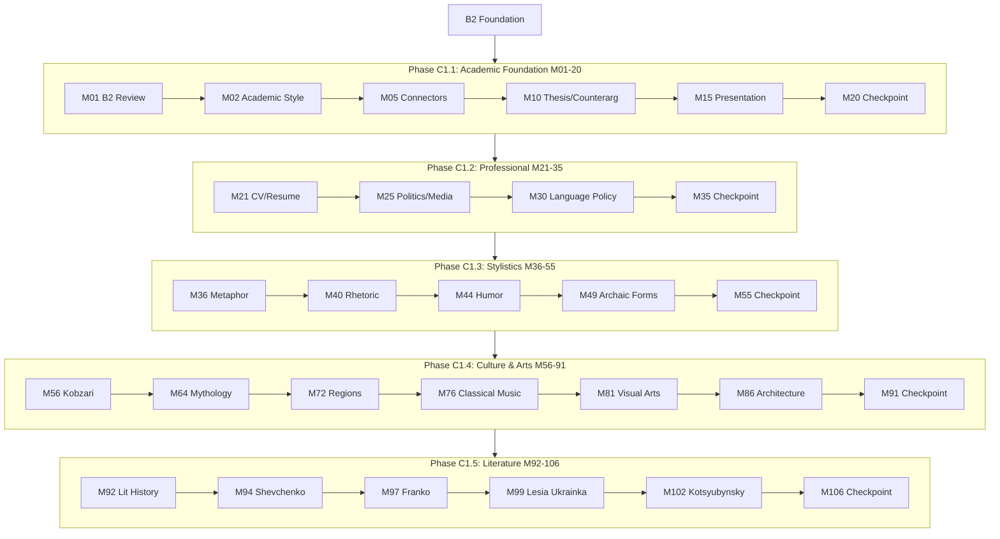

# C1 Curriculum Plan: Ukrainian for English Speakers

**Status:** 🔄 REORGANIZED (RFC #409, January 2026)
**Modules:** 01-106 (106 modules)
**Vocabulary Target:** ~2,544 new words (~24/module)
**Cumulative Target:** ~8,594 words after C1
**Immersion:** 100% Ukrainian (full immersion — English only in vocabulary translations)

> **RFC #409 Reorganization (January 2026):**
> - Biography content (96 modules) relocated to **C1-BIO** optional track
> - Core C1 now focuses on academic writing, stylistics, folk culture, and literature
> - See `C1-BIO-CURRICULUM-PLAN.md` for biography track details

---

## Вступ

**Від вивчення до життя українською!**

C1 — це рівень, де ви перестаєте «вивчати українську» і починаєте «жити українською». Ви вже не вивчаєте мову — ви нею користуєтеся для вивчення всього іншого. Університетські лекції, наукові статті, літературна критика, культурний аналіз — усе виключно українською.

Цей рівень — це перехід від «просунутого учня» до «освіченого мовця».

### Що ви вивчите

- **Академічне письмо** — наукові статті, що можна подати до українських журналів
- **Літературний аналіз** — критичне читання на рівні носія мови
- **Стилістична майстерність** — вільне перемикання між регістрами
- **Діалектологія** — розпізнавання регіональних діалектів і суржику
- **Народна культура** — глибоке розуміння фольклору, музики та мистецтва

### Філософія навчання

На рівні C1 ви «вивчаєте В українській», а не «вивчаєте українську». Кожен модуль — це занурення в певну тему засобами української мови.

**Занурення:** 100% українською (англійська лише для перекладів у словникових таблицях)

### Попередні вимоги

Завершення рівня B2:
- Вільне володіння пасивним станом і дієприкметниками
- Розуміння стилістичних регістрів
- Словниковий запас ~5,500 слів

### Структура рівня (106 модулів)

- **M01-35:** Академічна база та професійна комунікація
- **M36-55:** Стилістика, риторика та регістри (20 модулів)
- **M56-91:** Народна культура, музика та мистецтво (36 модулів)
- **M92-106:** Українська література (15 модулів)

### Додатковий трек

- **C1-BIO:** 96 біографій видатних українців (окремий трек)

---

## Quality Standards & Pedagogical Strategy

**Reference:** `docs/l2-uk-en/MODULE-RICHNESS-GUIDELINES-v2.md`
**Philosophy:** `claude_extensions/quick-ref/philosophy.md` (Strict Linguistic Standards)

### Philosophy: Immersion & Analysis

At C1, the learner is no longer "studying" Ukrainian but "studying IN" Ukrainian.

1.  **Academic Rigor:** Modules must feature university-level texts.
2.  **Comparative Analysis:** A core pedagogical tool. Learners must compare multiple texts (e.g., a poem vs. a critique, or two opposing political articles) to develop critical thinking.
3.  **Writing Support:** All writing tasks (Essays, Critiques, Reports) **MUST include a Model Answer** to demonstrate the expected C1 register and structure.

### Advanced Activity Types (C1 Standard)

To meet the "Studying IN Ukrainian" philosophy, C1 modules must integrate these advanced production tasks:

| Type                    | Description                                       | Requirement                        |
| ----------------------- | ------------------------------------------------- | ---------------------------------- |
| **[essay-response]**    | Long-form argumentation (400+ words)              | Must include Rubric & Model Answer |
| **[critical-analysis]** | Deconstructs bias, tone, and rhetorical structure | Focus on "how" not just "what"     |
| **[comparative-study]** | Side-by-side analysis of 2+ texts/perspectives    | Mandatory for all LIT modules      |
| **[authorial-intent]**  | Evaluates author's purpose and hidden agendas     | Uses "Prosecutor's Voice" strategy |

> **Note on Activities:** The "Signature Activity Concepts" listed below are **mandatory pedagogical anchors**. The Module Architect must generate additional activities to meet the **minimum target of 16+ activities per module** (C1 standard).

---

## Vocabulary Approach (B1+)

**From B1 onwards, vocabulary is not prescribed in this plan.** Instead, vocabulary emerges naturally from the module's thematic content and is validated against:

- **Richness targets:** 30+ unique words per module (enforced by audit)
- **Integration requirements:** 80% used in activities, 50% in lesson text (enforced by audit)
- **Register appropriateness:** Vocabulary complexity matches C1 proficiency level

The "Content Guidance" sections below provide **thematic direction** and **pop culture anchors** to guide vocabulary selection, but builders have flexibility to choose words that best serve the pedagogical goals.

**Why this approach?**
- Content-driven vocabulary is more authentic and contextual
- Historical/cultural modules require domain-specific terminology
- Pop culture references evolve and need flexibility
- Quality is enforced through metrics, not prescriptive lists

---

## Ukrainian State Standard 2024 Alignment

> **Source:** Українська мова як іноземна: рівні загального володіння та діагностика (2024)
> **Document:** `docs/l2-uk-en/UKRAINIAN-STATE-STANDARD-2024.txt`

The C1 level (Просунутий рівень першого ступеня) per the official Ukrainian State Standard 2024 requires:

### Grammar Requirements (Каталог В)

#### Archaic & Literary Forms

**Old verb forms (recognition):**

| Form               | Modern equivalent | Example             | Found in     |
| ------------------ | ----------------- | ------------------- | ------------ |
| -ти (infinitive)   | -ть (rare)        | нести/несть         | Poetry       |
| Aorist traces      | Perfective past   | рече (said)         | Church texts |
| Dual number traces | Plural            | двоє очей, двоє вух | Set phrases  |

**Church Slavonic influences:**

| Element          | Ukrainian equivalent | Example                     |
| ---------------- | -------------------- | --------------------------- |
| Prefix пре-      | дуже, над-           | прекрасний                  |
| Prefix воз-/вос- | в-                   | воскресіння                 |
| Suffix -ущий     | -учий (rare)         | сущий                       |
| Vocabulary       | Native words         | благо (добро), глас (голос) |

**Literary syntax:**

- Inversion for emphasis: Прийшла весна. → Весна прийшла.
- Verb-final: standard → literary placement
- Archaic genitives: до дому, до лісу

#### Full Register Mastery

| Register         | C1 Requirement     | Example tasks                     |
| ---------------- | ------------------ | --------------------------------- |
| Офіційно-діловий | Produce documents  | Write contracts, official letters |
| Науковий         | Research writing   | Academic papers, abstracts        |
| Публіцистичний   | Analytical writing | Opinion pieces, critiques         |
| Художній         | Literary analysis  | Close reading, style analysis     |
| Розмовний        | Natural use        | Jokes, wordplay, register shifts  |

**Register shifting:**

- Same content in different registers
- Detecting inappropriate register mixing
- Deliberate stylistic effect

#### Dialectal Forms (Recognition)

**Major dialect groups:**

| Group            | Region               | Features                   |
| ---------------- | -------------------- | -------------------------- |
| Північне         | Полісся              | укання, hard р             |
| Південно-західне | Галичина, Закарпаття | ікання, soft ц             |
| Південно-східне  | Слобожанщина         | близькість до літературної |

**Common dialectal markers:**

- Phonetic: файний (західне) vs. гарний
- Lexical: бараболя (західне) vs. картопля
- Morphological: -ме (ходиме) vs. -мо (ходимо)

#### Surzhyk (Recognition & Analysis)

**Types of mixing:**

| Type          | Example        | Standard       |
| ------------- | -------------- | -------------- |
| Lexical       | \*кажеться     | здається       |
| Phonetic      | \*понімаю      | розумію        |
| Morphological | \*русскій язик | російська мова |

**Sociolinguistic context:**

- Historical causes of Surzhyk
- Regional distribution
- Social attitudes
- De-Surzhykization strategies

#### Advanced Punctuation

**Complex sentence punctuation:**

- Semicolons in lists and periods
- Dashes for emphasis and apposition
- Parentheses vs. commas for insertions
- Quotation conventions (« » vs. " ")

**Punctuation in direct speech:**

- Dialogue formatting
- Attribution placement
- Nested quotations

#### Rhetorical Devices (Стилістичні засоби)

| Device    | Ukrainian  | Example                   |
| --------- | ---------- | ------------------------- |
| Metaphor  | Метафора   | Життя — це дорога.        |
| Simile    | Порівняння | Швидкий як вітер.         |
| Irony     | Іронія     | "Чудова" погода!          |
| Hyperbole | Гіпербола  | Я сто разів казав.        |
| Litotes   | Літота     | Непогано. (= дуже добре)  |
| Euphemism | Евфемізм   | Піти з життя. (= померти) |

#### All Irregular Verbs

**Major irregular patterns:**

| Infinitive | Present 1sg | Past m | Imperative |
| ---------- | ----------- | ------ | ---------- |
| їсти       | їм          | їв     | їж         |
| дати       | дам         | дав    | дай        |
| бути       | є/буду      | був    | будь       |
| хотіти     | хочу        | хотів  | —          |
| могти      | можу        | міг    | —          |
| іти        | іду         | ішов   | іди        |
| їхати      | їду         | їхав   | їдь        |
| брати      | беру        | брав   | бери       |
| класти     | кладу       | клав   | клади      |
| лягти      | ляжу        | ліг    | ляж        |

### Thematic Requirements (Каталог Б) - Expert

All B2 topics at expert level plus:

- Academic research and writing
- Literary analysis (classics through contemporary)
- Sociolinguistics (dialects, Surzhyk, language policy)
- Professional communication at highest level
- Cultural and political analysis
- Media literacy and criticism

### Communicative Competence

- Understand extended speech with implicit meanings
- Read complex literary and academic texts
- Express ideas fluently and spontaneously
- Use language flexibly for social, academic, and professional purposes
- Produce clear, well-structured, detailed text on complex subjects
- Control organizational patterns, connectors, and cohesive devices

### Module Scope Checklist

Before writing/reviewing any C1 module, verify:

| Check          | Constraint                             |
| -------------- | -------------------------------------- |
| Register       | Full control, appropriate shifting     |
| Literary forms | Archaic recognition, modern production |
| Dialects       | Recognition, sociolinguistic awareness |
| Surzhyk        | Recognition, analysis capability       |
| Punctuation    | Complex sentence mastery               |
| Rhetoric       | Device recognition and production      |
| Vocabulary     | ~24 new words per module               |
| Immersion      | 100% Ukrainian                         |

---

## Prerequisites from B2

Before starting C1, learners have completed:

- All 4 passive voice forms with register awareness
- Active and passive participles
- 5 functional styles (registers)
- Phraseology (proverbs, idioms, set expressions)
- Professional communication basics
- ~6,050 cumulative vocabulary words

**Optional prerequisite tracks:**
- B2-HIST: Ukrainian History (61 modules) - recommended but not required
- B2-PRO: Professional Ukrainian (40 modules) - for career focus

---

## CEFR C1 Can-Do Alignment

### CEFR C1 Descriptor (Council of Europe)

> Can understand a wide range of demanding, longer texts, and recognise implicit meaning. Can express ideas fluently and spontaneously without much obvious searching for expressions. Can use language flexibly and effectively for social, academic and professional purposes. Can produce clear, well-structured, detailed text on complex subjects, showing controlled use of organisational patterns, connectors and cohesive devices.

### Learning Outcomes

By module 106, learners can:

**Understanding (Listening/Reading)**

- [ ] Understand extended speech even when not clearly structured
- [ ] Understand television programmes and films without effort
- [ ] Understand complex technical or academic texts
- [ ] Recognise implicit meanings, irony, and humor
- [ ] Understand texts from different historical periods
- [ ] Identify dialectal features and Surzhyk

**Speaking (Production/Interaction)**

- [ ] Express ideas fluently without searching for words
- [ ] Use language flexibly for different purposes
- [ ] Formulate ideas precisely for different audiences
- [ ] Use idiomatic expressions naturally
- [ ] Present complex subjects clearly and systematically
- [ ] Defend academic arguments in discussion

**Writing**

- [ ] Write clear, well-structured expositions of complex subjects
- [ ] Write in appropriate style for academic purposes
- [ ] Write critical reviews of literary works
- [ ] Summarize long, demanding texts
- [ ] Write in different registers as appropriate

---

## Overview

The C1 curriculum represents the path to **mastery**. Focus shifts from "learning language" to "using language" at the highest academic, professional, and analytical levels.

**Core Philosophy:**

1. **Academic Rigor:** University-level research and writing skills
2. **Literary Depth:** Deep engagement with Ukrainian literature
3. **Sociolinguistic Awareness:** Understanding dialects, Surzhyk, language policy
4. **Stylistic Mastery:** Complete control of register, tone, nuance
5. **Cultural Fluency:** Operating at native-speaker level in all contexts

---

## Phase C1.1: Academic Foundation (Modules 01-20)

### Learning Goals

- Master academic writing in Ukrainian
- Build research vocabulary
- Develop argumentation skills
- Learn academic genres
- Present at university level

**PEDAGOGICAL REQUIREMENT:**

- **Deep Immersion (90-100%):** Academic instruction must be in Ukrainian. English is allowed only for specific contrastive analysis (e.g., comparing English vs. Ukrainian citation styles).

### Grammar Progression

| Module | Grammar Point            | Builds On      | Enables              |
| ------ | ------------------------ | -------------- | -------------------- |
| 01     | B2 Review & Bridge       | B2 complete    | C1 foundation        |
| 02     | Academic Style Markers   | M01            | Formal writing       |
| 03     | Research Verbs           | M02            | Academic discourse   |
| 04     | Analysis Vocabulary      | M02-03         | Critical thinking    |
| 05     | Logical Connectors       | M04            | Argumentation        |
| 06     | Hedging & Modality       | M05            | Academic nuance      |
| 07     | Citation & Reference     | M06            | Academic integrity   |
| 08     | Essay Structure          | M01-07         | Full essays          |
| 09     | Thesis Development       | M08            | Research papers      |
| 10     | Counterarguments         | M09            | Sophisticated debate |
| 11     | Summary & Paraphrase     | M10            | Source use           |
| 12     | Genre: Research Article  | M08-11         | Наукова стаття       |
| 13     | Genre: Abstract          | M12            | Реферат              |
| 14     | Genre: Literature Review | M12-13         | Огляд літератури     |
| 15     | Oral Presentations       | M08-14         | Доповідь             |
| 16     | Advanced Punctuation     | B2 punctuation | Complex sentences    |
| 17     | Irregular Verbs Complete | B2 verbs       | All exceptions       |
| 18     | C1.1 Practice I          | M01-17         | Essay writing        |
| 19     | C1.1 Practice II         | M01-17         | Article critique     |
| 20     | C1.1 Checkpoint          | M01-19         | Assessment           |

### Module Content Specifications C1.1

---

#### Module 01: B2 Review & Bridge to C1

**Grammar:** Comprehensive B2 consolidation

**Review Focus:**

- All 4 passive forms (correct register selection)
- Participles (active and passive)
- Complex multi-clause sentences
- 5 functional styles
- Phraseology application

**Content Guidance:**
Vocabulary will emerge naturally from thematic content and should meet:
- Richness targets: 30+ words per module
- Integration: 80% in activities, 50% in lesson text
- Register and complexity appropriate to C1 level

**Signature Activity Concepts:**

1. Quiz: Register selection for 4 passive types
2. Transform: Convert between passive forms
3. Error correction: Fix register mismatches

---

#### Module 02: Academic Style Markers

**Grammar:** Features distinguishing academic from other registers

**Academic Style Features:**

- Impersonal constructions: Вважається, що... (It is considered that...)
- Nominalization: дослідження (research) vs досліджувати (to research)
- Passive preference: було встановлено (it was established)
- Formal connectors: отже, таким чином, внаслідок
- Hedging: можливо, ймовірно, певною мірою

**Content Guidance:**
Vocabulary will emerge naturally from thematic content and should meet:
- Richness targets: 30+ words per module
- Integration: 80% in activities, 50% in lesson text
- Register and complexity appropriate to C1 level

**Signature Activity Concepts:**

1. Transform: Colloquial → Academic register
2. Match-up: Personal → Impersonal construction
3. Gap-fill: Academic style markers in context

---

#### Module 03: Research Verbs

**Grammar:** Verbs specific to academic research discourse

**Verb Categories:**

**Investigation:**
досліджувати, вивчати, аналізувати, з'ясовувати, перевіряти

**Argumentation:**
стверджувати, доводити, обґрунтовувати, аргументувати, спростовувати

**Presentation:**
представляти, викладати, описувати, характеризувати, ілюструвати

**Conclusion:**
підсумовувати, узагальнювати, робити висновок, констатувати

**Content Guidance:**
Vocabulary will emerge naturally from thematic content and should meet:
- Richness targets: 30+ words per module
- Integration: 80% in activities, 50% in lesson text
- Register and complexity appropriate to C1 level

**Signature Activity Concepts:**

1. Group-sort: Verbs by function (investigate/argue/present/conclude)
2. Gap-fill: Select appropriate research verb
3. Transform: Use different verbs for same meaning

---

#### Module 04: Analysis Vocabulary

**Grammar:** Nouns and adjectives for critical analysis

**Analysis Nouns:**
аналіз, синтез, оцінка, інтерпретація, критика, порівняння, зіставлення, класифікація, систематизація, узагальнення

**Analysis Adjectives:**
детальний, ґрунтовний, всебічний, критичний, порівняльний, системний, комплексний, об'єктивний, суб'єктивний, обґрунтований

**Content Guidance:**
Vocabulary will emerge naturally from thematic content and should meet:
- Richness targets: 30+ words per module
- Integration: 80% in activities, 50% in lesson text
- Register and complexity appropriate to C1 level

**Signature Activity Concepts:**

1. Match-up: Analysis noun → definition
2. Quiz: Choose appropriate adjective
3. Gap-fill: Complete analysis sentences

---

#### Module 05: Logical Connectors

**Grammar:** Advanced connectors for argumentation

**Causal:**
оскільки, позаяк, через те що, у зв'язку з тим що, завдяки тому що

**Consequential:**
отже, таким чином, тому, внаслідок цього, у результаті

**Concessive:**
хоча, незважаючи на те що, попри те що, проте, однак, втім

**Contrastive:**
натомість, навпаки, на противагу, з іншого боку, водночас

**Content Guidance:**
Vocabulary will emerge naturally from thematic content and should meet:
- Richness targets: 30+ words per module
- Integration: 80% in activities, 50% in lesson text
- Register and complexity appropriate to C1 level

**Signature Activity Concepts:**

1. Group-sort: Connectors by function
2. Gap-fill: Choose appropriate connector
3. Transform: Rewrite using different connectors

---

#### Module 06: Hedging & Modality

**Grammar:** Expressing degrees of certainty in academic writing

**Hedging Devices:**

**Modal Verbs:**
може, міг би, повинен, мусить, здається

**Adverbs:**
можливо, ймовірно, очевидно, напевно, безперечно, певною мірою

**Phrases:**
є підстави вважати, можна припустити, не виключено що

**Content Guidance:**
Vocabulary will emerge naturally from thematic content and should meet:
- Richness targets: 30+ words per module
- Integration: 80% in activities, 50% in lesson text
- Register and complexity appropriate to C1 level

**Signature Activity Concepts:**

1. Quiz: Certainty scale (0-100%)
2. Transform: Add hedging to statements
3. Gap-fill: Choose appropriate hedging device

---

#### Module 07: Citation & Reference

**Grammar:** Academic citation practices in Ukrainian

**Citation Verbs:**
цитувати, посилатися на, згадувати, наводити, покликатися на

**Reference Structures:**

- За словами Х, ... (According to X, ...)
- Як зазначає Х, ... (As X notes, ...)
- Х стверджує, що ... (X claims that ...)
- На думку Х, ... (In X's opinion, ...)

**Content Guidance:**
Vocabulary will emerge naturally from thematic content and should meet:
- Richness targets: 30+ words per module
- Integration: 80% in activities, 50% in lesson text
- Register and complexity appropriate to C1 level

**Signature Activity Concepts:**

1. Transform: Direct → indirect citation
2. Gap-fill: Citation structures
3. Match-up: Citation verb → context

---

#### Module 08: Essay Structure

**Grammar:** Academic essay organization

**Essay Parts:**

- Вступ (Introduction): Hook, background, thesis
- Основна частина (Body): Arguments, evidence, analysis
- Висновки (Conclusion): Summary, implications, future

**Structural Language:**

- Мета цієї роботи — ... (The aim of this work is...)
- У цій статті розглядається ... (This article examines...)
- На завершення варто зазначити ... (In conclusion, it should be noted...)

**Content Guidance:**
Vocabulary will emerge naturally from thematic content and should meet:
- Richness targets: 30+ words per module
- Integration: 80% in activities, 50% in lesson text
- Register and complexity appropriate to C1 level

**Signature Activity Concepts:**

1. Match-up: Essay part → function
2. Order: Arrange essay sections
3. Gap-fill: Structural phrases

---

#### Module 09: Thesis Development

**Grammar:** Formulating and supporting research claims

**Thesis Types:**

- Констатувальна (Stating): X є Y
- Аргументативна (Argumentative): X є Y, оскільки Z
- Аналітична (Analytical): X складається з A, B, C

**Supporting Strategies:**
доводити, підкріплювати, ілюструвати, демонструвати, підтверджувати

**Content Guidance:**
Vocabulary will emerge naturally from thematic content and should meet:
- Richness targets: 30+ words per module
- Integration: 80% in activities, 50% in lesson text
- Register and complexity appropriate to C1 level

**Signature Activity Concepts:**

1. Quiz: Identify thesis type
2. Transform: Weak thesis → strong thesis
3. Gap-fill: Support a thesis with evidence

---

#### Module 10: Counterarguments

**Grammar:** Acknowledging and refuting opposing views

**Acknowledging:**

- Справді, ... (Indeed, ...)
- Безперечно, ... (Undoubtedly, ...)
- Не можна заперечувати, що ... (It cannot be denied that ...)

**Refuting:**

- Проте ... (However, ...)
- Водночас ... (At the same time, ...)
- Попри це, ... (Despite this, ...)

**Content Guidance:**
Vocabulary will emerge naturally from thematic content and should meet:
- Richness targets: 30+ words per module
- Integration: 80% in activities, 50% in lesson text
- Register and complexity appropriate to C1 level

**Signature Activity Concepts:**

1. Match-up: Acknowledge phrase → refute phrase
2. Transform: Add counterargument to thesis
3. Gap-fill: Complete argument-counterargument pairs

---

#### Module 11: Summary & Paraphrase

**Grammar:** Restating ideas without plagiarism

**Summary Techniques:**

- Identify main ideas
- Omit examples and details
- Use synonyms and restructuring
- Maintain original meaning

**Paraphrase Markers:**
Іншими словами, ... (In other words, ...)
Тобто, ... (That is, ...)
Інакше кажучи, ... (Put differently, ...)

**Content Guidance:**
Vocabulary will emerge naturally from thematic content and should meet:
- Richness targets: 30+ words per module
- Integration: 80% in activities, 50% in lesson text
- Register and complexity appropriate to C1 level

**Signature Activity Concepts:**

1. Transform: Summarize a paragraph
2. Paraphrase: Rewrite without changing meaning
3. Quiz: Identify plagiarism vs. proper paraphrase

---

#### Module 12: Genre - Research Article (Наукова стаття)

**Grammar:** Structure and conventions of Ukrainian academic articles

**Article Structure:**

1. Назва (Title)
2. Анотація (Abstract)
3. Ключові слова (Keywords)
4. Вступ (Introduction)
5. Методи (Methods)
6. Результати (Results)
7. Обговорення (Discussion)
8. Висновки (Conclusions)
9. Література (References)

**Content Guidance:**
Vocabulary will emerge naturally from thematic content and should meet:
- Richness targets: 30+ words per module
- Integration: 80% in activities, 50% in lesson text
- Register and complexity appropriate to C1 level

**Signature Activity Concepts:**

1. Order: Arrange article sections
2. Match-up: Section → content type
3. Gap-fill: Article section phrases

---

#### Module 13: Genre - Abstract (Реферат)

**Grammar:** Writing effective academic abstracts

**Abstract Components:**

- Мета (Purpose): Мета дослідження — ...
- Методи (Methods): Використано методи ...
- Результати (Results): Встановлено, що ...
- Висновки (Conclusions): Зроблено висновок про ...

**Content Guidance:**
Vocabulary will emerge naturally from thematic content and should meet:
- Richness targets: 30+ words per module
- Integration: 80% in activities, 50% in lesson text
- Register and complexity appropriate to C1 level

**Signature Activity Concepts:**

1. Transform: Full article → abstract
2. Gap-fill: Abstract template phrases
3. Quiz: Identify abstract components

---

#### Module 14: Genre - Literature Review (Огляд літератури)

**Grammar:** Synthesizing sources in academic writing

**Review Functions:**

- Summarize existing research
- Identify gaps in knowledge
- Position your research
- Show scholarly conversation

**Synthesis Language:**

- Численні дослідження показують ... (Numerous studies show ...)
- Думки дослідників розходяться щодо ... (Researchers disagree about ...)
- Недостатньо вивченим залишається ... (Understudied remains ...)

**Content Guidance:**
Vocabulary will emerge naturally from thematic content and should meet:
- Richness targets: 30+ words per module
- Integration: 80% in activities, 50% in lesson text
- Register and complexity appropriate to C1 level

**Signature Activity Concepts:**

1. Group-sort: Sources by position (agree/disagree/neutral)
2. Transform: Separate summaries → synthesis
3. Gap-fill: Literature review phrases

---

#### Module 15: Oral Presentations (Доповідь)

**Grammar:** Academic presentation language and structure

**Presentation Phases:**

- Вступ: Дозвольте представити... (Allow me to present...)
- Структура: Доповідь складається з... (The presentation consists of...)
- Перехід: Переходимо до... (Moving on to...)
- Висновки: На завершення... (In conclusion...)
- Запитання: Дякую за увагу. Готовий відповісти на запитання.

**Content Guidance:**
Vocabulary will emerge naturally from thematic content and should meet:
- Richness targets: 30+ words per module
- Integration: 80% in activities, 50% in lesson text
- Register and complexity appropriate to C1 level

**Signature Activity Concepts:**

1. Order: Presentation phases
2. Match-up: Phrase → presentation phase
3. Gap-fill: Transition phrases

---

#### Module 16: Advanced Punctuation

**Grammar:** Complex punctuation rules in Ukrainian

**Key Rules:**

- Comma before що, який, де, коли in subordinate clauses
- Dash for emphasis: Мова — це душа народу
- Colon before enumeration
- Semicolon between complex clauses
- Quotation marks: «лапки»

**Content Guidance:**
Vocabulary will emerge naturally from thematic content and should meet:
- Richness targets: 30+ words per module
- Integration: 80% in activities, 50% in lesson text
- Register and complexity appropriate to C1 level

**Signature Activity Concepts:**

1. Gap-fill: Insert correct punctuation
2. Error correction: Fix punctuation mistakes
3. Quiz: Punctuation rules

---

#### Module 17: Irregular Verbs Complete

**Grammar:** All remaining irregular verb conjugations

**Irregular Categories:**

- Consonant alternation: писати → пишу, возити → вожу
- Vowel changes: брати → беру, слати → шлю
- Suppletive stems: іти → йду, їхати → їду
- Unique patterns: дати → дам, їсти → їм

**Content Guidance:**
Vocabulary will emerge naturally from thematic content and should meet:
- Richness targets: 30+ words per module
- Integration: 80% in activities, 50% in lesson text
- Register and complexity appropriate to C1 level

**Signature Activity Concepts:**

1. Quiz: Conjugate irregular verbs
2. Gap-fill: Choose correct form
3. Transform: Infinitive → conjugated forms

---

#### Module 18: C1.1 Practice I - Essay Writing

**Grammar:** Integrated essay writing practice

**Task:** Write a 500-word argumentative essay on an academic topic

**Assessment Criteria:**

- Thesis clarity
- Argument structure
- Evidence use
- Academic style
- Proper citations

**Vocabulary (15 words - review):**
есе, есей, твір, стаття, робота, аргумент, теза, доказ, висновок, структура, вступ, основна частина, логіка, зв'язність, переконливість

**Signature Activity Concepts:**

1. Essay writing practice
2. Peer review exercise
3. Self-assessment checklist

---

#### Module 19: C1.1 Practice II - Article Critique

**Grammar:** Critical analysis of academic texts

**Critique Elements:**

- Summary of main argument
- Evaluation of evidence
- Assessment of methodology
- Identification of strengths/weaknesses
- Your position

**Vocabulary (15 words - review):**
критика, рецензія, оцінка, аналіз, сильні сторони, слабкі сторони, переваги, недоліки, методологія, доказова база, переконливість, обґрунтованість, актуальність, новизна, внесок

**Signature Activity Concepts:**

1. Read and critique an article
2. Structured critique writing
3. Discussion of critique points

---

#### Module 20: C1.1 Checkpoint

**Covers:** M01-19

**Required Skill Groups:**

1. Academic Vocabulary Foundation (M01-04) - metalanguage, research verbs, analysis terms
2. Logical Connectors (M05-06) - causal, concessive, hedging
3. Academic Writing (M07-11) - citation, essay structure, paraphrase
4. Academic Genres (M12-14) - research article, abstract, literature review
5. Oral Academic (M15) - presentation structure
6. Irregular Verbs Complete (M17) - all remaining conjugations
7. Practice Integration (M18-19) - essay writing, article critique

**Vocabulary (10 words - assessment terms):**
оцінювання, тестування, перевірка, контроль, екзамен, залік, бал, оцінка, критерій, результат

**Signature Activity Concepts:**

1. Written exam: Essay on academic topic
2. Vocabulary test
3. Oral presentation (5 minutes)

---

## Phase C1.2: Professional & Social Context (Modules 21-35)

### Learning Goals

- Master professional communication
- Understand Ukrainian political system
- Navigate media landscape
- Recognize sociolinguistic variation
- Build professional vocabulary

**PEDAGOGICAL REQUIREMENT:**

- **Professional Immersion (95-100%):** Professional scenarios must be fully immersive. English is allowed only for translating specific professional terminology where no direct equivalent exists.

### Grammar Progression

| Module | Grammar Point         | Builds On   | Enables                   |
| ------ | --------------------- | ----------- | ------------------------- |
| 21     | CV & Resume Writing   | C1.1 style  | Job applications          |
| 22     | Interview Language    | M21         | Job interviews            |
| 23     | Business Etiquette    | M21-22      | Professional culture      |
| 24     | Digital Communication | M23         | Email, messaging          |
| 25     | Political System      | B2 politics | Advanced civic            |
| 26     | Media Landscape       | M25         | Media literacy            |
| 27     | Global Context        | M25-26      | EU/NATO discourse         |
| 28     | Dialects Overview     | B2 register | Regional recognition      |
| 29     | Surzhyk               | M28         | Code understanding        |
| 30     | Language Policy       | M28-29      | Sociolinguistic awareness |
| 31     | Diaspora Ukrainian    | M28-30      | Global Ukrainian          |
| 32     | C1.2 Practice I       | M21-31      | Professional scenarios    |
| 33     | C1.2 Practice II      | M21-31      | Case studies              |
| 34     | C1.2 Review           | M21-33      | Consolidation             |
| 35     | C1.2 Checkpoint       | M21-34      | Assessment                |

### Module Content Specifications C1.2

---

#### Module 21: CV & Resume Writing

**Grammar:** Formal self-presentation in job applications

**CV Sections:**

- Особисті дані (Personal data)
- Освіта (Education)
- Досвід роботи (Work experience)
- Навички (Skills)
- Мови (Languages)
- Рекомендації (References)

**Content Guidance:**
Vocabulary will emerge naturally from thematic content and should meet:
- Richness targets: 30+ words per module
- Integration: 80% in activities, 50% in lesson text
- Register and complexity appropriate to C1 level

**Signature Activity Concepts:**

1. Template: Fill CV template
2. Transform: Informal → formal descriptions
3. Gap-fill: CV section phrases

---

#### Module 22: Interview Language

**Grammar:** Formal dialogue in professional settings

**Interview Phrases:**

- Розкажіть про себе. (Tell me about yourself.)
- Чому ви хочете працювати в нашій компанії? (Why do you want to work for our company?)
- Які ваші сильні сторони? (What are your strengths?)
- Де ви бачите себе через 5 років? (Where do you see yourself in 5 years?)

**Content Guidance:**
Vocabulary will emerge naturally from thematic content and should meet:
- Richness targets: 30+ words per module
- Integration: 80% in activities, 50% in lesson text
- Register and complexity appropriate to C1 level

**Signature Activity Concepts:**

1. Role-play: Job interview simulation
2. Match-up: Question → appropriate answer
3. Gap-fill: Interview phrases

---

#### Module 23: Business Etiquette

**Grammar:** Cultural norms in Ukrainian professional settings

**Etiquette Areas:**

- Звертання (Forms of address): Пане/Пані + ім'я
- Вітання (Greetings): Formal handshakes
- Подарунки (Gift-giving): Business gifts
- Час (Punctuality): Being on time
- Dress code: Business formal/casual

**Content Guidance:**
Vocabulary will emerge naturally from thematic content and should meet:
- Richness targets: 30+ words per module
- Integration: 80% in activities, 50% in lesson text
- Register and complexity appropriate to C1 level

**Signature Activity Concepts:**

1. Quiz: Etiquette dos and don'ts
2. Match-up: Situation → appropriate behavior
3. Role-play: Business meeting scenario

---

#### Module 24: Digital Communication

**Grammar:** Email, messaging, and online professional communication

**Email Structure:**

- Тема (Subject line)
- Звертання (Salutation): Шановний/Шановна...
- Основний текст (Body)
- Прощання (Closing): З повагою, ...
- Підпис (Signature)

**Digital Etiquette:**

- Response timing
- Appropriate emoji use (rarely in formal)
- CC/BCC practices
- Attachment references

**Content Guidance:**
Vocabulary will emerge naturally from thematic content and should meet:
- Richness targets: 30+ words per module
- Integration: 80% in activities, 50% in lesson text
- Register and complexity appropriate to C1 level

**Signature Activity Concepts:**

1. Write: Formal email on given topic
2. Transform: Informal message → formal email
3. Error correction: Fix email mistakes

---

#### Module 25: Political System of Ukraine

**Grammar:** Vocabulary and structures for political discourse

**Political Structure:**

- Президент (President)
- Верховна Рада (Parliament)
- Кабінет Міністрів (Cabinet of Ministers)
- Конституційний Суд (Constitutional Court)

**Content Guidance:**
Vocabulary will emerge naturally from thematic content and should meet:
- Richness targets: 30+ words per module
- Integration: 80% in activities, 50% in lesson text
- Register and complexity appropriate to C1 level

**Key themes/places:** Верховна Рада, Кабінет Міністрів, Конституційний Суд

**Signature Activity Concepts:**

1. Match-up: Institution → function
2. Quiz: Political system structure
3. Gap-fill: Political news sentences

---

#### Module 26: Media Landscape

**Grammar:** Media literacy and critical analysis

**Media Types:**

- Телебачення (Television): державні, приватні канали
- Радіо (Radio)
- Преса (Press): газети, журнали
- Інтернет-видання (Online media)
- Соцмережі (Social media)

**Critical Analysis:**

- Джерело (Source evaluation)
- Упередженість (Bias detection)
- Фейки (Fake news recognition)
- Пропаганда (Propaganda identification)

**Content Guidance:**
Vocabulary will emerge naturally from thematic content and should meet:
- Richness targets: 30+ words per module
- Integration: 80% in activities, 50% in lesson text
- Register and complexity appropriate to C1 level

**Key themes/places:** ЗМІ

**Signature Activity Concepts:**

1. Group-sort: Media types by reliability
2. Quiz: Identify bias indicators
3. Analysis: Evaluate news article

---

#### Module 27: Global Context - EU & NATO

**Grammar:** Discourse about international integration

**Key Organizations:**

- Європейський Союз (EU)
- НАТО (NATO)
- ООН (UN)
- МВФ (IMF)
- Світовий банк (World Bank)

**Integration Vocabulary:**

- Кандидат на вступ (Candidate for membership)
- Переговори про членство (Membership negotiations)
- Виконання умов (Fulfillment of conditions)

**Content Guidance:**
Vocabulary will emerge naturally from thematic content and should meet:
- Richness targets: 30+ words per module
- Integration: 80% in activities, 50% in lesson text
- Register and complexity appropriate to C1 level

**Key themes/places:** Європейський Союз, ЄС, НАТО, Північноатлантичний альянс, ООН, МВФ, Світовий банк, Рада Європи

**Signature Activity Concepts:**

1. Match-up: Organization → function
2. Quiz: EU/NATO integration process
3. Discussion: Ukraine's European path

---

#### Module 28: Dialects of Ukrainian

**Grammar:** Recognizing regional language variation

**Dialect Groups:**

- Північне наріччя (Northern): Полісся
- Південно-західне наріччя (Southwestern): Галичина, Закарпаття, Буковина
- Південно-східне наріччя (Southeastern): Слобожанщина, Донеччина

**Features:**

- Phonetic: ікання vs. укання
- Lexical: бараболя vs. картопля
- Morphological: verb endings

**Content Guidance:**
Vocabulary will emerge naturally from thematic content and should meet:
- Richness targets: 30+ words per module
- Integration: 80% in activities, 50% in lesson text
- Register and complexity appropriate to C1 level

**Signature Activity Concepts:**

1. Quiz: Identify dialect by features
2. Match-up: Dialectal word → standard equivalent
3. Listening: Recognize dialect samples

---

#### Module 29: Surzhyk

**Grammar:** Understanding mixed Ukrainian-Russian speech

**Surzhyk Characteristics:**

- Russian phonetics with Ukrainian words
- Russian vocabulary in Ukrainian grammar
- Code-switching patterns
- Social perceptions

**Examples:**

- \*кажеться (surzhyk) vs. здається (standard)
- \*понімаю (surzhyk) vs. розумію (standard)
- \*єслі (surzhyk) vs. якщо (standard)

**Content Guidance:**
Vocabulary will emerge naturally from thematic content and should meet:
- Richness targets: 30+ words per module
- Integration: 80% in activities, 50% in lesson text
- Register and complexity appropriate to C1 level

**Signature Activity Concepts:**

1. Quiz: Identify surzhyk vs. standard
2. Transform: Surzhyk → standard Ukrainian
3. Discussion: Sociolinguistic attitudes

---

#### Module 30: Language Policy

**Grammar:** Understanding language legislation and debates

**Key Laws:**

- Закон «Про забезпечення функціонування української мови як державної» (2019)
- Language requirements in education, media, services
- Historical context of language policy

**Policy Vocabulary:**
державна мова, офіційна мова, мова меншин, мовні права, мовний закон, мовна політика, мовне планування, статус мови

**Content Guidance:**
Vocabulary will emerge naturally from thematic content and should meet:
- Richness targets: 30+ words per module
- Integration: 80% in activities, 50% in lesson text
- Register and complexity appropriate to C1 level

**Key themes/places:** ЗМІ

**Signature Activity Concepts:**

1. Quiz: Language law requirements
2. Discussion: Language policy debates
3. Analysis: Policy document excerpts

---

#### Module 31: Diaspora Ukrainian

**Grammar:** Understanding Ukrainian language variation abroad

**Major Diaspora Communities:**

- Канада (Canada): Найбільша діаспора
- США (USA): Великі громади
- Бразилія (Brazil): Історичні спільноти
- Австралія (Australia): Повоєнна еміграція
- Європа (Europe): Нова хвиля

**Diaspora Language Features:**

- Archaic vocabulary preservation
- English/local language influence
- Heritage speaker characteristics

**Content Guidance:**
Vocabulary will emerge naturally from thematic content and should meet:
- Richness targets: 30+ words per module
- Integration: 80% in activities, 50% in lesson text
- Register and complexity appropriate to C1 level

**Signature Activity Concepts:**

1. Quiz: Diaspora communities
2. Match-up: Region → language features
3. Discussion: Heritage language maintenance

---

#### Module 32: C1.2 Practice I - Professional Scenarios

**Grammar:** Integrated professional communication practice

**Scenarios:**

1. Job application (CV + cover letter)
2. Job interview simulation
3. Business meeting
4. Formal email chain

**Vocabulary (15 words - review):**
професійний, діловий, офіційний, формальний, етикет, комунікація, співбесіда, переговори, зустріч, презентація, звіт, лист, повідомлення, запит, відповідь

**Signature Activity Concepts:**

1. Role-play: Full job application process
2. Write: Business correspondence
3. Presentation: Professional topic

---

#### Module 33: C1.2 Practice II - Case Studies

**Grammar:** Applying sociolinguistic knowledge

**Case Studies:**

1. Language policy debate
2. Media analysis task
3. Dialect/Surzhyk recognition
4. Political discourse analysis

**Vocabulary (15 words - review):**
аналіз, дослідження, випадок, ситуація, контекст, чинник, причина, наслідок, рішення, висновок, рекомендація, оцінка, критика, порівняння, узагальнення

**Signature Activity Concepts:**

1. Case study analysis
2. Group discussion
3. Written report

---

#### Module 34: C1.2 Review

**Grammar:** Consolidation of C1.2 content

**Review Areas:**

- Professional communication
- Political vocabulary
- Media literacy
- Sociolinguistic awareness
- Diaspora knowledge

**Vocabulary (10 words - review):**
повторення, узагальнення, консолідація, закріплення, систематизація, огляд, підсумок, результат, прогрес, досягнення

**Signature Activity Concepts:**

1. Comprehensive review quiz
2. Vocabulary test
3. Oral discussion

---

#### Module 35: C1.2 Checkpoint

**Covers:** M21-34

**Required Skill Groups:**

1. Professional Writing (M21-24) - CV, interview, etiquette, digital
2. Political System (M25-27) - Ukraine, media, EU/NATO
3. Sociolinguistics (M28-31) - dialects, surzhyk, language policy, diaspora
4. Practice Integration (M32-33) - professional scenarios, case studies

**Vocabulary (10 words - assessment):**
оцінювання, тестування, перевірка, контроль, екзамен, залік, бал, оцінка, критерій, результат

**Signature Activity Concepts:**

1. Written exam: Professional document
2. Oral exam: Sociolinguistic discussion
3. Listening: Dialect recognition

---

## Phase C1.3: Advanced Stylistics & Rhetoric (Modules 36-55)

> **Note:** Biographies (96 modules) relocated to **C1-BIO** specialized track per RFC #409.
> See `C1-BIO-CURRICULUM-PLAN.md` for biography content.

### Learning Goals

- Master rhetorical devices
- Control tone and nuance
- Understand Ukrainian humor
- Navigate all registers
- Recognize archaic forms

**PEDAGOGICAL REQUIREMENT:**

- **Stylistic Immersion (95-100%):** Analysis of style must be conducted in Ukrainian using Ukrainian metalanguage.

### Grammar Progression

| Module | Grammar Point          | Builds On      | Enables                |
| ------ | ---------------------- | -------------- | ---------------------- |
| 36    | Metaphor & Simile      | B2 phraseology | Literary reading       |
| 37    | Irony & Sarcasm        | M36           | Tone detection         |
| 38    | Hyperbole & Litotes    | M36-37       | Emphasis control       |
| 39    | Euphemism & Taboo      | M38           | Social navigation      |
| 40    | Rhetorical Questions   | M36-39       | Persuasion             |
| 41    | Degrees of Certainty   | C1.1 hedging   | Precise modality       |
| 42    | Politeness Strategies  | M41           | Face-saving            |
| 43    | Indirectness           | M41-42       | Implicit meaning       |
| 44    | Ukrainian Humor        | M36-43       | Cultural fluency       |
| 45    | Wordplay & Puns        | M44           | Linguistic creativity  |
| 46    | Anecdotes & Jokes      | M44-45       | Social integration     |
| 47    | Archaic Verb Forms     | B2 verbs       | Historical texts       |
| 48    | Literary Syntax        | M47           | Poetic reading         |
| 49    | Church Slavonicisms    | M47-48       | Religious/formal texts |
| 50    | Archaic Pronouns       | M47-49       | Old texts              |
| 51    | High Formal Register   | M47-50       | Official documents     |
| 52    | Intimate Register      | All above      | Close relationships    |
| 53    | Slang & Youth Language | M52           | Informal contexts      |
| 54    | C1.4 Review            | M36-53       | Consolidation          |
| 55    | C1.4 Checkpoint        | M36-54       | Assessment             |

### Module Content Specifications C1.4

---

#### Module 36: Metaphor & Simile

**Grammar:** Understanding and using figurative language

**Metaphor Types:**

- Пряма метафора: Життя — це дорога
- Розгорнута метафора: Extended metaphorical narrative
- Персоніфікація: Сонце сміється

**Simile Markers:**
як, немов, наче, ніби, мов, подібно до

**Content Guidance:**
Vocabulary will emerge naturally from thematic content and should meet:
- Richness targets: 30+ words per module
- Integration: 80% in activities, 50% in lesson text
- Register and complexity appropriate to C1 level

**Signature Activity Concepts:**

1. Match-up: Metaphor → meaning
2. Transform: Literal → metaphorical
3. Create: Original metaphors

---

#### Module 37: Irony & Sarcasm

**Grammar:** Detecting and producing ironic utterances

**Irony Markers:**

- Intonation (in speech)
- Context contradiction
- Exaggeration signals
- Quotation marks for "scare quotes"

**Types:**

- Вербальна іронія: Saying opposite of meaning
- Ситуативна іронія: Unexpected outcomes
- Сарказм: Bitter, cutting irony

**Content Guidance:**
Vocabulary will emerge naturally from thematic content and should meet:
- Richness targets: 30+ words per module
- Integration: 80% in activities, 50% in lesson text
- Register and complexity appropriate to C1 level

**Signature Activity Concepts:**

1. Quiz: Identify ironic statements
2. Transform: Sincere → ironic
3. Discussion: Irony in context

---

#### Module 38: Hyperbole & Litotes

**Grammar:** Exaggeration and understatement

**Hyperbole (Гіпербола):**

- Перебільшення: Я чекав цілу вічність
- Function: Emphasis, humor, emotion

**Litotes (Літота):**

- Применшення: Непоганий (= дуже добрий)
- Function: Modesty, understatement, irony

**Content Guidance:**
Vocabulary will emerge naturally from thematic content and should meet:
- Richness targets: 30+ words per module
- Integration: 80% in activities, 50% in lesson text
- Register and complexity appropriate to C1 level

**Signature Activity Concepts:**

1. Match-up: Hyperbole → literal meaning
2. Transform: Neutral → hyperbolic
3. Quiz: Identify litotes

---

#### Module 39: Euphemism & Taboo

**Grammar:** Navigating sensitive topics

**Euphemism Areas:**

- Смерть (Death): відійти, спочити, піти з життя
- Тіло (Body): природні потреби, інтимне
- Хвороба (Illness): недуга, нездужання
- Соціальні теми (Social): звільнення → оптимізація

**Taboo Language:**

- Recognition for comprehension
- Avoidance in production
- Register appropriateness

**Content Guidance:**
Vocabulary will emerge naturally from thematic content and should meet:
- Richness targets: 30+ words per module
- Integration: 80% in activities, 50% in lesson text
- Register and complexity appropriate to C1 level

**Signature Activity Concepts:**

1. Match-up: Taboo → euphemism
2. Quiz: Register appropriateness
3. Discussion: Cultural differences

---

#### Module 40: Rhetorical Questions

**Grammar:** Questions not expecting answers

**Functions:**

- Наголошення: Хто цього не знає? (Everyone knows)
- Переконання: Чи можемо ми це допустити? (We cannot)
- Емоція: Коли це закінчиться?! (Frustration)

**Structures:**

- Хіба...? Невже...? Чи ж...?
- Як можна...? Чому б не...?

**Content Guidance:**
Vocabulary will emerge naturally from thematic content and should meet:
- Richness targets: 30+ words per module
- Integration: 80% in activities, 50% in lesson text
- Register and complexity appropriate to C1 level

**Signature Activity Concepts:**

1. Quiz: Identify rhetorical questions
2. Transform: Statement → rhetorical question
3. Analysis: Rhetorical questions in speeches

---

#### Module 41: Degrees of Certainty

**Grammar:** Precise expression of probability

**Certainty Scale:**

- 100%: безперечно, безсумнівно, напевно
- 75%: ймовірно, скоріш за все, очевидно
- 50%: можливо, може бути, мабуть
- 25%: навряд чи, сумнівно, малоймовірно
- 0%: неможливо, виключено, ні в якому разі

**Content Guidance:**
Vocabulary will emerge naturally from thematic content and should meet:
- Richness targets: 30+ words per module
- Integration: 80% in activities, 50% in lesson text
- Register and complexity appropriate to C1 level

**Signature Activity Concepts:**

1. Order: Certainty expressions by probability
2. Gap-fill: Choose appropriate certainty marker
3. Transform: Change certainty level

---

#### Module 42: Politeness Strategies

**Grammar:** Face-saving in Ukrainian communication

**Positive Politeness:**

- Компліменти: Як гарно ви це зробили!
- Інклюзивність: Ми з вами розуміємо...
- Спільна позиція: Погодьтеся, що...

**Negative Politeness:**

- Вибачення: Перепрошую, чи не могли б ви...
- Непрямість: Можливо, варто було б...
- Мінімізація: Це лише невелике прохання...

**Content Guidance:**
Vocabulary will emerge naturally from thematic content and should meet:
- Richness targets: 30+ words per module
- Integration: 80% in activities, 50% in lesson text
- Register and complexity appropriate to C1 level

**Signature Activity Concepts:**

1. Transform: Direct → polite request
2. Match-up: Situation → politeness strategy
3. Role-play: Polite refusal

---

#### Module 43: Indirectness

**Grammar:** Reading between the lines

**Indirect Speech Acts:**

- Запрошення: Якщо будете вільні... (= Come!)
- Відмова: Я подумаю... (= No)
- Критика: Можна було б і краще... (= Bad)
- Прохання: Тут якось холодно... (= Close the window)

**Content Guidance:**
Vocabulary will emerge naturally from thematic content and should meet:
- Richness targets: 30+ words per module
- Integration: 80% in activities, 50% in lesson text
- Register and complexity appropriate to C1 level

**Signature Activity Concepts:**

1. Quiz: Decode indirect messages
2. Transform: Direct → indirect
3. Discussion: Cultural indirectness patterns

---

#### Module 44: Ukrainian Humor Traditions

**Grammar:** Understanding cultural humor patterns

**Humor Types:**

- Народний гумор: Folk jokes, proverbs
- Сатира: Political, social criticism
- Самоіронія: Self-deprecation
- Абсурд: Absurdist humor

**Famous Humor Sources:**

- Остап Вишня (Ostap Vyshnia)
- "Квартал 95" (Kvartal 95)
- Internet memes

**Content Guidance:**
Vocabulary will emerge naturally from thematic content and should meet:
- Richness targets: 30+ words per module
- Integration: 80% in activities, 50% in lesson text
- Register and complexity appropriate to C1 level

**Signature Activity Concepts:**

1. Quiz: Humor type identification
2. Analysis: Ukrainian jokes structure
3. Discussion: Humor across cultures

---

#### Module 45: Wordplay & Puns

**Grammar:** Linguistic creativity and double meanings

**Wordplay Types:**

- Омоніми: ключ (key/spring)
- Пароніми: similar-sounding words
- Каламбур: Deliberate puns
- Народна етимологія: Folk etymology jokes

**Content Guidance:**
Vocabulary will emerge naturally from thematic content and should meet:
- Richness targets: 30+ words per module
- Integration: 80% in activities, 50% in lesson text
- Register and complexity appropriate to C1 level

**Signature Activity Concepts:**

1. Quiz: Explain the pun
2. Create: Original wordplay
3. Analysis: Puns in literature/media

---

#### Module 46: Anecdotes & Jokes

**Grammar:** Structure and delivery of Ukrainian jokes

**Joke Structure:**

- Зав'язка: Setup
- Кульмінація: Build-up
- Пуант: Punchline

**Common Themes:**

- Національний характер
- Побутові ситуації
- Політика
- Чоловік і дружина

**Content Guidance:**
Vocabulary will emerge naturally from thematic content and should meet:
- Richness targets: 30+ words per module
- Integration: 80% in activities, 50% in lesson text
- Register and complexity appropriate to C1 level

**Signature Activity Concepts:**

1. Listening: Understand joke recordings
2. Retell: Tell a joke in Ukrainian
3. Analysis: Why jokes are funny

---

#### Module 47: Archaic Verb Forms

**Grammar:** Historical verb forms in literature

**Archaic Forms:**

- Аорист: рече, рекла (said)
- Імперфект: бяше, бяху (was/were)
- Двоїна: берета, несета (you two take/carry)
- Давноминулий: був зробив (had done)

**Content Guidance:**
Vocabulary will emerge naturally from thematic content and should meet:
- Richness targets: 30+ words per module
- Integration: 80% in activities, 50% in lesson text
- Register and complexity appropriate to C1 level

**Signature Activity Concepts:**

1. Quiz: Identify archaic forms
2. Transform: Modern → archaic (recognition)
3. Reading: Old texts with archaic verbs

---

#### Module 48: Literary Syntax

**Grammar:** Poetic word order and sentence structure

**Literary Devices:**

- Інверсія: Красива вона була (She beautiful was)
- Паралелізм: Repeated structures
- Анафора: Repeated beginnings
- Епіфора: Repeated endings
- Період (Syntactic Period): Complex circular sentence structure

**Content Guidance:**
Vocabulary will emerge naturally from thematic content and should meet:
- Richness targets: 30+ words per module
- Integration: 80% in activities, 50% in lesson text
- Register and complexity appropriate to C1 level

**Signature Activity Concepts:**

1. Identify: Literary devices in poems
2. Transform: Prose → poetic syntax
3. Analysis: Shevchenko's syntax

---

#### Module 49: Church Slavonicisms

**Grammar:** Religious and high-style vocabulary

**Church Slavonic Features:**

- Phonetics: глас (voice) vs. голос
- Vocabulary: єсмь, благо, воістину
- Phrases: Во ім'я Отця... (In the name of the Father...)

**Usage Contexts:**

- Religious texts
- Very formal style
- Literary effect
- Historical texts

**Content Guidance:**
Vocabulary will emerge naturally from thematic content and should meet:
- Richness targets: 30+ words per module
- Integration: 80% in activities, 50% in lesson text
- Register and complexity appropriate to C1 level

**Signature Activity Concepts:**

1. Match-up: Church Slavonic → modern equivalent
2. Reading: Religious text excerpt
3. Quiz: Register identification

---

#### Module 50: Archaic Pronouns

**Grammar:** Old pronoun forms in texts

**Archaic Pronouns:**

- сей, ся, се, сії (this) - vs. modern цей, ця, це, ці
- оний, оная, оноє (that) - vs. modern той, та, те
- кой, кая, коє (which) - vs. modern який, яка, яке

**Usage:**

- Historical texts
- Literary stylization
- Legal archaisms
- Religious language

**Content Guidance:**
Vocabulary will emerge naturally from thematic content and should meet:
- Richness targets: 30+ words per module
- Integration: 80% in activities, 50% in lesson text
- Register and complexity appropriate to C1 level

**Signature Activity Concepts:**

1. Transform: Archaic → modern pronouns
2. Reading: Historical documents
3. Quiz: Recognize archaic forms

---

#### Module 51: High Formal Register

**Grammar:** Official document language

**Official Document Types:**

- Закон (Law)
- Указ (Decree)
- Постанова (Resolution)
- Наказ (Order)
- Угода (Agreement)

**Formal Features:**

- Fixed phrases: Цим засвідчується... (This certifies...)
- Passive/impersonal: Зобов'язано... (It is obligated...)
- Nominalization: Здійснення (implementation) vs. здійснити

**Content Guidance:**
Vocabulary will emerge naturally from thematic content and should meet:
- Richness targets: 30+ words per module
- Integration: 80% in activities, 50% in lesson text
- Register and complexity appropriate to C1 level

**Signature Activity Concepts:**

1. Reading: Official document excerpts
2. Transform: Informal → official register
3. Gap-fill: Official phrase templates

---

#### Module 52: Intimate Register

**Grammar:** Language of close relationships

**Intimate Features:**

- Пестливі імена: Петрусь, Оленка, сонечко
- Зменшувальні суфікси: -ик, -очк-, -еньк-
- Особливі звертання: коханий/кохана, любий/люба
- Неформальні вирази: Як справи? Що нового?

**Content Guidance:**
Vocabulary will emerge naturally from thematic content and should meet:
- Richness targets: 30+ words per module
- Integration: 80% in activities, 50% in lesson text
- Register and complexity appropriate to C1 level

**Signature Activity Concepts:**

1. Transform: Formal → intimate register
2. Create: Pet names (пестливі імена)
3. Discussion: Register switching with family

---

#### Module 53: Slang & Youth Language

**Grammar:** Informal and youth vocabulary

**Slang Categories:**

- Інтернет-сленг: лол, рофл, кринж
- Молодіжний сленг: круто, прикольно, тупо
- Сленг субкультур: Various groups
- Запозичення: From English mainly

**Note:** Passive recognition, not active production in formal contexts

**Content Guidance:**
Vocabulary will emerge naturally from thematic content and should meet:
- Richness targets: 30+ words per module
- Integration: 80% in activities, 50% in lesson text
- Register and complexity appropriate to C1 level

**Signature Activity Concepts:**

1. Quiz: Slang → standard meaning
2. Discussion: Attitudes to slang
3. Listening: Youth speech samples

---

#### Module 54: C1.4 Review

**Grammar:** Consolidation of stylistics and rhetoric

**Review Areas:**

- Rhetorical devices
- Tone and nuance
- Humor understanding
- Register range
- Archaic recognition

**Vocabulary (10 words - review):**
повторення, узагальнення, консолідація, систематизація, стилістика, риторика, регістр, тон, нюанс, виразність

**Signature Activity Concepts:**

1. Comprehensive stylistics quiz
2. Register transformation exercise
3. Literary analysis practice

---

#### Module 55: C1.4 Checkpoint

**Covers:** M36-M54

**Required Skill Groups:**

1. Figurative Language (M36-134) - metaphor, simile, irony, sarcasm, hyperbole, litotes
2. Euphemism & Rhetoric (M39-136) - taboo language, rhetorical questions
3. Modality & Politeness (M41-139) - degrees of certainty, politeness strategies, indirectness
4. Ukrainian Humor (M44-142) - humor traditions, wordplay, anecdotes
5. Archaic Forms (M47-50) - archaic verbs, literary syntax, Church Slavonicisms, pronouns
6. Register Control (M51-149) - high formal, intimate, slang/youth language
7. Integration Practice (M54) - C1.4 review and synthesis

**Vocabulary (10 words - assessment):**
оцінювання, тестування, перевірка, контроль, екзамен, залік, бал, оцінка, критерій, результат

**Signature Activity Concepts:**

1. Written: Stylistic analysis essay
2. Oral: Register flexibility test
3. Listening: Irony/humor comprehension

---

## Phase C1.4: Folk Culture & Fine Arts (Modules 56-91)

> **Moved from B2** for better vocabulary balance across levels.
> **Expanded December 2025:** Added 11 fine arts modules for comprehensive cultural education.

### Learning Goals

- Understand Ukrainian folk traditions in depth
- Know regional diversity and identity
- Appreciate music, dance, and crafts
- Build rich cultural vocabulary
- Connect folk culture to modern Ukrainian identity
- **Discuss Ukrainian high culture** with sophistication (classical music, opera, visual arts, ballet, theater, architecture)

**PEDAGOGICAL REQUIREMENT:**

- **Cultural Immersion (95-100%):** Folk culture and fine arts modules must be 100% Ukrainian narrative. English is permitted only for very obscure ethnographic or technical terms.

### Module Specifications Overview

| #   | Title                     | Type         | Focus                                                             |
| --- | ------------------------- | ------------ | ----------------------------------------------------------------- |
| 56    | Кобзарі та бандура        | Folk Music   | Epic tradition, blind bards                                       |
| 57    | Обрядові пісні            | Folk Music   | Колядки, щедрівки, веснянки                                       |
| 58    | Колискові та думи         | Folk Music   | Lullabies, epic ballads                                           |
| 59    | Гопак і козачок           | Folk Dance   | Traditional Cossack dances                                        |
| 60    | Регіональні танці         | Folk Dance   | Гуцульський аркан, полісські                                      |
| 61    | Писанки                   | Folk Crafts  | Easter egg symbolism                                              |
| 62    | Вишиванка                 | Folk Crafts  | Regional embroidery patterns                                      |
| 63    | Гончарство та різьбярство | Folk Crafts  | Опішне, гуцульська різьба                                         |
| 64    | Народна міфологія         | Folk Beliefs | Мавка, домовик, лісовик                                           |
| 65    | Народна медицина          | Folk Beliefs | Herbs, healing traditions                                         |
| 66    | Козацькі легенди          | Folk Tales   | Hero tales, Cossack myths                                         |
| 67    | Казки та притчі           | Folk Tales   | Magic tales, moral stories                                        |
| 68    | Зимові обряди             | Calendar     | Коляда, Маланка, Водохреща                                        |
| 69    | Весна та літо             | Calendar     | Великдень, Зелені свята, Купала                                   |
| 70    | Хрестини та весілля       | Life Rituals | Birth and marriage customs                                        |
| 71    | Поминальні обряди         | Life Rituals | Провід, поминки, memorial                                         |
| 72    | Галичина                  | Regional     | Western Ukrainian traditions                                      |
| 73    | Слобожанщина              | Regional     | Eastern Ukrainian traditions                                      |
| 74    | Полісся                   | Regional     | Forest region traditions                                          |
| 75    | Поділля та Волинь         | Regional     | Central-West traditions                                           |
| 76    | Класична музика I         | Fine Arts    | 🎵 **NEW** Витоки: Бортнянський, Березовський, Гулак-Артемовський |
| 77    | Класична музика II        | Fine Arts    | 🎵 **NEW** Національна школа: Лисенко, Леонтович                  |
| 78    | Класична музика III       | Fine Arts    | 🎵 **NEW** Модернізм: Лятошинський, Скорик, Сильвестров           |
| 79    | Оперне мистецтво          | Fine Arts    | 🎵 **NEW** Opera houses, great singers                            |
| 80    | Вокальне мистецтво        | Fine Arts    | 🎵 **NEW** Choral tradition, art song                             |
| 81    | Образотворче мистецтво I  | Fine Arts    | 🎨 **NEW** Icons → Avant-garde                                    |
| 82    | Образотворче мистецтво II | Fine Arts    | 🎨 **NEW** Соцреалізм → сьогодення                                |
| 83    | Балет і танець            | Fine Arts    | 🩰 **NEW** Серж Лифар, сучасний балет                             |
| 84    | Театральне мистецтво I    | Fine Arts    | 🎭 **NEW** Від витоків до Курбаса                                 |
| 85    | Театральне мистецтво II   | Fine Arts    | 🎭 **NEW** Сучасний театр                                         |
| 86    | Українська архітектура    | Fine Arts    | 🏛️ **NEW** Baroque, wooden churches, modernism                    |
| 87    | Сучасна музика            | Contemporary | Rock, pop, Eurovision                                             |
| 88    | Українське кіно           | Contemporary | Довженко to contemporary                                          |
| 89    | C1.5 Практика I           | Practice     | Folk culture integration                                          |
| 90    | C1.5 Практика II          | Practice     | Fine arts integration                                             |
| 91    | C1.5 Checkpoint           | Review       | Folk culture & fine arts assessment                               |

### Module Content Specifications C1.5

---

#### Module 56: Кобзарі та бандура

**Focus:** Ukrainian epic musical tradition and blind bards

**Content Areas:**

- History of kobzari tradition from 15th century
- Bандура instrument: construction, tuning, playing techniques
- Social role of kobzari as carriers of oral history
- Soviet persecution and revival after independence
- Modern bandura schools and performers

**Content Guidance:**
Vocabulary will emerge naturally from thematic content and should meet:
- Richness targets: 30+ words per module
- Integration: 80% in activities, 50% in lesson text
- Register and complexity appropriate to C1 level

**Key themes/places:** традиція

**Signature Activity Concepts:**

1. Quiz: Identify bandura parts and playing techniques
2. Match-up: Kobzar names → their historical periods
3. Cloze: Text about Soviet persecution of kobzari

---

#### Module 57: Обрядові пісні

**Focus:** Ritual songs through the calendar year

**Content Areas:**

- Колядки (Christmas carols): structure, themes, performers
- Щедрівки (New Year songs): wishes, symbolic meanings
- Веснянки (spring songs): calling spring, circle dances
- Купальські пісні: midsummer night traditions
- Regional variations in ritual song traditions

**Content Guidance:**
Vocabulary will emerge naturally from thematic content and should meet:
- Richness targets: 30+ words per module
- Integration: 80% in activities, 50% in lesson text
- Register and complexity appropriate to C1 level

**Key themes/places:** традиція

**Signature Activity Concepts:**

1. Group-sort: Songs by season/ritual type
2. Fill-in: Complete ritual song lyrics
3. Match-up: Song type → ritual occasion

---

#### Module 58: Колискові та думи

**Focus:** Lullabies and epic historical ballads

**Content Areas:**

- Колискові пісні: structure, imagery, maternal voice
- Думи: historical epics about Cossack heroes
- Narrative techniques in Ukrainian epic poetry
- Famous dumy: Козак Голота, Маруся Богуславка
- Performance traditions: recitative style

**Content Guidance:**
Vocabulary will emerge naturally from thematic content and should meet:
- Richness targets: 30+ words per module
- Integration: 80% in activities, 50% in lesson text
- Register and complexity appropriate to C1 level

**Signature Activity Concepts:**

1. Quiz: Identify duma heroes and their stories
2. Cloze: Famous duma excerpts
3. Match-up: Narrative elements → their functions

---

#### Module 59: Гопак і козачок

**Focus:** Traditional Cossack dances

**Content Areas:**

- Гопак: history, movements, acrobatic elements
- Козачок: origins, regional variants
- Dance vocabulary: присядка, розніжка, повороти
- Role in Cossack culture and military training
- Modern stage adaptations (Вірський ensemble)

**Content Guidance:**
Vocabulary will emerge naturally from thematic content and should meet:
- Richness targets: 30+ words per module
- Integration: 80% in activities, 50% in lesson text
- Register and complexity appropriate to C1 level

**Key themes/places:** музика

**Signature Activity Concepts:**

1. Match-up: Dance movements → Ukrainian terms
2. Quiz: Identify dance elements from descriptions
3. Fill-in: Text about Virsky ensemble history

---

#### Module 60: Регіональні танці

**Focus:** Regional dance traditions across Ukraine

**Content Areas:**

- Гуцульський аркан: Carpathian circle dance
- Коломийка: Western Ukrainian couple dance
- Полісські танці: forest region traditions
- Буковинські танці: border influences
- Dance as regional identity marker

**Content Guidance:**
Vocabulary will emerge naturally from thematic content and should meet:
- Richness targets: 30+ words per module
- Integration: 80% in activities, 50% in lesson text
- Register and complexity appropriate to C1 level

**Key themes/places:** Гуцульщина, Полісся, Буковина, Поділля, традиція, музика

**Signature Activity Concepts:**

1. Group-sort: Dances by region
2. Match-up: Regional instrument → region
3. Quiz: Identify regional dance characteristics

---

#### Module 61: Писанки

**Focus:** Easter egg art and symbolism

**Content Areas:**

- History of pysanky from pre-Christian times
- Technique: wax-resist dyeing method
- Symbolism: colors, geometric patterns, nature motifs
- Regional styles: Hutsul, Lemko, Poltava
- Contemporary pysanka artists and UNESCO recognition

**Content Guidance:**
Vocabulary will emerge naturally from thematic content and should meet:
- Richness targets: 30+ words per module
- Integration: 80% in activities, 50% in lesson text
- Register and complexity appropriate to C1 level

**Signature Activity Concepts:**

1. Match-up: Pysanka symbols → meanings
2. Quiz: Identify regional pysanka styles
3. Fill-in: Text about pysanka symbolism

---

#### Module 62: Вишиванка

**Focus:** Traditional embroidered shirts and regional patterns

**Content Areas:**

- Вишивка техніки: хрестик, гладь, мережка
- Regional patterns: Полтава, Київ, Поділля, Гуцульщина
- Color symbolism in embroidery
- Social meaning: status, occasion, protection
- Modern вишиванка revival and fashion

**Content Guidance:**
Vocabulary will emerge naturally from thematic content and should meet:
- Richness targets: 30+ words per module
- Integration: 80% in activities, 50% in lesson text
- Register and complexity appropriate to C1 level

**Signature Activity Concepts:**

1. Group-sort: Embroidery patterns by region
2. Match-up: Technique name → description
3. Quiz: Color symbolism in вишивка

---

#### Module 63: Гончарство та різьбярство

**Focus:** Pottery and woodcarving traditions

**Content Areas:**

- Опішнянська кераміка: history, techniques, colors
- Косівська кераміка: Hutsul decorative style
- Гуцульське різьбярство: інкрустація, трійця technique
- Regional woodcarving schools
- UNESCO Intangible Heritage recognition

**Content Guidance:**
Vocabulary will emerge naturally from thematic content and should meet:
- Richness targets: 30+ words per module
- Integration: 80% in activities, 50% in lesson text
- Register and complexity appropriate to C1 level

**Key themes/places:** традиція

**Signature Activity Concepts:**

1. Match-up: Craft center → product type
2. Fill-in: Text about Opishne pottery tradition
3. Quiz: Identify Hutsul woodcarving techniques

---

#### Module 64: Народна міфологія

**Focus:** Ukrainian folk mythology and supernatural beings

**Content Areas:**

- Домовик: house spirit, protection, offerings
- Лісовик: forest spirit, hunters' patron
- Водяник: water spirit, dangers, appeasement
- Мавка/русалка: forest maidens, tragic origins
- Чугайстер: mountain spirit of Carpathians
- Modern interpretations (Лісова пісня, S.T.A.L.K.E.R.)

**Content Guidance:**
Vocabulary will emerge naturally from thematic content and should meet:
- Richness targets: 30+ words per module
- Integration: 80% in activities, 50% in lesson text
- Register and complexity appropriate to C1 level

**Signature Activity Concepts:**

1. Match-up: Supernatural being → domain/function
2. Quiz: Identify beings from folk descriptions
3. Cloze: Legend about mавка origins

---

#### Module 65: Народна медицина

**Focus:** Traditional Ukrainian healing practices

**Content Areas:**

- Знахарство: healers and their social role
- Лікарські рослини: herbs and their uses
- Замовляння: healing incantations
- Народні засоби: remedies for common ailments
- Integration with modern medicine

**Content Guidance:**
Vocabulary will emerge naturally from thematic content and should meet:
- Richness targets: 30+ words per module
- Integration: 80% in activities, 50% in lesson text
- Register and complexity appropriate to C1 level

**Signature Activity Concepts:**

1. Match-up: Medicinal plant → traditional use
2. Fill-in: Text about знахар practices
3. Group-sort: Remedies by ailment type

---

#### Module 66: Козацькі легенди

**Focus:** Cossack hero tales and historical myths

**Content Areas:**

- Legendary otamans: Сірко, Сагайдачний, Мазепа
- Запорозька Січ: legends of the island fortress
- Характерники: Cossack warrior-shamans
- Historical ballads as sources
- Cossack mythology in national identity

**Content Guidance:**
Vocabulary will emerge naturally from thematic content and should meet:
- Richness targets: 30+ words per module
- Integration: 80% in activities, 50% in lesson text
- Register and complexity appropriate to C1 level

**Key themes/places:** Січ, Запоріжжя

**Signature Activity Concepts:**

1. Quiz: Identify Cossack leaders and their deeds
2. Match-up: Legend → historical basis
3. Cloze: Text about характерники traditions

---

#### Module 67: Казки та притчі

**Focus:** Ukrainian folk tales and moral stories

**Content Areas:**

- Чарівні казки: magic helpers, transformations
- Тваринні казки: animal characters, moral lessons
- Побутові казки: everyday life, social satire
- Famous collectors: Драгоманов, Грінченко
- Tale structures and formulas

**Content Guidance:**
Vocabulary will emerge naturally from thematic content and should meet:
- Richness targets: 30+ words per module
- Integration: 80% in activities, 50% in lesson text
- Register and complexity appropriate to C1 level

**Signature Activity Concepts:**

1. Group-sort: Tales by type (magic/animal/social)
2. Match-up: Tale formula → function
3. Fill-in: Complete tale with proper structure

---

#### Module 68: Зимові обряди

**Focus:** Winter calendar rituals

**Content Areas:**

- Святвечір: Christmas Eve traditions, 12 dishes
- Коляда: caroling groups, star, costumes
- Маланка: New Year's Eve, masquerades
- Водохреща: Epiphany, water blessing, ice swimming
- Modern adaptations of winter traditions

**Content Guidance:**
Vocabulary will emerge naturally from thematic content and should meet:
- Richness targets: 30+ words per module
- Integration: 80% in activities, 50% in lesson text
- Register and complexity appropriate to C1 level

**Key themes/places:** Святвечір, Різдво, Маланка, Водохреща

**Signature Activity Concepts:**

1. Match-up: Winter ritual → date/occasion
2. Quiz: Identify Святвечір traditions
3. Fill-in: Text about коляда customs

---

#### Module 69: Весна та літо

**Focus:** Spring and summer calendar rituals

**Content Areas:**

- Великдень: Easter traditions, games, foods
- Зелені свята (Трійця): green branches, ancestral spirits
- Івана Купала: midsummer night, fire and water
- Обжинки: harvest celebration
- Seasonal nature symbolism

**Content Guidance:**
Vocabulary will emerge naturally from thematic content and should meet:
- Richness targets: 30+ words per module
- Integration: 80% in activities, 50% in lesson text
- Register and complexity appropriate to C1 level

**Key themes/places:** Великдень, Зелені свята, Трійця, Купала

**Signature Activity Concepts:**

1. Group-sort: Rituals by season
2. Match-up: Ritual element → symbolic meaning
3. Cloze: Text about Kupala traditions

---

#### Module 70: Хрестини та весілля

**Focus:** Birth and marriage life cycle rituals

**Content Areas:**

- Хрестини: baptism, godparents' role, gifts
- Сватання: matchmaking, formal proposal
- Заручини: engagement rituals
- Весілля: multi-day celebration, rituals
- Посаг: dowry traditions

**Content Guidance:**
Vocabulary will emerge naturally from thematic content and should meet:
- Richness targets: 30+ words per module
- Integration: 80% in activities, 50% in lesson text
- Register and complexity appropriate to C1 level

**Signature Activity Concepts:**

1. Match-up: Wedding ritual → stage of celebration
2. Fill-in: Text about сватання customs
3. Quiz: Roles in traditional wedding

---

#### Module 71: Поминальні обряди

**Focus:** Death and memorial traditions

**Content Areas:**

- Похорон: funeral customs, preparation, burial
- Поминки: memorial meals, 9 and 40 days
- Провід (Гробки): cemetery visit traditions
- Ancestral spirits: вшанування предків
- Modern adaptations of memorial traditions

**Content Guidance:**
Vocabulary will emerge naturally from thematic content and should meet:
- Richness targets: 30+ words per module
- Integration: 80% in activities, 50% in lesson text
- Register and complexity appropriate to C1 level

**Signature Activity Concepts:**

1. Match-up: Memorial ritual → occasion/timing
2. Quiz: Traditional funeral customs
3. Fill-in: Text about провід traditions

---

#### Module 72: Галичина

**Focus:** Western Ukrainian (Galician) folk traditions

**Content Areas:**

- Historical context: Austrian influence, Greek Catholic
- Distinct vocabulary and phonetics
- Clothing traditions: кептар, сердак
- Folk architecture: wooden churches
- Musical traditions: trembita, фіяка

**Content Guidance:**
Vocabulary will emerge naturally from thematic content and should meet:
- Richness targets: 30+ words per module
- Integration: 80% in activities, 50% in lesson text
- Register and complexity appropriate to C1 level

**Key themes/places:** Галичина, Львів, Карпати, традиція

**Signature Activity Concepts:**

1. Quiz: Identify Galician cultural markers
2. Match-up: Regional item → function/description
3. Fill-in: Text about Galician traditions

---

#### Module 73: Слобожанщина

**Focus:** Eastern Ukrainian (Sloboda) folk traditions

**Content Areas:**

- Historical context: Cossack resettlement, Russian influence
- Харків as cultural center
- Clothing traditions: свита, кобеняк
- Musical traditions: bandura school
- Blend of Ukrainian and steppe influences

**Content Guidance:**
Vocabulary will emerge naturally from thematic content and should meet:
- Richness targets: 30+ words per module
- Integration: 80% in activities, 50% in lesson text
- Register and complexity appropriate to C1 level

**Key themes/places:** Слобожанщина, Харків, традиція, музика

**Signature Activity Concepts:**

1. Quiz: Identify Slobozhan cultural markers
2. Match-up: Eastern vs Western Ukrainian traditions
3. Fill-in: Text about Kharkiv bandura school

---

#### Module 74: Полісся

**Focus:** Northern (Polissia) forest region traditions

**Content Areas:**

- Geographic isolation and archaic preservation
- Древляни heritage: pre-Christian traces
- Unique ritual traditions: купальські вогні
- Folk architecture: хата на курячих ніжках
- Musical traditions: archaic songs

**Content Guidance:**
Vocabulary will emerge naturally from thematic content and should meet:
- Richness targets: 30+ words per module
- Integration: 80% in activities, 50% in lesson text
- Register and complexity appropriate to C1 level

**Key themes/places:** Полісся, традиція

**Signature Activity Concepts:**

1. Quiz: Identify Polissia's archaic features
2. Match-up: Polissia traditions → origins
3. Cloze: Text about forest region beliefs

---

#### Module 75: Поділля та Волинь

**Focus:** Central-Western Ukrainian regional traditions

**Content Areas:**

- Поділля: rich agricultural traditions
- Волинь: historical crossroads
- Distinctive embroidery: чорна вишивка
- Folk architecture: білі хати
- Wedding traditions as regional markers

**Content Guidance:**
Vocabulary will emerge naturally from thematic content and should meet:
- Richness targets: 30+ words per module
- Integration: 80% in activities, 50% in lesson text
- Register and complexity appropriate to C1 level

**Key themes/places:** Поділля, Волинь, традиція

**Signature Activity Concepts:**

1. Group-sort: Traditions by Podillia vs Volyn
2. Match-up: Regional embroidery → region
3. Quiz: Central-Western Ukrainian customs

---

#### Module 76: Класична музика I — Витоки (1745-1863)

**Focus:** 🎵 **NEW** Baroque and early Romantic — before national awakening
**Note:** See **Modules 52, 53, 54** for biographies.

**Content Areas:**

- Максим Березовський (1745-1777): "Демофонт" — first Ukrainian opera composer, tragic genius
- Дмитро Бортнянський (1751-1825): Sacred choral works, Imperial court composer, European influence
- Семен Гулак-Артемовський (1813-1873): **"Запорожець за Дунаєм"** (1863) — first NATIONAL Ukrainian opera

**Content Guidance:**
Vocabulary will emerge naturally from thematic content and should meet:
- Richness targets: 30+ words per module
- Integration: 80% in activities, 50% in lesson text
- Register and complexity appropriate to C1 level

**Key themes/places:** хорова музика, духовна музика

**Signature Activity Concepts:**

1. Match-up: Composer → era/style
2. Quiz: Identify Baroque vs. early Romantic features
3. Cloze: Text about "Запорожець за Дунаєм" premiere

---

#### Module 77: Класична музика II — Національна школа (1863-1921)

**Focus:** 🎵 **NEW** Лисенко and the national awakening in music
**Note:** See **Modules 58, 78** for biographies.

**Content Areas:**

- **Микола Лисенко** (1842-1912): "Тарас Бульба", "Наталка Полтавка", "Різдвяна ніч" — founded Ukrainian national school
- **Микола Леонтович** (1877-1921): **"Щедрик"** (1916) — world's most famous Ukrainian music (Carol of the Bells)
- Кирило Стеценко: "Іфігенія в Тавриді", choral works — choral tradition master
- Яків Степовий: Романси — Ukrainian art song pioneer

**Content Guidance:**
Vocabulary will emerge naturally from thematic content and should meet:
- Richness targets: 30+ words per module
- Integration: 80% in activities, 50% in lesson text
- Register and complexity appropriate to C1 level

**Key themes/places:** традиція

**Signature Activity Concepts:**

1. Match-up: Composer → famous work
2. Quiz: "Щедрик" history and worldwide influence
3. Fill-in: Text about Lysenko as "father of Ukrainian music"

---

#### Module 78: Класична музика III — Модернізм і сучасність (1920-present)

**Focus:** 🎵 **NEW** Soviet era repression and contemporary renaissance

**Content Areas:**

- **Борис Лятошинський** (1895-1968): Симфонії, "Золотий обруч" — greatest Ukrainian symphonist
- Левко Ревуцький: Симфонії, концерти — major Soviet-era voice
- **Мирослав Скорик** (1938-2020): **"Мелодія"**, film scores — iconic contemporary composer
- Валентин Сильвестров: "Тихі пісні" — avant-garde master
- Євген Станкович: Симфонії, балети — living legend

**Content Guidance:**
Vocabulary will emerge naturally from thematic content and should meet:
- Richness targets: 30+ words per module
- Integration: 80% in activities, 50% in lesson text
- Register and complexity appropriate to C1 level

**Signature Activity Concepts:**

1. Group-sort: Composers by era/style
2. Quiz: Soviet-era repression of Ukrainian music
3. Cloze: Text about Скорик's "Мелодія"

---

#### Module 79: Оперне мистецтво

**Focus:** 🎵 **NEW** Ukrainian opera tradition and great singers

**Content Areas:**

- Opera houses: Львівська опера (1900), Київська опера (1901) — history and significance
- Repertoire: Ukrainian operas still performed today
- Great singers: Соломія Крушельницька, Борис Гмиря, Анатолій Солов'яненко, Анатолій Кочерга
- Contemporary: Оксана Линів (conductor), сучасні постановки

**Content Guidance:**
Vocabulary will emerge naturally from thematic content and should meet:
- Richness targets: 30+ words per module
- Integration: 80% in activities, 50% in lesson text
- Register and complexity appropriate to C1 level

**Signature Activity Concepts:**

1. Match-up: Singer → voice type/famous roles
2. Quiz: History of Lviv and Kyiv opera houses
3. Fill-in: Text about Крушельницька's international career

---

#### Module 80: Вокальне мистецтво

**Focus:** 🎵 **NEW** Beyond opera — choral tradition, art song, contemporary vocal

**Content Areas:**

- Choral tradition: Church choirs, Капела Думка, Капела Ревуцького
- Art song (романс): Лисенко, Степовий, contemporary composers
- Folk crossover: ДахаБраха, ONUKA — art music meets folk

**Content Guidance:**
Vocabulary will emerge naturally from thematic content and should meet:
- Richness targets: 30+ words per module
- Integration: 80% in activities, 50% in lesson text
- Register and complexity appropriate to C1 level

**Key themes/places:** традиція

**Signature Activity Concepts:**

1. Match-up: Ensemble type → repertoire
2. Quiz: Choral tradition history
3. Group-sort: Vocal genres (opera/choral/art song/folk fusion)

---

#### Module 81: Образотворче мистецтво I — Від ікони до авангарду

**Focus:** 🎨 **NEW** Ukrainian visual arts history through avant-garde
**Note:** See **Modules 80, 82, 88** for biographies.

**Content Areas:**

- Icons: Київська школа, Боровиковський — sacred art tradition
- 19th century: Шевченко (as artist!), реалісти — national awakening
- Avant-garde: **Олександр Богомазов**, **Олександр Архипенко**, Олександра Екстер, **Казимир Малевич** — world-class innovators

**Content Guidance:**
Vocabulary will emerge naturally from thematic content and should meet:
- Richness targets: 30+ words per module
- Integration: 80% in activities, 50% in lesson text
- Register and complexity appropriate to C1 level

**Signature Activity Concepts:**

1. Match-up: Artist → movement/style
2. Quiz: Ukrainian avant-garde and world influence
3. Cloze: Text about Архипенко and modern sculpture

---

#### Module 82: Образотворче мистецтво II — Від соцреалізму до сьогодення

**Focus:** 🎨 **NEW** 20th century to contemporary Ukrainian art

**Content Areas:**

- Soviet repression: Бойчук (murdered), Соцреалізм — art under tyranny
- Dissidents: **Алла Горська**, Стус (visual works) — art as resistance
- Folk masters: **Марія Примаченко**, **Катерина Білокур** — naive art tradition
- Contemporary: Пінзель revival, сучасне мистецтво — today's vibrant scene

**Content Guidance:**
Vocabulary will emerge naturally from thematic content and should meet:
- Richness targets: 30+ words per module
- Integration: 80% in activities, 50% in lesson text
- Register and complexity appropriate to C1 level

**Signature Activity Concepts:**

1. Group-sort: Artists by era/movement
2. Quiz: Art as resistance during Soviet era
3. Match-up: Folk artist → style characteristics

---

#### Module 83: Балет і танець

**Focus:** 🩰 **NEW** Ukrainian contribution to world ballet
**Note:** See **Module 99** for Lifar biography.

**Content Areas:**

- **Серж Лифар** (1904-1986): Kyiv-born, Paris Opera director (1929-1958), transformed 20th century ballet
- Classical ballet: Київський балет, Львівська балетна школа
- Folk dance: Гопак, Аркан, ансамблі (Вірський)
- Contemporary: Kyiv Modern Ballet, сучасний танець

**Content Guidance:**
Vocabulary will emerge naturally from thematic content and should meet:
- Richness targets: 30+ words per module
- Integration: 80% in activities, 50% in lesson text
- Register and complexity appropriate to C1 level

**Signature Activity Concepts:**

1. Match-up: Dancer/choreographer → achievement
2. Quiz: Серж Лифар and world ballet
3. Fill-in: Text about Вірський ensemble

---

#### Module 84: Театральне мистецтво I — Від витоків до Курбаса

**Focus:** 🎭 **NEW** Ukrainian theater history
**Note:** See **Module 89** for Kurbas biography.

**Content Areas:**

- Origins: Вертеп, шкільна драма — folk and religious roots
- 19th century: Котляревський, Кропивницький, **Марія Заньковецька** — national theater birth
- Revolutionary: **Лесь Курбас**, Театр "Березіль" — world-class experimental theater, Executed Renaissance martyr

**Content Guidance:**
Vocabulary will emerge naturally from thematic content and should meet:
- Richness targets: 30+ words per module
- Integration: 80% in activities, 50% in lesson text
- Register and complexity appropriate to C1 level

**Key themes/places:** традиція

**Signature Activity Concepts:**

1. Match-up: Theater figure → era/achievement
2. Quiz: Курбас and theatrical revolution
3. Cloze: Text about Березіль theater

---

#### Module 85: Театральне мистецтво II — Сучасний театр

**Focus:** 🎭 **NEW** Contemporary Ukrainian theater scene

**Content Areas:**

- Major theaters: Франка, Молодий театр, Театр на Лівому березі
- Contemporary directors: Сучасна режисура, нові імена
- Experimental: Dakh Daughters, театр-перформанс
- War and theater: Театр під час війни, cultural resistance

**Content Guidance:**
Vocabulary will emerge naturally from thematic content and should meet:
- Richness targets: 30+ words per module
- Integration: 80% in activities, 50% in lesson text
- Register and complexity appropriate to C1 level

**Key themes/places:** фестиваль

**Signature Activity Concepts:**

1. Match-up: Theater → style/specialty
2. Quiz: Contemporary Ukrainian theater scene
3. Group-sort: Theater types (classical/experimental/documentary)

---

#### Module 86: Українська архітектура

**Focus:** 🏛️ **NEW** Ukrainian architectural heritage

**Content Areas:**

- Kyivan Rus': Софія Київська, Печерська лавра — Byzantine heritage
- Ukrainian Baroque: Козацьке бароко, Мазепинський стиль — unique national style
- Wooden churches: Карпатські церкви (UNESCO) — world heritage
- Modernism: Конструктивізм Харкова, Держпром — Soviet avant-garde
- Contemporary: Сучасна архітектура, відбудова — post-war rebuilding

**Content Guidance:**
Vocabulary will emerge naturally from thematic content and should meet:
- Richness targets: 30+ words per module
- Integration: 80% in activities, 50% in lesson text
- Register and complexity appropriate to C1 level

**Key themes/places:** ЮНЕСКО

**Signature Activity Concepts:**

1. Match-up: Building → era/style
2. Quiz: UNESCO World Heritage sites in Ukraine
3. Fill-in: Text about Ukrainian Baroque characteristics

---

#### Module 87: Сучасна музика

**Focus:** Contemporary Ukrainian popular music

**Content Areas:**

- Український рок: ВВ, Океан Ельзи, Бумбокс
- Поп-музика: Eurovision winners, Руслана, Jamala
- Фолк-рок: ДахаБраха, ONUKA fusion
- War-era music: patriotic revival
- Music as identity and resistance

**Content Guidance:**
Vocabulary will emerge naturally from thematic content and should meet:
- Richness targets: 30+ words per module
- Integration: 80% in activities, 50% in lesson text
- Register and complexity appropriate to C1 level

**Key themes/places:** фестиваль, Євробачення

**Signature Activity Concepts:**

1. Match-up: Band/artist → genre/style
2. Quiz: Ukrainian music milestones
3. Fill-in: Text about Ukrainian Eurovision history

---

#### Module 88: Українське кіно

**Focus:** Ukrainian cinema history and contemporary

**Content Areas:**

- Олександр Довженко: поетичне кіно, Земля
- Радянський період: Київська кіностудія
- Незалежність: новий український фільм
- Сучасні режисери: Сенцов, Лозниця
- War documentaries and international recognition

**Content Guidance:**
Vocabulary will emerge naturally from thematic content and should meet:
- Richness targets: 30+ words per module
- Integration: 80% in activities, 50% in lesson text
- Register and complexity appropriate to C1 level

**Key themes/places:** кіно, фестиваль, Оскар

**Signature Activity Concepts:**

1. Match-up: Director → famous film
2. Quiz: Ukrainian cinema milestones
3. Cloze: Text about Dovzhenko's artistic style

---

#### Module 89: C1.5 Практика I — Народна культура

**Focus:** Integration and practice for folk culture modules (M42-151)

**Content Areas:**

- Review of folk music traditions (M42-134)
- Review of folk dance (M45-136)
- Review of folk crafts (M47-139)
- Review of folk beliefs and tales (M50-143)
- Review of calendar and life rituals (M54-147)
- Review of regional traditions (M58-151)

**Vocabulary (20 words - review):**
кобзар, веснянка, гопак, писанка, вишиванка, кераміка, мавка, казка, коляда, Купала, весілля, поминки, Галичина, Слобожанщина, Полісся, Поділля, традиція, обряд, символ, спадщина

**Practice Components:**

1. Comprehensive quiz: Folk culture knowledge (40+ items)
2. Essay: Compare regional traditions (with model answer)
3. Listening: Folk song analysis

---

#### Module 90: C1.5 Практика II — Високе мистецтво

**Focus:** Integration and practice for fine arts modules (M62-164)

**Content Areas:**

- Review of classical music (M62-154)
- Review of opera and vocal arts (M65-156)
- Review of visual arts (M67-158)
- Review of ballet and theater (M69-161)
- Review of architecture (M72)
- Review of contemporary music and cinema (M73-164)

**Vocabulary (20 words - review):**
композитор, симфонія, опера, хор, авангард, кубізм, скульптура, балет, хореограф, театр, режисер, архітектура, бароко, собор, модернізм, спадщина, традиція, новаторство, геній, мистецтво

**Practice Components:**

1. Comprehensive quiz: Fine arts knowledge (40+ items)
2. Essay: Ukrainian contribution to world culture (with model answer)
3. Listening: Classical music excerpt analysis

---

#### Module 91: C1.5 Checkpoint

**Covers:** M48-M82 (Folk Culture & Fine Arts)

**Required Skill Groups:**

1. Folk Music (M42-134) - kobzari, bandura, ritual songs, lullabies, dumy
2. Folk Dance (M45-136) - hopak, kozachok, regional dances
3. Folk Crafts (M47-139) - pysanky, vyshyvanka, pottery, carving
4. Folk Beliefs & Tales (M50-143) - mythology, folk medicine, Cossack legends, kazky
5. Calendar Rituals (M54-145) - winter, spring, summer traditions
6. Life Rituals (M56-147) - christenings, weddings, memorial customs
7. Regional Identity (M58-151) - Halychyna, Slobozhanschyna, Polissya, Podillya, Volyn
8. Classical Music (M62-154) - Baroque to contemporary, national school
9. Opera & Vocal Arts (M65-156) - opera houses, great singers, choral tradition
10. Visual Arts (M67-158) - icons to avant-garde to contemporary
11. Ballet & Theater (M69-161) - Лифар, Курбас, contemporary scene
12. Architecture (M72) - Ukrainian Baroque, wooden churches, modernism
13. Contemporary Culture (M73-164) - modern music, cinema

**Vocabulary (20 words - capstone review):**
традиція, спадщина, обряд, символ, регіон, музика, танець, ремесло, віра, легенда, композитор, опера, балет, театр, архітектура, мистецтво, культура, ідентичність, збереження, відродження

**Checkpoint Components:**

1. Comprehensive quiz: Folk culture AND fine arts knowledge (60+ items)
2. Essay: Ukrainian cultural identity analysis (with model answer)
3. Oral: Present a Ukrainian artist/tradition
4. Self-assessment: CEFR C1 cultural fluency checklist

---

## Phase C1.5: Literature (Modules 92-106)

### Learning Goals

- Know major Ukrainian literary figures
- Read 19th century literature
- Understand literary analysis
- Build literary vocabulary
- Appreciate national literature

**PEDAGOGICAL REQUIREMENT:**

- **Literary Immersion (95-100%):** Literary analysis must use Ukrainian critical terminology. No English summaries of texts.

### Module Specifications Overview

| #   | Title                                      | Type       | Focus                          |
| --- | ------------------------------------------ | ---------- | ------------------------------ |
| 176 | Історія української літератури             | Literature | Periods and movements          |
| 177 | Котляревський: Енеїда                      | Literature | Burlesque, national revival    |
| 178 | Шевченко: Щоденник та листи                | Literature | Personal prose (bio: C1-BIO M20)      |
| 179 | Шевченко: Поезія                           | Literature | Major poems analysis           |
| 180 | Шевченко: Спадщина                         | Literature | Legacy, influence              |
| 181 | Франко: Громадянська та філософська лірика | Literature | Major poetic cycles (bio: C1-BIO M28) |
| 182 | Франко: Проза                              | Literature | Захар Беркут excerpts          |
| 183 | Леся Українка: Лірична поезія              | Literature | Lyric poetry (bio: C1-BIO M40)        |
| 184 | Леся Українка: Драма                       | Literature | Лісова пісня                   |
| 185 | Вовчок та Мирний                           | Literature | Social realism                 |
| 186 | Коцюбинський                               | Literature | Тіні забутих предків           |
| 187 | Літературознавча термінологія              | Vocabulary | Plot, theme, motif             |
| 92    | Аналіз поезії                              | Skills     | Meter, rhyme, imagery          |
| 93    | C1.5 Review                                | Review     | 19th century literature        |
| 94    | C1.5 Checkpoint                            | Review     | Comprehensive C1 assessment    |

### Module Content Specifications C1.5

---

#### Module 92: Історія української літератури

**Focus:** Overview of Ukrainian literary periods and movements

**Content Areas:**

- Давня література: chronicles, religious texts, polemics
- Бароко: Сковорода, Кониський
- Романтизм: national awakening
- Реалізм: social consciousness
- Модернізм: early 20th century experimentation
- Timeline: 11th century to present

**Content Guidance:**
Vocabulary will emerge naturally from thematic content and should meet:
- Richness targets: 30+ words per module
- Integration: 80% in activities, 50% in lesson text
- Register and complexity appropriate to C1 level

**Signature Activity Concepts:**

1. Match-up: Literary period → key characteristics
2. Quiz: Identify periods from text excerpts
3. Fill-in: Timeline of Ukrainian literature

---

#### Module 93: Котляревський: Енеїда

**Focus:** Ivan Kotlyarevsky and the birth of modern Ukrainian literature

**Content Areas:**

- Біографія: life in Poltava, military service
- Енеїда: burlesque adaptation of Virgil
- Language innovation: vernacular Ukrainian
- Cossack characters as national symbols
- Historical significance: 1798 publication date

**Content Guidance:**
Vocabulary will emerge naturally from thematic content and should meet:
- Richness targets: 30+ words per module
- Integration: 80% in activities, 50% in lesson text
- Register and complexity appropriate to C1 level

**Key themes/places:** Котляревський, Енеїда, Вергілій, Еней

**Signature Activity Concepts:**

1. Quiz: Identify burlesque techniques in excerpts
2. Cloze: Famous passages from Eneida
3. Match-up: Character → their role in the narrative

---

#### Module 94: Шевченко: Щоденник та листи

**Focus:** Reading Shevchenko's personal prose and correspondence
**Note:** For biography, see **Module 55**.

**Content Areas:**

- Щоденник (Journal): intimate thoughts during exile
- Letters to fraternity members: Костомаров, Куліш
- Vernacular vs. Imperial Russian in correspondence
- The "Artist" (Художник) novella excerpts
- Social commentary in private writings

**Content Guidance:**
Vocabulary will emerge naturally from thematic content and should meet:
- Richness targets: 30+ words per module
- Integration: 80% in activities, 50% in lesson text
- Register and complexity appropriate to C1 level

**Signature Activity Concepts:**

1. Fill-in: Biography timeline with key dates
2. Quiz: Life events and their significance
3. Match-up: Period of life → artistic works

---

#### Module 95: Шевченко: Поезія

**Focus:** Analysis of Shevchenko's major poetic works

**Content Areas:**

- Кобзар: structure and themes
- Катерина: social criticism, women's fate
- Гайдамаки: historical epic
- Заповіт: national testament
- Poetic techniques: imagery, rhythm, folk elements

**Content Guidance:**
Vocabulary will emerge naturally from thematic content and should meet:
- Richness targets: 30+ words per module
- Integration: 80% in activities, 50% in lesson text
- Register and complexity appropriate to C1 level

**Key themes/places:** Кобзар, Катерина, Гайдамаки, Заповіт

**Signature Activity Concepts:**

1. Cloze: Famous poem excerpts
2. Quiz: Identify poems by theme/imagery
3. Match-up: Poetic device → example from Shevchenko

---

#### Module 96: Шевченко: Спадщина

**Focus:** Shevchenko's influence and cultural legacy

**Content Areas:**

- Вплив на літературу: generations of writers
- Шевченкіана: art, music, monuments
- Тарас у діаспорі: global Ukrainian identity
- Радянська інтерпретація vs. national reading
- Сучасне значення: war, resistance, identity

**Content Guidance:**
Vocabulary will emerge naturally from thematic content and should meet:
- Richness targets: 30+ words per module
- Integration: 80% in activities, 50% in lesson text
- Register and complexity appropriate to C1 level

**Key themes/places:** традиція

**Signature Activity Concepts:**

1. Quiz: Shevchenko's influence on later writers
2. Fill-in: Text about Shevchenko commemorations
3. Essay: Contemporary relevance of Shevchenko

---

#### Module 97: Франко: Громадянська та філософська лірика

**Focus:** Ivan Franko's major poetic cycles
**Note:** For biography, see **Module 63**.

**Content Areas:**

- Каменярі: revolutionary spirit and labor imagery
- Зів'яле листя: tragic love and lyrical drama
- Мойсей: philosophical poem analysis
- Вічний революціонер: anthem of progress
- Scientific realism in poetry

**Content Guidance:**
Vocabulary will emerge naturally from thematic content and should meet:
- Richness targets: 30+ words per module
- Integration: 80% in activities, 50% in lesson text
- Register and complexity appropriate to C1 level

**Signature Activity Concepts:**

1. Cloze: Famous Franko poems
2. Match-up: Theme → poem title
3. Quiz: Franko's political and literary activities

---

#### Module 98: Франко: Проза

**Focus:** Ivan Franko's prose works

**Content Areas:**

- Захар Беркут: historical novel, Carpathian setting
- Борислав сміється: social realism, oil workers
- Оповідання: short stories, rural Galician life
- Prose techniques: realism, psychological depth
- Franko as literary critic and scholar

**Content Guidance:**
Vocabulary will emerge naturally from thematic content and should meet:
- Richness targets: 30+ words per module
- Integration: 80% in activities, 50% in lesson text
- Register and complexity appropriate to C1 level

**Key themes/places:** Захар Беркут, Борислав, Карпати

**Signature Activity Concepts:**

1. Quiz: Identify Franko prose works by description
2. Fill-in: Excerpts from Zakhar Berkut
3. Match-up: Work → theme/setting

---

#### Module 99: Леся Українка: Лірична поезія

**Focus:** Lesya Ukrainka's lyric and philosophical poetry
**Note:** For biography, see **Module 75**.

**Content Areas:**

- Contra Spem Spero: stoicism and willpower
- Nature lyrics: connection with Polissia and Volyn
- Patriotic cycles: "Seven Strings", "Slave Songs"
- Philosophical themes: artist's role, freedom vs. necessity
- Feminist perspective in lyrical works

**Content Guidance:**
Vocabulary will emerge naturally from thematic content and should meet:
- Richness targets: 30+ words per module
- Integration: 80% in activities, 50% in lesson text
- Register and complexity appropriate to C1 level

**Signature Activity Concepts:**

1. Cloze: Contra Spem Spero and other famous poems
2. Quiz: Identify Lesya Ukrainka's themes
3. Match-up: Symbol → meaning in her poetry

---

#### Module 100: Леся Українка: Драма

**Focus:** Lesya Ukrainka's dramatic works

**Content Areas:**

- Лісова пісня: forest spirits, love, sacrifice
- Кассандра: Greek mythology, prophecy
- Камінний господар: Don Juan retelling
- Dramatic techniques: verse drama, symbolism
- Mythological and historical settings

**Content Guidance:**
Vocabulary will emerge naturally from thematic content and should meet:
- Richness targets: 30+ words per module
- Integration: 80% in activities, 50% in lesson text
- Register and complexity appropriate to C1 level

**Key themes/places:** Мавка, Лукаш

**Signature Activity Concepts:**

1. Quiz: Identify characters and their symbolic roles
2. Cloze: Famous dialogues from Лісова пісня
3. Match-up: Drama → mythological/historical source

---

#### Module 101: Вовчок та Мирний

**Focus:** Marko Vovchok and Panas Myrny - social realism

**Content Areas:**

- Марко Вовчок: women's perspective, serfdom critique
- Інститутка, Народні оповідання: short prose
- Панас Мирний: Хіба ревуть воли, як ясла повні?
- Social realism techniques: типовість, народність
- Village life and social injustice

**Content Guidance:**
Vocabulary will emerge naturally from thematic content and should meet:
- Richness targets: 30+ words per module
- Integration: 80% in activities, 50% in lesson text
- Register and complexity appropriate to C1 level

**Key themes/places:** Вовчок, Мирний

**Signature Activity Concepts:**

1. Match-up: Author → work → theme
2. Quiz: Social issues in realist literature
3. Cloze: Excerpts showing social criticism

---

#### Module 102: Коцюбинський

**Focus:** Mykhailo Kotsiubynsky and impressionist prose

**Content Areas:**

- Біографія: Вінниця, travel, European influences
- Тіні забутих предків: Hutsul life, love, death
- Fata Morgana: peasant revolution
- Impressionist techniques: sensory detail, mood
- Influence on Ukrainian cinema (Параджанов)

**Content Guidance:**
Vocabulary will emerge naturally from thematic content and should meet:
- Richness targets: 30+ words per module
- Integration: 80% in activities, 50% in lesson text
- Register and complexity appropriate to C1 level

**Key themes/places:** Коцюбинський, Тіні забутих предків, Гуцульщина, Карпати

**Signature Activity Concepts:**

1. Cloze: Sensory passages from Shadows of Forgotten Ancestors
2. Quiz: Identify impressionist techniques
3. Match-up: Work → setting/theme

---

#### Module 103: Літературознавча термінологія

**Focus:** Literary analysis vocabulary and concepts

**Content Areas:**

- Наративні терміни: сюжет, фабула, оповідач, фокалізація
- Образність: метафора, метонімія, символ, алегорія
- Жанрові поняття: роман, повість, новела, драма
- Аналітичні категорії: тема, мотив, ідея, конфлікт
- Стилістичні прийоми: іронія, гротеск, парадокс

**Content Guidance:**
Vocabulary will emerge naturally from thematic content and should meet:
- Richness targets: 30+ words per module
- Integration: 80% in activities, 50% in lesson text
- Register and complexity appropriate to C1 level

**Signature Activity Concepts:**

1. Match-up: Literary term → definition
2. Quiz: Identify devices in text excerpts
3. Fill-in: Literary analysis using proper terminology

---

#### Module 104: Аналіз поезії

**Focus:** Poetry analysis skills and terminology

**Content Areas:**

- Версифікація: розмір, ритм, стопа
- Рими: парна, перехресна, кільцева
- Строфіка: катрен, терцина, сонет
- Звукопис: алітерація, асонанс
- Практичний аналіз: step-by-step method

**Content Guidance:**
Vocabulary will emerge naturally from thematic content and should meet:
- Richness targets: 30+ words per module
- Integration: 80% in activities, 50% in lesson text
- Register and complexity appropriate to C1 level

**Signature Activity Concepts:**

1. Quiz: Identify poetic meters in examples
2. Match-up: Rhyme scheme → type name
3. Fill-in: Complete poetry analysis template

---

#### Module 105: C1.5 Review

**Focus:** 19th century Ukrainian literature comprehensive review

**Review Areas:**

- Major authors: Kotlyarevsky, Shevchenko, Franko, Lesya Ukrainka
- Literary movements: Romanticism, Realism
- Key works and their themes
- Literary analysis skills application
- Cross-author comparisons

**Vocabulary (20 words - review):**
романтизм, реалізм, класик, спадщина, вплив, традиція, новаторство, тема, мотив, образ, символ, метафора, національний, соціальний, ліричний, епічний, драматичний, аналіз, інтерпретація, критика

**Review Components:**

1. Comprehensive quiz: Authors, works, movements
2. Comparative essay: Two authors (with model answer)
3. Poetry analysis: Unseen poem exercise
4. Discussion: Literature and national identity

---

#### Module 106: C1.5 Checkpoint

**Covers:** M92-M105

**Required Skill Groups:**

1. Literary History (M92) - Ukrainian literary periods and movements
2. Early Classics (M93) - Kotlyarevsky, Eneida
3. Shevchenko (M94-192) - diary/letters, poetry, legacy (bio: C1-BIO M20)
4. Franko (M97-194) - major poetic cycles, prose (bio: C1-BIO M28)
5. Lesia Ukrainka (M99-196) - lyric poetry, drama (bio: C1-BIO M40)
6. Other Classics (M101-198) - Vovchok, Myrny, Kotsyubynsky
7. Literary Terminology (M103) - literary analysis vocabulary
8. Practice Integration (M104-201) - poetry analysis, review

**Vocabulary (15 words - assessment focus):**
література, період, автор, твір, жанр, стиль, тема, образ, символ, аналіз, критика, інтерпретація, вплив, спадщина, традиція

**Checkpoint Components:**

1. Written exam: Literary knowledge (60 min)
2. Essay: Literary analysis (with rubric)
3. Oral: Present analysis of chosen work
4. Self-assessment: CEFR C1 literature checklist

---

## Content Summary

### Phase Distribution

| Phase     | Modules    | Count   | Type                                                                |
| --------- | ---------- | ------- | ------------------------------------------------------------------- |
| C1.1      | 01-20      | 20      | Academic Foundation                                                 |
| C1.2      | 21-35      | 15      | Professional & Social                                               |
| C1.3      | 36-55      | 20      | Advanced Stylistics & Rhetoric                                      |
| C1.4      | 56-91      | 36      | Folk Culture & Fine Arts                                            |
| C1.5      | 92-106     | 15      | Literature                                                          |
| **TOTAL** | **01-106** | **106** | *Biographies (96) relocated to C1-BIO track*                        |

### Vocabulary Summary

| Phase        | Target Words | Cumulative             | Notes                    |
| ------------ | ------------ | ---------------------- | ------------------------ |
| C1.1         | ~500         | 500                    | Academic foundation      |
| C1.2         | ~450         | 950                    | Professional context     |
| C1.3         | ~480         | 1,430                  | (20 modules × 24 words)  |
| C1.4         | ~864         | 2,294                  | (36 modules × 24 words)  |
| C1.5         | ~360         | 2,654                  | (15 modules × 24 words)  |
| **Total C1** | **~2,654**   | **~8,594 cumulative**  |                          |

---

## Cross-Module Dependencies

---

## Activity Types by Phase

### C1.1 Academic

1. Production: Essay writing (Model Answer required)
2. Quiz: Article critique analysis
3. Match-up: Literature review synthesis
4. Dialogue: Oral presentation simulation
5. Fill-in: Citation practice

### C1.2 Professional/Social

1. Production: CV/resume writing
2. Dialogue: Interview role-play
3. Quiz: Political/media analysis
4. Dialogue: Sociolinguistic discussion
5. Production: Case studies

### C1.3 Biographies

1. Quiz: Figure identification and context
2. Production: Biographical analysis essay
3. Match-up: Figure → achievements/era
4. Fill-in: Historical context passages
5. Dialogue: Discussion of legacy and influence

### C1.4 Stylistics & Rhetoric

1. Quiz: Rhetorical analysis
2. Transform: Register transformation
3. Quiz: Humor decoding
4. Production: Creative writing
5. Match-up: Archaic text reading

### C1.5 Folk Culture & Fine Arts

1. Production: Cultural exploration report
2. Group-sort: Regional comparisons
3. Quiz: Folk music/dance/arts analysis
4. Match-up: Craft and art symbolism decoding
5. Production: Ritual and artistic documentation

### C1.5 Literature

1. Quiz: Close reading comprehension
2. Production: Literary analysis essays
3. Dialogue: Author presentations
4. Match-up: Comparative analysis
5. Production: Capstone research

---

## Quality Checklist

Before generating any C1 module:

- [ ] Grammar builds on B2 and previous C1 modules
- [ ] Vocabulary is domain-appropriate (~24 words/module)
- [ ] Register awareness is advanced
- [ ] Literary content is authentic
- [ ] Activities match module type
- [ ] Immersion level is 100% Ukrainian
- [ ] No forward references to unlearned content
- [ ] Review modules cover all preceding content

---

## Implementation Status

| Phase     | Modules    | Status                                                               |
| --------- | ---------- | -------------------------------------------------------------------- |
| C1.1      | 01-20      | ✅ Detailed specs complete                                           |
| C1.2      | 21-35      | ✅ Detailed specs complete                                           |
| C1.3      | 36-55      | ✅ Advanced Stylistics & Rhetoric                                    |
| C1.4      | 56-91      | ✅ Folk Culture & Fine Arts (36 modules)                             |
| C1.5      | 92-106     | ✅ Literature (incl. capstone)                                       |
| **TOTAL** | **01-106** | **106** *(+96 biographies in C1-BIO track)*                          |

---

## Notes

1. **106 modules** (core) + 96 biographies (C1-BIO track) provides comprehensive C1 coverage aligned with CEFR and Ukrainian State Standard 2024.

2. **Level-relative numbering** (01-106) for core curriculum.

3. **Advanced Stylistics & Rhetoric** (C1.3, 20 modules) covers figurative language, registers, humor, and archaic forms.

4. **Folk Culture & Fine Arts** (C1.4, 36 modules) covers kobzari, mythology, regional dialects, classical music, visual arts, ballet, theater, and architecture.

5. **Literature** (C1.5, 15 modules) covers major Ukrainian authors from 18th century to present.

6. **Sociolinguistic awareness** (dialects, Surzhyk, language policy) is essential C1 content.

7. **Final Assessment** (Module 106) serves as the comprehensive C1 checkpoint.

> **Note:** Biographies (96 modules) relocated to **C1-BIO** specialized track per RFC #409.

---

## Related Documents

- A1-CURRICULUM-PLAN.md (complete)
- A2-CURRICULUM-PLAN.md (complete)
- B1-CURRICULUM-PLAN.md (complete)
- B2-CURRICULUM-PLAN.md (complete)
- C2-CURRICULUM-PLAN.md (complete)

---

## Changelog

- **2026-01-15:** RFC #409 Reorganization: Relocated 96 biographies to C1-BIO specialized track. C1 core now 106 modules: C1.1 Academic (M01-20), C1.2 Professional (M21-35), C1.3 Stylistics (M36-55), C1.4 Culture & Arts (M56-91), C1.5 Literature (M92-106).
- **2026-01-11:** Fixed module numbering inconsistencies.
- **2026-01-08:** Expanded biographies: +6 ULP S6 (Котляревський, Вовчок, Кропивницький, Павличко, Симоненко, Івасюк).
- **2026-01-02:** Refined Biography section with high-impact moral and civic leaders.
- **2025-12-31:** Added contemporary Ukrainian writers.
- **2025-12-29:** Expanded with 11 arts biographies + 11 fine arts modules.
- **2025-12-23:** Added biographies from B2 as new phase.
- **2025-12-05:** Expanded State Standard alignment with full grammar tables
- **2025-12-05:** Restructured: added Folk Culture modules
- **2025-12-05:** Upgraded with detailed module specifications
