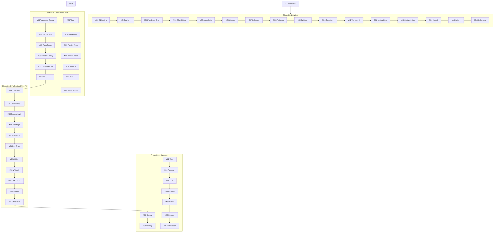

# C2 Curriculum Plan: Ukrainian for English Speakers

**Status:** 📝 PLANNED
**Modules:** 01-100 (100 modules)
**Vocabulary Target:** ~2,500 new words (~25/module)
**Cumulative Target:** ~12,280 words after C2
**Immersion:** 100% Ukrainian (full immersion — English only in vocabulary translations)

> **Note:** C2 represents native-like mastery with focus on stylistic perfection, literary creation, and professional specialization. Expanded from 80 to 100 modules as part of B2/C1/C2 rebalancing.

---

## Quality Standards & Pedagogical Strategy

**Reference:** `docs/l2-uk-en/MODULE-RICHNESS-GUIDELINES-v2.md`
**Philosophy:** `claude_extensions/quick-ref/philosophy.md` (Strict Linguistic Standards)

### Philosophy: Stylistic Perfection & Creative Production
At C2, the learner acts as a creator and expert user of the language.

1.  **Creative Production:** Learners must produce original literary and professional texts. **Model Answers** are mandatory for all such tasks to provide a "gold standard" for comparison.
2.  **Domain-Agnostic Professionalism:** For Phase C2.3, modules must provide **Universal Templates** (e.g., "Structure of an Annual Report") that apply to *any* field (Law, Medicine, IT), rather than teaching specific jargon only.
3.  **Stylistic Precision:** Activities must focus on the *nuance* between synonyms and register shifts (e.g., rewriting a text from "Neutral" to "Ironic").

### Advanced Activity Types (C2 Standard)
C2 modules require creative production and deep analysis. Use these specific types:

| Type | Description | Requirement |
|------|-------------|-------------|
| **[essay-response]** | Publication-ready academic/professional writing | Strict Rubric & Model Answer |
| **[critical-analysis]** | Scholar-level critique of style and substance | Focus on intertextuality & context |
| **[comparative-study]** | Synthesis of multiple complex sources | Required for Research/Lit modules |
| **[authorial-intent]** | Reconstruction of creative decisions | "Reverse-engineering" the text |

> **Note on Activities:** The "Signature Activity Concepts" listed below are **mandatory pedagogical anchors**. The Module Architect must generate additional activities to meet the **minimum target of 16+ activities per module** (C2 standard).

---

## Vocabulary Approach (B1+)

**From B1 onwards, vocabulary is not prescribed in this plan.** Instead, vocabulary emerges naturally from the module's thematic content and is validated against:

- **Richness targets:** 30+ unique words per module (enforced by audit)
- **Integration requirements:** 80% used in activities, 50% in lesson text (enforced by audit)
- **Register appropriateness:** Vocabulary complexity matches C2 proficiency level

The "Content Guidance" sections below provide **thematic direction** and **pop culture anchors** to guide vocabulary selection, but builders have flexibility to choose words that best serve the pedagogical goals.

**Why this approach?**
- Content-driven vocabulary is more authentic and contextual
- Historical/cultural modules require domain-specific terminology
- Pop culture references evolve and need flexibility
- Quality is enforced through metrics, not prescriptive lists

---

## Ukrainian State Standard 2024 Alignment

> **Source:** Українська мова як іноземна: рівні загального володіння та діагностика (2024)
> **Document:** `docs/l2-uk-en/UKRAINIAN-STATE-STANDARD-2024.txt`

The C2 level (Рівень вільного володіння другого ступеня) per the official Ukrainian State Standard 2024 requires:

### Grammar Requirements (Каталог В)

#### Complete Morphological Mastery

**All noun declensions including rare patterns:**

| Pattern | Examples | Notes |
|---------|----------|-------|
| M твердий | вельможа, договір, символ, Харків | Standard |
| M м'який | трофей, гість, ступінь, ковбой | All variants |
| F твердий | далеч, королівна, прем'єра | Including archaic |
| F м'який | мужність, мелодія, оселя | All endings |
| N всі | горище, гусеня, верб'я, рішення | Including collective |
| Складні | бетоновоз, велодоріжка, прем'єр-міністр | Compound nouns |
| Множинні | ворота, дрова, надра, Карпати | Pluralia tantum |
| Спільного роду | бездара, волоцюга, зірвиголова | Common gender |

**All adjective forms:**

| Type | Examples |
|------|----------|
| Standard -ий/-ій | найтяжчий, світовий, священний |
| Zero ending (M) | Михайлів, воротарів, бабин, рад, певен |
| Compound | повнолітній, яскраво-зелений, важкохворий |

**Complete numeral system:**

| Type | Declension requirement |
|------|----------------------|
| Порядкові | Full paradigm: сороковий, сорокова, сорокове |
| Складені порядкові | дві тисячі тринадцятий рік |
| Кількісні | All forms: чотирма, шістдесятьма, шістьмастами |
| Неозначено-кількісні | багатьох, декільком, кількадесятьма |

**Complete pronoun paradigms:**

| Type | Full declension |
|------|-----------------|
| Особові | я/мене/мені/мною, він/його/йому/ним/на ньому |
| Присвійні | мій/мого/моєму/моїм, їхній/їхня/їхнє |
| Вказівні | той/та/те/ті, цей/ця/це/ці, сей/ся/се (archaic) |
| Питально-відносні | хто/що/який/чий/котрий/скільки |
| Неозначені | хтось/хто-будь/будь-хто/казна-хто |
| Заперечні | ніхто/нікого/ні з ким, ніщо/нічого/ні з чим |
| Означальні | весь/всякий/кожний/сам/інший |

#### Full Case Usage (All 7 Cases)

**Називний відмінок:**
- Суб'єкт активної дії, процесу, стану
- Вказівка на особу/предмет: Це мій народ!
- Носій характеристики в складеному присудку
- Об'єкт зацікавлення, порівняння

**Родовий відмінок:**
- Without preposition: належність, ознака, частина від цілого, час/дата, заперечення
- With prepositions: з/від (vihidnij punkt), до (кінцева точка, мета), біля/серед/навпроти (місце), без (відсутність)

**Давальний відмінок:**
- Beneficiary/maleficiary: вручив Богунові, завдає шкоди природі
- Subject of state: Мені не спиться
- Addressee: напишу привітання підписникам
- Age expression: Дідусеві вісімдесят років

**Знахідний відмінок:**
- Without preposition: прямий об'єкт, тривалість
- With prepositions: в/на/за (кінцева точка), через (час, причина, шлях), по (мета), повз (рух)

**Орудний відмінок:**
- Without preposition: характеристика з бути/стати, знаряддя, шлях руху
- With prepositions: з (спільна дія), над/під/перед/за/між (розташування)

**Місцевий відмінок:**
- у/в/на (місце, час): у травні, на дні серця
- по (шлях): розкотилися по долівці
- при (характеристика): курси при закладах освіти

**Кличний відмінок:**
- Адресат-потенційний суб'єкт: Олесю Ігорівно, напишіть!
- Акцентований адресат: Зоре моя! Дунаю, Дунаю!

#### Complete Syntactic Mastery

**Просте речення:**
- Розповідні (стверджувальні/заперечні)
- Питальні (з питальним словом, із запрошенням)
- Спонукальні (розпорядження, прохання, порада, наказ)

**Просте ускладнене речення:**
- Однорідні члени з узагальнювальним словом
- Дієприкметникові/дієприслівникові звороти
- Вставні слова, звертання

**Односкладне речення:**
- Означено-особові: Любимо людей щирих
- Неозначено-особові: Після вечері одразу лягають спати
- Безособові: Нам стало страшно
- Номінативні: Музика. Сцена. Сльози солоні.

**Складне сполучникове речення:**
- Складносурядні: єднальні (і, й, та), протиставні (а, але, проте), приєднувальні (теж, та й), розділові (або, чи)
- Складнопідрядні: обставинні, з'ясувальні, означальні

**Складне безсполучникове речення:**
- Відкритої структури: Потім упали сніги, вдарила люта зима
- Закритої структури: З праці радість, з безділля – смуток

#### Complete Stylistic Mastery

**All 7 styles of Ukrainian:**

| Style | C2 Production requirement |
|-------|---------------------------|
| Розмовний | Natural, native-like informal speech |
| Офіційний | Legal documents, contracts |
| Науковий | Research papers, dissertations |
| Публіцистичний | Journalism, opinion pieces |
| Художній | Creative writing, literary analysis |
| Релігійний | Understanding liturgical language |
| Епістолярний | All correspondence types |

**Stylistic devices (засоби):**
- Фонетичні: милозвучність (у/в, і/й, з/зі/із)
- Лексичні: антоніми, синоніми, омоніми, архаїзми, неологізми, діалектизми, епітети, метафори, уособлення, перифраз, метонімія, синекдоха, гіпербола, евфемізми
- Синтаксичні: звертання, еліпсис, повтор, порівняння, уточнення, риторичні запитання

**Text transformation abilities:**
- Науковий → науково-популярний
- Офіційний → публіцистичний
- Creating secondary texts (реферати, повідомлення, довідково-інформаційні тексти)

### Communicative Competence (Каталог А)

At C2, learners can perform ALL communicative intents:
- Full range of emotional expression (радість, смуток, гнів, страх, байдужість, розчарування)
- Complex argumentation (обґрунтовувати, аргументувати, спростовувати)
- Public speech functions (апелювати, наголошувати, виражати протест)
- All social functions (утішати, вибачати/відмовлятися вибачати, погрожувати)

### Thematic Requirements (Каталог Б) - Expert

All C1 topics at mastery level plus:
- All 21 thematic areas with full depth
- Professional specialization in chosen field
- Literary and creative writing
- Academic research and publication
- Media production and criticism
- Legal and official document creation

### Module Scope Checklist

Before writing/reviewing any C2 module, verify:

| Check | Constraint |
|-------|------------|
| Morphology | Complete mastery all patterns |
| Syntax | All sentence types native-like |
| Stylistics | All 7 styles, all devices |
| Register | Seamless shifting |
| Literary | Creative production ability |
| Academic | Publication-ready writing |
| Vocabulary | ~25 new words per module |
| Immersion | 100% Ukrainian |

---

## Prerequisites from C1

Before starting C2, learners have completed:
- Academic writing at university level
- Professional communication mastery
- Complete rhetorical device control
- Folk culture and arts knowledge
- Ukrainian literature (classics through contemporary)
- Sociolinguistic awareness (dialects, Surzhyk, language policy)
- ~9,000 cumulative vocabulary words

---

## CEFR C2 Can-Do Alignment

### CEFR C2 Descriptor (Council of Europe)
> Can understand with ease virtually everything heard or read. Can summarise information from different spoken and written sources, reconstructing arguments and accounts in a coherent presentation. Can express him/herself spontaneously, very fluently and precisely, differentiating finer shades of meaning even in more complex situations.

### Learning Outcomes
By module 80, learners can:

**Understanding (Listening/Reading)**
- [ ] Understand any kind of spoken language, live or broadcast, delivered at fast native speed
- [ ] Understand complex technical or academic texts even outside field of specialization
- [ ] Appreciate subtle distinctions of style and implicit/explicit meaning
- [ ] Read complex texts for pleasure with ease
- [ ] Understand literary and non-literary texts with appreciation of genre/style distinctions
- [ ] Recognize dialectal features and regional varieties

**Speaking (Production/Interaction)**
- [ ] Convey finer shades of meaning precisely using appropriate emphasis, stress, intonation
- [ ] Produce clear, smoothly flowing, well-structured speech showing mastery of organizational patterns
- [ ] Express self spontaneously and very fluently without obvious searching
- [ ] Use idiomatic expressions and colloquialisms with awareness of connotation
- [ ] Backtrack and restructure around difficulty so smoothly listener is hardly aware
- [ ] Participate effortlessly in any conversation/discussion including abstract, unfamiliar topics

**Writing**
- [ ] Write clear, smoothly-flowing, complex texts in appropriate style
- [ ] Write critical reviews of professional/literary works
- [ ] Write summaries and reviews of demanding professional/literary works
- [ ] Write well-structured texts on complex subjects using rhetorical, stylistic, and organizational conventions
- [ ] Write creative texts with individual style

---

## Overview

The C2 curriculum represents **mastery** — operating at native-speaker level with stylistic precision, creative ability, and professional specialization.

**Core Philosophy:**
1. **Stylistic Perfection:** Complete control of all registers and styles
2. **Literary Creation:** Ability to produce creative texts with individual voice
3. **Professional Excellence:** Publication-ready academic and professional writing
4. **Cultural Integration:** Operating seamlessly in all Ukrainian contexts
5. **Linguistic Sensitivity:** Appreciation of nuance, connotation, and stylistic effect

---

## Phase C2.1: Stylistic Perfection (Modules 01-25)

> **Checkpoints:** M20 (7 Styles) tests M01-19; M25 (Complete Mastery) tests M21-24. See `c2-checkpoint-module-template.md`.

### Learning Goals
- Master all 7 Ukrainian functional styles
- Control stylistic transformation
- Perfect euphonic usage
- Produce publication-ready texts
- Develop individual writing voice

**PEDAGOGICAL REQUIREMENT:**
- **Full Immersion (100%):** Stylistic analysis must be conducted directly in Ukrainian. English only in vocabulary translations.

### Grammar Progression

| Module | Grammar Point | Builds On | Enables |
|--------|--------------|-----------|---------
|
| 01 | C1 Bridge & Assessment | C1 complete | C2 foundation |
| 02 | Milozвучність Complete | C1 phonetics | Perfect euphony |
| 03 | Науковий стиль Mastery | C1 academic | Research publication |
| 04 | Офіційний стиль Mastery | C1 professional | Legal documents |
| 05 | Публіцистичний стиль | C1 media | Journalism |
| 06 | Художній стиль | C1 literature | Creative writing |
| 07 | Розмовний стиль | C1 informal | Native fluency |
| 08 | Релігійний стиль | C1 archaic | Liturgical understanding |
| 09 | Епістолярний стиль | C1 correspondence | All letter types |
| 10 | Style Transformation I | M02-09 | Науковий → популярний |
| 11 | Style Transformation II | M10 | Офіційний → публіцистичний |
| 12 | Lexical Stylistics | M02-11 | Word choice precision |
| 13 | Syntactic Stylistics | M12 | Sentence variety |
| 14 | Individual Voice I | M12-13 | Personal style |
| 15 | Individual Voice II | M14 | Distinctive writing |
| 16 | Text Coherence | M14-15 | Seamless flow |
| 17 | C2.1 Practice I | M01-16 | Style portfolio |
| 18 | C2.1 Practice II | M01-16 | Transformation exercises |
| 19 | C2.1 Review | M01-18 | Consolidation |
| 20 | C2.1 Checkpoint | M01-19 | Assessment |
| 21 | Stylistic Devices Mastery | M12-13 | Metaphor, metonymy, synecdoche |
| 22 | Rhythm & Prosody | M02 | Prose rhythm control |
| 23 | Intertextuality | M06 | Allusion, quotation, parody |
| 24 | Style Blending | M03-09 | Hybrid registers |
| 25 | C2.1 Final Checkpoint | M01-24 | Complete stylistic mastery |

### Module Content Specifications C2.1

---

#### Module 01: C1 Bridge & Assessment
**Grammar:** Comprehensive C1 consolidation and gap identification

**Assessment Areas:**
- All 7 cases with full usage patterns
- Complex sentence mastery
- All register control
- Literary analysis capability
- Sociolinguistic awareness

**Content Guidance:**
Vocabulary will emerge naturally from thematic content and should meet:
- Richness targets: 30+ words per module
- Integration: 80% in activities, 50% in lesson text
- Register and complexity appropriate to C2 level

**Signature Activity Concepts:**
1. Diagnostic writing assessment (all styles)
2. Oral fluency evaluation
3. Gap identification and learning plan

---

#### Module 02: Милозвучність — Complete Euphonic System
**Grammar:** All euphonic alternations in Ukrainian

**Euphonic Patterns:**
- у/в: жив у місті, плавала в озері
- і/й: час і місце, площа й об'єм
- з/зі/із: з оперним співаком, зі своїм другом, вийшов із кімнати
- у-/в- initial: уночі – вночі, увічливий – ввічливий
- -ся/-сь: дивлюся – дивлюсь

**Advanced Euphony:**
- Multiple alternations in one sentence
- Stylistic vs. obligatory alternation
- Regional preferences

**Content Guidance:**
Vocabulary will emerge naturally from thematic content and should meet:
- Richness targets: 30+ words per module
- Integration: 80% in activities, 50% in lesson text
- Register and complexity appropriate to C2 level

**Signature Activity Concepts:**
1. Error correction: Fix euphonic violations
2. Transform: Apply all euphonic rules
3. Quiz: Identify correct variants

---

#### Module 03: Науковий стиль — Publication-Ready
**Grammar:** Advanced academic writing for publication

**Publication Components:**
- Наукова стаття structure (IMRAD)
- Дисертація format
- Рецензія writing
- Конференційна доповідь

**Advanced Academic Features:**
- Цитування standards (ДСТУ)
- Анотація writing
- Ключові слова selection
- Бібліографічний опис

**Content Guidance:**
Vocabulary will emerge naturally from thematic content and should meet:
- Richness targets: 30+ words per module
- Integration: 80% in activities, 50% in lesson text
- Register and complexity appropriate to C2 level

**Signature Activity Concepts:**
1. Write: Abstract for research paper
2. Transform: Thesis → article
3. Review: Peer review exercise

---

#### Module 04: Офіційний стиль — Legal Documents
**Grammar:** Legal and official document creation

**Document Types:**
- Договір (Contract)
- Угода (Agreement)
- Акт (Act/Certificate)
- Доручення (Power of Attorney)
- Скарга (Complaint)
- Позовна заява (Lawsuit filing)

**Legal Language Features:**
- Fixed formulas: Цим засвідчується...
- Impersonal constructions
- Conditional clauses: У разі...
- Reference structures: Згідно з статтею...

**Content Guidance:**
Vocabulary will emerge naturally from thematic content and should meet:
- Richness targets: 30+ words per module
- Integration: 80% in activities, 50% in lesson text
- Register and complexity appropriate to C2 level

**Signature Activity Concepts:**
1. Draft: Simple contract
2. Transform: Informal agreement → legal document
3. Review: Identify legal language features

---

#### Module 05: Публіцистичний стиль — Journalism
**Grammar:** Journalistic writing and media production

**Journalistic Genres:**
- Новина (News report)
- Репортаж (Feature story)
- Інтерв'ю (Interview)
- Аналітична стаття (Analysis)
- Колонка (Opinion column)
- Есей (Essay)

**Journalistic Techniques:**
- Перевернута піраміда (Inverted pyramid)
- Лід (Lead)
- Цитування (Quoting)
- Факт-чекінг (Fact-checking)

**Content Guidance:**
Vocabulary will emerge naturally from thematic content and should meet:
- Richness targets: 30+ words per module
- Integration: 80% in activities, 50% in lesson text
- Register and complexity appropriate to C2 level

**Signature Activity Concepts:**
1. Write: News report on current event
2. Transform: Press release → news article
3. Analysis: Compare coverage of same event

---

#### Module 06: Художній стиль — Creative Writing
**Grammar:** Literary creation and stylistic techniques

**Literary Forms:**
- Оповідання (Short story)
- Есей (Literary essay)
- Поезія (Poetry)
- Драматичний діалог (Dramatic dialogue)

**Literary Techniques:**
- Narrative voice (оповідач)
- Point of view (точка зору)
- Character development (характеротворення)
- Setting and atmosphere (хронотоп)

**Content Guidance:**
Vocabulary will emerge naturally from thematic content and should meet:
- Richness targets: 30+ words per module
- Integration: 80% in activities, 50% in lesson text
- Register and complexity appropriate to C2 level

**Signature Activity Concepts:**
1. Write: Flash fiction (500 words)
2. Analyze: Narrative techniques in excerpt
3. Transform: Third person → first person

---

#### Module 07: Розмовний стиль — Native Fluency
**Grammar:** Colloquial Ukrainian at native level

**Colloquial Features:**
- Скорочення: їстиму → їстиму
- Частки: ж, бо, от, ну
- Вигуки: ой, ага, угу, еге ж
- Неповні речення

**Native-like Patterns:**
- Natural hesitation and filler words
- Discourse markers: от, тобто, типу
- Intensifiers: аж, так, такий
- Pragmatic particles

**Content Guidance:**
Vocabulary will emerge naturally from thematic content and should meet:
- Richness targets: 30+ words per module
- Integration: 80% in activities, 50% in lesson text
- Register and complexity appropriate to C2 level

**Signature Activity Concepts:**
1. Dialogue: Natural conversation simulation
2. Transform: Formal → colloquial
3. Listening: Identify regional/social variants

---

#### Module 08: Релігійний стиль — Liturgical Language
**Grammar:** Understanding religious and liturgical texts

**Religious Text Types:**
- Біблія (excerpts)
- Молитви
- Проповіді
- Акафісти

**Church Slavonic Influences:**
- Vocabulary: благо, глас, воістину
- Phonetics: врата, глава
- Syntax: archaic constructions

**Content Guidance:**
Vocabulary will emerge naturally from thematic content and should meet:
- Richness targets: 30+ words per module
- Integration: 80% in activities, 50% in lesson text
- Register and complexity appropriate to C2 level

**Signature Activity Concepts:**
1. Reading: Biblical excerpt with analysis
2. Vocabulary: Church Slavonic → modern equivalents
3. Discussion: Religion in Ukrainian culture

---

#### Module 09: Епістолярний стиль — Complete Correspondence
**Grammar:** All types of written correspondence

**Letter Types:**
- Офіційні листи (Official letters)
- Ділові листи (Business letters)
- Приватні листи (Personal letters)
- Електронні листи (Emails)
- СМС/месенджери (Short messages)

**Epistolary Conventions:**
- Звертання variations
- Завершальні формули
- Tone management
- Format conventions

**Content Guidance:**
Vocabulary will emerge naturally from thematic content and should meet:
- Richness targets: 30+ words per module
- Integration: 80% in activities, 50% in lesson text
- Register and complexity appropriate to C2 level

**Signature Activity Concepts:**
1. Write: Formal complaint letter
2. Transform: Email chain → formal letter
3. Compare: Same message in different formats

---

#### Module 10: Style Transformation I — Academic to Popular
**Grammar:** Transforming научный → науково-популярний

**Transformation Strategies:**
- Simplifying terminology
- Adding examples and analogies
- Changing sentence structure
- Adjusting register

**Target Audiences:**
- General public
- Students
- Specialists in other fields
- Children

**Content Guidance:**
Vocabulary will emerge naturally from thematic content and should meet:
- Richness targets: 30+ words per module
- Integration: 80% in activities, 50% in lesson text
- Register and complexity appropriate to C2 level

**Signature Activity Concepts:**
1. Transform: Research abstract → blog post
2. Analyze: Compare scientific and popular versions
3. Write: Explain complex concept simply

---

#### Module 11: Style Transformation II — Official to Journalistic
**Grammar:** Transforming офіційний → публіцистичний

**Transformation Strategies:**
- Adding human interest
- Emotional appeal
- Narrative elements
- Visual language

**Source Documents:**
- Прес-релізи
- Офіційні заяви
- Статистичні звіти
- Законодавчі акти

**Content Guidance:**
Vocabulary will emerge naturally from thematic content and should meet:
- Richness targets: 30+ words per module
- Integration: 80% in activities, 50% in lesson text
- Register and complexity appropriate to C2 level

**Signature Activity Concepts:**
1. Transform: Press release → news story
2. Transform: Statistical report → feature article
3. Analyze: How officials vs. journalists frame issues

---

#### Module 12: Lexical Stylistics
**Grammar:** Precision in word choice

**Lexical Tools:**
- Синоніми: точність вибору
- Антоніми: контраст
- Омоніми: гра слів
- Пароніми: уникнення помилок

**Stylistic Markers:**
- Архаїзми для ефекту
- Неологізми для свіжості
- Діалектизми для колориту
- Жаргонізми для автентичності

**Content Guidance:**
Vocabulary will emerge naturally from thematic content and should meet:
- Richness targets: 30+ words per module
- Integration: 80% in activities, 50% in lesson text
- Register and complexity appropriate to C2 level

**Signature Activity Concepts:**
1. Exercise: Choose most appropriate synonym
2. Transform: Replace neutral with marked vocabulary
3. Analysis: Effect of word choice in text

---

#### Module 13: Syntactic Stylistics
**Grammar:** Sentence variety for effect

**Syntactic Variation:**
- Прості vs. складні речення
- Коротке vs. довге
- Інверсія для наголосу
- Паралелізм для ритму

**Special Constructions:**
- Еліпсис: Я люблю яблука, а Максим – груші
- Повтор: Куди-куди, а в Чернівці обов'язково
- Риторичні запитання
- Градація

**Content Guidance:**
Vocabulary will emerge naturally from thematic content and should meet:
- Richness targets: 30+ words per module
- Integration: 80% in activities, 50% in lesson text
- Register and complexity appropriate to C2 level

**Signature Activity Concepts:**
1. Transform: Simple sentences → complex
2. Create: Paragraph with syntactic variety
3. Analyze: Sentence patterns in literary text

---

#### Module 14: Individual Voice I — Developing Personal Style
**Grammar:** Finding and developing distinctive writing voice

**Voice Elements:**
- Тон (playful, serious, ironic)
- Ритм (sentence length patterns)
- Лексика (word preferences)
- Синтаксис (structural habits)

**Self-Analysis:**
- Identifying tendencies
- Strengths and weaknesses
- Developing signature elements

**Content Guidance:**
Vocabulary will emerge naturally from thematic content and should meet:
- Richness targets: 30+ words per module
- Integration: 80% in activities, 50% in lesson text
- Register and complexity appropriate to C2 level

**Signature Activity Concepts:**
1. Analysis: Identify your voice in previous writing
2. Experiment: Write same topic in different voices
3. Compare: Your voice vs. favorite author

---

#### Module 15: Individual Voice II — Refining Distinctive Style
**Grammar:** Perfecting personal writing style

**Refinement Strategies:**
- Conscious vs. unconscious choices
- Breaking rules purposefully
- Signature techniques
- Balancing consistency and variety

**Advanced Techniques:**
- Lexical fingerprint
- Rhythmic signature
- Thematic obsessions
- Stylistic tics (good and bad)

**Content Guidance:**
Vocabulary will emerge naturally from thematic content and should meet:
- Richness targets: 30+ words per module
- Integration: 80% in activities, 50% in lesson text
- Register and complexity appropriate to C2 level

**Signature Activity Concepts:**
1. Edit: Refine previous writing for voice
2. Create: Piece showcasing individual style
3. Peer review: Voice consistency check

---

#### Module 16: Text Coherence — Seamless Flow
**Grammar:** Creating perfectly flowing texts

**Coherence Tools:**
- Тематична прогресія
- Зв'язність (cohesion)
- Референція (reference chains)
- Конектори (connectors)

**Advanced Flow:**
- Given-new information
- Paragraph transitions
- Section bridges
- Narrative momentum

**Content Guidance:**
Vocabulary will emerge naturally from thematic content and should meet:
- Richness targets: 30+ words per module
- Integration: 80% in activities, 50% in lesson text
- Register and complexity appropriate to C2 level

**Signature Activity Concepts:**
1. Analyze: Coherence devices in professional text
2. Edit: Improve flow in weak text
3. Write: Seamlessly flowing essay

---

#### Module 17: C2.1 Practice I — Style Portfolio
**Grammar:** Creating diverse style portfolio

**Portfolio Contents:**
1. Academic article excerpt
2. Official letter
3. Journalistic piece
4. Creative writing sample
5. Colloquial dialogue
6. Personal letter

**Assessment Criteria:**
- Style appropriateness
- Technical accuracy
- Individual voice
- Overall quality

**Vocabulary (15 words - review):**
портфоліо, збірка, колекція, зразок, приклад, демонстрація, презентація, різноманітність, діапазон, майстерність, компетентність, здатність, вміння, досвід, досягнення

**Signature Activity Concepts:**
1. Compile: Personal style portfolio
2. Self-assessment: Evaluate each piece
3. Revision: Improve weakest sample

---

#### Module 18: C2.1 Practice II — Transformation Exercises
**Grammar:** Complex style transformation practice

**Transformation Tasks:**
1. Legal document → news story → blog post
2. Research paper → popular article → social media
3. Formal speech → casual explanation → joke

**Multi-step Transformation:**
- Maintaining core content
- Adjusting for audience
- Preserving accuracy

**Vocabulary (15 words - review):**
трансформація, перетворення, адаптація, версія, варіант, формат, канал, платформа, авдиторія, мета, контекст, регістр, тон, стиль, ефект

**Signature Activity Concepts:**
1. Transform: Single content → 3+ formats
2. Compare: Transformations with peer
3. Evaluate: Information preservation

---

#### Module 19: C2.1 Review
**Grammar:** Consolidation of stylistic mastery

**Review Areas:**
- All 7 functional styles
- Style transformation
- Euphonic system
- Individual voice development
- Text coherence

**Vocabulary (10 words - review):**
повторення, узагальнення, консолідація, закріплення, систематизація, оцінювання, рефлексія, прогрес, досягнення, перспектива

**Signature Activity Concepts:**
1. Comprehensive style quiz
2. Self-assessment reflection
3. Goal setting for C2.2

---

#### Module 20: C2.1 Checkpoint
**Covers:** M01-19

**Required Skill Groups:**
1. Style System (M01-09) - all 7 functional styles including religious & epistolary
2. Style Transformation (M10-11) - academic→popular, official→journalistic
3. Stylistic Analysis (M12-13) - lexical & syntactic stylistics
4. Individual Voice (M14-15) - personal style development
5. Text Coherence (M16) - seamless flow techniques
6. Integration Practice (M17-19) - portfolio, transformation exercises

**Vocabulary (10 words - assessment):**
оцінювання, тестування, екзамен, контроль, перевірка, бал, результат, критерій, стандарт, рівень

**Signature Activity Concepts:**
1. Written exam: Style analysis and transformation
2. Creative writing: Assigned style
3. Oral exam: Register shifting

---

#### Module 21: Stylistic Devices Mastery
**Grammar:** Advanced figurative language and rhetorical devices

**Stylistic Devices:**
- Метафора (metaphor): extended and dead metaphors
- Метонімія (metonymy): part-whole relationships
- Синекдоха (synecdoche): species-genus substitution
- Персоніфікація (personification): attribution of human qualities
- Алегорія (allegory): symbolic narrative

**Content Guidance:**
Vocabulary will emerge naturally from thematic content and should meet:
- Richness targets: 30+ words per module
- Integration: 80% in activities, 50% in lesson text
- Register and complexity appropriate to C2 level

**Signature Activity Concepts:**
1. Analysis: Identify devices in literary texts
2. Production: Create original examples
3. Transformation: Literal → figurative

---

#### Module 22: Rhythm & Prosody in Prose
**Grammar:** Controlling rhythm and sound patterns in prose writing

**Prosodic Elements:**
- Ритм прози (prose rhythm): sentence length variation
- Інтонаційні періоди (intonational periods): rise and fall
- Звукопис (sound painting): alliteration, assonance
- Евфонія (euphony): pleasant sound combinations
- Какофонія (cacophony): deliberate harshness

**Content Guidance:**
Vocabulary will emerge naturally from thematic content and should meet:
- Richness targets: 30+ words per module
- Integration: 80% in activities, 50% in lesson text
- Register and complexity appropriate to C2 level

**Signature Activity Concepts:**
1. Analysis: Identify rhythm patterns
2. Rewrite: Adjust rhythm for effect
3. Create: Euphonic vs. cacophonic passages

---

#### Module 23: Intertextuality
**Grammar:** Allusion, quotation, and intertextual references

**Intertextual Techniques:**
- Алюзія (allusion): indirect reference
- Цитата (quotation): direct quotation
- Ремінісценція (reminiscence): echo of another text
- Пародія (parody): humorous imitation
- Стилізація (stylization): imitation of style

**Content Guidance:**
Vocabulary will emerge naturally from thematic content and should meet:
- Richness targets: 30+ words per module
- Integration: 80% in activities, 50% in lesson text
- Register and complexity appropriate to C2 level

**Signature Activity Concepts:**
1. Identify: Trace allusions in texts
2. Create: Write with deliberate intertextuality
3. Analysis: Discuss intertextual layers

---

#### Module 24: Style Blending & Hybrid Registers
**Grammar:** Creating hybrid styles for specific effects

**Hybrid Techniques:**
- Науково-популярний (popular science): academic + accessible
- Офіційно-діловий з елементами публіцистики (official + journalistic)
- Художньо-публіцистичний (literary journalism)
- Розмовно-художній (colloquial literary)
- Епістолярно-есеїстичний (epistolary essay)

**Content Guidance:**
Vocabulary will emerge naturally from thematic content and should meet:
- Richness targets: 30+ words per module
- Integration: 80% in activities, 50% in lesson text
- Register and complexity appropriate to C2 level

**Signature Activity Concepts:**
1. Analysis: Identify style mixing in texts
2. Create: Write in hybrid register
3. Evaluate: Assess appropriateness of blending

---

#### Module 25: C2.1 Final Checkpoint
**Covers:** M01-24 (Complete C2.1 Stylistic Perfection)

**Required Skill Groups:**
1. All 7 Functional Styles (M03-09) - complete mastery
2. Style Transformation (M10-11) - fluent register shifting
3. Stylistic Analysis (M12-13) - lexical & syntactic
4. Individual Voice (M14-15) - distinctive personal style
5. Advanced Devices (M21-24) - figurative language, rhythm, intertextuality, blending

**Comprehensive Assessment:**
- Written Portfolio: 7 texts in 7 different styles
- Style Transformation: Transform single text across 3 registers
- Creative Writing: Original text with deliberate stylistic choices
- Oral Defense: Explain stylistic decisions

**Vocabulary (15 words - assessment):**
майстерність, досконалість, вправність, володіння, компетентність, експертиза, професіоналізм, віртуозність, довершеність, бездоганність, витонченість, елегантність, точність, влучність, переконливість

**Signature Activity Concepts:**
1. Written exam: Comprehensive style analysis (90 min)
2. Creative portfolio: 7 styles demonstrated
3. Oral exam: Style transformation on demand
4. Self-assessment: C2.1 mastery checklist

---

## Phase C2.2: Literary Mastery (Modules 26-45)

> **Checkpoint:** M45 tests M26-44 skill groups. See `c2-checkpoint-module-template.md`.

### Learning Goals
- Master literary analysis at scholar level
- Produce original creative writing
- Understand translation theory
- Engage with literary criticism
- Write publishable literary essays

**PEDAGOGICAL REQUIREMENT:**
- **Full Immersion (100%):** Literary analysis must use Ukrainian critical terminology. English only in vocabulary translations.

### Grammar Progression

| Module | Grammar Point | Builds On | Enables |
|--------|--------------|-----------|---------|
| 26 | Literary Theory | C1 literature | Scholar-level analysis |
| 27 | Narratology | M21 | Narrative analysis |
| 28 | Поетика: Verse Analysis | M26-22 | Poetry mastery |
| 29 | Поетика: Prose Analysis | M26-22 | Prose mastery |
| 30 | Intertextuality | M23-24 | Literary connections |
| 31 | Literary Criticism Methods | M26-25 | Critical approaches |
| 32 | Writing Literary Essays | M26 | Publication-ready criticism |
| 33 | Translation Theory | C1 | Understanding translation |
| 34 | Literary Translation I | M28 | Poetry translation |
| 35 | Literary Translation II | M28-29 | Prose translation |
| 36 | Creative Writing: Poetry | M23, M28-30 | Original poetry |
| 37 | Creative Writing: Prose | M24, M28-30 | Original prose |
| 38 | Contemporary Literature | C1.6 | Current literary scene |
| 39 | Digital Literature | M33 | New forms |
| 40 | Literary Prizes & Canon | M33-34 | Cultural context |
| 41 | Literary Community | M35 | Professional engagement |
| 42 | C2.2 Practice I | M26-36 | Literary portfolio |
| 43 | C2.2 Practice II | M26-36 | Creative portfolio |
| 44 | C2.2 Review | M26-43 | Consolidation |
| 45 | C2.2 Checkpoint | M26-44 | Assessment |

### Vocabulary Plan C2.2 (~500 words)
- Literary theory: наратологія, фокалізація, інтертекстуальність, деконструкція
- Poetry terms: верлібр, катрен, терцина, сонет, балада
- Prose terms: новела, повість, роман, оповідання, нарис
- Translation: переклад, перекладознавство, еквівалентність, адаптація
- Creative writing: задум, натхнення, чернетка, редагування

---

## Phase C2.3: Professional Specialization (Modules 46-75)

> **Checkpoints:** M55 (Midpoint) tests M46-54; M75 (Complete) tests M55-74. See `c2-checkpoint-module-template.md`.

> **Ukrainian State Standard 2024 Compliance:** The standard requires C2 learners to handle "лекції і презентації на загальні чи професійні теми" (lectures and presentations on general or professional topics), "неадаптовані тексти зі сфери особистих і професійних зацікавлень" (unadapted texts from personal and professional interests), and produce "реферат, доповідь, повідомлення на теми зі сфери професійних чи особистих зацікавлень" (abstracts, reports, messages on professional topics). The standard does NOT prescribe specific professional domains — learners must be able to handle ANY professional field.

### Learning Goals
- Develop meta-skills for acquiring ANY professional domain vocabulary
- Master strategies for reading and understanding specialized texts
- Learn to produce professional documents across domains
- Build framework for self-directed professional language learning
- Prepare foundation for optional specialization tracks (added separately)

**PEDAGOGICAL REQUIREMENT:**
- **Full Immersion (100%):** Professional scenarios must be fully immersive. English only in vocabulary translations.

### Rationale

Rather than prescribing specific tracks (Legal, Medical, IT, etc.), C2.3 teaches **transferable professional language skills** that apply to any domain:

1. **Terminology acquisition strategies** — How to systematically learn field-specific vocabulary
2. **Professional text comprehension** — Reading patterns for technical/specialized texts
3. **Professional document production** — Templates and patterns for reports, presentations, correspondence
4. **Professional discourse navigation** — Participating in professional discussions, conferences, meetings
5. **Self-directed learning** — Building personalized glossaries, finding resources, continuous improvement

This approach:
- Complies with the State Standard (ability to handle any professional domain)
- Avoids forcing learners into predetermined tracks
- Prepares learners to add specializations later (via optional extension tracks)
- Scales to unlimited professional domains

### Grammar Progression

| Module | Grammar Point | Builds On | Enables |
|--------|--------------|-----------|---------|
| 46 | Professional Language Overview | C2.1-2 | Understanding specialization |
| 47 | Terminology Acquisition I | M46 | Learning new terms systematically |
| 48 | Terminology Acquisition II | M47 | Building personal glossaries |
| 49 | Reading Professional Texts I | M48 | Comprehending specialized texts |
| 50 | Reading Professional Texts II | M49 | Critical analysis of professional content |
| 51 | Professional Document Types | M50 | Understanding document conventions |
| 52 | Writing Professional Documents I | M51 | Reports, abstracts, summaries |
| 53 | Writing Professional Documents II | M52 | Proposals, presentations |
| 54 | Professional Oral Communication | M53 | Presentations, meetings, conferences |
| 55 | C2.3 Midpoint Checkpoint | M46-54 | Skills assessment |
| 56 | Professional Correspondence | M55 | Emails, letters, formal requests |
| 57 | Professional Discussions | M56 | Debates, negotiations, consultations |
| 58 | Cross-Domain Communication | M57 | Explaining to non-specialists |
| 59 | Professional Research Skills | M58 | Finding and evaluating sources |
| 60 | Building Domain Expertise | M59 | Self-directed specialization |
| 61 | Legal Ukrainian I | M60 | Legal terminology basics |
| 62 | Legal Ukrainian II | M61 | Contracts and agreements |
| 63 | Legal Ukrainian III | M62 | Court procedures |
| 64 | Legal Ukrainian IV | M63 | Legal writing |
| 65 | Legal Ukrainian V | M64 | Case analysis |
| 66 | Medical Ukrainian I | M60 | Medical terminology basics |
| 67 | Medical Ukrainian II | M66 | Patient communication |
| 68 | Medical Ukrainian III | M67 | Medical documentation |
| 69 | Medical Ukrainian IV | M68 | Clinical scenarios |
| 70 | Medical Ukrainian V | M69 | Medical research |
| 71 | Professional Portfolio I | M65, M70 | Demonstrating competence |
| 72 | Professional Portfolio II | M71 | Multi-format evidence |
| 73 | Professional Identity | M72 | Personal brand in Ukrainian |
| 74 | C2.3 Review | M46-73 | Consolidation |
| 75 | C2.3 Checkpoint | M46-74 | Assessment |

### Module Content Highlights

#### Module 47: Terminology Acquisition I
**Skills:**
- Identifying word formation patterns (prefixes, suffixes, roots)
- Using context to infer meaning
- Dictionary and resource strategies
- Cognates and borrowings recognition

**Practice Domain:** General science/technology (accessible to all learners)

#### Module 49: Reading Professional Texts I
**Skills:**
- Skimming for structure
- Scanning for specific information
- Dealing with unknown vocabulary
- Recognizing genre conventions

**Text Types:** Research abstracts, technical manuals, professional articles

#### Module 52: Writing Professional Documents I
**Document Types:**
- Реферат (Abstract/Summary)
- Доповідь (Report)
- Повідомлення (Message/Memo)
- Звіт (Formal report)

**Focus:** Structure, register, conventions that apply across domains

#### Module 54: Professional Oral Communication
**Skills:**
- Delivering presentations (PowerPoint culture in Ukrainian)
- Participating in meetings (turn-taking, interrupting politely)
- Conference participation (asking questions, networking)
- Professional phone calls

### Vocabulary Plan C2.3 (~500 words)

**Meta-vocabulary for professional contexts:**
- термін, терміносистема, дефініція, поняття, концепція
- галузь, сфера, спеціалізація, фах, експертиза
- доповідь, звіт, реферат, анотація, рецензія
- конференція, семінар, презентація, виступ, доповідач
- спеціаліст, експерт, фахівець, консультант, дослідник
- дослідження, аналіз, методологія, результати, висновки
- впровадження, застосування, практика, теорія, модель

**Professional communication vocabulary:**
- ділова кореспонденція, офіційний запит, пропозиція
- переговори, угода, домовленість, умови, компроміс
- рекомендація, характеристика, резюме, портфоліо

### Future Specialization Tracks

After completing core C2, learners may optionally pursue **extension tracks** (to be developed separately):

| Track | Focus | Status |
|-------|-------|--------|
| Правничий | Legal terminology, court procedures, contracts | 📝 Planned |
| Медичний | Medical terminology, patient communication | 📝 Planned |
| Технічний/IT | Technical writing, software documentation | 📝 Planned |
| Бізнес/Економіка | Business Ukrainian, corporate communication | 📝 Planned |
| Освітній | Academic Ukrainian, teaching methodology | 📝 Planned |
| Дипломатичний | Diplomatic protocol, international relations | 📝 Planned |
| Журналістський | Media production, investigative journalism | 📝 Planned |
| ... | Additional tracks based on demand | — |

These tracks will be separate documents (e.g., `C2-TRACK-LEGAL.md`) with ~20-30 modules each, building on the foundation from C2.3

---

## Phase C2.4: Meta-Skills & Capstone (Modules 76-100)

> **Checkpoint:** M100 (Final Certification) tests M76-99 + all C2 skills. See `c2-checkpoint-module-template.md`.

### Learning Goals
- Demonstrate complete mastery
- Complete capstone project
- Prepare for professional use
- Achieve certification
- Plan continued growth

**PEDAGOGICAL REQUIREMENT:**
- **Full Immersion (100%):** Capstone projects must be researched, written, and defended entirely in Ukrainian. English only in vocabulary translations.

### Grammar Progression

| Module | Grammar Point | Builds On | Enables |
|--------|--------------|-----------|---------
|
| 76 | Complete Grammar Review | All previous | Full mastery verification |
| 77 | Rare/Archaic Forms | M76 | Historical text access |
| 78 | Regional Varieties | M77 | Full dialectal awareness |
| 79 | Sociolinguistic Mastery | M78 | Complete social navigation |
| 80 | Error Analysis | M76-79 | Self-correction |
| 81 | Native-Like Fluency | M80 | Natural production |
| 82 | Teaching Ukrainian I | M81 | Pedagogical awareness |
| 83 | Teaching Ukrainian II | M82 | Lesson planning |
| 84 | Teaching Ukrainian III | M83 | Materials development |
| 85 | Translation Theory | C2.2 | Understanding translation |
| 86 | Translation Practice I | M85 | Literary translation |
| 87 | Translation Practice II | M86 | Technical translation |
| 88 | Interpretation Basics | M85-87 | Oral translation |
| 89 | Capstone: Topic Selection | All | Project start |
| 90 | Capstone: Research | M89 | Data gathering |
| 91 | Capstone: Drafting | M90 | Initial writing |
| 92 | Capstone: Revision | M91 | Improvement |
| 93 | Capstone: Polish | M92 | Final version |
| 94 | Capstone: Defense | M93 | Oral presentation |
| 95 | Final Review I | All | Grammar consolidation |
| 96 | Final Review II | All | Vocabulary consolidation |
| 97 | Final Review III | All | Skills consolidation |
| 98 | Final Exam: Integrated Skills | All | Comprehensive test |
| 99 | C2 Certification Preparation | All | Exam readiness |
| 100 | C2 РІВЕНЬ ЗАВЕРШЕНО | All | Certification |

### Capstone Project Requirements

**Project Types:**
1. Research paper (10,000+ words)
2. Literary work (poetry collection or prose)
3. Translation project (50+ pages)
4. Professional portfolio

**Assessment:**
- Written quality
- Oral defense
- Originality
- Practical value

### Vocabulary Plan C2.4 (~500 words)
- Academic terminology for capstone
- Rare/archaic vocabulary
- Regional varieties vocabulary
- Professional context vocabulary

---

## Content Summary

### Phase Distribution

| Phase | Modules | Count | Type |
|-------|---------|-------|------|
| C2.1 | 01-25 | 25 | Stylistic Perfection |
| C2.2 | 26-45 | 20 | Literary Mastery |
| C2.3 | 46-75 | 30 | Professional Specialization |
| C2.4 | 76-100 | 25 | Meta-Skills & Capstone |
| **TOTAL** | **01-100** | **100** | |

### Vocabulary Summary

| Phase | Target Words | Cumulative |
|-------|--------------|------------|
| C2.1 | ~625 | 625 |
| C2.2 | ~500 | 1,125 |
| C2.3 | ~750 | 1,875 |
| C2.4 | ~625 | 2,500 |
| **Total C2** | **~2,500** | **~12,280 cumulative** |

---

## Cross-Module Dependencies

## Cross-Module Dependencies

---

## Activity Types by Phase

### C2.1 Stylistic
1. Transform: Style transformation exercises
2. Transform: Register shifting practice
3. Production: Original writing (Model Answer required)
4. Error-correction: Euphonic correction
5. Production: Voice development exercises

### C2.2 Literary
1. Production: Literary analysis essays
2. Production: Creative writing workshops
3. Transform: Translation exercises
4. Production: Poetry/prose creation
5. Quiz: Critical review analysis

### C2.3 Professional Preparation
1. Match-up: Terminology acquisition strategies
2. Fill-in: Professional document patterns
3. Dialogue: Cross-domain communication
4. Quiz: Professional text comprehension
5. Production: Portfolio development

### C2.4 Capstone
1. Production: Research methodology application
2. Production: Long-form writing
3. Error-correction: Revision and editing
4. Dialogue: Oral presentation defense
5. Quiz: Final examinations

---

## Quality Checklist

Before generating any C2 module:

- [ ] Content assumes C1 complete mastery
- [ ] Vocabulary is specialized/advanced (~25 words/module)
- [ ] All 7 styles can be used and transformed
- [ ] Literary analysis at scholar level
- [ ] Professional specialization appropriate
- [ ] Activities require production, not just comprehension
- [ ] Immersion level is 100% Ukrainian
- [ ] Prepares for real-world professional use

---

## Implementation Status

| Phase | Modules | Status |
|-------|---------|--------|
| C2.1 | 01-25 | 📝 Stylistic Perfection |
| C2.2 | 26-45 | 📝 Literary Mastery |
| C2.3 | 46-75 | 📝 Professional Specialization |
| C2.4 | 76-100 | 📝 Meta-Skills & Capstone |

---

## Notes

1. **100 modules** provides comprehensive C2 coverage aligned with CEFR and Ukrainian State Standard 2024.

2. **Level-relative numbering** (01-100) consistent with other levels.

3. **Professional specialization** (C2.3) includes Legal and Medical tracks.

4. **Meta-skills** (C2.4) includes Teaching Ukrainian and Translation/Interpretation.

5. **Capstone project** (modules 89-94) is a major undertaking demonstrating mastery.

6. **Literary mastery** (C2.2) includes both analysis and creation.

7. **100% immersion** — native-like experience throughout.

8. **Vocabulary target** of ~12,280 cumulative words matches educated native speakers' active vocabulary.

---

## Related Documents

- A1-CURRICULUM-PLAN.md (complete)
- A2-CURRICULUM-PLAN.md (complete)
- B1-CURRICULUM-PLAN.md (complete)
- B2-CURRICULUM-PLAN.md (complete)
- C1-CURRICULUM-PLAN.md (complete)

---

## Changelog

- **2025-12-23:** Rebalanced: expanded to 100 modules (added Legal/Medical tracks, Teaching, Translation modules)
- **2025-12-05:** Updated C2.3 to "Preparation for Specialization" — teaches meta-skills for any professional domain
- **2025-12-05:** Initial creation with full State Standard alignment
