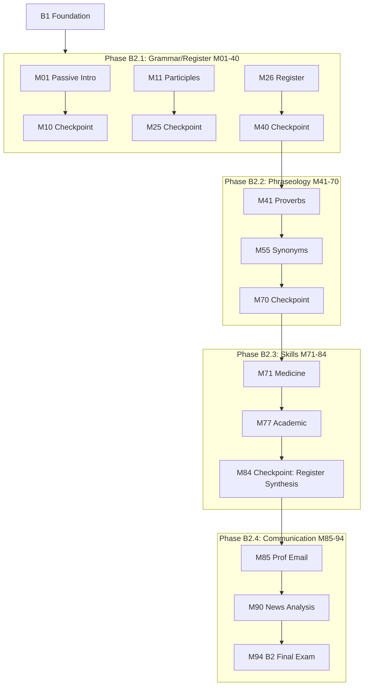

# B2 Curriculum Plan: Ukrainian for English Speakers

**Status:** 🔄 REORGANIZED (RFC #409, January 2026)
**Modules:** 01-94 (94 modules)
**Vocabulary Target:** ~2,256 new words (~24/module)
**Cumulative Target:** ~5,556 words after B2
**Immersion:** 100% Ukrainian (full immersion — English only in vocabulary translations)

> **RFC #409 Changes (January 2026):**
> - History modules (formerly M71-131) → relocated to **HIST** optional track (61 modules)
> - Skills modules (formerly M132-145) → renumbered to M71-84
> - New communication skills modules → M85-94 (10 new modules)
> - See `HIST-CURRICULUM-PLAN.md` for history track details

---

## Вступ (Introduction)

**Від вивчення до володіння!**

B2 — це рівень справжньої мовної свободи. Ви більше не «вивчаєте» українську — ви нею **живете**. На цьому рівні ви опануєте пасивний стан, стилістичні регістри та професійну комунікацію.

### Що ви вивчите

- **Пасивний стан (Passive voice)** — усі форми пасиву в українській мові
- **Дієприкметники (Participles)** — активні та пасивні, минулий і теперішній час
- **Регістри мовлення (Registers)** — офіційний, діловий, академічний, медичний, юридичний
- **Стилістика (Stylistics)** — багатоскладові речення, вставні конструкції, інверсія
- **Професійна комунікація** — електронні листи, звіти, презентації

### Філософія навчання

На рівні B2 ви працюєте повністю українською мовою. Англійська залишається лише для перекладів у словникових таблицях.

**Занурення:** 100% українською

### Попередні вимоги

Завершення рівня B1:
- Вільне володіння видами дієслова
- Правильне використання дієслів руху
- Побудова складних речень
- Словниковий запас ~3,500 слів

### На кінець модуля 94

Ви зможете:
- Розпізнавати та вживати всі форми пасивного стану
- Перемикатися між різними регістрами мовлення
- Писати професійні електронні листи та звіти
- Аналізувати новини та медіаконтент критично
- Проводити презентації українською мовою
- Вести професійні дискусії та дебати

### Додаткові треки (Optional Tracks)

- **HIST:** 61 модуль з історії України (окремий трек)
- **B2-PRO:** 40 модулів професійної української (окремий трек)

---

## Changelog

**RFC #409 Reorganization (January 2026):**

1. **History Track Relocation:** B2 M71-131 (61 history modules) → relocated to **HIST** optional track
   - See `HIST-CURRICULUM-PLAN.md` for complete history track details
   - History is now optional content, not required for B2 completion
2. **Skills Renumbering:** Former M132-145 (14 skills modules) → renumbered to M71-84
3. **New Communication Skills (M85-94):** 10 new practical modules added:
   - M85-86: Professional Email
   - M87-88: Professional Reports
   - M89-90: News Analysis
   - M91-92: Presentation Skills
   - M93: Discussion & Debate
   - M94: B2 Skills Checkpoint
4. **Module Count:** 145 → 94 core modules (61 history moved to track, 10 new skills added)

**Previous Changelog (2025-12-29):**
- Gemini Expansion integrated
- Counter-Proposal modules integrated

---

## Vocabulary Approach (B1+)

**From B1 onwards, vocabulary is not prescribed in this plan.** Instead, vocabulary emerges naturally from the module's thematic content and is validated against:

- **Richness targets:** 30+ unique words per module (enforced by audit)
- **Integration requirements:** 80% used in activities, 50% in lesson text (enforced by audit)
- **Register appropriateness:** Vocabulary complexity matches B2 proficiency level

The "Content Guidance" sections below provide **thematic direction** and **pop culture anchors** to guide vocabulary selection, but builders have flexibility to choose words that best serve the pedagogical goals.

**Why this approach?**
- Content-driven vocabulary is more authentic and contextual
- Historical/cultural modules require domain-specific terminology
- Pop culture references evolve and need flexibility
- Quality is enforced through metrics, not prescriptive lists

---

### Full Immersion Strategy (B2 Specific)

**Target Immersion:** 100% Ukrainian

B2 modules use **FULL immersion** — all body text is in Ukrainian:
- **Ukrainian (100%):** All examples, dialogues, narratives, cultural content, activities, explanations, tips, grammar theory, metalinguistic concepts
- **English (vocabulary table only):** The "Переклад" column in vocabulary tables — nothing else

**No Language Link boxes at B2.** All explanations, including passive voice, participles, and register theory, are written entirely in Ukrainian. Students learned all grammar terminology by B1.

**Why full immersion at B2?** At B2, learners have internalized aspect, all cases, and Ukrainian grammar terminology. They can understand complex grammar explanations in Ukrainian. English scaffolding would be a step backwards.

**Audit threshold:** Immersion must stay ≥98% for lesson content.

---

## Quality Standards & Pedagogical Strategy

**Reference:** `docs/l2-uk-en/MODULE-RICHNESS-GUIDELINES-v2.md`
**Philosophy:** `claude_extensions/quick-ref/philosophy.md` (Strict Linguistic Standards)

### Content-Based Instruction (CBI): "Content is King"

At B2, the focus shifts from "learning to read" to **"reading to learn"**. The primary driver of learning is **long, rich, detailed text**.

1.  **Pedagogical Split:**
    -   **Grammar Modules (G):** Use **TTT (Test-Teach-Test)**. Challenge students with complex texts containing the target grammar *before* explaining the rule.
    -   **Vocabulary & History Modules (V/H):** Use **Narrative Arcs**. Vocabulary must be embedded in compelling, extended stories or historical accounts, not lists.
2.  **Text Density:** Modules must feature substantial reading passages (300-500+ words) that mimic authentic Ukrainian media/literature.
3.  **Writing Support:** All writing practices **MUST include a Model Answer** (e.g., a sample essay or letter) to support self-learners.

> **Note on Activities:** The "Signature Activity Concepts" listed below are **mandatory pedagogical anchors**. The Module Architect must generate additional activities (standard drills, quizzes, etc.) to meet the **minimum target of 14+ activities per module** (B2 standard).

---

## Ukrainian State Standard 2024 Alignment

> **Source:** Українська мова як іноземна: рівні загального володіння та діагностика (2024)
> **Document:** `docs/l2-uk-en/UKRAINIAN-STATE-STANDARD-2024.txt`

The B2 level (Середній рівень другого ступеня) per the official Ukrainian State Standard 2024 requires:

### Grammar Requirements (Каталог В)

#### Passive Voice (Пасивний стан) - All 4 Forms

| Form | Construction | Example |
|------|--------------|---------|
| Full participle (-ний/-тий) | noun + participle + (агентом) | Книга написана автором. |
| Short participle (-но/-то) | noun(Acc) + -но/-то | Книгу написано. |
| Reflexive (-ся) | verb + -ся | Книга пишеться швидко. |
| Compound (бути + participle) | бути + participle | Книга буде написана. |

**Register awareness:**
- Full participle: literary, formal
- Short participle: neutral, common in journalism
- Reflexive: colloquial, scientific
- Compound: future passive, formal

#### Participles (Дієприкметники) - Full System

**Active participles (recognition only):**

| Type | Formation | Example | Note |
|------|-----------|---------|------|
| Present active | -учий/-ючий, -ачий/-ячий | читаючий, говорячий | Archaic/formal, prefer relative clause |

**Passive participles (production):**

| Type | Formation | Example |
|------|-----------|---------|
| Past passive (-ний) | stem + -ний | написаний, зроблений |
| Past passive (-тий) | stem + -тий | відкритий, забутий |
| Short (-но/-то) | stem + -но/-то | написано, зроблено |

**Adverbial participles in complex constructions:**
- Прочитавши книгу, він написав рецензію. (Having read the book, he wrote a review.)
- Не знаючи правди, вона помилилася. (Not knowing the truth, she made a mistake.)

#### Register System (Функціональні стилі) - 5 Styles

| Style (Ukrainian) | Style (English) | Characteristics | Example context |
|-------------------|-----------------|-----------------|-----------------|
| Офіційно-діловий | Official/bureaucratic | Formulas, templates, passive | Documents, laws |
| Науковий | Scientific/academic | Terms, precision, impersonal | Research, textbooks |
| Публіцистичний | Journalistic | Expressive, persuasive | News, opinion |
| Художній | Literary/artistic | Figurative, varied | Fiction, poetry |
| Розмовний | Colloquial | Informal, ellipsis, particles | Conversation |

**Register markers:**

| Register | Vocabulary | Syntax | Example |
|----------|------------|--------|---------|
| Official | формуляри, кліше | passive, номіналізація | Наказ видано. |
| Scientific | терміни, дефініції | складні речення | Дослідження показує... |
| Journalistic | оцінна лексика | риторичні питання | Чому ми мовчимо? |
| Literary | тропи, архаїзми | інверсія, повтори | Сумно мені, сумно... |
| Colloquial | просторіччя, частки | еліпсис | Ну, ти що? |

#### Phraseology (Фразеологія)

**Types of set expressions:**

| Type | Definition | Example |
|------|------------|---------|
| Фразеологізми | Fixed idioms | битися об заклад (bet), ні пуху ні пера (good luck) |
| Прислів'я | Proverbs | Без труда нема плода. (No pain, no gain.) |
| Приказки | Sayings | Як кіт наплакав. (Very little.) |
| Крилаті вислови | Winged words | Карфаген мусить бути зруйнований. |

**Semantic types:**
- Somatic: рукою подати (nearby), на свої вуха (with one's own ears)
- Animal: вовком дивитися (look angrily), як риба у воді (like a fish in water)
- Color: чорна заздрість (deep envy), біла ворона (odd one out)

#### Advanced Syntax

**Multi-clause sentences:**
- Period constructions with 3+ clauses
- Parenthetical insertions
- Attributive chains

**Emphasis and inversion:**
- Subject-final for new information: Прийшов Іван. (Ivan came.)
- Object fronting for contrast: Цю книгу я вже читав. (This book I've already read.)
- Verb-final for literary effect: Він книгу взяв. (He the book took.)

**Discourse markers:**
- Sequence: по-перше, по-друге, насамкінець
- Contrast: проте, однак, натомість, з іншого боку
- Addition: крім того, до того ж, більше того
- Conclusion: отже, таким чином, загалом

#### Word Formation (Словотвір) - Advanced

**Compound words:**
- Noun + noun: хмарочос, водоспад
- Adj + noun: білосніжний, чорнозем
- Verb + noun: водопровід, самохід

**Neologisms and terminology:**
- IT: завантажувати, посилання, мережа
- Business: стартап, маркетинг, менеджмент
- Social: волонтерство, інклюзія, резилієнтність

### Thematic Requirements (Каталог Б) - Extended

All B1 topics plus:
- Ukrainian history (from Kyivan Rus to present)
- Politics, law, economics at advanced level
- Famous Ukrainians (biographies)
- Regional diversity and identity
- Phraseology (idioms, proverbs, set expressions)
- Synonymy and nuanced vocabulary

### Communicative Competence

- Understand extended speech and lectures on complex topics
- Read articles and reports on contemporary problems
- Interact fluently with native speakers on a wide range of topics
- Use appropriate register for different contexts
- Produce clear, detailed text on complex subjects
- Explain viewpoints with advantages and disadvantages

### Module Scope Checklist

Before writing/reviewing any B2 module, verify:

| Check | Constraint |
|-------|------------|
| Passive | All 4 forms with register awareness |
| Participles | Active (recognition), passive (production) |
| Registers | Content appropriate to target register |
| Phraseology | Idioms contextually appropriate |
| Syntax | Multi-clause, discourse markers |
| Word formation | Compounds, neologisms as needed |
| Vocabulary | ~20-25 new words per module |
| Immersion | 100% Ukrainian |

---

## Prerequisites from B1

Before starting B2, learners have completed:
- Full verbal aspect mastery
- All motion verb pairs with prefixes
- Complex sentences (all subordinate clause types)
- Reported speech
- Conditional mood (real and unreal)
- ~3,300 cumulative vocabulary words

---

## CEFR B2 Can-Do Alignment

### CEFR B2 Descriptor (Council of Europe)
>
> Can understand the main ideas of complex text on both concrete and abstract topics, including technical discussions in their field of specialisation. Can interact with a degree of fluency and spontaneity that makes regular interaction with native speakers quite possible without strain for either party. Can produce clear, detailed text on a wide range of subjects and explain a viewpoint on a topical issue giving the advantages and disadvantages of various options.

### Learning Outcomes

By module 110, learners can:

**Understanding (Listening/Reading)**
- [ ] Understand extended speech and lectures, follow complex arguments
- [ ] Read articles and reports on contemporary problems
- [ ] Understand contemporary literary prose
- [ ] Follow news broadcasts and current affairs programs
- [ ] Recognize different registers (formal, colloquial, literary, official)

**Speaking (Production/Interaction)**
- [ ] Present clear, detailed descriptions on complex subjects
- [ ] Explain viewpoints with advantages and disadvantages
- [ ] Engage in discussion with native speakers fluently
- [ ] Use appropriate register for different contexts
- [ ] Use idioms, proverbs, and set expressions naturally

**Writing**
- [ ] Write clear, detailed text on a wide range of subjects
- [ ] Write essays or reports passing on information
- [ ] Write letters highlighting the personal significance of events
- [ ] Use appropriate register in written communication

---

## Overview

The B2 curriculum bridges "competence" and "fluency". It shifts focus from *learning rules* to *mastering style, nuance, and cultural depth*.

**Core Philosophy:**
1. **Theory-First:** Explicit, deep grammatical explanations before practice.
2. **Decolonization:** History and culture presented through a Ukraine-centric lens.
3. **Stylistic Range:** Official vs. Colloquial vs. Scientific vs. Academic vs. Literary registers.
4. **Linguistic Depth:** Etymology, cognates, and unique Ukrainian features.
5. **Cultural Completeness:** Proverbs, set expressions, and idioms as core B2 content.

---

## Phase B2.1a: Passive Voice System (Modules 01-10)

> **Checkpoint:** M10 tests M01-09 skill groups. See `b2-checkpoint-module-template.md`.

### B2.1a Content: Modules 01-09 (Passive Voice) + M10 Checkpoint

---

## Phase B2.1b: Participles & Register Intro (Modules 11-25)

> **Checkpoint:** M25 tests M11-24 skill groups. See `b2-checkpoint-module-template.md`.

### B2.1b Content: Modules 11-24 + M25 Checkpoint

---

## Phase B2.1c: Register System & Domain Vocabulary (Modules 26-40)

> **Checkpoint:** M40 tests M26-39 skill groups. See `b2-checkpoint-module-template.md`.

### B2.1c Content: Modules 26-39 + M40 Checkpoint

---

## (LEGACY - See B2.1a/b/c above) Phase B2.1: Grammar & Register (Modules 01-30)

> **Note:** This section preserved for reference. Content has been reorganized into B2.1a/b/c phases above.

### Learning Goals

- Master all 4 Ukrainian passive forms
- Use participles for recognition and production
- Build complex multi-clause sentences
- Understand and apply the 5 functional styles
- Navigate register-appropriate vocabulary

### Grammar Progression

| Module | Grammar Point | Builds On | Enables |
|--------|--------------|-----------|---------|
| 01 | Passive Voice Overview | B1 active verbs | All passive recognition |
| 02 | Past Passive Participles -ний/-тий | M01 | Written/formal passive |
| 03 | Impersonal -но/-то | M01-02 | Official/legal style |
| 04 | Reflexive -ся passive | M01-02 | Process descriptions |
| 05 | 3rd Person Plural passive | M01-02 | Colloquial passive |
| 06 | Passive in Context | M01-05 | Register-appropriate selection |
| 07 | Active Participles -учий/-ючий | M02 | Literary reading |
| 08 | Active Participles -лий | M07 | Literary reading |
| 09 | Participles vs Clauses | M07-08 | Style selection |
| 10 | Adverbial Participles | B1 adv. participles | Complex narration |
| 11 | Multi-clause Sentences | B1 subordination | Academic writing |
| 12 | Parenthetical Expressions | M11 | Smooth discourse |
| 13 | Emphasis & Inversion | M11 | Stylistic impact |
| 14 | Stylistic Connectors | M11-13 | Text cohesion |
| 15 | Register: Introduction | All above | Style awareness |
| 16 | Register: Formal vs Informal | M15 | Social appropriateness |
| 17 | Register: Business | M15-16 | Professional communication |
| 18 | Register: Academic | M15-16 | Research, essays |
| 19 | Register: Official/Legal | M15-16 | Documents, laws |
| 20 | Register: Medical | M15-16 | Healthcare contexts |
| 21 | Register: Technical | M15-16 | Scientific contexts |
| 22 | Register: Literary | M15-16 | Artistic expression |
| 23 | Register: Media | M15-16 | News, journalism |
| 24 | Register: Colloquial | M15-16 | Informal speech |
| 25 | Register Practice | M15-24 | Cross-register rewriting |
| 26 | Politics & Government | All register | Domain vocabulary |
| 27 | Law & Justice | All register | Domain vocabulary |
| 28 | Economics & Business | All register | Domain vocabulary |
| 29 | B2.1 Integration | M01-28 | Comprehensive practice |
| 30 | B2.1 Checkpoint | M01-29 | Assessment |

### Module Content Specifications B2.1

---

#### Module 01: Passive Voice - The Complete System

**Grammar:** 4 Ukrainian passive forms overview

**The 4 Passive Forms:**
1. **Past passive participle:** Книга написана автором. (The book was written by the author.)
2. **Impersonal -но/-то:** Книгу написано. (The book has been written. - no agent)
3. **Reflexive -ся:** Книга пишеться. (The book is being written.)
4. **3rd person plural:** Книгу написали. (They wrote the book. - impersonal "they")

**Register Distribution:**
- -ний/-тий: Literary, academic, formal
- -но/-то: Official, legal, bureaucratic
- -ся: Process, scientific
- 3rd pl: Colloquial, everyday

**Content Guidance:**
Vocabulary will emerge naturally from thematic content and should meet:
- Richness targets: 30+ words per module
- Integration: 80% in activities, 50% in lesson text
- Register and complexity appropriate to B2 level

**Signature Activity Concepts:**
1. Match-up: Sentence → passive type
2. Quiz: Which passive for which register?
3. Group-sort: Classify sentences by passive form

---

#### Module 02: Past Passive Participles

**Grammar:** Formation and use of -ний/-тий participles

**Formation:**
- From infinitive stem + -ний/-тий
- написати → написаний (written)
- зробити → зроблений (made/done)
- прочитати → прочитаний (read)
- закрити → закритий (closed)

**Agreement:**
Participles agree with noun in gender, number, case:
- написана книга (f), написаний лист (m), написане слово (n)
- написані листи (pl)

**With бути for passive:**
- Книга була написана. (The book was written.)
- Лист буде написаний. (The letter will be written.)

**Content Guidance:**
Vocabulary will emerge naturally from thematic content and should meet:
- Richness targets: 30+ words per module
- Integration: 80% in activities, 50% in lesson text
- Register and complexity appropriate to B2 level

**Signature Activity Concepts:**
1. Transform: Active → Past passive participle
2. Gap-fill: Agree participle with noun
3. Quiz: Form participles from verbs

---

#### Module 03: Impersonal -но/-то Constructions

**Grammar:** The official/bureaucratic passive

**Formation:**
- From past passive participle → -но/-то (neuter short form)
- написаний → написано
- зроблений → зроблено
- закритий → закрито

**Key Features:**
- No agreement (always neuter)
- Object in accusative: Книгу написано. (not Книга написано)
- No agent expressed (impersonal)
- High register: official documents, announcements

**Usage Contexts:**
- Засідання оголошено закритим. (The meeting is declared closed.)
- Рішення прийнято. (The decision has been made.)
- Роботу завершено. (The work has been completed.)

**Content Guidance:**
Vocabulary will emerge naturally from thematic content and should meet:
- Richness targets: 30+ words per module
- Integration: 80% in activities, 50% in lesson text
- Register and complexity appropriate to B2 level

**Signature Activity Concepts:**
1. Transform: Participle → -но/-то form
2. Rewrite: Active sentences → official passive
3. Quiz: Identify -но/-то in documents

---

#### Module 04: Reflexive Passive with -ся

**Grammar:** Process-focused passive

**Formation:**
- 3rd person verb + -ся/-сь
- Будинок будується. (The building is being built.)
- Книга читається легко. (The book reads easily.)

**Key Features:**
- Emphasizes process, not result
- Agent can be expressed with instrumental
- Common in scientific/technical writing

**Usage Examples:**
- Експеримент проводиться у лабораторії. (The experiment is being conducted in the lab.)
- Ця проблема вивчається науковцями. (This problem is being studied by scientists.)
- Закон застосовується до всіх громадян. (The law applies to all citizens.)

**Content Guidance:**
Vocabulary will emerge naturally from thematic content and should meet:
- Richness targets: 30+ words per module
- Integration: 80% in activities, 50% in lesson text
- Register and complexity appropriate to B2 level

**Signature Activity Concepts:**
1. Transform: Active → -ся passive
2. Gap-fill: Process descriptions
3. Compare: -ся vs -но/-то usage

---

#### Module 05: 3rd Person Plural Passive

**Grammar:** Colloquial impersonal passive

**Formation:**
- 3rd person plural without explicit subject
- Мені сказали. (I was told. / They told me.)
- Йому дали відповідь. (He was given an answer.)

**Key Features:**
- Most colloquial passive form
- Implies unspecified "they"
- Object often in dative (recipient)

**Usage Examples:**
- У магазині мене запитали про знижку. (At the store, I was asked about a discount.)
- По телефону нам повідомили новину. (We were informed of the news by phone.)
- Йому пообіцяли підвищення. (He was promised a promotion.)

**Content Guidance:**
Vocabulary will emerge naturally from thematic content and should meet:
- Richness targets: 30+ words per module
- Integration: 80% in activities, 50% in lesson text
- Register and complexity appropriate to B2 level

**Signature Activity Concepts:**
1. Transform: Formal passive → colloquial
2. Role-play: Retell events colloquially
3. Quiz: Register identification

---

#### Module 06: Passive in Context - Register Selection

**Grammar:** Choosing the right passive for context

**Register Guide:**

| Context | Best Passive | Example |
|---------|-------------|---------|
| Legal document | -но/-то | Рішення прийнято. |
| Scientific paper | -ся | Експеримент проводиться. |
| Literary text | -ний/-тий | Написаний вірш чудовий. |
| Casual conversation | 3rd pl | Мені сказали вчора. |

**Practice Scenarios:**
1. News report → -но/-то or -ся
2. Personal story → 3rd person plural
3. Academic essay → -ний/-тий or -ся
4. Official announcement → -но/-то

**Content Guidance:**
Vocabulary will emerge naturally from thematic content and should meet:
- Richness targets: 30+ words per module
- Integration: 80% in activities, 50% in lesson text
- Register and complexity appropriate to B2 level

**Signature Activity Concepts:**
1. Rewrite: Same content in 4 passive forms
2. Match-up: Context → appropriate passive
3. Quiz: "Which passive would you use?"

---

#### Module 07: Active Participles I - Present (-учий/-ючий)

**Grammar:** Recognition of present active participles

**Formation:**
- From present tense 3rd pl + -учий/-ючий
- читають → читаючий (reading)
- працюють → працюючий (working)
- говорять → говорячий (speaking)

**Key Features:**
- **Recognition only** - rarely used in speech
- Common in literary/elevated texts
- Ukrainian prefers relative clauses: людина, яка читає

**Examples:**
- працюючий чоловік = чоловік, який працює (a working man)
- читаюча жінка = жінка, яка читає (a reading woman)

**Content Guidance:**
Vocabulary will emerge naturally from thematic content and should meet:
- Richness targets: 30+ words per module
- Integration: 80% in activities, 50% in lesson text
- Register and complexity appropriate to B2 level

**Signature Activity Concepts:**
1. Transform: Participle → relative clause
2. Quiz: Identify participles in literary text
3. Match-up: Participle → equivalent clause

---

#### Module 08: Active Participles II - Past (-лий)

**Grammar:** Recognition of past active participles

**Formation:**
- From past tense stem + -лий
- читав → що читав → (rarely) читавший → прочиталий*
- Note: Many forms are archaic or russisms

**Common Legitimate Forms:**
- бувший (former) - колишній preferred
- минулий (past) ← common
- майбутній (future) ← common

**Key Features:**
- Most past active participles are considered russisms
- Ukrainian prefers: людина, яка прочитала
- Learn for RECOGNITION in older texts

**Synthetic Future Tense (State Standard 4417-4421):**
- Alternative to compound future (буду + infinitive)
- Formation: infinitive stem + -иму/-тиму
- боротися → боротимуся (I will fight)
- пити → питимеш (you will drink)
- кричати → кричатиме (he/she will shout)
- співати → співатимемо (we will sing)
- мріяти → мріятимуть (they will dream)

> **Note:** More literary/formal than compound future. Common in written Ukrainian.

**Content Guidance:**
Vocabulary will emerge naturally from thematic content and should meet:
- Richness targets: 30+ words per module
- Integration: 80% in activities, 50% in lesson text
- Register and complexity appropriate to B2 level

**Signature Activity Concepts:**
1. Identify: Spot participles in academic text
2. Transform: Participle → relative clause
3. Quiz: Legitimate vs russism participles

---

#### Module 09: Participles vs Relative Clauses

**Grammar:** Stylistic choice between forms

**Comparison:**

| Participle (bookish) | Relative clause (neutral) |
|---------------------|--------------------------|
| працюючий студент | студент, який працює |
| прочитана книга | книга, яку прочитали |
| написано автором | що написав автор |

**Register Impact:**
- Participles = literary, academic, elevated
- Relative clauses = neutral, universal, preferred in speech

**When to Use Participles:**
- Academic writing (limited)
- Literary style
- Fixed expressions: діюча особа, чинний закон

**Content Guidance:**
Vocabulary will emerge naturally from thematic content and should meet:
- Richness targets: 30+ words per module
- Integration: 80% in activities, 50% in lesson text
- Register and complexity appropriate to B2 level

**Signature Activity Concepts:**
1. Rewrite: Participles → relative clauses (and vice versa)
2. Quiz: Which style is more appropriate?
3. Edit: Remove unnecessary participles from text

---

#### Module 10: B2.1a Checkpoint - Passive Voice System

**Type:** Checkpoint  
**Covers:** M01-M09 (Passive Voice System)

**Required Skill Groups:**
1. Identify all 4 passive voice types (participle, -но/-то, -ся, 3rd person plural)
2. Form past passive participles with correct agreement
3. Use impersonal -но/-то in official/formal contexts
4. Use reflexive passive -ся for processes and scientific writing
5. Use 3rd person plural passive in colloquial speech
6. Select appropriate passive form by register
7. Recognize active participles (-учий/-ючий) and convert to relative clauses
8. Recognize -лий forms and their lexicalized uses
9. Transform between participles and relative clauses

**Note:** Checkpoints consolidate previously taught material and do not introduce new vocabulary. The module vocabulary section reviews key terms from M01-M09.

---

#### Module 11: Multi-clause Sentences

**Grammar:** Nested clauses and complex punctuation

**Clause Types:**
1. **Main clause** + subordinate
2. **Main** + subordinate + subordinate (nested)
3. **Main** + coordinate + subordinate

**Punctuation Rules:**
- Comma before що, який, щоб, якщо, коли, тому що
- Comma between coordinate clauses with і, а, але if long
- Semicolon for closely related independent clauses

**Complex Examples:**
- Він сказав, що книга, яку вона читала, була цікавою.
- Якщо ви хочете, щоб я прийшов, скажіть мені заздалегідь.

**Content Guidance:**
Vocabulary will emerge naturally from thematic content and should meet:
- Richness targets: 30+ words per module
- Integration: 80% in activities, 50% in lesson text
- Register and complexity appropriate to B2 level

**Signature Activity Concepts:**
1. Diagram: Parse complex sentence structure
2. Punctuate: Add commas to complex sentences
3. Combine: Simple sentences → complex

---

#### Module 12: Parenthetical Expressions

**Grammar:** Вставні слова та вирази

**Categories:**

**Certainty:**
- безумовно (undoubtedly)
- безперечно (unquestionably)
- звичайно (of course)
- справді (indeed)

**Uncertainty:**
- можливо (possibly)
- мабуть (probably)
- здається (it seems)
- напевно (presumably)

**Attitude:**
- на жаль (unfortunately)
- на щастя (fortunately)
- дивно (strangely)

**Source:**
- як відомо (as is known)
- за даними (according to)
- на думку (in the opinion of)

**Sequence:**
- по-перше (firstly)
- по-друге (secondly)
- нарешті (finally)
- до речі (by the way)
- між іншим (incidentally)
- власне кажучи (strictly speaking)

**Content Guidance:**
Vocabulary will emerge naturally from thematic content and should meet:
- Richness targets: 30+ words per module
- Integration: 80% in activities, 50% in lesson text
- Register and complexity appropriate to B2 level

**Signature Activity Concepts:**
1. Insert: Add parentheticals to neutral text
2. Match-up: Parenthetical → function
3. Quiz: Certainty vs uncertainty expressions

---

#### Module 13: Emphasis & Inversion

**Grammar:** Word order for stylistic impact

**Neutral vs Emphatic:**
- Neutral: Він прочитав цю книгу. (He read this book.)
- Emphatic: Цю книгу він прочитав. (THIS book he read.)
- Emphatic: Прочитав він цю книгу! (He DID read this book!)

**Theme-Rheme Structure:**
- Theme (given) → Rheme (new information)
- New/important information at END
- Known information at BEGINNING

**Inversion Patterns:**
- Fronting object: Мене це не цікавить. (This doesn't interest me.)
- Fronting adverb: Завтра ми поїдемо. (TOMORROW we'll go.)
- Verb-initial: Сказав він це голосно. (He said this loudly.)

**Content Guidance:**
Vocabulary will emerge naturally from thematic content and should meet:
- Richness targets: 30+ words per module
- Integration: 80% in activities, 50% in lesson text
- Register and complexity appropriate to B2 level

**Signature Activity Concepts:**
1. Reorder: Neutral → emphatic word order
2. Identify: What is emphasized in each sentence?
3. Create: Write emphatic versions

---

#### Module 14: Stylistic Connectors

**Grammar:** Advanced conjunctions and linking words

**Contrast:**
- проте, втім (however)
- зате (but on the other hand)
- натомість (instead)
- навпаки (on the contrary)

**Addition/Emphasis:**
- причому (moreover, what's more)
- до того ж (besides)
- крім того (in addition)
- тим більше (all the more)

**Consequence:**
- тому (therefore)
- отже (thus)
- відтак (consequently)
- внаслідок чого (as a result of which)

**Concession:**
- хоча (although)
- незважаючи на те що (despite the fact that)
- попри те що (in spite of the fact that)
- дарма що (even though)

**Content Guidance:**
Vocabulary will emerge naturally from thematic content and should meet:
- Richness targets: 30+ words per module
- Integration: 80% in activities, 50% in lesson text
- Register and complexity appropriate to B2 level

**Signature Activity Concepts:**
1. Fill gaps: Insert appropriate connector
2. Transform: Simple sentences → connected paragraph
3. Quiz: Connector function identification

---

#### Module 15: Register - Introduction to Functional Styles

**Grammar:** The 5 Ukrainian functional styles

**Functional Styles (Функціональні стилі):**

1. **Офіційно-діловий** (Official/Business)
   - Documents, laws, contracts
   - Impersonal, formal, precise

2. **Науковий** (Scientific/Academic)
   - Research, textbooks, lectures
   - Objective, terminological

3. **Публіцистичний** (Journalistic/Media)
   - News, editorials, speeches
   - Informative, persuasive

4. **Художній** (Literary/Artistic)
   - Fiction, poetry, drama
   - Expressive, figurative

5. **Розмовний** (Colloquial/Conversational)
   - Everyday speech
   - Informal, spontaneous

**Content Guidance:**
Vocabulary will emerge naturally from thematic content and should meet:
- Richness targets: 30+ words per module
- Integration: 80% in activities, 50% in lesson text
- Register and complexity appropriate to B2 level

**Signature Activity Concepts:**
1. Match: Text excerpt → functional style
2. Analyze: Identify style markers
3. Quiz: "Which style is this?"

---

#### Module 16: Register - Formal vs Informal

**Grammar:** Ти/Ви and lexical choices

**Forms of Address:**
- **Ти** - friends, family, children, peers (informal settings)
- **Ви** - strangers, elders, superiors, formal settings
- **Пан/Пані** + surname - formal business

**Lexical Pairs (Informal/Formal):**

| Informal | Formal |
|----------|--------|
| привіт | добрий день |
| бувай | до побачення |
| дякую | дякую вам |
| дай | дайте, будь ласка |
| фото | фотографія |
| телек | телевізор |

**Content Guidance:**
Vocabulary will emerge naturally from thematic content and should meet:
- Richness targets: 30+ words per module
- Integration: 80% in activities, 50% in lesson text
- Register and complexity appropriate to B2 level

**Signature Activity Concepts:**
1. Transform: Informal dialogue → formal
2. Role-play: Same request in formal/informal
3. Quiz: Appropriate address forms

---

#### Module 17: Register - Business Ukrainian

**Grammar:** Corporate communication

**Business Contexts:**
- Emails and letters
- Meetings and presentations
- Negotiations
- Phone calls

**Key Phrases:**
- Шановний пане директоре... (Dear Mr. Director...)
- Звертаюся до Вас з проханням... (I am writing to request...)
- Заздалегідь вдячний... (Thank you in advance...)
- З повагою... (Respectfully yours...)

**Content Guidance:**
Vocabulary will emerge naturally from thematic content and should meet:
- Richness targets: 30+ words per module
- Integration: 80% in activities, 50% in lesson text
- Register and complexity appropriate to B2 level

**Signature Activity Concepts:**
1. Write: Business email with proper register
2. Transform: Casual request → business proposal
3. Role-play: Business negotiation

---

#### Module 18: Register - Academic Ukrainian

**Grammar:** Academic writing conventions

**Academic Contexts:**
- Essays and papers
- Research articles
- Theses and dissertations
- Academic presentations

**Key Features:**
- Impersonal constructions
- Hedging language
- Citation conventions
- Formal vocabulary

**Academic Phrases:**
- У статті розглядається питання... (The article examines the question of...)
- Як зазначає автор... (As the author notes...)
- На нашу думку... (In our opinion...)
- Таким чином, можна зробити висновок... (Thus, we can conclude...)

**Content Guidance:**
Vocabulary will emerge naturally from thematic content and should meet:
- Richness targets: 30+ words per module
- Integration: 80% in activities, 50% in lesson text
- Register and complexity appropriate to B2 level

**Signature Activity Concepts:**
1. Write: Academic paragraph with hedging
2. Cite: Practice citation formats
3. Transform: Casual explanation → academic

---

#### Module 19: Register - Official/Legal Style

**Grammar:** Documents, laws, applications

**Document Types:**
- Заява (application)
- Наказ (order)
- Протокол (minutes)
- Договір (contract)
- Закон (law)

**Key Features:**
- Impersonal -но/-то constructions
- Fixed formulas and clichés
- Precise terminology
- Complex nominal groups

**Official Phrases:**
- Відповідно до чинного законодавства... (In accordance with current legislation...)
- На підставі вищезазначеного... (On the basis of the above...)
- Просимо надати... (We request that you provide...)

**Advanced Vocative Forms (State Standard 4391-4399):**
- Formal address: Пане водію, Пані лікарко, Пацієнте
- With patronymic: Ірино Василівно, Петре Олександровичу
- Official context: Шановний суде, Високоповажна комісіє
- Public address: Громадяни України! Шановне товариство!
- Poetic/elevated: О зоре, прекрасна і неповторна

**Content Guidance:**
Vocabulary will emerge naturally from thematic content and should meet:
- Richness targets: 30+ words per module
- Integration: 80% in activities, 50% in lesson text
- Register and complexity appropriate to B2 level

**Signature Activity Concepts:**
1. Fill in: Official document templates
2. Transform: Request → formal application
3. Analyze: Law excerpt identification

---

#### Module 20: Register - Medical Ukrainian

**Grammar:** Healthcare communication

**Medical Contexts:**
- Doctor-patient dialogue
- Medical records
- Prescriptions
- Health advice

**Key Vocabulary Areas:**
- Symptoms: біль, слабкість, температура
- Body parts: голова, живіт, груди
- Diagnoses: застуда, грип, алергія
- Treatments: ліки, процедура, операція

**Medical Phrases:**
- На що скаржитесь? (What are your complaints?)
- Де болить? (Where does it hurt?)
- Вам потрібно здати аналізи. (You need to take tests.)
- Приймайте по одній таблетці тричі на день. (Take one pill three times a day.)

**Content Guidance:**
Vocabulary will emerge naturally from thematic content and should meet:
- Richness targets: 30+ words per module
- Integration: 80% in activities, 50% in lesson text
- Register and complexity appropriate to B2 level

**Signature Activity Concepts:**
1. Role-play: Doctor-patient dialogue
2. Read: Medical instructions
3. Write: Describe symptoms formally

---

#### Module 21: Register - Technical/Scientific

**Grammar:** Scientific and engineering communication

**Technical Contexts:**
- Technical documentation
- Scientific reports
- User manuals
- Engineering specifications

**Key Features:**
- Precise terminology
- Abbreviations and acronyms
- Passive constructions
- Numbered procedures

**Content Guidance:**
Vocabulary will emerge naturally from thematic content and should meet:
- Richness targets: 30+ words per module
- Integration: 80% in activities, 50% in lesson text
- Register and complexity appropriate to B2 level

**Signature Activity Concepts:**
1. Read: Technical manual excerpt
2. Write: Step-by-step instructions
3. Transform: Casual → technical description

---

#### Module 22: Register - Literary Ukrainian

**Grammar:** Fiction and poetry language

**Literary Features:**
- Figurative language (metaphor, simile)
- Archaic and elevated vocabulary
- Inverted word order
- Dialogue conventions

**Literary Vocabulary:**
- Archaic: отож, воістину, мовив
- Elevated: краса, велич, доля
- Poetic: зоря, гай, криниця

**Stylistic Devices (State Standard 4569-4596):**
- Антоніми: той – цей, давно – щойно, будувати – руйнувати
- Синоніми: старий, старовинний, давній, древній, архаїчний
- Омоніми: коло (circle) – коло (near), замóк – зáмок
- Зменшувально-пестливі: хлопчик, донечка, дощик
- Згрубілі форми: вітрище, величезний
- Еліпсис: Максим повернувся? – Так. – Коли? – Учора.
- Риторичні запитання: І хто б міг подумати?
- Повтор: Сумно мені, сумно...

**Content Guidance:**
Vocabulary will emerge naturally from thematic content and should meet:
- Richness targets: 30+ words per module
- Integration: 80% in activities, 50% in lesson text
- Register and complexity appropriate to B2 level

**Signature Activity Concepts:**
1. Analyze: Literary devices in excerpt
2. Transform: Neutral → literary style
3. Write: Short literary description

---

#### Module 23: Register - Media/Journalistic

**Grammar:** News and journalism language

**Media Contexts:**
- News headlines
- News reports
- Editorials
- Interviews

**Key Features:**
- Headlines: telegram style, no articles
- Lead paragraph: who, what, when, where, why
- Quotes and attribution
- Bias markers

**Headline Style:**
- Президент підписав закон (President signs law)
- Ціни зростають (Prices rising)

**Content Guidance:**
Vocabulary will emerge naturally from thematic content and should meet:
- Richness targets: 30+ words per module
- Integration: 80% in activities, 50% in lesson text
- Register and complexity appropriate to B2 level

**Signature Activity Concepts:**
1. Write: News headline and lead
2. Analyze: Bias in news article
3. Transform: Press release → news story

---

#### Module 24: Register - Colloquial Style

**Grammar:** Informal speech features

**Colloquial Features:**
- Shortened forms: тел (телефон), комп (комп'ютер)
- Particles: ну, от, та, ж, же, бо
- Fillers: типу, ну типу, як би
- Informal interjections: ого, оце так, ні фіга

**Emotional Particles:**
- ж/же - emphasis: Скажи ж мені! (Tell me!)
- бо - cause: Не йди, бо впадеш. (Don't go, you'll fall.)
- таки - indeed: Я таки прийшов. (I did come.)

**Content Guidance:**
Vocabulary will emerge naturally from thematic content and should meet:
- Richness targets: 30+ words per module
- Integration: 80% in activities, 50% in lesson text
- Register and complexity appropriate to B2 level

**Signature Activity Concepts:**
1. Transform: Formal → colloquial
2. Identify: Colloquial markers in dialogue
3. Role-play: Casual conversation

---

#### Module 25: Register Practice - Cross-Register Rewriting

**Grammar:** Applying all register knowledge

**Practice Tasks:**
1. Rewrite news article as:
   - Academic abstract
   - Official document
   - Personal letter
   - Literary narrative

2. Rewrite casual story as:
   - News report
   - Scientific report
   - Legal statement

**Content Guidance:**
Vocabulary will emerge naturally from thematic content and should meet:
- Richness targets: 30+ words per module
- Integration: 80% in activities, 50% in lesson text
- Register and complexity appropriate to B2 level

**Signature Activity Concepts:**
1. Transform: Same information in 3 registers
2. Compare: Multiple register versions
3. Create: Register-appropriate responses

---

#### Module 26: Politics & Government Vocabulary

**Grammar:** Domain-specific vocabulary with register awareness

**Political Terms:**
- держава, уряд, парламент
- президент, прем'єр-міністр, депутат
- вибори, голосування, референдум
- закон, конституція, реформа

**Political Processes:**
- демократія, диктатура, авторитаризм
- коаліція, опозиція, фракція
- законопроект, ухвалення, вето

**Content Guidance:**
Vocabulary will emerge naturally from thematic content and should meet:
- Richness targets: 30+ words per module
- Integration: 80% in activities, 50% in lesson text
- Register and complexity appropriate to B2 level

**Key themes/places:** Верховна Рада

**Signature Activity Concepts:**
1. Read: Political news article
2. Discuss: Ukrainian political system
3. Vocabulary: Political term quiz

---

#### Module 27: Law & Justice Vocabulary

**Grammar:** Legal terminology

**Legal Terms:**
- суд, суддя, адвокат, прокурор
- закон, право, обов'язок
- злочин, покарання, вирок

**Legal Processes:**
- позов, скарга, апеляція
- слухання, засідання, вердикт
- свідок, доказ, алібі

**Content Guidance:**
Vocabulary will emerge naturally from thematic content and should meet:
- Richness targets: 30+ words per module
- Integration: 80% in activities, 50% in lesson text
- Register and complexity appropriate to B2 level

**Signature Activity Concepts:**
1. Read: Court report
2. Vocabulary: Legal terms matching
3. Discuss: Rights and responsibilities

---

#### Module 28: Economics & Business Vocabulary

**Grammar:** Economic terminology

**Economic Terms:**
- економіка, ринок, капітал
- ВВП, інфляція, безробіття
- інвестиція, кредит, процент

**Business Terms:**
- бізнес, підприємство, корпорація
- дохід, витрати, прибуток
- контракт, угода, партнерство

**Content Guidance:**
Vocabulary will emerge naturally from thematic content and should meet:
- Richness targets: 30+ words per module
- Integration: 80% in activities, 50% in lesson text
- Register and complexity appropriate to B2 level

**Key themes/places:** ВВП

**Signature Activity Concepts:**
1. Read: Economic news
2. Analyze: Economic indicators
3. Discuss: Ukrainian economy

---

#### Module 29: B2.1 Integration Practice

**Grammar:** All B2.1 content combined

**Practice Scenarios:**
1. Academic essay using passive voice and register
2. Business letter with formal conventions
3. News article analysis for register markers
4. Register transformation exercises

**Skills Integration:**
- Passive voice in appropriate contexts
- Participle recognition in texts
- Register-appropriate vocabulary
- Complex sentence construction

**Content Guidance:**
Vocabulary will emerge naturally from thematic content and should meet:
- Richness targets: 30+ words per module
- Integration: 80% in activities, 50% in lesson text
- Register and complexity appropriate to B2 level

**Signature Activity Concepts:**
1. Write: Academic paragraph with all B2.1 features
2. Transform: Text across registers
3. Analyze: Complex text for grammar features

---

#### Module 30: B2.1 Checkpoint

**Covers:** M01-29

**Required Skill Groups:**
1. Passive Voice System (M01-06) - all 4 forms, register selection
2. Active Participles (M07-08) - -учий/-ючий, -лий recognition
3. Passive Participles (M02-03) - -ний/-тий, -но/-то production
4. Adverbial Participles (M10) - complex constructions
5. Multi-clause Sentences (M11-14) - nested, parentheticals, connectors
6. Register System (M15-24) - all 5 functional styles
7. Domain Vocabulary (M26-29) - politics, law, economics

**Vocabulary (10 words):** Review consolidation

**Assessment Format:**
1. Grammar quiz: Passive transformations
2. Reading: Register identification
3. Writing: Register-appropriate text
4. Vocabulary: Domain term matching

---

## (LEGACY - Now part of B2.1c) Phase B2.1b: Grammar Completion (Modules 31-40)

> **Note:** This content is now part of Phase B2.1c (M26-40). Preserved for reference.
> **NEW:** Added per Ukrainian State Standard 2024 cross-reference. Addresses gaps in numerals, word formation, one-member sentences, and register coverage.

### Learning Goals

- Master complex numeral declension for dates, times, and statistics
- Apply word formation patterns productively
- Understand one-member sentence structures
- Complete register coverage with religious and epistolary styles

### Grammar Progression

| Module | Grammar Point | State Standard Ref |
|--------|--------------|-------------------|
| 31 | Numeral Declension I - Time & Dates | 4193-4197 |
| 32 | Numeral Declension II - Compound Numbers | 4205-4215 |
| 33 | Word Formation - Person Suffixes | 4450-4451 |
| 34 | Word Formation - Abstract Nouns | 4453-4464 |
| 35 | Word Formation - Place & Object Names | 4450-4460 |
| 36 | Word Formation - Adjective Formation | 4466-4468 |
| 37 | Word Formation - Adverb & Integration | 4469-4470 |
| 38 | One-member Sentences (Односкладні) | 4502-4512 |
| 39 | Register: Religious & Epistolary Styles | 4551-4559 |
| 40 | Advanced Pronoun Declension | 4240-4256 |

### Module Content Specifications B2.1b

---

#### Module 31: Numeral Declension I - Time & Dates

**Grammar:** Time and date expressions with declension

**Time Expressions:**
- о другій годині (at 2 o'clock)
- пів на першу (half past twelve)
- двадцять по шостій (twenty past six)
- за п'ятнадцять третя (quarter to three)

**Date Expressions:**
- перше січня (January 1st - nominative)
- першого січня (of January 1st - genitive)
- до двадцять восьмого лютого (until February 28th)

**Months in Cases:**

| Month | Genitive | Prepositional |
|-------|----------|---------------|
| січень | січня | у січні |
| лютий | лютого | у лютому |
| березень | березня | у березні |

**Content Guidance:**
Vocabulary will emerge naturally from thematic content and should meet:
- Richness targets: 30+ words per module
- Integration: 80% in activities, 50% in lesson text
- Register and complexity appropriate to B2 level

**Signature Activity Concepts:**
1. Quiz: Tell the time in Ukrainian
2. Fill-in: Complete date expressions
3. Practice: Schedule reading and writing

---

#### Module 32: Numeral Declension II - Compound Numbers

**Grammar:** Complex numeral declension with compounds

**Compound Ordinals:**
- триста вісімдесят перший (381st)
- триста вісімдесят першого (of 381st - genitive)
- у триста вісімдесят першому (in 381st - locative)

**Compound Cardinals with Cases:**

| Number | Genitive | Dative | Instrumental |
|--------|----------|--------|--------------|
| 25 | двадцяти п'яти | двадцяти п'яти | двадцятьма п'ятьма |
| 100 | ста / сотні | сту / сотні | стома |
| 385 | трьохсот вісімдесяти п'яти | трьомстам вісімдесяти п'яти | трьомастами вісімдесятьма п'ятьма |

**Statistics and Prices:**
- Населення України — 43 мільйони.
- За триста п'ятдесят гривень.
- У двадцять п'ятому році.

**Content Guidance:**
Vocabulary will emerge naturally from thematic content and should meet:
- Richness targets: 30+ words per module
- Integration: 80% in activities, 50% in lesson text
- Register and complexity appropriate to B2 level

**Signature Activity Concepts:**
1. Transform: Write numbers in words
2. Quiz: Decline compound numbers
3. Read: Statistical text with numbers

---

#### Module 33: Word Formation - Person Suffixes

**Grammar:** Forming nouns for people from other words

**Suffix -ар/-яр (profession/activity):**
- бібліотека → бібліотекар (librarian)
- ворота → воротар (goalkeeper)
- вівці → вівчар (shepherd)
- камінь → каменяр (stonemason)

**Suffix -ач (agent of action):**
- викладати → викладач (lecturer)
- читати → читач (reader)
- глядіти → глядач (viewer)
- слухати → слухач (listener)

**Suffix -ник (activity/role):**
- робота → робітник (worker)
- письмо → письменник (writer)
- праця → працівник (employee)
- учень → учeник → ученик (student)

**Content Guidance:**
Vocabulary will emerge naturally from thematic content and should meet:
- Richness targets: 30+ words per module
- Integration: 80% in activities, 50% in lesson text
- Register and complexity appropriate to B2 level

**Signature Activity Concepts:**
1. Match: Base word → person noun
2. Form: Create person nouns from verbs
3. Quiz: Choose correct suffix

---

#### Module 34: Word Formation - Abstract Nouns

**Grammar:** Forming abstract nouns from other words

**Suffix -ння/-ення (action/process):**
- публікувати → публікування (publishing)
- забарвлювати → забарвлення (coloring)
- готувати → готування (preparation)
- ходити → ходіння (walking)

**Suffix -ість (quality/property):**
- гордий → гордість (pride)
- освічений → освіченість (education)
- гостинний → гостинність (hospitality)
- можливий → можливість (possibility)

**Suffix -ок (result):**
- додати → додаток (supplement)
- здобути → здобуток (achievement)
- внести → внесок (contribution)
- показати → показ (show)

**Content Guidance:**
Vocabulary will emerge naturally from thematic content and should meet:
- Richness targets: 30+ words per module
- Integration: 80% in activities, 50% in lesson text
- Register and complexity appropriate to B2 level

**Signature Activity Concepts:**
1. Transform: Verb → abstract noun
2. Match: Adjective → quality noun
3. Quiz: Identify formation pattern

---

#### Module 35: Word Formation - Place & Object Names

**Grammar:** Forming place and object names

**Suffix -ня (place of activity):**
- читати → читальня (reading room)
- спати → спальня (bedroom)
- їсти → їдальня (canteen)
- варити → варильня (brewery)

**Suffix -ище (place/area):**
- клад → кладовище (cemetery)
- ховати → сховище (storage)
- пасти → пасовище (pasture)
- жити → житло + -ище → жи́тлище (dwelling)

**Suffix -арня (workshop/establishment):**
- лікар → лікарня (hospital)
- друкар → друкарня (printing house)
- пекар → пекарня (bakery)
- перукар → перукарня (hair salon)

**Content Guidance:**
Vocabulary will emerge naturally from thematic content and should meet:
- Richness targets: 30+ words per module
- Integration: 80% in activities, 50% in lesson text
- Register and complexity appropriate to B2 level

**Signature Activity Concepts:**
1. Match: Activity → place name
2. Form: Create place nouns
3. Quiz: Choose correct suffix

---

#### Module 36: Word Formation - Adjective Formation

**Grammar:** Forming adjectives from nouns

**Suffix -ський/-цький (belonging/origin):**
- Україна → український (Ukrainian)
- Німеччина → німецький (German)
- місто → міський (urban)
- село → сільський (rural)

**Suffix -ний/-альний (quality/relation):**
- нація → національний (national)
- музика → музикальний / музичний (musical)
- центр → центральний (central)
- професія → професійний (professional)

**Compound Adjectives:**
- синьо-жовтий (blue-yellow)
- білолиций (white-faced)
- науково-публіцистичний (scientific-journalistic)
- головнокомандувач → who is head commander

**Content Guidance:**
Vocabulary will emerge naturally from thematic content and should meet:
- Richness targets: 30+ words per module
- Integration: 80% in activities, 50% in lesson text
- Register and complexity appropriate to B2 level

**Key themes/places:** музикальний

**Signature Activity Concepts:**
1. Form: Create adjectives from nouns
2. Match: Adjective pattern → meaning
3. Analyze: Compound adjective structure

---

#### Module 37: Word Formation - Adverb & Integration

**Grammar:** Adverb formation and word family review

**Adverbs from Adjectives:**
- швидкий → швидко (quickly)
- гарний → гарно (well, nicely)
- добрий → добре (well)
- український → по-українськи (in Ukrainian)

**Adverb Patterns:**

| Pattern | Example | Meaning |
|---------|---------|---------|
| Adj + -о | швидко | quickly |
| Adj + -е | добре | well |
| по- + Adj + -ськи | по-українськи | in Ukrainian way |
| по- + Adj + -ому | по-новому | in a new way |

**Diminutives and Augmentatives:**
- хлопець → хлопчик (little boy)
- донька → донечка (dear daughter)
- вітер → вітрище (strong wind)
- великий → величезний (huge)

**Content Guidance:**
Vocabulary will emerge naturally from thematic content and should meet:
- Richness targets: 30+ words per module
- Integration: 80% in activities, 50% in lesson text
- Register and complexity appropriate to B2 level

**Signature Activity Concepts:**
1. Form: Create adverbs from adjectives
2. Transform: Word family chains
3. Review: All word formation patterns

---

#### Module 38: One-member Sentences (Односкладні)

**Grammar:** Sentences with one main clause component

**Означено-особові (Definite-personal):**
- На кручі посадимо молодий сад. (We will plant a young garden on the cliff.)
- І про мене не забудьте згадати. (Don't forget to mention me.)
- Дивлюся на тебе й не надивлюся. (I look at you and can't get enough.)

**Неозначено-особові (Indefinite-personal):**
- Нам подали чаю. (They served us tea.)
- Перед святом прикрашають будинки. (Before the holiday, they decorate houses.)
- У селі кажуть... (In the village, they say...)

**Безособові (Impersonal):**
- Там усе правильно записано. (Everything is correctly written there.)
- Надворі темніє. (It's getting dark outside.)
- Мені холодно. (I'm cold.)

**Номінативні (Nominative):**
- Дорога довга. Чагарі, долини. (A long road. Bushes, valleys.)
- Ніч. Тиша. Зорі. (Night. Silence. Stars.)
- Київ! Древня столиця! (Kyiv! Ancient capital!)

**Content Guidance:**
Vocabulary will emerge naturally from thematic content and should meet:
- Richness targets: 30+ words per module
- Integration: 80% in activities, 50% in lesson text
- Register and complexity appropriate to B2 level

**Signature Activity Concepts:**
1. Identify: Classify sentence types
2. Transform: Two-member → one-member
3. Create: Write one-member sentences

---

#### Module 39: Register - Religious & Epistolary Styles

**Grammar:** Religious and letter-writing registers

**Religious Style (Релігійний стиль):**
- Liturgical: Господь, благословіння, молитва
- Biblical: Слава Богу! Христос воскрес! – Воістину воскрес!
- Elevated: воістину, благословенний, всемогутній
- Church vocabulary: храм, церква, парафія, священник

**Epistolary Style (Епістолярний стиль):**

| Element | Formal | Informal |
|---------|--------|----------|
| Opening | Шановний пане... | Дорогий друже... |
| Body start | Звертаюся до Вас... | Як ти?... |
| Closing | З повагою, | Обіймаю, |
| Signature | [Full name] | [First name] |

**Modern Email Conventions:**
- Доброго дня! (Good day! - modern greeting)
- У вкладенні надсилаю... (I'm attaching...)
- Заздалегідь вдячний/вдячна. (Thank you in advance.)

**Content Guidance:**
Vocabulary will emerge naturally from thematic content and should meet:
- Richness targets: 30+ words per module
- Integration: 80% in activities, 50% in lesson text
- Register and complexity appropriate to B2 level

**Key themes/places:** Господь, Бог

**Signature Activity Concepts:**
1. Identify: Religious vs secular text
2. Write: Formal letter/email
3. Transform: Informal → formal letter

---

#### Module 40: Advanced Pronoun Declension

**Grammar:** Indefinite, negative, and defining pronoun declension

**Indefinite Pronouns (State Standard 4240-4244):**
- хтось (someone): когось, комусь, кимось
- щось (something): чогось, чомусь, чимось
- хто-будь (anyone): кого-будь, кому-будь
- що-небудь (anything): чого-небудь, чому-небудь
- якийсь (some kind of): якогось, якомусь

**Negative Pronouns (State Standard 4245-4249):**
- ніхто (nobody): нікого, нікому, ніким
- ніщо (nothing): нічого, нічому, нічим
- ніякий (no kind of): ніякого, ніякому
- нічий (nobody's): нічийого, нічиєму

**Defining Pronouns (State Standard 4250-4256):**
- весь/вся/все/всі (all): всього, всьому, всім
- кожний/кожен (each): кожного, кожному
- сам (oneself): самого, самому, самим
- інший (other): іншого, іншому

**Key Usage Patterns:**
- Double negation: Ніхто нічого не знає. (Nobody knows anything.)
- With prepositions: ні з ким (with nobody), ні до кого (to nobody)

**Content Guidance:**
Vocabulary will emerge naturally from thematic content and should meet:
- Richness targets: 30+ words per module
- Integration: 80% in activities, 50% in lesson text
- Register and complexity appropriate to B2 level

**Signature Activity Concepts:**
1. Fill-in: Decline indefinite/negative pronouns
2. Quiz: Choose correct pronoun form
3. Transform: Positive → negative with pronouns

---

## Phase B2.2: Phraseology & Synonymy (Modules 41-70)

> **Checkpoint:** M70 tests M41-69 skill groups. See `b2-checkpoint-module-template.md`.

### Learning Goals

- Master Ukrainian proverbs for cultural literacy
- Use set expressions naturally
- Employ idioms appropriately
- Distinguish synonym nuances
- Apply advanced conjunctions

**PEDAGOGICAL REQUIREMENT:**
- **Full Immersion (100%):** All content in Ukrainian. English is allowed ONLY in vocabulary table translations. All narratives, instructions, and context must be in Ukrainian.

### Grammar Progression

| Module | Grammar Point | Builds On | Enables |
|--------|--------------|-----------|---------|
| 41 | Aspect Nuances I - Secondary Imperf. | B1 Aspect | Advanced Iteratives |
| 42 | Aspect Nuances II - Imperative/Infin. | B1 Aspect | Politeness/Urgency |
| 43 | Correlative Constructions | B1 Syntax | Complex definitions |
| 44 | Complex Syntax - Ellipsis/Parcelling | B1 Syntax | Stylistic flow |
| 45-46 | Proverbs (2 merged modules) | M41-44 | Cultural fluency |
| 47-48 | Set Expressions (2 merged modules) | M41-44 | Natural speech |
| 49-54 | Idioms (6 modules) | M41-48 | Expressive language |
| 55-66 | Synonyms (12 modules) | All above | Nuanced vocabulary |
| 67-68 | Advanced Conjunctions | B1 conjunctions | Complex argumentation |
| 69-70 | Integration & Review | M41-68 | Consolidation |

### Module Content Specifications B2.2

---

#### Module 41: Aspect Nuances I - Secondary Imperfectivization

**Grammar:** Deriving imperfective verbs from perfective (Standard 4320-4325)
**Focus:** Iterative actions and process focus derived from results.

**Key Mechanics:**
- Suffix shifting: перечитати (P) → перечитувати (I)
- Root vowel change: допомогти (P) → допомагати (I)
- Stress shift: розрі́зати (P) → розріза́ти (I)

**Usage Contexts:**
- "I used to do this repeatedly" (Iterative)
- "I was in the middle of re-doing it" (Process)

**Content Guidance:**
Vocabulary will emerge naturally from thematic content and should meet:
- Richness targets: 30+ words per module
- Integration: 80% in activities, 50% in lesson text
- Register and complexity appropriate to B2 level

**Signature Activity Concepts:**
1. Form: Derive Secondary Imperfective form
2. Context: Choose nuances (result vs repeated process)
3. Rewrite: "He did it once" → "He used to do it often"

---

#### Module 42: Aspect Nuances II - Imperative & Infinitive

**Grammar:** Aspect usage in commands and infinite forms
**Focus:** Politeness, urgency, prohibition.

**Imperative Nuances:**
- **Imperfective (Роби!):** Polite invitation, GENERAL rule, Process focus. (Проходьте! Сідайте!)
- **Perfective (Зроби!):** Specific onet-time order, Urgency, Warning. (Сядь! Скажи!)
- **Prohibition:** Almost always Imperfective! (Не роби! Не кажи!) except warnings (Не впади! - Watch out, don't fall!)

**Infinitive Nuances:**
- Не можна + Imperfective (Forbidden by rule)
- Не можна + Perfective (Impossible to do)

**Content Guidance:**
Vocabulary will emerge naturally from thematic content and should meet:
- Richness targets: 30+ words per module
- Integration: 80% in activities, 50% in lesson text
- Register and complexity appropriate to B2 level

**Signature Activity Concepts:**
1. Context: "You are a host" -> Choose Polite Imperfective
2. Quiz: Warning vs Rule (Perfective vs Imperfective)
3. Transform: Order vs Invitation

---

#### Module 43: Correlative Constructions (Співвідносні)

**Grammar:** Paired demonstrative and relative words (Standard 4500-4501)
**Structure:** [Demonstrative Word] ... [Relative Word]

**Common Pairs:**
- той... хто (he... who / the one... who)
- те... що (that... which)
- такий... який (such... as)
- там... де (there... where)
- тоді... коли (then... when)
- стільки... скільки (as much... as)

**Examples:**
- *Той*, *хто* рано встає, тому Бог дає.
- Роби *так*, *як* знаєш.
- Я куплю *те*, *що* мені подобається.

**Content Guidance:**
Vocabulary will emerge naturally from thematic content and should meet:
- Richness targets: 30+ words per module
- Integration: 80% in activities, 50% in lesson text
- Register and complexity appropriate to B2 level

**Signature Activity Concepts:**
1. Combine: Join two sentences using correlatives
2. Gap-fill: Complete the pair (Той, .... працює)
3. Translation: "The one who..." constructions

---

#### Module 44: Complex Syntax - Ellipsis & Parcelling

**Grammar:** Omitted words and stylistic fragmentation
**Focus:** Literature and Expressive Speech.

**Ellipsis (Propushk):** Omission of understood words.
- Я — додому. (Implied: йду/їду)
- Ти куди? (Implied: йдеш)
- А він що? (Implied: сказав/зробив)

**Parcelling:** Breaking sentences with periods for effect.
- Він пішов. Назавжди. (He left. Forever.)
- Ми переможемо. Обов'язково. (We will win. Definitely.)

**Content Guidance:**
Vocabulary will emerge naturally from thematic content and should meet:
- Richness targets: 30+ words per module
- Integration: 80% in activities, 50% in lesson text
- Register and complexity appropriate to B2 level

**Signature Activity Concepts:**
1. Recover: Fill in the omitted words
2. Style: Rewrite standard sentence using Parcelling
3. Dialogue: Use elliptical questions/answers

---

#### Module 45: Proverbs I - Work, Wisdom & Character

**Type:** Phraseology (Merged M41-42)
**Focus:** Fundamental wisdom about life, work, and people.

**Key Proverbs (16):**
1. Без труда нема плода.
2. Хто рано встає, тому Бог дає.
3. Під лежачий камінь вода не тече.
4. Очі бояться, а руки роблять.
5. Терпіння і труд все перетруть.
6. Робота не вовк, у ліс не втече.
7. Хто не працює, той не їсть.
8. Кінець — ділу вінець.
9. Яблуко від яблуні далеко не падає.
10. Тихіше їдеш — далі будеш.
11. Скупий платить двічі.
12. Не все те золото, що блищить.
13. Мовчання — золото.
14. У чужому оці порошину бачить.
15. Правда очі коле.
16. Хто багато говорить, той мало робить.

**Vocabulary (30 words):** Combined M41+M42 vocab list.
(труд, плід, робота, терпіння, вовк, яблуко, яблуня, скупий, золото, мовчання, правда, мудрість, характер...)

**Signature Activity Concepts:**
1. Situation: Match 5 proverbs to 5 detailed situations
2. Contrast: Group proverbs by theme (Laziness vs Work)
3. Complete: The second half of the proverb

---

#### Module 46: Proverbs II - Nature, Time & Caution

**Type:** Phraseology (Merged M43-44)
**Focus:** Planning, risk, and natural cycles.

**Key Proverbs (16):**
1. Готуй сани влітку, а воза взимку.
2. Що посієш, те й пожнеш.
3. Час — гроші.
4. Краще пізно, ніж ніколи.
5. Ранок вечора мудріший.
6. Вода камінь точить.
7. Одна ластівка весни не робить.
8. Весна покаже, хто де орав.
9. Не кажи гоп, поки не перескочиш.
10. Сім разів відміряй, один раз відріж.
11. Обіцянка — цяцянка.
12. Довіряй, але перевіряй.
13. Береженого Бог береже.
14. Краще синиця в руках, ніж журавель у небі.
15. Не плюй у криницю.
16. Попереджений — значить озброєний.

**Vocabulary (30 words):** Combined M43+M44 vocab list.
(сани, літо, зима, сіяти, час, гроші, ранок, вечір, гоп, сім, раз, синиця, журавель, криниця, берегти...)

**Signature Activity Concepts:**
1. Visuals: Match proverb to illustration
2. Advice: Give proverb advice for specific problems (e.g., "I'm rushing" -> "Сім разів відміряй")
3. Quiz: "Don't count your chickens..." equivalent?

---

#### Module 47: Set Expressions I - Body & Animals

**Type:** Phraseology (Merged M45-46)
**Focus:** Somatic and Zoomorphic idioms.

**Key Expressions (16):**
1. Руки чешуться. (Eager)
2. Очі розбігаються. (Too much choice)
3. Вуха в'януть. (Unpleasant hearing)
4. Язик не повертається. (Can't say it)
5. Ніс не дорос. (Too young)
6. Волосся стає дибки. (Horror)
7. Серце не на місці. (Worry)
8. Душа не лежить. (Dislike)
9. Вовча натура. (Predatory)
10. Кіт наплакав. (Little)
11. Собаці під хвіст. (Wasted)
12. Купити кота в мішку. (Blind buy)
13. Де раки зимують. (Threat)
14. Коли рак свисне. (Never)
15. Вовком дивитися. (Hostile)
16. Біла ворона. (Outcast)

**Vocabulary (30 words):** Combined M45+M46 vocab.
(рука, око, вухо, язик, ніс, серце, душа, вовк, кіт, собака, рак, ворона, хвіст, натура...)

**Signature Activity Concepts:**
1. categorize: Body part vs Animal
2. Body Map: Label body parts with their idioms
3. Story: Insert animal idioms into a fable

---

#### Module 48: Set Expressions II - Objects & Abstract

**Type:** Phraseology (Merged M47-48)
**Focus:** Metaphors with objects and general concepts.

**Key Expressions (16):**
1. Ложка дьогтю. (Spoiler)
2. Камінь спотикання. (Obstacle)
3. Кістка в горлі. (Annoyance)
4. Яблуко розбрату. (Cause of conflict)
5. Двері відчинені. (Welcome)
6. Дах поїхав. (Crazy)
7. Лід скреслив. (Started)
8. Капля в морі. (Tiny bit)
9. Ні пуху ні пера. (Good luck)
10. Як з гуски вода. (Indifferent)
11. Ні в тин ні в ворота. (Nonsense)
12. Від воріт поворот. (Rejection)
13. Час від часу. (Sometimes)
14. Рано чи пізно. (Eventually)
15. Так чи інакше. (Anyway)
16. Грати з вогнем. (Play with fire - risky) *(Added to round up)*

**Vocabulary (30 words):** Combined M47+M48 vocab.
(ложка, дьоготь, камінь, кістка, яблуко, двері, дах, лід, крапля, море, пух, перо, гуска, тин, ворота...)

**Signature Activity Concepts:**
1. Match: Object → Abstract meaning
2. Dialogue: Respond to bad news with "Take it easy" expressions
3. Rewrite: Replace literal phrases with set expressions

---

#### Module 49: Idioms - Body (Head/Face)

**Type:** Phraseology

**Idioms:**
1. Голова йде обертом. (Head goes spinning - overwhelmed.)
2. Тримати язик за зубами. (Keep tongue behind teeth - keep secret.)
3. Набивати гудзі. (Stuff buttons - brag.)
4. Клювати носом. (Peck with nose - doze off.)
5. Довгий язик. (Long tongue - talks too much.)
6. Гострий язик. (Sharp tongue - says cutting things.)
7. Ламати голову. (Break head - think hard.)
8. Втратити голову. (Lose head - lose composure.)

**Content Guidance:**
Vocabulary will emerge naturally from thematic content and should meet:
- Richness targets: 30+ words per module
- Integration: 80% in activities, 50% in lesson text
- Register and complexity appropriate to B2 level

**Signature Activity Concepts:**
1. Match: Head/face idiom → meaning
2. Act out: Literal vs figurative meaning
3. Dialogue: Use 3 idioms in conversation

---

#### Module 50: Idioms - Body (Hands/Legs)

**Type:** Phraseology

**Idioms:**
1. Майстер на всі руки. (Master of all hands - jack of all trades.)
2. Плутатися під ногами. (Get tangled under feet - be in the way.)
3. Руки не доходять. (Hands don't reach - no time for something.)
4. Зв'язати руки. (Tie hands - prevent action.)
5. Сісти в калюжу. (Sit in puddle - embarrass oneself.)
6. Стати на ноги. (Stand on feet - become independent.)
7. Легкий на ногу. (Light on foot - quick to go.)
8. Підставити ногу. (Put leg under - trip someone up.)

**Content Guidance:**
Vocabulary will emerge naturally from thematic content and should meet:
- Richness targets: 30+ words per module
- Integration: 80% in activities, 50% in lesson text
- Register and complexity appropriate to B2 level

**Signature Activity Concepts:**
1. Match: Hand/leg idiom → meaning
2. Use: Create situations for each idiom
3. Compare: Similar idioms in other languages

---

#### Module 51: Idioms - Body (Heart/Soul)

**Type:** Phraseology

**Idioms:**
1. Камінь з душі. (Stone from soul - relief.)
2. Серце крається. (Heart is being cut - great pain.)
3. Душа в п'яти. (Soul in heels - terrified.)
4. Брати до серця. (Take to heart - take personally.)
5. Від щирого серця. (From sincere heart - sincerely.)
6. Душа нараспашку. (Soul wide open - very open person.)
7. Споріднена душа. (Kindred soul - soulmate.)
8. Всією душею. (With whole soul - wholeheartedly.)

**Content Guidance:**
Vocabulary will emerge naturally from thematic content and should meet:
- Richness targets: 30+ words per module
- Integration: 80% in activities, 50% in lesson text
- Register and complexity appropriate to B2 level

**Signature Activity Concepts:**
1. Match: Heart/soul idiom → emotion
2. Write: Short story using 3 idioms
3. Discuss: Emotional expression in Ukrainian

---

#### Module 52: Idioms - Animals I (Wolf, Dog, Horse)

**Type:** Phraseology

**Idioms:**
1. Вовком вити. (Howl like wolf - be in despair.)
2. Про вовка промовка. (Speak of wolf - speak of devil.)
3. Собаці собача смерть. (Dog gets dog's death - just desserts.)
4. Собаку з'їв. (Ate dog - expert at something.)
5. Кінь не валявся. (Horse hasn't rolled - work not started.)
6. Троянський кінь. (Trojan horse - hidden threat.)
7. Темна конячка. (Dark horse - unknown quantity.)
8. Працювати як кінь. (Work like horse - work very hard.)

**Content Guidance:**
Vocabulary will emerge naturally from thematic content and should meet:
- Richness targets: 30+ words per module
- Integration: 80% in activities, 50% in lesson text
- Register and complexity appropriate to B2 level

**Signature Activity Concepts:**
1. Match: Animal idiom → meaning
2. Discuss: Why these animals in idioms
3. Create: Story using animal idioms

---

#### Module 53: Idioms - Animals II (Birds, Fish, Insects)

**Type:** Phraseology

**Idioms:**
1. Вбити двох зайців. (Kill two hares - achieve two goals.)
2. Гав ловити. (Catch crows - waste time.)
3. Рахувати ворон. (Count crows - be inattentive.)
4. Як риба у воді. (Like fish in water - in one's element.)
5. Ні риба ні м'ясо. (Neither fish nor meat - wishy-washy.)
6. Ловити рибу в мутній воді. (Fish in muddy water - profit from chaos.)
7. Муха не сідала. (Fly hasn't sat - brand new.)
8. Робити з мухи слона. (Make elephant from fly - exaggerate.)

**Content Guidance:**
Vocabulary will emerge naturally from thematic content and should meet:
- Richness targets: 30+ words per module
- Integration: 80% in activities, 50% in lesson text
- Register and complexity appropriate to B2 level

**Signature Activity Concepts:**
1. Match: Bird/fish/insect idiom → meaning
2. Compare: Animal idioms across cultures
3. Use: Idioms in appropriate contexts

---

#### Module 54: Idioms - Nature (Water, Fire, Earth, Wind)

**Type:** Phraseology

**Idioms:**
1. Вивести на чисту воду. (Lead to clean water - expose.)
2. Лити воду. (Pour water - talk emptily.)
3. Як у воду дивився. (Looked in water - predicted correctly.)
4. Гратися з вогнем. (Play with fire - take risks.)
5. Вийти сухим з води. (Come out dry from water - escape punishment.)
6. Пройти крізь вогонь і воду. (Pass through fire and water - survive hardships.)
7. Ґрунт іде з-під ніг. (Ground goes from under feet - lose foundation.)
8. Вітер у голові. (Wind in head - frivolous.)

**Content Guidance:**
Vocabulary will emerge naturally from thematic content and should meet:
- Richness targets: 30+ words per module
- Integration: 80% in activities, 50% in lesson text
- Register and complexity appropriate to B2 level

**Signature Activity Concepts:**
1. Match: Nature idiom → meaning
2. Categorize: Idioms by element
3. Write: Paragraph using nature idioms

---

#### Module 55: Synonyms - Emotion

**Type:** Vocabulary

**Synonym Groups:**

**Joy:**
- радість (joy - general)
- щастя (happiness - deeper)
- задоволення (satisfaction - from achievement)
- втіха (delight - often from children)
- насолода (pleasure - sensory)

**Sadness:**
- сум (sadness - general)
- журба (melancholy - poetic)
- смуток (sorrow - deeper)
- горе (grief - intense)
- туга (longing - nostalgic)

**Content Guidance:**
Vocabulary will emerge naturally from thematic content and should meet:
- Richness targets: 30+ words per module
- Integration: 80% in activities, 50% in lesson text
- Register and complexity appropriate to B2 level

**Signature Activity Concepts:**
1. Nuance: Explain difference between synonyms
2. Context: Which synonym fits which situation
3. Write: Express same emotion with different synonyms

---

#### Module 56: Synonyms - Size

**Type:** Vocabulary

**Synonym Groups:**

**Big:**
- великий (big - neutral)
- здоровенний (huge - colloquial)
- велетенський (gigantic - from "giant")
- величезний (enormous - emphatic)
- грандіозний (grand - impressive)

**Small:**
- малий (small - neutral)
- маленький (little - diminutive)
- крихітний (tiny - very small)
- мізерний (minuscule - negligible)
- мініатюрний (miniature - cute small)

**Content Guidance:**
Vocabulary will emerge naturally from thematic content and should meet:
- Richness targets: 30+ words per module
- Integration: 80% in activities, 50% in lesson text
- Register and complexity appropriate to B2 level

**Signature Activity Concepts:**
1. Order: Rank synonyms by intensity
2. Match: Synonym → appropriate context
3. Replace: Find best synonym for context

---

#### Module 57: Synonyms - Movement

**Type:** Vocabulary

**Synonym Groups:**

**Walk:**
- йти (go - general, one direction)
- ходити (walk - repeated, habitual)
- крокувати (stride - deliberate steps)
- брести (trudge - tired walking)
- тупати (stomp - heavy steps)

**Run:**
- бігти (run - one direction)
- бігати (run - repeated)
- мчати (race - very fast)
- нестися (dash - uncontrolled)
- чимчикувати (scurry - quick small steps)

**Content Guidance:**
Vocabulary will emerge naturally from thematic content and should meet:
- Richness targets: 30+ words per module
- Integration: 80% in activities, 50% in lesson text
- Register and complexity appropriate to B2 level

**Signature Activity Concepts:**
1. Match: Movement verb → manner
2. Describe: Different ways of moving
3. Use: Precise movement verbs in narration

---

#### Module 58: Synonyms - Quality

**Type:** Vocabulary

**Synonym Groups:**

**Good:**
- добрий (good - moral)
- хороший (good - general quality)
- гарний (nice/beautiful - appearance)
- чудовий (wonderful - excellent)
- прекрасний (splendid - elevated)

**Bad:**
- поганий (bad - general)
- злий (evil/angry - moral)
- кепський (lousy - colloquial)
- огидний (disgusting - strong)
- жахливий (terrible - intense)

**Content Guidance:**
Vocabulary will emerge naturally from thematic content and should meet:
- Richness targets: 30+ words per module
- Integration: 80% in activities, 50% in lesson text
- Register and complexity appropriate to B2 level

**Signature Activity Concepts:**
1. Scale: Rank quality synonyms
2. Context: Formal vs informal quality words
3. Describe: Same object with different synonyms

---

#### Module 59: Synonyms - Communication

**Type:** Vocabulary

**Synonym Groups:**

**Say:**
- казати (say - neutral)
- говорити (speak/talk - general)
- розповідати (tell/narrate - story)
- повідомляти (inform - official)
- заявляти (declare - formal)

**Ask:**
- питати (ask - general)
- запитувати (ask - formal)
- цікавитися (be interested/inquire)
- розпитувати (question - detailed)
- допитувати (interrogate - intense)

**Content Guidance:**
Vocabulary will emerge naturally from thematic content and should meet:
- Richness targets: 30+ words per module
- Integration: 80% in activities, 50% in lesson text
- Register and complexity appropriate to B2 level

**Signature Activity Concepts:**
1. Match: Communication verb → context
2. Rewrite: Same dialogue with different verbs
3. Analyze: Register of communication verbs

---

#### Module 60: Synonyms - Character

**Type:** Vocabulary

**Synonym Groups:**

**Smart:**
- розумний (intelligent - general)
- мудрий (wise - experienced)
- кмітливий (quick-witted - practical)
- тямущий (clever - colloquial)
- геніальний (genius - exceptional)

**Kind:**
- добрий (kind - general)
- щедрий (generous - giving)
- милосердний (merciful - compassionate)
- чуйний (sensitive/responsive)
- лагідний (gentle - soft)

**Content Guidance:**
Vocabulary will emerge naturally from thematic content and should meet:
- Richness targets: 30+ words per module
- Integration: 80% in activities, 50% in lesson text
- Register and complexity appropriate to B2 level

**Signature Activity Concepts:**
1. Profile: Describe person with character synonyms
2. Contrast: Positive vs negative traits
3. Analyze: Character in literature

---

#### Module 61: Synonyms - Time

**Type:** Vocabulary

**Synonym Groups:**

**Now:**
- зараз (now - current moment)
- тепер (now - current period)
- нині (nowadays - formal)
- сьогодні (today - this day)
- наразі (at present - official)

**Before:**
- раніше (earlier - general)
- колись (once/sometime - past)
- давно (long ago)
- недавно (recently)
- щойно (just now)

**Content Guidance:**
Vocabulary will emerge naturally from thematic content and should meet:
- Richness targets: 30+ words per module
- Integration: 80% in activities, 50% in lesson text
- Register and complexity appropriate to B2 level

**Signature Activity Concepts:**
1. Timeline: Place time synonyms on timeline
2. Nuance: Difference between now synonyms
3. Rewrite: Same sentence with different time words

---

#### Module 62: Synonyms - Place

**Type:** Vocabulary

**Synonym Groups:**

**Here:**
- тут (here - neutral)
- тутечки (here - diminutive/colloquial)
- ось тут (right here - emphatic)
- на цьому місці (at this place - formal)

**There:**
- там (there - neutral)
- он там (over there - pointing)
- туди (to there - direction)
- звідти (from there - origin)

**Content Guidance:**
Vocabulary will emerge naturally from thematic content and should meet:
- Richness targets: 30+ words per module
- Integration: 80% in activities, 50% in lesson text
- Register and complexity appropriate to B2 level

**Signature Activity Concepts:**
1. Map: Use place synonyms to give directions
2. Distinguish: Static vs directional place words
3. Describe: Location with various synonyms

---

#### Module 63: Synonyms - Quantity

**Type:** Vocabulary

**Synonym Groups:**

**Much/Many:**
- багато (much/many - neutral)
- чимало (quite a lot - moderate)
- безліч (countless - emphatic)
- купа (pile - colloquial)
- маса (mass - colloquial)

**Few/Little:**
- мало (few/little - neutral)
- небагато (not much)
- трохи (a little - positive)
- кілька (several - countable)
- декілька (a few - formal)

**Content Guidance:**
Vocabulary will emerge naturally from thematic content and should meet:
- Richness targets: 30+ words per module
- Integration: 80% in activities, 50% in lesson text
- Register and complexity appropriate to B2 level

**Signature Activity Concepts:**
1. Quantify: Express amounts with synonyms
2. Register: Formal vs informal quantity words
3. Compare: Quantity expressions in context

---

#### Module 64: Synonyms - Action

**Type:** Vocabulary

**Synonym Groups:**

**Do/Make:**
- робити (do/make - general)
- чинити (do - formal/legal)
- діяти (act - take action)
- виконувати (perform - fulfill)
- здійснювати (realize - implement)

**Take:**
- брати (take - general)
- взяти (take - perfective)
- хапати (grab - quick)
- вихоплювати (snatch - sudden)
- отримувати (receive - get given)

**Content Guidance:**
Vocabulary will emerge naturally from thematic content and should meet:
- Richness targets: 30+ words per module
- Integration: 80% in activities, 50% in lesson text
- Register and complexity appropriate to B2 level

**Signature Activity Concepts:**
1. Match: Action verb → context
2. Aspect: Imperfective/perfective action pairs
3. Register: Formal vs colloquial action verbs

---

#### Module 65: Synonyms - State

**Type:** Vocabulary

**Synonym Groups:**

**Be/Exist:**
- бути (be - general)
- існувати (exist - philosophical)
- перебувати (be located/situated)
- знаходитися (be found/located)
- становити (constitute - formal)

**Seem/Appear:**
- здаватися (seem - subjective)
- виглядати (look/appear - visual)
- видаватися (appear - impression)
- виявлятися (turn out to be)
- справляти враження (make impression)

**Content Guidance:**
Vocabulary will emerge naturally from thematic content and should meet:
- Richness targets: 30+ words per module
- Integration: 80% in activities, 50% in lesson text
- Register and complexity appropriate to B2 level

**Signature Activity Concepts:**
1. Distinguish: State verbs nuances
2. Describe: Current state with synonyms
3. Analyze: State expressions in formal text

---

#### Module 66: Synonyms - Abstract

**Type:** Vocabulary

**Synonym Groups:**

**Thought/Idea:**
- думка (thought - general)
- ідея (idea - concept)
- погляд (view - perspective)
- точка зору (point of view)
- переконання (belief - conviction)

**Concept/Notion:**
- поняття (concept - understanding)
- уявлення (notion - mental picture)
- концепція (conception - framework)
- теорія (theory - systematic)
- гіпотеза (hypothesis - tentative)

**Content Guidance:**
Vocabulary will emerge naturally from thematic content and should meet:
- Richness targets: 30+ words per module
- Integration: 80% in activities, 50% in lesson text
- Register and complexity appropriate to B2 level

**Signature Activity Concepts:**
1. Distinguish: Abstract concept synonyms
2. Academic: Use abstract vocabulary
3. Argue: Express ideas with varied vocabulary

---

#### Module 67: Advanced Conjunctions I - Causal & Concessive

**Type:** Grammar

**Causal Conjunctions:**
- тому що (because - neutral)
- оскільки (since - formal)
- бо (because - colloquial)
- через те що (due to the fact that)
- у зв'язку з тим що (in connection with)
- завдяки тому що (thanks to the fact that)

**Concessive Conjunctions:**
- хоча (although - neutral)
- незважаючи на те що (despite the fact that)
- попри те що (in spite of)
- дарма що (even though)
- хай (let/even if)

**Content Guidance:**
Vocabulary will emerge naturally from thematic content and should meet:
- Richness targets: 30+ words per module
- Integration: 80% in activities, 50% in lesson text
- Register and complexity appropriate to B2 level

**Signature Activity Concepts:**
1. Connect: Join sentences with conjunctions
2. Register: Formal vs informal conjunctions
3. Argue: Build causal chains

---

#### Module 68: Advanced Conjunctions II - Temporal & Conditional

**Type:** Grammar

**Temporal Conjunctions:**
- коли (when - general)
- щойно (as soon as)
- після того як (after)
- перед тим як (before)
- поки (while)
- доки (until)
- відколи (since when)

**Conditional Conjunctions:**
- якщо (if - neutral)
- якби (if - counterfactual)
- коли б (if/when - conditional)
- у випадку якщо (in case)
- за умови що (on condition that)
- при умові що (provided that)

**Content Guidance:**
Vocabulary will emerge naturally from thematic content and should meet:
- Richness targets: 30+ words per module
- Integration: 80% in activities, 50% in lesson text
- Register and complexity appropriate to B2 level

**Signature Activity Concepts:**
1. Combine: Sentences with temporal conjunctions
2. Conditionals: Real vs unreal conditions
3. Complex: Multi-conjunction sentences

---

#### Module 69: B2.2 Integration Practice

**Type:** Practice

**Integration Tasks:**
1. Use proverbs in argumentation
2. Employ idioms in narration
3. Select precise synonyms
4. Build complex arguments with conjunctions

**Content Guidance:**
Vocabulary will emerge naturally from thematic content and should meet:
- Richness targets: 30+ words per module
- Integration: 80% in activities, 50% in lesson text
- Register and complexity appropriate to B2 level

**Signature Activity Concepts:**
1. Write: Essay using phraseology
2. Speak: Presentation with varied vocabulary
3. Analyze: Text for phraseological richness

---

#### Module 70: B2.2 Checkpoint

**Covers:** M31-M69

**Required Skill Groups:**
1. Numeral Declension (M31-32) - time, dates, compound numbers
2. Word Formation (M33-37) - person suffixes, abstract nouns, adjectives, adverbs
3. One-member Sentences (M38) - односкладні речення
4. Register - Religious & Epistolary (M39) - church language, letter styles
5. Advanced Pronoun Declension (M40) - indefinite, negative, defining
6. Aspect Nuances (M41-42) - secondary imperfectivization, imperative/infinitive
7. Correlative Constructions (M43) - співвідносні
8. Complex Syntax (M44) - ellipsis, parcelling
9. Proverbs (M45-46) - wisdom, work, nature, time, caution
10. Set Expressions (M47-48) - body, animals, objects, abstract
11. Idioms (M49-50) - body parts (head, hands, legs)
12. Idioms Advanced (M51-55) - heart, senses, food, numbers, colors
13. Synonymy (M56-60) - verbs of motion, speaking, thinking, feeling
14. Advanced Conjunctions (M61-65) - causal, concessive, temporal, etc.
15. Phraseological Integration (M66-69) - proverbs, idioms, set expressions in context

**Assessment Format:**
1. Quiz: Complete proverbs/idioms
2. Match: Synonym nuance identification
3. Write: Paragraph with phraseology
4. Transform: Neutral → expressive text

---

## Phase B2.3: Skills & Checkpoint (Modules 71-84)

> **Note:** These are the former M132-145 modules, renumbered after history relocation to HIST track.

> **Pedagogical Structure:**
> - M71-76: Domain vocabulary (Medicine, Tech, Science, Arts, Culture)
> - M77-80: Skills development (academic writing, text analysis)
> - M81-82: Capstone project
> - M83: Review — preparation for checkpoint
> - M84: **Checkpoint: Register Synthesis** — confirms readiness for B2.4

### Learning Goals

- Build advanced domain vocabulary (Medicine, Tech, Science, Arts)
- Develop academic writing and text analysis skills
- Understand Ukrainian cultural identity (Diaspora, Religion)
- Complete capstone research project
- Confirm mastery of all B2 registers before communication phase

**PEDAGOGICAL REQUIREMENT:**
- **Full Immersion (100%):** Skills phase operates as a native environment. No English allowed except vocabulary table translations.

### Module Specifications (M71-84)

| # | Title | Type | Focus | Key Vocabulary (25 words) |
|---|-------|------|-------|---------------------------|
| 71 | Медицина (поглиблено) | Domain | Doctor-patient, symptoms, treatment | діагноз, симптом, скарга, огляд, терапевт, хірург, кардіолог, тиск, пульс, аналіз, рентген, запалення, інфекція, імунітет, ліки |
| 72 | Технології та ШІ | Domain | Software, data science, AI, cybersecurity | технологія, програма, додаток, код, алгоритм, дані, хмара, сервер, мережа, кіберзахист, штучний інтелект, нейромережа, інтерфейс, оновлення, баг |
| 73 | Наука і дослідження | Domain | Scientific method, hypothesis, academic abstracts | наука, дослідження, метод, гіпотеза, теорія, експеримент, аналіз, доказ, аргумент, висновок, відкриття, винахід, патент, публікація, цитування |
| 74 | Мистецтво і література | Domain | Literary genres, art criticism, style analysis | мистецтво, творчість, шедевр, жанр, стиль, модернізм, реалізм, картина, виставка, критика, образ, сюжет, метафора, символ, підтекст |
| 75 | Сучасна діаспора | Culture | Global Ukrainians, lobbying, cultural diplomacy | діаспора, громада, закордонний, світовий конгрес, лобізм, дипломатія, м'яка сила, волонтер, допомога, мітинг, протест, школа, церква, асиміляція, ідентичність |
| 76 | Релігія в Україні | Culture | Religious diversity, holidays, interfaith | релігія, конфесія, християнство, православ'я, католицизм, греко-католики, протестанти, іслам, юдаїзм, свято, різдво, великдень, піст, храм, толерантність |
| 77 | Академічне письмо | Skills | Essay structure, citation, formal argumentation | есе, твір, структура, вступ, основна частина, висновок, теза, аргумент, контраргумент, приклад, цитата, джерело, посилання, плагіат, доброчесність |
| 78 | Аналіз тексту | Skills | Subtext, bias, intent, rhetorical analysis | аналіз, розбір, текст, контекст, підтекст, зміст, форма, стиль, автор, мета, аудиторія, ідея, тема, проблема, позиція |
| 79 | Підсумковий проєкт: Дослідження | Project | Research topic selection, source evaluation | дослідження, тема, джерело, бібліографія, пошук, інформація, оцінка, критерій, релевантність, достовірність, первинний, вторинний, огляд, конспект, план |
| 80 | Аналіз тексту: Критичне мислення | Skills | Critical reading, argument evaluation, bias detection | критичний, аналіз, оцінка, упередження, маніпуляція, логіка, аргументація, висновок, доказ, протиріччя, факт, думка, інтерпретація, об'єктивність, суб'єктивність |
| 81 | Capstone: Дослідження | Project | Topic selection, source gathering, outline | — (project work) |
| 82 | Capstone: Презентація | Project | Written report (500 words) + recorded presentation | — (project work) |
| 83 | B2 Підсумковий огляд | Review | Comprehensive review: Grammar, Vocabulary | — (review) |
| 84 | **Checkpoint: Register Synthesis (Синтез регістрів)** | Checkpoint | All B2 grammar, registers, skills | — (checkpoint before B2.4) |

### Vocabulary Plan B2.3 (~350 words)

**Domain Vocabulary (M71-74):**
- Medicine: діагноз, симптом, рецепт, обстеження, лікування, терапія
- Technology: алгоритм, програма, дані, штучний інтелект, мережа
- Science: гіпотеза, теорія, експеримент, дослідження, результати
- Arts: жанр, метафора, стиль, образ, критика

**Culture (M75-76):** діаспора, православ'я, греко-католицизм, толерантність
**Academic & Skills (M77-80):** тема, теза, аргумент, висновок, джерело, цитата, аналіз, критичний

---

## Phase B2.4: Communication Skills (Modules 85-94)

> **NEW** (RFC #409): These modules develop practical professional communication skills.
> **Status:** 📝 TO BE WRITTEN

> **Pedagogical Structure:**
> - M85-88: Professional writing (email, reports)
> - M89-90: Media literacy (news analysis)
> - M91-92: Presentation skills
> - M93: Discussion & debate
> - M94: **B2 Final Exam** — cumulative assessment of ALL B2 (M01-93)

### Learning Goals

- Master professional email and report writing
- Develop news analysis and media literacy skills
- Build presentation and public speaking abilities
- Practice discussion and debate techniques
- Pass comprehensive B2 certification exam

**PEDAGOGICAL REQUIREMENT:**
- **Full Immersion (100%):** Communication phase operates as a native environment. No English allowed except vocabulary table translations.

### Module Specifications (M85-94) — TO BE WRITTEN

| # | Slug | Title | Focus | Status |
|---|------|-------|-------|--------|
| 85 | professional-email-basics | Ділова пошта: Основи | Business email structure, tone | 📝 Planned |
| 86 | professional-email-advanced | Ділова пошта: Поглиблено | Complex correspondence, threads | 📝 Planned |
| 87 | professional-reports-basics | Звіти: Основи | Report structure, data presentation | 📝 Planned |
| 88 | professional-reports-advanced | Звіти: Поглиблено | Analysis, recommendations | 📝 Planned |
| 89 | news-analysis-basics | Аналіз новин: Основи | Reading news critically | 📝 Planned |
| 90 | news-analysis-advanced | Аналіз новин: Поглиблено | Media bias, rhetoric | 📝 Planned |
| 91 | presentation-skills-basics | Презентації: Основи | Structure, delivery | 📝 Planned |
| 92 | presentation-skills-advanced | Презентації: Поглиблено | Q&A, persuasion | 📝 Planned |
| 93 | discussion-debate | Дискусії та дебати | Professional discussions | 📝 Planned |
| 94 | **b2-final-exam** | **B2 Підсумковий іспит** | CUMULATIVE: All B2 grammar, registers, skills | 📝 Planned |

### Vocabulary Plan B2.4 (~240 words)

**Professional Communication (M85-88):**
- Email: лист, адресат, тема, вкладення, відповідь, пересилання
- Reports: звіт, структура, висновок, рекомендація, дані, графік

**Media Literacy (M89-90):**
- News: джерело, упередження, факт, думка, маніпуляція, достовірність

**Presentation & Discussion (M91-93):**
- Presentation: слайд, виступ, аудиторія, питання, відповідь
- Discussion: аргумент, контраргумент, компроміс, консенсус

---

### Module 94: B2 Final Exam (B2 Підсумковий іспит)

**Covers:** M01-93 (CUMULATIVE - All B2 grammar, registers, vocabulary, and communication skills)

> **LEVEL FINAL:** This is the comprehensive B2 certification exam testing everything from M01-93.

**Required Skill Groups:**
1. Grammar Synthesis (tested in M84) - passive voice, participles, complex syntax
2. Register Mastery (M15-40) - formal, business, academic, legal, medical
3. Phraseology & Synonymy (M41-70) - collocations, register-appropriate vocabulary
4. Domain Vocabulary (M71-76) - medicine, tech, science, arts, culture
5. Academic Skills (M77-82) - essay writing, text analysis, research
6. Professional Communication (M85-92) - email, reports, presentations
7. Discussion & Debate (M93) - argumentation, counterarguments

**Assessment Structure:**

**Section A: Reading Comprehension (25 points)**
- Professional/academic text with register variation
- Main idea extraction, detail questions, inference

**Section B: Grammar & Language Use (25 points)**
- Passive voice transformation
- Participle usage
- Register selection
- Complex sentence formation

**Section C: Vocabulary & Phraseology (25 points)**
- Collocation completion
- Synonym nuance selection
- Register identification
- Domain-specific vocabulary

**Section D: Written Production (25 points)**
- Task 1: Professional email (150+ words)
- Task 2: Analytical essay on given text (300+ words)

**Total: 100 points | Pass: 60 points**

**CEFR B2 Exit Checklist Integration:**
- Can understand main ideas of complex text on both concrete and abstract topics
- Can interact with a degree of fluency and spontaneity
- Can produce clear, detailed text on a wide range of subjects
- Can explain a viewpoint on a topical issue giving advantages and disadvantages

---

**State Standard Thematic Vocabulary (embedded across B2):**
- **Спорт (Sport):** чемпіонат, змагання, перемога, поразка, рекорд, тренер, спортсмен, олімпіада
- **Економіка (Economy):** бюджет, інфляція, ВВП, податок, інвестиція, ринок, біржа, криза
- **Здоров'я (Health):** діагноз, симптом, лікування, профілактика, вакцинація, реабілітація

---

## Content Summary

### Phase Distribution

| Phase | Modules | Count | Type | Synthesis |
|-------|---------|-------|------|-----------|
| B2.1a | 01-10 | 10 | Passive Voice System | **M10** |
| B2.1b | 11-25 | 15 | Participles & Register Intro | **M25** |
| B2.1c | 26-40 | 15 | Register System & Domain Vocab | **M40** |
| B2.2 | 41-70 | 30 | Phraseology & Synonymy | **M70** |
| B2.3 | 71-84 | 14 | Skills (renumbered) | **M84** |
| B2.4 | 85-94 | 10 | **NEW** Communication Skills | **M94** |
| **TOTAL** | **01-94** | **94** | | **3 checkpoints** |

> **RFC #409 Note (January 2026):** History modules (formerly B2.3 M71-131, 61 modules) relocated to **HIST** optional track. See `HIST-CURRICULUM-PLAN.md` for history curriculum.

### Vocabulary Summary

| Phase | Modules | Count | Words/Module | Target Words | Cumulative |
|-------|---------|-------|--------------|--------------|------------|
| B2.1a | M01-10 | 10 | ~24 | ~240 | 240 |
| B2.1b | M11-25 | 15 | ~24 | ~360 | 600 |
| B2.1c | M26-40 | 15 | ~24 | ~360 | 960 |
| B2.2 | M41-70 | 30 | ~24 | ~720 | 1,680 |
| B2.3 | M71-84 | 14 | ~24 | ~336 | 1,992 |
| B2.4 | M85-94 | 10 | ~24 | ~240 | 2,232 |
| **Total B2** | **94** | | | **~2,256** | **~5,556 cumulative** |

> **Note:** B2 cumulative assumes ~3,300 from A1-B1. History modules (~1,464 words) now in HIST track.

---

## Decolonization Content

> **Note:** Decolonization and myth-busting modules have been relocated to the **HIST** optional track. See `HIST-CURRICULUM-PLAN.md` for details on history curriculum including:
> - Pereiaslav Treaty (myth deconstruction)
> - Russian Myths Synthesis
> - Executed Renaissance (cultural genocide)
> - Holodomor (3 modules)
> - Crimean Tatar Genocide
> - War Era (Russian aggression 2014-present)

---

## Activity Types by Module Type

### G-Modules (Grammar Focus: M01-25)

1. Quiz: Register identification
2. Transform: Passive voice / Register rewriting
3. Match-up: Grammar concept to style
4. Fill-in: Complex text reconstruction
5. Error-correction: Stylistic errors

### V-Modules (Vocabulary Focus: M41-70)

1. Match-up: Synonyms and nuance
2. Fill-in: Narrative context
3. Group-sort: Register sorting
4. Production: Rewrite in different register
5. Quiz: Phraseology meaning

### C-Modules (Skills & Checkpoint: M71-84)

1. Quiz: Comprehensive review
2. Production: Extended writing with model answer
3. Match-up: Cross-phase concepts
4. Fill-in: Integrated skills test
5. Translation: Register-appropriate rendering

---

## Cross-Module Dependencies

> **Note:** Simplified dependency graph. Full module specifications in B2.3 sections above.

---

## Quality Checklist

Before generating any B2 module:

- [ ] Grammar builds on B1 and previous B2 modules
- [ ] Vocabulary is domain-appropriate (~23 words/module)
- [ ] Register awareness is integrated
- [ ] Cultural content is decolonized
- [ ] Activities match module type
- [ ] Immersion level is 100% Ukrainian (English only in vocabulary translations)
- [ ] No forward references to unlearned content
- [ ] Review modules cover all preceding content

---

## Implementation Status

| Phase | Modules | Synthesis | Status |
|-------|---------|-----------|--------|
| B2.1a | 01-10 | M10 | 📝 Planned |
| B2.1b | 11-25 | M25 | 📝 Planned |
| B2.1c | 26-40 | M40 | 📝 Planned |
| B2.2 | 41-70 | M70 | 📝 Planned |
| B2.3 | 71-84 | M84 | ✅ Written (renumbered) |
| B2.4 | 85-94 | M94 | 📝 Planned (NEW) |

---

## Notes

1. **94 modules** provides comprehensive B2 coverage focused on grammar, phraseology, and Ukrainian history with enhanced decolonization depth.

2. **Biographies and Folk Culture** moved to C1 (2025-12 rebalancing) for better pedagogical fit and curriculum balance.

3. **Decolonization** is embedded throughout history modules, with explicit myth-busting in M89 (Pereiaslav), M96 (Russian Myths), and M108-109 (Executed Renaissance).

4. **Synthesis Modules** replace traditional checkpoints in B2.3 History — testing historical analysis and argumentation rather than recall (see GitHub issue #332).

5. **Module numbering** uses level-relative format (01-94) per Ukrainian State Standard 2024.

6. **Primary Sources** required in all history modules — Ukrainian-language documents, letters, speeches, chronicles.

---

## Related Documents

- A1-CURRICULUM-PLAN.md (complete)
- A2-CURRICULUM-PLAN.md (complete)
- B1-CURRICULUM-PLAN.md (complete)
- C1-CURRICULUM-PLAN.md (complete)
- B2-GEMINI-EXPANSION-PROPOSAL.md (source for M71-131 specs)
- B2-COUNTER-PROPOSAL.md (source for Hrushevsky + Executed Renaissance split)
- HISTORY-RESTRUCTURE-PROPOSAL.md (original history expansion proposal)

---

## Changelog

- **2025-12-29:** Expanded to 145 modules (merged Gemini + Counter-Proposal):
  - B2.3 History: 50 → 61 modules (M71-131)
  - Added: Skovoroda (M95), Russian Myths (M96), Hrushevsky (M103), Crimean Tatar Genocide (M115), Diaspora Ark (M118), Tomos (M124)
  - Split: Ruina (M90-91), Executed Renaissance (M108-109)
  - Replaced Checkpoints with Synthesis Modules (GitHub issue #332)
- **2025-12-23:** Rebalanced: reduced to 110 modules (Biographies and Folk Culture moved to C1)
- **2025-12-05:** Expanded State Standard alignment with full grammar tables
- **2025-12-05:** Moved Folk Culture (25 modules) to C1 for vocabulary balance
- **2025-12-05:** Restored from commit b4d3d6e^ and upgraded with detailed module specifications
