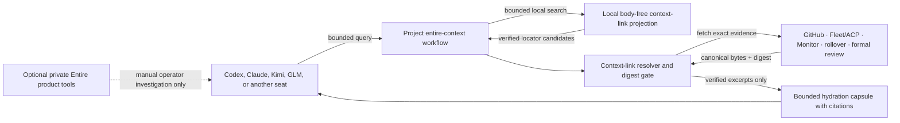

# Entire 0.8.42 context-layer and ACP integration rollout

**Status:** Plan of record; local body-free context links and private native
Entire workflows implemented, with provider search/dispatch canaries tracked
**Owner:** Infra harness stream, #4707
**Tracking:** [#6162](https://github.com/learn-ukrainian/learn-ukrainian.github.io/issues/6162),
[#6183](https://github.com/learn-ukrainian/learn-ukrainian.github.io/issues/6183),
[#6278](https://github.com/learn-ukrainian/learn-ukrainian.github.io/issues/6278)
**Decision:** [ADR-018](../architecture/adr/adr-018-entire-acp-context-layer.md)
**Version boundary:** stable Entire CLI 0.8.42 only

## Outcome

Entire may be used for more than recovery, but it will not become another
controller. The implemented project path helps an agent find prior work in a
local body-free projection, connect that history to ACP/Fleet/Monitor receipts,
and load a small amount of verified canonical context into the current task.

The rollout has four product outcomes:

1. **Active recall:** an accountable root can search verified local locator
   cards before work and distribute one bounded, cited hydration capsule.
2. **Intent and provenance:** a reviewer can move from a commit or code line to
   its Entire checkpoint and then to the exact issue, ACP discussion, review,
   or rollover receipt.
3. **Cross-agent continuity:** Kimi, GLM, and other non-native seats can consume
   the same verified context through their accountable harness.
4. **Reusable operating memory:** approved ADRs, runbooks, and skills become
   discoverable locators without uploading private conversations.

Recovery remains a supported fallback, not the definition of the product.

## What the official guidance changes

Entire's current guidance describes agent-facing workflows rather than only a
journal:

- [Entire Skills](https://docs.entire.io/learn/skills) groups the product's
  search, explanation, investigation, review/recap, and handoff workflows.
- [Search past agent work](https://docs.entire.io/learn/search-past-agent-work)
  describes logged-in semantic search across prior work.
- [Review and recap agent work](https://docs.entire.io/learn/review-and-recap-agent-work)
  describes generated review and recap workflows.
- [Investigate why code exists](https://docs.entire.io/learn/investigate-why-code-exists)
  describes explain/why/blame/investigate-style provenance work.

These sources establish useful private investigation workflows. Automatic
intake remains stricter, local, body-free, and independent of logged-in cloud
search. The operator-authorized private mode may give native Entire output to
the accountable root, but never promotes prompt-bearing output to public or
distributed evidence without operator review.

## Installed 0.8.42 capability matrix

The following table distinguishes observed command surfaces from authorized
use. The repository pins the private checkpoint destination, disables Entire
telemetry, and composes fail-open hooks for supported host harnesses. Runtime
availability still requires an explicit probe; configuration is not a health
claim.

| Capability | 0.8.42 evidence | Rollout disposition |
| --- | --- | --- |
| Installed-version discovery | `entire version`; `entire agent-help --json` | Required before every automated call. |
| Private checkpoint remote | `configure --checkpoint-remote github:owner/repo` | Allowed only after exact allowlist and routing canaries. |
| Branch checkpoint backend | Existing private pilot | Proven pilot baseline. |
| Ref-per-checkpoint backend | `configure --checkpoint-backend refs`; official 0.8.42 announcement | Canary for concurrency, routing, cleanup, and leakage before adoption. |
| Checkpoint metadata | `checkpoint explain --json` promises no transcript bytes in command output | Allowed only after remote-storage inspection; safe output does not prove safe stored bytes. |
| Full/raw transcript output | `--full`, `--raw-transcript`, `--transcript` | Full explain is operator-authorized for exact private continuity; raw transcript flags remain prohibited. |
| Search | `entire search --json`; requires Entire login and service | Allowed for the exact source repo after the private preflight; output stays in the accountable root's task context. |
| Attach and resume | `session attach`; `session resume`; private pilot attach retry was idempotent | Recovery use proven; broader use remains canary-gated. |
| Recap | `recap --static` reports sessions/checkpoints/tokens/files/tools/skills | Operator-authorized in private context; external disclosure requires operator review. |
| Dispatch | `dispatch --local` or server summary | Operator-authorized private handoff; never canonical or formal-review evidence. |
| Generated explanation | `checkpoint explain --generate` | Prohibited for the same reason. |
| Labs review/investigate/import/why/blame/experts | Listed by `entire labs`; explicitly experimental | Advisory canaries only; never authoritative. |
| External-agent plugin | Standalone Kimi Code adapter implemented; no ACP-wide plugin | Use only for the actual standalone `kimi` harness; the general ACP plugin remains deferred. |
| Agent Skills | Official cross-agent workflows | Pin and review only the required workflows; wrap them in project policy. |
| Local context-link recall | `scripts/entire_context/`; tests for search, explain, handoff, typed resolvers, and use receipts | Implemented public path; body-free, bounded, local, and non-authoritative. |
| Monitor projection | Read-only `/api/ops/entire-context/status` and `/api/ops/entire-context/search` | Implemented; no synchronous Entire call. |
| Host-harness capture | Composed `codex`, `claude-code`, and `opencode` hooks; standalone Kimi adapter | Implemented where installed; follows the harness, not the model label, and remains separate from recall. |

## System roles

The local projection ranks possible history. The resolver decides whether a
result is safe and true. Canonical systems provide every byte that enters the
LLM's automatic context. Optional Entire product output stays outside that
automatic path.

## Search corpus and context-link contract

### Tier 0: structural checkpoint links

The initial index uses only fields copied mechanically from canonical records:

- checkpoint ID, commit SHA, source kind, canonical ID, timestamp;
- public repository, stream epic, track, state, labels, touched paths;
- allowlisted model/harness and non-body routing fields exposed by typed
  canonical resolvers.

No bridge component writes an `intent`, `outcome`, `rationale`, title, heading,
`summary`, or other synthesized field. Prompts, transcripts, responses,
session bodies, and private ACP subjects are excluded. Each search field must
name the canonical field from which it was copied.

The project does not assume that Entire 0.8.42 can ingest arbitrary typed
metadata cards. The baseline join works from supported Entire checkpoint and
commit IDs into a project-owned link projection. Optional locator-card
ingestion into Entire is dropped if the capability canary cannot prove a
documented, body-free path. Synthetic transcripts are never used as envelopes.

### Tier 1: curated workflow memory

After Tier 0 proves safe and useful, approved ADRs, runbooks, decision records,
and repository skills may be registered as workflow sources. Registration
requires:

- an immutable repository path and Git SHA;
- public/private classification;
- operator or designated-advisor approval where the workflow changes
  architecture, layout, or process; and
- normal cross-family review for the code or documentation change.

Entire stores or searches the locator. The LLM reads the canonical repository
document after digest verification. An agent may draft a new skill, but the
draft is not admitted until human or designated-advisor approval and code
review make it an ordinary canonical repository artifact.

### Outbox lifecycle

If projection delivery is asynchronous, the outbox is a queue of claims, not a
source of truth:

1. A canonical event commits first.
2. The projector writes one claim keyed by
   `digest(kind || canonical_namespace || canonical_id || canonical_digest)`.
3. Reconciliation is the only outbox reader. It verifies the canonical event,
   creates or confirms one link, and marks the claim promoted.
4. Duplicate promotion is a no-op.
5. A claim that cannot be verified within its bounded retention period is
   tombstoned with a reason and surfaced to Monitor.
6. Search and hydration never read pending or tombstoned claims.

The projection is disposable and rebuildable from canonical receipts.

## Staged rollout

Implementation status as of 2026-08-02:

| Phase | Evidence-backed status |
| --- | --- |
| Phase 0 | Private routing, fail-open host hooks, and no-public-ref configuration have automated coverage; the broader remote leakage and outage canary set below remains a gate, not a completed claim. |
| Phase 1 | The `#6174` local context-link schema, append-only projection, typed resolvers, ACP reconciliation, and read-only Monitor surface are implemented. |
| Phase 2 | The `#6183` local `status`, `search`, `explain-change`, `handoff`, and `record-use` path is implemented with hard body/result/budget limits. Cloud semantic search is not automated. |
| Phase 3 | Body-free use receipts are implemented; curated body admission and product analytics remain deferred. |
| Phase 4 | ACP plugin remains deferred; current ACP terminal receipts already project into the local context index. |

The implemented provider-neutral intake contract is one root `status` +
`search`, at most one verified five-card/8-KiB capsule distributed to relevant
participants, and `record-use` only when verified locators materially informed
the task. Participants do not repeat broad recall by model. Capture attaches to
the host harness (`codex`, `claude-code`, `opencode`, or an explicitly proved
external harness adapter), not to Codex, Claude, Kimi, GLM, Grok, or AGY model
labels.

### Phase 0 — containment and capability proof

No product checkout is enabled during this phase.

Deliverables:

- exact 0.8.42 preflight and fail-closed version mismatch;
- checkpoint-destination resolver with the sole allowlisted remote
  `learn-ukrainian/entire-checkpoints-private`;
- explicit rejection of the public product `origin` and named product URLs;
- telemetry disabled for disposable canaries unless separately approved;
- disposable branch-backend and refs-backend routing canaries;
- body, prompt, summary, secret, raw-IP, and public-ref leakage scanner;
- command-by-command offline/network observation for search, recap, explain,
  attach, resume, and status;
- exact inventories of local shadow refs before and after normal, outage,
  retry, and cleanup paths.

Exit gate:

- zero disallowed remote pushes;
- zero forbidden content in the private checkpoint remote;
- zero `entire/*` refs on product origins;
- existing hooks and normal agent work continue when Entire is missing or
  deliberately broken;
- the selected backend passes concurrent-worktree and idempotent retry tests.

Any private-routing or leakage failure stops the program.

### Phase 1 — supported checkpoints and canonical joins

Capture follows supported host-harness integrations, not model labels. Codex
CLI/Desktop use `codex`; Claude Code-hosted models use `claude-code`; OpenCode-
hosted models use `opencode`; and the explicit standalone Kimi Code adapter is
only for the actual `kimi` harness. This phase proceeds only where private-
route and content canaries satisfy the boundary. A failed canary disables that
capture route; the project does not weaken the privacy contract or manufacture
synthetic sessions.

Deliverables:

- versioned context-link schema and deterministic locator IDs;
- append-only relationship between checkpoint/commit and issue, ACP
  conversation, formal-review receipt, or rollover receipt;
- complete outbox promotion, duplicate, tombstone, and rebuild behavior;
- Monitor status derived from the local projection only; Monitor performs no
  synchronous Entire call;
- replay, partial ACP terminal state, stale receipt, and digest mismatch tests.

Exit gate:

- duplicate and replay paths produce exactly one link;
- failed Entire calls leave canonical records byte-for-byte unchanged;
- every admitted link resolves and matches its canonical digest;
- projection rebuild reproduces the same logical links.

### Phase 2 — active LLM recall

Build the project-owned `entire-context` workflow. It may vendor or pin the
smallest reviewed subset of upstream Entire Skills, but it must enforce this
repository's command and data policy.

Initial workflows:

- `search-past-work`: return ranked locators and verified canonical excerpts;
- `explain-change`: checkpoint/commit to issue, ACP, review, and rollover
  provenance;
- `prepare-handoff`: combine verified locators with the existing bounded
  hydration capsule; and
- `review-with-intent`: supply verified context to the reviewer without
  changing the formal-review gate.

Local body-free search is implemented. Logged-in cloud Entire search remains a
manual operator investigation tool and is never invoked by the public skill.
Its results do not enter automatic capsules.

Exit gate:

- zero transcript bytes in command output consumed by the workflow;
- hard query/result/context size caps;
- every injected excerpt carries canonical namespace, ID, and digest;
- a judged query set shows recall@10 of at least 0.70 for questions answerable
  from admitted headers;
- Kimi K3, GLM-5.2, and a native seat receive equivalent locator results for
  identical queries within a documented tolerance.

### Phase 3 — curated reusable memory and analytics

Admit reviewed ADR/runbook/skill locators and evaluate local-safe recap fields.

Deliverables:

- operator/advisor approval receipt on every process-changing workflow source;
- consumer receipt showing whether an agent actually used a retrieved source;
- aggregate checkpoint/session/token/tool/skill metrics only after privacy and
  cloud/local behavior are proven;
- effectiveness report comparing time-to-first-valid-draft, duplicate work,
  citation accuracy, and token use against the pre-Entire baseline.

Entire review, recap, or experts output is supplementary. It cannot approve a
PR, certify a model, alter a route, or close an issue.

### Phase 4 — conditional ACP plugin

Revisit an Entire external-agent plugin only after Phases 0-3 remain green for
a sustained evaluation window and a concrete in-turn capture requirement is
not satisfiable from ACP terminal receipts.

The plugin, if approved, must:

- remain stateless and use the documented JSON protocol;
- export no ACP prompt, response, artifact body, or transcript path;
- preserve ACP's own lifecycle and idempotency keys without exposing them as
  search text;
- fail open without changing ACP completion, retry, or review eligibility; and
- pass native/Kimi/GLM contention, outage, and parity canaries.

The plugin is not required for Kimi or GLM to consume context. Their harnesses
use the Phase 2 retrieval path.

## Canary matrix

| Canary | Pass condition | Frequency during pilot |
| --- | --- | --- |
| Version pin | Every automated call proves exactly 0.8.42. | Every call |
| Destination | Every push-capable call resolves only to the approved private repo. | Every call |
| Product refs | Product origins contain zero `entire/*` refs. | Before/after every scenario |
| Body leakage | Zero prompt, response, transcript, diff, generated summary, or secret markers. | Every checkpoint plus sampled remote audit |
| Idempotency | Duplicate event/retry produces one checkpoint link and one terminal claim. | Every scenario suite |
| Failure isolation | Entire missing, offline, timed out, or unauthorized changes no canonical result. | Every release |
| Locator integrity | 100% of admitted hydration locators resolve and match digest. | Continuous; any mismatch blocks |
| Outbox completeness | No expired unpromoted claim; tombstones carry exact reasons. | Continuous |
| Search utility | Recall@10 >= 0.70 on admitted-header questions. | Each corpus revision |
| Cross-seat parity | Native, Kimi, and GLM seats receive equivalent locator sets. | Each harness revision |
| Context budget | Retrieval never exceeds the configured item/token limits. | Every retrieval |
| Egress | Observed network destinations and fields match the approved record. | Each enabled command/release |

## Kill and rollback criteria

Immediately disable the integration and return to the recovery-only baseline
if any of the following occurs:

- a push targets a product or unapproved remote;
- a public product remote gains an Entire shadow ref;
- a prompt, transcript, AI-generated summary, secret, or raw private body
  reaches the checkpoint remote or a search result;
- an Entire failure changes an ACP, Fleet, Monitor, lease, rollover, review, or
  GitHub outcome;
- hydration injects an unresolved or digest-mismatched item; or
- a CLI change makes the 0.8.42 preflight or output contract ambiguous.

Rollback disables the project workflow and hooks, preserves canonical work,
and retains only the already-approved private pilot evidence needed for audit.
Deletion or rewriting of checkpoint history is a separate, explicitly approved
operation.

## Panel decisions and disagreements

Exact task/message identities, result hashes, installed-CLI help hashes, and
the root-repeated 169-test receipt are preserved in the
[architecture research and advisor receipt](https://github.com/learn-ukrainian/learn-ukrainian.github.io/issues/6162#issuecomment-5150430545).
The summaries below are conclusions; the linked receipt is the audit pointer.

The design incorporated these independent findings:

- **Kimi K3:** approved the locator-only direction, but identified the public
  `origin` auto-detection hazard and required the destination gate, locator
  integrity, outbox reconciliation, and fail-open drills before enablement.
- **GLM-5.2:** returned `REVISE` because an ID-only corpus is not semantically
  useful, mechanically extracted headers were undefined, the outbox lifecycle
  was incomplete, and plugin deferral was justified too loosely. This plan
  resolves all four findings with a headers-only corpus, zero-synthesis rule,
  complete claim lifecycle, and explicit plugin reconsideration criteria.
- **Codex Terra repository analyst:** verified the current ACP/Fleet/Monitor,
  session-stream, rollover, and hydration authority boundaries and confirmed
  that Entire integration does not exist in the public repository today.
- **Sol synthesis:** rejected assumed arbitrary metadata ingestion. The
  baseline design joins supported Entire checkpoint/commit IDs to canonical
  receipts; metadata-card ingestion is optional and must prove a documented
  body-free 0.8.42 capability.

Fable was not used: its dedicated quota was at 100%. This is recorded as an
unavailable advisor route, not silently treated as review. Independent formal
review of the finished documentation remains a separate gate.

## Ordered implementation issues

1. Phase 0 destination, leakage, and exact-version canary harness.
2. Phase 1 context-link schema, outbox lifecycle, and Monitor projection
   (implemented local slice; continue verification/operations hardening).
3. Phase 2 provider-neutral `entire-context` onboarding and judged local recall
   evaluation (core workflow implemented under #6183).
4. Phase 3 curated workflow-source admission and utility evaluation, only
   after a separately approved body policy.
5. Phase 4 ACP plugin only if evidence proves a residual need.

These issues may run only after dependency and ownership checks. They do not
open #5880 step 5. The production Entire gate remains independent until the
complete session primitive is proved deployed end to end.
