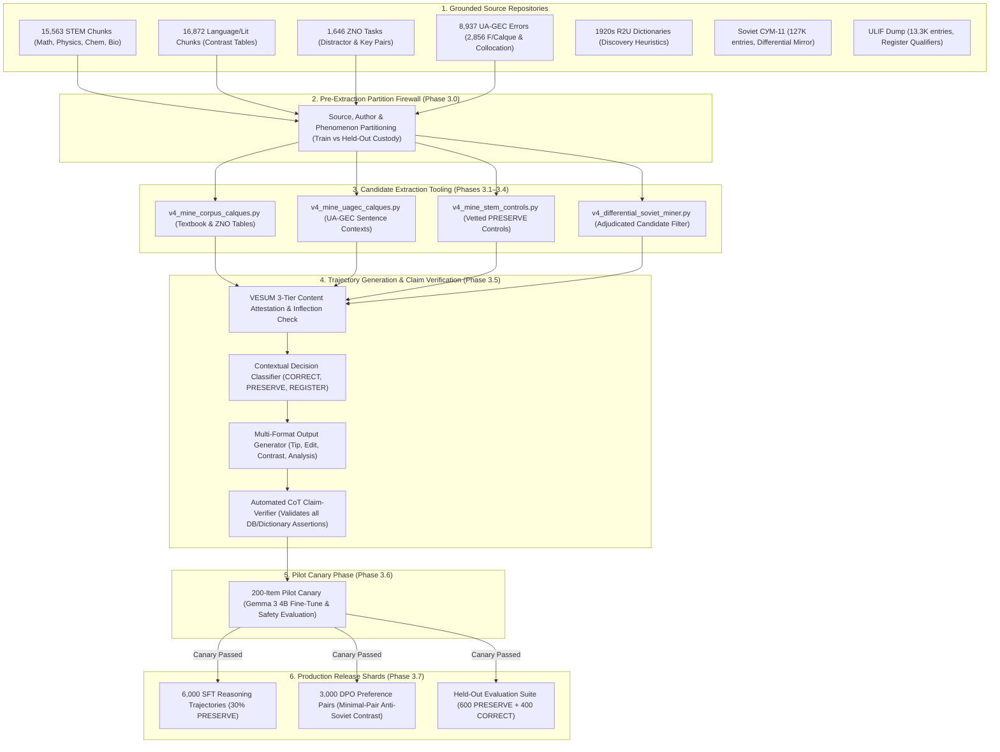

# Corpus-Grounded Decolonization Dataset Expansion Plan: Production Pipeline (6K SFT + 3K DPO)

> **Document Status:** Authoritative Operational Plan & Roadmap (Comprehensive Tri-Family Adjudication: Gemini, Claude Fable 5.1, Codex Sol)
> **Stream Epic:** #6321 (Open Model Data)
> **Target Alignment:** Google Gemma 3 (12B-it, 4B-it) & Gemma 4 Architectures
> **Source Corpus:** Local repository storage in `data/sources.db`, `data/vesum.db`, `data/ulif_dump_all.db`, and `scripts.rag.source_query.r2u_translate`

---

## 1. Executive Strategy & Grounding Mandate

Pre-trained foundation models systematically confuse Soviet lexical leveling with authentic Ukrainian standards. Expanding from the **150 Human Gold Seeds (Phase 2, PR #8002)** to a **production-scale dataset (6,000 SFT trajectories + 3,000 DPO preference pairs)** requires avoiding synthetic LLM "hallucinated errors".

### 1.1 The Refined Grounding & Claim-Level Mandate
Following adversarial deliberation with Claude Fable 5.1 and Codex Sol, the mandate is formally defined:
1. **100% Human-Authored Contexts & Error Spans:** Every underlying sentence, attested error span, distractor, and candidate correction originates directly from verified human-authored Ukrainian texts in local storage (`sources.db`, `ua_gec_errors`, `zno_tasks`, `textbooks`, `style_guide`). No sentences or errors may be invented by an LLM.
2. **Automated Claim-Verification of Reasoning Prose:** Explanatory reasoning and Chain-of-Thought (CoT) trajectories must pass an automated claim-verifier (`v4_verify_trajectory_claims.py`) that validates every dictionary citation (СУМ-11, R2U), inflectional claim (VESUM), and register qualifier (ULIF) against local databases. Any ungrounded claim triggers immediate record rejection.
3. **Pinned Target Norm:** The target standard is explicitly pinned to **Modern Standard Ukrainian per the 2019 Orthography (Український правопис 2019) and current MESU school curricula**, cleansed of Soviet leveling and Russian calques. Historical 1920s dictionaries (R2U) and 1930s purge bulletins serve strictly as *candidate discovery heuristics*, never as an uncritical replacement blueprint (preventing archaisms like *рівнобіжник* instead of standard *паралелограм*).
4. **Dual-Tier Open Release Policy:** Shards derived from public domain sources (Grinchenko 1907, 1920s Academy works, UA-GEC CC-BY-4.0) are cleared for public open-source Hugging Face redistribution. Shards derived from copyrighted school textbooks and protected 20th-century monographs remain in a *train-only local research partition* with model weights publicly released.

---

## 2. Complete Inventory of Local Corpus Assets

| Corpus Asset | Storage Location | Exact Volume | Primary Decolonization Role | Licensing / Release Tier |
| :--- | :--- | :--- | :--- | :--- |
| **STEM Textbooks (Gr 1–11)** | `sources.db` $\rightarrow$ `textbooks` | **15,563 chunks** (65 books across 10 subjects) | Scientific terminology decolonization, polysemy boundaries (*об'єм*, *рахувати*, *відношення*), and vetted `PRESERVE` controls | Train-only research partition |
| **Language & Lit Textbooks** | `sources.db` $\rightarrow$ `textbooks` | **16,872 chunks** (127 books) | 379 chunks with explicit contrastive tables (❌ НЕПРАВИЛЬНО $\rightarrow$ ✅ ПРАВИЛЬНО) | Train-only research partition |
| **ZNO / NMT Exam Tasks** | `sources.db` $\rightarrow$ `zno_tasks` | **1,646 official tasks** | Real state-exam distractors (authentic calques) paired with validated correct keys (Train-only to prevent pretraining eval contamination) | Educational fair use / Train-only |
| **UA-GEC Error Corpus** | `sources.db` $\rightarrow$ `ua_gec_errors` | **8,937 annotated error spans** | 2,856 human-annotated calques (`F/Calque`) and collocations (`F/Collocation`) from real writing with author metadata | CC-BY-4.0 (Public redistribution) |
| **Antonenko-Davydovych *«Як ми говоримо»*** | `sources.db` $\rightarrow$ `style_guide` | **342 full chapters** | Morphemic, etymological, and literary reasoning steps (Train-only) | Train-only research partition |
| **Pre-Soviet & 1920s Dictionaries (R2U)** | `scripts.rag.source_query.r2u_translate` | **Full indexed endpoints** | Pre-1933 authentic equivalents (Krymskyi-Yefremov 1924–33, Pidmohylnyi-Pluzhnyk 1926–27) used as historical discovery heuristics | Public Domain (Public redistribution) |
| **Soviet СУМ-11 (Differential Mirror)** | `sources.db` $\rightarrow$ `sum11` | **127,069 entries** | Negative differential mirror: detecting Soviet ideological elevation and artificial convergence (7,152 `sovietization_risk` flags) | Academic research mirror |
| **ULIF (Словники України on-line)** | `data/ulif_dump_all.db` $\rightarrow$ `ulif_entries` | **13,392 entries** | Register qualifiers (`діал.`, `розм.`, `книжн.`, `заст.`), stress, and synonym spectrum to bound purism | Lexicographical reference |
| **VESUM Morphological Engine** | `data/vesum.db` $\rightarrow$ `forms` / `forms_all` | **409K lemmas, 6.7M forms** | Paradigm verification, inflectional consistency, and non-standard marker detection (`:bad`, `:subst`) | Open source (GPL/CC) |

---

## 3. Comprehensive Methodological Architecture

### 3.1 STEM Polysemy & Semantic Boundary Mechanics
To prevent hyper-purism, boundary decisions must key on **semantic entity type and mathematical/physical definitions**, not merely coarse textbook subject tags:

```
                              ┌─────────────────────────┐
                              │  Query: Word "ОБ'ЄМ"    │
                              └────────────┬────────────┘
                                           │
                         Semantic Entity / Context Classification
                                           │
                ┌──────────────────────────┴──────────────────────────┐
                │                                                     │
       [3D Physical / Geometric Space]                       [Quantity, Data, Scope]
                │                                                     │
    "об'єм куба / піраміди / розчину"                    "об'єм даних / робіт / інвестицій"
                │                                                     │
        Outcome: PRESERVE                                     Outcome: CORRECT
  (Valid physical 3D spatial capacity)                      (Replace with "обсяг")
```

1. **`об'єм` vs `обсяг`:**
   - `PRESERVE`: 3D physical volume of a geometric body or fluid capacity (*об'єм піраміди*, *об'єм розчину*).
   - `CORRECT`: Abstract capacity, computational memory, scope of work, or economics (*об'єм даних* $\rightarrow$ *обсяг даних*; *об'єм робіт* $\rightarrow$ *обсяг робіт*).
2. **`рахувати` vs `обчислювати` vs `вважати`:**
   - `PRESERVE`: Discrete counting of concrete items or elements (*рахувати дні*, *порахувати предмети*).
   - `REGISTER / NORMALIZATION`: Mathematical calculation (*порахувати інтеграл* $\rightarrow$ standard *обчислити інтеграл*).
   - `CORRECT`: Cognitive opinion or belief (*я рахую, що...* $\rightarrow$ *я вважаю, що...*).
3. **`відношення` vs `ставлення / взаємини`:**
   - `PRESERVE`: Mathematical ratio or physical proportion (*відношення $a : b$*, *відношення заряду до маси*).
   - `CORRECT`: Interpersonal behavior or attitudes (*відношення до колег* $\rightarrow$ *ставлення до колег*; *наші відношення* $\rightarrow$ *наші стосунки / взаємини*).
4. **Nomenclature Modernization vs. Decolonization:**
   - True calques (e.g. *вуглекислий газ* $\rightarrow$ *вуглекислий* from Russian *углекислый газ*, modern *карбон(IV) оксид*) are flagged under lexical decolonization.
   - Traditional trivial names (e.g. *сірчана кислота*, standard Ukrainian formation from *сірка*, alongside IUPAC systematic *сульфатна кислота*) are categorized as *nomenclature modernization*, avoiding the erroneous public claim that traditional Ukrainian roots are Russian calques.

### 3.2 Negative Control Architecture (The 30% `PRESERVE` Target)
To ensure the model does not become an aggressive over-corrector:
- **30% of the SFT corpus (1,800 trajectories)** consists of `PRESERVE` negative controls.
- **Source Vetting:** Raw textbook passages must pass an automated cleanliness filter (VESUM attestation + style-guide collision check + OCR sanity check) before being admitted as `PRESERVE` controls.
- **Intentional Colloquial Register Preservation:** Include vetted conversational and colloquial prose (`розм.`) where informal Ukrainian is preserved as-is, teaching the model that colloquial register does not equal Russian interference.

### 3.3 Minimal-Pair DPO Preference Architecture
To avoid shortcut learning (where DPO separates chosen from rejected based on superficial formatting, length, or archaic lexicographical tone):
1. **Length & Structure Matching:** Chosen and rejected completions must be minimal pairs with matched length ($\pm 10\%$), identical format, and identical Chain-of-Thought scaffolding, differing strictly on the linguistic verdict and lexical replacement.
2. **PRESERVE DPO Pairs (900 pairs):** Sourced via two complementary mechanisms:
   - **Plausible Hyper-Purist Over-Correction:** For clean `PRESERVE` passages, the rejected response represents an unjustified substitution (e.g. wrongly modifying *об'єм конуса* $\rightarrow$ *обсяг конуса* in geometry).
   - **Reframed Human Correction Pairs:** Taking human-corrected clean passages as the input + chosen response (`PRESERVE`), with the original human pre-correction erroneous passage as the rejected response.
3. **On-Policy Error Sampling:** Sample candidate completions from target checkpoints (Gemma 3 4B/12B) on training prompts; outputs containing verified calques are harvested as authentic hard negatives.
4. **Caricature Control & Error Density:** Cap rejected completions to realistic error densities (matching the empirical UA-GEC distribution of 1–2 errors per sentence), preventing exaggerated caricatures.

### 3.4 Pre-Extraction Partition Firewall & Leakage Defense
To prevent data leakage and benchmark gaming:
1. **Partition at Source Intake (Phase 3.0):** Partitioning happens before extraction, feature derivation, or prompt formatting.
2. **Phenomenon-Level Split:** The unit of partitioning is the *linguistic phenomenon / calque pair*, not just individual sentences. The held-out suite measures both seen-phenomenon generalization and unseen-phenomenon transfer.
3. **Derivational Family Closure:** Exclusion covers entire root families via VESUM lemmas (e.g. *рахувати / рахунок / підрахунок*).
4. **Fuzzy Near-Duplicate Dedup (MinHash):** Passages across splits are deduplicated using MinHash / Jaccard similarity ($\ge 0.80$), preventing overlapping chunk boundaries or reprinted textbook editions from leaking between splits.
5. **UA-GEC Test Partition Protection:** The official published UA-GEC test split is strictly excluded from all training data to preserve independent external evaluation integrity.
6. **Pre-Training Contamination Defense:** Verbatim ZNO/NMT exam tasks and classic Antonenko-Davydovych sentences are widespread on the public web and memorized in Gemma pre-training. They are restricted to **Train-only**. The 1,000-case Held-Out Evaluation Suite is constructed from low-web-visibility sources, author-disjoint partitions, and fresh human-authored gold cases.
7. **Evaluation Allocation & Statistical Power:** The 1,000 held-out cases are allocated as **600 PRESERVE cases + 400 CORRECT cases**. On 600 clean cases, observing $\le 1$ harmful edit yields an exact one-sided 95% binomial upper bound of $0.788\%$, statistically proving compliance with the $\le 1.0\%$ Harmful-Edit Rate gate.

### 3.5 Differential Soviet Miner Guardrails ("Fighting Fire with Fire")
When mining candidates from СУМ-11 and pre-Soviet dictionaries:
1. **20th-Century Neologism & Internationalism Whitelist:** Maintain an explicit whitelist of modern technical, scientific, and computing vocabulary coined after 1930 (e.g. *програмування*, *авіація*, *транзистор*). Absence from 1920s R2U is expected and must not trigger false calque flags.
2. **`r2u_translate` Network vs. Absence Disambiguation:** Differentiate `SOURCE_UNAVAILABLE` (network timeout / HTTP failure) from `NOT_FOUND_WITHIN_VERIFIED_COVERAGE`. Never treat an empty network return as proof of absence.
3. **Reverse-Lookup Lemmatization:** Lemmatize the Ukrainian translation side of Russian$\rightarrow$Ukrainian R2U dictionaries through VESUM, rather than relying on raw string matching.
4. **Semantic Calque Division of Labor:** Lemma-level differential mining cannot detect semantic shifts on existing lemmas (*являтися*, *відмінний*, *зустрічатися*). Semantic calques are strictly mined from UA-GEC, Antonenko-Davydovych, and textbook contrast tables.

### 3.6 Curriculum Stratification & Error Budget
To prevent high-volume error categories from overwhelming the dataset:
- **Prepositional Government (`G/Case`):** Capped at $\le 25\%$ of total training records (preventing UA-GEC's 5,024 prepositional errors from dominating).
- **Lexical Calques & Russianisms (`F/Calque`):** Target $40\%$ of training records.
- **Active Present Participles (`-чий / -ший`):** Target $15\%$ of training records.
- **Syntactic Voice & Passive Reflexivity (`-ся` vs `-но/-то`):** Target $10\%$ of training records.
- **Phraseological Collocations:** Target $10\%$ of training records.

---

## 4. End-to-End Pipeline Architecture



---

## 5. Implementation Roadmap (Phases & Deliverables)

| Step | Scope | Target Deliverable | Source Grounding & Acceptance Criteria |
| :--- | :--- | :--- | :--- |
| **Phase 3.0** | Source Custody & Partition Firewall | `phase3_heldout_partition.py` | Phenomenon-level split; ZNO/style-guide to Train; MinHash dedup; 600/400 eval split |
| **Phase 3.1** | Textbook & ZNO Mining Script | `v4_mine_corpus_calques.py` | 379 textbook contrast chunks + 1,646 ZNO tasks; explicit table alignment |
| **Phase 3.2** | UA-GEC Context Extraction | `v4_mine_uagec_calques.py` | 2,856 `F/Calque` and `F/Collocation` pairs in full context; author-disjoint; UA-GEC test split preserved |
| **Phase 3.3** | STEM Negative Control Generator | `v4_mine_stem_controls.py` | 15,563 STEM chunks; vetted for cleanliness; semantic entity typing |
| **Phase 3.4** | Differential Soviet Candidate Miner | `v4_differential_soviet_miner.py` | СУМ-11 `sovietization_risk` vs. R2U; 20th-century whitelist; human adjudication filter |
| **Phase 3.5** | Automated CoT Claim-Verifier | `v4_verify_trajectory_claims.py` | Verifies every cited lemma, form, dictionary claim, and historical date against local DBs |
| **Phase 3.6** | 200-Item Pilot Canary | `v4_pilot_canary_evaluation.py` | Fine-tune Gemma 3 4B on 200 items; verify calque-fix and HER $\le 1\%$ |
| **Phase 3.7** | Production Assembly | `6,000 SFT + 3,000 DPO` | Full sharded release validated against schemas and cross-family review |

---

## 6. Acceptance & Quality Gates

1. **Schema Reconciliation for PRESERVE Controls:** `v1_decolonization_trajectory.schema.json` requires `lexicographical_context` suppression notes only when `is_calque_or_russianism == true`. When `is_calque_or_russianism == false` (`PRESERVE`), historical suppression fields are optional, preventing hallucinated history.
2. **100% VESUM Attestation:** Every living standard replacement and negative control must be verified in `data/vesum.db` using content-word paradigm resolution.
3. **100% CoT Claim-Verification:** Zero unverified dictionary citations or historical assertions in reasoning trajectories.
4. **Preserve Ratio Gate:** Exactly $30.0\% \pm 2.0\%$ of the training corpus must be vetted `PRESERVE` negative controls.
5. **Harmful-Edit Rate Gate:** Fine-tuned checkpoint must exhibit $\le 1.0\%$ unjustified modifications on the 600-case clean evaluation partition (exact one-sided 95% binomial upper bound $< 1.0\%$).
6. **Zero Pre-Training Memorization Leakage:** 100% of held-out evaluation items are held out from web-visible public exams and classic monographs.
7. **No Synthetic Sentence Hallucination:** 100% of underlying sentence contexts originate from local human-authored corpus files.
