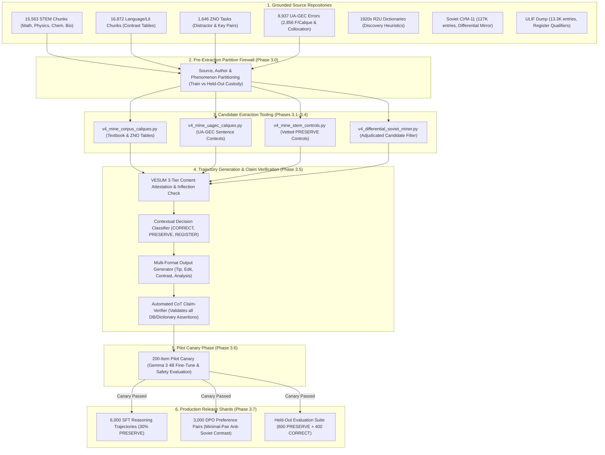

# Architecture Specification: Ukrainian Linguistic Decolonization & Reasoning (ULDR) — Production Alignment Roadmap

> **Status:** Authoritative Epic Architecture Specification (Approved Post Tri-Family Deliberation: Gemini, Claude Fable 5.1, Codex Sol)
> **Stream Epic:** #6321 (Open Model Data) / Task #7922 / PR #8002
> **Participating Fleet Agents:** Yellow Team (Gemini/AGY - Mining Driver), Blue Team (Claude Fable 5.1 - Authority Reviewer), Red/Alternate (Codex Sol / GPT-6.0 Astra - Adversarial Critic)
> **Target Models:** Google Gemma 3 (4B-it, 12B-it, 27B-it) and Gemma 4 open-weight architectures

---

## 1. Executive Summary & Problem Formulation

Pre-trained foundation models (both commercial frontier systems and open-weight architectures) exhibit systematic Soviet-era lexical leveling and Russian-influenced syntactic distortions in Ukrainian. This stems directly from the **Triad of False Authority**:
1. **Soviet Prescriptive Bias:** Digitized post-1930s lexicography (especially СУМ-11) artificially elevated Russian cognates (*мисль*, *задача*, *по крайній мірі*) while labeling authentic Ukrainian vocabulary as archaic, regional, or rare.
2. **Pre-Soviet Ethnographic Anachronisms:** Dictionaries such as Grinchenko 1907 reflect late 19th-century folk-ethnographic idioms (*мати на мислі*), which automated classifiers mistake for living contemporary standards.
3. **Morphological Blindness:** Morphological engines such as VESUM (409K lemmas, 6.7M forms) verify inflectional existence, not semantic, syntactic, or register appropriateness.

### 1.1 Milestone Progress Status
- **Milestone 1 (v1 Pilot):** Completed & Shipped. 1,200 SFT trajectories + 1,200 DPO pairs validated across VESUM (100%), textbooks (82.75%), and dictionaries (85.33%).
- **Milestone 2 (Human Gold Seeds):** **COMPLETED & APPROVED (PR #8002).** Exactly 150 deeply researched, multi-turn, multi-format human gold exemplar seeds covering the 7 core linguistic categories. Validated against schemas and VESUM (100%), passed all 16 CI checks, and received independent cross-family approval (`VERDICT: APPROVED` from Claude).
- **Milestone 3 (Production Scaling — Active):** Expanding to **6,000 SFT trajectories + 3,000 DPO preference pairs** and a **1,000-case Held-Out Evaluation Suite** grounded 100% in local human-authored corpus assets without synthetic hallucination.

---

## 2. Core Methodological Paradigm Shifts

### 2.1 Pinned Target Norm: Modern Standard Ukrainian
The target norm is explicitly anchored to **Modern Standard Ukrainian per the 2019 Orthography (Український правопис 2019) and current MESU school curricula**, cleansed of Soviet lexical leveling and Russian calques.
- **Historical Candidate Discovery:** 1920s Academy dictionaries (R2U) and 1930s Terminological Purge Bulletins serve strictly as *discovery heuristics* for candidate restoration. Every candidate must be individually adjudicated against modern standard Ukrainian before adoption.
- **Preventing Archaic Hyper-Purism:** Words from the 1928 Skrypnykivka era that never re-entered the modern standard (e.g. *рівнобіжник* instead of standard *паралелограм*, *терпуг* instead of *напилок*) are rejected as normative targets.

### 2.2 The Zero-Hallucination Mandate: Source Grounding + Claim Verification
1. **100% Human-Authored Contexts & Error Spans:** Every underlying sentence, attested error span, distractor, and candidate correction originates directly from verified human-authored Ukrainian texts in local storage (`sources.db`, `ua_gec_errors`, `zno_tasks`, `textbooks`, `style_guide`). No sentences or errors may be invented by an LLM.
2. **Automated CoT Claim-Verification:** Every explanatory statement, dictionary citation (СУМ-11, R2U), inflectional claim (VESUM), and register qualifier (ULIF) is verified against local databases via `v4_verify_trajectory_claims.py`. Unverifiable claims trigger record rejection.

### 2.3 Semantic Boundary Mechanics for STEM Polysemy
Drawing on **15,563 STEM textbook chunks**, boundary decisions key on **semantic entity type**, not raw textbook subject tags:
- **`об'єм` vs `обсяг`:** 3D physical spatial volume of a geometric body or fluid capacity (*об'єм піраміди*, *об'єм розчину*) is preserved as standard Ukrainian. Abstract capacity, data volume, and scope of work (*об'єм даних*, *об'єм робіт*) are corrected to *обсяг*.
- **`рахувати` vs `обчислювати` vs `вважати`:** Discrete counting of items (*рахувати дні*, *порахувати предмети*) is preserved. Mathematical calculation is normalized to *обчислити*. Cognitive opinion (*я рахую, що...*) is corrected to *я вважаю*.
- **`відношення` vs `ставлення / стосунки`:** Mathematical/physical ratios (*відношення $a:b$*) are preserved. Interpersonal behavior is corrected to *ставлення / стосунки*.
- **Nomenclature Modernization:** True calques (*вуглекислий газ*) are treated as decolonization targets; traditional Ukrainian trivial names (*сірчана кислота*) alongside systematic IUPAC names (*сульфатна кислота*) are categorized as nomenclature modernization, not Soviet calques.

### 2.4 Minimal-Pair DPO Preference Architecture
To eliminate shortcut learning where DPO separates chosen from rejected based on superficial formatting, length, or lexicographical quotes:
- **Minimal Pairs:** Chosen and rejected responses share identical length ($\pm 10\%$), identical formatting, and identical CoT scaffolds, isolating the preference signal to linguistic validity.
- **PRESERVE DPO Pairs (900 pairs):** Sourced via two complementary paths: (a) plausible hyper-puristic over-corrections (e.g. wrongly modifying *об'єм куба* $\rightarrow$ *обсяг куба*), and (b) reframed human correction pairs (taking human-corrected clean text as input + chosen, and the original pre-correction sentence as rejected).
- **On-Policy Error Harvesting:** Target Gemma checkpoints are sampled on development prompts; verified calques emitted by the model are harvested as realistic hard negatives.
- **Caricature Control:** Rejected completions are bounded to realistic error densities (matching the empirical UA-GEC distribution of 1–2 errors per sentence).

### 2.5 Pre-Extraction Partition Firewall & Pre-Training Contamination Defense
- **Early Source Custody:** Source documents and authors are partitioned into Train vs. Held-Out *before* extraction, feature derivation, or prompt rendering.
- **MinHash Fuzzy Deduplication:** Near-duplicate passages across splits are eliminated using MinHash / Jaccard similarity ($\ge 0.80$), preventing overlapping chunk boundaries or reprinted textbook editions from leaking.
- **UA-GEC Test Split Protection:** The official UA-GEC test split is strictly excluded from all training data to preserve independent external evaluation integrity.
- **Contamination Defense:** Verbatim ZNO/NMT exam tasks and classic Antonenko-Davydovych chapters are widely mirrored online and present in Gemma pre-training data. They are strictly restricted to **Train-only**.
- **Held-Out Evaluation Suite (1,000 cases):** Constructed from low-web-visibility sources, author-disjoint splits, and fresh human-authored test cases.
- **Statistical Power Allocation:** Allocated as **600 PRESERVE cases + 400 CORRECT cases**. On 600 clean cases, observing $\le 1$ harmful edit yields an exact one-sided 95% binomial upper bound of $0.788\%$, guaranteeing rigorous compliance with the $\le 1.0\%$ Harmful-Edit Rate gate.

### 2.6 Differential Mining Guardrails ("Fighting Fire with Fire")
- **20th-Century Neologism & Internationalism Whitelist:** Maintain an explicit whitelist of modern technical and scientific vocabulary coined after 1930 (e.g. *програмування*, *авіація*, *транзистор*). Absence from 1920s R2U is expected and must not trigger false calque flags.
- **`r2u_translate` Network vs. Absence Disambiguation:** Differentiate `SOURCE_UNAVAILABLE` (network timeout / HTTP failure) from `NOT_FOUND_WITHIN_VERIFIED_COVERAGE`. Never treat an empty network return as proof of absence.
- **Semantic Calque Division of Labor:** Lemma-level differential mining cannot detect semantic shifts on existing lemmas (*являтися*, *відмінний*, *зустрічатися*). Semantic calques are strictly mined from UA-GEC, Antonenko-Davydovych, and textbook contrast tables.

### 2.7 Curriculum Stratification & Error Budget
To prevent high-volume error categories from overwhelming the dataset:
- **Prepositional Government (`G/Case`):** Capped at $\le 25\%$ of total training records (preventing UA-GEC's 5,024 prepositional errors from dominating).
- **Lexical Calques & Russianisms (`F/Calque`):** Target $40\%$ of training records.
- **Active Present Participles (`-чий / -ший`):** Target $15\%$ of training records.
- **Syntactic Voice & Passive Reflexivity (`-ся` vs `-но/-то`):** Target $10\%$ of training records.
- **Phraseological Collocations:** Target $10\%$ of training records.

### 2.8 Dual-Tier Open Release Policy
- **Public Shards:** Data derived from public domain and open-licensed sources (Grinchenko 1907, 1920s Academy works, UA-GEC CC-BY-4.0) will be released openly on Hugging Face.
- **Research-Internal Shards:** Shards derived from copyrighted school textbooks and protected 20th-century monographs remain in a *train-only local research partition* with model weights publicly released.

---

## 3. Grounded Corpus Assets Inventory

| Corpus Asset | Location in Repository | Volume | Operational Role | Licensing / Release Tier |
| :--- | :--- | :--- | :--- | :--- |
| **STEM Textbooks (Gr 1–11)** | `sources.db` $\rightarrow$ `textbooks` | **15,563 chunks** (65 books across 10 subjects) | Terminology grounding, polysemy boundaries, vetted `PRESERVE` controls | Train-only research partition |
| **Language & Lit Textbooks** | `sources.db` $\rightarrow$ `textbooks` | **16,872 chunks** (127 books) | 379 chunks with explicit contrastive tables (❌ НЕПРАВИЛЬНО $\rightarrow$ ✅ ПРАВИЛЬНО) | Train-only research partition |
| **ZNO / NMT Exam Tasks** | `sources.db` $\rightarrow$ `zno_tasks` | **1,646 tasks** | Authentic distractors and official gold keys (Train-only) | Educational fair use / Train-only |
| **UA-GEC Error Corpus** | `sources.db` $\rightarrow$ `ua_gec_errors` | **8,937 spans** | 2,856 `F/Calque` and `F/Collocation` errors with author metadata | CC-BY-4.0 (Public redistribution) |
| **Antonenko-Davydovych *«Як ми говоримо»*** | `sources.db` $\rightarrow$ `style_guide` | **342 chapters** | Etymological, derivational, and register analysis (Train-only) | Train-only research partition |
| **Pre-Soviet Academy Dictionaries** | `scripts.rag.source_query.r2u_translate` | **Full endpoints** | Historical discovery candidate lookup (Krymskyi-Yefremov, Pidmohylnyi-Pluzhnyk) | Public Domain (Public redistribution) |
| **Soviet СУМ-11 (Differential Mirror)** | `sources.db` $\rightarrow$ `sum11` | **127,069 entries** | Negative mirror: identifying ideological elevation (7,152 `sovietization_risk` flags) | Academic research mirror |
| **ULIF Academic Dictionary** | `data/ulif_dump_all.db` | **13,392 entries** | Register qualifiers (`діал.`, `розм.`, `книжн.`, `заст.`) to bound hyper-purism | Lexicographical reference |
| **VESUM Morphological Database** | `data/vesum.db` | **409K lemmas, 6.7M forms** | Inflectional validation and non-standard tag verification | Open source (GPL/CC) |

---

## 4. Production Dataset Pipeline & Curriculum Architecture

---

## 5. Model Training, Checkpoint Release & Evaluation Gates

### 5.1 Two-Stage Alignment Specification
1. **Stage 1: Supervised Fine-Tuning (SFT)**
   - Target Models: Google Gemma 3 (12B-it primary, 4B-it edge) and Gemma 4 architectures.
   - 6,000 SFT reasoning trajectories with multi-format diversity (Quick Tip 40%, Minimal Edit 25%, Contrastive 20%, Deep Analysis 15%).
   - Includes 15% general Ukrainian replay buffer to prevent catastrophic forgetting.
2. **Stage 2: Direct Preference Optimization (DPO)**
   - Reference model: SFT-adapted checkpoint ($\pi_{\text{ref}}$).
   - 3,000 minimal-pair preference pairs (2,100 anti-Soviet calque pairs + 900 anti-hyper-purist preservation pairs).

### 5.2 Release & Acceptance Criteria
A model checkpoint is admitted for public Hugging Face release only when satisfying three non-negotiable gates:
1. **Calque Elimination & Reasoning Gate:** $\ge 90.0\%$ Calque Elimination Rate and $\ge 85.0\%$ Reasoning Grounding Rate on held-out test partitions.
2. **Harmful-Edit Rate Gate:** Exact one-sided 95% binomial upper bound $< 1.0\%$ on the 600 clean evaluation cases.
3. **General Non-Inferiority Margin:** $\le 1.5\%$ regression on standard Ukrainian NLP benchmarks (**Eval-UA-tion 1.0** and clean **UA-GEC** held-out splits).

---

## 6. Execution Roadmap & Milestones

- **Milestone 1 (v1 Pilot Deliverable):** [COMPLETED] 1,200 SFT + 1,200 DPO pairs validated and evaluated; UNLP paper draft authored.
- **Milestone 2 (Human Gold Seeds):** [COMPLETED] 150 deeply researched Human Gold Seeds authored, verified, and merged under PR #8002 with independent cross-family approval.
- **Milestone 3.0 (Source Custody & Partition Firewall):** Pre-extraction partitioning separating Train from the 1,000-case Held-Out Suite (600 PRESERVE / 400 CORRECT) with MinHash deduplication.
- **Milestone 3.1–3.4 (Corpus Extraction Scripts):** Implement `v4_mine_corpus_calques.py`, `v4_mine_uagec_calques.py`, `v4_mine_stem_controls.py`, and `v4_differential_soviet_miner.py`.
- **Milestone 3.5 (Automated CoT Claim-Verifier):** Implement `v4_verify_trajectory_claims.py` verifying all dictionary, morphology, and historical claims against local DBs.
- **Milestone 3.6 (200-Item Pilot Canary):** Fine-tune Gemma 3 4B on 200 items; confirm calque-elimination and harmful-edit directional success before 6K scaling.
- **Milestone 3.7 (Production Assembly):** Assemble and validate 6,000 SFT + 3,000 DPO production shards against schemas and cross-family review.
- **Milestone 4 (Final Checkpoint Training & Publication):** Train Gemma 3/4 production checkpoints, evaluate against the 3 non-negotiable release gates, and publish weights on Hugging Face.
