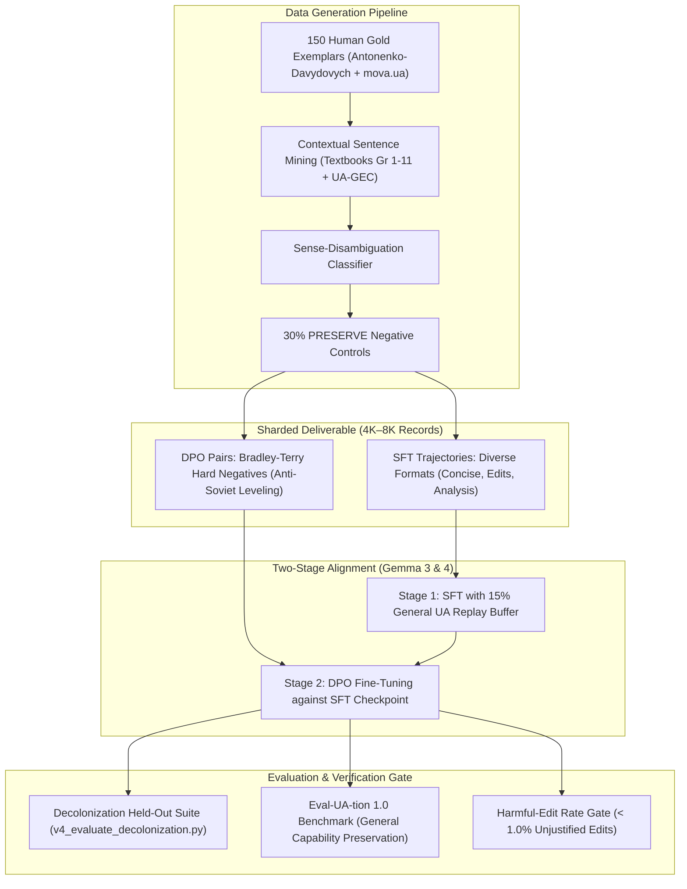

# Architecture Specification: Ukrainian Linguistic Decolonization & Reasoning (ULDR) — Phase 2 & Production Roadmap

> **Status:** Approved Architecture Draft
> **Stream Epic:** #6321 (Open Model Data) / Task #7922
> **Participating Agent Deliberation:** Yellow Team (Gemini/AGY), Blue Team (Claude Fable 5.1), Red/Alternate (Codex GPT-6.0 Astra)
> **Target Models:** Google Gemma 3 (4B, 12B, 27B) and Gemma 4 architectures

---

## 1. Executive Summary & Problem Formulation

Pre-trained foundation models (both commercial frontier systems and open-weight architectures) exhibit systematic Soviet-era lexical leveling and Russian-influenced syntactic distortions in Ukrainian. This stems directly from the **Triad of False Authority**:
1. **Soviet Prescriptive Bias:** Digitized post-1930s lexicography (especially СУМ-11) artificially elevated Russian cognates (*мисль*, *задача*, *по крайній мірі*) while labeling authentic Ukrainian vocabulary as archaic, regional, or rare.
2. **Pre-Soviet Ethnographic Anachronisms:** Dictionaries such as Grinchenko 1907 reflect late 19th-century folk-ethnographic idioms (*мати на мислі*), which automated classifiers mistake for living contemporary standards.
3. **Morphological Blindness:** Morphological engines such as VESUM (409K lemmas, 6.7M forms) verify inflectional existence, not semantic or register appropriateness.

Phase 1 established the **v1 Pilot**: 1,200 SFT trajectories and 1,200 contrastive DPO pairs across 4 shards, validated against VESUM (100%), MESU Grade 1–11 textbooks (82.75%), and academic dictionaries (85.33%), evaluated with a zero-leakage cryptographic partition firewall and an automated 5-metric test harness (`v4_evaluate_decolonization.py`).

**Phase 2 expands the program from a pilot into a complete production alignment release.** Based on tri-family multi-agent deliberation between Gemini, Claude (Fable 5.1), and Codex (GPT-6.0), this architecture formalizes the structural transitions required to produce a robust, open-weight Ukrainian foundation model.

---

## 2. Core Paradigm Shifts (From Pilot to Production)

### 2.1 From "Lexical Replacement" to "Contextual Decision & Preservation"

In naive calque checkers, every prompt is assumed to be an error requiring correction. This inevitably trains the model to become an aggressive, hyper-purist over-corrector that damages valid literary, colloquial, and technical Ukrainian.

In Phase 2, the fundamental data unit is a **Contextual Decision**, supporting five explicit outcomes:
1. `correct`: Active calque or Russianism with attested living Ukrainian replacement.
2. `preserve` (~30% of corpus): Authentic, valid Ukrainian where the model explicitly affirms that no correction is needed (negative control).
3. `offer_register_alternatives`: Contexts where multiple alternatives are legitimate across different stylistic registers (e.g. conversational vs. formal administrative).
4. `request_context`: Polysemic words whose correctness depends entirely on missing surrounding context (e.g. *мисль* in poetic citation vs. business correspondence).
5. `insufficient_evidence`: Dialectal, regional, or disputed forms where the honest model response is calibrated uncertainty.

### 2.2 Decoupling Evidence Dossiers from Response Formats

The Phase 1 pilot enforced a rigid 5-step numbered reasoning template (`"1. Етимологія... 2. Питома модель... 3. Морфологічна верифікація... 4. Реєстрове узгодження... 5. Висновок..."`).

While structured evidence is essential internally, forcing this output format onto all responses turns the model into a formulaic pedant. Phase 2 maintains an internal structured evidence dossier while varying the learner-facing output across four response types:
- **Concise Direct Tip (40%):** Natural 1–2 sentence answer for everyday conversational queries.
- **Minimal Edit (25%):** Direct in-line sentence rewrite preserving author voice and meaning.
- **Grammatical Contrast (20%):** Clear side-by-side explanation of the underlying linguistic mechanism.
- **Full Historical/Sociolinguistic Analysis (15%):** Comprehensive trace of historical suppression, Soviet leveling, and living restoration.

### 2.3 Replacing Regex with Semantic Grounding Verification

Phase 1 automated tests demonstrated that regex heuristics cannot reliably evaluate whether a complex reasoning explanation actually supports its recommendation. Phase 2 bounds regex strictly to structural integrity (IDs, schemas, VESUM counts, string separation) and delegates semantic grounding evaluation to a calibrated Natural Language Inference (NLI) model and blinded cross-family judges.

---

## 3. The 150 Human Gold Seeds Blueprint

Automated rule-based scripts cannot independently resolve the subtle semantic and syntactic frontiers of decolonization. Phase 2 resolves the gold-seed debt by authoring **150 deeply researched human gold exemplar records** across seven priority categories:

| Priority Category | Gold Count | Core Linguistic Frontier | Primary Source Grounding |
| :--- | :---: | :--- | :--- |
| **1. Polysemy & Sense Disambiguation** | 35 | *рахувати* vs *вважати*, *відноситися* vs *ставитися/належати*, *складати* | Antonenko-Davydovych ch. 4; MESU Math & Literature |
| **2. Prepositional Government** | 25 | Un-Ukrainian *по* (*по закону* $\rightarrow$ *за законом*, *по справах* $\rightarrow$ *у справах*), *при* | Antonenko-Davydovych ch. 7; Ukrainian State Standard |
| **3. Active Present Participles** | 25 | Calqued *-чий / -ший* (*працюючий*, *діючий*, *головуючий*) $\rightarrow$ native adjectives, nouns, or relative clauses | Antonenko-Davydovych ch. 5; Pravopys 2019 § 118 |
| **4. Voice, Reflexivity & Argument Structure** | 20 | Passive *-ся* (*закон приймається*) $\rightarrow$ impersonal *-но/-то* (*закон прийнято*) or active voice | Antonenko-Davydovych ch. 5; Classic literary corpus |
| **5. Historical Authority & Conflicting Lexicography** | 15 | *мисль* vs *думка*, pre-Soviet ethnographic folk idioms vs. Soviet leveling in СУМ-11 | Grinchenko 1907 vs. СУМ-11 vs. СУМ-20 |
| **6. Phraseology & Collocations** | 15 | *приймати участь* $\rightarrow$ *брати участь*, *кидатися в очі* $\rightarrow$ *впадати в очі* | Frazeolohichnyi Slovnyk; *mova.ua* |
| **7. Lexical Interference & Restitution** | 15 | Direct calques (*пилосос*, *переключити*, *задачі*) and purged technical terminology | 1930s Terminological Bulletins; VESUM |
| **Total Human Gold Exemplars** | **150** | Fully adjudicated, multi-turn, multi-format seeds | |

### Primary Corpus Grounding for Human Curation

- **Борис Антоненко-Давидович *«Як ми говоримо»*:** 342 in-depth chapters fully indexed in `data/sources.db` (table `style_guide`), providing etymological, literary, and register evidence.
- **`mova.ua` (Мова — ДНК нації):** Target for planned ingestion, providing living contemporary conversational Surzhyk and calque transitions.
- **MESU Grades 1–11 School Textbooks:** 52,000+ chunks in `data/sources.db` (table `textbooks`) providing living classroom citations.

---

## 4. Production Dataset Sizing & Curriculum Architecture

The production dataset expands through context-conditioned mining around the 150 phenomenon clusters:

### Dataset Budget & Composition

- **SFT Reasoning Trajectories:** 4,000 – 6,000 independent contextual examples.
- **Contrastive DPO Pairs:** 2,000 – 3,000 sharply-contrasted preference pairs.
- **Replay Buffer:** 10–20% ordinary Ukrainian general instruction tokens mixed into SFT training to prevent catastrophic forgetting.

---

## 5. Model Training, Checkpoint Release & Evaluation Gates

### 5.1 Training Specifications

- **Target Backbone:** Google Gemma 3 (12B-it) as primary production driver; Gemma 3 (4B-it) for edge deployment; Gemma 4 dense/MoE architectures.
- **Framework:** Unsloth QLoRA / Hugging Face TRL (`docs/projects/open-model-data/decolonization-training-guide.md`).
- **Precision:** 4-bit / 8-bit quantized LoRA with 16-bit brain floating point (`bfloat16`).
- **Reference Model:** The SFT-adapted checkpoint serves as the explicit reference model $\pi_{\text{ref}}$ during Stage 2 DPO.

### 5.2 Release & Acceptance Criteria

A model checkpoint is admitted for public Hugging Face release only when satisfying three non-negotiable gates:
1. **Calque Elimination & Reasoning Gate:** $\ge 90.0\%$ Calque Elimination Rate and $\ge 85.0\%$ Reasoning Grounding Rate on held-out test partitions.
2. **Harmful-Edit Rate Gate:** $\le 1.0\%$ unjustified modifications on already-correct Ukrainian passages (`PRESERVE` validation).
3. **General Non-Inferiority Margin:** $\le 1.5\%$ regression on standard Ukrainian NLP benchmarks (**Eval-UA-tion 1.0** and clean **UA-GEC** held-out splits).

---

## 6. Execution Roadmap & Milestones

- **Milestone 1 (Immediate / In-Flight):** Merge PR #7984, completing the v1 Pilot deliverable, clean dataset shards, and UNLP paper draft.
- **Milestone 2 (Empirical Canary Run):** Train the first Gemma-3-12B canary checkpoint on the 1,200 pilot shards with a 15% general Ukrainian replay buffer; benchmark on Eval-UA-tion 1.0.
- **Milestone 3 (Gold Seed Authoring):** Author the 150 Human Gold Seeds using Antonenko-Davydovych (`sources.db`) and modern transitions (`mova.ua`).
- **Milestone 4 (Contextual Generator & Production Shards):** Deploy the contextual sentence generator with 30% `preserve` cases, generating the 6K SFT + 3K DPO production corpus.
- **Milestone 5 (Final Release):** Fine-tune production Gemma 3 / Gemma 4 checkpoints, verify against the three release gates, and publish open weights to Hugging Face.
