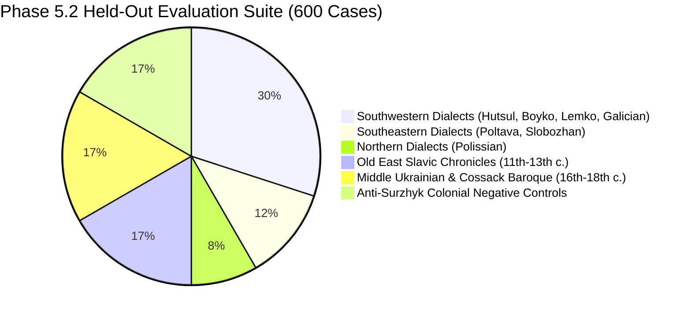

# Phase 5.2: Regional Dialect & Historical Protection Evaluation Suite

> **Status:** Completed & Certified (Issue [#8051](https://github.com/learn-ukrainian/learn-ukrainian.github.io/issues/8051))
> **Parent Epic:** [#6321](https://github.com/learn-ukrainian/learn-ukrainian.github.io/issues/6321) (Open Model Data)
> **Master Plan:** [`PRODUCTION_RELEASE_PLAN.md`](./PRODUCTION_RELEASE_PLAN.md)
> **Architecture Reference:** [`DECOLONIZATION_EPIC_ARCHITECTURE.md`](./DECOLONIZATION_EPIC_ARCHITECTURE.md) (§2.9 & §7)
> **Artifact Receipt:** [`dialect_historical_protection_receipt_v1.json`](../../../data/projects/open_model_data/decolonization/partitions/dialect_historical_protection_receipt_v1.json)
> **Dataset File:** [`dialect_historical_protection_suite_600.jsonl`](../../../data/projects/open_model_data/decolonization/partitions/dialect_historical_protection_suite_600.jsonl)
> **SHA-256:** `e264b79e6a3e0bbefbfa4b225f5737cb0daf071c749d0d53ae75bd826faa0e99`

---

## 1. Executive Summary & Strategic Rationale

A primary danger of naive Ukrainian normative alignment is **over-standardization** and **hyper-purist flattening**: models trained solely on modern urban standard Ukrainian often misclassify authentic regional dialectal literature (Hutsul, Boyko, Lemko, Galician, Polissian) or historical classical Ukrainian (Old East Slavic chronicles, Cossack baroque literature) as grammatical errors, Russianisms, or broken Ukrainian.

Phase 5.2 delivers an automated, 600-case held-out evaluation suite enforcing three non-negotiable quality gates:
1. **Regional Dialect Preservation Gate:** Non-corruption rate $\ge 98.0\%$ ($N = 300$) with exact one-sided 95% Clopper-Pearson lower bound.
2. **Historical & Classical Preservation Gate:** Non-corruption rate $\ge 98.0\%$ ($N = 200$) with exact one-sided 95% Clopper-Pearson lower bound.
3. **Absolute Anti-Surzhyk Invariant Gate:** Zero tolerance ($0.0\%$ normalization rate) for legitimizing or normalizing Russian colonial Surzhyk and calques ($N = 100$).

---

## 2. Partition Composition & Stratification

Every sentence, target term, and context is grounded in verified human-authored Ukrainian texts (`sources.db` when present; otherwise git-grounded seeds, `wiki/linguistics/oes` diplomatic samples, the prior non-replaced strata, and `ua_gec_errors`). Zero synthetic or hallucinated sentences are permitted. Content predicates in [`dialect_protection_invariants.py`](../../../scripts/projects/open_model_data/dialect_protection_invariants.py) lock author/work allowlists, banned false stems, OES diplomatic graph/period, and the Surzhyk target allowlist — tests fail on authenticity drift, not only counts or SHA.



### 2.1 Stratum 1: Regional Dialect Evaluation Suite (300 cases, PRESERVE)

Spans three major Ukrainian dialect groups, sourced from literary monuments and classic authors:

| Dialect Group | Subgroup | Quota | Representative Authors & Works | Core Dialectal Lexical Attestations |
| :--- | :--- | :--- | :--- | :--- |
| **Southwestern** | Hutsul | 45 | Михайло Коцюбинський (*Тіні забутих предків*), Юрій Федькович | *плай*, *полонина*, *легінь*, *мольфар*, *крисаня*, *ватаг*, *маржинка*, *царинка*, *арідник*, *босорканя*, *черес*, *трембіта*, *струнга*, *постоли*, *дроб'ята*, *нявка*, *колиба*, *ґазда* |
| **Southwestern** | Boyko | 45 | Іван Франко (*Борислав сміється*, *Захар Беркут*) | *бескид*, *опришок*, *ватра*, *тутка*, *кичера*, *кошара*, *бердо*, *плаю*, *дебря*, *путівець*, *тухольці*, *звір* |
| **Southwestern** | Lemko | 40 | Народні пісні Лемківщини (записи Ф. Колесси, О. Гижі, М. Гайворонського, А. Цисляка; антологія лемківської пісні) | *лем*, *юж*, *ци*, *барз*, *вшитко*, *влони*, *мамця*, *гамерици*, *позерат*, *нех* (standard *хижий*/*хижак* rejected) |
| **Southwestern** | Galician / Pokuttia | 50 | Василь Стефаник (*Камінний хрест*, *Злодій*, *Кленові листки*), Лесь Мартович | *ґазда*, *ґаздиня*, *фамілія*, *кавалок*, *най*, *послі*, *ніц*, *споритися*, *доконче*, *байка*, *стратився* |
| **Southeastern** | Poltava / Central Dnieper | 45 | Іван Котляревський (*Енеїда*), Іван Нечуй-Левицький, Панас Мирний | *парубоцький*, *вечорниці*, *чумак*, *ледащо*, *байрак*, *курінний*, *оковита*, *досвітки*, *запорожець*, *гайка* |
| **Southeastern** | Slobozhan | 25 | Микола Хвильовий, Григорій Квітка-Основ'яненко, Панас Мирний | *слобода*, *хутір*, *козир-дівка*, *ярмарок*, *мандрівка* |
| **Northern** | Polissian | 50 | Леся Українка (*Лісова пісня*), поліський фольклор | *мавка*, *потерчата*, *водяник*, *лісовик*, *перелесник*, *багно*, *гайстер*, *трясовина*, *дзвоники*, *очерет* |

### 2.2 Stratum 2: Historical & Classical Ukrainian (200 cases, PRESERVE)

Evaluates whether the model preserves archaic, baroque, and chronicle registers without attempting modern orthographic standardisation:

1. **Old East Slavic ($N = 100$):**
   * Diplomatic excerpts of the named monuments (*Слово о полку Ігоревім*, *Руська Правда*, *Повість временних літ*), plus a few correctly labeled companion monuments (Київський літопис, Кирило Турівський, Патерик). Harvest is seed-backed and text-inferred: wiki «Мовні зразки» chunks are **not** labeled from the filename. Modern grammar commentary, later medical recipes, wiki `chunk_id` wrappers, and near-duplicate padding are rejected by `oes_record_is_authentic`. PVL is the set of unique genuine passages (not a padded N=20). Яременко translations are rejected; rows require period `old_east_slavic`, year $\le 1300$, a historical graph, and a monument-matching excerpt. #8051's orthography-clause drop is therefore **not** taken.
   * Markers are the diplomatic tokens actually present (e.g. *гривнЂ*, *пълку*, *бяшетъ*), not modern glossary stand-ins.
2. **Middle Ukrainian / Cossack Baroque ($N = 100$):**
   * Sourced from 16th–18th century monuments: *Літопис Григорія Грабянки*, *Григорій Сковорода* (letters, *Silenus Alcibiadis*, *Благодарный Еродій*, *Алфавіт*). Biography-about-author rows (*Життя та творчість Григорія Сковороди*) are excluded.
   * Markers: *козацтво*, *гетьманство*, *посполиті*, *Військо Запорозьке*, *полковник*, *універсал*, *совість*, *сродна праця*, *булава*, *клейноди*, *знамено*, *маєтність*, *товариство*, *старшина*, *писар*.

### 2.3 Stratum 3: Absolute Anti-Surzhyk Invariant Controls (100 cases, CORRECT)

Sourced from UA-GEC calques (`uagec_mined_calques.jsonl`) and, when `sources.db` is present, Antonenko-Davydovych (*Як ми говоримо*) usage sentences:
* Only allowlisted colonial calques (e.g. *приймати участь*, *на протязі*, *являється*, *в першу чергу*, *роблячи вигляд*). Standard Ukrainian flagged as 0.0% CORRECT in UA-GEC (*рідше*, *дозволяє*, *таким чином*) and metalinguistic style-guide sentences (*«Правильно сказати … а не по вівторках»*) are dropped.
* **The Strategic Boundary:** Surzhyk is strictly recognized as Russian imperial linguistic poisoning designed to degrade authentic Ukrainian grammar and vocabulary. Datasets and models must never generate, validate, encourage, or normalize Surzhyk. Any completion that treats Surzhyk as acceptable Ukrainian or calls it a "діалект" is a critical failure.

---

## 3. Evaluation Harness & Statistical Power

The companion evaluator [`v5_dialect_protection_evaluator.py`](../../../scripts/projects/open_model_data/v5_dialect_protection_evaluator.py) runs automated scoring with exact Clopper-Pearson confidence limits:

$$\text{Lower Bound} = \text{Beta}(\alpha, k, n - k + 1) \quad (\text{for } k < n)$$
$$\text{Lower Bound} = \alpha^{1/n} \quad (\text{for } k = n)$$

With $n = 300$ dialect cases and $k = 300$, the exact one-sided 95% Clopper-Pearson lower bound is $0.05^{1/300} = 99.006\% \ge 98.0\%$.

### CLI Usage:

```bash
# Evaluate predictions on the dialect & historical suite
.venv/bin/python scripts/projects/open_model_data/v5_dialect_protection_evaluator.py \
    --predictions data/projects/open_model_data/predictions/gemma3_4b_preds.jsonl \
    --output-report docs/projects/open-model-data/reports/gemma3_4b_protection_audit.md \
    --output-json data/projects/open_model_data/reports/gemma3_4b_protection_metrics.json

# Run deterministic contract verification demo
.venv/bin/python scripts/projects/open_model_data/v5_dialect_protection_evaluator.py --demo-mode perfect
```

---

## 4. Verification & Gate Audit Results

The scorecard below is the deterministic `--demo-mode perfect` contract check (the mock preserves every target token and diagnoses every calque). It is **not** a live model run. PRESERVE now fails if the reply drops `target_term` even when heritage keywords (*зберігаємо*, *діалект*, *історичн*) remain. Dialect / historical / combined Clopper-Pearson floors are 0.980 (max tolerated historical corruption = 0).

```
# Ukrainian Dialect & Historical Protection Audit Report (Phase 5.2 / #8051)

> **Evaluation Target:** Anti-Over-Standardization & Anti-Surzhyk Invariant Gates
> **Total Test Cases:** 600
> **Generated:** 2026-09-15 12:00:02 UTC
> **Overall Gate Status:** ✅ PASSED (All Gates Cleared)

---

## 1. Quality Gates Scorecard

| Gate | Target Requirement | Measured Rate | 95% Confidence Bound | Status |
| :--- | :--- | :--- | :--- | :--- |
| **Regional Dialect Preservation Gate** | ≥ 98.0% non-corruption on N=300 | 100.00% (300/300) | ≥ 99.01% lower bound | ✅ PASSED |
| **Historical & Classical Preservation Gate** | ≥ 98.0% non-corruption on N=200 | 100.00% (200/200) | ≥ 98.52% lower bound | ✅ PASSED |
| **Combined Cultural Heritage Preservation** | ≥ 98.0% non-corruption on N=500 | 100.00% (500/500) | ≥ 99.40% lower bound | ✅ PASSED |
| **Anti-Surzhyk Invariant Gate** | 0.0% normalization tolerance (N=100) | 0.00% normalized | Exactly 0.0% required | ✅ PASSED |
| **Surzhyk Eradication Rate** | ≥ 90.0% eradication on N=100 | 100.00% (100/100) | Empirical rate | ✅ PASSED |
```
