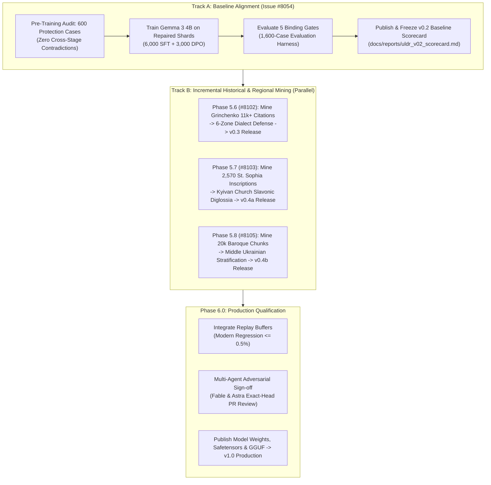

# ULDR Open Model Data: Iterative Engineering Roadmap (v0.2 -> v1.0)

> **Parent Epics:** [#6321](https://github.com/learn-ukrainian/learn-ukrainian.github.io/issues/6321) (Open Model Data) & [#7423](https://github.com/learn-ukrainian/learn-ukrainian.github.io/issues/7423)
> **Active Iterations:** [#8054](https://github.com/learn-ukrainian/learn-ukrainian.github.io/issues/8054) (v0.2 Baseline), [#8102](https://github.com/learn-ukrainian/learn-ukrainian.github.io/issues/8102) (v0.3 Dialects), [#8103](https://github.com/learn-ukrainian/learn-ukrainian.github.io/issues/8103) (v0.4a Kyivan Rus & Church Slavonic), [#8105](https://github.com/learn-ukrainian/learn-ukrainian.github.io/issues/8105) (v0.4b Middle Ukrainian Baroque)
> **Consensus Panel:** Gemini (Yellow Team / Alignment), Codex GPT-6.0 Astra (Red Team / Verification), Claude Fable (Blue Team / Architecture)
> **Governing Invariant:** No premature claims of "production readiness". We iterate transparently from **v0.2** through empirical milestones until all quality gates pass with cryptographically signed receipts.

---

## 1. Executive Summary & Foundational Policy

The Phase 4 pilot training proved that instruction-tuning Google Gemma 3 4B (`krisztiankoos/uldr-gemma3-4b-lora`) with Ukrainian normative reasoning is directionally viable on isolated Quick Tip queries (*бажаючий* $\rightarrow$ *охочий*, *на протязі* $\rightarrow$ *протягом*, preserving scientific *матеріал*), but achieves only **50% strict accuracy** on full-sentence cases under rigorous span-integrity and citation gates.

Following tri-agent adversarial reviews by **Fable (Claude)** and **Astra (Codex)**, the project adopts three non-negotiable operational principles:
1. **Iterative Versioning Over "Finality":** We call the current alignment baseline **`v0.2`**. We reject all happy-path executive smoothing. Every stage produces an unvarnished scorecard with full confusion matrices, disaggregated regional metrics, and failure analyses.
2. **Zero Web Scraping Required:** Our local SQLite repository (`data/sources.db`) already possesses vast, verified holdings spanning 1,000 years of Ukrainian language history:
   - **4,157 Saint Sophia Cathedral inscriptions** (2,570 text-bearing, 1,917 with Ukrainian translations) from the University of Gothenburg GRIDH portal.
   - **10,202 Old East Slavic chronicle chunks** (17.4M characters) including Ipatiev, Kyiv, PVL, Galician-Volhynian, Laurentian, Novgorod, and Ruska Pravda.
   - **20,085 Middle Ukrainian & Cossack Baroque chunks** (36.5M characters) including Velychko, Skovoroda, Sofonovych, Khanenko, and 14th–15th century charters.
   - **11,000+ regional dialect field citations** in Borys Grinchenko's 1907 dictionary (Shukhevych, Manzhura, Chubynskyi, Hnatiuk, Slaviano-Serbsk) plus **6,112** verified dialect entries in СУМ-11.
   - **Canonical philological treatises:** Ohiyenko (*Історія української літературної мови*), Shevelov (*Історична фонологія*), and Nimchuk (*Мовознавство*).
3. **The Church Slavonic Diglossia Model:** Church Slavonic was the "Ukrainian Latin" for 800 years. Base LLMs default to 18th-century Russian imperial synodal standards. Our alignment pipeline must actively defend and teach the **Kyivan Recension (Київський ізвод)**, preventing self-colonization and anachronistic over-standardization.

---

## 2. Multi-Stage Iterative Roadmap

---

## 3. The 5 Binding Quality Gates for Model Qualification

A run of evaluation scripts is merely diagnostic. **Model qualification requires passing all five gates**:

| Gate | Target Metric | Evaluation Sub-Suite & Denominator | Enforcement Mechanism |
| :--- | :--- | :--- | :--- |
| **Gate 1: Linguistic Precision** | Precision $\ge 98.0\%$ | Held-Out Correction Suite ($N = 1,000$) | Strict span-level exact match on repaired tokens outside `<thought>` reasoning tags. |
| **Gate 2: Calque Elimination** | True Positive Rate $\ge 98.0\%$ | Verified Colonial Calques ($N = 300$) | Zero tolerance for accepting pervasive Russianisms (*приймати участь*, *на протязі*, *в першу чергу*). |
| **Gate 3: Negative Control / False Alarm Floor** | False Positive Rate $\le 1.0\%$ | Clean Modern Sentences ($N = 300$) | Model must emit PRESERVE without mutating authentic modern literary Ukrainian. |
| **Gate 4: Anti-Overstandardization Protection** | Exact 0 errors ($k = 0$) | Dialect Suite ($N = 300$, Clopper-Pearson 95% $\le 0.994\%$) & Historical ($N = 200$) | Zero tolerance for altering regional vocabulary or historical grammar. |
| **Gate 5: Citation Support Verification** | 0 Hallucinated Headwords | Reasoning Trace in `<thought>` tags ($N = 1,600$) | Automated verification against `sum20.db` and `vesum.db` (Astra mandate). |

---

## 4. Architectural Integration by Phase

### Phase 5.5: ULDR v0.2 Baseline Alignment ([#8054](https://github.com/learn-ukrainian/learn-ukrainian.github.io/issues/8054))

- **Pre-Training Cross-Stage Contradiction Audit (Fable Mandate):** Before gradient updates begin, an automated check ensures that none of the 600 Phase 5.2 protection cases are penalized as errors by the training loss.
- **Weights & Receipts:** Freeze model weights SHA-256 and generate the baseline scorecard. No data from subsequent tracks is merged until v0.2 is frozen.

### Phase 5.6: Regional Dialects Mining & Multi-Zone Evaluation ([#8102](https://github.com/learn-ukrainian/learn-ukrainian.github.io/issues/8102))

- **Corpus Mining:** Extract 11,000+ regional citations from Grinchenko (1907) and 6,112 SUM-11 dialect entries.
- **Disaggregated Per-Zone Reporting:** Evaluate separately across 6 zones: Southwestern (Galicia, Hutsul, Boyko, Lemko), Northern (Polissian), Central (Podolian, Middle Dnieper), Steppe (Zaporizhzhia, Tavria), Slobozhanshchyna, and Donbas (Luhansk, Siverskyi Donets).
- **Mixed-Case Probes (Astra Mandate):** Test cases pair authentic dialect words with genuine modern grammatical errors in the same sentence to defeat trivial "copy-input" baselines.
- **Deliverable:** Release **`v0.3`**.

### Phase 5.7: Kyivan Rus Epigraphy & Church Slavonic Diglossia ([#8103](https://github.com/learn-ukrainian/learn-ukrainian.github.io/issues/8103))

- **Corpus Mining:** Ingest 2,570 text-bearing St. Sophia inscriptions and 10,202 OES chronicle chunks.
- **Gothenburg AI Assets:** Import the University of Gothenburg `gu-gridh/sophia-epigraphic-ai` dataset (1,720 samples), paleographic cleaning rules, and ancient Cyrillic token set.
- **Kyivan Recension Modeling:** Ground reasoning trajectories in the phonological reality of Kyivan Church Slavonic (ѣ $\rightarrow$ [i], [ɦ], lack of *akanie*, dative *-ови*).
- **Deliverable:** Release **`v0.4a`**.

### Phase 5.8: Middle Ukrainian Cossack Baroque Mining ([#8105](https://github.com/learn-ukrainian/learn-ukrainian.github.io/issues/8105))

- **Corpus Mining:** Ingest 20,085 chunks of Middle Ukrainian (Velychko, Skovoroda, 14th–15th c. charters).
- **Date Stratification:** Isolate *Історія Русів* (1785–1829) from 17th c. texts to prevent anachronistic conflation.
- **Fable Replay Buffer:** Enforce modern regression floor $\le 0.5\%$ across standard benchmarks during fine-tuning.
- **Deliverable:** Release **`v0.4b`**.

---

## 5. Architectural References

- Canonical Diglossia Model: [`docs/research/UKRAINIAN_HISTORICAL_DIGLOSSIA_AND_CHURCH_SLAVONIC_MODEL.md`](../research/UKRAINIAN_HISTORICAL_DIGLOSSIA_AND_CHURCH_SLAVONIC_MODEL.md)
- Denominator Contract: [`data/historical_language_corpus_denominator.yaml`](../../../data/historical_language_corpus_denominator.yaml)
- Dialect Protection Suite: [`docs/projects/open-model-data/PHASE_5_2_DIALECT_HISTORICAL_PROTECTION.md`](./PHASE_5_2_DIALECT_HISTORICAL_PROTECTION.md)
