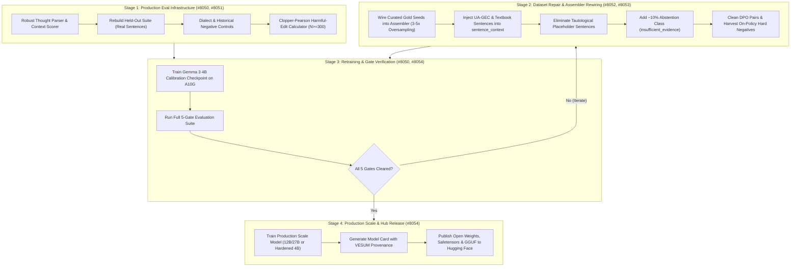

# ULDR Open Model Data: Master Plan to Production Release

> **Parent Epics:** [#6321](https://github.com/learn-ukrainian/learn-ukrainian.github.io/issues/6321) (Open Model Data) & [#7423](https://github.com/learn-ukrainian/learn-ukrainian.github.io/issues/7423)
> **Consensus Panel:** Gemini (Yellow Team / Alignment), Codex GPT-6.0 Astra (Red Team / Verification), Claude Fable (Blue Team / Architecture)
> **Governing Mission:** Grammatical correctness, syntactic discipline, and decolonization over bulk token volume or conversational fluency. Base models provide fluency; ULDR provides pedagogical and linguistic precision.

---

## 1. Executive Summary & Problem Statement

The Phase 4 pilot training proved that instruction-tuning Google Gemma 3 4B (`krisztiankoos/uldr-gemma3-4b-lora`) with Ukrainian normative reasoning is directionally sound: in Quick Tip format, the model achieves **80% accuracy** on isolated terms (*бажаючий* $\rightarrow$ *охочий*, *на протязі* $\rightarrow$ *протягом*, preserving scientific *матеріал*).

However, an empirical inspection and tri-agent adversarial audit revealed that **the current data pipeline cannot support a production release**:
1. **0% Gold Seeds in Training:** The 150 curated seeds were never loaded into the production training assembler (`v4_production_shards_assembly.py`).
2. **Tautological Placeholder Sentences:** All 1,050 "minimal edit" training examples used the generic fallback sentence: `«У тексті вжито ненормативну форму X замість питомого слова.»` instead of real sentences. This trained the model to blindly swap words into arbitrary slots, causing **collocation corruption** (*побитися об заклад* $\rightarrow$ *побитися об друга*).
3. **Over-Preservation Bias:** 1,800 PRESERVE examples (30%) were rendered as rigid boilerplate (*«Вердикт PRESERVE: «X» залишаємо»*), leading the model to ignore pervasive calques like *приймати участь* in formal sentences.
4. **Citation Hallucinations:** Rigorous template formatting forced the model to cite a dictionary name and count for every entry, prompting the base model to hallucinate foreign dictionary names (*COBUILD*, *LexicalLab*) when it lacked Ukrainian dictionary memory.
5. **Damaged DPO Pairs:** Preference pairs contained length-padding hacks (*«Так. Так. Так. Так.»*), English leaks, and truncated words (*«відповідає акад»*).

**Conclusion:** Phase 5 is restructured from a direct release into a **Data Repair, Infrastructure Hardening, and Production Verification Phase**.

---

## 2. The 4-Stage Production Roadmap

---

## 3. Stage Details & Concrete Deliverables

### Stage 1: Production Evaluation Infrastructure ([#8050](https://github.com/learn-ukrainian/learn-ukrainian.github.io/issues/8050) & [#8051](https://github.com/learn-ukrainian/learn-ukrainian.github.io/issues/8051))
* **Objective:** Replace naive substring matching with a robust, token-sufficient GPU evaluation harness and a real-context held-out partition.
* **Key Tasks:**
  1. **Thought & Response Parser:** Split `<thought>` and `final_response` cleanly. Disallow malformed tags. Score quotation in reasoning as valid analysis, not failure to eliminate.
  2. **Held-Out Partition with Real Sentences:**
     * $N \ge 300$ clean authentic sentences for PRESERVE (stem, humanities, classic literature).
     * $N \ge 300$ authentic sentences with real calques from UA-GEC and textbooks for CORRECT.
     * High-Frequency Calque Floor: Dedicated 50-case benchmark of pervasive Russianisms (*приймати участь*, *на протязі*, *приймати міри*, *рахувати що*).
  3. **Dialect & Historical Protection Suite ([#8051](https://github.com/learn-ukrainian/learn-ukrainian.github.io/issues/8051)):**
     * Regional Ukrainian (Galician, Podolian, Polissian, Transcarpathian) and 1920s classic prose (Pidmohylny, Khvylovy, Skovoroda).
     * Must be preserved intact; zero unauthorized standardization allowed.

---

### Stage 2: Dataset Repair & Assembler Rewiring ([#8052](https://github.com/learn-ukrainian/learn-ukrainian.github.io/issues/8052) & [#8053](https://github.com/learn-ukrainian/learn-ukrainian.github.io/issues/8053))
* **Objective:** Fix the root causes of collocation mutations, over-preservation, and citation hallucinations.
* **Key Tasks:**
  1. **Wire and Oversample Gold Seeds ([#8052](https://github.com/learn-ukrainian/learn-ukrainian.github.io/issues/8052)):**
     * Connect `human_gold_seeds_150_trajectories.jsonl` directly into `v4_production_shards_assembly.py`.
     * Oversample curated seeds 3–5× in SFT training.
     * Expand coverage across all 7 core categories to ~350 exemplars.
  2. **Inject Real Sentence Contexts ([#8053](https://github.com/learn-ukrainian/learn-ukrainian.github.io/issues/8053)):**
     * Pass authentic sentences from UA-GEC (2,856 error spans), textbooks (379 contrast tables), and ZNO items into `sentence_context`.
     * Completely remove the line 284–285 fallback: `ctx_err = "У тексті вжито ненормативну форму X..."`.
  3. **Natural PRESERVE Voice:**
     * Replace rigid `«Вердикт PRESERVE: «X» залишаємо»` boilerplate with natural pedagogical prose: `«Речення нормативне і не потребує редагування...»`.
  4. **Abstention Class (~10%):**
     * Add `insufficient_evidence` examples where the prompt lacks enough context to decide, teaching the model to decline edits rather than hallucinating citations.
  5. **DPO Pair Overhaul:**
     * Strip length-padding hacks (`"Так. Так. Так."`) and English leaks.
     * Incorporate on-policy hard negatives harvested from the pilot 4B model (*«побитися об друга»* as rejected response).

---

### Stage 3: Verification & Retraining on Gemma 3 4B
* **Objective:** Retrain the calibration adapter on A10G GPU and verify all 5 hard quality gates.
* **The 5 Binding Quality Gates:**
  1. **Gate 1: Calque Elimination Rate:** $\ge 90.0\%$ on the held-out CORRECT suite.
  2. **Gate 2: Harmful-Edit Rate:** $\le 1.0\%$ exact one-sided 95% Clopper-Pearson upper bound on $N \ge 300$ clean sentences ($k = 0$ errors).
  3. **Gate 3: Span Integrity Gate:** 100% preservation of uncorrupted text outside the designated error span. Zero collocation mutations allowed.
  4. **Gate 4: Citation Whitelist Gate:** 100% of named citations must match approved Ukrainian authorities (ВЕСУМ, СУМ-20, Правопис 2019, Антоненко-Давидович, Грінченко, УЛІФ, UA-GEC). 0% hallucinated sources (*COBUILD*, *LexicalLab*).
  5. **Gate 5: High-Frequency Calque Floor:** 100% recall on the 50 most common Ukrainian calques.

---

### Stage 4: Production Model Scaling & Hub Release ([#8054](https://github.com/learn-ukrainian/learn-ukrainian.github.io/issues/8054))
* **Objective:** Train final production weights, produce complete documentation, and publish open weights.
* **Key Tasks:**
  1. **Full-Scale Alignment Training:** Train the hardened dataset on target scale (Gemma 3 12B/27B or Gemma 4 31B, with fallback to production-hardened 4B).
  2. **Hugging Face Release:**
     * LoRA adapter weights and merged 16-bit safetensors.
     * GGUF quants (Q4_K_M, Q8_0) for local Ollama / llama.cpp deployment.
     * Dataset cards for public training and evaluation shards.
  3. **Model Card & Audit Report:**
     * Complete pedagogical documentation, MESU/VESUM linguistic provenance, and decolonization rubric.
     * Full evaluation audit certifying compliance across all 5 production gates.
