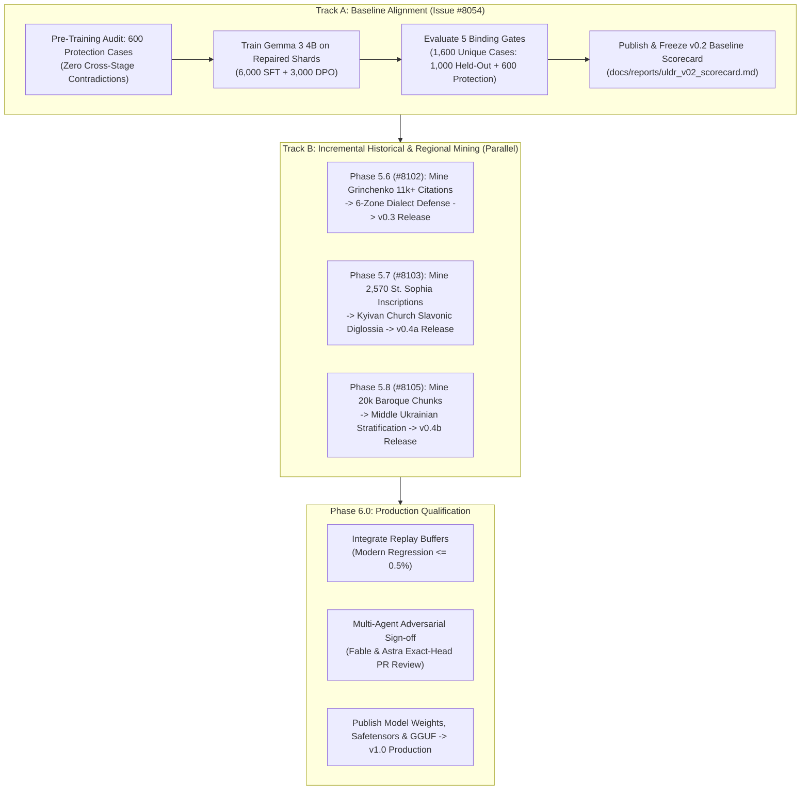

# ULDR Open Model Data: Iterative Engineering Roadmap (v0.2 -> v1.0)

> **Parent Epics:** [#6321](https://github.com/learn-ukrainian/learn-ukrainian.github.io/issues/6321) (Open Model Data) & [#7423](https://github.com/learn-ukrainian/learn-ukrainian.github.io/issues/7423)
> **Active Iterations:** [#8054](https://github.com/learn-ukrainian/learn-ukrainian.github.io/issues/8054) (v0.2 Baseline), [#8102](https://github.com/learn-ukrainian/learn-ukrainian.github.io/issues/8102) (v0.3 Dialects), [#8103](https://github.com/learn-ukrainian/learn-ukrainian.github.io/issues/8103) (v0.4a Kyivan Rus & Church Slavonic), [#8105](https://github.com/learn-ukrainian/learn-ukrainian.github.io/issues/8105) (v0.4b Middle Ukrainian Baroque)
> **Consensus Panel:** Gemini (Yellow Team / Alignment), Codex GPT-6.0 Astra (Red Team / Verification), Claude Fable (Blue Team / Architecture)
> **Governing Invariant:** No premature claims of "production readiness". We iterate transparently from **v0.2** through empirical milestones until all quality gates pass with cryptographically signed receipts.

---

## 1. Executive Summary & Foundational Policy

The Phase 4 pilot training proved that instruction-tuning Google Gemma 3 4B (`krisztiankoos/uldr-gemma3-4b-lora`) with Ukrainian normative reasoning is directionally viable on isolated Quick Tip queries (*бажаючий* $\rightarrow$ *охочий*, *на протязі* $\rightarrow$ *протягом*, preserving scientific *матеріал*), but achieves only **50% strict accuracy** on full-sentence cases under rigorous span-integrity and citation gates.

Following tri-agent adversarial reviews by **Fable (Claude)** and **Astra (Codex)**, the project adopts three non-negotiable operational principles:
1. **Iterative Versioning Over "Finality":** We call the current alignment baseline **`v0.2`**. We reject all happy-path executive smoothing. Every stage produces an unvarnished scorecard with full confusion matrices, disaggregated regional metrics, and failure analyses.
2. **Zero Web Scraping Required:** Our local SQLite repository (`data/sources.db`) already possesses vast, verified holdings spanning 1,000 years of Ukrainian language history:
   - **4,157 Saint Sophia Cathedral inscriptions** in `historical_source_records` from the University of Gothenburg GRIDH portal (`https://saintsophia.dh.gu.se/`). The entire table contains 4,157 records (4,144 categorized as `text_bearing` on the portal, 11 non-textual drawings, 2 quarantined metadata records; 2,100 records with parsed EpiDoc XML [satisfying SQL predicate `trim(coalesce(epidoc_text,'')) != '' OR trim(coalesce(epidoc_interpretation,'')) != ''`, comprising 2,100 non-empty `epidoc_text` and 1,033 non-empty `epidoc_interpretation` field occurrences], 1,917 with Ukrainian translations `translation_ukr`, and 2,956 with Ukrainian commentary `commentary_ukr`). Within this collection, the documented usable-transcription subset comprises exactly **2,570** records satisfying SQL predicate `disposition = 'text_bearing' AND original_transcription IS NOT NULL AND trim(original_transcription) != ''`. Within this 2,570 subset, **1,915** have Ukrainian translations and **1,382** have Ukrainian commentary.
   - **10,202 Old East Slavic chronicle chunks** (17,421,735 characters, verified SQLite snapshot) including Ipatiev, Kyiv, PVL, Galician-Volhynian, Laurentian, Novgorod, and Ruska Pravda.
   - **20,085 Middle Ukrainian & Cossack Baroque chunks** (36,561,300 characters, verified SQLite snapshot) including Velychko, Skovoroda, Sofonovych, Khanenko, and 14th–15th century charters.
   - **11,000+ regional dialect field citations** in Borys Grinchenko's 1907 dictionary (including historic field collections: Shukhevych 1,818, Chubynskyi 5,433).
   - **Clean Modern Lexical Authorities:** СУМ-20 (modern independent 20-volume dictionary), VESUM (409K lemmas, 6.7M forms), and УЛІФ. (СУМ-11 from the Russian-Soviet occupation [1970–1980] is strictly quarantined for Sovietization detection and contrastive calque analysis per `GEMINI.md`, never treated as an authority for authentic Ukrainian).
   - **Canonical philological treatises:** Ohiyenko (*Історія української літературної мови*), Shevelov (*Історична фонологія*), and Nimchuk (*Мовознавство*).
3. **The Church Slavonic Diglossia Model:** Church Slavonic was the "Ukrainian Latin" for 800 years. Base LLMs default to 18th-century Russian imperial synodal standards. Our alignment pipeline must actively defend and teach the **Kyivan Recension (Київський ізвод)**, preventing self-colonization and anachronistic over-standardization.

---

## 2. Multi-Stage Iterative Roadmap

---

## 3. The 5 Binding Quality Gates for Model Qualification

A run of evaluation scripts is merely diagnostic. **Model qualification requires passing all five gates** across the **1,600 unique evaluation cases**.

### 3.1 Evaluation Suite Structure & Denominator Breakdown

The evaluation denominator consists of exactly **1,600 unique, non-overlapping cases** partitioned across two suites:
1. **Held-Out Core Evaluation Suite ($N = 1,000$ unique cases):**
   - **400 Standard Literary Corrections:** Broad grammatical, agreement, government, and orthographic repair cases.
   - **300 Verified Colonial Calques:** Targets pervasive Russianisms (*приймати участь*, *на протязі*, *в першу чергу*, *попередити хворобу*). Contains the dedicated **50-case High-Frequency Common-Calque Floor** as an explicitly tracked priority subset.
   - **300 Clean Modern Controls:** Authentic standard literary Ukrainian sentences. Evaluated under Gate 3 to enforce zero harmful edits.
2. **Anti-Overstandardization Protection Suite ($N = 600$ unique cases, `dialect_historical_protection_suite_600.jsonl`):**
   - **300 Regional Dialect Cases:** Disaggregated across 6 historical-ethnographic zones (Southwestern, Northern, Central, Steppe, Slobozhanshchyna, Donbas).
   - **200 Historical & Classical Spans:** Old East Slavic chronicles, Cossack Baroque prose, 14th–15th c. charters, and 1920s Executed Renaissance literature.
   - **100 Anti-Surzhyk Conversational Controls:** Genuine Ukrainian spoken norms (*шо*, *всьо*, authentic idioms) falsely maligned by hyper-purist tools.

### 3.2 Binding Gates Table

| Gate | Target Metric | Evaluation Sub-Suite & Denominator | Enforcement Mechanism & Safety Invariants |
| :--- | :--- | :--- | :--- |
| **Gate 1: Linguistic Precision & Span Integrity** | Precision $\ge 98.0\%$ | Held-Out Core Suite ($N = 1,000$: 400 standard corrections + 300 calques + 300 clean controls) | **Strict 100% preservation outside designated error span.** Precision is defined as $\text{True Edits} / (\text{True Edits} + \text{False Edits})$, where True Edits are defined strictly as *correct* repairs matching accepted reference answers within target spans. Any incorrect in-span replacement, hallucinated repair, unintended rephrasing, or mutation on the 300 clean controls counts as a False Edit. Non-target tokens in true edits must be byte/token-identical. Zero unintended rephrasings or collocation mutations permitted (e.g. *побитися об заклад* $\rightarrow$ *побитися об друга*). |
| **Gate 2: Calque Elimination Rate** | True Positive Rate $\ge 98.0\%$ | Verified Colonial Calques ($N = 300$) | Zero tolerance for accepting pervasive Russianisms. Model must replace calques with authentic Ukrainian lexical equivalents. |
| **Gate 3: Negative Control / Harmful-Edit Floor** | Exact 0 observed errors ($k = 0$) | Clean Modern Sentences ($N = 300$, one-sided 95% Clopper-Pearson upper bound: $1 - 0.05^{1/300} \le 0.994\%$) | Model must emit PRESERVE without altering authentic modern literary Ukrainian. A single unprompted edit fails the gate. |
| **Gate 4: Anti-Overstandardization Protection** | Exact 0 observed errors ($k = 0$) | Protection Suite ($N = 600$, one-sided 95% Clopper-Pearson upper bound: $1 - 0.05^{1/600} \le \mathbf{0.499\%}$; per-partition dialect $N = 300 \le 0.994\%$) | Zero tolerance for altering regional vocabulary, historical grammar, or authentic spoken norms (*шо*, *всьо*). |
| **Gate 5: Citation Verification & Calque Floor** | 100% Citation Grounding & 100% High-Frequency Floor | Dedicated High-Frequency Calques ($N = 50$, priority subset of the 300 calques) & All Reasoning/Answer Citations ($N = 1,600$) | 1. **100% Recall on dedicated 50 most common calques.** 2. **0 Hallucinated Headwords or Senses:** Citations in `<thought>` reasoning traces and final answers must validate against named entries/senses in the approved positive authorities whitelist (`data/sources.db` tables `sum20_articles`/`sum20_senses`, `grinchenko`, `style_guide`; `data/vesum.db`; Правопис 2019; УЛІФ; UA-GEC). Note: Russian-Soviet occupation `sum11` is strictly quarantined for Sovietization detection and contrastive calque-reversal reasoning; any positive normative lexical claim citing `sum11` or lacking positive authority grounding fails closed. |

---

## 4. Architectural Integration by Phase

### Source-Document-Disjoint Partition Invariant (Mandatory Across All Phases)

To eliminate data leakage and ensure held-out metrics measure genuine generalization rather than memorization of adjacent text:
1. **Partitioning by Document/Monument Identity:** Train/evaluation splits are strictly partitioned by document, monument, chronicle manuscript, work, or inscription cluster identity (e.g., chronicle title, authorial work, graffiti wall cluster/object ID, or field collector expedition).
2. **Zero Adjacent Chunk Leakage:** Adjacent chunks or related views of the same monument/record and all derived synthetic/augmented pairs must reside exclusively in either the train partition or the evaluation partition.
3. **Cryptographic Manifest Freezing:** Split manifests and grouping keys are frozen with SHA-256 hashes prior to data extraction or augmentation.

### Phase 5.5: ULDR v0.2 Baseline Alignment ([#8054](https://github.com/learn-ukrainian/learn-ukrainian.github.io/issues/8054))

- **Pre-Training Cross-Stage Contradiction Audit (Fable Mandate):** Before gradient updates begin, an automated check ensures that none of the 600 Phase 5.2 protection cases are penalized as errors by the training loss.
- **Weights & Receipts:** Freeze model weights SHA-256 and generate the baseline scorecard. No data from subsequent tracks is merged until v0.2 is frozen.

### Phase 5.6: Regional Dialects Mining & Multi-Zone Evaluation ([#8102](https://github.com/learn-ukrainian/learn-ukrainian.github.io/issues/8102))

- **Corpus Mining:** Extract 11,000+ regional field citations from Grinchenko (1907) across 6 distinct historical-ethnographic zones, cross-referenced with modern decolonized authorities (СУМ-20, VESUM, УЛІФ). Russian-Soviet occupation СУМ-11 is excluded from positive dialect mining and quarantined exclusively for Sovietization contrastive analysis.
- **Disaggregated Per-Zone Reporting:** Evaluate separately across 6 zones: Southwestern (Galicia, Hutsul, Boyko, Lemko), Northern (Polissian), Central (Podolian, Middle Dnieper), Steppe (Zaporizhzhia, Tavria), Slobozhanshchyna, and Donbas (Luhansk, Siverskyi Donets).
- **Mixed-Case Probes (Astra Mandate):** Test cases pair authentic dialect words with genuine modern grammatical errors in the same sentence to defeat trivial "copy-input" baselines.
- **Deliverable:** Release **`v0.3`**.

### Phase 5.7: Kyivan Rus Epigraphy & Church Slavonic Diglossia ([#8103](https://github.com/learn-ukrainian/learn-ukrainian.github.io/issues/8103))

- **Corpus Mining:** Ingest 2,570 text-bearing St. Sophia inscriptions (`historical_source_records`) and execute deterministic passage-level stratification over the 10,202 candidate OES chunks in `literary_texts`. Exclude all 2,733 dedicated modern translation chunks (`wave1-kyivskyi-litopys`, `wave1-galytsko-volynskyi`, `wave1-slovo-poetic-translations`, `wave6-galvol-kostruba`, `wave0-pvl-yaremenko`), and filter the 7,469 composite chronicle/literary chunks with an authenticated-passage admission filter that extracts primary medieval manuscript witness text while quarantining modern editorial introductions, apparatus, and embedded translations.
- **Gothenburg AI Assets & Evidence-Preserving Paleography:** Reference the University of Gothenburg [`gu-gridh/sophia-epigraphic-ai`](https://github.com/gu-gridh/sophia-epigraphic-ai) (pinned revision `b6d04301d21ad9bb1f1ac8424fdbe8f7cba6999e`, `scripts/prepare_dataset.py`) for its baseline transcription normalization logic (`clean_transcription` for tag stripping/whitespace normalization and `is_valid_transcription` for excluding uncertain readings `?`). The project-defined early Cyrillic character inventory (`ѣ, ѧ, ѫ, ѡ, ѱ, ѯ, ъ, ь, ҂`) represents the empirical character set extracted across the Saint Sophia epigraphic transcriptions in `data/sources.db`. Our project enforces an evidence-preserving contract: retain raw transcriptions and Epidoc XML immutably in `data/sources.db`, preserve editorial uncertainty and lacunae metadata (`[...]`, `?`), and require deterministic validation fixtures before normalized text serves as ground-truth linguistic evidence.
- **Kyivan Recension Modeling:** Ground reasoning trajectories in the phonological reality of Kyivan Church Slavonic (ѣ $\rightarrow$ [i], [ɦ], lack of *akanie*, dative *-ови*).
- **Deliverable:** Release **`v0.4a`**.

### Phase 5.8: Middle Ukrainian Cossack Baroque Mining ([#8105](https://github.com/learn-ukrainian/learn-ukrainian.github.io/issues/8105))

- **Corpus Mining:** Ingest 20,085 chunks of Middle Ukrainian (Velychko, Skovoroda, 14th–15th c. charters).
- **Date Stratification:** Isolate *Історія Русів* (1785–1829) from 17th c. texts to prevent anachronistic conflation.
- **Fable Replay Buffer:** Enforce modern regression floor $\le 0.5\%$ across standard benchmarks during fine-tuning.
- **Deliverable:** Release **`v0.4b`**.

---

## 5. Architectural References

- Canonical Diglossia Model: [`docs/research/UKRAINIAN_HISTORICAL_DIGLOSSIA_AND_CHURCH_SLAVONIC_MODEL.md`](../../research/UKRAINIAN_HISTORICAL_DIGLOSSIA_AND_CHURCH_SLAVONIC_MODEL.md)
- Denominator Contract: [`data/historical_language_corpus_denominator.yaml`](../../../data/historical_language_corpus_denominator.yaml)
- Dialect Protection Suite: [`docs/projects/open-model-data/PHASE_5_2_DIALECT_HISTORICAL_PROTECTION.md`](./PHASE_5_2_DIALECT_HISTORICAL_PROTECTION.md)
- Held-Out Evaluation Suite ($N = 1,000$ cases): `data/projects/open_model_data/decolonization/partitions/heldout_evaluation_suite_1000.jsonl`
- Protection Suite ($N = 600$ cases): `data/projects/open_model_data/decolonization/partitions/dialect_historical_protection_suite_600.jsonl`
- Production Training Shards: `data/projects/open_model_data/archive/uldr_v1_production/` (6,000 SFT + 3,000 DPO; archived in favor of modular `components/`)
