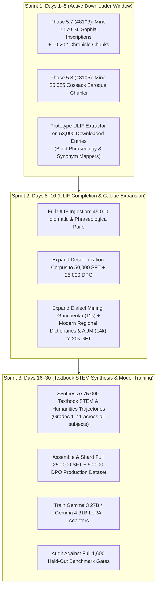

# ULDR 250K+ Sovereign Ukrainian Model Data Roadmap

> **Parent Epic:** [#6321](https://github.com/learn-ukrainian/learn-ukrainian.github.io/issues/6321) (Open Model Data) & [#7423](https://github.com/learn-ukrainian/learn-ukrainian.github.io/issues/7423)
> **Authority & Invariant:** Non-commercial, permanent open-source educational resource.
> **Core Mandate:** **Literary Ukrainian first and foremost**, comprehensive authentic regional dialects as protected heritage, and absolute resistance to Russian/Soviet colonial assimilation, imperial propaganda, and Surzhyk.

---

## 1. Executive Summary & Strategic Rationale

Early prototype phases (such as Phase 3.7 and Phase 5.6) produced small proof-of-concept datasets (e.g. 550 dialect trajectories, 6,000 preliminary calque pairs) to validate mining filters, claim verifiers, and 0% train/eval leakage firewalls.

However, **a national language cannot be aligned on a toy dataset of a few thousand examples**. Modern foundation models (LLaMA, Gemma, GPT) have millions of parameters contaminated by Russian web crawls, Sovietized administrative phrasing, and imperial historical framings.

To train an open model that possesses true sovereign Ukrainian intelligence, we are executing an **industrial-scale 250,000+ SFT & 50,000 DPO roadmap** utilizing our verified local holdings in `data/sources.db` (150K+ chunks), `data/vesum.db` (409K lemmas), and the actively completing `data/ulif_dump_all.db` (National Academy of Sciences of Ukraine).

```
┌──────────────────────────────────────────────────────────────────────────────────┐
│              TOTAL PRODUCTION VOLUME: 250,000 SFT + 50,000 DPO                   │
├──────────────────────────────────────────────────────────────────────────────────┤
│ Track 1: General Ukrainian Assistant (Textbook STEM & Humanities)  │ 75,000 SFT  │
│ Track 2: NASU Authentic Phraseology & Idiomatic Depth (ULIF)       │ 45,000 SFT  │
│ Track 3: Systematic Decolonization & Register Purge (Calques)      │ 50,000 SFT  │
│ Track 4: Comprehensive Regional Dialect Vernacular (Modern & Hist) │ 25,000 SFT  │
│ Track 5: Historical Continuity (Kyivan Rus Epigraphy & Baroque)    │ 20,000 SFT  │
│ Track 6: Grammar, Case Valency & Syntactic Precision (UA-GEC)      │ 35,000 SFT  │
├──────────────────────────────────────────────────────────────────────────────────┤
│ Multi-Domain Direct Preference Optimization (Contrastive DPO)      │ 50,000 DPO  │
│ - Track 2 ULIF Idiomatic Nuance & Figurative DPO Pairs             │ 20,000 DPO  │
│ - Track 3 Anti-Calque & Soviet Bureaucratic Reversal DPO Pairs     │ 25,000 DPO  │
│ - Track 4 Authentic Regional vs. Surzhyk Erosion DPO Pairs        │  5,000 DPO  │
└──────────────────────────────────────────────────────────────────────────────────┘
```

---

## 2. The Six Production Tracks

### Track 1: The General Ukrainian Assistant (Literary Foundation First)

* **Goal**: Equip the model to reason, calculate, explain, and write across STEM, law, history, philosophy, and literature in decolonized, pristine Literary Ukrainian (Pravopys 2019).
* **Source Material**:
  * **24,000 chunks of Ukrainian school textbooks (Grades 1–11)** in `data/sources.db`: Algebra, Geometry, Physics, Chemistry, Biology, Ukrainian History, World History, Geography, Law, and Ukrainian Literature.
  * Vetted Ukrainian encyclopedic and legal texts.
* **Target Scale**: **75,000 multi-turn instructional reasoning trajectories**.
* **Key Invariants**:
  * Zero Russian syntactic interference.
  * Native Ukrainian scientific nomenclature (*сірчана / сульфатна кислота*, *водень*, *кисень*).
  * Semantic entity preservation (e.g. mathematical *об'єм піраміди* and physical *відношення* strictly preserved, never falsely mutated by hyper-purist scripts).

### Track 2: Authentic Ukrainian Phraseology & Idiomatic Depth (ULIF Engine)

* **Goal**: Restore native Ukrainian figurative thinking and systematically replace Russianized word-for-word translated idioms with authentic Ukrainian phraseology.
* **Source Material**:
  * **`data/ulif_dump_all.db`** (NASU "Словники України on-line"): Currently downloading (PID `714616`, ETA ~8 days), containing the complete national phraseological and synonymic treasury.
* **Target Scale**: **45,000 SFT trajectories + 20,000 DPO preference pairs**.
* **Key Invariants**:
  * Pairs authentic native idioms (*«брати гору»*, *«мати рацію»*, *«спадати на думку»*, *«впадати в око»*) against Russianized calques (*«брати верх»*, *«бути правим»*, *«приходити в голову»*, *«кидатися в очі»*).
  * Multi-turn `<thought>` reasoning explaining the cultural and literary roots of the idiom with verified citations from classical Ukrainian authors (Kvitka-Osnovyanenko, Tychyna, Honchar, Mordovets).

### Track 3: Systematic Decolonization & Calque Elimination

* **Goal**: Eradicate over 300 codified Soviet-era administrative, military, legal, and conversational Russianisms across all registers.
* **Source Material**:
  * `sources.db: sum11` (strictly quarantined for Sovietization contrastive analysis, never positive authority).
  * `style_guide` (Borys Antonenko-Davydovych, *Як ми говоримо*).
  * Modern independent lexicons: СУМ-20, VESUM, and УЛІФ.
* **Target Scale**: **50,000 SFT trajectories + 25,000 DPO contrastive pairs**.
* **Key Invariants**:
  * Full-sentence context transformations, not isolated word swaps.
  * Rigorous minimal-pair DPO training to penalize Soviet bureaucratic jargon (*«приймати міри»* $\rightarrow$ *«вживати заходів»*, *«нанести шкоду»* $\rightarrow$ *«завдати шкоди»*, *«в кінці кінців»* $\rightarrow$ *«зрештою / кінець кінцем»*).

### Track 4: Comprehensive Regional Dialect Vernacular (Historical & Modern)

* **Goal**: Expand beyond the Phase 5.6 seed (550 trajectories) to capture the living vernacular of all three Ukrainian dialect macro-zones (Southwestern, Northern, Southeastern) as protected cultural heritage, spanning both historical field collections and modern 20th–21st century dialectology.
* **Source Material**:
  * **Modern Academic Dialectology (Institute of the Ukrainian Language of NASU)**:
    * Materials from the **Atlas of the Ukrainian Language (АУМ / Atlas Ukrainskoi Movy)** across Northern (Polissian), Southwestern (Hutsul, Boyko, Lemko, Transcarpathian, Podolian, Bukovinian-Pokuttian, Dniester, Volhynian), and Southeastern (Middle Dnieper, Slobozhan, Steppe) dialect groups.
    * Specialized modern regional dictionaries (e.g., Словник бойківських говірок / Онишкевич, Словник поліських говорів / Лисенко, Гуцульські говірки, Словник буковинських говірок, Лемківський словник).
  * **Modern Regional Lexica & Living Vernacular**:
    * Regional dialect dictionaries digitized on `slovnyk.me` (Bukovina, Galicia, Lviv, Hutsul, Transcarpathia).
    * Contemporary dialectological field records, regional literary prose, and memoirs in `data/sources.db`.
  * **Historical Foundation**:
    * The complete **11,000+ regional field citations in Borys Grinchenko’s 1907 dictionary** (Shukhevych, Chubynskyi, Hnatiuk, Manzhura, etc.).
* **Target Scale**: **25,000 multi-turn dialect defense trajectories + 5,000 DPO pairs** (~11,000 historical Grinchenko + ~14,000 modern regional/academic dialect entries).
* **Key Invariants**:
  * **Living Dialects vs. Archaic Form Preservation**: The model must understand contemporary living dialects as well as classical 19th-century regionalisms, without treating modern dialect speakers as archaic or uneducated.
  * **Anti-Copying Mixed-Error Coverage ($\ge 30\%$)**: Dialect sentences pair authentic regional vocabulary with real grammatical, punctuation, or calque errors, forcing the model to fix the error while strictly defending the dialect marker.
  * **Absolute Anti-Surzhyk Invariant**: Surzhyk is strictly diagnosed as Russian imperial linguistic degradation and eradicated; authentic regional vernacular across all three macro-zones is fiercely defended with linguistic etymology and dialectological citations.

### Track 5: Historical Continuity (Kyivan Rus Epigraphy & Cossack Baroque)

* **Goal**: Reclaim 1,000 years of unbroken Ukrainian written continuity from Russian imperial appropriation.
* **Source Material**:
  * **Phase 5.7 ([#8103](https://github.com/learn-ukrainian/learn-ukrainian.github.io/issues/8103))**: All **2,570 text-bearing St. Sophia Cathedral graffiti inscriptions** + **10,202 Old East Slavic chronicle chunks** (PVL, Ipatiev, Galician-Volhynian). Models Kyivan Church Slavonic diglossia.
  * **Phase 5.8 ([#8105](https://github.com/learn-ukrainian/learn-ukrainian.github.io/issues/8105))**: **20,085 chunks of Middle Ukrainian & Cossack Baroque** (Skovoroda, Velychko, 14th–15th c. charters).
* **Target Scale**: **20,000 historical continuity and philological reasoning trajectories**.
* **Key Invariants**:
  * Teaches models to recognize Church Slavonic as the liturgical "Latin" of Kyivan Rus and distinguish it from the living Ukrainian spoken vernacular.
  * Refutes imperial "three brotherly nations" mythology with diplomatic, primary-source epigraphic evidence.

### Track 6: Grammar, Case Valency & Syntactic Precision (UA-GEC)

* **Goal**: Perfect the model's structural, inflectional, and syntactical accuracy across complex Ukrainian case government and agreement.
* **Source Material**:
  * The complete **UA-GEC (Ukrainian Grammar Error Correction)** annotated corpus.
  * Morphological valency frames extracted from `data/vesum.db` (409K lemmas).
* **Target Scale**: **35,000 multi-turn grammatical correction & syntactic reasoning trajectories**.
* **Key Invariants**:
  * Verbal and prepositional government: strictly enforcing Ukrainian prepositional valency (*властивий кому*, *опанувати що*, *чекати на кого/що*, *завідувач кафедри*, *по справах* $\rightarrow$ *у справах*).
  * Animate/inanimate accusative case distinctions, dual-form preservation (*очі, уші, плечі*), and vocative case mastery.

---

## 3. Target Models & Binding Qualification Gates

To prevent token drift and collateral linguistic damage, the 250,000+ production dataset is qualified across target high-capacity foundation models:
* **Gemma 3 27B** (`google/gemma-3-27b-it`)
* **Gemma 4 31B** (`google/gemma-4-31b-it` dual-channel native thought architecture)

All training candidates must pass the complete, non-negotiable **1,600-case held-out evaluation suite** governed by the binding gates codified in [`PRODUCTION_RELEASE_PLAN.md`](https://github.com/learn-ukrainian/learn-ukrainian.github.io/blob/main/docs/projects/open-model-data/PRODUCTION_RELEASE_PLAN.md) §3.2:

```
┌────────────────────────────────────────────────────────────────────────────────────────┐
│                        BINDING PRODUCTION QUALIFICATION GATES                          │
├────────────────────────────────────────────────────────────────────────────────────────┤
│ Gate 1: Linguistic Precision & Span Integrity: Precision >= 98.0%                      │
│         - Strict 100% byte/token preservation outside designated error spans.          │
│         - 0 unintended rephrasings or collocation mutations permitted.                 │
│ Gate 2: Calque Elimination Rate: True Positive Rate >= 98.0% (N = 300)                  │
│ Gate 3: Negative Control / Harmful-Edit Floor: Exact 0 observed errors (k = 0, N = 300)│
│         - One-sided 95% Clopper-Pearson upper bound: <= 0.994%.                        │
│ Gate 4: Anti-Overstandardization Protection: Exact 0 observed errors (k = 0, N = 600)  │
│         - One-sided 95% Clopper-Pearson upper bound: <= 0.499%.                        │
│         - Zero tolerance for altering regional vocabulary or historical grammar.       │
│ Gate 5: Citation Verification & Dedicated High-Frequency Calque Floor:                 │
│         - 100% Recall on the dedicated 50 most common calques.                         │
│         - 0 Hallucinated Headwords or Senses in <thought> traces or final answers.      │
│         - Citations must validate against approved positive authorities whitelist      │
│           (SUM-20, Grinchenko 1907, style_guide, VESUM, Pravopys 2019, ULIF).          │
│         - SUM-11 strictly quarantined for contrastive Sovietization analysis.          │
└────────────────────────────────────────────────────────────────────────────────────────┘
```

---

## 4. Immediate Execution Roadmap



---

## 5. Operational Invariants

1. **Literary Ukrainian is the Sovereign Standard**: Dialects, historical texts, and colloquial speech enrich the language, but standard literary Ukrainian per Pravopys 2019 is the non-negotiable core.
2. **Zero Web-Scraped Junk**: All training records originate exclusively from verified local databases (`sources.db`, `vesum.db`, `ulif_dump_all.db`, `ua-gec`).
3. **Strict 0% Train/Eval Partition Firewalls**: Evaluation benchmarks are strictly partitioned by work, author, and monument.
4. **Tool-Backed Factual Claims**: Every dictionary citation, form count, and morphological property must be verified against local databases. No LLM hallucinations permitted in training trajectories.
