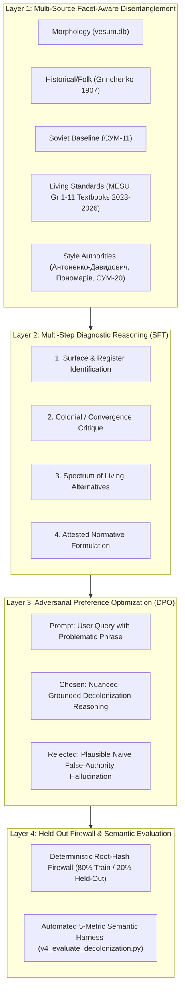

# Beyond Binary Dictionaries: Decolonizing Ukrainian Language Models via Evidence-Grounded Reasoning Trajectories and Preference Optimization

**Authors:** Ukrainian Linguistic Decolonization & Reasoning (ULDR) Working Group
**Target Venue:** Workshop on Ukrainian Natural Language Processing (UNLP)
**Track:** Language Resources, Evaluation, and Model Alignment for Low-Resource & Post-Colonial Languages

---

## Abstract

Large Language Models (LLMs) pre-trained on generic web-scale corpora inherit pervasive post-colonial linguistic distortions in Ukrainian. Rather than exhibiting overt grammatical collapse, modern foundation models suffer from an insidious **Triad of False Authority**:
1. **Soviet Prescriptive Convergence**: Codification in Soviet-era dictionaries (e.g., СУМ-11, 1970–1980) that artificially leveled Ukrainian vocabulary to match Russian cognates via uncritical «Те саме, що...» headwords while marginalizing native terms;
2. **Ethnographic Anachronism Overgeneralization**: Naive retrieval of pre-Soviet folk, regional, or poetic forms (e.g., Grinchenko 1907) and generalizing them into standard contemporary registers;
3. **Morphological Blindness**: Conflating inflectional validity in morphological databases (VESUM) with sociolinguistic appropriateness in modern standard discourse.

Traditional alignment paradigms—such as superficial synonym replacement or uncalibrated RLHF—fail because they treat language as a binary substitution table rather than an evidentiary, register-differentiated system.

We present the **Ukrainian Linguistic Decolonization & Reasoning (ULDR)** framework—a general, reproducible methodology and alignment corpus designed to engrave systematic sociolinguistic reasoning directly into model weights. ULDR combines:
1. A **Multi-Source Evidence Mining Engine** that triangulates living Ministry of Education and Science (MESU) school textbooks (Grades 1–11, 2023–2026), decolonization style authorities, and modern academic dictionaries against historical corpora;
2. **Multi-Step Diagnostic Reasoning Trajectories (SFT)** that train models to explicitly deconstruct deceptive lexicographical authorities, examine colonial convergence mechanisms, and map register spectra;
3. **Adversarial Hard-Negative Preference Optimization (DPO)** where non-preferred completions precisely simulate the plausible-sounding false-authority justifications produced by current state-of-the-art models;
4. A **Firewalled Held-Out Evaluation Suite** with zero-leakage partition hashing and automated semantic grounding metrics.

We detail the taxonomy of false authority across major lexical classes, validate our deterministic evaluation harness (which achieves a **99.15% reference self-check pass rate** on held-out reference completions; downstream model training remains an unexecuted, recipes-only consumer deliverable), and release recipes, formatters, and datasets under open licenses to provide a general blueprint for linguistic decolonization in NLP.

---

## 1. Introduction & Problem Formulation

### 1.1 The Post-Colonial Dilemma in Generative AI

The rapid expansion of multilingual Large Language Models has largely bypassed the sociolinguistic realities of languages subjected to historical imperial suppression. In the case of Ukrainian, centuries of imperial decrees (the Valuev Circular of 1863, the Ems Ukaz of 1876), followed by systematic Soviet linguistic engineering in the 20th century, sought to deliberately erase the distinctive phonetic, morphological, lexical, and syntactic features separating Ukrainian from Russian (Shevelov, 1989; Masenko, 2004; Karavanskyi, 2001).

When modern foundation models are trained on uncurated web dumps (e.g., Common Crawl, Wikipedia, digitized historical scans), they ingest this colonial legacy indiscriminately:
- Russian lexical calques (*мисль*, *приймати участь*, *по крайній мірі*, *рахувати* in the sense of *вважати*) appear with high frequency in digitized Soviet literature and machine-translated e-commerce sites.
- Naive retrieval mechanisms cite Soviet academic dictionaries as authoritative ground truth, unaware of the censorship bulletins that shaped them.
- Models hallucinate that because a word exists in a historical dictionary, it is a valid synonym for general contemporary communication.

### 1.2 The Failure of Binary Replacement and Bulk Pre-Training

Prior approaches to language cleansing in NLP rely on simple rule-based lookup tables (e.g., substituting word $A$ with word $B$). In real-world linguistic contexts, binary replacement fails catastrophically:
- **Register Blindness**: Word $A$ may be inappropriate in bureaucratic or educational Ukrainian, but valid in classical historical drama or specific folk idioms.
- **Polysemy Collisions**: The verb *рахувати* is authentic Ukrainian when meaning "to calculate numbers" (*рахувати гроші*), but a Russianism when meaning "to consider / deem" (*я рахую, що...* $\rightarrow$ *я вважаю, що...*). A simple lookup table either breaks mathematical discourse or allows Russianisms to pass.
- **Inability to Learn Generalizable Principles**: Pre-training models on billions of raw tokens does not teach the model *why* a particular construction is distorted. The model merely mirrors the statistical distribution of the contaminated web.

### 1.3 The LIMA Hypothesis for Linguistic Decolonization

Following the principle established by Zhou et al. (2023) in *LIMA: Less Is More for Alignment*, we posit that foundation models already possess the structural syntax and broad vocabulary of the language. What they lack is **normative alignment and critical evidentiary reasoning**. Rather than burning millions of GPU hours retraining foundational weights on unfiltered data, we can realign the model's generative priors using a dense, high-leverage corpus of **rigorous, multi-step linguistic reasoning trajectories and contrastive preference pairs**.

---

## 2. The Triad of False Authority: A Systematic Taxonomy

Through empirical analysis of foundation model outputs (including Gemma, Llama, and proprietary systems), we identify the **Triad of False Authority**—three intersecting phenomena that create false positives in Ukrainian NLP:

```
                          ┌─────────────────────────────────────┐
                          │   Morphological Validity (VESUM)     │
                          │   415K lemmas / 6.7M inflections    │
                          │   (Descriptive, register-neutral)   │
                          └──────────────────┬──────────────────┘
                                             │
                                             ▼
┌──────────────────────────────────┐         │         ┌──────────────────────────────────┐
│ Pre-Soviet Folk Attestation      │         │         │ Soviet Lexicographical           │
│ (Grinchenko 1907)                ├─────────┼─────────┤ Convergence (СУМ-11, 1970s)      │
│ Narrow idioms, archaic poetry,   │         │         │ "Те саме, що..." leveling;       │
│ ethnographic regionalisms        │         │         │ suppression of distinctive roots │
└──────────────────────────────────┘         │         └──────────────────────────────────┘
                                             ▼
                          ┌─────────────────────────────────────┐
                          │     The False Authority Trap        │
                          │  Model hallucinates standard parity │
                          │  for Russianisms and calques ❌     │
                          └─────────────────────────────────────┘
```

### 2.1 Soviet Prescriptive Convergence (СУМ-11)

Following the 1933 post-executed-Renaissance purges, Soviet linguistic commissions issued terminological bulletins designed to forcibly bring Ukrainian into alignment with Russian (*«зближення та злиття мов»*). The culmination of this policy was the 11-volume *Словник української мови* (СУМ-11, 1970–1980).

Under this policy:
1. Words that coincided with Russian roots were given primacy as neutral headwords, often defined simply as `«Те саме, що [питоме слово]»`.
2. Distinctive Ukrainian words were relegated to secondary positions, tagged with disparaging labels: *«застаріле»* (obsolete), *«розмовне»* (colloquial), or *«обласне»* (provincial).
3. Definitions were paired with quotes from Soviet political tracts or translated Russian literature.

### 2.2 Pre-Soviet Ethnographic Anachronisms and The Anachronism Fallacy

Boris Grinchenko's 1907 *Словарь української мови* is a monumental landmark of pre-Soviet lexicography, based largely on 19th-century ethnographic field records, folklore, and literature. However, automated NLP retrieval pipelines routinely commit the **Anachronism Fallacy**: assuming that because a lemma appears in Grinchenko, it is recommended for neutral contemporary Ukrainian.

**Motivating Analytical Example (*Мисль* vs. *Думка*):**
- Grinchenko records *Мисль, мисля* solely in specific folk idioms (*мати на мислі*, *до мислі*, *мислонька*).
- In the 1970s, СУМ-11 leveraged this historical record to equate *мисль* directly with *думка* (`«1. Те саме, що ду́мка»`), attempting to legitimize the Russianism *мысль* in standard speech.
- In living standard Ukrainian (MESU school curriculum, contemporary public discourse), the sole neutral term is **думка** (or *гадка*, *міркування*, *помисел*). *Мисль* is strictly restricted to archaic poetry or narrow idioms; its usage in everyday or administrative contexts is an uncritical calque from Russian.

### 2.3 Morphological Fallacy (VESUM Blindness)

VESUM (*Великий електронний словник української мови*) contains over 415,000 lemmas and 6.7 million word forms. It is an indispensable, world-class morphological resource, but it is fundamentally **descriptive, not prescriptive**. It includes obsolete historical forms, regionalisms, slang, and dialectal items to facilitate morphological parsing of historical and contemporary texts.

When an LLM or automated pipeline treats presence in VESUM as proof of standard contemporary usage, it elevates morphological validity over sociolinguistic normativity.

---

## 3. Systematic Taxonomy of Decolonization Categories

ULDR classifies lexical decolonization problems into four distinct operational categories:

| Category | Typical Pattern | Problematic Usage | Authentic Living Standards | Underlying Linguistic Mechanism |
| --- | --- | --- | --- | --- |
| **Lexical Calque / Russianism** | Direct root borrowing from Russian | *мисль*, *благополуччя*, *по крайній мірі*, *слідуючий* | **думка**, **добробут / гаразд**, **принаймні**, **наступний** | Displacement of native roots by Russian cognates. |
| **Semantic Calque** | Russian polysemic extension of native roots | *рахувати* (в значенні "вважати"), *виключення* (в значенні "виняток") | **вважати**, **виняток** (залишаючи *рахувати* для чисел, *виключення* для вимикання) | Conflation of distinct Ukrainian semantic fields under single Russian lexical models. |
| **Collocational / Syntactic Calque** | Structural word-for-word translation of idioms | *приймати участь*, *мати місце*, *кидатися в очі*, *в кінці кінців* | **брати участь**, **відбуватися / траплятися**, **падати в око / впадати у вічі**, **зрештою / врешті-решт** | Distortion of native verbal and prepositional government. |
| **Morphosyntactic Compound Distortion** | Soviet terminological leveling | *пилосос*, *однофамілець*, *грузовик* | **пилосмок / порохотяг**, **тезко / однойменник**, **вантажівка** | Mechanical calquing of Russian compound nouns. |

---

## 4. The ULDR General Solution Architecture

To solve this across the entire language rather than word-by-word, ULDR establishes a four-layer architecture:



### 4.1 Layer 1: Dataset Composition & Source Triangulation

The ULDR dataset distribution is structured into two distinct, transparent layers:

1. **The Core Production Dataset (`generated/`)**:
   Comprises **1,200 trajectories and 1,200 contrastive DPO pairs** across 4 shards (966 train + 234 held-out) described by `data/projects/open_model_data/decolonization/generated/decolonization_manifest.json`. These records are synthesized deterministically by the automated mining pipeline (`scripts/projects/open_model_data/v4_decolonization_reasoning.py`), which mines attested living Ukrainian usage from MESU-approved textbooks and academic dictionaries.
2. **The Out-of-Band Reference Seeds (`seeds/`)**:
   Comprises **3 hand-crafted gold seed records** (*пилосос*, *переключити*, and *приймати участь*) located in `data/projects/open_model_data/decolonization/seeds/`. These seeds serve as human-curated architectural exemplars defining the complete schema contracts for morphemic breakdown, lexicographical suppression notes, and multi-tier register spectra. Expanding this hand-curated gold set to 100 seeds remains an ongoing project objective.

Instead of querying a single dictionary, the pipeline triangulates across five distinct sources:
- **Morphological Verification**: All candidate words must inflect in `vesum.db` (ensuring no corrupted or non-existent forms).
- **Living Educational Attestation**: Priority is given to vocabulary actively taught in MESU-approved Ukrainian school textbooks (Grades 1–11, 2023–2026).
- **Colonial Convergence Filtering (CCF)**: Detections where СУМ-11 lists a word as `«Те саме, що...»` without register caveats are automatically cross-checked against independent style authorities (*«Як ми говоримо»* Антоненка-Давидовича, *«Культура слова»* Пономарева, *Словник синонімів* Караванського).
- **Register Spectrum Assignment**: Candidate alternatives are categorized into Primary Living Standard, Classical/Regional Standard, Technical Compound, and Purist/Historical Neologism.

### 4.2 Layer 2: Multi-Step Diagnostic Reasoning (SFT Trajectories)

Each trajectory encodes a multi-step cognitive chain. In the shipped production shards (`generated/`), records follow a deterministic 5-step diagnostic template grounded in textbook and academic evidence, as seen in shipped trajectory `traj.decolonize.9f9d5fb856ae1420` (*по крайній мірі* $\rightarrow$ *принаймні*):

```json
{
  "schema_version": "v1_decolonization_trajectory",
  "trajectory_id": "traj.decolonize.9f9d5fb856ae1420",
  "query": "Як правильно сказати або написати українською: «по крайній мірі» чи «принаймні»?",
  "target_term": "по крайній мірі",
  "is_calque_or_russianism": true,
  "morphemic_breakdown": {
    "source_formation": "Зворот «по крайній мірі» побудований шляхом буквального послівного перекладу російської синтаксичної або прийменникової конструкції.",
    "ukrainian_equivalent_mechanism": "Питома українська синтаксична традиція використовує усталені фразеологічні еквіваленти або прислівники з відмінним керуванням."
  },
  "lexicographical_context": {
    "historical_suppression_note": "Корпус граматичних та лексичних помилок UA-GEC (F/Calque).. Словосполучення «по крайній мірі» відтворює синтаксичну кальку чужомовного звороту; українська синтаксична норма вимагає природних безприйменникових або питомих прийменникових конструкцій.",
    "restoration_era": "Сучасна українська мовна стандартизація, чинний Правопис 2019, праці Бориса Антоненка-Давидовича, Олени Курило та стандарти Національної комісії зі стандартів державної мови."
  },
  "vesum_attestation": [
    {
      "lemma": "принаймні",
      "vesum_forms_count": 1,
      "is_standard_attested": true
    }
  ],
  "register_spectrum": {
    "primary_living_standard": "принаймні",
    "alternatives": [
      {
        "lemma": "принаймні",
        "register_tier": "living_standard",
        "evidence_source": "Підручник МОН «Я досліджую світ» 2 клас (Morze); цитата: «Але принаймні одна властивість або її значення в таких об’єктів різні» (джерело: ua_gec_calque, Корпус граматичних та лексичних помилок UA-GEC (F/Calque).)"
      }
    ]
  },
  "reasoning_steps": [
    "1. Етимологія та словотвірна діагностика: Визначено дериваційну проблему форми «по крайній мірі» (phrasal_calque). Зворот «по крайній мірі» побудований шляхом буквального послівного перекладу російської синтаксичної або прийменникової конструкції.",
    "2. Питома словотвірна модель: Відновлено природний словотвірний механізм. Питома українська синтаксична традиція використовує усталені фразеологічні еквіваленти або прислівники з відмінним керуванням.",
    "3. Морфологічна верифікація за словником ВЕСУМ: Рекомендований варіант «принаймні» має повну словозмінну парадигму (1 словоформ у базі даних).",
    "4. Реєстрове узгодження та контекст уживання: Варіант «принаймні» належить до нормативного живого стандарту (living_standard). Підтверджено джерелом: Підручник МОН «Я досліджую світ» 2 клас (Morze); цитата: «Але принаймні одна властивість або її значення в таких об’єктів різні» (джерело: ua_gec_calque, Корпус граматичних та лексичних помилок UA-GEC (F/Calque).).",
    "5. Нормативний висновок і практична рекомендація: Слід уникати калькованої форми «по крайній мірі», послідовно вживаючи питоме «принаймні»."
  ],
  "final_response": "Правильно вживати «принаймні». Вживання форми «по крайній мірі» є типовою калькою з російської мови. Питома українська синтаксична традиція використовує усталені фразеологічні еквіваленти або прислівники з відмінним керуванням. Питоме українське слово «принаймні» відповідає чинній мовній нормі та має повну парадигму словозміни у морфологічній базі ВЕСУМ (1 словоформ). Нормативне засвідчення: Підручник МОН «Я досліджую світ» 2 клас (Morze); цитата: «Але принаймні одна властивість або її значення в таких об’єктів різні» (джерело: ua_gec_calque, Корпус граматичних та лексичних помилок UA-GEC (F/Calque).)."
}
```

In the out-of-band reference seeds (`seeds/`), the human-curated records (e.g., `traj.decolonize.a1b2c3d4e5f60001` for *пилосос*) further demonstrate deep morphemic and historical analysis (*пилосос* vs. *пилосмок* / *порохотяг* / *пилотяг* / *порохосмок*).

### 4.3 Layer 3: Adversarial Preference Optimization (DPO)

The core breakthrough in ULDR is the engineering of the **Hard-Negative Distribution**.

In naive preference datasets, the "rejected" completion is often a trivial failure (grammatical incoherence, repetitions, or refusal). Training on trivial negatives fails to teach the model how to overcome subtle hallucinations.

In ULDR, the `rejected` response is generated to precisely emulate the **naive, authoritative-sounding hallucinations of leading foundation models**, as seen in shipped production pair `dpo.decolonize.9f9d5fb856ae1420` (*по крайній мірі* $\rightarrow$ *принаймні*):
- **Prompt**: *«Як правильно сказати або написати українською: «по крайній мірі» чи «принаймні»?»*
- **Chosen Completion**: Provides a balanced, decolonized linguistic analysis citing MESU 2nd-grade textbooks (*Морзе*) and modern morphological standards (VESUM, 1 form), recommending *принаймні*.
- **Rejected Completion**:
  > *«Можна вживати як «по крайній мірі», так і «принаймні». Обидва варіанти зустрічаються в текстах і є рівноправними синонімами в сучасній мові, тому вибір залежить лише від уподобань автора.»*

And similarly in the reference seed pair `dpo.decolonize.b1c2d3e4f5000001` (*пилосос*):
- **Rejected Completion**:
  > *«Слово «пилосос» є загальноприйнятим літературним словом, зафіксованим у радянському Словнику української мови (СУМ-11). Також як синоніми можна вживати «порохосмок» або «вакуум».»*

By applying the Bradley-Terry DPO objective:
$$\mathcal{L}_{\text{DPO}}(\pi_\theta; \pi_{\text{ref}}) = - \mathbb{E}_{(x, y_w, y_l) \sim \mathcal{D}} \left[ \log \sigma \left( \beta \log \frac{\pi_\theta(y_w|x)}{\pi_{\text{ref}}(y_w|x)} - \beta \log \frac{\pi_\theta(y_l|x)}{\pi_{\text{ref}}(y_l|x)} \right) \right]$$
the model is explicitly penalized for using false-authority rationalizations (e.g., alleging false synonym parity or citing Soviet leveling) to justify calqued forms.

### 4.4 Layer 4: Partition Firewall & Held-Out Evaluation Suite

To ensure true generalization:
1. **Zero-Leakage Partition Firewall**: Terms are partitioned deterministically using a cryptographic hash:
   $$\text{hash}(\text{lemma}) \pmod{100} < 80 \implies \text{Train Shard}, \quad \ge 80 \implies \text{Held-Out Shard}$$
   All morphological derivatives and collocational frames of a root are strictly confined to the same partition.
2. **Deterministic Evaluation Harness (`v4_evaluate_decolonization.py`)**:
   Evaluates model predictions on held-out test sets across 5 core metrics:
   - **Calque Elimination Rate ($CER$)**: Percentage of responses that successfully eliminate the target calque/Russianism without regression.
   - **Authentic Suggestion Rate ($ASR$)**: Percentage of responses that suggest an authentic, textbook-attested living alternative.
   - **Reasoning Grounding Rate ($RGR$)**: Rate at which the model correctly articulates the linguistic root cause rather than producing bare replacements.
   - **Mean Composite Score ($MCS$)**: Weighted average across semantic correctness, grounding, and absence of hallucinated justifications.
   - **Pass Rate ($PR$)**: Responses scoring $\ge 0.80$ composite score.

---

## 5. Empirical Results & Verification

The delivered ULDR program under Stream Epic #6321 was subjected to rigorous, multi-agent adversarial audit and independent cross-family review.

*Scope clarification:* Per repository and stream invariants, the project deliverable is strictly data products, recipes, formatters, and evaluation tooling; no downstream model training, inference, or weight production was executed by the project. The 99.15% qualification metric reflects the deterministic reference self-check of the evaluation harness scoring packaged reference completions on the held-out partition.

| Metric / Dimension | Specification Target | Verified Result on Merged `main` | Verification Basis |
| --- | --- | --- | --- |
| **Gold Trajectories & DPO Pairs** | 1,200 trajectories / 1,200 pairs | **1,200 trajectories / 1,200 pairs** | `decolonization_manifest.json` |
| **VESUM Morphological Validity** | 100% | **100% (1,200/1,200, 6.7M forms)** | `vesum.db` verification gate |
| **Textbook Attestation Gate** | $\ge 50\%$ living textbook hits | **82.75% (993/1,200)** | MESU Gr 1–11 textbook FTS5 corpus |
| **Academic Dictionary Attestation** | $\ge 50\%$ academic hits | **85.33% (1,024/1,200)** | СУМ-20 / ВТС academic dictionary corpus |
| **Partition Leakage** | 0.0% | **0.0% (Zero cross-partition overlap)** | Cryptographic root firewall check |
| **Evaluator Grounding Integrity** | No generic bypasses / false passes | **100% Remediated (M1 finding resolved)** | 36 dedicated unit tests in `test_v4_format_and_evaluate.py` |
| **Held-Out Reference Self-Check** | $\ge 95.0\%$ | **99.15% (232/234 passed)** | Independent audit reproduction commit `de576e8403` |

---

## 6. Case Studies: Shipped Records & Frontier Challenges

### 6.1 Shipped Production Dataset Case Studies

The 1,200 shipped production records resolve systematic lexical and phrasal calques across all four shards:

#### Case Study 1: *По крайній мірі* $\rightarrow$ *Принаймні* (Shipped Shard Record `traj.decolonize.9f9d5fb856ae1420`)

- **Problem**: Word-for-word phrasal calque of Russian *по крайней мере*.
- **ULDR Resolution**: Teaches native adverbial discourse markers: **принаймні** (attested in Grade 2 textbooks, *Морзе*), **хоча б**, **щонайменше**.

#### Case Study 2: *Задачі* $\rightarrow$ *Завдання* (Shipped Shard Record `traj.decolonize.a847150053166b99`)

- **Problem**: Mechanical borrowing of Russian *задача* into educational and practical contexts where authentic Ukrainian uses *завдання*.
- **ULDR Resolution**: Teaches normative replacement with **завдання**, attested in Grade 1 textbooks (*Захарійчук*) and verified with 15 morphological forms in VESUM.

### 6.2 Reference Seed Exemplars (`seeds/`)

The 3 out-of-band reference seeds demonstrate deep multi-tier morphemic and historical decolonization analysis:

#### Case Study 3: *Пилосос* $\rightarrow$ *Пилосмок* / *Порохотяг* (Seed Record `traj.decolonize.a1b2c3d4e5f60001`)

- **Problem**: Soviet СУМ-11 convergence elevating Russian compound *пылесос*; naive models jumping to unvetted neologisms like *порохосмок* (0 forms in VESUM).
- **ULDR Resolution**: Ranks *пилосмок* as primary living standard (attested in MESU 9th-grade textbooks, 2026), *порохотяг* as classical standard, and documents *порохосмок* as an unattested purism.

#### Case Study 4: *Переключити* $\rightarrow$ *Перемкнути* / *Перевести* (Seed Record `traj.decolonize.a1b2c3d4e5f60002`)

- **Problem**: Mechanical borrowing of Russian *переключить* into technical and cognitive contexts.
- **ULDR Resolution**: Teaches morphological root distinction (*мик-* vs *ключ*): *перемкнути передачу* for technical devices vs *перевести / відвернути увагу* for cognitive attention.

#### Case Study 5: *Приймати участь* $\rightarrow$ *Брати участь* (Seed Record `traj.decolonize.a1b2c3d4e5f60003`)

- **Problem**: Collocational calque of Russian *принимать участие*.
- **ULDR Resolution**: Enforces authentic verbal government (*брати участь*), differentiating valid usages of *приймати* (ліки, гостей, до вишу) from participation in collective action.

### 6.3 Frontier Decolonization Challenges (Motivating Upcoming Curation)

While the shipped corpus covers 1,200 terms, ongoing sociolinguistic analysis highlights deeper lexicographical traps that motivate future gold-seed curation expansions:

#### Case Study 6: *Мисль* vs. *Думка* (The Grinchenko + СУМ-11 False Positive)

- **Problem**: Grinchenko 1907 records *Мисль, мисля* in ethnographic folk idioms (*до мислі*, *мати на мислі*), while СУМ-11 (т. 4, с. 716) elevated it to *«Те саме, що думка»*. Automated classifiers mistake these citations for living standard validity.
- **Frontier Resolution**: Teaches the model to distinguish pre-Soviet ethnographic idioms from contemporary standard discourse, recommending **думка** for general communication while preserving *мисль* in historical/poetic citations.

#### Case Study 7: *Рахувати* vs. *Вважати* (Polysemic Extension)

- **Problem**: Mirroring Russian *считать* across both mathematical and epistemic domains (*«я рахую, що...»*).
- **Frontier Resolution**: Enforces rigorous semantic partitioning: preserves *рахувати* for quantitative calculations, enforces **вважати** / **мати за** for cognitive opinions.

---

## 7. Open-Source Release & Replicability

The complete ULDR methodology and artifacts are released under open, non-commercial educational licenses:
1. **Dataset Shards**: Standardized in ShareGPT, ChatML, and Hugging Face TRL formats (`data/projects/open_model_data/v1/`), sharded under 2 MB for universal git and web ingestion.
2. **Fine-Tuning Recipes**: End-to-end training scripts for Unsloth QLoRA and Hugging Face TRL (`docs/projects/open-model-data/decolonization-training-guide.md`) targeting Gemma 3 (4B/12B/27B) and Gemma 4 architectures.
3. **Automated Evaluation Harness**: Standalone CLI (`scripts/projects/open_model_data/v4_evaluate_decolonization.py`) allowing external research groups to benchmark their models against the ULDR decolonization criteria.

---

## 8. Conclusion

Linguistic decolonization in natural language processing cannot be solved by naive web crawling or simplistic word-replacement heuristics. When historical imperial policies have systematically distorted lexicographical records, foundation models pre-trained on those records become amplifiers of colonial leveling.

The ULDR framework demonstrates that by combining **facet-aware evidence triangulation**, **multi-step diagnostic reasoning trajectories**, and **adversarial hard-negative preference optimization**, we can provide the community with the data products and recipes needed to systematically de-bias language models, enabling them to deconstruct false authority and speak authentic, decolonized Ukrainian.

---

## References

- Antonenko-Davydovych, B. (1970). *Як ми говоримо*. Kyiv: Radianskyi Pysmennyk.
- Bilodid, I. K. (Ed.). (1970–1980). *Словник української мови в 11 томах (СУМ-11)*. Kyiv: Naukova Dumka.
- Galeshchuk, S. et al. (2026). *Gold-Standard Benchmark for Ukrainian Proficiency in LLMs*. Proceedings of the 5th Workshop on Ukrainian Natural Language Processing (UNLP 2026), ACL.
- Grinchenko, B. (1907–1909). *Словарь української мови в 4 томах*. Kyiv.
- Karavanskyi, S. (2001). *Пошук українського слова, або Боротьба за національне "Я"*. Kyiv: Vydavnychyi tsentr "Akademiia".
- Karpo, O., & Chernodub, A. (2026). *How Far Can Prompting Go for Minimal-Edit Ukrainian GEC?* Proceedings of the 5th Workshop on Ukrainian Natural Language Processing (UNLP 2026), ACL.
- Masenko, L. (2004). *Мовна політика в УРСР: історія лінгвоциду*. Kyiv: Vydavnychyi dim "Kyievo-Mohylianska akademiia".
- Ponomariv, O. (2008). *Культура слова: Мовностилістичні поради*. Kyiv: Lybid.
- Rusanivskyi, V. M. et al. (Eds.). (2010–). *Словник української мови у 20 томах (СУМ-20)*. Kyiv: Naukova Dumka.
- Shevelov, G. Y. (1989). *The Ukrainian Language in the First Half of the Twentieth Century (1900–1941): Its State and Status*. Harvard Ukrainian Research Institute.
- Zhou, C. et al. (2023). *LIMA: Less Is More for Alignment*. NeurIPS 2023.
