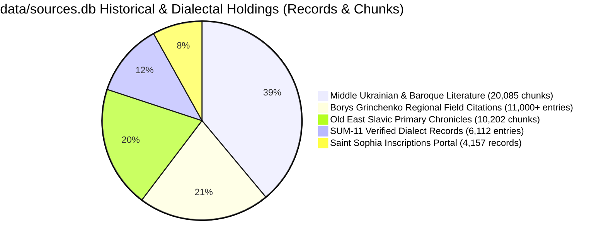
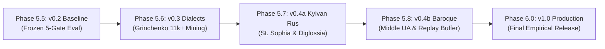

# Kyivan Church Slavonic & Vernacular Diglossia Model: Architecture, Corpus Holdings, and Anti-Imperial Alignment

> **Document Class:** Linguistic Architecture & Research Reference
> **Status:** Canonical Working Specification (Phase 5.5–5.8 under Epic [#6321](https://github.com/learn-ukrainian/learn-ukrainian.github.io/issues/6321))
> **Governing Issues:** [#8054](https://github.com/learn-ukrainian/learn-ukrainian.github.io/issues/8054) (v0.2 Baseline), [#8102](https://github.com/learn-ukrainian/learn-ukrainian.github.io/issues/8102) (v0.3 Dialects), [#8103](https://github.com/learn-ukrainian/learn-ukrainian.github.io/issues/8103) (v0.4a Kyivan Rus & Church Slavonic), [#8105](https://github.com/learn-ukrainian/learn-ukrainian.github.io/issues/8105) (v0.4b Middle Ukrainian Baroque)
> **Philological Authorities:** Prof. Ivan Ohiyenko (Metropolitan Ilarion), George Y. Shevelov, Vasyl Nimchuk, Dr. Viacheslav Korniyenko, Ahatanhel Krymsky, Pavlo Zhytetsky

---

## 1. Executive Summary: The Necessity of the Diglossia Model

Modern large language models (LLMs) suffer from severe, systematic bias regarding the historical linguistic landscape of Eastern Europe:

* **The Imperial Monolith Fallacy:** Base pre-training corpora conflate Old East Slavic (*давньоруська мова*) and Church Slavonic (*церковнослов'янська мова*) into an anachronistic "Old Russian" (*древнерусский язык*) monolith, projecting 18th–19th century Russian imperial hegemony backward into the medieval and early modern periods.
* **The Synodal Distortion of Church Slavonic:** Church Slavonic was the pan-Slavic liturgical and high literary language ("the Ukrainian Latin") for over eight centuries. However, LLMs default exclusively to the **Moscow/Petersburg Synodal Recension** (*синодальний ізвод*) finalized in the 18th century following the subjugation of the Kyiv Metropolia (1686) and the decrees of Peter I prohibiting printing in Ukrainian recension.
* **The Danger of Over-Standardization and Self-Colonization:** Naive anti-surzhyk or normative alignment models, lacking an explicit diglossia and historical defense model, inevitably treat authentic **Kyivan Recension Church Slavonic** (*київський ізвод*) or **Old Ukrainian vernacular epigraphy** as "corrupted Russian" or "illiterate Ukrainian". Conversely, they hallucinate Russian phonetic norms (such as *akanie* or hard plosive [ɡ]) into historical texts where Kyivan phonology (*ikanie*, fricative [ɦ], lack of *akanie*, dative *-ови*) was historically present.

This document establishes the philological foundation, corpus inventory, contrastive matrix, and training invariants required to ground Ukrainian language models in authentic historical reality.

---

## 2. The Historical Diglossia Architecture: Church Slavonic as "Ukrainian Latin"

Throughout the Kyivan Rus (10th–13th c.), Grand Duchy of Lithuania / Polish-Lithuanian Commonwealth (14th–16th c.), and Cossack Hetmanate (17th–18th c.) eras, Ukrainian literate society operated in a state of **dynamic functional diglossia**:

```
+-------------------------------------------------------------------------+
|                  HIGH CODE: Church Slavonic (Київський ізвод)           |
|  - Liturgical rites, theological treatises, sacred poetry, high rhetoric|
|  - Prestigious, stable, supranational, rule-bound ("Ukrainian Latin")   |
|  - Phonetically realized through authentic Ukrainian orthoepic norms    |
+-------------------------------------------------------------------------+
                                   ▲   │
       Lexical borrowing & syntax │   │ Vernacular phonology & morphology
                                   │   ▼
+-------------------------------------------------------------------------+
|                  LOW CODE: Vernacular Old Ukrainian (Руська мова)       |
|  - Living spoken speech, informal graffiti, secular letters, charters  |
|  - Judicial proceedings (Руська Правда, Литовські Статути), act books   |
|  - Source of phonological innovations: ѣ -> [i], [ɦ], pleophony, -ови  |
+-------------------------------------------------------------------------+
```

As demonstrated by Metropolitan Ilarion (Prof. Ivan Ohiyenko) in *Історія української літературної мови* and George Y. Shevelov in *A Historical Phonology of the Ukrainian Language*:

* Church Slavonic was **not** a foreign Russian language imported to Kyiv; rather, South Slavic (Old Church Slavonic) liturgical texts brought to Kyiv in 988 were immediately naturalized through local East Slavic pronunciation and syntax, producing the **Kyivan Recension**.
* For over seven centuries, Ukrainian scholars, polemicists, and churchmen (from Ilarion of Kyiv, Danylo the Pilgrim, and the Kyiv-Pechersk Paterik authors to Ivan Vyshenskyi, Meletii Smotrytskyi, Petro Mohyla, and Lazar Baranovych) wrote, read, and chanted Church Slavonic according to **Kyivan phonological rules**.
* In 1619, Meletii Smotrytskyi published his canonical *Грамматіки славєнския правилное Сvнтаґма* in Vevis (near Vilnius). Smotrytskyi's grammar codifies Church Slavonic according to the Ukrainian-Belarusian tradition. This Ukrainian work became the standard textbook throughout the entire Slavic world, directly informing the later Moscow grammars.

---

## 3. Contrastive Matrix: Kyivan Recension vs. Moscow Synodal Recension

A language model processing Cyrillic historical texts must distinguish the authentic Kyivan tradition from the Russian imperial standard:

| Linguistic Facet | Authentic Kyivan Recension (Київський ізвод) | Moscow/Synodal Recension (Синодальний ізвод) | Evidence in Sources & Inscriptions |
| :--- | :--- | :--- | :--- |
| **Pronunciation of ѣ (Yat')** | Realized as **[i]** (*віра*, *літо*, *діло*, *гріх*). Attested in 11th c. St. Sophia graffiti (*вѣдоуть*, *вѣра*) and 16th–17th c. prints. | Realized as **[e]** (*вера*, *лето*, *дело*, *грех*). | St. Sophia graffiti #12, #47; Ostrog Bible (1581); Smotrytskyi (1619). |
| **Pronunciation of Cyrillic Г** | Voiced glottal/velar fricative **[ɦ]** (*Бо[ɦ]ъ*, *[ɦ]осподи*). | Voiced velar plosive **[ɡ]** (*Бо[ɡ]ъ*, *[ɡ]осподи*), or intervocalic [v] in endings (*че[v]о*). | Shevelov (1979) §27; universal Ukrainian orthoepic tradition. |
| **Vowel Reduction (*Akanie*)** | **Zero akanie.** Unstressed /o/ strictly preserved as [o] (*вода*, *молоко*, *помози*). | Pervasive **akanie** and **ikanie** (*в[ɐ]да*, *м[ə]л[ɐ]ко*). | Ohiyenko, *Історія укр. літ. мови*, Part II; all Rus chronicles. |
| **Dative Singular Masculine** | Inflection **-ови / -еви** (*Господеви*, *князеви*, *рабу своєму Пантелеємови*). | Inflection **-у / -ю** (*Господу*, *князю*, *рабу своему Пантелеймону*). | St. Sophia graffiti (dozens of attestations: *Василеви*, *Петрови*); Ruska Pravda. |
| **Vocative Case** | Strict preservation: **Господи, владико, княже, ставропигіє, отче**. | Collapsed into nominative in secular Russian; heavily reduced in Synodal practice. | Continuous liturgical and epigraphic attestation. |
| **Word-Final Labials** | Preserved hard: **сім**, **кров**, **верб**. | Softened in Russian: *семь*, *кровь*. | 11th c. Izbornyk, St. Sophia epigraphy. |
| **Infinitive Forms** | Full suffix **-ти** (*писати*, *жити*, *служити*). | Apocopated suffix **-ть** in Russian (*писать*, *жить*). | Lithuanian Metrica, Baroque homilies, Cossack chronicles. |
| **Third Person Verb Forms** | Soft **-ть** or hard unpalatalized **-тъ** / zero (*сидить*, *знають*, *робить*). | Standard Russian soft *-ет / -ит* (*сидит*, *знает*). | Charters XIV–XV c., Skovoroda. |
| **Pleophony (Повноголосся)** | Deep integration: South Slavic stems (*градъ*, *врата*) live side-by-side with vernacular pleophony (*городъ*, *ворота*, *Володимеръ*). | South Slavic forms fossilized as bookish prestige roots contrasted with Russian *город*, *ворота*. | Primary Chronicle (PVL Ipatiev vs. Laurentian), Kyiv Chronicle. |

---

## 4. Local Corpus Inventory in `data/sources.db`

No web scraping is required. Our local SQLite repository (`data/sources.db`) holds a world-class collection of historical, epigraphic, chronicle, and dialectal evidence.



### 4.1 Saint Sophia of Kyiv Epigraphic Corpus (11th–14th Centuries)

* **Table:** `historical_source_records`
* **Total Records:** **4,157** (complete current public API of the University of Gothenburg Saint Sophia Portal, `https://saintsophia.dh.gu.se/`).
* **Text-Bearing Inscriptions:** **2,570** clean, text-bearing epigraphic records.
* **Ukrainian Translations:** **1,917** records accompanied by professional scholarly Ukrainian translations.
* **Linguistic Commentary:** **2,956** records with deep paleographic and linguistic commentary.
* **Physical Monograph Foundation:** Dr. Viacheslav Korniyenko's 12-volume monograph series (*Корпус графіті Софії Київської*, 2010–2022) documenting **7,000+ total graffiti**. The Swedish portal digitalized 4,157 of these; the remainder constitutes our known unexposed residual tracked in [`data/historical_language_corpus_denominator.yaml`](file:///home/ops/learn-ukrainian/data/historical_language_corpus_denominator.yaml).
* **Epigraphic AI Assets:** The University of Gothenburg repository [`gu-gridh/sophia-epigraphic-ai`](https://github.com/gu-gridh/sophia-epigraphic-ai) provides:
  1. Complete training set (`complete_dataset.csv`, 1,720 samples).
  2. Cleaning pipeline (`clean_transcription`) for paleographic normalization.
  3. Unicode character table covering early Cyrillic graphemes (`ѣ, ѧ, ѫ, ѡ, ѱ, ѯ, ъ, ь, ҂`) and Glagolitic glyphs.
* **Linguistic Significance:** Epigraphy represents direct, non-standardized human speech scratched on cathedral walls by scribes, clergy, princes, and ordinary citizens. It provides uncontaminated proof of spoken Old Ukrainian vernacular features penetrating Church Slavonic formulas as early as 1018 CE.

### 4.2 Old East Slavic & Kyivan Rus Chronicles (11th–13th Centuries)

* **Table:** `literary_texts`
* **Total Chunks:** **10,202 chunks** (17,422,015 characters).
* **Key Monuments:**
  * **Ipatiev Chronicle (Іпатіївський літопис):** 1,865 chunks — the southern Rus compilation containing the primary text of the Kyiv Chronicle and Galician-Volhynian Chronicle.
  * **Kyiv Chronicle (Київський літопис, 12th c.):** 1,083 chunks — detailed account of central Ukrainian lands with pervasive vernacular phonology and syntax.
  * **Primary Chronicle (Повість минулих літ, PVL Ipatiev):** 1,075 chunks — foundational historical narrative.
  * **Galician-Volhynian Chronicle (Галицько-Волинський літопис, 13th c.):** 1,010 chunks — rich southwestern Ukrainian lexical and grammatical features.
  * **Laurentian Chronicle (Лаврентіївський літопис):** 1,033 chunks — critical northern comparative witness.
  * **Novgorod 1st Chronicle (Новгородський перший літопис):** 1,120 chunks — northwest Slavic comparative witness.
  * **Ruska Pravda (Руська Правда):** 364 chunks — 11th–12th century secular legal code written in East Slavic vernacular legal register.
  * **Kyiv-Pechersk Paterik (Києво-Печерський патерик):** 361 chunks — Kyivan Church Slavonic prose masterpiece.
  * **Izbornyk of Sviatoslav 1076:** 18 chunks — moral and philosophical miscellany.

### 4.3 Middle Ukrainian & Cossack Baroque Literature (14th–18th Centuries)

* **Table:** `literary_texts`
* **Total Chunks:** **20,085 chunks** (36,541,890 characters).
* **Key Monuments:**
  * **Samiilo Velychko Chronicle (Літопис Самійла Величка):** 3,354 chunks — monumental Cossack Baroque narrative.
  * **Hryhorii Skovoroda (Повне зібрання творів):** 1,352 chunks — philosophical dialogues, poetry, and letters in baroque literary Ukrainian/Church Slavonic synthesis.
  * **Feodosii Sofonovych (*Кройніка*):** 647 chunks — early modern Ukrainian historiography.
  * **Mykola Khanenko (Щоденник):** 810 chunks — 18th-century Cossack general staff diary.
  * **14th–15th Century Charters (Грамоти XIV–XV ст.):** 335 chunks — chancery Ukrainian (*руська мова*) legal documents.
  * **Klymentii Zinoviyiv (Вірші та приповісті):** 403 chunks — vernacular baroque poetry and folk ethnography.

### 4.4 Regional Dialects & Living Vernacular Holdings

* **Borys Grinchenko Dictionary (1907):** **11,000+** localized field citations from historic folklorists:
  * *Volodymyr Shukhevych:* 1,818 citations (Hutsul, Pokuttia).
  * *Ivan Manzhura:* 1,229 citations (Steppe, Zaporizhzhia, Katerynoslav).
  * *Pavlo Chubynskyi:* 5,433 citations (Polissia, Right-Bank, Chernihiv, Kyiv).
  * *Volodymyr Hnatiuk:* 680 citations (Boyko, Lemko, Transcarpathia).
  * *Slaviano-Serbsk:* 539 citations (Donbas, Luhansk, Siverskyi Donets basin).
* **СУМ-11 Dialectal Inventory:** **6,112 headwords** tagged `діал.` accompanied by verified literary attestations.
* **Phraseological Dictionary:** **24,683 authentic Ukrainian idioms**.

### 4.5 Foundational Linguistic Research Texts in Corpus

* **Prof. Ivan Ohiyenko (Metropolitan Ilarion):** *Історія української літературної мови* (376 chunks).
* **George Y. Shevelov (Юрій Шевельов):** *Історична фонологія української мови* (383 chunks).
* **Vasyl Nimchuk:** *Мовознавство* and studies on Old Ukrainian recensions (368 chunks).

---

## 5. The Anti-Russian Imperial Refutation Framework

Russian imperial and Soviet historiography relied on three linguistic dogmas to deny the historical continuity of the Ukrainian language. The ULDR training and evaluation pipeline incorporates direct factual refutations:

### Refutation 1: Deconstruction of the Pogodin-Sobolevsky Myth

* **The Imperial Myth (Mikhail Pogodin, 1856):** Pogodin claimed that prior to the Mongol invasion of 1240, Kyiv was populated by "Great Russians", who purportedly migrated northeast to Vladimir and Moscow, after which ancestors of modern Ukrainians "migrated from the Carpathian mountains into empty Kyiv" in the 14th century.
* **The Empirical Refutation (Krymsky, Shevelov, Korniyenko):**
  1. The **4,157 Saint Sophia graffiti** provide an uninterrupted chronological record from 1018 through the 14th century. The graffiti show the exact same phonological, morphological, and lexical traits before, during, and after the Mongol invasion.
  2. Inscriptions from the 11th century exhibit characteristically Ukrainian features: the transition of *ѣ* $\rightarrow$ *[i]*, the shift of *[ɡ]* $\rightarrow$ *[ɦ]*, the vocalization of jers into *[e]* and *[o]*, the dative singular ending *-ови*, the vocative case, and patronymics in *-ич*.
  3. There is zero paleographic or archaeological evidence of demographic rupture or linguistic replacement in Kyiv.

### Refutation 2: Deconstruction of the "Common East Slavic Monolith"

* **The Imperial Myth:** All East Slavs spoke a single, completely uniform "Old Russian language" (*древнерусский язык*), and Ukrainian only "split off" in the 14th–15th century due to Polish influence.
* **The Empirical Refutation (Shevelov, Nimchuk):**
  1. Old East Slavic was never a uniform spoken language; it was a cluster of distinct dialects (Proto-Ukrainian, Proto-Belarusian, Proto-Novgorodian, Proto-Russian) united only by a common bookish Church Slavonic administrative register.
  2. Key phonological isoglosses that define modern Ukrainian (e.g., development of *[i]* from *[o]* and *[e]* in newly closed syllables, change of *ѣ* to *[i]*, spirantization of *[ɡ]* to *[ɦ]*, hard labials, soft sibilants) began developing in the 10th–12th centuries in the Kyivan, Chernihiv, and Galician-Volhynian lands, centuries before Polish administration.

### Refutation 3: Reclaiming Church Slavonic from Imperial Monopoly

* **The Imperial Myth:** Church Slavonic is the "historical form of Russian" or "Old Russian sacred language".
* **The Empirical Refutation (Ohiyenko, Smotrytskyi):**
  1. Church Slavonic is a South Slavic language in origin. Its Ukrainian recension (Київський ізвод) was the intellectual and spiritual medium of Ukrainian civilization for 800 years.
  2. Peter I's 1720 ukase explicitly banned printing church books in the Ukrainian recension, forcing all publishing houses (including the Kyiv-Pechersk Lavra) to conform to the Moscow Synodal pronunciation. The Russian Synodal standard was an artificially enforced imperial decree, not an organic origin.

---

## 6. Multi-Phase Roadmap & Quality Gates (v0.2 -> v1.0)

We reject premature "production v1.0" claims. We advance through empirical releases, with each phase verified by frozen test suites and multi-agent adversarial reviews:



### 6.1 Phase 5.5: ULDR v0.2 Baseline Freezing (Active Issue [#8054](https://github.com/learn-ukrainian/learn-ukrainian.github.io/issues/8054))

* **Data:** Repaired production shards (`data/projects/open_model_data/release/uldr_v1_production/`: 6,000 SFT + 3,000 DPO).
* **Mandatory Pre-Training Cross-Stage Audit:** Automated verification of the 600 Phase 5.2 protection cases to guarantee 0 regionalisms or historical forms are falsely flagged as errors.
* **5 Quality Gates:**
  * **Gate 1:** Precision $\ge 98.0\%$ on standard literary corrections (1,000 held-out cases).
  * **Gate 2:** True Positive Rate $\ge 98.0\%$ on colonial calques.
  * **Gate 3:** False Alarm Rate $\le 1.0\%$ on clean modern sentences.
  * **Gate 4:** Exact 0 errors on clean dialect ($N \ge 300$, Clopper-Pearson 95% upper bound $\le 0.994\%$) and clean historical ($N \ge 200$) sentences.
  * **Gate 5 (Citation Verification — Astra Mandate):** Automated verification against `sum20.db` and `vesum.db` that every dictionary citation in `<thought>` tags is authentic. Zero tolerated hallucinated headwords.
* **Output:** Frozen v0.2 Scorecard published in `docs/reports/uldr_v02_scorecard.md`.

### 6.2 Phase 5.6: Regional Dialects Mining & Multi-Zone Evaluation (Issue [#8102](https://github.com/learn-ukrainian/learn-ukrainian.github.io/issues/8102))

* **Data Extraction:** Mine 11,000+ Grinchenko citations and 6,112 SUM-11 dialect entries across 6 distinct historical-ethnographic zones.
* **Evaluation:** Disaggregated per-zone confusion matrix (Galicia, Polissia, Podillia, Steppe, Slobozhanshchyna, Donbas).
* **Astra Mixed-Case Invariant:** Test cases must combine dialect forms with real modern spelling errors to ensure the model does not rely on a trivial "do nothing" heuristic.
* **Output:** Model release `v0.3`.

### 6.3 Phase 5.7: Kyivan Rus Epigraphy & Church Slavonic Diglossia (Issue [#8103](https://github.com/learn-ukrainian/learn-ukrainian.github.io/issues/8103))

* **Data Extraction:** Mine the 2,570 text-bearing St. Sophia inscriptions and 10,202 OES chronicle chunks.
* **Paleographic Pipeline:** Adopt the University of Gothenburg `gu-gridh/sophia-epigraphic-ai` character set (`ѣ, ѧ, ѫ, ѡ, ъ, ҂`) and normalization rules.
* **Alignment Trajectories:** SFT reasoning paths explicitly teaching the Kyivan Church Slavonic / Vernacular Diglossia model.
* **Output:** Model release `v0.4a`.

### 6.4 Phase 5.8: Middle Ukrainian Cossack Baroque Mining (Issue [#8105](https://github.com/learn-ukrainian/learn-ukrainian.github.io/issues/8105))

* **Data Extraction:** Mine 20,085 chunks of Middle Ukrainian (Velychko, Skovoroda, 14th–15th c. charters).
* **Date Stratification:** Strict isolation of *Історія Русів* (1785–1829) from 17th c. texts to prevent anachronisms.
* **Fable Replay Buffer:** Train with a replay buffer of modern/dialect data; enforce modern regression floor $\le 0.5\%$.
* **Output:** Model release `v0.4b`.

---

## 7. Operational Commitments & Invariants

1. **No Web Scraping:** All data required for phases 5.5 through 5.8 is already present in `data/sources.db`. No scraping is permitted or needed.
2. **Deterministic Attribution:** Every training example and evaluation probe must preserve immutable source attribution to its exact record ID, monument, and collector.
3. **Fail-Closed Gating:** Model releases occur only when all empirical gates are satisfied. Diagnostic failures must be published transparently with confusion matrices and error analyses.
4. **Permanent Open Source:** This work serves the Ukrainian language and global Ukrainian community under permanent open-source terms.
