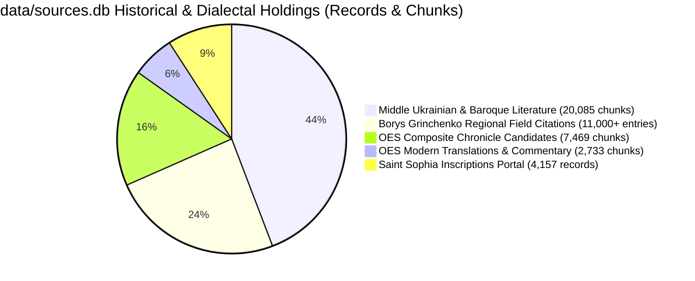
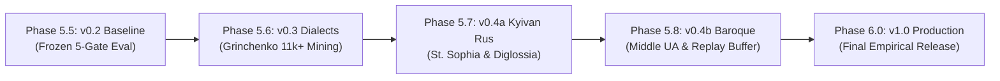

# Kyivan Church Slavonic & Vernacular Diglossia Model: Architecture, Corpus Holdings, and Anti-Imperial Alignment

> **Document Class:** Linguistic Architecture & Research Reference
> **Status:** Canonical Working Specification (Phase 5.5–5.8 under Epic [#6321](https://github.com/learn-ukrainian/learn-ukrainian.github.io/issues/6321))
> **Governing Issues:** [#8054](https://github.com/learn-ukrainian/learn-ukrainian.github.io/issues/8054) (v0.2 Baseline), [#8102](https://github.com/learn-ukrainian/learn-ukrainian.github.io/issues/8102) (v0.3 Dialects), [#8103](https://github.com/learn-ukrainian/learn-ukrainian.github.io/issues/8103) (v0.4a Kyivan Rus & Church Slavonic), [#8105](https://github.com/learn-ukrainian/learn-ukrainian.github.io/issues/8105) (v0.4b Middle Ukrainian Baroque)
> **Philological Authorities:** Prof. Ivan Ohiyenko (Metropolitan Ilarion), George Y. Shevelov, Vasyl Nimchuk, Dr. Viacheslav Korniyenko, Ahatanhel Krymsky, Pavlo Zhytetsky

---

## 1. Executive Summary: The Necessity of the Diglossia Model

Modern large language models (LLMs) suffer from severe, systematic bias regarding the historical linguistic landscape of Eastern Europe:

* **The Imperial Monolith Fallacy:** Base pre-training corpora conflate Old East Slavic (*давньоруська мова*) and Church Slavonic (*церковнослов'янська мова*) into an anachronistic "Old Russian" (*древнерусский язык*) monolith, projecting 18th–19th century Russian imperial hegemony backward into the medieval and early modern periods.
* **The Synodal Distortion of Church Slavonic:** Church Slavonic was the pan-Slavic liturgical and high literary language ("the Ukrainian Latin") for over eight centuries. However, LLMs default exclusively to the **Moscow/Petersburg Synodal Recension** (*синодальний ізвод*) finalized in the 18th century following the subjugation of the Kyiv Metropolia (1686) and the decrees of Peter I prohibiting printing in Ukrainian recension.
* **The Danger of Over-Standardization and Self-Colonization:** Naive anti-surzhyk or normative alignment models, lacking an explicit diglossia and historical defense model, inevitably treat authentic **Kyivan Recension Church Slavonic** (*київський ізвод*) or **Old Ukrainian vernacular epigraphy** as "corrupted Russian" or "illiterate Ukrainian". Conversely, they hallucinate Russian phonetic norms (such as *akanie* or hard plosive [ɡ]) into historical texts where Kyivan phonology (*ikanie*, fricative [ɦ], lack of *akanie*, dative *-ови*) was historically present.

This document establishes the philological foundation, corpus inventory, contrastive matrix, and training invariants required to ground Ukrainian language models in authentic historical reality.

---

## 2. The Historical Diglossia Architecture: Church Slavonic as "Ukrainian Latin"

Throughout the Kyivan Rus (10th–13th c.), Grand Duchy of Lithuania / Polish-Lithuanian Commonwealth (14th–16th c.), and Cossack Hetmanate (17th–18th c.) eras, Ukrainian literate society operated in a state of **dynamic functional diglossia**:

```
+-------------------------------------------------------------------------+
|                  HIGH CODE: Church Slavonic (Київський ізвод)           |
|  - Liturgical rites, theological treatises, sacred poetry, high rhetoric|
|  - Prestigious, stable, supranational, rule-bound ("Ukrainian Latin")   |
|  - Phonetically realized through authentic Ukrainian orthoepic norms    |
+-------------------------------------------------------------------------+
                                   ▲   │
       Lexical borrowing & syntax │   │ Vernacular phonology & morphology
                                   │   ▼
+-------------------------------------------------------------------------+
|                  LOW CODE: Vernacular Old Ukrainian (Руська мова)       |
|  - Living spoken speech, informal graffiti, secular letters, charters  |
|  - Judicial proceedings (Руська Правда, Литовські Статути), act books   |
|  - Source of phonological innovations: ѣ -> [i], [ɦ], pleophony, -ови  |
+-------------------------------------------------------------------------+
```

As demonstrated by Metropolitan Ilarion (Prof. Ivan Ohiyenko) in *Історія української літературної мови* and George Y. Shevelov in *A Historical Phonology of the Ukrainian Language*:

* Church Slavonic was **not** a foreign Russian language imported to Kyiv; rather, South Slavic (Old Church Slavonic) liturgical texts brought to Kyiv in 988 were immediately naturalized through local East Slavic pronunciation and syntax, producing the **Kyivan Recension**.
* For over seven centuries, Ukrainian scholars, polemicists, and churchmen (from Ilarion of Kyiv, Danylo the Pilgrim, and the Kyiv-Pechersk Paterik authors to Ivan Vyshenskyi, Meletii Smotrytskyi, Petro Mohyla, and Lazar Baranovych) wrote, read, and chanted Church Slavonic according to **Kyivan phonological rules**.
* In 1619, Meletii Smotrytskyi published his canonical *Грамматіки славєнския правилное Сvнтаґма* in Vevis (near Vilnius). Smotrytskyi's grammar codifies Church Slavonic according to the Ukrainian-Belarusian tradition. This Ukrainian work became the standard textbook throughout the entire Slavic world, directly informing the later Moscow grammars.

---

## 3. Contrastive Matrix: Kyivan Recension vs. Synodal Recension vs. Modern Russian

A language model processing Cyrillic historical texts must distinguish the authentic Kyivan Church Slavonic liturgical tradition from both the 18th-century Russian imperial Synodal standard and modern secular Russian:

| Linguistic Facet | Authentic Kyivan Recension (Київський ізвод) — Liturgical High Code | Moscow / Synodal Recension (Синодальний ізвод) — Imperial Liturgical Standard | Modern Russian (Російська мова) — Secular Imperial Standard | Scholarly Authorities & Textual Locators |
| :--- | :--- | :--- | :--- | :--- |
| **Pronunciation of ѣ (Yat')** | Realized as **[i]** (*віра*, *літо*, *діло*, *гріх*). Inscriptions and early prints show organic interchange with /i/. | Realized as closed **[e]** (*вѣра* read as [vera], *лѣто* as [leto]). | Merged with /e/ (*вера*, *лето*, *дело*, *грех*). | G. Y. Shevelov (*A Historical Phonology of the Ukrainian Language*, 1979, §28.4, pp. 402–415; tracing the evolution of /ě/ to [i] via diphthongal stages in Galician-Volhynian and Kyivan texts); Ostrog Bible (1581); Smotrytskyi (1619); Ohiyenko (1949/2001) pp. 120–123. In St. Sophia epigraphy, graphical fluctuations between ѣ, e, and и reflect early vocalic shifts, with contested individual readings noted in epigraphic literature (cf. S. Vysotsky 1966 вып. 1, 1985 pp. 33–34; V. Korniyenko 2010–2022). |
| **Pronunciation of Cyrillic Г** | Voiced glottal/velar fricative **[ɦ]** (*Бо[ɦ]ъ*, *[ɦ]осподи*). Intervocalic /g/ remains [ɦ]. | Voiced velar plosive **[ɡ]** (*Бо[ɡ]ъ*, *[ɡ]осподи*); isolated liturgical exception for *Богъ* pronounced [box]/[boɣ]. | Voiced velar plosive **[ɡ]**; intervocalic genitive *-ого/-его* pronounced as [v] (*че[v]о*, *красно[v]о*). | Shevelov (1979) §27; universal Ukrainian orthoepic tradition; Kyiv-Pechersk Lavra prints prior to the 1720 printing ban. |
| **Vowel Reduction (*Akanie*)** | **Zero akanie.** Distinct unstressed [o] and [e] strictly preserved in speech and liturgical chant (*вода*, *молоко*, *помози*); native organic norm requiring no artificial defense. | Prescribed liturgical norm was *окання* (*д-о-р-о-г-а*), but Russian clerical practice continuously contended with native secular reduction (*акання* / *ікання*: [dɐroɡə]), necessitating explicit normative warnings in church guides. | Obligatory secular phonological reduction (*akanie* / *ikanie*: [vɐda], [məlɐko]). | Rus chronicles (PVL, Kyiv, Galician-Volhynian); Ohiyenko (1949) Part II; Smotrytskyi (1619). |
| **Dative Singular Masculine** | Vernacular inflection **-ови / -еви** deeply integrated into liturgical and legal texts (*Господеви*, *князеви*, *рабу Пантелеємови*). Codified by Smotrytskyi (1619). | Standard Church Slavonic inflection **-у / -ю** (*Господу*, *князю*, *рабу Пантелеимону*); *-ови/-еви* excluded or marginalized. | Exclusively **-у / -ю** (*князю*, *рабу*); *-ови/-еви* completely absent from grammar. | St. Sophia graffiti (e.g. record #105 / title 133: *помози Мартинови*, record #122 / title 1058: *рабу своєму Федорови*); Ruska Pravda (11th–12th c.); Smotrytskyi (1619) fol. 46v; Nimchuk (1980). |
| **Vocative Case** | Vibrant, living grammatical case in liturgy and speech (**Господи, владико, княже, ставропигіє, отче, земле**). | Retained in fixed liturgical formulas (*Господи*, *Боже*, *Отче*), but structurally fossilized as an isolated archaism. | Collapsed into nominative (*князь!*, *отец!*); archaic remnants only in lexicalized interjections (*боже!*, *господи!*). | Korniyenko (2010–2022) passim; Ostrog Bible (1581); Smotrytskyi (1619) fol. 48r; Shevelov (1979). |
| **Word-Final Labials (б, п, в, м, ф)** | Preserved hard (**сім**, **кров**, **верб**, **голуб**). | Softened or hard depending on Church Slavonic orthographic traditions (*семь*, *кровь*). | Preserved soft (*семь*, *кровь*, *голубь*). | 11th c. Izbornyk of Sviatoslav (1076); St. Sophia epigraphy; Shevelov (1979) §33. |
| **Infinitive Suffix** | Full historical suffix **-ти** (*писати*, *жити*, *служити*). | Full historical suffix **-ти** (*писати*, *жити*, *служити*) preserved in liturgical text. | Apocopated suffix **-ть** (*писать*, *жить*, *служить*). | Lithuanian Metrica (14th–16th c.); Cossack chronicles; Skovoroda; Ohiyenko (1949). |
| **Third-Person Verb Endings** | Soft **-ть** in 2nd conj. (*сидить*, *робить*) and 3rd pl. (*знають*); ending in vowel with dropped /t/ in 1st conj. (*знає*, *несе*); archaic/dialectal hard **-т** (*сидит*). | Strict unpalatalized **-тъ** (*сидитъ*, *знаетъ*, *знаютъ*). | Hard unpalatalized **-т** [t] in standard literary Russian (*сидит*, *знает*), contrasted with southern dialectal soft [tʲ]. | 14th–15th c. charters; Skovoroda; Ohiyenko (1949) pp. 136–140. |
| **Pleophony (Повноголосся) vs South Slavic Roots** | South Slavic liturgical stems (*градъ*, *врата*, *злато*) exist in conscious functional diglossia with East Slavic pleophony (*городъ*, *ворота*, *золото*, *Володимеръ*). | South Slavic stems (*градъ*, *врата*) reserved for church texts; vernacular pleophony excluded from liturgical registers. | Lexical split into stylistic doublets (*город/град*, *сторож/страж*, *ворота/врата*). | PVL (Ipatiev vs Laurentian codices); Kyiv Chronicle (12th c.); Smotrytskyi (1619). |

---

## 4. Local Corpus Inventory in `data/sources.db`

No web scraping is required. Our local SQLite repository (`data/sources.db`) holds a world-class collection of historical, epigraphic, chronicle, and dialectal evidence.



### 4.1 Saint Sophia of Kyiv Epigraphic Corpus (11th–14th Centuries)

* **Table:** `historical_source_records`
* **Total Database Records (Entire Population):** **4,157** records (complete current public API of the University of Gothenburg Saint Sophia Portal, `https://saintsophia.dh.gu.se/`, matching [`data/historical_language_corpus_denominator.yaml`](../../data/historical_language_corpus_denominator.yaml)).
  * *Entire Table Breakdown:* 4,144 categorized as `text_bearing` on the portal (alongside 11 non-textual drawings and 2 quarantined metadata records); **2,100** records contain parsed EpiDoc XML (satisfying `trim(coalesce(epidoc_text,'')) != '' OR trim(coalesce(epidoc_interpretation,'')) != ''`, comprising 2,100 non-empty `epidoc_text` and 1,033 non-empty `epidoc_interpretation` field occurrences), **1,917** contain Ukrainian translations (`translation_ukr`), and **2,956** contain deep scholarly commentary (`commentary_ukr`).
* **Documented Usable-Transcription Subset:** Exactly **2,570** clean epigraphic records with non-empty transcription strings satisfying the exact SQL predicate:
  ```sql
  SELECT count(*) FROM historical_source_records
  WHERE disposition = 'text_bearing'
    AND original_transcription IS NOT NULL
    AND trim(original_transcription) != '';
  ```
  * *Subset-Specific Content Coverage:* Within this 2,570 usable-transcription subset, exactly **1,915** records have non-empty Ukrainian translations (`translation_ukr`), and **1,382** have non-empty Ukrainian commentary (`commentary_ukr`).
* **Physical Monograph Foundation & Corpus Denominator:** Dr. Viacheslav Korniyenko's 12-volume monograph series (*Корпус графіті Софії Київської*, 2010–2022) documenting **7,000+ total graffiti**. The Swedish portal digitized 4,157 of these; the remainder constitutes our known unexposed residual tracked in [`data/historical_language_corpus_denominator.yaml`](../../data/historical_language_corpus_denominator.yaml).
* **Cathedral Foundation Historiographical Nuance:** Inscriptions provide empirical grounding for the revised dating of Saint Sophia's founding to **1011–1018 CE** under Prince Volodymyr the Great and Prince Yaroslav the Wise (demonstrated by Dr. Nadia Nikitenko and Dr. Viacheslav Korniyenko via dated foundation graffiti from 1018 and 1022 CE), challenging the traditional 1037 CE chronicle date recorded in later compilations.
* **Epigraphic AI Assets & Evidence-Preserving Paleographic Contract:**
  * Reference the University of Gothenburg repository [`gu-gridh/sophia-epigraphic-ai`](https://github.com/gu-gridh/sophia-epigraphic-ai) pinned at revision `b6d04301d21ad9bb1f1ac8424fdbe8f7cba6999e` (`scripts/prepare_dataset.py`) for its baseline transcription cleaning logic (`clean_transcription` and `is_valid_transcription`). The project-defined early Cyrillic character inventory (`ѣ, ѧ, ѫ, ѡ, ѱ, ѯ, ъ, ь, ҂`) represents the empirical character set extracted across the Saint Sophia epigraphic transcriptions in `data/sources.db`.
  * *Upstream vs. Project Normalization:* Upstream `clean_transcription` minimally strips HTML tags (`<[^>]+>`) and collapses whitespace, while the separate `is_valid_transcription` rejects strings containing `?`. In contrast, our pipeline enforces an evidence-preserving contract:
    1. The raw `original_transcription` and Epidoc XML are immutably preserved in `data/sources.db`.
    2. Editorial uncertainty markers (`?`), lacunae brackets (`[...]`), and combining titla (abbreviation marks) are preserved as structured metadata rather than silently dropped.
    3. Normalization transformations are deterministic, documented, and certified against test fixtures before any normalized text serves as ground-truth linguistic evidence.
* **Linguistic Significance:** Epigraphy represents direct, non-standardized human speech scratched on cathedral walls by scribes, clergy, princes, and ordinary citizens. It provides uncontaminated proof of spoken Old Ukrainian vernacular features penetrating Church Slavonic formulas as early as 1018 CE.

### 4.2 Old East Slavic & Kyivan Rus Chronicles (11th–13th Centuries)

* **Table:** `literary_texts`
* **Candidate Inventory:** **10,202 chunks** (17,421,735 characters across 23 source files, verified SQLite snapshot), categorized into two functional strata:
  * **Dedicated Modern Translation Collections (5 files, 2,733 chunks, 5,071,135 characters):**
    * `wave1-kyivskyi-litopys`: 1,083 chunks — modern Ukrainian translation and commentary by Leonid Makhnovets (*Літопис руський за Іпатським списком*, Дніпро, 1989).
    * `wave1-galytsko-volynskyi`: 1,010 chunks — modern Ukrainian translation by L. Makhnovets (1989).
    * `wave1-slovo-poetic-translations`: 325 chunks — 19th–20th century poetic translations of Slovo.
    * `wave6-galvol-kostruba`: 260 chunks — Ukrainian translation by Teofil Kostruba (1936).
    * `wave0-pvl-yaremenko`: 55 chunks — modern Ukrainian translation by Vasyl Yaremenko.
    *(Subtotal: 1,083 + 1,010 + 325 + 260 + 55 = 2,733 chunks).*
  * **Composite Chronicle & Literary Editions (18 files, 7,469 candidate chunks, 12,350,600 characters):**
    * `wave12-ipatskyj-litopys`: 1,865 chunks — PSRL Vol. 2 (1908) southern Rus chronicle edition.
    * `wave12-novgorodskyj-litopys-1`: 1,120 chunks — Novgorod 1st Chronicle text with apparatus.
    * `wave1-pvl-ipatskyi`: 1,075 chunks — Ipatiev PVL text with manuscript variant notes.
    * `wave12-lavrentiivskyj-litopys`: 1,033 chunks — Laurentian Chronicle text with apparatus.
    * `wave1-pvl-lavrentiyivskyi`: 694 chunks — Laurentian PVL text with variants.
    * `wave5-yushkov-ruska-pravda`: 364 chunks — legal articles alongside S. Yushkov's editorial introduction and apparatus.
    * `wave1-pateryk-pechersky`: 361 chunks — Kyiv-Pechersk Paterik text and commentary.
    * `wave12-paterikon-pecherskyi`: 361 chunks — duplicate ingest of the 1462 Cassian recension edition.
    * `wave12-pvl-lavrentiivska`: 154 chunks — PVL Laurentian transcription.
    * `wave1-pvl-lavrentiyivskyi-rozshyfrovka`: 154 chunks — duplicate transcription ingest.
    * `wave5-oldukr-xi-xiii-galvol`: 132 chunks — Old Rus literary selections.
    * `wave5-buhoslavsky-borys-hlib`: 64 chunks — monuments of princes Boris and Gleb.
    * `wave9-rech-zhydovskoho-1282`: 26 chunks — 1282 linguistic monument.
    * `wave9-tlkovaniye-1431`: 24 chunks — 1431 gloss monument.
    * `wave11-izbornyk-svyatoslava-uryvky`: 18 chunks — miscellany excerpts containing modern translations (Franko, Karpilovska, Bondar).
    * `wave12-slovo-o-polku-ihorevim`: 11 chunks — Slovo original text.
    * `wave0-slovo-o-polku`: 11 chunks — duplicate ingest of Slovo text.
    * `wave5-oldukr-xi-xiii`: 2 chunks — Old Rus fragments.
    *(Subtotal: 1,865 + 1,120 + 1,075 + 1,033 + 694 + 364 + 361 + 361 + 154 + 154 + 132 + 64 + 26 + 24 + 18 + 11 + 11 + 2 = 7,469 chunks).*
* **Passage-Level Stratification & Admission Filter (Phase 5.7 Invariant):**
  The 7,469 composite chunks represent raw archival candidate holdings, NOT pre-certified medieval linguistic ground truth. Because these editions interweave primary manuscript witness text with modern editorial introductions (e.g. Yushkov in `wave5-yushkov-ruska-pravda`, PSRL prefaces in `wave12-ipatskyj-litopys`), manuscript apparatus, and embedded modern translations (e.g. in `wave11-izbornyk-svyatoslava-uryvky`), Phase 5.7 enforces an authenticated-passage admission filter:
  1. Every chunk or span admitted into pre-modern linguistic ground truth must be deterministically classified by source layer, edition, page, and manuscript witness dating.
  2. Identified primary Old East Slavic witness text is extracted; modern translation prose, editorial apparatus, and commentary are quarantined and strictly excluded from medieval phonological/morphological training.
  3. All unclassified, mixed, or ambiguous spans fail closed into quarantine.

### 4.3 Middle Ukrainian & Cossack Baroque Literature (14th–18th Centuries)

* **Table:** `literary_texts`
* **Total Chunks:** **20,085 chunks** (36,561,300 characters, verified SQLite snapshot).
* **Key Monuments:**
  * **Samiilo Velychko Chronicle (Літопис Самійла Величка):** 3,354 chunks — monumental Cossack Baroque narrative.
  * **Hryhorii Skovoroda (Повне зібрання творів):** 1,352 chunks — philosophical dialogues, poetry, and letters in baroque literary Ukrainian/Church Slavonic synthesis.
  * **Feodosii Sofonovych (*Кройніка*):** 647 chunks — early modern Ukrainian historiography.
  * **Mykola Khanenko (Щоденник):** 810 chunks — 18th-century Cossack general staff diary.
  * **14th–15th Century Charters (Грамоти XIV–XV ст.):** 335 chunks — chancery Ukrainian (*руська мова*) legal documents.
  * **Klymentii Zinoviyiv (Вірші та приповісті):** 403 chunks — vernacular baroque poetry and folk ethnography.

### 4.4 Regional Dialects & Living Vernacular Holdings

* **Borys Grinchenko Dictionary (1907):** **11,000+** localized field citations from historic folklorists:
  * *Volodymyr Shukhevych:* 1,818 citations (Hutsul, Pokuttia).
  * *Ivan Manzhura:* 1,229 citations (Steppe, Zaporizhzhia, Katerynoslav).
  * *Pavlo Chubynskyi:* 5,433 citations (Polissia, Right-Bank, Chernihiv, Kyiv).
  * *Volodymyr Hnatiuk:* 680 citations (Boyko, Lemko, Transcarpathia).
  * *Slaviano-Serbsk:* 539 citations (Donbas, Luhansk, Siverskyi Donets basin).
* **Clean Modern Academic Authorities:** **СУМ-20** (modern 20-volume dictionary of independent Ukraine, restoring vocabulary suppressed under Russian-Soviet occupation), **VESUM** (409K lemmas, 6.7M inflected forms), and **УЛІФ** (National Academy of Sciences).
* **Quarantined Russian-Soviet Occupation Baseline (СУМ-11, 1970–1980):** Quarantined exclusively for Sovietization detection and contrastive calque-reversal analysis (per repo policy in `GEMINI.md`). Never used as a positive authority for authentic Ukrainian vocabulary or dialectal norms.
* **Phraseological Dictionary:** **24,683 authentic Ukrainian idioms**.

### 4.5 Foundational Linguistic Research Texts in Corpus

* **Prof. Ivan Ohiyenko (Metropolitan Ilarion):** *Історія української літературної мови* (376 chunks).
* **George Y. Shevelov (Юрій Шевельов):** *Історична фонологія української мови* (383 chunks).
* **Vasyl Nimchuk:** *Мовознавство* and studies on Old Ukrainian recensions (368 chunks).

---

## 5. The Anti-Russian Imperial Refutation Framework

Russian imperial and Russian-Soviet occupation historiography relied on three linguistic dogmas to deny the historical continuity of the Ukrainian language. The ULDR training and evaluation pipeline incorporates direct factual refutations:

### Refutation 1: Deconstruction of the Pogodin-Sobolevsky Myth

* **The Imperial Myth (Mikhail Pogodin, 1856):** Pogodin claimed that prior to the Mongol invasion of 1240, Kyiv was populated by "Great Russians", who purportedly migrated northeast to Vladimir and Moscow, after which ancestors of modern Ukrainians "migrated from the Carpathian mountains into empty Kyiv" in the 14th century.
* **The Empirical Refutation (Krymsky, Shevelov, Nimchuk):**
  1. Early Kyivan epigraphy (e.g. St. Sophia inscriptions: dative masculine *-ови/-еви* in record #105 / title 133 *помози Мартинови* and record #122 / title 1058 *θедорови*; living vocative case; vernacular calendar form *м(ѣсѧ)ца лоу{того}* in record #229 / title 4776) documents specific South Rus vernacular Ukrainian traits penetrating church formulas in the Kyivan territory.
  2. **Scholarly Historical-Linguistic Analysis (Krymskyi, Shevelov, Nimchuk):** In foundational philological works (Ahatanhel Krymskyi, *Украинская грамматика*, 1907; George Y. Shevelov, *A Historical Phonology of the Ukrainian Language*, 1979, §3–§14; Vasyl Nimchuk, *Хрестоматія давньої української мови*, 1983), analysis of pre-modern South Rus manuscript witnesses (including the Ipatiev Codex chronicle text [PSRL Vol. 2], early Rus legal charters, and 14th–15th century chancery Ukrainian charters) established the continuous organic development of Proto-Ukrainian phonetic and morphological features (*g* $\rightarrow$ *[ɦ]*, pleophony *голос/берег*, dative *-ови/-еви*, vocative) in the Kyivan and southwestern Rus lands. This scholarly consensus refutes Pogodin's 1856 thesis that pre-Mongol Kyivan speech was Great Russian that vanished without demographic or linguistic continuity. In our corpus architecture, medieval linguistic evidence is drawn strictly from original-language witness editions (`wave12-ipatskyj-litopys`, `wave1-pvl-ipatskyi`, 14th–15th c. charters) and in situ epigraphy, explicitly separated from modern translation prose (Makhnovets 1989) and editorial commentary.
  3. Epigraphic evidence is evaluated as individual unmediated vernacular attestations alongside securely dated manuscript monuments, acknowledging that broad epigraphic dating brackets and damaged fragments cannot alone establish isolated demographic chronologies. Contested individual readings are strictly quarantined in our evaluation suite.

### Refutation 2: Deconstruction of the "Common East Slavic Monolith"

* **The Imperial Myth:** All East Slavs spoke a single, completely uniform "Old Russian language" (*древнерусский язык*), and Ukrainian only "split off" in the 14th–15th century due to Polish influence.
* **The Empirical Refutation (Shevelov, Nimchuk):**
  1. Old East Slavic was never a uniform spoken language; it was a cluster of distinct dialects (Proto-Ukrainian, Proto-Belarusian, Proto-Novgorodian, Proto-Russian) united only by a common bookish Church Slavonic administrative register.
  2. Key phonological isoglosses that define modern Ukrainian (e.g., development of *[i]* from *[o]* and *[e]* in newly closed syllables, change of *ѣ* to *[i]*, spirantization of *[ɡ]* to *[ɦ]*, hard labials, soft sibilants) began developing in the 10th–12th centuries in the Kyivan, Chernihiv, and Galician-Volhynian lands, centuries before Polish administration.

### Refutation 3: Reclaiming Church Slavonic from Imperial Monopoly

* **The Imperial Myth:** Church Slavonic is the "historical form of Russian" or "Old Russian sacred language".
* **The Empirical Refutation (Ohiyenko, Smotrytskyi):**
  1. Church Slavonic is a South Slavic language in origin. Its Ukrainian recension (Київський ізвод) was the intellectual and spiritual medium of Ukrainian civilization for 800 years.
  2. Peter I's 1720 ukase explicitly banned printing church books in the Ukrainian recension, forcing all publishing houses (including the Kyiv-Pechersk Lavra) to conform to the Moscow Synodal pronunciation. The Russian Synodal standard was an artificially enforced imperial decree, not an organic origin.

---

## 6. Multi-Phase Roadmap & Quality Gates (v0.2 -> v1.0)

We reject premature "production v1.0" claims. We advance through empirical releases, with each phase verified by frozen test suites and multi-agent adversarial reviews across **1,600 unique evaluation cases**:



### 6.1 Phase 5.5: ULDR v0.2 Baseline Freezing (Active Issue [#8054](https://github.com/learn-ukrainian/learn-ukrainian.github.io/issues/8054))

* **Data:** Repaired production shards (`data/projects/open_model_data/archive/uldr_v1_production/`: 6,000 SFT + 3,000 DPO; archived in favor of modular `components/`).
* **Mandatory Pre-Training Cross-Stage Audit:** Automated verification of the 600 Phase 5.2 protection cases to guarantee 0 regionalisms or historical forms are falsely flagged as errors by the training loss.
* **Evaluation Denominator Structure ($N = 1,600$ unique cases):**
  * *Held-Out Core Suite ($N = 1,000$ unique cases):* 400 standard literary corrections, 300 verified colonial calques (containing the dedicated 50-case high-frequency floor as a priority subset), 300 clean modern controls.
  * *Anti-Overstandardization Protection Suite ($N = 600$ unique cases, `dialect_historical_protection_suite_600.jsonl`):* 300 dialect across 6 zones, 200 historical/classical, 100 anti-surzhyk conversational controls.
* **5 Locked Quality Gates with Full Safety Invariants:**
  * **Gate 1 (Linguistic Precision & Span Integrity):** Precision $\ge 98.0\%$ evaluated across the Held-Out Core Suite ($N = 1,000$: 400 standard corrections + 300 calques + 300 clean controls). Precision is defined as $\text{True Edits} / (\text{True Edits} + \text{False Edits})$, where True Edits are defined strictly as *correct* repairs matching accepted reference answers within target spans. Any incorrect in-span replacement, hallucinated repair, unintended rephrasing, or mutation on the 300 clean controls counts as a False Edit. **Strict 100% preservation outside designated error span:** every non-target token in true edits must be byte/token-identical. Zero unintended rephrasings or collocation mutations permitted (e.g. *побитися об заклад* $\rightarrow$ *побитися об друга*).
  * **Gate 2 (Calque Elimination Rate):** True Positive Rate $\ge 98.0\%$ on verified colonial calques ($N = 300$).
  * **Gate 3 (Negative Control / Harmful-Edit Floor):** Exact zero observed errors ($k = 0$) on clean modern sentences ($N \ge 300$, one-sided 95% Clopper-Pearson upper bound: $1 - 0.05^{1/300} \le 0.994\%$). Model must emit PRESERVE without altering authentic modern literary Ukrainian.
  * **Gate 4 (Anti-Overstandardization Protection):** Exact zero observed errors ($k = 0$) on dialect ($N = 300$), historical ($N = 200$), and conversational controls ($N = 100$) across the Protection Suite ($N = 600$, one-sided 95% Clopper-Pearson upper bound: $1 - 0.05^{1/600} \le \mathbf{0.499\%}$; per-partition dialect $N = 300 \le 0.994\%$). Zero tolerance for altering regional vocabulary, historical grammar, or authentic spoken norms (*шо*, *всьо*).
  * **Gate 5 (Citation Verification & High-Frequency Calque Floor):**
    1. Dedicated 50-case 100%-recall high-frequency common-calque floor (*приймати участь*, *на протязі*, *в першу чергу*, *попередити хворобу*), priority subset of the 300 calques.
    2. Zero hallucinated headwords, senses, or fictitious dictionary attributions across all 1,600 evaluation cases (covering citations in both `<thought>` reasoning traces and final answers). Grounding validated against approved positive authorities in `data/sources.db` (tables `sum20_articles`/`sum20_senses`, `grinchenko`, `style_guide`), `data/vesum.db`, Правопис 2019, УЛІФ, UA-GEC. Note: Russian-Soviet occupation `sum11` is strictly quarantined for Sovietization detection and contrastive calque-reversal reasoning; any positive normative lexical claim citing `sum11` or lacking positive authority grounding fails closed.
* **Output:** Frozen v0.2 Scorecard published in `docs/reports/uldr_v02_scorecard.md`.

### 6.2 Phase 5.6: Regional Dialects Mining & Multi-Zone Evaluation (Issue [#8102](https://github.com/learn-ukrainian/learn-ukrainian.github.io/issues/8102))

* **Data Extraction:** Mine 11,000+ Grinchenko (1907) regional field citations across 6 distinct historical-ethnographic zones, cross-referenced with modern decolonized authorities (СУМ-20, VESUM, УЛІФ). Russian-Soviet occupation СУМ-11 is excluded from positive dialect mining and quarantined exclusively for Sovietization contrastive analysis.
* **Evaluation:** Disaggregated per-zone confusion matrix (Galicia, Polissia, Podillia, Steppe, Slobozhanshchyna, Donbas).
* **Astra Mixed-Case Invariant:** Test cases must combine dialect forms with real modern spelling errors to ensure the model does not rely on a trivial "do nothing" heuristic.
* **Output:** Model release `v0.3`.

### 6.3 Phase 5.7: Kyivan Rus Epigraphy & Church Slavonic Diglossia (Issue [#8103](https://github.com/learn-ukrainian/learn-ukrainian.github.io/issues/8103))

* **Data Extraction:** Mine the 2,570 text-bearing St. Sophia inscriptions (`historical_source_records`) and execute deterministic passage-level stratification over the 10,202 candidate OES chunks in `literary_texts`. Exclude all 2,733 dedicated modern translation chunks (`wave1-kyivskyi-litopys`, `wave1-galytsko-volynskyi`, `wave1-slovo-poetic-translations`, `wave6-galvol-kostruba`, `wave0-pvl-yaremenko`), and filter the 7,469 composite chronicle/literary chunks with an authenticated-passage admission filter that extracts primary medieval manuscript witness text while quarantining modern editorial introductions, apparatus, and embedded translations.
* **Evidence-Preserving Paleographic Contract:** Reference the University of Gothenburg [`gu-gridh/sophia-epigraphic-ai`](https://github.com/gu-gridh/sophia-epigraphic-ai) (pinned revision `b6d04301d21ad9bb1f1ac8424fdbe8f7cba6999e`, `scripts/prepare_dataset.py`) for its baseline transcription normalization logic (`clean_transcription` and `is_valid_transcription`). The project-defined early Cyrillic character inventory (`ѣ, ѧ, ѫ, ѡ, ѱ, ѯ, ъ, ь, ҂`) represents the empirical character set extracted across the Saint Sophia epigraphic transcriptions in `data/sources.db`. Enforce immutable retention of raw transcriptions and Epidoc XML in `data/sources.db`, preservation of editorial uncertainty markers (`?`), lacunae brackets (`[...]`), and combining titla as structured metadata, with deterministic normalization verified against test fixtures.
* **Alignment Trajectories:** SFT reasoning paths explicitly teaching the Kyivan Church Slavonic / Vernacular Diglossia model.
* **Output:** Model release `v0.4a`.

### 6.4 Phase 5.8: Middle Ukrainian Cossack Baroque Mining (Issue [#8105](https://github.com/learn-ukrainian/learn-ukrainian.github.io/issues/8105))

* **Data Extraction:** Mine 20,085 chunks of Middle Ukrainian (Velychko, Skovoroda, 14th–15th c. charters).
* **Date Stratification:** Strict isolation of *Історія Русів* (1785–1829) from 17th c. texts to prevent anachronisms.
* **Fable Replay Buffer:** Train with a replay buffer of modern/dialect data; enforce modern regression floor $\le 0.5\%$.
* **Output:** Model release `v0.4b`.

---

## 7. Operational Commitments & Invariants

1. **No Web Scraping:** All data required for phases 5.5 through 5.8 is already present in `data/sources.db`. No scraping is permitted or needed.
2. **Source-Document-Disjoint Partition Invariant:** Train and evaluation sets must be partitioned strictly by document, monument, chronicle manuscript, authorial work, or inscription cluster identity. Adjacent chunks or related views of the same document/source and all derived synthetic/augmented pairs must reside exclusively in either the train partition or the evaluation partition. Split manifests and grouping keys must be frozen with SHA-256 hashes prior to data extraction or augmentation.
3. **Deterministic Attribution:** Every training example and evaluation probe must preserve immutable source attribution to its exact record ID, monument, and collector.
4. **Fail-Closed Gating:** Model releases occur only when all empirical gates are satisfied. Diagnostic failures must be published transparently with confusion matrices and error analyses.
5. **Permanent Open Source:** This work serves the Ukrainian language and global Ukrainian community under permanent open-source terms.
