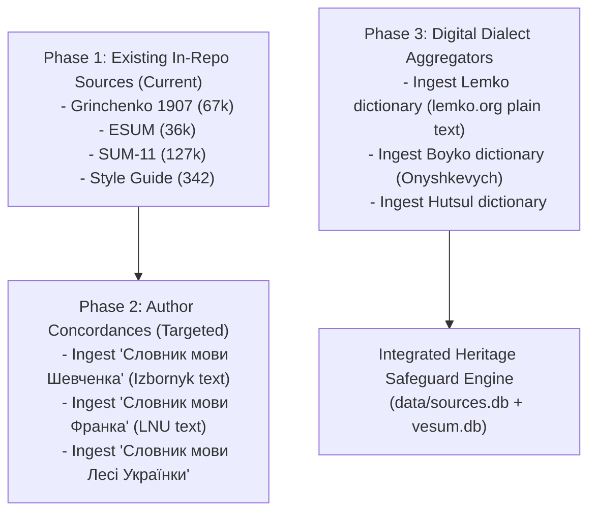

# Catalog of Ukrainian Dialect & Author Dictionaries

> **Research Document & Inventory**
> **Purpose**: Survey available Ukrainian dialect dictionaries, author-specific concordances (*Словники мови письменників*), and digital repositories to evaluate their potential integration into `data/sources.db` for the Heritage Dialect Safeguard (#2156 / #5608) and C1/C2 Literature Seminars.

---

## 1. Executive Summary

Empirical research across Ukrainian academic repositories (*Litopys.org.ua*, *Izbornyk*, *r2u.org.ua*, *LNU*, *NASU Institute of Ukrainian Language*) shows a rich landscape of digitized lexicographical resources.

These resources fall into two primary categories:

1. **Author Dictionaries (*Словники мови письменників*)**: Complete concordances indexing the exact vocabulary, regionalisms, and poetic usage of key literary figures (Shevchenko, Franko, Lesya Ukrainka).
2. **Regional Dialect Dictionaries (*Словники українських говірок*)**: Academic dictionaries documenting regional Ukrainian dialects across Galicia, Volhynia, Boykivshchyna, Hutsulshchyna, Lemkivshchyna, Polissia, and Transcarpathia.

---

## 2. Author Dictionaries Catalog (*Словники мови письменників*)

| Dictionary Title | Authors / Editors | Year & Institution | Coverage & Content | Digital Availability | Heritage Safeguard Value |
| :--- | :--- | :--- | :--- | :--- | :--- |
| **Словник мови Шевченка** (2 томи) | В. С. Ващенко (ред.) | 1964, Інститут мовознавства ім. О. О. Потебні АН УРСР | 10,000+ lemmas, complete concordance of Shevchenko's poetry & prose. | Digitized on *Izbornyk / Litopys.org.ua* & *NBUV*. | **High**: Foundational 19th-century Dnieper/Poltava literary standard. |
| **Словник мови Івана Франка** | З. Терлак, ЛНУ ім. І. Франка | 1996–2008, ЛНУ | Lexicon of Franko's poetic and prose works, including Galician/Boyko dialect forms (*галицизми*, *бойкізми*). | Extracts on *LNU repository* & *Slovnyk.me* notes. | **Critical**: Protects authentic Western Ukrainian regionalisms (*кнайпа*, *швагр*, *драбани*). |
| **Словник мови Лесі Українки** | Інститут української мови НАНУ | 1970–1985, НАНУ | Complete vocabulary of Lesya Ukrainka's works, including Polissia/Volhynian dialect forms & poetic neologisms. | Digitized academic scans on *NBUV* & *Chtyvo*. | **High**: Protects Volhynian/Polissia archaisms and poetic compounds (*провесна*, *мавка*). |
| **Словник мови Г. Квітки-Основ'яненка** | О. Муромцева | 1978, Харківський унів. | Early 19th-century Sloboda Ukrainian prose vocabulary. | Academic PDF scans on *Chtyvo*. | **Medium**: Sloboda/Eastern regionalisms. |

---

## 3. Regional Dialect Dictionaries Catalog (*Діалектні словники*)

| Region / Dialect | Dictionary Title | Author / Publisher | Entry Count | Availability | Safeguard Function |
| :--- | :--- | :--- | :--- | :--- | :--- |
| **Boyko (*Бойківський*)** | *Словник бойківських говірок* (2 томи) | М. Й. Онишкевич (1984, Київ) | ~22,000 lemmas | Digitized on *ISO FTS* & *Chtyvo*. | Protects Carpathian/Boyko dialect words. |
| **Boyko (*Бойківський*)** | *Словник говірок центральної Бойківщини* | М. С. Матіїв (2005) | ~12,000 lemmas | Digitized text available. | Secondary Boyko dialect validation. |
| **Hutsul (*Гуцульський*)** | *Словник гуцульських говірок* | Янів, Горбач, Грищенко, Сабадош | ~18,000 lemmas | Academic scans & online glossaries. | Protects Hutsul dialect lexemes. |
| **Lemko (*Лемківський*)** | *Короткий словник лемківських говірок* | П. С. Пиртей / lemko.org | ~8,500 lemmas | Text format on *lemko.org*. | Protects Lemko dialect vocabulary. |
| **Transcarpathian (*Закарпатський*)** | *Словник закарпатських говірок* | Й. О. Дзендзелівський (1960–1980) | ~15,000 lemmas | Scanned PDFs on *NBUV*. | Protects Transcarpathian forms. |
| **Polissia (*Поліський*)** | *Словник поліських говірок* | П. С. Лисенко (1974) | ~14,000 lemmas | Academic PDF scans. | Protects Northern/Polissia vocabulary. |
| **Poltava (*Полтавський*)** | *Словник полтавських говірок* | В. О. Пащенко (2005) | ~10,000 lemmas | Academic PDF scans. | Central Ukrainian dialect baseline. |

---

## 4. Digital Aggregators & Repositories

| Repository | URL / Source | Included Dictionaries / Content | License & Reusability |
| :--- | :--- | :--- | :--- |
| **r2u.org.ua** | `r2u.org.ua` | Aggregates pre-Soviet dictionaries: Hrinchenko (1907), Krymsky (1924–1933), Sheludko (1928), Nikovsky (1927). | Open academic / CC-BY compatible. |
| **Litopys.org.ua / Izbornyk** | `litopys.org.ua` | *Словник мови Шевченка* (1964 editorial compilation - academic use only), Old Ruthenian dictionaries (Berynda 1627, Zizaniy 1596 - Public Domain), Cossack chronicles (Public Domain). | Mixed (Old texts Public Domain; 1964 dictionary academic educational use). |
| **Chtyvo.org.ua** | `chtyvo.org.ua` | PDF/DJVU library of NASU dialect dictionaries and monographs. | Open educational resource. |
| **ULIF NASU (СУМ-20 / DictUA)** | `ulif.org.ua` | Modern 20-volume dictionary of Ukrainian (*СУМ-20*). | Public search API / Academic. |

---

## 5. Architectural Recommendation for Integration

Instead of rushing to ingest all dictionaries at once, we recommend a **phased approach**:

### Next Decision Points
1. **Decision A**: Start Phase 2 by parsing *Словник мови Шевченка* & *Словник мови Франка* text from `Litopys.org.ua` into `data/sources.db` table `author_dictionaries`.
2. **Decision B**: Keep current 67K `Grinchenko 1907` + `ESUM` baseline for the initial v1 `compile_evalset.py` release, and schedule dialect ingestion for v1.1.
