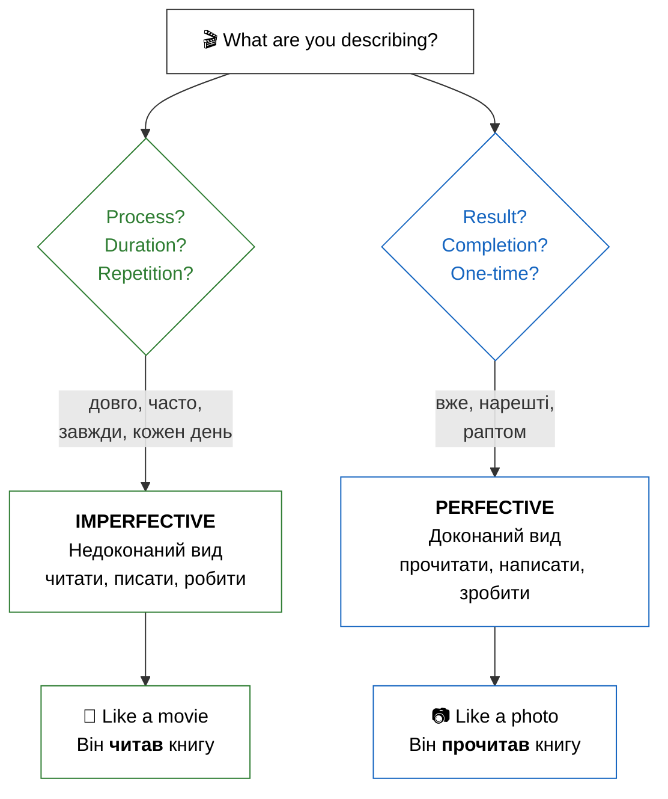

import Quiz from '@site/src/components/Quiz';
import MatchUp from '@site/src/components/MatchUp';
import FillIn from '@site/src/components/FillIn';
import TrueFalse from '@site/src/components/TrueFalse';
import Unjumble from '@site/src/components/Unjumble';
import GroupSort from '@site/src/components/GroupSort';
import Anagram from '@site/src/components/Anagram';
import ErrorCorrection, { ErrorCorrectionItem } from '@site/src/components/ErrorCorrection';
import Cloze from '@site/src/components/Cloze';
import Select from '@site/src/components/Select';
import Translate from '@site/src/components/Translate';
import MarkTheWords, { MarkTheWordsActivity } from '@site/src/components/MarkTheWords';
import HighlightMorphemes, { HighlightMorphemesActivity } from '@site/src/components/HighlightMorphemes';
import EssayResponse from '@site/src/components/EssayResponse';
import ComparativeStudy from '@site/src/components/ComparativeStudy';
import ReadingActivity from '@site/src/components/ReadingActivity';
import CriticalAnalysis from '@site/src/components/CriticalAnalysis';
import AuthorialIntent from '@site/src/components/AuthorialIntent';
import SourceEvaluation from '@site/src/components/SourceEvaluation';
import Debate from '@site/src/components/Debate';
import EtymologyTrace from '@site/src/components/EtymologyTrace';
import GrammarIdentify from '@site/src/components/GrammarIdentify';
import PaleographyAnalysis from '@site/src/components/PaleographyAnalysis';
import DialectComparison from '@site/src/components/DialectComparison';
import TranslationCritique from '@site/src/components/TranslationCritique';
import Transcription from '@site/src/components/Transcription';
import Observe from '@site/src/components/Observe';
import ActivityHelp from '@site/src/components/ActivityHelp';

## Introduction / Вступ

**Ласкаво просимо!** Сьогодні ви дізнаєтесь про **аспект** — одну з найважливіших та найцікавіших тем української граматики. Це справжній переломний момент у вашому навчанні. Якщо відмінки — це кістки мови, то аспекти — це її м'язи та рух. Навчитися відчувати різницю між завершеною дією та процесом — це ключ до того, щоб звучати як справжній українець. Це дозволить вам не просто називати дії, а малювати словами яскраві картини дійсності. Кожен ваш крок у вивченні аспектів наближає вас до розуміння душевної витонченості української мови.

In Ukrainian, verbs usually exist in pairs, representing two aspects: **imperfective** (недоконаний), which focuses on the process, and **perfective** (доконаний), which focuses on the result. Understanding this will help you speak naturally and sound like a native. It's not just a technical rule — it's a way of seeing the world through the lens of duration or completion! For example, you can say «Я писав листа» (you were in the process) or «Я написав листа» (you finished the task). Ця точність надає українській мові особливої емоційності та глибини. Використання правильного аспекту — це як налаштування фокуса в камері: ви або показуєте весь процес, або показуєте результат.

**Що ви вивчите в цьому модулі:**

- The difference between **Imperfective** (process) and **Perfective** (result) aspects.
- How to recognize aspect pairs using **prefixes**.
- When to use each aspect in daily conversation.
- Common aspect pairs to describe your day.

## Presentation / Презентація

### Aspect in Practice (Аспект на практиці)

Аспект — це основа української дієслівної системи. Коли ви говорите українською, ви завжди робите вибір: показати процес або показати результат. Це не просто граматика — це філософія мови, яка пронизує кожне речення. Вибір аспекту часто відображає намір мовця та його ставлення до події. Це дозволяє нам бути дуже точними в описах подій минулого, теперішнього та майбутнього часу.

**Уявіть собі дві ситуації:**

**Ситуація 1:** Вчора ввечері я читав книгу дві години. Я читав і відпочивав. Книга була цікава, але я не закінчив.

- **Дієслово:** **читав** (недоконаний вид).
- **Фокус:** Процес, тривалість, проведення часу. Не важливо, чи є фінальний результат. Ви насолоджуєтеся самим актом читання. Книга все ще відкрита у вашій уяві. Це "триваюча" дійсність.

**Ситуація 2:** Вчора ввечері я прочитав усю книгу. Тепер я знаю, чим вона закінчується. Я можу рекомендувати її друзям.

- **Дієслово:** **прочитав** (доконаний вид).
- **Фокус:** Результат, завершена дія, підсумок. Ви закрили книгу і поклали її на полицю. Дія стала історичним фактом, який має конкретний наслідок у теперішньому. Це "зафіксована" точка часу.

### The System of Aspect Pairs (Система видових пар)

Most Ukrainian verbs come in **pairs**. This might seem like double the work, but it actually adds immense clarity to your speech. The relationship between these pairs is usually logical and follows several patterns. Internalizing these patterns will help you predict the perfective form of a new verb you encounter.

**Method 1: Prefixation (Додавання префікса)**
This is the most frequent method. A prefix (like про-, на-, з-, по-, ви-) turns an open process into a closed result. Think of the prefix as a "cap" that closes the action.

- **читати** (process of reading) -> **прочитати** (the result of having read)
- **писати** (process of writing) -> **написати** (the result: a finished text)
- **робити** (process of doing) -> **зробити** (the result: a finished job)
- **бачити** (seeing) -> **побачити** (noticing/catching sight of)
- **вчити** (studying) -> **вивчити** (learning/mastering)

**Method 2: Suffixation (Зміна суфікса)**
Sometimes the middle of the word changes. These are slightly more complex but very rhythmic once you get used to them.

- **купувати** (process of buying) -> **купити** (the result: a purchase is made)
- **відкривати** (opening) -> **відкрити** (opened)

**Method 3: Suppletion (Різні корені)**
Some of the most basic verbs use completely different roots for each aspect. You must memorize these like irregular verbs.

- **казати** (saying/telling) -> **сказати** (said/told - completed)
- **брати** (taking) -> **взяти** (taken)

> **Note:** You may see **говорити/сказати** paired in some textbooks. However, these verbs have slightly different meanings: говорити = to speak/talk (general), сказати = to say (specific statement). A true aspectual pair shares the same core meaning.

### Aspect Selection Strategy (Як обрати аспект?)

To choose the right aspect, always ask yourself: **"Am I describing a duration or a completion?"** This simple question will guide you through 90% of situations. Ukrainian speakers are very sensitive to this distinction. Contextual clues often dictate the aspect for you.

1. **Duration markers:** Always point to Imperfective. Look for words such as **довго** (long), **цілий день** (all day), **три години** (three hours).
   - *Він довго писав есе.* (He was writing the essay for a long time).
2. **Frequency markers:** These also signal the Imperfective. Common indicators include **часто** (often), **завжди** (always), **кожен день** (every day).
   - *Вона завжди купує квіти.* (She always buys flowers).
3. **Completion markers:** These require the Perfective. Watch out for **нарешті** (at last), **вже** (already), **раптом** (suddenly).
   - *Я вже зробив домашнє завдання!* (I have already done the homework!).

:::info[🤔 **The Philosophy of Done**]
In Ukrainian culture, there is a strong distinction between the effort (imperfective) and the achievement (perfective). Using the perfective aspect often implies a sense of responsibility and pride in having reached a goal. Коли ви кажете «Я вивчив», ви заявляєте про свою перемогу над темою. Це не просто опис дії, а опис вашого успіху.
:::

:::tip[💡 **Memory Hook: The Movie vs. The Photo**]
If you can imagine the action happening over a timeline (a movie), use **Imperfective**. If you can only imagine the final "click" of a camera at the end (a photo), use **Perfective**.
:::

## Practice / Практика

### 1. Identify the Aspect (Визначте вид)

Look at the sentences and identify if the verb shows a process (Imp) or a result (Perf).

1. Я **пив** каву цілий ранок. -> **Недоконаний** (Process/Duration)
2. Я **випив** каву і пішов. -> **Доконаний** (Result/Completion)
3. Вчора ми **дивилися** фільм. -> **Недоконаний** (Activity)
4. Ти **подивився** цей фільм? -> **Доконаний** (Asking for result)
5. Він **робив** стіл три дні. -> **Недоконаний** (Duration)
6. Він **зробив** гарний стіл. -> **Доконаний** (Outcome/Snapshot)

### 2. Aspect Transformation

Put the words in parentheses into the correct aspect based on the context clue.

1. Ми (довго) \_\_\_ (читати/прочитати) статтю. -> **читали** (Imp because of 'довго').
2. Я (вже) \_\_\_ (купувати/купити) квитки. -> **купив** (Perf because of 'вже').
3. Кожен день вона \_\_\_ (писати/написати) листи. -> **пише** (Imp because of 'кожен день').
4. Нарешті він \_\_\_ (казати/сказати) правду. -> **сказав** (Perf because of 'нарешті').
5. Вони (цілий вечір) \_\_\_ (готувати/приготувати) обід. -> **готували** (Imp because of 'цілий вечір').

:::warning[❗ **Prefix Power**]
Notice how the prefix "про-", "на-", or "з-" often creates the perfective form. While there are many prefixes, their main job at this level is to act as a "completion tag" for the verb. Don't worry about the specific meaning of each prefix yet — just learn them as mandatory parts of the verb pair. Це зробить ваше навчання системним.
:::

## Dialogues / Діалоги

### Ти закінчив? (Did you finish?)

**Андрій:** Привіт! Що ти **робив** учора ввечері? (Hi! What were you doing yesterday evening?)
**Олена:** Я весь вечір **читала** дуже цікаву книгу. (I was reading a very interesting book all evening.)
**Андрій:** Ого! Ти її вже **прочитала**? (Wow! Have you already finished it?)
**Олена:** Так, я **прочитала** її до кінця, було неймовірно! (Yes, I read it to the end, it was incredible!)
**Андрій:** А я вчора тільки **писав** есе для університету. (And I was only writing an essay for the university yesterday.)
**Олена:** Ти вже **написав** його? (Have you finished writing it?)
**Андрій:** Ні, ще не **написав**. Але я точно **напишу** його сьогодні. (No, haven't finished yet. But I will definitely finish writing it today.)

### У магазині (At the Store)

**А:** Ви часто **купуєте** тут хліб? (Do you often buy bread here?)
**Б:** Так, я завжди **купую** хліб у цьому магазині. (Yes, I always buy bread in this store.)
**А:** А сьогодні ви вже **купили** все необхідне? (And have you already bought everything necessary today?)
**Б:** Ні, я ще нічого не **купив**. Чекаю на дружину. (No, I haven't bought anything yet. I'm waiting for my wife.)

:::info[🌍 **Grammar of Daily Life**]
In daily life, Ukrainians use imperfective for generic invitations: «Заходьте!» (Come in - the process of welcoming) or «Пишіть!» (Write to us - keep in touch). However, for specific tasks, we switch to perfective: «Напишіть свою адресу» (Write your address - a specific result needed). Context is everything! Розуміння цього нюансу зробить ваше спілкування набагато приємнішим.
:::

## 📋 Summary / Підсумок

У цьому модулі ми відкрили для себе світ дієслівних аспектів:

- **Imperfective Aspect (Недоконаний вид):** фокусується на процесі, тривалості та повторенні. (Що робити?)
- **Perfective Aspect (Доконаний вид):** фокусується на результаті та завершенні дії. (Що зробити?)
- Ви навчилися розрізняти ці види за допомогою слів-маркерів (довго, вже, часто).
- Ми ознайомилися з основними принципами творення видових пар (префіксація та заміна кореня).

Understanding aspect is a journey, not a single step. Every time you learn a new verb from now on, try to learn its "partner" aspect as well. This will build your linguistic intuition and make you a much more effective communicator.

## Need More Practice?

Подивіться на свій розклад на завтра. Що ви будете **робити** (процес), а що ви **зробите** (результат)? Напишіть два списки. Наприклад: «Я буду **читати** новини» (процес) та «Я **напишу** важливий імейл» (результат). Це допоможе вам інтегрувати аспекти у ваше реальне життя! Повторюйте ці пари щодня, і скоро ви почнете відчувати їхню логіку автоматично. Пам'ятайте, що майстерність приходить із практикою.

## 🎯 Activities

### Aspect Pairs

<MatchUp pairs={JSON.parse(`[{"left": "читати", "right": "прочитати"}, {"left": "писати", "right": "написати"}, {"left": "робити", "right": "зробити"}, {"left": "бачити", "right": "побачити"}, {"left": "чути", "right": "почути"}, {"left": "казати", "right": "сказати"}, {"left": "брати", "right": "взяти"}, {"left": "давати", "right": "дати"}, {"left": "їсти", "right": "з'їсти"}, {"left": "пити", "right": "випити"}, {"left": "вчити", "right": "вивчити"}, {"left": "купувати", "right": "купити"}]`)} />

### Aspect Drill

<FillIn items={JSON.parse(`[{"sentence": "Я _____ цю книгу вчора цілий вечір.", "answer": "читав", "options": ["читав", "прочитав", "читаю", "буду читати"]}, {"sentence": "Нарешті я _____ цю книгу!", "answer": "прочитав", "options": ["прочитав", "читав", "читаю", "буду читати"]}, {"sentence": "Ми довго _____ листа мамі.", "answer": "писали", "options": ["писали", "написали", "пишемо", "будемо писати"]}, {"sentence": "Він швидко _____ повідомлення і відправив його.", "answer": "написав", "options": ["написав", "писав", "пише", "буде писати"]}, {"sentence": "Що ти _____ вчора? (What were you doing?)", "answer": "робив", "options": ["робив", "зробив", "роблю", "зроблю"]}, {"sentence": "Ти вже _____ домашнє завдання?", "answer": "зробив", "options": ["зробив", "робив", "робиш", "зробиш"]}, {"sentence": "Я _____ цікавий фільм, коли ти подзвонив.", "answer": "дивився", "options": ["дивився", "подивився", "дивлюся", "подивлюся"]}, {"sentence": "Ти _____ цей новий фільм?", "answer": "подивився", "options": ["подивився", "дивився", "дивишся", "подивишся"]}, {"sentence": "Вона завжди _____ правду.", "answer": "говорить", "options": ["говорить", "скаже", "говорила", "сказала"]}, {"sentence": "Він раптом _____ дивну річ.", "answer": "сказав", "options": ["сказав", "говорив", "каже", "буде говорити"]}]`)} />

### Choose the Correct Aspect

<Cloze passage={"Учора був цікавий день. Вранці я [___:0] книгу дві години і нарешті [___:1] її до кінця. Потім моя сестра [___:2] листа годину і теж [___:3] його. Увечері наш брат [___:4] картину — тепер вона висить на стіні.\nЗазвичай ми [___:5] щодня ввечері. Мама завжди [___:6] нам: «Читання — це добре!» Я вже [___:7] три книги цього місяця.\n— Що ти [___:8] увечері? — запитав тато. — Я [___:9] домашнє завдання і закінчив усе! — відповіла сестра. Тато [___:10] по телефону довго.\nКоли він закінчив, то [___:11]: «Завтра їдемо до бабусі!» Минулого разу ми [___:12] туди три години. Але коли ми нарешті [___:13], було дуже весело!"} blanks={JSON.parse(`[{"index": 0, "answer": "читав", "options": ["читав", "прочитав"]}, {"index": 1, "answer": "прочитав", "options": ["прочитав", "читав"]}, {"index": 2, "answer": "писала", "options": ["писала", "написала"]}, {"index": 3, "answer": "написала", "options": ["написала", "писала"]}, {"index": 4, "answer": "малював", "options": ["малював", "намалював"]}, {"index": 5, "answer": "читаємо", "options": ["читаємо", "прочитаємо"]}, {"index": 6, "answer": "говорить", "options": ["говорить", "скаже"]}, {"index": 7, "answer": "прочитав", "options": ["прочитав", "читав"]}, {"index": 8, "answer": "робив", "options": ["робив", "зробив"]}, {"index": 9, "answer": "зробив", "options": ["зробив", "робив"]}, {"index": 10, "answer": "говорив", "options": ["говорив", "сказав"]}, {"index": 11, "answer": "сказав", "options": ["сказав", "говорив"]}, {"index": 12, "answer": "їхали", "options": ["їхали", "приїхали"]}, {"index": 13, "answer": "приїхали", "options": ["приїхали", "їхали"]}]`)} />

### Process or Result?

<Quiz questions={JSON.parse(`[{"question": "When you say «Я читав книгу цілий вечір,» which aspectual focus are you emphasizing?", "options": [{"text": "Process", "correct": true}, {"text": "Result", "correct": false}, {"text": "Future intent", "correct": false}, {"text": "Single event", "correct": false}], "explanation": ""}, {"question": "When a speaker says «Я прочитав книгу,» what is the primary focus of the action?", "options": [{"text": "Result", "correct": true}, {"text": "Process", "correct": false}, {"text": "Habitual action", "correct": false}, {"text": "Ongoing duration", "correct": false}], "explanation": ""}, {"question": "In the sentence «Вона завжди говорить правду,» what kind of action is being described?", "options": [{"text": "Habitual action", "correct": true}, {"text": "Single event", "correct": false}, {"text": "Future promise", "correct": false}, {"text": "Completed result", "correct": false}], "explanation": ""}, {"question": "When someone says «Він сказав 'так',» what characterizes the nature of this specific action?", "options": [{"text": "Single completed event", "correct": true}, {"text": "Ongoing process", "correct": false}, {"text": "Repeated habit", "correct": false}, {"text": "Long duration", "correct": false}], "explanation": ""}, {"question": "Which of these options correctly identifies the perfective aspect of the verb «читати»?", "options": [{"text": "прочитати", "correct": true}, {"text": "читати", "correct": false}, {"text": "читавати", "correct": false}, {"text": "зачитати", "correct": false}], "explanation": ""}, {"question": "Which of these options correctly identifies the imperfective aspect of the verb «написати»?", "options": [{"text": "писати", "correct": true}, {"text": "написати", "correct": false}, {"text": "пописати", "correct": false}, {"text": "дописати", "correct": false}], "explanation": ""}, {"question": "When you say «Я писав три години,» which aspectual meaning are you emphasizing here?", "options": [{"text": "Duration", "correct": true}, {"text": "Completion", "correct": false}, {"text": "Future goal", "correct": false}, {"text": "Single result", "correct": false}], "explanation": ""}, {"question": "When you say «Я написав листа,» what is the main point you are communicating?", "options": [{"text": "Completion", "correct": true}, {"text": "Duration", "correct": false}, {"text": "Habitual writing", "correct": false}, {"text": "Future intent", "correct": false}], "explanation": ""}, {"question": "What term describes the relationship between the Ukrainian verb pairs «говорити» and «сказати»?", "options": [{"text": "Suppletive pairs", "correct": true}, {"text": "Prefixed pairs", "correct": false}, {"text": "Identical roots", "correct": false}, {"text": "Soft endings", "correct": false}], "explanation": ""}, {"question": "Which specific prefix is commonly used to make the verb «читати» into its perfective form?", "options": [{"text": "про-", "correct": true}, {"text": "на-", "correct": false}, {"text": "з-", "correct": false}, {"text": "по-", "correct": false}], "explanation": ""}, {"question": "Which specific prefix is commonly used to make the verb «писати» into its perfective form?", "options": [{"text": "на-", "correct": true}, {"text": "про-", "correct": false}, {"text": "по-", "correct": false}, {"text": "ви-", "correct": false}], "explanation": ""}, {"question": "In Ukrainian grammar, the concept of verbal aspect is primarily concerned with emphasizing what?", "options": [{"text": "Process vs. result", "correct": true}, {"text": "Past vs. future", "correct": false}, {"text": "First vs. third person", "correct": false}, {"text": "Singular vs. plural", "correct": false}], "explanation": ""}]`)} />

### Aspect Rules

<TrueFalse items={JSON.parse(`[{"statement": "Недоконаний вид фокусується на процесі та тривалості. | Imperfective verbs focus on process and duration.", "isTrue": true, "explanation": "Correct!"}, {"statement": "Доконаний вид вказує на завершені дії. | Perfective verbs indicate completed actions.", "isTrue": true, "explanation": "Yes!"}, {"statement": "Усі видові пари мають один корінь. | All aspect pairs use the same root.", "isTrue": false, "explanation": "Some pairs like говорити/сказати use different roots."}, {"statement": "Більшість дієслів доконаного виду утворюються за допомогою префіксів. | Most perfective verbs are formed with prefixes.", "isTrue": true, "explanation": "Correct! Prefixes like про-, на-, з-, по-."}, {"statement": "Можна використовувати доконаний вид для звичних дій. | You can use perfective for habitual actions.", "isTrue": false, "explanation": "Habitual actions require imperfective."}, {"statement": "«Я читав» може означати \\"I was reading\\". | «Я читав» can mean \\"I was reading.\\"", "isTrue": true, "explanation": "Yes! Imperfective shows ongoing process."}, {"statement": "«Я прочитав» означає \\"I finished reading\\". | «Я прочитав» means \\"I finished reading.\\"", "isTrue": true, "explanation": "Correct!"}, {"statement": "Вид має значення лише в минулому часі. | Aspect only matters in past tense.", "isTrue": false, "explanation": "Aspect matters in all tenses!"}, {"statement": "Брати/взяти мають різні корені. | Брати/взяти use different roots.", "isTrue": true, "explanation": "Yes! They're suppletive pairs."}, {"statement": "Слова тривалості часто вживаються з недоконаним видом. | Duration words often appear with imperfective.", "isTrue": true, "explanation": "Correct! Words like «довго,» «три години.»"}, {"statement": "Англійська мова має таку ж систему виду. | English has the same aspect system.", "isTrue": false, "explanation": "English uses verb forms, not separate verbs."}, {"statement": "Питання «Що ти робив?» використовує недоконаний вид. | The question «Що ти робив?» uses imperfective.", "isTrue": true, "explanation": "Yes! Asking about activities/process."}]`)} />

### Imperfective vs Perfective

<GroupSort groups={JSON.parse(`{"Imperfective": ["читати", "писати", "робити", "говорити", "бачити", "брати"], "Perfective": ["прочитати", "написати", "зробити", "сказати", "побачити", "взяти"]}`)} />

### Aspect Sentences

<Unjumble items={JSON.parse(`[{"jumbled": "я / читав / цікаву / книгу / дві / години / вчора / ввечері", "answer": "Я читав цікаву книгу дві години вчора ввечері"}, {"jumbled": "вона / прочитала / всю / нову / книгу / дуже / швидко / вчора", "answer": "Вона прочитала всю нову книгу дуже швидко вчора"}, {"jumbled": "він / написав / довгий / лист / до / своєї / мами / вчора", "answer": "Він написав довгий лист до своєї мами вчора"}, {"jumbled": "ми / читаємо / українські / книги / та / газети / щодня / вдома", "answer": "Ми читаємо українські книги та газети щодня вдома"}, {"jumbled": "вона / сказала / щиру / правду / про / всю / цю / ситуацію", "answer": "Вона сказала щиру правду про всю цю ситуацію"}, {"jumbled": "я / бачив / синє / море / вперше / у / моєму / житті", "answer": "Я бачив синє море вперше у моєму житті"}, {"jumbled": "він / зробив / все / домашнє / завдання / дуже / добре / вчора", "answer": "Він зробив все домашнє завдання дуже добре вчора"}, {"jumbled": "вона / завжди / говорить / українською / мовою / зі / своєю / сестрою", "answer": "Вона завжди говорить українською мовою зі своєю сестрою"}, {"jumbled": "я / вже / прочитав / цю / цікаву / книгу / до / кінця", "answer": "Я вже прочитав цю цікаву книгу до кінця"}, {"jumbled": "він / довго / і / уважно / писав / цю / нову / статтю", "answer": "Він довго і уважно писав цю нову статтю"}, {"jumbled": "ми / нарешті / приїхали / до / Києва / сьогодні / дуже / рано", "answer": "Ми нарешті приїхали до Києва сьогодні дуже рано"}, {"jumbled": "я / взяв / свою / стару / книгу / зі / столу / вчора", "answer": "Я взяв свою стару книгу зі столу вчора"}]`)} />

### Fix the Aspect

<ErrorCorrection>
  <ErrorCorrectionItem sentence="Я прочитав книгу три години." errorWord="прочитав" correctForm="читав" options={JSON.parse(`["читав", "прочитав", "буду читати", "читаю"]`)} explanation="Duration (три години) requires imperfective «читав» even if context seems «completed.»" />
  <ErrorCorrectionItem sentence="Вона писала листа і закінчила." errorWord="писала" correctForm="написала" options={JSON.parse(`["писала", "написала", "пише", "буде писати"]`)} explanation="Completed result with emphasis on finish → perfective «написала.»" />
  <ErrorCorrectionItem sentence="Ми прочитаємо кожен день." errorWord="прочитаємо" correctForm="читаємо" options={JSON.parse(`["читаємо", "прочитаємо", "читали", "будемо читати"]`)} explanation="Habitual action («кожен день») requires imperfective «читаємо.»" />
  <ErrorCorrectionItem sentence="Він говорив «привіт» один раз." errorWord="говорив" correctForm="сказав" options={JSON.parse(`["говорив", "сказав", "говорить", "каже"]`)} explanation="Single completed speech act → perfective «сказав.»" />
  <ErrorCorrectionItem sentence="Я бачив її вчора вперше!" errorWord="бачив" correctForm="побачив" options={JSON.parse(`["бачив", "побачив", "бачу", "побачу"]`)} explanation="Single event with result → perfective «побачив.»" />
  <ErrorCorrectionItem sentence="Вона сказала довго." errorWord="сказала" correctForm="говорила" options={JSON.parse(`["говорила", "сказала", "говорить", "каже"]`)} explanation="Duration emphasis («довго») requires imperfective «говорила.»" />
  <ErrorCorrectionItem sentence="Ти вже робив домашнє завдання?" errorWord="робив" correctForm="зробив" options={JSON.parse(`["робив", "зробив", "робиш", "зробиш"]`)} explanation="Question about completed result → perfective «зробив.»" />
  <ErrorCorrectionItem sentence="Я попрацював цілий вечір." errorWord="попрацював" correctForm="працював" options={JSON.parse(`["працював", "попрацював", "працюю", "буду працювати"]`)} explanation="Duration marker («цілий вечір») requires imperfective «працював.»" />
</ErrorCorrection>

### Complete the Story

<Cloze passage={"Учора я [___:0] цілий день. Спочатку я [___:1] статтю для роботи. Потім я [___:2] кілька листів. Увечері я нарешті [___:3] книгу, яку [___:4] цілий місяць. --- Сьогодні вранці я [___:5] рано. Я [___:6] каву і [___:7] сніданок. Потім я [___:8] до роботи. На роботі я [___:9] цілий день. Увечері я [___:10] додому і [___:11] смачну вечерю."} blanks={JSON.parse(`[{"index": 0, "answer": "працював", "options": ["працював", "працювати", "попрацювати"]}, {"index": 1, "answer": "прочитав", "options": ["прочитав", "читати", "прочитати"]}, {"index": 2, "answer": "написав", "options": ["написав", "писати", "написати"]}, {"index": 3, "answer": "закінчив", "options": ["закінчив", "закінчувати", "закінчити"]}, {"index": 4, "answer": "читав", "options": ["читав", "читати", "прочитати"]}, {"index": 5, "answer": "встав", "options": ["встав", "вставати", "встати"]}, {"index": 6, "answer": "випив", "options": ["випив", "пити", "випити"]}, {"index": 7, "answer": "з'їв", "options": ["з'їв", "їсти", "з'їсти"]}, {"index": 8, "answer": "пішов", "options": ["пішов", "іти", "піти"]}, {"index": 9, "answer": "працював", "options": ["працював", "працювати", "попрацювати"]}, {"index": 10, "answer": "прийшов", "options": ["прийшов", "йти", "прийти"]}, {"index": 11, "answer": "приготував", "options": ["приготував", "готувати", "приготувати"]}]`)} />

### Aspect in Conversation

<Select questions={JSON.parse(`[{"question": "— Що ти робив учора? — Я читав книгу. — Ти прочитав її? — ...", "options": [{"text": "Ні, ще читаю.", "correct": true}, {"text": "Так, закінчив.", "correct": false}, {"text": "Ні, я не читати.", "correct": false}, {"text": "Прочитаю завтра.", "correct": false}], "explanation": "Процес триває → недоконаний вид: «ще читаю»."}, {"question": "— Ти написав листа? — Ні, ще пишу. — Довго ти вже пишеш? — ...", "options": [{"text": "Дві години.", "correct": true}, {"text": "Написав швидко.", "correct": false}, {"text": "Напишу завтра.", "correct": false}, {"text": "Писатиму довго.", "correct": false}], "explanation": "Питання про тривалість процесу → відповідь вказує час."}, {"question": "— Довго ти вже пишеш? — Дві години. — Коли закінчиш? — ...", "options": [{"text": "Скоро напишу!", "correct": true}, {"text": "Вже писав.", "correct": false}, {"text": "Завтра писатиму.", "correct": false}, {"text": "Писав годину.", "correct": false}], "explanation": "Питання про момент завершення → доконаний вид: «напишу»."}, {"question": "— А коли прочитаєш книгу? — ...", "options": [{"text": "Думаю, завтра закінчу.", "correct": true}, {"text": "Читав учора.", "correct": false}, {"text": "Буду читати.", "correct": false}, {"text": "Читаю зараз.", "correct": false}], "explanation": "Питання про момент завершення → доконаний вид: «закінчу»."}, {"question": "— Що ти робив увесь вечір? — ...", "options": [{"text": "Працював над проектом.", "correct": true}, {"text": "Попрацював трохи.", "correct": false}, {"text": "Працюватиму.", "correct": false}, {"text": "Попрацюю завтра.", "correct": false}], "explanation": "«Увесь вечір» = тривалість → недоконаний вид: «працював»."}, {"question": "— Ти вже пообідав? — ...", "options": [{"text": "Так, щойно поїв.", "correct": true}, {"text": "Їв обід.", "correct": false}, {"text": "Буду їсти.", "correct": false}, {"text": "Їстиму пізніше.", "correct": false}], "explanation": "Питання про завершену дію → доконаний вид: «поїв»."}]`)} />

### Identify Aspect

<MarkTheWords>
  <MarkTheWordsActivity instruction="Клацніть на дієслова ДОКОНАНОГО виду." text="Учора був цікавий день. Вранці я встав о сьомій і випив каву. Потім я пішов на роботу. На роботі я працював цілий день, але закінчив усі справи. Увечері я приготував вечерю і подзвонив другові. Ми поговорили годину і домовились зустрітися завтра. Потім я почитав книгу і заснув." correctWords={JSON.parse(`["встав", "випив", "пішов", "закінчив", "приготував", "подзвонив", "поговорили", "домовились", "заснув"]`)} />
</MarkTheWords>

## 📚 Vocabulary

| Word | IPA | English | POS | Gender | Note |
| --- | --- | --- | --- | --- | --- |
| вид | /ʋɪd/ | aspect, view | noun | ч |  |
| всередині | /ʋsɛrˈɛdɪni/ | inside (location) | adv |  |  |
| доконаний | /dɔkˈɔnanɪj/ | perfective | adj |  |  |
| есе | /ɛsˈɛ/ | essay | noun | с |  |
| золоте | /zɔlɔtˈɛ/ | golden | noun | с |  |
| найпоширеніший | /najpɔʃˈɪrɛniʃɪj/ | the most widespread | adj |  |  |
| недоконаний | /nɛdɔkˈɔnanɪj/ | imperfective | adj |  |  |
| неймовірно | /nɛjmɔʋˈirnɔ/ | incredibly | adv |  |  |
| німецький | /nimˈɛt͡sʲkɪj/ | German | adj |  |  |
| пиво | /pˈɪʋɔ/ | beer | noun |  |  |
| практикуватися | /praktɪkuʋˈatɪsja/ | to practice (oneself) | verb |  |  |
| проводити | /prɔʋɔdɪtɪ/ | to conduct, to lead (imperfective) | verb |  |  |
| розібрати | /rɔzibrˈatɪ/ | to disassemble, to sort out, to understand | verb |  |  |
| світогляд | /sʋitˈɔɦljad/ | worldview | noun |  |  |
| теза | /tˈɛza/ | thesis, point | noun | ж |  |
| філософія | /filɔsˈɔfija/ | philosophy | noun | ж |  |
| інформація | /infɔrmˈat͡sija/ | information | noun | ж |  |