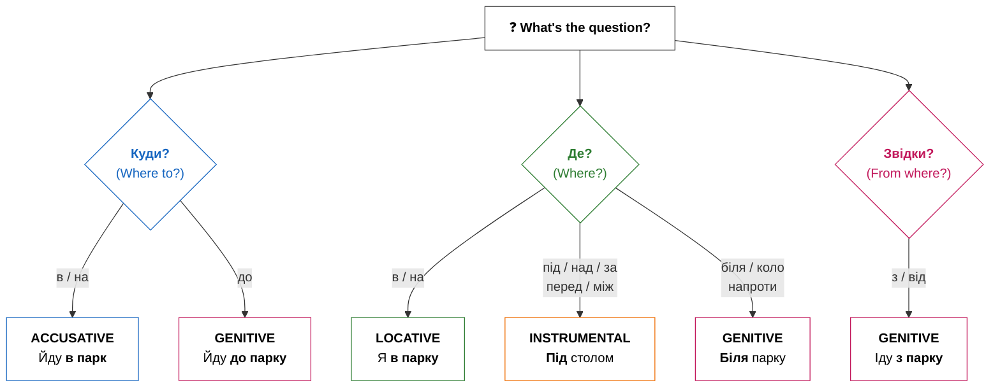

import Quiz from '@site/src/components/Quiz';
import MatchUp from '@site/src/components/MatchUp';
import FillIn from '@site/src/components/FillIn';
import TrueFalse from '@site/src/components/TrueFalse';
import Unjumble from '@site/src/components/Unjumble';
import GroupSort from '@site/src/components/GroupSort';
import Anagram from '@site/src/components/Anagram';
import ErrorCorrection, { ErrorCorrectionItem } from '@site/src/components/ErrorCorrection';
import Cloze from '@site/src/components/Cloze';
import Select from '@site/src/components/Select';
import Translate from '@site/src/components/Translate';
import MarkTheWords, { MarkTheWordsActivity } from '@site/src/components/MarkTheWords';
import HighlightMorphemes, { HighlightMorphemesActivity } from '@site/src/components/HighlightMorphemes';
import EssayResponse from '@site/src/components/EssayResponse';
import ComparativeStudy from '@site/src/components/ComparativeStudy';
import ReadingActivity from '@site/src/components/ReadingActivity';
import CriticalAnalysis from '@site/src/components/CriticalAnalysis';
import AuthorialIntent from '@site/src/components/AuthorialIntent';
import SourceEvaluation from '@site/src/components/SourceEvaluation';
import Debate from '@site/src/components/Debate';

## Introduction / Вступ

Привіт! Ready to navigate Ukraine like a local? Prepositions are small but mighty words that connect nouns to the rest of the sentence. In English, prepositions like «in,» «on,» «to,» and «from» are straightforward. But in Ukrainian, prepositions work hand-in-hand with grammatical cases — and some prepositions even change meaning depending on which case follows them! This is one of the most exciting parts of learning Ukrainian because it allows you to be extremely precise about where things are and where they are going. Mastering this is like unlocking a 3D map of the language.

This module is your comprehensive guide to Ukrainian spatial prepositions. By the end, you'll understand how to combine prepositions with the correct cases to express location and motion accurately. Understanding these spatial relationships is the key to navigating any Ukrainian city, describing your home, or simply finding your keys! Whether you are asking for directions to the Maidan or explaining that your cat is under the sofa, these tiny words are your best allies.

**Що ви навчитеся:**
- Відповідати на питання **Де?**, **Куди?**, **Звідки?** правильно
- Обирати правильний відмінок для кожного прийменника
- Орієнтуватися в українському місті як місцевий житель

**Чому це важливо:** Неправильне поєднання прийменників і відмінків — одна з найпоширеніших помилок. Опанування цих шаблонів одразу зробить вашу українську мову природнішою і точнішою. Це не просто слова, це логіка простору. Коли ви розумієте просторову логіку, мова стає чіткою структурою, а не набором звуків. Це фундамент для вільного спілкування.

## Presentation / Презентація

### The Primary Logic: Motion vs. Location (Рух чи місце?)

Найважливіша концепція — це різниця між "Де?" (**Where?**) і "Куди?" (**Where to?**). В українській мові прийменники змінюють відмінок залежно від цього розрізнення. Це геніальна особливість мови, яка запобігає двозначності.

The most important concept to master is the difference between "Where?" (**Де?**) and "Where to?" (**Куди?**). In Ukrainian, several prepositions change the case they govern based on this distinction. This is a brilliant feature of the language that prevents ambiguity.

| Питання | Прийменник | Відмінок | Приклад |
|---------|------------|----------|---------|
| **Куди?** | в, на, під, за | Знахідний | Йду **в парк** |
| **Куди?** | до | Родовий | Йду **до парку** |
| **Де?** | в, на | Місцевий | Я **в парку** |
| **Де?** | під, над, за, перед, між | Орудний | Під **столом** |
| **Де?** | біля, коло, напроти | Родовий | Біля **парку** |
| **Звідки?** | з, від | Родовий | Іду **з парку** |

| Прийменник | Рух                  | Місце                  |
| :--------- | :------------------- | :--------------------- |
| **в / у**  | Йти **в школу**.     | Бути **в школі**.      |
| **на**     | Класти **на стіл**.  | Лежати **на столі**.   |
| **під**    | Класти **під стіл**. | Лежати **під столом**. |
| **за**     | Йти **за будинок**.  | Бути **за будинком**.  |

Коли ви говорите про рух (куди?), ви наче "цілитеся" в об'єкт, тому використовуєте знахідний відмінок. Це дуже логічно: ви спрямовуєте свою енергію на предмет. Коли ви описуєте місце (де?), ви фіксуєте стан спокою, тому використовуєте місцевий або орудний відмінки. Вибір залежить від конкретного прийменника. Наприклад, **в** та **на** традиційно потребують місцевого відмінка для позначення знаходження.

### Prepositions with the Instrumental Case (З орудним відмінком)

The Instrumental case is very versatile. Besides "means" and "roles," it is the standard case for prepositions that describe "static" spatial relationships like *under*, *above*, *behind*, or *between*. These prepositions help us pinpoint exactly where an object is located in relation to others.

- **під** (under) -> Кіт спить **під столом**.
- **над** (above) -> Лампа висить **над столом**.
- **перед** (in front of) -> Машина стоїть **перед будинком**.
- **за** (behind) -> Сад знаходиться **за будинком**.
- **між** (between) -> Дзеркало висить **між вікнами**.

Ці прийменники завжди вимагають орудного відмінка, коли ми описуємо, де знаходиться предмет.

| Рід | Закінчення | Приклад |
|-----|------------|---------|
| Чоловічий | **-ом** / **-ем** | під стол**ом**, перед учител**ем** |
| Жіночий | **-ою** / **-ею** | за шаф**ою**, над земл**ею** |
| Середній | **-ом** / **-ем** | над вікн**ом**, під мор**ем** |
| Plural | **-ами** / **-ями** | між вікн**ами**, перед двер**има** |

Note: Some nouns have special plural forms (двері → двер**има**, діти → діть**ми**).

### Genitive Prepositions (З родовим відмінком)

Many spatial prepositions also use the **Genitive case** (**родовий відмінок**), especially those indicating origin, purpose, or proximity. The Genitive case is often used to show starting points or limits.

- **до** (to / towards) -> Я йду **до школи**. (Towards the school)
- **з / із** (from) -> Я йду **з роботи**. (Originating from work)
- **біля / коло** (near) -> Стіл стоїть **біля вікна**. (Proximity)
- **від** (from / away from) -> Це далеко **від центру**. (Distance)

Крім того, є прийменники, які описують складніші просторові відношення: **напроти** (opposite), **вздовж** (along) та **навколо** (around). Наприклад: «Він йде **вздовж** річки» або «Ми сидимо **навколо** вогнища». Всі ці слова вимагають родового відмінка. Це допомагає створити дуже точний опис простору. Коли ви кажете «Ми стоїмо **напроти** банку», ви чітко вказуєте локацію.

### The в/у Alternation (Милозвучність)

The choice between **в** and **у** is purely for sound (euphony). **У** is preferred after consonants or before words starting with several consonants. **В** is used after vowels.

- Він **у** лісі. (He is in the forest.)
- Вона **в** офісі. (She is in the office.)

Цей принцип милозвучності робить українську мову однією з найспівучіших у світі. Намагайтеся звертати увагу на звуки навколо цих маленьких прийменників. Це не суворе правило, але ваша мова звучатиме набагато природніше, якщо ви будете його дотримуватися.

:::info[🤔 **The Logic of Space**]
Why do we use Accusative for motion? Think of it as the "target." The Accusative case marks the direct object of the motion. When the motion stops and becomes a state, we shift to cases that describe "presence" (Locative/Instrumental). This mental shift from dynamic to static is the key to mastering Ukrainian syntax.
:::

:::tip[💡 **The в vs у Rule**]
Ukrainian loves harmony (euphony). Use **у** if the previous word ends in a consonant (Він **у** кімнаті). Use **в** if it ends in a vowel (Вона **в** офісі). This makes your speech flow smoothly! This rule is not a strict law but a strong recommendation for sounding like a native speaker.
:::

## Practice / Практика

This section will test your ability to differentiate between static location and dynamic motion. Look closely at the context of each sentence.

### 1. Where is the cat? (Де кіт?)

Look at the sentences and choose the correct case (Instrumental, Locative, or Genitive).

1. Кіт за (шафа) -> **Кіт за шафою.** (He is behind it.)
2. Книга на (стіл) -> **Книга на столі.** (It is on it.)
3. Лампа над (ліжко) -> **Лампа над ліжком.** (It hangs above.)
4. Собака під (стілець) -> **Собака під стільцем.** (He is underneath.)
5. Ми в (офіс) -> **Ми в офісі.** (We are inside.)
6. Автобус біля (зупинка) -> **Автобус біля зупинки.** (It's by the stop.)

### 2. Motion vs. Location (Куди чи Де?)

Choose the correct ending (Accusative for motion, Locative for location or state).

1. Я йду в (парк) -> **Я йду в парк.** (Motion / Acc)
2. Я гуляю в (парк) -> **Я гуляю в парку.** (Location / Loc)
3. Поклади зошит на (полиця) -> **Поклади зошит на полицю.** (Motion / Acc)
4. Зошит лежить на (полиця) -> **Зошит лежить на полиці.** (Location / Loc)
5. Він їде до (місто) -> **Він їде до міста.** (Direction / Gen)

:::warning[❗ **Always Check the Question!**]
Before you choose an ending, ask yourself: **Де?** (Location), **Куди?** (Direction), or **Звідки?** (Origin). Then check which preposition you need — the preposition determines the case, not just the question!
- Куди? + **в/на** → Accusative (Йду **в парк**)
- Куди? + **до** → Genitive (Йду **до парку**)
- Де? + **в/на** → Locative (Я **в парку**)
- Де? + **під/над/за** → Instrumental (Під **столом**)
- Звідки? + **з/від** → Genitive (Іду **з парку**)
:::

## Dialogues / Діалоги

### Пошук дороги (Finding the way)

**А:** Вибачте, чи є тут банк **біля** метро? (Excuse me, is there a bank near the metro?)
**Б:** Так, ідіть прямо **до** перехрестя, потім поверніть праворуч. Банк буде **за** рогом. (Yes, go straight to the intersection, then turn right. The bank will be around the corner.)
**А:** Це далеко **від** парку? (Is it far from the park?)
**Б:** Ні, це **напроти** аптеки, **між** магазином і кафе. (No, it's opposite the pharmacy, between the shop and the cafe.)
**А:** Дякую! Це було дуже зрозуміло.

### У новій квартирі (In a new apartment)

**А:** Тут дуже гарно! Де ми поставимо цей стіл? (It's very nice here! Where will we put this table?)
**Б:** Давай поставимо його **біля** вікна. Нам потрібно багато світла. (Let's put it near the window. We need lots of light.)
**А:** Добре. А куди повісимо картину? (Good. And where will we hang the picture?)
**Б:** Можна повісити її **над** ліжком або **перед** входом. (We can hang it above the bed or in front of the entrance.)
**А:** **Над** ліжком буде краще. Там вона завжди перед очима. (**Above** the bed will be better. It's always in sight there.)

:::info[🌍 **Ukrainian Towns**]
Traditional Ukrainian towns often have a central square (**майдан** or **площа**). People meet **на площі** (Loc), go **до центру** (Gen), or walk **вздовж річки** (Gen/along the river). Spatial prepositions are the GPS of the Ukrainian soul! Navigation is not just about geography, but about the social heart of the city.
:::

## 📋 Summary / Підсумок

**Вітаємо!** Тепер ви можете:

- ✅ Відповідати на **Де?** — використовуючи місцевий, орудний або родовий відмінок
- ✅ Відповідати на **Куди?** — використовуючи знахідний (в/на) або родовий (до)
- ✅ Відповідати на **Звідки?** — використовуючи родовий відмінок (з/від)
- ✅ Застосовувати чергування **у/в** для милозвучності
- ✅ Правильно обирати закінчення орудного відмінка для всіх родів

You've mastered one of the trickiest parts of Ukrainian grammar! These 12+ prepositions are your spatial toolkit. Whether you're asking for directions to the Maidan or describing where your cat is hiding, you now have the precision of a native speaker.

## Need More Practice?

Подивіться навколо себе. Де знаходиться ваш телефон? Де стоїть ваш комп’ютер? Напишіть 5 речень про свою кімнату, використовуючи різні прийменники та відмінки. Наприклад: «Мій телефон лежить **на столі**». Ваша щоденна практика — це запорука вашого успіху в мові!

## 🎯 Activities

### Preposition Meanings

<MatchUp pairs={JSON.parse(`[{"left": "в/у", "right": "in, into"}, {"left": "на", "right": "on, onto"}, {"left": "з/із", "right": "from, with"}, {"left": "до", "right": "to, until"}, {"left": "від", "right": "from (person)"}, {"left": "для", "right": "for"}, {"left": "без", "right": "without"}, {"left": "під", "right": "under"}, {"left": "над", "right": "above"}, {"left": "перед", "right": "in front of"}, {"left": "за", "right": "behind"}, {"left": "між", "right": "between"}]`)} />

### Choose the Correct Preposition

<FillIn items={JSON.parse(`[{"sentence": "Вона йде ___ школи.", "answer": "до", "options": ["до", "на", "в", "за"]}, {"sentence": "Кава ___ цукру.", "answer": "без", "options": ["без", "з", "від", "про"]}, {"sentence": "Лист ___ мами.", "answer": "від", "options": ["від", "для", "до", "з"]}, {"sentence": "Подарунок ___ тебе.", "answer": "для", "options": ["для", "від", "до", "про"]}, {"sentence": "Він іде ___ роботи.", "answer": "з", "options": ["з", "до", "на", "через"]}, {"sentence": "Лампа ___ столом.", "answer": "над", "options": ["над", "під", "на", "за"]}, {"sentence": "Стояти ___ дверима.", "answer": "перед", "options": ["перед", "за", "між", "над"]}, {"sentence": "Йти ___ парк.", "answer": "через", "options": ["через", "про", "на", "з"]}, {"sentence": "Говорити ___ тебе.", "answer": "про", "options": ["про", "для", "через", "без"]}, {"sentence": "Кіт ___ столом.", "answer": "під", "options": ["під", "над", "на", "перед"]}, {"sentence": "Гуляти ___ друзями.", "answer": "з", "options": ["з", "до", "від", "через"]}, {"sentence": "___ нами.", "answer": "Між", "options": ["Між", "За", "Над", "Перед"]}]`)} />

### Motion or Location?

<Quiz questions={JSON.parse(`[{"question": "In the sentence «Я йду в школу,» which grammatical case is the word «школу» in?", "options": [{"text": "Accusative (motion)", "correct": true}, {"text": "Locative (location)", "correct": false}, {"text": "Genitive", "correct": false}, {"text": "Instrumental", "correct": false}], "explanation": ""}, {"question": "In the sentence «Він у школі,» which grammatical case is the word «школі» in?", "options": [{"text": "Locative (location)", "correct": true}, {"text": "Accusative (motion)", "correct": false}, {"text": "Instrumental", "correct": false}, {"text": "Genitive", "correct": false}], "explanation": ""}, {"question": "When someone places a book on a table, as in «Вона кладе книгу на стіл,» which case is «стіл»?", "options": [{"text": "Accusative (motion)", "correct": true}, {"text": "Locative (location)", "correct": false}, {"text": "Genitive", "correct": false}, {"text": "Instrumental", "correct": false}], "explanation": ""}, {"question": "When a book is already lying on a table, as in «Книга лежить на столі,» which case is «столі»?", "options": [{"text": "Locative (location)", "correct": true}, {"text": "Accusative (motion)", "correct": false}, {"text": "Instrumental", "correct": false}, {"text": "Genitive", "correct": false}], "explanation": ""}, {"question": "When a cat runs under a table, as in «Кіт біжить під стіл,» which case is «стіл»?", "options": [{"text": "Accusative (motion)", "correct": true}, {"text": "Instrumental (location)", "correct": false}, {"text": "Genitive", "correct": false}, {"text": "Locative", "correct": false}], "explanation": ""}, {"question": "When a cat is sleeping under a table already, as in «Кіт спить під столом,» which case is «столом»?", "options": [{"text": "Instrumental (location)", "correct": true}, {"text": "Accusative (motion)", "correct": false}, {"text": "Locative", "correct": false}, {"text": "Genitive", "correct": false}], "explanation": ""}, {"question": "When someone goes behind a building for motion, as in «Вони йдуть за будинок,» which case is used?", "options": [{"text": "Accusative (motion)", "correct": true}, {"text": "Instrumental (location)", "correct": false}, {"text": "Genitive", "correct": false}, {"text": "Locative", "correct": false}], "explanation": ""}, {"question": "When someone is standing behind a building expressing location, as in «Вони стоять за будинком,» which case?", "options": [{"text": "Instrumental (location)", "correct": true}, {"text": "Accusative (motion)", "correct": false}, {"text": "Locative", "correct": false}, {"text": "Genitive", "correct": false}], "explanation": ""}, {"question": "In Ukrainian grammar, which preposition always requires the Genitive case regardless of context?", "options": [{"text": "без", "correct": true}, {"text": "над", "correct": false}, {"text": "про", "correct": false}, {"text": "на", "correct": false}], "explanation": ""}, {"question": "In Ukrainian grammar, which preposition always requires the Instrumental case regardless of context?", "options": [{"text": "між", "correct": true}, {"text": "до", "correct": false}, {"text": "через", "correct": false}, {"text": "про", "correct": false}], "explanation": ""}, {"question": "In Ukrainian, the preposition «про» (about) always requires which grammatical case to follow it?", "options": [{"text": "Accusative", "correct": true}, {"text": "Genitive", "correct": false}, {"text": "Instrumental", "correct": false}, {"text": "Locative", "correct": false}], "explanation": ""}, {"question": "In Ukrainian, the preposition «для» (for) always requires which grammatical case to follow it?", "options": [{"text": "Genitive", "correct": true}, {"text": "Accusative", "correct": false}, {"text": "Dative", "correct": false}, {"text": "Instrumental", "correct": false}], "explanation": ""}]`)} />

### Preposition Rules

<TrueFalse items={JSON.parse(`[{"statement": "Prepositions in Ukrainian require specific grammatical cases.", "isTrue": true, "explanation": "Correct! Every Ukrainian preposition is linked to one or more cases."}, {"statement": "«В школу» and «в школі» mean exactly the same thing.", "isTrue": false, "explanation": "False! «В школу» means motion TO school; «в школі» (locative) means location AT school."}, {"statement": "«Без» always takes the genitive case.", "isTrue": true, "explanation": "Yes! «Без цукру» uses genitive."}, {"statement": "«Над» always takes the instrumental case.", "isTrue": true, "explanation": "Correct! «Над столом» uses instrumental."}, {"statement": "«На» only takes accusative case.", "isTrue": false, "explanation": "False! «На» takes accusative for motion, locative for location."}, {"statement": "«До» takes genitive case.", "isTrue": true, "explanation": "Yes! «До школи» uses genitive."}, {"statement": "«З» always means \\"from.\\"", "isTrue": false, "explanation": "«З» can mean \\"from\\" with genitive OR \\"with\\" with instrumental."}, {"statement": "Motion uses accusative with в/у, на, під, за.", "isTrue": true, "explanation": "Correct! These two-way prepositions use accusative for motion."}, {"statement": "«В» and «у» have the same meaning.", "isTrue": true, "explanation": "Yes! They differ only in when you use them for euphony."}, {"statement": "«Перед» takes locative case.", "isTrue": false, "explanation": "«Перед» takes instrumental: «перед дверима.»"}, {"statement": "«Між» means \\"between\\" and takes instrumental.", "isTrue": true, "explanation": "Correct! «Між нами»."}, {"statement": "Location after «під» uses instrumental, not locative.", "isTrue": true, "explanation": "Yes! «Під столом» uses instrumental."}]`)} />

### Prepositions by Case

<GroupSort groups={JSON.parse(`{"Genitive": ["з = from", "до", "від", "для", "без", "біля"], "Accusative": ["про", "через"], "Instrumental": ["з = with", "над", "перед", "між"]}`)} />

### Preposition Sentences

<Unjumble items={JSON.parse(`[{"jumbled": "вранці / я / йду / до / школи / щодня", "answer": "Вранці я йду до школи щодня"}, {"jumbled": "наша / школа / знаходиться / біля / дуже / великого / і / красивого / парку", "answer": "Наша школа знаходиться біля дуже великого і красивого парку"}, {"jumbled": "увечері / я / повертаюся / зі / школи / додому", "answer": "Увечері я повертаюся зі школи додому"}, {"jumbled": "моя / кімната / на / другому / поверсі / у / будинку", "answer": "Моя кімната на другому поверсі у будинку"}, {"jumbled": "лампа / висить / над / столом / і / світить / яскраво", "answer": "Лампа висить над столом і світить яскраво"}, {"jumbled": "мій / старий / кіт / завжди / спить / під / великим / кухонним / столом", "answer": "Мій старий кіт завжди спить під великим кухонним столом"}, {"jumbled": "книги / лежать / на / столі / у / кімнаті", "answer": "Книги лежать на столі у кімнаті"}, {"jumbled": "мій / старший / брат / стоїть / перед / дверима / і / довго / чекає", "answer": "Мій старший брат стоїть перед дверима і довго чекає"}, {"jumbled": "сестра / гуляє / за / будинком / у / саду", "answer": "Сестра гуляє за будинком у саду"}, {"jumbled": "маленьке / вікно / знаходиться / між / двома / дуже / великими / дверима", "answer": "Маленьке вікно знаходиться між двома дуже великими дверима"}]`)} />

### Fix the Case

<ErrorCorrection>
  <ErrorCorrectionItem sentence="Він йде до школа." errorWord="школа" correctForm="школи" options={JSON.parse(`["школа", "школи", "школу", "школі"]`)} explanation="«До» requires genitive case: школа → школи." />
  <ErrorCorrectionItem sentence="Кава без цукор." errorWord="цукор" correctForm="цукру" options={JSON.parse(`["цукор", "цукру", "цукром", "цукрі"]`)} explanation="«Без» requires genitive case: цукор → цукру." />
  <ErrorCorrectionItem sentence="Лампа над стіл." errorWord="стіл" correctForm="столом" options={JSON.parse(`["стіл", "столом", "столі", "столу"]`)} explanation="«Над» requires instrumental case: стіл → столом." />
  <ErrorCorrectionItem sentence="Подарунок для мама." errorWord="мама" correctForm="мами" options={JSON.parse(`["мама", "мами", "маму", "мамі"]`)} explanation="«Для» requires genitive case: мама → мами." />
  <ErrorCorrectionItem sentence="Вони говорять про ти." errorWord="ти" correctForm="тебе" options={JSON.parse(`["ти", "тебе", "тобі", "тобою"]`)} explanation="«Про» requires accusative case: ти → тебе." />
  <ErrorCorrectionItem sentence="Він гуляє з друг." errorWord="друг" correctForm="другом" options={JSON.parse(`["друг", "другом", "друга", "другу"]`)} explanation="«З» (with) requires instrumental case: друг → другом." />
  <ErrorCorrectionItem sentence="Стояти перед двері." errorWord="двері" correctForm="дверима" options={JSON.parse(`["двері", "дверима", "дверей", "дверях"]`)} explanation="«Перед» requires instrumental case: двері → дверима." />
  <ErrorCorrectionItem sentence="Між ми." errorWord="ми" correctForm="нами" options={JSON.parse(`["ми", "нами", "нас", "нам"]`)} explanation="«Між» requires instrumental case: ми → нами." />
  <ErrorCorrectionItem sentence="Лист від мама." errorWord="мама" correctForm="мами" options={JSON.parse(`["мама", "мами", "маму", "мамі"]`)} explanation="«Від» requires genitive case: мама → мами." />
  <ErrorCorrectionItem sentence="Йти через парку." errorWord="парку" correctForm="парк" options={JSON.parse(`["парку", "парк", "парком", "парці"]`)} explanation="«Через» requires accusative case: парку → парк." />
  <ErrorCorrectionItem sentence="Кіт під стіл." errorWord="стіл" correctForm="столом" options={JSON.parse(`["стіл", "столом", "столі", "столу"]`)} explanation="Location after «під» requires instrumental: стіл → столом." />
  <ErrorCorrectionItem sentence="Бути за будинок." errorWord="будинок" correctForm="будинком" options={JSON.parse(`["будинок", "будинком", "будинку", "будинці"]`)} explanation="Location after «за» requires instrumental: будинок → будинком." />
</ErrorCorrection>

### Complete the Story

<Cloze passage={"Марія живе [___:0] Києві. Вранці вона йде [___:1] роботи. Вона працює [___:2] великому офісі. [___:3] роботи вона йде [___:4] магазину. Магазин знаходиться [___:5] станції метро.\n---\nВін живе [___:6] центрі міста. Його квартира [___:7] третьому поверсі. Лампа висить [___:8] столом. Кіт спить [___:9] ліжком. Стіл стоїть [___:10] вікном. Книги лежать [___:11] столі."} blanks={JSON.parse(`[{"index": 0, "answer": "в/у + Loc", "options": ["в/у + Loc", "на + Acc", "до + Gen"]}, {"index": 1, "answer": "на + Loc", "options": ["на + Loc", "в + Acc", "до + Gen"]}, {"index": 2, "answer": "над + Instr", "options": ["над + Instr", "під + Instr", "перед + Instr"]}, {"index": 3, "answer": "під + Instr", "options": ["під + Instr", "над + Instr", "за + Instr"]}, {"index": 4, "answer": "перед + Instr", "options": ["перед + Instr", "за + Instr", "між + Instr"]}, {"index": 5, "answer": "на + Loc", "options": ["на + Loc", "під + Instr", "над + Instr"]}, {"index": 6, "answer": "в/у + Loc", "options": ["в/у + Loc", "на + Acc", "до + Gen"]}, {"index": 7, "answer": "на + Loc", "options": ["на + Loc", "в + Acc", "до + Gen"]}, {"index": 8, "answer": "над + Instr", "options": ["над + Instr", "під + Instr", "перед + Instr"]}, {"index": 9, "answer": "під + Instr", "options": ["під + Instr", "над + Instr", "за + Instr"]}, {"index": 10, "answer": "перед + Instr", "options": ["перед + Instr", "за + Instr", "між + Instr"]}, {"index": 11, "answer": "на + Loc", "options": ["на + Loc", "під + Instr", "над + Instr"]}]`)} />

### Asking for Directions

<Select questions={JSON.parse(`[{"question": "— Вибачте, як дійти до пошти? — ...", "options": [{"text": "Йдіть через парк.", "correct": true}, {"text": "Добре, дякую!", "correct": false}, {"text": "Будь ласка!", "correct": false}, {"text": "Немає за що!", "correct": false}], "explanation": "Відповідь дає напрямок — йдіть через парк."}, {"question": "— Йдіть через парк. Потім поверніть за будинок. — А далі?  — ...", "options": [{"text": "Пошта буде перед вами.", "correct": true}, {"text": "Немає за що!", "correct": false}, {"text": "Де знаходиться банк?", "correct": false}, {"text": "Добре, дякую!", "correct": false}], "explanation": "Завершуємо пояснення маршруту — пошта буде перед вами."}, {"question": "— Пошта буде перед вами. — Дякую! — ...", "options": [{"text": "Будь ласка!", "correct": true}, {"text": "Де знаходиться банк?", "correct": false}, {"text": "Йдіть через парк.", "correct": false}, {"text": "Ні, біля станції.", "correct": false}], "explanation": "Ввічлива відповідь на подяку — будь ласка!"}, {"question": "— Де знаходиться банк? — ...", "options": [{"text": "Він між аптекою і магазином.", "correct": true}, {"text": "Дякую!", "correct": false}, {"text": "Потім поверніть за будинок.", "correct": false}, {"text": "Будь ласка!", "correct": false}], "explanation": "Відповідь вказує місце — між аптекою і магазином."}, {"question": "— Він між аптекою і магазином. — Далеко від станції метро? — ...", "options": [{"text": "Ні, біля станції.", "correct": true}, {"text": "Пошта буде перед вами.", "correct": false}, {"text": "Немає за що!", "correct": false}, {"text": "Добре, дякую!", "correct": false}], "explanation": "Відповідь на питання про відстань — ні, біля станції."}, {"question": "— Ні, біля станції. — Добре, дякую! — ...", "options": [{"text": "Немає за що!", "correct": true}, {"text": "Далеко від станції метро?", "correct": false}, {"text": "Він між аптекою і магазином.", "correct": false}, {"text": "Йдіть через парк.", "correct": false}], "explanation": "Ввічлива відповідь на подяку — немає за що!"}]`)} />

### Find Preposition + Case

<MarkTheWords>
  <MarkTheWordsActivity instruction="Клацніть на слова, що відповідають критерію." text="Він іде до школи. Потім він буде в класі. Книги лежать на столі. Олівець під зошитом. --- Вона живе біля парку. Гуляє з собакою. Сидить перед телевізором. Після роботи йде до магазину. --- Лист від друга. Подарунок для сестри. Кава без цукру. Розмова про майбутнє." correctWords={JSON.parse(`["до", "школи", "в", "класі", "на", "столі", "під", "зошитом", "біля", "парку", "з", "собакою", "перед", "телевізором", "до", "магазину", "від", "друга", "для", "сестри", "без", "цукру", "про", "майбутнє"]`)} />
</MarkTheWords>

### English to Ukrainian

<Translate questions={JSON.parse(`[{"source": "I am going to school.", "options": [{"text": "Я йду до школи.", "correct": true}, {"text": "Я йду в школі.", "correct": false}, {"text": "Я йду на школі.", "correct": false}, {"text": "Я йду до школа.", "correct": false}]}, {"source": "Coffee without sugar.", "options": [{"text": "Кава без цукру.", "correct": true}, {"text": "Кава без цукор.", "correct": false}, {"text": "Кава без цукром.", "correct": false}, {"text": "Кава без цукрі.", "correct": false}]}, {"source": "The lamp is above the table.", "options": [{"text": "Лампа над столом.", "correct": true}, {"text": "Лампа на столі.", "correct": false}, {"text": "Лампа під столом.", "correct": false}, {"text": "Лампа над столі.", "correct": false}]}, {"source": "A gift for mom.", "options": [{"text": "Подарунок для мами.", "correct": true}, {"text": "Подарунок для мама.", "correct": false}, {"text": "Подарунок до мами.", "correct": false}, {"text": "Подарунок від мами.", "correct": false}]}, {"source": "They are talking about me.", "options": [{"text": "Вони говорять про мене.", "correct": true}, {"text": "Вони говорять про я.", "correct": false}, {"text": "Вони говорять про мені.", "correct": false}, {"text": "Вони говорять про мною.", "correct": false}]}, {"source": "The cat is under the table.", "options": [{"text": "Кіт під столом.", "correct": true}, {"text": "Кіт під стіл.", "correct": false}, {"text": "Кіт на столі.", "correct": false}, {"text": "Кіт під столі.", "correct": false}]}]`)} />

## 📚 Vocabulary

| Word | IPA | English | POS | Gender | Note |
| --- | --- | --- | --- | --- | --- |
| аптека | /aptˈɛka/ | pharmacy, drugstore | noun | ж |  |
| висити | /ʋɪsɪtɪ/ | to hang | verb |  |  |
| виходити | /ʋɪxɔdɪtɪ/ | to go out, to exit, to result | verb |  |  |
| вхід | /ʋxid/ | entrance | noun | ч |  |
| далеко | /dalˈɛkɔ/ | far, far away | adv |  |  |
| двосторонній | /dʋɔstɔrˈɔnnij/ | bilateral, two-sided | adj |  |  |
| живий | /ʒɪʋˈɪj/ | alive, living | adj |  |  |
| запам'ятовувати | /zapamjatˈɔʋuʋatɪ/ | to memorize | verb |  |  |
| знаходитися | /znaxˈɔdɪtɪsja/ | to be located | verb |  |  |
| зошит | /zˈɔʃɪt/ | notebook | noun |  |  |
| камін | /kamˈin/ | fireplace, hearth | noun | ч |  |
| картинка | /kartˈɪnka/ | picture, image | noun | ж |  |
| килим | /kˈɪlɪm/ | carpet, rug | noun | ч |  |
| клад | /klad/ | treasure | noun | ч |  |
| корисно | /kˈɔrɪsnɔ/ | useful, healthily | adv |  |  |
| коробка | /kɔrˈɔbka/ | box | noun | ж |  |
| куток | /kutˈɔk/ | corner | noun | ч |  |
| кіт | /kit/ | cat (male) | noun | ч |  |
| кішка | /kˈiʃka/ | cat (female) | noun | ж |  |
| лежати | /lɛʒˈatɪ/ | to lie, to be situated | verb |  |  |
| маленький | /malˈɛnʲkɪj/ | small, little | adj |  |  |
| одразу | /ɔdrˈazu/ | immediately | adv |  |  |
| одяг | /'ɔdjaɦ/ | clothing | noun | ч |  |
| папір | /papˈir/ | paper | noun |  |  |
| повернути | /pɔʋɛrnˈutɪ/ | to turn, to return (perfective) | verb |  |  |
| поверх | /pɔʋˈɛrx/ | floor, story | noun | ч |  |
| повинно | /pɔʋˈɪnnɔ/ | should, must (neuter/adv) | adv |  |  |
| поклад | /pˈɔklad/ | deposit | noun |  |  |
| посередині | /pɔsɛrˈɛdɪni/ | in the middle | adv |  |  |
| принцип | /prˈɪnt͡sɪp/ | principle | noun | ч |  |
| роза | /rˈɔza/ | rose | noun | ж |  |
| сидіти | /sɪdˈitɪ/ | to sit | verb |  |  |
| спити | /spˈɪtɪ/ | to drink (all of), to fall asleep (rare variant) | verb |  |  |
| стратегія | /stratˈɛɦija/ | strategy | noun | ж |  |
| таємниця | /tajɛmnˈɪt͡sja/ | secret, mystery | noun | ж |  |
| удача | /udˈat͡ʃa/ | luck, success | noun | ж |  |
| уявити | /ujaʋˈɪtɪ/ | to imagine (perfective) | verb |  |  |
| на | /na/ | on, onto, at | prep |  |  |
| під | /pid/ | under, beneath | prep |  |  |
| над | /nad/ | over, above | prep |  |  |
| перед | /pˈɛrɛd/ | in front of, before | prep |  |  |
| за | /za/ | behind, beyond, for | prep |  |  |
| між | /miʒ/ | between, among | prep |  |  |
| до | /dɔ/ | to, into, until | prep |  |  |
| із | /iz/ | from, with (euphonic variant) | prep |  |  |
| біля | /bˈilʲa/ | near, beside | prep |  |  |
| коло | /kˈɔlɔ/ | near, around, circle | prep |  |  |
| поруч | /pˈɔrut͡ʃ/ | nearby, next to | adv |  |  |
| навколо | /naʋkˈɔlɔ/ | around | adv |  |  |
| вздовж | /ʋzdɔu̯ʒ/ | along | adv |  |  |
| напроти | /naprˈɔtɪ/ | opposite | adv |  |  |
| місцевий | /mist͡sɛʋˈɪj/ | locative (case) | adj |  |  |
| знахідний | /znaxˈidnɪj/ | accusative (case) | adj |  |  |
| орудний | /ɔrˈudnɪj/ | instrumental (case) | adj |  |  |
| родовий | /rɔdɔʋˈɪj/ | genitive (case) | adj |  |  |
| єдиний | /jɛdˈɪnɪj/ | single, unique, only | adj |  |  |