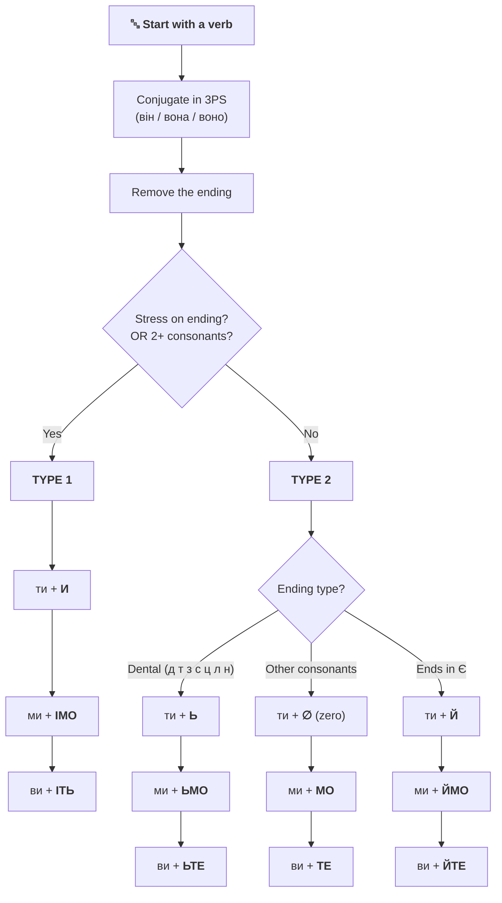
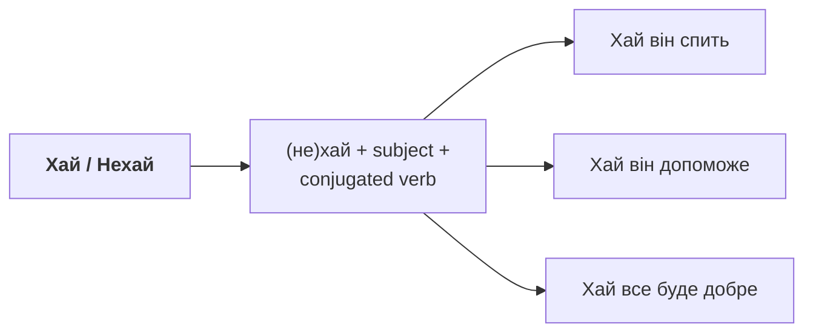
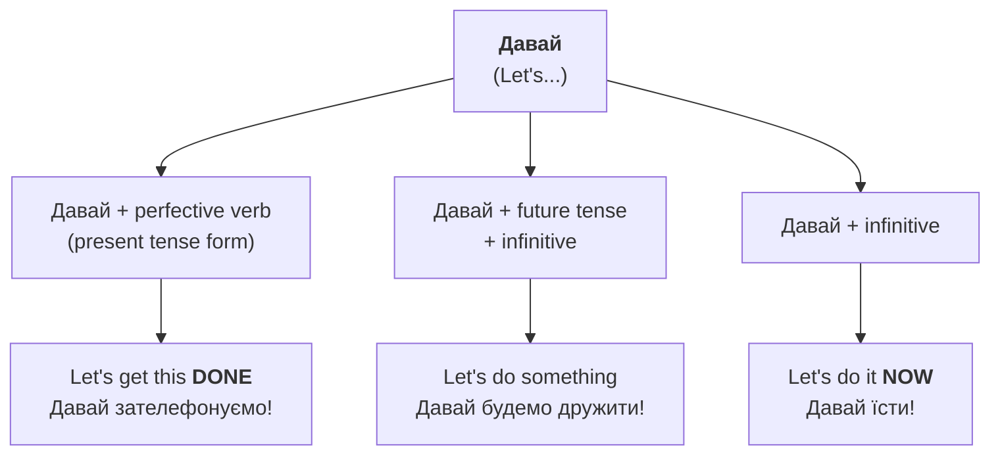

import Quiz from '@site/src/components/Quiz';
import MatchUp from '@site/src/components/MatchUp';
import FillIn from '@site/src/components/FillIn';
import TrueFalse from '@site/src/components/TrueFalse';
import Unjumble from '@site/src/components/Unjumble';
import GroupSort from '@site/src/components/GroupSort';
import Anagram from '@site/src/components/Anagram';
import ErrorCorrection, { ErrorCorrectionItem } from '@site/src/components/ErrorCorrection';
import Cloze from '@site/src/components/Cloze';
import Select from '@site/src/components/Select';
import Translate from '@site/src/components/Translate';
import MarkTheWords, { MarkTheWordsActivity } from '@site/src/components/MarkTheWords';
import HighlightMorphemes, { HighlightMorphemesActivity } from '@site/src/components/HighlightMorphemes';
import EssayResponse from '@site/src/components/EssayResponse';
import ComparativeStudy from '@site/src/components/ComparativeStudy';
import ReadingActivity from '@site/src/components/ReadingActivity';
import CriticalAnalysis from '@site/src/components/CriticalAnalysis';
import AuthorialIntent from '@site/src/components/AuthorialIntent';
import SourceEvaluation from '@site/src/components/SourceEvaluation';
import Debate from '@site/src/components/Debate';

## Introduction / Вступ

**Ласкаво просимо до модуля про енергію дії!** У повсякденному житті ми постійно звертаємося до інших: просимо допомоги, даємо поради, запрошуємо до спільної дії або висловлюємо добрі побажання. В українській мові для цього використовується **наказовий спосіб**. Це не лише про "накази" в армійському сенсі; це про волю мовця, виражену через дієслово. Ви вже знаєте прості форми як «Скажіть, будь ласка» або «Читайте!». Сьогодні ми підемо далі та вивчимо повну систему: від делікатних запрошень «ходімо» до урочистих побажань «хай живе!». Вміння правильно використовувати ці форми зробить вашу українську мову точною, ввічливою та надзвичайно живою.

You already know some commands from A1 like «Скажіть, будь ласка» (Say, please) or «Читайте!» (Read!). But how do you form these imperatives yourself for any verb? How do you say «Let's go!» or «Let him decide»? This lesson teaches you the complete Ukrainian imperative system. In Ukrainian, the imperative mood reflects the speaker's willpower, ranging from a direct command to a warm, indirect wish. Mastering these forms allows you to command your surroundings, collaborate with friends, and offer sincere blessings. It's time to learn how to put words into action!

**Що ви вивчите в цьому модулі:**

- Творення наказового способу для 2-ї особи (**ти/ви**) за правилами основ.
- Форму для спільної дії (**ми**) — українське «let's...».
- Використання часток **хай** та **нехай** для 3-ї особи та побажань.
- Нерегулярні, але дуже часті форми: **їж**, **пий**, **будь**, **дай**.
- Як залишатися ввічливим, даючи команди чи поради.

## Presentation / Презентація

### 1. Direct Commands: The Core System (2-га особа: ти/ви)

#### The Algorithm / Алгоритм творення

To form the imperative, follow this systematic approach:

#### Step-by-Step / Крок за кроком

**Крок 1:** Візьміть дієслово та поставте його в 3-ю особу однини (він/вона/воно).

**Крок 2:** Видаліть закінчення, щоб отримати основу.

**Крок 3:** Визначте тип дієслова за наголосом та приголосними.

---

#### TYPE 1: Stress on Ending OR Consonant Cluster / Наголос на закінченні АБО група приголосних

If the verb has **stress on the ending** in present tense, OR has **two or more consonants** before the ending, use these suffixes:

| Особа | Закінчення | Приклад |
|-------|------------|---------|
| ти | **-и** | говор**и**! пиш**и**! |
| ми | **-імо** | говор**імо**! пиш**імо**! |
| ви | **-іть** | говор**іть**! пиш**іть**! |

**Приклади:**
- говор**ять** (stress on -ять) → говор**и**! / говор**імо**! / говор**іть**!
- пиш**уть** (stress on -уть) → пиш**и**! / пиш**імо**! / пиш**іть**!
- крикн**уть** (consonant cluster -кн-) → крикн**и**! / крикн**імо**! / крикн**іть**!

---

#### TYPE 2: No Stress on Ending / Наголос НЕ на закінченні

If the stress falls on the **root** (not the ending), you have three sub-types:

##### 2a. Dental Consonants / Зубні приголосні

:::tip[💡 **Mnemonic / Мнемоніка**]
**«Де ти з'їси ці лини?»** — This phrase contains all dental consonants: **д, т, з, с, ц, л, н**
:::

For stems ending in dental consonants, add **soft sign** (ь):

| Особа | Закінчення | Приклад |
|-------|------------|---------|
| ти | **-ь** | сяд**ь**! стан**ь**! |
| ми | **-ьмо** | сяд**ьмо**! стан**ьмо**! |
| ви | **-ьте** | сяд**ьте**! стан**ьте**! |

**Приклади:**
- сід**ати** → сяд**ь**! / сяд**ьмо**! / сяд**ьте**!
- ста**ти** → стан**ь**! / стан**ьмо**! / стан**ьте**!
- різ**ати** → ріж**ь**! / ріж**ьмо**! / ріж**ьте**!

##### 2b. Zero Ending / Нульове закінчення

For other consonants (not dental), use **zero ending** for ти:

| Особа | Закінчення | Приклад |
|-------|------------|---------|
| ти | **∅** (zero) | готу́й! працю́й! |
| ми | **-мо** | готу́ймо! працю́ймо! |
| ви | **-те** | готу́йте! працю́йте! |

##### 2c. Stems Ending in -є / Основа на -є

For verbs whose stem ends in **-є**, add **-й**:

| Особа | Закінчення | Приклад |
|-------|------------|---------|
| ти | **-й** | чита**й**! дума**й**! |
| ми | **-ймо** | чита**ймо**! дума**ймо**! |
| ви | **-йте** | чита**йте**! дума**йте**! |

**Приклади:**
- чита**ють** → чита**й**! / чита**ймо**! / чита**йте**!
- дума**ють** → дума**й**! / дума**ймо**! / дума**йте**!
- зна**ють** → зна**й**! / зна**ймо**! / зна**йте**!

### 2. The Invitation Form: "Let's..." (1-ша особа множини: ми)

Ukrainian doesn't need a helping word like "let's." We have a unique suffix **-мо** that we add to the singular imperative form. It sounds much more authentic than the common mistake of saying «Давай...».

В українській мові для форми «давайте зробимо» ми просто додаємо суфікс **-мо** до форми однини. Це звучить природно та по-українськи! Наприклад: «Ходімо!» (Let's go!), «Пишімо!» (Let's write!).

- Йди -> **Йдімо! / Ходімо!**
- Читай -> **Читаймо!**
- Пиши -> **Пишімо!**
- Почни -> **Почнімо!**

### 3. Indirect Wishes: Let It Be! (3-тя особа: хай/нехай)

When you want to express a command or wish for someone not present (he, she, they), we use the particles **хай** or **нехай** followed by the regular present tense verb.

Коли потрібно висловити команду для когось відсутнього, використовуйте частки **хай** або **нехай**. Додайте дієслово у теперішньому часі.

- **хай** — розмовний стиль, неформально.
- **нехай** — урочистий, літературний, поетичний стиль.

**Приклади:**

- **Хай** він сам вирішує. *(Let him decide himself.)*
- **Нехай** здійсняться ваші мрії! *(May your dreams come true!)*
- **Хай** живе Україна! *(Long live Ukraine!)*
- **Хай** вона відпочине. *(Let her rest.)*
- **Нехай** буде світло! *(Let there be light!)*

### 3b. The "Давай" Constructions / Конструкції з «давай»

Another way to express "Let's..." is using **давай/давайте**. This is common in spoken Ukrainian and has three patterns:

| Конструкція | Значення | Приклад |
|-------------|----------|---------|
| Давай + pf. verb (present) | Let's get this done | Давай **зателефонуємо**! |
| Давай + будемо + infinitive | Let's do something | Давай **будемо дружити**! |
| Давай + infinitive | Let's do it now | Давай **їсти**! |

:::tip[💡 **Давай vs -мо forms**]
**Давай** can often be replaced with the native **-мо** imperative:
- Давай танцювати → **Танцюймо!**
- Давай йти → **Ходімо!**

The **-мо** form sounds more natural and literary in Ukrainian!
:::

### 4. Irregular Imperative Stars (Винятки)

Some of the most used verbs in daily life have slightly unique imperative forms. You should memorize these as "survival" vocabulary.

| Інфінітив | Ти (однина) | Ви (множина) | Переклад |
| :-------- | :------------ | :----------- | :------- |
| **їсти**  | **їж**        | **їжте**     | eat      |
| **пити**  | **пий**       | **пийте**    | drink    |
| **дати**  | **дай**       | **дайте**    | give     |
| **бути**  | **будь**      | **будьте**   | be       |
| **взяти** | **візьми**    | **візьміть** | take     |

:::tip[💡 **Proverb: Be Patient**]
«Сім раз **відмір**, один раз **відріж**.» (Measure seven times, cut once.) This proverb uses two imperatives to teach us the value of deliberation. Notice the suffix **-ь** (softening) in both verbs!
:::

:::warning[❗ **The Politeness Formula**]
Direct commands can sound sharp. To soften them, always add **будь ласка** (please). In Ukrainian, "Дай мені воду, будь ласка" is perfectly polite. You can also use **прошу** followed by an infinitive: «Прошу зайти» (Please, come in).
:::

## Practice / Практика

### 1. Form the Command (Утворіть форму)

Change these infinitives into the imperative form for the specified person.

1. читати (ви) -> **читайте**
2. писати (ти) -> **пиши**
3. говорити (ми) -> **говорімо**
4. бути (ви) -> **будьте**
5. дати (хай + він) -> **хай дасть** (Wait, no: **хай дасть** / **хай дає** depending on aspect). Correct: **Хай дає!**
6. йти (ми) -> **ходімо**

### 2. Negative Commands: Don't! (Заперечення)

To tell someone NOT to do something, just add **не** before the imperative.

1. Читайте! -> **Не читайте!**
2. Кричи! -> **Не кричи!**
3. Забудь! -> **Не забудь!**
4. Хвилюйся! -> **Не хвилюйся!** (Don't worry!)

### 3. Recipe Instructions: Borscht (Рецепт борщу)

Put the verbs in the imperative (ви-form) to give instructions.
*(наріжте, варіть, додайте, почистіть)*

1. Спочатку \_\_\_ овочі. -> **почистіть**
2. Потім дрібно \_\_\_ їх. -> **наріжте**
3. \_\_\_ м'ясо в каструлі. -> **варіть**
4. Нарешті \_\_\_ сметану. -> **додайте**

:::info[🤔 **The Power of Authority**]
When you use the imperative, you are taking charge of the situation. Whether you are leading a project or just asking a favor, the clarity of your command shows your confidence in the language. Командний голос — це голос лідера!
:::

:::tip[💡 **Toasting with Wishes**]
At a Ukrainian party, use «хай» for toasts: «**Хай** ваші діти будуть здоровими!» or simply «**Хай** щастить!» (Good luck!). It makes your wishes sound ancient and sincere.
:::

## Dialogues / Діалоги

### Coordination in the Kitchen (На кухні)

**Мама:** Олег, **допоможи** мені, будь ласка! (Oleh, help me, please!)
**Олег:** Що робити? (What should I do?)
**Мама:** **Наріж** овочі для салату. А ви, діти, **не заважайте**! (Cut the vegetables for the salad. And you, children, don't get in the way!)
**Олег:** Добре. Мамо, **дай** мені гострий ніж. (Fine. Mom, give me the sharp knife.)
**Мама:** Ось, **візьми**. **Будь** обережним! (Here, take it. Be careful!)
**Олег:** **Не хвилюйся**, я вмію різати. **Почнімо** готувати вечерю! (Don't worry, I know how to cut. Let's start cooking dinner!)

:::info[🌍 **Social Hierarchy and Commands**]
In Ukrainian families, elders use the 2nd person singular (ти) to give direct commands to younger ones. Younger people respond with the 2nd person plural (ви) if speaking formally, or "ти" for close relatives. Adding "будь ласка" is the universal bridge for politeness regardless of age.
:::

## 📋 Summary / Підсумок

У цьому модулі ми навчилися керувати дією:

- Опанували творення наказової форми для **ти** та **ви**.
- Навчилися запрошувати до дії за допомогою форми **-мо** (ходімо, робімо).
- Дізналися, як висловлювати побажання іншим через **хай/нехай**.
- Запам'ятали ключові винятки: **дай**, **будь**, **їж**, **пий**.
- Навчилися пом'якшувати команди ввічливими словами.

You've learned the complete Ukrainian imperative system! This is a major structural component of the language. Use it to participate in life—give advice, make suggestions, and offer warm wishes. Your Ukrainian is now more functional and authoritative!

## Need More Practice?

Подивіться на свій розклад на завтра. Напишіть п'ять команд самому собі, використовуючи форму «ти». Наприклад: «Прокинься о сьомій», «Пий воду», «Пиши плани». Також придумайте одне велике побажання для своєї родини з часткою «нехай». Постійна практика перетворює правила на звичку! Удачі у ваших нових справах!

---

## Quick Reference / Швидка довідка

*Flowchart credit: Ukrainian language teaching materials*

## 🎯 Activities

### Утворіть наказову форму

<FillIn items={JSON.parse(`[{"sentence": "читати → ___ (ти)", "answer": "читай", "options": ["читай", "читаю", "читати", "читайте"]}, {"sentence": "писати → ___ (ти)", "answer": "пиши", "options": ["пиши", "пишу", "писай", "пишіть"]}, {"sentence": "говорити → ___ (ти)", "answer": "говори", "options": ["говори", "говорю", "говорий", "говоріть"]}, {"sentence": "їсти → ___ (ти)", "answer": "їж", "options": ["їж", "їм", "їсти", "їжте"]}, {"sentence": "дати → ___ (ти)", "answer": "дай", "options": ["дай", "даю", "дати", "дайте"]}, {"sentence": "бути → ___ (ти)", "answer": "будь", "options": ["будь", "буду", "бути", "будьте"]}, {"sentence": "читай → ___ (ви)", "answer": "читайте", "options": ["читайте", "читають", "читаймо", "читай"]}, {"sentence": "пиши → ___ (ви)", "answer": "пишіть", "options": ["пишіть", "пишуть", "пишимо", "пиши"]}]`)} />

### Наказові частки

<MatchUp pairs={JSON.parse(`[{"left": "хай", "right": "розмовний стиль"}, {"left": "нехай", "right": "літературний стиль"}, {"left": "Хай щастить!", "right": "Good luck!"}, {"left": "Нехай буде так.", "right": "So be it."}, {"left": "Хай живе!", "right": "Long live!"}, {"left": "Хай він вирішує.", "right": "Let him decide."}, {"left": "Нехай вона відпочине.", "right": "Let her rest."}, {"left": "Хай там що.", "right": "Whatever happens."}, {"left": "Хай буде!", "right": "Let it be!"}, {"left": "Нехай живе!", "right": "Long live!"}]`)} />

### Доповніть хай або нехай

<FillIn items={JSON.parse(`[{"sentence": "___ діти граються в парку.", "answer": "Хай", "options": ["Хай", "Читай", "Робіть", "Пиши"]}, {"sentence": "___ здійсняться всі ваші мрії!", "answer": "Нехай", "options": ["Нехай", "Говори", "Читаймо", "Пишіть"]}, {"sentence": "___ він сам вирішує це питання.", "answer": "Хай", "options": ["Хай", "Робіть", "Говоріть", "Пиши"]}, {"sentence": "___ студенти відпочинуть після іспиту.", "answer": "Хай", "options": ["Хай", "Читаймо", "Робіть", "Говори"]}, {"sentence": "___ живе дружба між народами!", "answer": "Нехай", "options": ["Нехай", "Говоріть", "Читай", "Пишіть"]}, {"sentence": "___ вона зателефонує пізніше.", "answer": "Хай", "options": ["Хай", "Робімо", "Говори", "Читай"]}, {"sentence": "___ клієнт почекає.", "answer": "Хай", "options": ["Хай", "Читайте", "Робіть", "Пиши"]}, {"sentence": "___ тобі щастить!", "answer": "Хай", "options": ["Хай", "Говори", "Читай", "Робіть"]}]`)} />

### Розсортуйте за стилем

<GroupSort groups={JSON.parse(`{"Розмовний": ["Хай він приходить.", "Хай щастить!", "Хай там що.", "Хай діти грають.", "Хай буде так.", "Хай він вирішує."], "Літературний": ["Нехай буде так.", "Нехай здійсняться мрії.", "Нехай живе Україна!", "Нехай вона відпочине.", "Нехай студенти працюють.", "Нехай тобі щастить!"]}`)} />

### Розуміння наказового способу

<Quiz questions={JSON.parse(`[{"question": "Які українські частки використовуються для утворення наказового способу 3-ї особи?", "options": [{"text": "хай / нехай", "correct": true}, {"text": "якщо / якби", "correct": false}, {"text": "чи / або", "correct": false}, {"text": "і / а", "correct": false}], "explanation": ""}, {"question": "Яка з двох часток наказового способу вважається більш офіційною та літературною?", "options": [{"text": "нехай", "correct": true}, {"text": "хай", "correct": false}, {"text": "обидві однаково", "correct": false}, {"text": "жодна", "correct": false}], "explanation": ""}, {"question": "Що означає українське побажання «Хай щастить!» англійською мовою?", "options": [{"text": "Good luck!", "correct": true}, {"text": "Goodbye!", "correct": false}, {"text": "Thank you!", "correct": false}, {"text": "Hello!", "correct": false}], "explanation": ""}, {"question": "Як правильно утворити наказовий спосіб для третьої особи в українській мові?", "options": [{"text": "хай/нехай + теперішній час", "correct": true}, {"text": "хай/нехай + інфінітив", "correct": false}, {"text": "хай/нехай + минулий час", "correct": false}, {"text": "хай/нехай + майбутній час", "correct": false}], "explanation": ""}, {"question": "Яка форма наказового способу від дієслова «читати» для третьої особи є правильною?", "options": [{"text": "Хай він читає.", "correct": true}, {"text": "Хай він читати.", "correct": false}, {"text": "Хай він читав.", "correct": false}, {"text": "Хай він читатиме.", "correct": false}], "explanation": ""}, {"question": "Що означає українське побажання «Нехай буде так» англійською мовою?", "options": [{"text": "So be it.", "correct": true}, {"text": "Let me see.", "correct": false}, {"text": "Go away.", "correct": false}, {"text": "Come here.", "correct": false}], "explanation": ""}, {"question": "У яких ситуаціях краще використовувати частку «нехай» замість «хай»?", "options": [{"text": "у літературі, офіційно", "correct": true}, {"text": "тільки з друзями", "correct": false}, {"text": "ніколи", "correct": false}, {"text": "завжди", "correct": false}], "explanation": ""}, {"question": "Яка форма наказового способу від «робити» для 3-ї особи множини є правильною?", "options": [{"text": "Хай роблять!", "correct": true}, {"text": "Хай робить!", "correct": false}, {"text": "Хай робити!", "correct": false}, {"text": "Хай робив!", "correct": false}], "explanation": ""}]`)} />

### Складіть речення

<Unjumble items={JSON.parse(`[{"jumbled": "він / хай / сам / вирішує / це / важливе / питання / сьогодні", "answer": "Хай він сам вирішує це важливе питання сьогодні."}, {"jumbled": "приходять / гості / нехай / о сьомій / годині / на вечерю / до нас", "answer": "Нехай гості приходять до нас на вечерю о сьомій годині."}, {"jumbled": "діти / хай / граються / в парку / разом / весело / після школи", "answer": "Хай діти весело граються в парку разом після школи."}, {"jumbled": "буде / нехай / так / як / ми / домовилися / з тобою / вчора", "answer": "Нехай буде так, як ми домовилися з тобою вчора."}, {"jumbled": "щастить / хай / тобі / на / новій / роботі / у Львові", "answer": "Хай тобі щастить на новій роботі у Львові."}, {"jumbled": "вона / хай / зателефонує / пізніше / коли / буде / вільний час", "answer": "Хай вона зателефонує пізніше, коли буде вільний час."}]`)} />

### Виправте помилки

<ErrorCorrection>
  <ErrorCorrectionItem sentence="Хай він читати книгу." errorWord="читати" correctForm="читає" options={JSON.parse(`["читає", "читати", "читав", "читай"]`)} explanation="Після хай/нехай — теперішній час, не інфінітив." />
  <ErrorCorrectionItem sentence="Нехай вони приходили вчасно." errorWord="приходили" correctForm="приходять" options={JSON.parse(`["приходять", "приходили", "прийшли", "приходьте"]`)} explanation="Наказовий 3-ї особи — теперішній час." />
  <ErrorCorrectionItem sentence="Хай студенти робили домашнє завдання." errorWord="робили" correctForm="роблять" options={JSON.parse(`["роблять", "робили", "зробили", "робіть"]`)} explanation="Після хай — теперішній час." />
  <ErrorCorrectionItem sentence="Нехай він говорив українською." errorWord="говорив" correctForm="говорить" options={JSON.parse(`["говорить", "говорив", "говорити", "говори"]`)} explanation="Наказовий 3-ї особи — теперішній час." />
  <ErrorCorrectionItem sentence="Хай вона писати листа." errorWord="писати" correctForm="пише" options={JSON.parse(`["пише", "писати", "писала", "пиши"]`)} explanation="Після хай — теперішній час." />
  <ErrorCorrectionItem sentence="Нехай діти спали добре." errorWord="спали" correctForm="сплять" options={JSON.parse(`["сплять", "спали", "спати", "спіть"]`)} explanation="Теперішній час, не минулий." />
</ErrorCorrection>

### Доповніть діалог

<Cloze passage={"— Директор хоче бачити Марію.\n— Її зараз немає. Вона на [___:0].\n— [___:1] вона зателефонує, коли повернеться.\n— Добре, [___:2].\n— А що робити з [___:3]?\n— [___:4] лежать на столі. Я подивлюся пізніше.\n— Гаразд. [___:5] він сам вирішує.\n— Так, [___:6] буде так.\n— [___:7] щастить з проєктом!\n— Дякую! [___:8] все буде добре.\n— І [___:9] гості приходять вчасно.\n— Обов'язково. [___:10] живе наша команда!\n— [___:11] здійсняться всі плани!\n"} blanks={JSON.parse(`[{"index": 0, "answer": "зустрічі", "options": ["зустрічі", "обіді", "роботі", "зустрічі"]}, {"index": 1, "answer": "Хай", "options": ["Хай", "Якщо", "Коли", "Хай"]}, {"index": 2, "answer": "передам", "options": ["передам", "передаю", "передати", "передам"]}, {"index": 3, "answer": "документами", "options": ["документами", "книгами", "листами", "документами"]}, {"index": 4, "answer": "Хай", "options": ["Хай", "Нехай", "Якби", "Хай"]}, {"index": 5, "answer": "Хай", "options": ["Хай", "Нехай", "Якщо", "Хай"]}, {"index": 6, "answer": "нехай", "options": ["нехай", "хай", "якби", "нехай"]}, {"index": 7, "answer": "Хай", "options": ["Хай", "Нехай", "Якщо", "Хай"]}, {"index": 8, "answer": "Нехай", "options": ["Нехай", "Хай", "Якби", "Нехай"]}, {"index": 9, "answer": "хай", "options": ["хай", "нехай", "якщо", "хай"]}, {"index": 10, "answer": "Хай", "options": ["Хай", "Нехай", "Якби", "Хай"]}, {"index": 11, "answer": "Нехай", "options": ["Нехай", "Хай", "Якщо", "Нехай"]}]`)} />

### Перекладіть українською

<Translate questions={JSON.parse(`[{"source": "Let him decide.", "options": [{"text": "Хай він вирішує.", "correct": true}, {"text": "Він вирішує.", "correct": false}, {"text": "Вирішуй!", "correct": false}]}, {"source": "May your dream come true!", "options": [{"text": "Нехай здійсниться твоя мрія!", "correct": true}, {"text": "Твоя мрія здійснюється.", "correct": false}, {"text": "Мрій далі!", "correct": false}]}, {"source": "Let them come at seven.", "options": [{"text": "Хай вони приходять о сьомій.", "correct": true}, {"text": "Вони приходять о сьомій.", "correct": false}, {"text": "Приходьте о сьомій.", "correct": false}]}, {"source": "Good luck!", "options": [{"text": "Хай щастить!", "correct": true}, {"text": "Щастить!", "correct": false}, {"text": "До побачення!", "correct": false}]}, {"source": "Let her rest.", "options": [{"text": "Нехай вона відпочине.", "correct": true}, {"text": "Вона відпочиває.", "correct": false}, {"text": "Відпочинь!", "correct": false}]}, {"source": "Let the children play.", "options": [{"text": "Хай діти грають.", "correct": true}, {"text": "Діти грають.", "correct": false}, {"text": "Грайте, діти!", "correct": false}]}]`)} />

### Правда чи ні?

<TrueFalse items={JSON.parse(`[{"statement": "Хай використовується в офіційних документах.", "isTrue": false, "explanation": "У офіційних документах частіше використовується нехай."}, {"statement": "Нехай — це літературна форма.", "isTrue": true, "explanation": "Нехай частіше зустрічається в літературі."}, {"statement": "Після хай вживається інфінітив.", "isTrue": false, "explanation": "Після хай вживається теперішній час 3-ї особи."}, {"statement": "«Хай щастить!» означає «Good luck!»", "isTrue": true, "explanation": "Це типове побажання удачі."}, {"statement": "Хай і нехай мають різні значення.", "isTrue": false, "explanation": "Вони мають однакове значення, але різний стиль."}, {"statement": "Хай він читає — правильна форма.", "isTrue": true, "explanation": "Це правильний наказовий спосіб 3-ї особи."}, {"statement": "Наказовий спосіб 3-ї особи використовує минулий час.", "isTrue": false, "explanation": "Він використовує теперішній час."}, {"statement": "«Хай живе!» — типовий вираз зі словом хай.", "isTrue": true, "explanation": "Це поширений вираз, наприклад «Хай живе Україна!»"}]`)} />

## 📚 Vocabulary

| Word | IPA | English | POS | Gender | Note |
| --- | --- | --- | --- | --- | --- |
| вибачення | /ʋˈɪbat͡ʃɛnnja/ | apology, forgiveness | noun | с |  |
| здійснитися | /zdijsnˈɪtɪsja/ | to come true, to happen | verb |  |  |
| калька | /kˈalʲka/ | tracing paper, loan translation (calque) | noun | ж |  |
| нехай | /nɛxˈaj/ | let, may (particle) | part |  |  |
| побажання | /pɔbaʒˈannja/ | wish, desire | noun |  |  |
| приміряти | /prɪmirjatɪ/ | to try on (clothes) | verb |  |  |
| сам | /sam/ | self, alone | pron |  |  |
| хаяти | /xaj/ | to criticize | part |  |  |
| часть | /t͡ʃastʲ/ | part | noun | ж |  |
| щастити | /ʃt͡ʃastˈɪtɪ/ | to be lucky | verb |  |  |
| робити | /roˈbɪtɪ/ | to do, to make | verb |  |  |
| писати | /pɪˈsatɪ/ | to write | verb |  |  |
| давайте | /daˈvajtɛ/ | let's, come on (imperative plural) | verb |  |  |
| показати | /pokaˈzatɪ/ | to show (perfective) | verb |  |  |
| взяти | /ˈvzʲatɪ/ | to take (perfective) | verb |  |  |
| читати | /t͡ʃɪˈtatɪ/ | to read | verb |  |  |
| говорити | /ɦovoˈrɪtɪ/ | to speak, to talk | verb |  |  |
| ставити | /ˈstavɪtɪ/ | to put, to place | verb |  |  |
| сідати | /siˈdatɪ/ | to sit down | verb |  |  |
| іти | /iˈtɪ/ | to go (on foot) | verb |  |  |
| ходити | /xoˈdɪtɪ/ | to walk, to go (multidirectional) | verb |  |  |
| починати | /pot͡ʃɪˈnatɪ/ | to begin, to start | verb |  |  |
| вирішувати | /vɪriˈʃuvatɪ/ | to decide, to solve | verb |  |  |
| їсти | /ˈjistɪ/ | to eat | verb |  |  |
| пити | /ˈpɪtɪ/ | to drink | verb |  |  |
| дати | /ˈdatɪ/ | to give (perfective) | verb |  |  |
| бути | /ˈbutɪ/ | to be | verb |  |  |
| хай | /xaj/ | let, may (particle) | particle |  |  |
| взяти | /ˈvzʲatɪ/ | to take (perfective) | verb |  |  |
| просити | /prˈɔsɪtɪ/ | to ask, to request | verb |  |  |
| послухати | /pɔslˈuxatɪ/ | to listen (perfective) | verb |  |  |
| зачекати | /zat͡ʃɛkˈatɪ/ | to wait (perfective) | verb |  |  |
| сказати | /skˈazatɪ/ | to say, to tell (perfective) | verb |  |  |
| пояснити | /pojasnˈɪtɪ/ | to explain (perfective) | verb |  |  |
| повторити | /pɔʋtɔrˈɪtɪ/ | to repeat (perfective) | verb |  |  |
| спробувати | /sprɔbуʋatɪ/ | to try | verb |  |  |
| приносити | /prɪnˈɔsɪtɪ/ | to bring (imperfective) | verb |  |  |
| принести | /prɪnɛstˈɪ/ | to bring (perfective) | verb |  |  |
| залишити | /zalɪʃˈɪtɪ/ | to leave (perfective) | verb |  |  |
| передати | /pɛrɛdˈatɪ/ | to pass, to give (perfective) | verb |  |  |